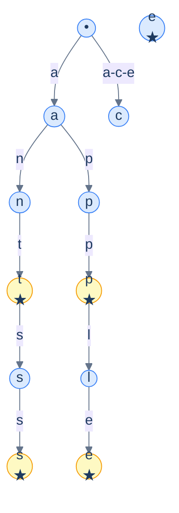
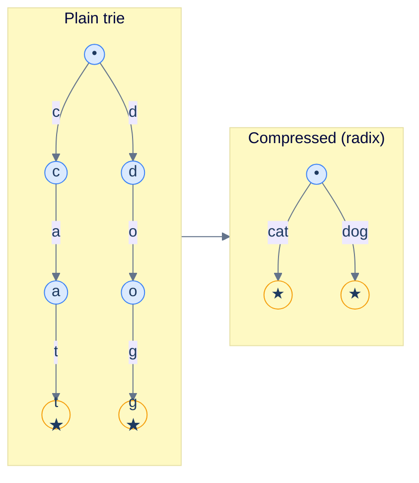

# 1. Introduction to Tries

## The Hook

Type `ne` into a Google search box. Before your finger leaves the `e`, ten suggestions appear: `netflix`, `news`, `nest`, `nest thermostat`, `netherlands`, … . The dictionary behind that drop-down has hundreds of millions of words and phrases. Yet the lookup is instant — measured in microseconds, not milliseconds.

A hash table can't do this. A hash table maps `"netflix"` to its data; it can't enumerate everything that *starts with* `ne`. A sorted array of words can — you binary-search to the first word starting with `ne`, then walk forward — but that's O(log N + K) where N is the dictionary and K is the number of matches. A balanced BST has the same problem.

The structure that makes prefix queries cost only **O(length of the prefix)**, regardless of how many words are stored, is the **trie** (pronounced "try", from *retrieval*). Every autocomplete, every IP routing table, every spell-checker that suggests "did you mean…", every regex engine that compiles patterns to a state machine — they all run on a trie or one of its compressed cousins.

This chapter is the introduction. By the end you'll be able to insert, search, and prefix-walk a trie in five languages, decide when a trie beats a hash table or a BST, and recognise the trie shape inside Linux's IP routing code.

---

## Table of contents

1. [The prefix-search problem](#the-prefix-search-problem)
2. [The trie structure](#the-trie-structure)
3. [Operations](#operations)
4. [Implementation](#implementation)
5. [Compressed tries (radix trees)](#compressed-tries-radix-trees)
6. [Edge cases and pitfalls](#edge-cases-and-pitfalls)
7. [Production reality](#production-reality)
8. [Practice ladder](#practice-ladder)
9. [Cross-links](#cross-links)
10. [Final takeaway](#final-takeaway)

***

# The Prefix-Search Problem

A spell-checker has 100,000 English words. The user types `apple`. The spell-checker needs:

1. Is `apple` in the dictionary? (Spell check.)
2. What words start with `app`? (Autocomplete.)

A **hash set** of words handles question 1 in `O(1)` average, but it can't answer question 2 — there's no order to walk.

A **sorted array** handles question 1 with binary search (`O(log N + L)` where `L` is the word length, since string comparison is `O(L)`). It handles question 2 by binary-searching to the first matching prefix, then walking forward. But for a hot autocomplete path, even `log N` comparisons (each of which scans up to `L` characters of the candidate) can dominate.

A **trie** handles both questions in `O(L)` — *literally* the length of the input word, regardless of how many words are stored. With `L = 5` for `apple`, that's five pointer hops, no comparisons.

The trick: rather than storing whole words and comparing them, the trie stores the *common prefix structure* of every word, and lookup walks down the tree one character at a time.

***

# The Trie Structure

A trie is a tree where:

- The root represents the empty string.
- Each edge is labelled with a single character.
- Each node represents the string spelled by the path from the root to it.
- A node may be marked as the **end of a word** stored in the trie.



<p align="center"><strong>A trie containing <code>ant</code>, <code>ants</code>, <code>app</code>, <code>apple</code>. Yellow nodes are end-of-word markers. The shared prefix <code>a</code> is a single node — every word that starts with <code>a</code> reuses it.</strong></p>

The classical implementation has each node hold an array of `26` child pointers (one per lowercase letter), or a `Map<char, Node>` for arbitrary alphabets. Implementations make this trade explicitly:

- **Array of 26 pointers**: O(1) lookup of any child; ~208 bytes wasted per node on a 64-bit system if most children are null. Fast for English text. Dense.
- **Hash map of children**: O(1) average lookup, smaller memory for sparse children. Slower constant factor; harder to enumerate sorted children. Good for full Unicode.
- **Sorted vector of (char, pointer) pairs**: tiny memory, sorted iteration for free; O(log alphabet) lookup. Best for sparse trees.

Real systems pick based on the working set. The Linux kernel's IP-routing trie uses a *compact* array form. CPython's `unicodedata` module uses a packed multi-level lookup table.

***

# Operations

## Insert(`word`)

Walk from the root, character by character. If a child for the next character doesn't exist, allocate one. At the end, mark the final node as end-of-word.

`O(L)` time, `O(L)` space (worst case — when no character is shared with any existing word).

## Search(`word`) → `bool`

Walk from the root, character by character. If a child is missing, return `false`. At the end, return whether the final node is marked end-of-word.

`O(L)` time. Note: if you reach a node but it's *not* end-of-word, the word is not in the trie *as a complete word* — but its prefix may exist (e.g., `app` is a prefix of `apple`).

## StartsWithPrefix(`prefix`) → `bool`

Like search, but ignore the end-of-word marker. Return `true` as long as you can walk every character of the prefix without hitting a missing child.

`O(L)` time.

## EnumerateWithPrefix(`prefix`) → `[words]`

Walk to the end of the prefix as in `StartsWithPrefix`. From there, do a DFS, accumulating every word you find. This is the autocomplete operation.

`O(L + K · L_avg)` where `K` is the number of matching words and `L_avg` is their average length. The `L` to walk to the prefix node, then `K · L_avg` to construct each result string.

## Delete(`word`)

The fiddly one. Walk to the end of the word; un-mark it as end-of-word. Then walk *backward* from the end, deleting nodes if they have no children and are not themselves end-of-word for some other word.

`O(L)` time. The book-keeping is what makes this the operation most engineers get wrong on the first try — the `Edge cases` section below catalogues the bugs.

***

# Implementation

```pseudocode
class TrieNode:
    children: Map: Char → TrieNode
    isEndOfWord: Boolean

class Trie:
    root: TrieNode (empty)

    function insert(word):
        node ← root
        for ch in word:
            if ch is not in node.children:
                node.children[ch] ← new TrieNode
            node ← node.children[ch]
        node.isEndOfWord ← true

    function search(word):
        node ← walk(word)
        return node ≠ null AND node.isEndOfWord

    function startsWith(prefix):
        return walk(prefix) ≠ null

    function walk(s):
        node ← root
        for ch in s:
            if ch is not in node.children: return null
            node ← node.children[ch]
        return node
```

```python run
class TrieNode:
    __slots__ = ("children", "is_end")
    def __init__(self):
        self.children = {}
        self.is_end = False

class Trie:
    def __init__(self):
        self.root = TrieNode()

    def insert(self, word):
        node = self.root
        for ch in word:
            if ch not in node.children:
                node.children[ch] = TrieNode()
            node = node.children[ch]
        node.is_end = True

    def _walk(self, s):
        node = self.root
        for ch in s:
            if ch not in node.children:
                return None
            node = node.children[ch]
        return node

    def search(self, word):
        node = self._walk(word)
        return node is not None and node.is_end

    def starts_with(self, prefix):
        return self._walk(prefix) is not None

    def words_with_prefix(self, prefix):
        node = self._walk(prefix)
        if node is None:
            return []
        results = []
        def dfs(n, path):
            if n.is_end:
                results.append("".join(path))
            for ch, child in n.children.items():
                path.append(ch)
                dfs(child, path)
                path.pop()
        dfs(node, list(prefix))
        return results


if __name__ == "__main__":
    t = Trie()
    for w in ["apple", "app", "apt", "ant", "ants", "and"]:
        t.insert(w)

    print("search('app')      ->", t.search("app"))            # True
    print("search('ap')       ->", t.search("ap"))             # False (not a stored word)
    print("starts_with('ap')  ->", t.starts_with("ap"))        # True
    print("words with 'an'    ->", sorted(t.words_with_prefix("an")))    # ['and', 'ant', 'ants']
    print("words with 'apt'   ->", sorted(t.words_with_prefix("apt")))   # ['apt']
    print("words with 'xyz'   ->", t.words_with_prefix("xyz"))           # []
```

```java run
import java.util.*;

class Solution {
    static class TrieNode {
        Map<Character, TrieNode> children = new HashMap<>();
        boolean isEnd = false;
    }

    static class Trie {
        TrieNode root = new TrieNode();

        void insert(String word) {
            TrieNode node = root;
            for (char ch : word.toCharArray()) {
                node = node.children.computeIfAbsent(ch, k -> new TrieNode());
            }
            node.isEnd = true;
        }

        TrieNode walk(String s) {
            TrieNode node = root;
            for (char ch : s.toCharArray()) {
                node = node.children.get(ch);
                if (node == null) return null;
            }
            return node;
        }

        boolean search(String word) {
            TrieNode node = walk(word);
            return node != null && node.isEnd;
        }

        boolean startsWith(String prefix) {
            return walk(prefix) != null;
        }

        List<String> wordsWithPrefix(String prefix) {
            TrieNode node = walk(prefix);
            List<String> out = new ArrayList<>();
            if (node == null) return out;
            dfs(node, new StringBuilder(prefix), out);
            return out;
        }

        private void dfs(TrieNode n, StringBuilder path, List<String> out) {
            if (n.isEnd) out.add(path.toString());
            for (Map.Entry<Character, TrieNode> e : n.children.entrySet()) {
                path.append(e.getKey());
                dfs(e.getValue(), path, out);
                path.deleteCharAt(path.length() - 1);
            }
        }
    }

    public static void main(String[] args) {
        Trie t = new Trie();
        for (String w : new String[]{"apple", "app", "apt", "ant", "ants", "and"}) t.insert(w);
        System.out.println("search('app')      -> " + t.search("app"));
        System.out.println("search('ap')       -> " + t.search("ap"));
        System.out.println("starts_with('ap')  -> " + t.startsWith("ap"));
        List<String> ans = t.wordsWithPrefix("an");
        Collections.sort(ans);
        System.out.println("words with 'an'    -> " + ans);
    }
}
```

```c run
#include <stdio.h>
#include <stdlib.h>
#include <stdbool.h>
#include <string.h>

#define ALPHABET 26

typedef struct TrieNode {
    struct TrieNode *children[ALPHABET];
    bool is_end;
} TrieNode;

static TrieNode *new_node(void) {
    TrieNode *n = calloc(1, sizeof(TrieNode));
    return n;
}

static void insert(TrieNode *root, const char *word) {
    TrieNode *node = root;
    for (const char *p = word; *p; p++) {
        int idx = *p - 'a';
        if (!node->children[idx]) node->children[idx] = new_node();
        node = node->children[idx];
    }
    node->is_end = true;
}

static TrieNode *walk(TrieNode *root, const char *s) {
    TrieNode *node = root;
    for (const char *p = s; *p; p++) {
        int idx = *p - 'a';
        if (!node->children[idx]) return NULL;
        node = node->children[idx];
    }
    return node;
}

static bool search(TrieNode *root, const char *word) {
    TrieNode *n = walk(root, word);
    return n && n->is_end;
}

static bool starts_with(TrieNode *root, const char *prefix) {
    return walk(root, prefix) != NULL;
}

int main(void) {
    TrieNode *root = new_node();
    const char *words[] = {"apple", "app", "apt", "ant", "ants", "and"};
    for (int i = 0; i < 6; i++) insert(root, words[i]);
    printf("search('app')      -> %s\n", search(root, "app") ? "true" : "false");
    printf("search('ap')       -> %s\n", search(root, "ap") ? "true" : "false");
    printf("starts_with('ap')  -> %s\n", starts_with(root, "ap") ? "true" : "false");
    return 0;
}
```

```scala run
import scala.collection.mutable

object Solution {
  class TrieNode {
    val children = mutable.HashMap.empty[Char, TrieNode]
    var isEnd = false
  }

  class Trie {
    private val root = new TrieNode

    def insert(word: String): Unit = {
      var node = root
      for (ch <- word) {
        node = node.children.getOrElseUpdate(ch, new TrieNode)
      }
      node.isEnd = true
    }

    private def walk(s: String): Option[TrieNode] = {
      var node = root
      for (ch <- s) {
        node.children.get(ch) match {
          case Some(c) => node = c
          case None    => return None
        }
      }
      Some(node)
    }

    def search(word: String): Boolean = walk(word).exists(_.isEnd)
    def startsWith(prefix: String): Boolean = walk(prefix).isDefined

    def wordsWithPrefix(prefix: String): List[String] = {
      walk(prefix) match {
        case None => Nil
        case Some(start) =>
          val out = mutable.ListBuffer.empty[String]
          def dfs(n: TrieNode, path: StringBuilder): Unit = {
            if (n.isEnd) out += path.toString
            for ((ch, child) <- n.children) {
              path.append(ch); dfs(child, path); path.deleteCharAt(path.length - 1)
            }
          }
          dfs(start, new StringBuilder(prefix))
          out.toList
      }
    }
  }

  def main(args: Array[String]): Unit = {
    val t = new Trie
    for (w <- List("apple", "app", "apt", "ant", "ants", "and")) t.insert(w)
    println(s"search('app')      -> ${t.search("app")}")
    println(s"starts_with('ap')  -> ${t.startsWith("ap")}")
    println(s"words with 'an'    -> ${t.wordsWithPrefix("an").sorted}")
  }
}
```

***

# Compressed Tries (Radix Trees)

A plain trie wastes space when long runs of single-child nodes pile up. The word `internationalisation` consumes 20 nodes if it shares no prefix with anything else — a long chain of pointers each carrying one byte of payload.

A **compressed trie** (a.k.a. **radix tree** or **radix trie**) collapses every chain of single-child nodes into a single edge labelled with the *full substring*. A trie storing `internationalisation` as its only word becomes a *single edge* from the root to one end-of-word node, labelled with the whole 20-character string.



<p align="center"><strong>A plain trie storing <code>cat</code> and <code>dog</code> needs 6 nodes. A compressed (radix) trie needs 3.</strong></p>

The trade-off: insertion and deletion become more complex. Inserting `cap` into the compressed trie above means *splitting* the `cat` edge — replacing the single `cat` edge with a `ca` edge to a new internal node, then `t` and `p` edges from that internal node. The implementation is more involved, but operations remain `O(L)` time.

Variants worth knowing:

- **PATRICIA trie** (Practical Algorithm to Retrieve Information Coded in Alphanumeric): a binary radix trie used for IP routing tables. Each edge is labelled with a *bit position* to test, not a string. Tiny memory; fast longest-prefix-match.
- **Suffix tree**: a compressed trie over *every suffix* of a single string. Used in string-matching algorithms; covered in the [Strings module](/cortex/data-structures-and-algorithms/strings-suffix-array). Construction can be `O(L)` with Ukkonen's algorithm — non-trivial to implement.
- **Adaptive radix tree (ART)**: a more memory-efficient variant used in modern in-memory databases (HyPer, DuckDB). Each internal node uses one of four layouts (4, 16, 48, or 256 children) chosen by population count.

***

# Edge cases and pitfalls

- **Forgetting the end-of-word marker.** Without it, `app` and `apple` are indistinguishable in the trie — both are paths from the root, but only one is "stored". `search("ap")` should return `false`, not `true`.
- **Delete that doesn't unmark or re-marks.** A naive delete that only removes nodes can break: deleting `apple` from a trie containing `app` and `apple` should not delete the `app` path. The fix: only delete leaf nodes that aren't end-of-word for some other word.
- **Prefix iteration that doesn't accumulate the prefix.** A common bug is to start the DFS at the prefix node but pass an empty string instead of the prefix itself, returning `["le"]` instead of `["apple"]` for `prefix = "app"`.
- **Memory bloat from sparse tries.** A trie over English with 100k words has roughly 200k nodes if the alphabet is 26 (each node has 26 pointer slots, mostly null). On a 64-bit system, that's 200k × 208 bytes ≈ 40 MB — for 100k words that average 8 characters each (~800 KB of raw text). The compression overhead is real. Use a hash map of children, or a compressed/radix trie.
- **Unicode and locale.** A trie keyed by Python `str` characters works for ASCII trivially; for Unicode it works *if* you choose the right normalisation form (NFC vs NFD changes the character count). For case-insensitive search, lowercase before insertion *and* before lookup, but be careful with locale-dependent case (e.g., Turkish `İ` → `i̇`).
- **Threaded access.** A trie shared across threads needs locking; the per-node hash map is not thread-safe. For read-mostly workloads, a *persistent* (immutable) trie is sometimes the right answer.
- **Adversarial keys with no common prefix.** If you store `n` random 64-character keys with no overlap, the trie has `n × 64` nodes — same as just storing the strings. The trie only saves space when prefixes are shared.

***

# Production reality

- **Linux kernel's IP routing.** `lib/test_lpm.c` and `net/ipv4/fib_trie.c` use a variant of the LC-trie (Level-Compressed trie) for the routing table. Every packet sent or received hits this trie for longest-prefix match against destination IP. It's optimised aggressively — bit-level operations, NUMA-aware layout, RCU for lock-free reads on the fast path. The full source is a master-class in cache-friendly trie design.
- **Redis's autocomplete and zset prefix queries.** Redis stores sorted sets in a skip-list (we'll cover skip lists in the [Probabilistic module](/cortex/data-structures-and-algorithms/probabilistic-and-advanced-index)) for ordered queries. Pure prefix-search use cases (autocomplete) typically use the `RediSearch` module, which uses a trie internally.
- **Java's `String.intern()` and the string pool.** While not strictly a trie, the JVM's interned-string pool uses similar prefix-sharing tricks under the hood for memory savings.
- **DNS resolvers.** A DNS lookup walks a trie-like structure indexed by domain components: `mail.google.com` is resolved by walking from the root down `com` → `google` → `mail`. The structure is conceptually a trie keyed by domain labels.
- **Database B+-tree leaf prefix compression.** Postgres, MySQL, and InnoDB all do "prefix compression" on B+-tree leaf nodes — common prefixes among neighbouring keys are stored once. This is a flat-array variant of the radix-trie idea, applied to disk-block layouts. We'll see it again in the [B-tree chapter](/cortex/data-structures-and-algorithms/trees-b-tree-introduction-to-b-trees).
- **DuckDB and HyPer's ART.** Both modern in-memory analytical databases use the [Adaptive Radix Tree](https://db.in.tum.de/~leis/papers/ART.pdf) as their primary index structure, beating standard B-trees on point-query workloads in DRAM. The paper is very readable and worth a 30-minute scan.

***

# Practice ladder

1. **Implement Trie** ([LeetCode 208](https://leetcode.com/problems/implement-trie-prefix-tree/)) — write `insert`, `search`, `startsWith` from scratch.
   > *Hint:* this is exactly the chapter's implementation. Get a fast, working version on your own before reading reference code.

2. **Word Search II** ([LeetCode 212](https://leetcode.com/problems/word-search-ii/)) — given a 2D board of letters and a list of words, find all words present in the board (read as paths through 4-connected cells).
   > *Hint:* a hash-set lookup per cell is too slow because of repeated work. Build a trie over the words; DFS the board, descending the trie as you walk. The trie prunes the search tree dramatically.

3. **Replace Words** ([LeetCode 648](https://leetcode.com/problems/replace-words/)) — given a dictionary of root words and a sentence, replace every word in the sentence with its shortest root if any root is a prefix.
   > *Hint:* build a trie of the roots. For each word in the sentence, walk down the trie character by character; the *first* end-of-word node you hit is the shortest root.

4. **Implement Magic Dictionary** ([LeetCode 676](https://leetcode.com/problems/implement-magic-dictionary/)) — `search(word)` returns true iff exactly one character of `word` can be changed to match a stored word.
   > *Hint:* trie + DFS with an "edit budget" of 1.

5. **Stream of Characters** ([LeetCode 1032](https://leetcode.com/problems/stream-of-characters/)) — process a stream of characters and report after each char whether the suffix ending at this character matches any of a stored set of patterns.
   > *Hint:* build a trie of *reversed* patterns. Maintain a buffer of recently-seen characters; on each new char, try to walk the reversed-pattern trie from the new char backward.

***

# Cross-links

- **Prerequisites:** [Binary Tree](/cortex/data-structures-and-algorithms/trees-binary-tree-introduction-to-binary-trees), [Hash Table](/cortex/data-structures-and-algorithms/linear-structures-hash-table-introduction-to-hash-tables) (children-map alternative).
- **Used in:** [Strings module](/cortex/data-structures-and-algorithms/strings-index) — Aho-Corasick is a trie with failure links; suffix tree is a trie of suffixes.
- **Production deep-dive:** [DSA in Real Systems: Network Data Plane](/cortex/data-structures-and-algorithms/dsa-in-real-systems-network-data-plane) — *stub* — will tour Linux's `fib_trie.c` in detail.

***

# Final Takeaway

A trie is a tree whose paths spell strings. Three patterns to internalise:

1. **Cost is per-input-string-length, not per-dictionary-size.** A trie's lookup cost depends only on the query length, regardless of how many strings are stored. That's the property a hash table can't match.
2. **Compression matters.** Plain tries waste space on long single-child chains. Compressed (radix) tries collapse those chains; adaptive radix trees go further. For production-scale string data, the compressed variants dominate.
3. **Tries shine when prefixes are shared *and* you need prefix queries.** For pure exact-match lookups, a hash table is faster. For sorted iteration, a BST is simpler. Tries earn their place when "what starts with X?" is a common query.
