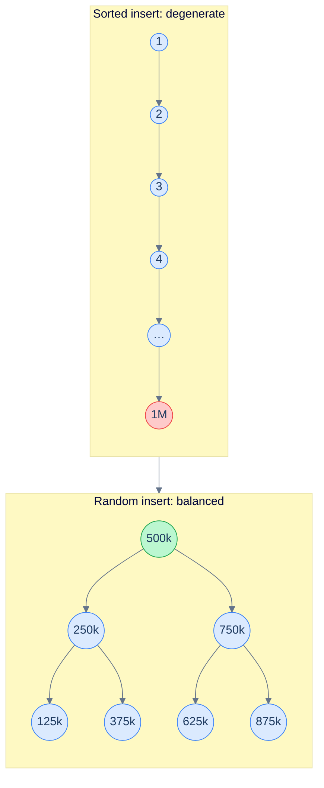
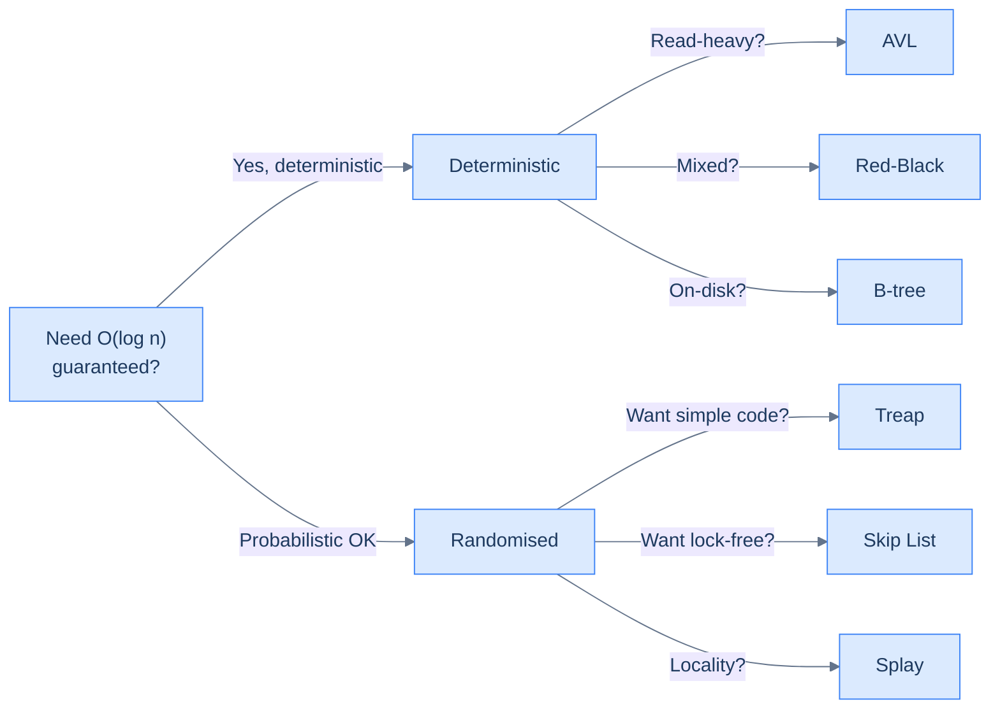

# 1. Self-Balancing BSTs — Overview

## The Hook

Insert the numbers `1, 2, 3, …, 1_000_000` into a plain BST.

What you get back is *not* a tree. It's a linked list — every new node hangs off the right of the previous one, the structure has a single root-to-leaf path of a million nodes, and a "BST search" for any key is a million pointer-chases. The `O(log n)` advertised in every BST chapter has degraded to `O(n)`. Insert, search, delete — all linear. The data structure that was supposed to be your indexed dictionary has become exactly the array you were trying to escape.

This is the *unbalanced-BST cliff*: the difference between adversarial-input behaviour and average-input behaviour is `n / log n` — a factor of `100,000` for a million-element tree. In production, the adversary doesn't have to be malicious. Sorted input arrives by *accident* every day: an `INSERT INTO ... ORDER BY` populating a fresh table, a sorted import file from a partner, a service catching up after a delay.

The fix is to make the tree **rebalance itself** as keys are inserted and deleted, keeping its height `O(log n)` regardless of input order. Doing this without trashing the `O(log n)` budget you're trying to preserve is the subject of this and the next four chapters. This overview is the map: what "balanced" means, what the menu of self-balancing trees looks like, and which one to reach for when.

---

## Table of contents

1. [The unbalanced-BST cliff](#the-unbalanced-bst-cliff)
2. [What "balanced" means](#what-balanced-means)
3. [The self-balancing menu](#the-self-balancing-menu)
4. [Comparison table](#comparison-table)
5. [When to reach for which](#when-to-reach-for-which)
6. [Production reality](#production-reality)
7. [Cross-links](#cross-links)
8. [Final takeaway](#final-takeaway)

***

# The unbalanced-BST cliff

A BST built from sorted input degenerates to a linked list. Build the worst-case input deliberately:

```python
class Node:
    def __init__(self, k): self.key, self.left, self.right = k, None, None

def insert(root, k):
    if root is None: return Node(k)
    if k < root.key: root.left = insert(root.left, k)
    else:            root.right = insert(root.right, k)
    return root

root = None
for x in range(1, 1_000_001):           # sorted insert
    root = insert(root, x)

# root.right.right.right.right…  (1M deep)
# search(target) walks 1M pointers
```



<p align="center"><strong>Same data, different insertion order. Sorted input collapses the BST to a list (height = n); random input gives a balanced tree (height ≈ log n). Operations become 10⁵× more expensive on the bad case.</strong></p>

The fix has to *guarantee* logarithmic height regardless of input order. That guarantee comes from extra invariants enforced by every insert and delete — invariants that, when restored after a mutation, force the tree into a roughly balanced shape.

***

# What "balanced" means

There's no single definition; different trees use different ones.

- **Height-balanced** (AVL): for every node, the heights of its left and right subtrees differ by at most 1.
- **Weight-balanced** (Red-Black, indirectly): every root-to-leaf path has roughly the same number of "black" nodes; height is bounded by `2 log n`.
- **Probabilistically balanced** (Treap, Skip List): the structure uses randomness so that for *any* input order, the *expected* height is `O(log n)`.
- **Amortized balanced** (Splay): individual operations might be deep, but a sequence of `m` operations on an `n`-node tree costs `O((m + n) log n)`. Amortized `O(log n)` per operation.

All four guarantee that, in their respective senses, height stays `O(log n)`. The differences are:

- **How tightly the bound holds.** AVL is the strictest — height is at most `1.44 log n`. Red-black is more relaxed — height is at most `2 log n`.
- **The cost of restoring the invariant.** AVL does up to `O(log n)` rotations on a single insert/delete (in practice usually 1–2). Red-black does at most 2 rotations per insert and 3 per delete (constant-bounded in the worst case).
- **Per-node overhead.** AVL stores a height (or balance factor) per node — typically 4 bytes. Red-black stores a single colour bit (often packed into a pointer's low bit). Treaps store a random priority — 4 bytes. Skip lists store an array of forward pointers — variable, but unbounded in expectation.

The decision between them is rarely about asymptotic complexity (they're all `O(log n)`). It's about constant factors, code complexity, and which one your standard library ships.

***

# The self-balancing menu

Five structures, each with a personality.

### AVL Tree

Strict height balance. Lookups are slightly faster than red-black (the tree is shallower). Insertions and deletions trigger more rotations on average. **Best for read-heavy workloads.** [Deep dive next](/cortex/data-structures-and-algorithms/trees-avl-tree-introduction-to-avl-trees).

### Red-Black Tree

Weight balance via colouring. Slightly taller than AVL but with cheaper updates. Most general-purpose. **Best for mixed read/write workloads, and what virtually every standard library ships** (Java's `TreeMap`, C++'s `std::map`, Linux's `lib/rbtree.c`). [Deep dive after AVL](/cortex/data-structures-and-algorithms/trees-red-black-tree-introduction-to-red-black-trees).

### B-Tree (and B+-tree)

Disk-aware: every node holds many keys (typically hundreds), tree fanout is high, height is tiny. **Best for on-disk indexes** (Postgres, MySQL, MongoDB) where each disk seek costs millions of cycles and you can amortise across hundreds of keys per seek. [Deep dive after RB-tree](/cortex/data-structures-and-algorithms/trees-b-tree-introduction-to-b-trees).

### Treap

A tree that's *also* a heap. Each node stores a random priority; the tree is BST-ordered on keys and heap-ordered on priorities. The randomness gives you `O(log n)` expected height for any input. **Best for situations where you want self-balancing without complex rotation logic** — implementing a treap is much simpler than RB-tree. [Covered in the Probabilistic module](/cortex/data-structures-and-algorithms/probabilistic-and-advanced-index).

### Splay Tree

Self-adjusting via splaying — every accessed node is moved to the root. Recently-accessed keys become cheap to access again. Amortized `O(log n)` per operation, but worst-case `O(n)`. **Best for workloads with strong locality** — think repeated lookups of recent keys. **Worst for latency-sensitive systems** because the per-operation worst case is `O(n)`.

### Skip List

Not a BST at all — it's a linked list with multiple "express lanes". Random in design, `O(log n)` expected per operation. **Best when you want simple code and don't mind probabilistic bounds.** Used in LevelDB, Redis sorted sets, and the Java `ConcurrentSkipListMap`. [Covered in the Probabilistic module](/cortex/data-structures-and-algorithms/probabilistic-and-advanced-index).



<p align="center"><strong>The decision tree for picking a self-balancing structure. The right answer depends on workload (read- vs write-heavy), storage (RAM vs disk), and constraints (latency-sensitive, lock-free, simple).</strong></p>

***

# Comparison table

| Structure | Worst-case insert/delete | Worst-case search | Per-node overhead | Code complexity |
|---|---|---|---|---|
| **AVL** | `O(log n)` | `O(log n)` | 4 bytes (height) | Medium-high |
| **Red-Black** | `O(log n)` | `O(log n)` | 1 bit (colour) | High |
| **B-Tree** | `O(log_b n)` (B = node fanout) | `O(log_b n)` | Per-node array | Medium |
| **Treap** | `O(log n)` expected | `O(log n)` expected | 4 bytes (priority) | Low |
| **Splay** | `O(n)` worst, `O(log n)` amortized | `O(n)` worst, `O(log n)` amortized | None | Low |
| **Skip List** | `O(log n)` expected | `O(log n)` expected | Variable (forward pointers) | Low |

A few non-obvious cells:

- **Skip list code is simpler than RB-tree code by a wide margin.** That's a big reason it shows up in concurrent contexts (`ConcurrentSkipListMap`) — lock-free RB-tree is research-level; lock-free skip list is well-understood.
- **B-tree's `O(log_b n)` with `b = 200`** means a B-tree with `1B` keys has height `~5`. That's the difference between 5 disk seeks and 30 disk seeks for a binary tree. The constant matters when each step costs milliseconds.
- **Splay trees worst-case `O(n)`** rules them out for real-time systems but makes them excellent for batch processing with locality.

***

# When to reach for which

The two-question decision tree:

**Question 1: Where does the data live?**
- *On disk:* B-tree (or B+-tree). Anything else hits the disk too many times.
- *In RAM:* go to question 2.

**Question 2: What's the workload shape?**
- *Read-heavy, latency-sensitive:* AVL (slightly shallower than RB) or RB (more common, easier to find a tested implementation).
- *Mixed read/write, latency-sensitive:* RB-tree.
- *Concurrent access pattern, low write contention:* skip list.
- *Strong access locality, throughput over tail latency:* splay tree.
- *Just need it to work, simple code beats slight perf:* treap or skip list.

**The default for "I need a sorted in-memory map" is RB-tree** — every standard library ships one (Java's `TreeMap`, C++'s `std::map`, Rust's `BTreeMap` is technically a B-tree, Go's standard library doesn't ship one but every third-party library uses RB or LLRB).

**The default for "I need a sorted on-disk index" is B+-tree** — every relational database uses one.

***

# Production reality

- **Linux kernel** (`lib/rbtree.c`): the workhorse. Used in the CFS scheduler (`kernel/sched/fair.c`), the page cache, the EPOLL implementation, the Direct-IO subsystem, and many more. The implementation is generic via macros; you embed an `rb_node` field in your struct and the rest is type-erased pointers. The scheduler uses an RB-tree keyed by `vruntime` (virtual runtime) to pick the leftmost (least-run) task in `O(log n)`.
- **Java's `TreeMap`** and `TreeSet` are red-black. Documented at `java.util.TreeMap`. Source is in `src/java.base/share/classes/java/util/TreeMap.java`.
- **C++ `std::map`** and `std::set` are red-black on essentially every implementation (libc++ confirms it; libstdc++ confirms it; MSVC's STL is documented to use RB).
- **Rust's `std::collections::BTreeMap`** is, despite the name, a B-tree (specifically a B-tree designed for in-memory use with a small node fanout). The name reflects the algorithm, not the storage medium.
- **Postgres B+-trees** (`src/backend/access/nbtree/`) are the default index type. Every `CREATE INDEX` without a specified method gets a B+-tree. The page size is 8 KB; node fanout is in the hundreds.
- **Redis sorted sets** (`zset`): a skip list, with a hash table sitting alongside for `O(1)` member-to-score lookup. The skip-list code is in `src/t_zset.c` — short, well-commented, the cleanest production skip-list source I know of.
- **LevelDB and RocksDB**: skip lists for the in-memory write buffer (`memtable`); LSM-tree-of-SSTables for the on-disk store. The skip list lets concurrent inserters proceed without locking the entire structure.
- **The Java `ConcurrentSkipListMap`** is the lock-free sorted map. Skip lists are easier to make concurrent than RB-trees because each node only needs to point to its successor, not to a parent.

***

# Memorize

The high-leverage facts to commit to long-term memory — atomic enough for an Anki card, concrete enough to recall under pressure or during production debugging. The decision tree below is the one to internalise: given a workload, which self-balancing structure?

## Quick recall

Click any question to reveal the answer.

<details>
<summary><strong>Q:</strong> What is the "unbalanced-BST cliff"?</summary>

**A:** Sorted-input insertion degenerates a plain BST into a linked list. Operations go from `O(log n)` to `O(n)` — a 10⁵× slowdown on a 10⁶-element tree.

</details>
<details>
<summary><strong>Q:</strong> Worst-case height bounds for AVL, RB-tree, B-tree?</summary>

**A:** AVL: `1.44 log₂ n`. RB-tree: `2 log₂(n+1)`. B-tree of order `m`: `log_(m/2) n` — typically 4-5 levels for billions of keys.

</details>
<details>
<summary><strong>Q:</strong> Per-node memory overhead — AVL vs RB-tree?</summary>

**A:** AVL: 4 bytes (height or balance factor). RB-tree: 1 bit (colour), often packed into a parent pointer's low bit — *zero* extra bytes.

</details>
<details>
<summary><strong>Q:</strong> Why does most production code use RB-tree, not AVL?</summary>

**A:** Constant-bounded rotation count on insert (≤2) and delete (≤3) beats AVL's `O(log n)` rotations on heavy-write workloads. Slightly taller height is offset by cheaper writes.

</details>
<details>
<summary><strong>Q:</strong> When does AVL beat RB-tree?</summary>

**A:** Read-heavy workloads. AVL is ~30% shallower, so lookups walk fewer levels. Rotation cost on writes doesn't dominate when writes are rare.

</details>
<details>
<summary><strong>Q:</strong> Why do disk-resident indexes use B-trees, not AVL/RB?</summary>

**A:** Disk seeks cost millions of cycles; high fanout (200-1000 children per node) keeps the tree 4-5 levels tall. AVL/RB at 30 levels would do 30 seeks per query — 10× slower.

</details>
<details>
<summary><strong>Q:</strong> Splay tree complexity — amortized vs worst-case?</summary>

**A:** Amortized `O(log n)`; worst-case `O(n)`. Bad for real-time / latency-sensitive systems; good for batch processing with locality.

</details>
<details>
<summary><strong>Q:</strong> Why does Linux's CFS scheduler use RB-tree, not splay?</summary>

**A:** CFS needs a per-decision worst-case bound. Splay's `O(n)` worst case would let one bad scheduling decision stall a CPU. RB-tree's `O(log n)` worst case is tight enough.

</details>
<details>
<summary><strong>Q:</strong> What does <code>rb_root_cached</code> do that <code>rb_root</code> doesn't?</summary>

**A:** Caches a pointer to the leftmost node. Lookup of "smallest key" goes from `O(log n)` to `O(1)` — what makes CFS's `pick_next_task` constant-time.

</details>
<details>
<summary><strong>Q:</strong> Default for "I need a sorted in-memory map" vs "I need a sorted on-disk index"?</summary>

**A:** In-memory: RB-tree (Java `TreeMap`, C++ `std::map`, Linux `lib/rbtree.c`). On-disk: B+-tree (every relational DB).

</details>

## Code template

```python
# Decision tree for picking a self-balancing structure.
#
# Q1. Where does the data live?
#     - On disk          → B-tree (or B+-tree)
#     - In RAM           → continue
#
# Q2. Workload shape?
#     - Read-heavy, latency-sensitive    → AVL or RB-tree (RB is more available)
#     - Mixed read/write, latency-tight  → RB-tree
#     - Concurrent / lock-free needed    → skip list
#     - Strong access locality, batch    → splay tree
#     - Just need it to work, simple     → treap or skip list
#
# Default if unsure → whatever the standard library ships:
#     - Java     → TreeMap (RB)
#     - C++      → std::map (RB)
#     - Rust     → BTreeMap (B-tree, in-memory variant)
#     - Postgres → B+-tree (nbtree)
```

## Pattern triggers

- **Sorted input expected to a plain BST** → switch to a self-balancing variant; sorted-input cliff is real
- **"Need a sorted set/map"** in Java/C++ → standard library RB-tree (`TreeMap`, `std::map`)
- **"Need a sorted set/map" on disk / for an index** → B+-tree
- **"Need ordered concurrent map"** → `ConcurrentSkipListMap` (Java) or skip-list-based equivalent
- **"Need a balanced BST I can write myself in 50 lines"** → treap or skip list
- **"Per-operation worst-case bound matters"** → avoid splay; use RB or AVL
- **"Read-mostly with rare writes"** → AVL or B-tree
- **"What does the standard library use under the hood?"** → almost always RB-tree

***

# Cross-links

- **Prerequisite:** [Binary Search Tree](/cortex/data-structures-and-algorithms/trees-binary-search-tree-introduction-to-binary-search-trees) (the underlying structure these all build on).
- **Foundations cited:** [Asymptotic Analysis](/cortex/data-structures-and-algorithms/foundations-asymptotic-analysis), [Amortized Analysis](/cortex/data-structures-and-algorithms/foundations-amortized-analysis) (for splay-tree analysis).
- **Next chapters:** [AVL Tree](/cortex/data-structures-and-algorithms/trees-avl-tree-introduction-to-avl-trees), [Red-Black Tree](/cortex/data-structures-and-algorithms/trees-red-black-tree-introduction-to-red-black-trees), [B-Tree](/cortex/data-structures-and-algorithms/trees-b-tree-introduction-to-b-trees).
- **In the Probabilistic module:** [Skip List](/cortex/data-structures-and-algorithms/probabilistic-and-advanced-index), [Treap](/cortex/data-structures-and-algorithms/probabilistic-and-advanced-index).
- **Production deep-dives:** [Linux RB-tree in the CFS scheduler](/cortex/data-structures-and-algorithms/dsa-in-real-systems-linux-red-black-tree-in-the-cfs-scheduler), [Postgres B-Tree](/cortex/data-structures-and-algorithms/dsa-in-real-systems-postgres-b-tree-and-the-write-path) — both *stubs*, both will tour the relevant codebases in detail.

***

# Final Takeaway

The naive BST is fast on random input and catastrophic on sorted input. Self-balancing trees fix the catastrophic case at a small constant-factor cost. Three patterns to internalise:

1. **The sorted-input cliff is real.** It happens by accident in production. Any BST you reach for in code that takes "the user's input keys" must be self-balancing. Plain BSTs belong in textbook exercises and unit tests for tree algorithms.
2. **There's no single best self-balancing tree.** AVL is shallowest. RB-tree is the most common because it has the best mixed-workload behaviour and a small per-node overhead. B-tree is the only choice for on-disk. Skip list is the simplest concurrent option. Each has a niche; no single one wins.
3. **The standard library has already chosen for you.** When in doubt, use what the standard library ships — RB-tree in Java, C++, Linux kernel; B-tree in Rust's stdlib; B+-tree in your database. The next chapters explain *why* each one looks the way it does.

<!-- ============================================== -->
<!-- SWEEP 2 — missing sections (placeholders only) -->
<!-- ============================================== -->

<!-- TODO: Understanding the Problem — missing, needs to be written -->
<!--       Guidance: frame the gap the structure/algorithm fills -->

<!-- TODO: Supported Operations — missing, needs to be written -->
<!--       Guidance: table: operation / time / notes -->

<!-- TODO: Internal Mechanics — missing, needs to be written -->
<!--       Guidance: how it actually works under the hood -->

<!-- TODO: Working Example — missing, needs to be written -->
<!--       Guidance: one fully worked end-to-end example -->

<!-- TODO: Edge Cases & Pitfalls — missing, needs to be written -->
<!--       Guidance: bulleted list of gotchas -->

<!-- TODO: Quiz — missing, needs to be written -->
<!--       Guidance: 3–5 questions, each labeled [Recall]/[Reasoning]/[Tradeoff] -->

<!-- TODO: Practice Ladder — missing, needs to be written -->
<!--       Guidance: table: 5 links into pattern problems + hints -->

<!-- TODO: Further Reading — missing, needs to be written -->
<!--       Guidance: annotated: ★ Essential / ◆ Advanced / → Reference -->
