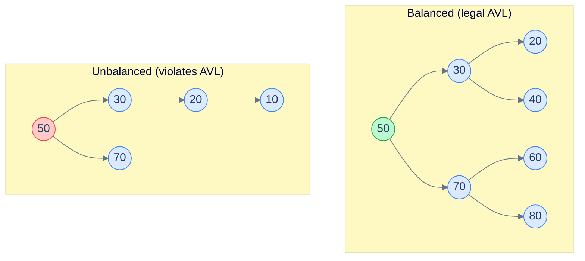
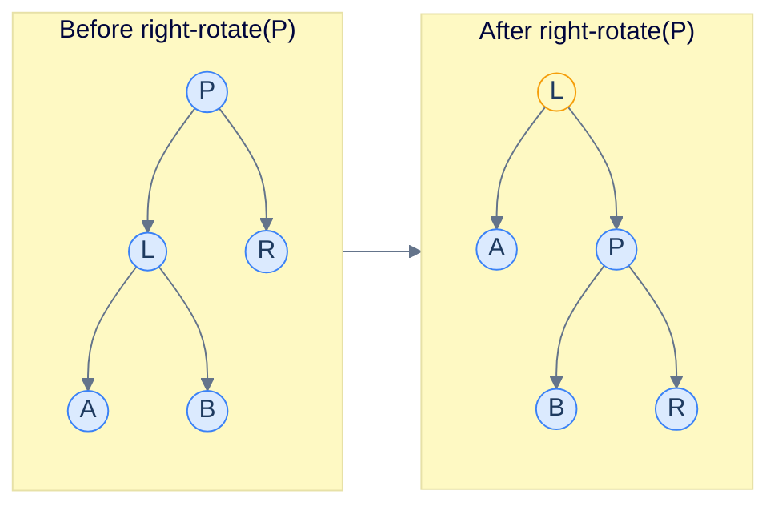
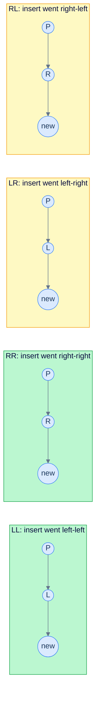

# 1. Introduction to AVL Trees

## The Hook

In 1962, Soviet mathematicians Adelson-Velsky and Landis published a six-page paper titled "An algorithm for the organization of information". It introduced what is now the **AVL tree**: a binary search tree that, after every insertion or deletion, restores a strict invariant — *for every node, the heights of its left and right subtrees differ by at most 1*. The paper was the first proof that a BST could guarantee `O(log n)` operations on any input order, by paying a constant amount of extra work to rebalance after each mutation.

For sixty-plus years since, AVL trees have been the *shallowest* of the self-balancing BSTs — a tree of `n` nodes has height at most `1.44 · log₂(n)`, the tightest bound achievable for any height-balanced binary search tree. That's why they're the right pick for **read-heavy workloads**: lookups walk fewer levels than red-black trees, splay trees, or treaps. The cost is more rotation work on writes — a fair trade when reads dominate.

This chapter is the implementation. By the end you'll be able to insert and delete from an AVL tree in five languages, recognise the four rotation cases on sight, and explain why the height bound is `1.44 log n` instead of `log n`.

---

## Table of contents

1. [The AVL invariant](#the-avl-invariant)
2. [Why height balance gives O(log n)](#why-height-balance-gives-o-log-n)
3. [Rotations](#rotations)
4. [The four rebalance cases](#the-four-rebalance-cases)
5. [Insert with rebalance](#insert-with-rebalance)
6. [Delete with rebalance](#delete-with-rebalance)
7. [Implementation](#implementation)
8. [Edge cases and pitfalls](#edge-cases-and-pitfalls)
9. [Production reality](#production-reality)
10. [Practice ladder](#practice-ladder)
11. [Cross-links](#cross-links)
12. [Final takeaway](#final-takeaway)

***

# The AVL invariant

> **AVL invariant.** For every node `n`, `|height(n.left) − height(n.right)| ≤ 1`.

The height difference, `height(left) − height(right)`, is the **balance factor** of `n`. The invariant says every node has balance factor in `{−1, 0, +1}`.

Each node stores either its own *height* or its *balance factor*; either is enough to detect imbalance after a mutation. Storing the height is more flexible (you can compute the balance factor on the fly) at the cost of `4` bytes per node. Storing only the balance factor is `2` bits per node — but doesn't allow easy verification.



<p align="center"><strong>Left: balanced AVL — every node has balance factor in {−1, 0, +1}. Right: unbalanced — node 50 has left subtree of height 3 and right subtree of height 1, balance factor −2. The mutation that produced this state must trigger a rotation to restore the invariant.</strong></p>

***

# Why height balance gives O(log n)

> **Claim.** An AVL tree with `n` nodes has height `h ≤ 1.44 · log₂(n)`.

Let `N(h)` be the *minimum* number of nodes in an AVL tree of height `h`. The minimum tree of height `h` has a root, a child subtree of height `h-1` (the bigger side), and another child subtree of height `h-2` (just barely AVL-legal — height differs by exactly 1, the maximum allowed).

So `N(h) = N(h-1) + N(h-2) + 1` with `N(0) = 1, N(1) = 2`. This is the Fibonacci recurrence (offset by 2). Solving: `N(h) ≈ φ^h / √5` where `φ ≈ 1.618` is the golden ratio. Inverting: `h ≤ log_φ(n) ≈ 1.44 · log₂(n)`.

Compare to red-black, where the bound is `2 · log₂(n)`. AVL trees are about 30% shallower for the same number of nodes — fewer pointer chases per lookup.

***

# Rotations

A rotation is a local restructuring that preserves the BST property and changes the heights of two subtrees by 1 each. There are two: **left** and **right**.



<p align="center"><strong>A right rotation. <code>L</code> moves up, <code>P</code> moves down to the right. <code>L</code>'s right child <code>B</code> becomes <code>P</code>'s left child. The BST property is preserved (everything in <code>A</code> is &lt; <code>L</code>, everything in <code>B</code> is between <code>L</code> and <code>P</code>, everything in <code>R</code> is &gt; <code>P</code>). Left rotation is the mirror.</strong></p>

A rotation is `O(1)` work — just three pointer reassignments and one or two height updates.

***

# The four rebalance cases

After an insert, exactly one node may become unbalanced (balance factor `±2`). The fix depends on *which* subtree caused the imbalance.

The four cases, named by the path from the imbalanced node `P` down to the new node:

- **Left-Left (LL):** the new node is in `P.left.left`. **Right-rotate `P`.**
- **Right-Right (RR):** the new node is in `P.right.right`. **Left-rotate `P`.**
- **Left-Right (LR):** the new node is in `P.left.right`. **Left-rotate `P.left`, then right-rotate `P`.**
- **Right-Left (RL):** the new node is in `P.right.left`. **Right-rotate `P.right`, then left-rotate `P`.**



<p align="center"><strong>The four cases. LL and RR (green) are single rotations. LR and RL (yellow) are double rotations — the inner child's subtree has to be rotated first to convert the case into LL or RR.</strong></p>

After the rotation, the imbalanced subtree's height has decreased by 1, the AVL invariant is restored, and the recursion stack unwinds. The net effect on the path from root to insertion point is at most `O(log n)` work — usually one or two rotations near the leaf.

***

# Insert with rebalance

```pseudocode
function insert(node, key):
    if node is null: return new Node(key)
    if key < node.key: node.left  ← insert(node.left,  key)
    else if key > node.key: node.right ← insert(node.right, key)
    else: return node                                              # duplicate, no-op

    node.height ← 1 + max(height(node.left), height(node.right))
    bf ← balanceFactor(node)

    # LL
    if bf > 1 AND key < node.left.key:
        return rightRotate(node)
    # RR
    if bf < −1 AND key > node.right.key:
        return leftRotate(node)
    # LR
    if bf > 1 AND key > node.left.key:
        node.left ← leftRotate(node.left)
        return rightRotate(node)
    # RL
    if bf < −1 AND key < node.right.key:
        node.right ← rightRotate(node.right)
        return leftRotate(node)

    return node
```

The four `if` blocks are the four cases above. The `key < node.left.key` test distinguishes LL from LR (the key went left from `node.left` versus right from `node.left`). Symmetrically for the right side.

***

# Delete with rebalance

Standard BST delete, plus rebalance on the way up. The case-detection is slightly different because we don't have the inserted key as a guide; we use the *taller* child instead.

```pseudocode
function delete(node, key):
    if node is null: return null
    if key < node.key: node.left  ← delete(node.left,  key)
    else if key > node.key: node.right ← delete(node.right, key)
    else:                                                          # found the node
        if node.left is null: return node.right
        if node.right is null: return node.left
        successor ← minNode(node.right)
        node.key ← successor.key
        node.right ← delete(node.right, successor.key)

    node.height ← 1 + max(height(node.left), height(node.right))
    bf ← balanceFactor(node)

    # LL: left subtree taller, and its left child taller
    if bf > 1 AND balanceFactor(node.left) ≥ 0:
        return rightRotate(node)
    # LR: left subtree taller, but its right child taller
    if bf > 1 AND balanceFactor(node.left) < 0:
        node.left ← leftRotate(node.left)
        return rightRotate(node)
    # RR
    if bf < −1 AND balanceFactor(node.right) ≤ 0:
        return leftRotate(node)
    # RL
    if bf < −1 AND balanceFactor(node.right) > 0:
        node.right ← rightRotate(node.right)
        return leftRotate(node)

    return node
```

Delete can require up to `O(log n)` rotations because the rebalance may propagate up the tree (each rotation may decrease the subtree height by 1 and trigger a rebalance one level up). In practice, both insert and delete average around 1–2 rotations.

***

# Implementation

```python run
class Node:
    __slots__ = ("key", "left", "right", "height")
    def __init__(self, key):
        self.key, self.left, self.right, self.height = key, None, None, 1

def h(n): return n.height if n else 0
def bf(n): return h(n.left) - h(n.right) if n else 0
def update(n): n.height = 1 + max(h(n.left), h(n.right))

def rot_right(p):
    l = p.left; p.left = l.right; l.right = p
    update(p); update(l)
    return l

def rot_left(p):
    r = p.right; p.right = r.left; r.left = p
    update(p); update(r)
    return r

def insert(node, key):
    if node is None: return Node(key)
    if key < node.key:   node.left  = insert(node.left, key)
    elif key > node.key: node.right = insert(node.right, key)
    else: return node                                       # duplicates ignored
    update(node)
    b = bf(node)
    if b >  1 and key < node.left.key:  return rot_right(node)               # LL
    if b < -1 and key > node.right.key: return rot_left(node)                # RR
    if b >  1 and key > node.left.key:  node.left  = rot_left(node.left);  return rot_right(node)  # LR
    if b < -1 and key < node.right.key: node.right = rot_right(node.right); return rot_left(node)  # RL
    return node

def search(node, key):
    while node:
        if key == node.key: return True
        node = node.left if key < node.key else node.right
    return False

def inorder(node, out):
    if node is None: return
    inorder(node.left, out); out.append(node.key); inorder(node.right, out)


if __name__ == "__main__":
    import random
    random.seed(7)
    root = None
    keys = list(range(1, 16))
    random.shuffle(keys)
    for k in keys:
        root = insert(root, k)

    # Sanity: in-order = sorted
    out = []; inorder(root, out)
    assert out == sorted(keys), f"in-order mismatch: {out}"

    # Spot check height bound
    print(f"Inserted {len(keys)} keys; tree height = {h(root)}")
    print(f"  log₂({len(keys)}) ≈ {len(keys).bit_length() - 1}; AVL bound 1.44 · log₂ ≈ {1.44 * (len(keys).bit_length() - 1):.1f}")
    print(f"  In-order traversal: {out}")
    print(f"  Search 7: {search(root, 7)}  Search 99: {search(root, 99)}")
```

```java run
class Solution {
    static class Node {
        int key, height = 1;
        Node left, right;
        Node(int k) { key = k; }
    }

    static int h(Node n) { return n == null ? 0 : n.height; }
    static int bf(Node n) { return n == null ? 0 : h(n.left) - h(n.right); }
    static void update(Node n) { n.height = 1 + Math.max(h(n.left), h(n.right)); }

    static Node rotRight(Node p) {
        Node l = p.left;
        p.left = l.right;
        l.right = p;
        update(p); update(l);
        return l;
    }

    static Node rotLeft(Node p) {
        Node r = p.right;
        p.right = r.left;
        r.left = p;
        update(p); update(r);
        return r;
    }

    static Node insert(Node node, int key) {
        if (node == null) return new Node(key);
        if (key < node.key) node.left = insert(node.left, key);
        else if (key > node.key) node.right = insert(node.right, key);
        else return node;
        update(node);
        int b = bf(node);
        if (b >  1 && key < node.left.key)  return rotRight(node);
        if (b < -1 && key > node.right.key) return rotLeft(node);
        if (b >  1 && key > node.left.key)  { node.left  = rotLeft(node.left);  return rotRight(node); }
        if (b < -1 && key < node.right.key) { node.right = rotRight(node.right); return rotLeft(node);  }
        return node;
    }

    public static void main(String[] args) {
        Node root = null;
        int[] keys = {5, 3, 8, 1, 4, 7, 9, 2, 6, 10, 11, 12, 13, 14, 15};
        for (int k : keys) root = insert(root, k);
        System.out.println("inserted 15 keys; height = " + h(root));
    }
}
```

```c run
#include <stdio.h>
#include <stdlib.h>

typedef struct Node {
    int key, height;
    struct Node *left, *right;
} Node;

static int h(Node *n) { return n ? n->height : 0; }
static int max(int a, int b) { return a > b ? a : b; }
static int bf(Node *n) { return n ? h(n->left) - h(n->right) : 0; }
static void update(Node *n) { n->height = 1 + max(h(n->left), h(n->right)); }

static Node *rot_right(Node *p) {
    Node *l = p->left; p->left = l->right; l->right = p;
    update(p); update(l); return l;
}
static Node *rot_left(Node *p) {
    Node *r = p->right; p->right = r->left; r->left = p;
    update(p); update(r); return r;
}

static Node *new_node(int key) {
    Node *n = malloc(sizeof(Node));
    n->key = key; n->left = n->right = NULL; n->height = 1; return n;
}

static Node *insert(Node *node, int key) {
    if (!node) return new_node(key);
    if (key < node->key) node->left = insert(node->left, key);
    else if (key > node->key) node->right = insert(node->right, key);
    else return node;
    update(node);
    int b = bf(node);
    if (b >  1 && key < node->left->key)  return rot_right(node);
    if (b < -1 && key > node->right->key) return rot_left(node);
    if (b >  1 && key > node->left->key)  { node->left = rot_left(node->left); return rot_right(node); }
    if (b < -1 && key < node->right->key) { node->right = rot_right(node->right); return rot_left(node); }
    return node;
}

int main(void) {
    Node *root = NULL;
    int keys[] = {5, 3, 8, 1, 4, 7, 9, 2, 6, 10, 11, 12, 13, 14, 15};
    for (int i = 0; i < 15; i++) root = insert(root, keys[i]);
    printf("inserted 15 keys; height = %d\n", h(root));
    return 0;
}
```

```scala run
object Solution {
  class Node(var key: Int) {
    var left: Node = null
    var right: Node = null
    var height: Int = 1
  }

  def h(n: Node): Int = if (n == null) 0 else n.height
  def bf(n: Node): Int = if (n == null) 0 else h(n.left) - h(n.right)
  def update(n: Node): Unit = n.height = 1 + math.max(h(n.left), h(n.right))

  def rotRight(p: Node): Node = {
    val l = p.left; p.left = l.right; l.right = p
    update(p); update(l); l
  }
  def rotLeft(p: Node): Node = {
    val r = p.right; p.right = r.left; r.left = p
    update(p); update(r); r
  }

  def insert(node: Node, key: Int): Node = {
    if (node == null) return new Node(key)
    if (key < node.key) node.left = insert(node.left, key)
    else if (key > node.key) node.right = insert(node.right, key)
    else return node
    update(node)
    val b = bf(node)
    if (b > 1 && key < node.left.key) return rotRight(node)
    if (b < -1 && key > node.right.key) return rotLeft(node)
    if (b > 1 && key > node.left.key) { node.left = rotLeft(node.left); return rotRight(node) }
    if (b < -1 && key < node.right.key) { node.right = rotRight(node.right); return rotLeft(node) }
    node
  }

  def main(args: Array[String]): Unit = {
    var root: Node = null
    val keys = Array(5, 3, 8, 1, 4, 7, 9, 2, 6, 10, 11, 12, 13, 14, 15)
    for (k <- keys) root = insert(root, k)
    println(s"inserted 15 keys; height = ${h(root)}")
  }
}
```

***

# Edge cases and pitfalls

- **Forgetting to update heights after rotation.** A rotation changes the heights of the rotated nodes. The order matters: update the *child that moved down* first, then the *new root* of the subtree. Get this wrong and subsequent balance-factor calculations are off, masking bugs that surface much later.
- **The four-case `if` chain is order-sensitive.** The standard order — LL, RR, LR, RL — works because the LR / RL conditions are checked *after* the LL / RR conditions. If you reverse the order, an LR case can be misdiagnosed as LL.
- **Equality in the case-detection.** When delete uses `balanceFactor(node.left) ≥ 0` (for LL) vs `< 0` (for LR), the equality goes with LL. Using `>` instead of `≥` produces a tree that's still correct but does an unnecessary double rotation.
- **Mutating during iteration.** AVL trees, like all BSTs, don't support concurrent insertion or deletion during iteration. Locking is required for thread safety.
- **Duplicate keys.** Decide explicitly: ignore, replace, or store as a multiset. The implementations above ignore. For multisets, augment each node with a count.
- **Integer height overflow.** A `int8_t` height field caps at 127, fine for trees up to `~10⁵⁴` nodes (`φ¹²⁷`). A `uint32_t` is safe to any plausible size.

***

# Production reality

- **AVL trees are less common than red-black** in standard libraries — the slightly-shallower height doesn't justify the extra rotation work for general workloads.
- **Where they appear:**
  - **PostgreSQL's GiST** ("Generalized Search Tree") indexes use AVL-balancing internally for in-memory parts of the index.
  - **The Linux kernel** has had AVL implementations historically (`include/linux/jhash.h` and a few obscure subsystems) but the dominant balanced-BST is the RB-tree.
  - **In-memory databases** like Memgraph use AVL for some internal structures.
- **Educational example:** AVL is the standard "first self-balancing tree" in algorithm courses because the rotation cases map cleanly onto the path the new node took. Red-black trees, by contrast, require understanding the colour-recolouring choreography before the structure makes sense.
- **Worth knowing the height bound:** in interview contexts and back-of-envelope calculations, the `1.44 log n` bound for AVL vs `2 log n` for red-black is a *real* difference that occasionally matters (e.g., in tight cache-line budgets where one extra level of pointer chasing hurts).

***

# Practice ladder

1. **Implement `getHeight` and verify the AVL invariant.** Given a tree, write a function that returns `(height, isAvl)` recursively.
   > *Hint:* base case: `(0, true)`. Recursive case: combine the two children's heights and balance flags. Return `false` if any subtree is non-AVL or if the local balance factor exceeds `1`.

2. **Insert and rebalance from scratch.** Implement AVL `insert` without consulting the chapter, on input `[10, 20, 30, 40, 50, 25]`. Trace the rotations.
   > *Hint:* the first three inserts trigger an RR rotation. The next two are clean. The `25` triggers an RL rotation.

3. **Convert sorted array to AVL.** Given a sorted array, build an AVL tree of those values in `O(n)` time.
   > *Hint:* recursively pick the middle, build left subtree from left half, right subtree from right half. The result is naturally balanced; no rotations needed.

4. **Find the kth smallest element.** Augment AVL nodes with a `size` field (number of nodes in subtree). Implement `kthSmallest(k)` in `O(log n)`.
   > *Hint:* descend left if `k ≤ size(left)`; descend right with `k - size(left) - 1` if greater; return current if `k = size(left) + 1`. Update `size` after rotations.

5. **Delete and propagate rebalance.** Implement AVL `delete`. Test that on input `[1, 2, 3, …, 100]` followed by deleting 1 through 50 in order, every intermediate state is AVL.
   > *Hint:* delete may need to rebalance up the entire path back to the root. Don't stop early just because the immediate parent is balanced — the parent's parent might not be.

***

# Cross-links

- **Prerequisite:** [Binary Search Tree](/cortex/data-structures-and-algorithms/trees-binary-search-tree-introduction-to-binary-search-trees), [Self-Balancing BSTs Overview](/cortex/data-structures-and-algorithms/trees-self-balancing-bst-overview-self-balancing-bst-overview).
- **Sibling deep dive:** [Red-Black Tree](/cortex/data-structures-and-algorithms/trees-red-black-tree-introduction-to-red-black-trees) — the one most production code uses.
- **Foundations cited:** [Asymptotic Analysis](/cortex/data-structures-and-algorithms/foundations-asymptotic-analysis), [Proof Techniques](/cortex/data-structures-and-algorithms/foundations-proof-techniques) (loop invariants in tree operations).

***

# Final Takeaway

AVL trees are the strictest self-balancing BST: every node has balance factor ≤ 1, height stays under `1.44 log₂ n`. Three patterns to internalise:

1. **Four cases, two rotations.** LL and RR are single rotations. LR and RL are double rotations that first transform into LL or RR. Memorise the four-case decision once; everything else follows.
2. **Rotations are local.** A rotation touches three pointers and updates two heights. It's `O(1)` work, no matter how big the subtree. The recursion stack does the rest.
3. **AVL beats RB on reads, loses on writes.** When you can pick — and you usually can't, because RB ships with the standard library — AVL is the right call for read-heavy in-memory indexes. For everything else, RB-tree.
