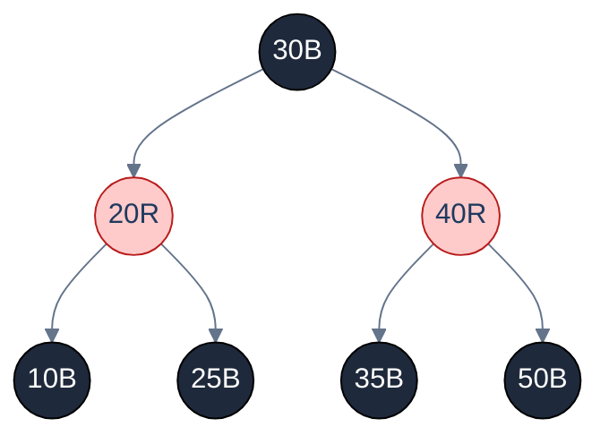

# 1. Introduction to Red-Black Trees

## The Hook

If you've used `java.util.TreeMap`, `std::map` in C++, the Linux kernel's `epoll`, the CFS scheduler that picks which thread runs next, the scheduler-driven completion queues in io_uring, the page cache, the EXT4 filesystem's range tree, the Network Time Protocol daemon, or the Nginx connection manager — you've used a **red-black tree**, probably without knowing it. The structure is the workhorse self-balancing BST of production code. It's not the shallowest (AVL is). It's not the simplest (treap is). It's not the fastest in benchmarks (skip lists are easier to make concurrent). What it *is* is the **most pragmatic compromise** — fast enough on every operation, with rebalancing in a constant-bounded number of rotations, and a per-node overhead of just one colour bit.

The structure was invented in 1972 (under the name "symmetric binary B-tree", later renamed in 1978). The five invariants that make it work are notorious for being non-obvious — every algorithm-text first reaction is "where did *those* come from?" — but once internalised, they explain everything about why the implementation looks the way it does. By the end of this chapter you'll be able to insert into a red-black tree, walk through the three cases the rebalance handles, and recognise the same five-invariant structure inside `lib/rbtree.c`.

---

## Table of contents

1. [The five invariants](#the-five-invariants)
2. [Why they imply O(log n) height](#why-they-imply-o-log-n-height)
3. [Insert: rebalance via colour-flip + rotation](#insert-rebalance-via-colour-flip-rotation)
4. [Delete: the four cases](#delete-the-four-cases)
5. [Implementation](#implementation)
6. [Edge cases and pitfalls](#edge-cases-and-pitfalls)
7. [Production reality](#production-reality)
8. [Practice ladder](#practice-ladder)
9. [Cross-links](#cross-links)
10. [Final takeaway](#final-takeaway)

***

# The five invariants

A red-black tree is a BST where every node is coloured **red** or **black**, subject to five rules:

> 1. **Every node is red or black.**
> 2. **The root is black.**
> 3. **All `null` leaves (often called "NIL nodes") are black.** (Implementations sometimes use a single shared sentinel for all NILs.)
> 4. **A red node has only black children.** (No two reds in a row on any root-to-leaf path.)
> 5. **Every root-to-leaf path passes through the same number of black nodes.** (This count is called the tree's **black-height**.)

Together, these guarantee `O(log n)` height. Reading them in isolation, none of the rules motivates itself; together they're an interlocking machine.



<p align="center"><strong>A small red-black tree. Black nodes are filled dark, red nodes are coloured red. Every root-to-leaf path contains exactly 2 black internal nodes (3 if you count the implicit NIL leaves), and no two reds are adjacent.</strong></p>

***

# Why they imply O(log n) height

> **Claim.** A red-black tree with `n` nodes has height `h ≤ 2 · log₂(n + 1)`.

Sketch: Let `bh` be the **black-height** of the tree (the number of black nodes from any root-to-leaf path, not counting the root itself). The shortest possible root-to-leaf path is all black; that's `bh` nodes. The longest possible path alternates red and black; that's at most `2 · bh` nodes (because no two reds are adjacent, so reds make up at most half the path).

A subtree of black-height `bh` contains at least `2^bh − 1` internal nodes (proved by induction). Inverting: `bh ≥ log₂(n + 1)`. The height `h` is at most `2 · bh ≤ 2 · log₂(n + 1)`. Done.

The factor of 2 (vs AVL's 1.44) is the relaxation that lets RB-trees do less rebalancing work. Each cost-of-edit you save shows up in this constant.

***

# Insert: Rebalance via Colour-Flip + Rotation

New nodes are inserted **red** by default. A red insert may violate invariant (4) — it may have a red parent. The fix uses three cases, each named by the colour of the new node's *uncle* (the parent's sibling).

**Setup:** new node `Z`, parent `P`, grandparent `G`, uncle `U`. We're trying to fix the case where `Z` and `P` are both red.

### Case 1 — Uncle is red

Both `P` and `U` are red. Recolour: `P` and `U` become black, `G` becomes red. The double-red violation moves *up* the tree to `G`. Recurse from `G`.

```
Before:                          After:
        G(B)                            G(R)
       /    \                          /    \
     P(R)    U(R)        →           P(B)    U(B)
     /                                /
   Z(R)                             Z(R)
```

If `G`'s parent was already red, the violation moved up; loop. If `G` is the root, recolour to black; done.

### Case 2 — Uncle is black, `Z` is the *inner* child

`Z` zigzags into `P` (e.g., `P` is `G.left` but `Z` is `P.right`). Rotate `P` so `Z` becomes the *outer* child, then handle as Case 3.

```
Before:                          After (left-rotate P):
        G(B)                            G(B)
       /    \                          /    \
     P(R)    U(B)        →           Z(R)    U(B)
        \                            /
       Z(R)                        P(R)
```

### Case 3 — Uncle is black, `Z` is the *outer* child

`Z` lines up with `P` on the same side of `G` (e.g., both are `left` children). Recolour `P` black, `G` red, then right-rotate `G`.

```
Before:                          After (right-rotate G, recolour):
        G(B)                            P(B)
       /    \                          /    \
     P(R)    U(B)        →           Z(R)    G(R)
     /                                          \
   Z(R)                                         U(B)
```

The double-red is gone; we don't need to recurse further. The black-height is preserved (`P` was red, now black; `G` was black, now red — the count of blacks on any root-to-leaf path is unchanged).

### The full insert algorithm

```pseudocode
function insert(T, key):
    Z ← bstInsert(T, key)                      # standard BST insert; new node is red
    while Z ≠ T.root AND Z.parent.colour = RED:
        P ← Z.parent
        G ← P.parent
        if P = G.left:
            U ← G.right
            if U.colour = RED:                 # Case 1
                P.colour ← BLACK
                U.colour ← BLACK
                G.colour ← RED
                Z ← G                          # propagate up
            else:
                if Z = P.right:                # Case 2 → reduce to Case 3
                    Z ← P
                    leftRotate(T, Z)
                P.colour ← BLACK               # Case 3
                G.colour ← RED
                rightRotate(T, G)
        else:                                   # mirror with left/right swapped
            U ← G.left
            … (mirror)
    T.root.colour ← BLACK                       # invariant 2: root is black
```

**Cost.** At most one Case 2 + one Case 3 per insert (the rotations). Case 1 can repeat as it propagates up — but it's just two recolours, no rotations. Total: `O(log n)` colour flips and `O(1)` rotations per insert.

***

# Delete: The Four Cases

Delete is more complicated than insert because removing a black node decreases the black-height of one path, immediately violating invariant (5). The fix involves a "double black" virtual marker that propagates upward until it can be absorbed.

The delete algorithm:

1. Find the node `Z` to delete. If it has two children, find its in-order successor `Y` and copy `Y`'s key to `Z`; now we're deleting `Y` instead.
2. The node we actually remove (`Z` or `Y`) has at most one non-NIL child. Splice that child in.
3. If the spliced-out node was *red*, we're done — black-heights are unchanged.
4. If it was *black*, we've created a "double black" at the splice site. Rebalance.

The rebalance walks up from the double-black node, fixing four cases at each step until the double-black is absorbed (cases 1, 2, 3, 4 — each named by the configuration of the sibling and its children). The detail is below in the implementation; the *count* matters more than the case names: at most `O(log n)` recolourings and at most 3 rotations per delete.

***

# Implementation

A working red-black tree is `~150 lines` of code per language even with care taken — significantly more than AVL. The full implementation below is insert-only for compactness; production-grade implementations also handle delete (the [Linux kernel's `lib/rbtree.c`](https://github.com/torvalds/linux/blob/master/lib/rbtree.c) is the reference).

```python run
RED, BLACK = 0, 1

class Node:
    __slots__ = ("key", "colour", "left", "right", "parent")
    def __init__(self, key):
        self.key = key
        self.colour = RED
        self.left = self.right = self.parent = None

class RBTree:
    def __init__(self):
        self.NIL = Node(None); self.NIL.colour = BLACK
        self.root = self.NIL

    def _left_rotate(self, x):
        y = x.right
        x.right = y.left
        if y.left is not self.NIL: y.left.parent = x
        y.parent = x.parent
        if x.parent is None: self.root = y
        elif x is x.parent.left: x.parent.left = y
        else: x.parent.right = y
        y.left = x
        x.parent = y

    def _right_rotate(self, y):
        x = y.left
        y.left = x.right
        if x.right is not self.NIL: x.right.parent = y
        x.parent = y.parent
        if y.parent is None: self.root = x
        elif y is y.parent.right: y.parent.right = x
        else: y.parent.left = x
        x.right = y
        y.parent = x

    def insert(self, key):
        z = Node(key)
        z.left = z.right = self.NIL
        # Standard BST insert
        y, x = None, self.root
        while x is not self.NIL:
            y = x
            x = x.left if z.key < x.key else x.right
        z.parent = y
        if y is None:
            self.root = z
        elif z.key < y.key:
            y.left = z
        else:
            y.right = z
        # Fix-up
        self._insert_fixup(z)

    def _insert_fixup(self, z):
        while z.parent is not None and z.parent.colour == RED:
            p = z.parent
            g = p.parent
            if p is g.left:
                u = g.right
                if u.colour == RED:                                                                        # Case 1
                    p.colour = BLACK
                    u.colour = BLACK
                    g.colour = RED
                    z = g
                else:
                    if z is p.right:                                                                       # Case 2
                        z = p
                        self._left_rotate(z)
                        p = z.parent
                        g = p.parent
                    p.colour = BLACK                                                                       # Case 3
                    g.colour = RED
                    self._right_rotate(g)
            else:                                                                                          # mirror
                u = g.left
                if u.colour == RED:
                    p.colour = BLACK
                    u.colour = BLACK
                    g.colour = RED
                    z = g
                else:
                    if z is p.left:
                        z = p
                        self._right_rotate(z)
                        p = z.parent
                        g = p.parent
                    p.colour = BLACK
                    g.colour = RED
                    self._left_rotate(g)
        self.root.colour = BLACK

    def search(self, key):
        x = self.root
        while x is not self.NIL:
            if key == x.key: return True
            x = x.left if key < x.key else x.right
        return False

    def inorder(self):
        out = []
        def walk(n):
            if n is self.NIL: return
            walk(n.left); out.append(n.key); walk(n.right)
        walk(self.root)
        return out


if __name__ == "__main__":
    import random
    random.seed(7)
    t = RBTree()
    keys = list(range(1, 32))
    random.shuffle(keys)
    for k in keys:
        t.insert(k)
    assert t.inorder() == sorted(keys)

    # Verify invariants
    def black_height(n):
        if n is t.NIL: return 1
        l = black_height(n.left)
        r = black_height(n.right)
        assert l == r, f"unequal black-heights at key={n.key}"
        return l + (1 if n.colour == BLACK else 0)

    def no_double_red(n):
        if n is t.NIL: return
        if n.colour == RED:
            assert n.left.colour == BLACK and n.right.colour == BLACK, f"red-red at key={n.key}"
        no_double_red(n.left)
        no_double_red(n.right)

    assert t.root.colour == BLACK, "root must be black"
    no_double_red(t.root)
    bh = black_height(t.root)
    print(f"Inserted {len(keys)} keys; root colour = {'BLACK' if t.root.colour else 'RED'}; black-height = {bh}")
    print(f"Search 7  -> {t.search(7)}    Search 99 -> {t.search(99)}")
    print(f"In-order: {t.inorder()}")
```

```java run
class Solution {
    static final boolean RED = true, BLACK = false;
    static class Node {
        int key;
        boolean colour = RED;
        Node left, right, parent;
        Node(int k) { key = k; }
    }

    static Node NIL = new Node(-1); static { NIL.colour = BLACK; }
    Node root = NIL;

    void leftRotate(Node x) {
        Node y = x.right;
        x.right = y.left;
        if (y.left != NIL) y.left.parent = x;
        y.parent = x.parent;
        if (x.parent == null) root = y;
        else if (x == x.parent.left) x.parent.left = y;
        else x.parent.right = y;
        y.left = x; x.parent = y;
    }

    void rightRotate(Node y) {
        Node x = y.left;
        y.left = x.right;
        if (x.right != NIL) x.right.parent = y;
        x.parent = y.parent;
        if (y.parent == null) root = x;
        else if (y == y.parent.right) y.parent.right = x;
        else y.parent.left = x;
        x.right = y; y.parent = x;
    }

    void insert(int key) {
        Node z = new Node(key);
        z.left = z.right = NIL;
        Node y = null, x = root;
        while (x != NIL) { y = x; x = (z.key < x.key) ? x.left : x.right; }
        z.parent = y;
        if (y == null) root = z;
        else if (z.key < y.key) y.left = z;
        else y.right = z;
        fixup(z);
    }

    void fixup(Node z) {
        while (z.parent != null && z.parent.colour == RED) {
            Node p = z.parent, g = p.parent;
            if (p == g.left) {
                Node u = g.right;
                if (u.colour == RED) {
                    p.colour = BLACK; u.colour = BLACK; g.colour = RED;
                    z = g;
                } else {
                    if (z == p.right) { z = p; leftRotate(z); p = z.parent; g = p.parent; }
                    p.colour = BLACK; g.colour = RED;
                    rightRotate(g);
                }
            } else {
                Node u = g.left;
                if (u.colour == RED) {
                    p.colour = BLACK; u.colour = BLACK; g.colour = RED;
                    z = g;
                } else {
                    if (z == p.left) { z = p; rightRotate(z); p = z.parent; g = p.parent; }
                    p.colour = BLACK; g.colour = RED;
                    leftRotate(g);
                }
            }
        }
        root.colour = BLACK;
    }

    public static void main(String[] args) {
        Solution t = new Solution();
        int[] keys = {5, 3, 8, 1, 4, 7, 9, 2, 6, 10, 11, 12, 13, 14, 15};
        for (int k : keys) t.insert(k);
        System.out.println("inserted " + keys.length + " keys");
    }
}
```

```c run
#include <stdio.h>
#include <stdlib.h>
#include <stdbool.h>

typedef enum { RED, BLACK } Colour;
typedef struct Node {
    int key;
    Colour colour;
    struct Node *left, *right, *parent;
} Node;

static Node nil_node = {0, BLACK, NULL, NULL, NULL};
static Node *NIL = &nil_node;
static Node *root = &nil_node;

static Node *new_node(int key) {
    Node *n = malloc(sizeof(Node));
    n->key = key; n->colour = RED;
    n->left = n->right = NIL; n->parent = NULL;
    return n;
}

static void left_rotate(Node *x) {
    Node *y = x->right;
    x->right = y->left;
    if (y->left != NIL) y->left->parent = x;
    y->parent = x->parent;
    if (!x->parent) root = y;
    else if (x == x->parent->left) x->parent->left = y;
    else x->parent->right = y;
    y->left = x; x->parent = y;
}

static void right_rotate(Node *y) {
    Node *x = y->left;
    y->left = x->right;
    if (x->right != NIL) x->right->parent = y;
    x->parent = y->parent;
    if (!y->parent) root = x;
    else if (y == y->parent->right) y->parent->right = x;
    else y->parent->left = x;
    x->right = y; y->parent = x;
}

static void fixup(Node *z) {
    while (z->parent && z->parent->colour == RED) {
        Node *p = z->parent, *g = p->parent;
        if (p == g->left) {
            Node *u = g->right;
            if (u->colour == RED) { p->colour = BLACK; u->colour = BLACK; g->colour = RED; z = g; }
            else {
                if (z == p->right) { z = p; left_rotate(z); p = z->parent; g = p->parent; }
                p->colour = BLACK; g->colour = RED; right_rotate(g);
            }
        } else {
            Node *u = g->left;
            if (u->colour == RED) { p->colour = BLACK; u->colour = BLACK; g->colour = RED; z = g; }
            else {
                if (z == p->left) { z = p; right_rotate(z); p = z->parent; g = p->parent; }
                p->colour = BLACK; g->colour = RED; left_rotate(g);
            }
        }
    }
    root->colour = BLACK;
}

static void insert(int key) {
    Node *z = new_node(key);
    Node *y = NULL, *x = root;
    while (x != NIL) { y = x; x = (z->key < x->key) ? x->left : x->right; }
    z->parent = y;
    if (!y) root = z;
    else if (z->key < y->key) y->left = z;
    else y->right = z;
    fixup(z);
}

int main(void) {
    int keys[] = {5, 3, 8, 1, 4, 7, 9, 2, 6, 10, 11, 12, 13, 14, 15};
    for (int i = 0; i < 15; i++) insert(keys[i]);
    printf("inserted 15 keys; root colour = %s\n", root->colour == BLACK ? "BLACK" : "RED");
    return 0;
}
```

```scala run
object Solution {
  sealed trait Colour
  case object Red extends Colour
  case object Black extends Colour

  class Node(var key: Int) {
    var colour: Colour = Red
    var left: Node = NIL
    var right: Node = NIL
    var parent: Node = null
  }

  val NIL = new Node(0); NIL.colour = Black
  var root: Node = NIL

  def leftRotate(x: Node): Unit = {
    val y = x.right
    x.right = y.left
    if (y.left != NIL) y.left.parent = x
    y.parent = x.parent
    if (x.parent == null) root = y
    else if (x eq x.parent.left) x.parent.left = y
    else x.parent.right = y
    y.left = x; x.parent = y
  }

  def rightRotate(y: Node): Unit = {
    val x = y.left
    y.left = x.right
    if (x.right != NIL) x.right.parent = y
    x.parent = y.parent
    if (y.parent == null) root = x
    else if (y eq y.parent.right) y.parent.right = x
    else y.parent.left = x
    x.right = y; y.parent = x
  }

  def insert(key: Int): Unit = {
    val z = new Node(key)
    var y: Node = null; var x: Node = root
    while (x != NIL) { y = x; x = if (z.key < x.key) x.left else x.right }
    z.parent = y
    if (y == null) root = z
    else if (z.key < y.key) y.left = z
    else y.right = z
    fixup(z)
  }

  def fixup(zIn: Node): Unit = {
    var z = zIn
    while (z.parent != null && z.parent.colour == Red) {
      val p = z.parent; val g = p.parent
      if (p eq g.left) {
        val u = g.right
        if (u.colour == Red) { p.colour = Black; u.colour = Black; g.colour = Red; z = g }
        else {
          if (z eq p.right) { z = p; leftRotate(z) }
          z.parent.colour = Black; z.parent.parent.colour = Red; rightRotate(z.parent.parent)
        }
      } else {
        val u = g.left
        if (u.colour == Red) { p.colour = Black; u.colour = Black; g.colour = Red; z = g }
        else {
          if (z eq p.left) { z = p; rightRotate(z) }
          z.parent.colour = Black; z.parent.parent.colour = Red; leftRotate(z.parent.parent)
        }
      }
    }
    root.colour = Black
  }

  def main(args: Array[String]): Unit = {
    val keys = Array(5, 3, 8, 1, 4, 7, 9, 2, 6, 10, 11, 12, 13, 14, 15)
    for (k <- keys) insert(k)
    println(s"inserted ${keys.length} keys; root colour = ${root.colour}")
  }
}
```

***

# Edge cases and pitfalls

- **The NIL sentinel is special.** Implementations conventionally use a single shared sentinel for all NULL leaves, so colour comparisons (`u.colour == BLACK`) work without null-checks. Forgetting this and using actual `null` for NIL leads to `NullPointerException`-style bugs when checking colour.
- **The fix-up loop's `z = g` after Case 1.** Case 1 propagates the violation up to the grandparent. The loop then re-examines `g`'s parent. Forgetting to update `z` makes the loop infinite.
- **The order of conditions in Case 2 vs Case 3.** Case 2 *transforms* the configuration into Case 3, then falls through to Case 3's recolour-and-rotate. If you `return` after Case 2 instead of falling through, you leave the tree in an inconsistent state.
- **Mirror cases need to be symmetric.** The `if p == g.left` branch and the `else` branch must mirror perfectly. A swap of `left` and `right` in the wrong place is the most common bug; tested aggressively against random insertions.
- **Delete's "double black" is conceptually invented.** The four delete cases manipulate a token that doesn't physically exist in any field — it's a semantic placeholder for "this subtree's black-height has dropped". Implementations often don't represent it explicitly, instead carrying it as an extra parameter through the rebalance recursion.
- **Iterators across mutations are unsafe.** Like all BSTs, RB-trees don't support iteration concurrent with mutation. Java's `TreeMap.keySet().iterator()` throws `ConcurrentModificationException` if the tree is mutated during iteration.

***

# Production reality

- **Linux kernel `lib/rbtree.c`** — the canonical implementation. Generic via macros: you embed an `rb_node` field in your struct and a comparison function; the macros do the rest. The kernel uses RB-trees in:
  - The CFS scheduler (`kernel/sched/fair.c`): keyed by `vruntime` (virtual runtime). The leftmost node — the task that's run least — is picked next in `O(log n)`.
  - The `epoll` event subsystem (`fs/eventpoll.c`): keyed by file descriptor.
  - The `mm/mmap.c` virtual-memory area tree.
  - `fs/proc/proc_sysctl.c`, `kernel/timer.c`, and many other places.
- **Java `TreeMap`** (`java.util.TreeMap`) — public-API red-black tree. The implementation is in `src/java.base/share/classes/java/util/TreeMap.java` and is a faithful CLRS port.
- **C++ `std::map`** — the C++ standard mandates `O(log n)` for all operations and *most* implementations use red-black: libstdc++ (GCC), libc++ (Clang), MSVC's STL. Exception: some embedded STLs use B-trees instead.
- **PostgreSQL's GiST** (Generalized Search Tree) framework uses RB-tree internally for some sub-indexes.
- **Nginx connection manager** uses a red-black tree to store active connections, keyed by file descriptor or connection ID, for fast `O(log n)` lookup during request processing.
- **Why RB instead of AVL in production:** the smaller per-operation work in delete dominates over the marginally taller height. AVL's strict balance is great in theory but the rebalancing cost on writes is higher, and most production workloads have plenty of writes.

***

# Practice ladder

1. **Verify the invariants.** Given a tree (perhaps one a function you wrote produced), write a verifier that checks all five RB invariants. Run it on random insertions to catch bugs.
   > *Hint:* the trick is to compute black-height recursively and assert it equals on both subtrees of every node. Every other invariant is a local check.

2. **Compute the black-height.** Given the root of a red-black tree, return its black-height in `O(log n)` time.
   > *Hint:* walk the leftmost path from root to a NIL leaf, counting black nodes. Every root-to-leaf path has the same count by invariant 5.

3. **Simulate insertion.** Given the sequence `[7, 3, 18, 10, 22, 8, 11, 26]`, trace the colour and rotation sequence as each key is inserted into an empty tree.
   > *Hint:* Try it on paper, then verify with the runnable code.

4. **The 2-3-4 tree connection.** Red-black trees are isomorphic to 2-3-4 trees (also called B-trees of order 4). State the mapping: a black node and its red children correspond to a single 2-3-4 node with up to four children.
   > *Hint:* a black node with two black children → a 2-node (single key). Black + 1 red child → 3-node (two keys). Black + 2 red children → 4-node (three keys). The colour invariants are the 2-3-4 split rules in disguise.

5. **Build a sequence-statistic RB-tree.** Augment each node with `size` (number of nodes in subtree). Implement `kthSmallest(k)` and `rank(key)` in `O(log n)`.
   > *Hint:* update `size` after each rotation. `kthSmallest` is the standard BST trick. `rank` walks the tree summing left-subtree sizes when descending right.

***

# Cross-links

- **Prerequisite:** [Binary Search Tree](/cortex/data-structures-and-algorithms/trees-binary-search-tree-introduction-to-binary-search-trees), [Self-Balancing BSTs Overview](/cortex/data-structures-and-algorithms/trees-self-balancing-bst-overview-self-balancing-bst-overview).
- **Sibling:** [AVL Tree](/cortex/data-structures-and-algorithms/trees-avl-tree-introduction-to-avl-trees) — the strict-balance alternative, shallower but with more rotation work.
- **Production deep-dive:** [Linux Red-Black Tree in CFS](/cortex/data-structures-and-algorithms/dsa-in-real-systems-linux-red-black-tree-in-the-cfs-scheduler) — *stub*, will tour `lib/rbtree.c` and `kernel/sched/fair.c` line by line.
- **Foundations cited:** [Asymptotic Analysis](/cortex/data-structures-and-algorithms/foundations-asymptotic-analysis), [Proof Techniques](/cortex/data-structures-and-algorithms/foundations-proof-techniques) (the height bound proof is induction on black-height).

***

# Final Takeaway

The red-black tree is the workhorse balanced BST of production code. Three patterns to internalise:

1. **Five invariants, one machine.** Each rule is unmotivating in isolation; together they constrain the tree to height `2 log n`. The hardest insight is that *every* root-to-leaf path has the same black-height — that single rule does most of the work.
2. **Insert is three cases; delete is four.** Insert's worst case: one rotation. Delete's worst case: three rotations. Both `O(1)` rotations per operation regardless of `n` — the key efficiency property over AVL.
3. **You'll meet RB-trees in production all the time.** Java, C++, Linux, Nginx, Postgres GiST — read the source of `lib/rbtree.c` once and you'll spot the same shape everywhere. The fact that one structure with a single colour bit per node powers so much of computing is one of the quiet successes of the field.
