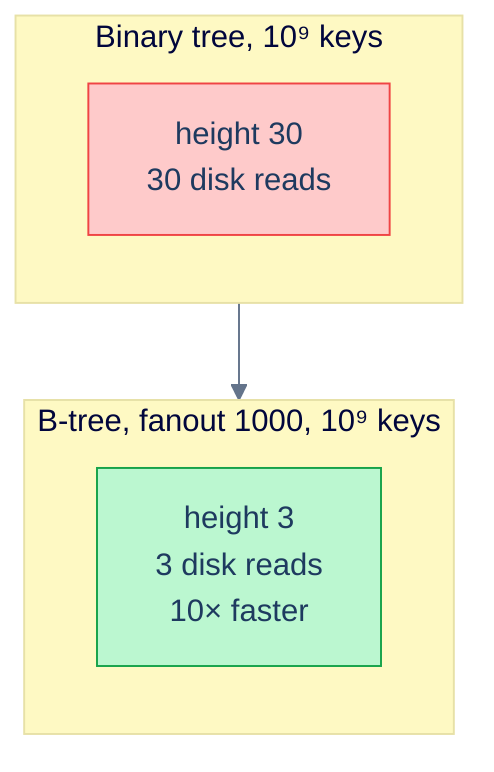
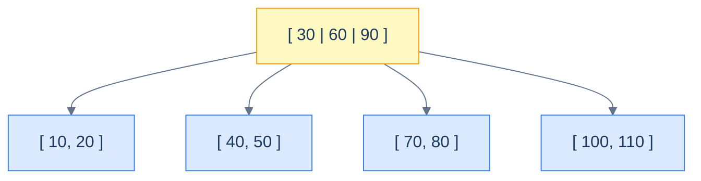
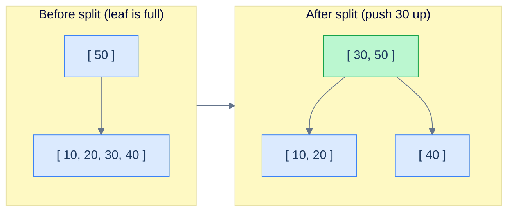
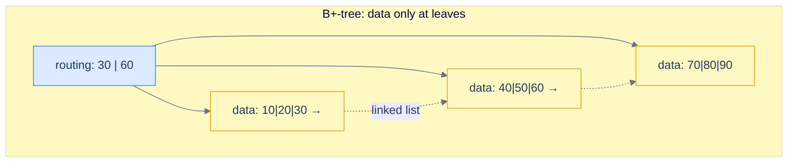

# 1. Introduction to B-Trees

## The Hook

A modern SSD does a random read in roughly 100 microseconds. RAM does one in 100 nanoseconds. The ratio — 1000× — is what makes "database on disk" a different *kind* of problem from "data structure in memory".

Consider a binary search tree of one billion records. The tree height is `log₂(10⁹) ≈ 30`, so a search takes 30 pointer chases. In RAM, that's `30 × 100 ns = 3 µs`. On disk, that's `30 × 100 µs = 3 ms` per query — and a database doing 10,000 queries per second needs them to take *microseconds*, not milliseconds.

The fix isn't a fancier balancing algorithm. The fix is to *change the geometry*: make each node hold hundreds of keys instead of one, so each "level" of the tree resolves hundreds of comparisons against a single disk read. A node with 200 keys has 201 children, so a tree of `10⁹` keys has height `log₂₀₁(10⁹) ≈ 4`. **Four** disk seeks instead of thirty. The same query runs in 400 µs instead of 3 ms — *eight times faster*, with no hand-tuning.

That structure is the **B-tree**, invented in 1971 by Bayer and McCreight. It's the most-deployed data structure in computing — every relational database index, every filesystem directory, every NoSQL key-value store, every ext4 inode lookup, every NTFS file table — all B-trees or close cousins. This chapter is the introduction. By the end you'll be able to describe a B-tree's invariants, walk through search/insert/delete with splits and merges, and recognise the shape inside Postgres's `nbtree` or MySQL's InnoDB.

---

## Table of contents

1. [The disk-aware tree](#the-disk-aware-tree)
2. [B-tree invariants](#b-tree-invariants)
3. [Search](#search)
4. [Insert and split](#insert-and-split)
5. [Delete and merge](#delete-and-merge)
6. [B-tree vs B+-tree](#b-tree-vs-b-plus-tree)
7. [Implementation](#implementation)
8. [Edge cases and pitfalls](#edge-cases-and-pitfalls)
9. [Production reality](#production-reality)
10. [Practice ladder](#practice-ladder)
11. [Cross-links](#cross-links)
12. [Final takeaway](#final-takeaway)

***

# The disk-aware tree

The "B" in B-tree probably stands for "Bayer" (the inventor) or "balanced" or "Boeing" (where Bayer worked) — Bayer himself has joked about all three. What it definitely is *not* is "binary": B-trees are **n-ary**, where `n` (the **order** or **fanout**) is chosen to match the storage hierarchy. A typical disk-resident B-tree has order 200 or higher. An in-memory B-tree (like Rust's `BTreeMap`) might use order 6 — small enough to be cache-friendly, large enough that height beats a binary tree's pointer-chase count.

The design rule is: **make each node fill exactly one I/O block**. On disk, that's a 4 KB or 8 KB page. In memory, that's a 64-byte cache line (or a multiple). With 8-byte keys, an 8 KB page holds about a thousand keys — so a tree of a billion keys is `log₁₀₀₀(10⁹) ≈ 3` levels tall. Three disk reads to find any key.



<p align="center"><strong>Fanout matters when seeks are expensive. A 1000-way B-tree has 10× fewer levels than a binary tree on the same data — and 10× fewer disk seeks per query.</strong></p>

***

# B-tree invariants

A B-tree of **order m** (sometimes called minimum degree `t = m/2`) satisfies:

> 1. **Every node holds between `m/2 − 1` and `m − 1` keys** (the root is the only exception — it can hold as few as 1 key).
> 2. **Every internal node holds one more child pointer than keys.** A node with `k` keys has `k + 1` children.
> 3. **Keys within a node are sorted.**
> 4. **All leaves are at the same depth.** The tree is perfectly height-balanced.
> 5. **The keys in the i-th child subtree are all between the (i-1)-th and i-th key of the parent.**

In English: each node is a sorted array of keys flanked by child pointers; children's key ranges nest inside the parent's.



<p align="center"><strong>A B-tree of order 4 (minimum degree 2). The root holds 3 keys (30, 60, 90); each child holds 2 keys; key ranges in children nest under the parent's separators.</strong></p>

The "minimum 50% full" rule is what gives B-trees their famous property: **disk space utilisation never drops below 50%**, regardless of insertion order. Other balanced trees can fragment storage with deletes; B-trees can't.

***

# Search

Search is straightforward: at each node, do a sorted-array search (binary or linear) to find which child subtree might contain the key, then descend.

```pseudocode
function bSearch(node, key):
    i ← 0
    while i < numKeys(node) AND key > node.keys[i]:
        i ← i + 1
    if i < numKeys(node) AND key = node.keys[i]:
        return node                                     # found
    if isLeaf(node):
        return null                                     # not in tree
    return bSearch(node.children[i], key)
```

**Cost.** Each level: `O(log m)` to find the right child slot via binary search, plus one disk seek to load the child. Total: `O(log_m n × log m) = O(log n)` work, but the *seek count* is just `O(log_m n)`. On disk that's the only cost that matters.

For order 200, the height of a 1 billion-key tree is about 4. Four disk seeks. That's why every database uses B-trees.

***

# Insert and Split

Inserts always happen at a leaf, then propagate upward if the leaf is full.

```pseudocode
function insert(tree, key):
    if root is full (m − 1 keys):
        newRoot ← new internal node
        newRoot.children[0] ← root
        split(newRoot, 0)                               # split the old root into two children of newRoot
        root ← newRoot
    insertNonFull(root, key)

function insertNonFull(node, key):
    i ← numKeys(node) − 1
    if isLeaf(node):
        # Shift larger keys right, place new key in the hole
        while i ≥ 0 AND key < node.keys[i]:
            node.keys[i + 1] ← node.keys[i]
            i ← i − 1
        node.keys[i + 1] ← key
        node.numKeys ← node.numKeys + 1
    else:
        while i ≥ 0 AND key < node.keys[i]:
            i ← i − 1
        i ← i + 1
        if numKeys(node.children[i]) = m − 1:
            split(node, i)                              # full child: split first
            if key > node.keys[i]:
                i ← i + 1                               # may need the new sibling
        insertNonFull(node.children[i], key)
```

**Splitting.** When a node fills (reaches `m − 1` keys), it splits into two halves. The middle key moves *up* into the parent. If the parent is also full, splits propagate upward. If the root splits, a new root appears and the tree grows by one level.



<p align="center"><strong>A leaf of order 5 is full (4 keys). Splitting promotes the middle key (30) into the parent and creates two half-full siblings. The tree grows in width, not depth — height only increases when the root splits.</strong></p>

The whole tree grows from the **top**, not the bottom. This is what guarantees all leaves stay at the same depth.

**Cost.** `O(log_m n)` levels, plus `O(m)` work per level for the binary search / shift. Total: `O(m · log_m n)` per insert. For order 200 and a billion keys, that's `~800` operations and 4 disk reads.

***

# Delete and Merge

Delete is more complex. The basic idea: remove the key, and if a node drops below the minimum (`m/2 − 1` keys), either *redistribute* with a sibling or *merge* with one. Merges propagate upward similarly to inserts' splits.

The four cases for delete:

1. **Key is in a leaf, and the leaf has more than minimum.** Just remove it.
2. **Key is in a leaf at minimum.** Borrow from a sibling if possible; otherwise merge with a sibling and recurse to fix the parent.
3. **Key is in an internal node, with a left or right child that has more than minimum.** Replace the key with the predecessor (rightmost key of left subtree) or successor (leftmost of right subtree). Recursively delete that key from the leaf.
4. **Key is in an internal node, with both adjacent children at minimum.** Merge the two children plus the separator key into a single node, then recurse.

The implementation is fiddly enough that production B-trees often don't bother — instead they leave deleted slots empty until the node naturally fills up again, or rebuild the index periodically. Postgres's btree explicitly does *not* shrink on delete; the page reclamation happens via `VACUUM`.

***

# B-tree vs B+-tree

A **B+-tree** is a B-tree where data is stored *only* in leaves — internal nodes hold only routing keys. Plus, the leaves are linked in a doubly-linked list, supporting fast range queries.



<p align="center"><strong>B+-tree: every record lives in a leaf; internal nodes are pure routing. Leaves are linked, so a range query (<code>20 ≤ x ≤ 80</code>) walks the leaf chain after one descent.</strong></p>

Why every database uses B+-trees instead of pure B-trees:

- **Range queries are cheap.** Walk down to the start of the range, then traverse the leaf list — no need to backtrack up the tree.
- **Internal nodes pack more keys.** Without record data inline, internal nodes hold pure key + pointer pairs, fitting more entries per page → higher fanout → shallower tree.
- **Sequential scans are O(n) on the leaf chain** — easy to do `SELECT * ORDER BY indexed_column`.

Postgres, MySQL, SQL Server, Oracle, MongoDB — all use B+-trees for primary indexes. The plain B-tree (data inline at internal nodes) lives mostly in textbooks and in some special-purpose contexts (filesystems often use them for inode storage where the "data" is small and inlining is cheap).

***

# Implementation

A working B-tree implementation is enough code that I'll give a representative Python and Java pair. The C/Scala variants follow the same structure.

```python run
T = 3  # minimum degree; max keys per node = 2T - 1, min = T - 1 (except root)

class BNode:
    __slots__ = ("keys", "children", "leaf")
    def __init__(self, leaf=True):
        self.keys = []
        self.children = []
        self.leaf = leaf

class BTree:
    def __init__(self):
        self.root = BNode()

    def search(self, key, node=None):
        node = node or self.root
        i = 0
        while i < len(node.keys) and key > node.keys[i]:
            i += 1
        if i < len(node.keys) and key == node.keys[i]:
            return True
        if node.leaf:
            return False
        return self.search(key, node.children[i])

    def insert(self, key):
        root = self.root
        if len(root.keys) == 2 * T - 1:                                    # root is full → grow up
            new_root = BNode(leaf=False)
            new_root.children.append(root)
            self._split_child(new_root, 0)
            self.root = new_root
        self._insert_nonfull(self.root, key)

    def _split_child(self, parent, i):
        full = parent.children[i]
        new_sibling = BNode(leaf=full.leaf)
        # Move the upper half of `full` into `new_sibling`
        new_sibling.keys = full.keys[T:]
        full.keys, mid_key = full.keys[:T-1], full.keys[T-1]
        if not full.leaf:
            new_sibling.children = full.children[T:]
            full.children = full.children[:T]
        # Insert the middle key + new sibling into the parent
        parent.keys.insert(i, mid_key)
        parent.children.insert(i + 1, new_sibling)

    def _insert_nonfull(self, node, key):
        i = len(node.keys) - 1
        if node.leaf:
            while i >= 0 and key < node.keys[i]:
                i -= 1
            node.keys.insert(i + 1, key)
        else:
            while i >= 0 and key < node.keys[i]:
                i -= 1
            i += 1
            if len(node.children[i].keys) == 2 * T - 1:
                self._split_child(node, i)
                if key > node.keys[i]:
                    i += 1
            self._insert_nonfull(node.children[i], key)

    def height(self):
        n = self.root; h = 1
        while not n.leaf:
            n = n.children[0]; h += 1
        return h


if __name__ == "__main__":
    import random
    random.seed(7)
    tree = BTree()
    keys = list(range(1, 101))
    random.shuffle(keys)
    for k in keys:
        tree.insert(k)

    print(f"Inserted 100 keys; B-tree height = {tree.height()}  (T={T})")
    print(f"Search 42 -> {tree.search(42)}    Search 999 -> {tree.search(999)}")

    # Show that for T=3, height stays small even as n grows
    for n in [100, 1_000, 10_000]:
        t = BTree()
        ks = list(range(1, n + 1))
        random.shuffle(ks)
        for k in ks: t.insert(k)
        print(f"  n={n:>6}  height={t.height()}  (cf. log_T(n) ≈ {__import__('math').log(n) / __import__('math').log(T):.1f})")
```

```java run
public class Main {
    static final int T = 3;

    static class BNode {
        int[] keys = new int[2 * T - 1];
        BNode[] children = new BNode[2 * T];
        int n = 0;
        boolean leaf = true;
    }

    BNode root = new BNode();

    boolean search(int key, BNode node) {
        int i = 0;
        while (i < node.n && key > node.keys[i]) i++;
        if (i < node.n && key == node.keys[i]) return true;
        if (node.leaf) return false;
        return search(key, node.children[i]);
    }

    void splitChild(BNode parent, int i) {
        BNode full = parent.children[i];
        BNode sib = new BNode();
        sib.leaf = full.leaf;
        sib.n = T - 1;
        for (int j = 0; j < T - 1; j++) sib.keys[j] = full.keys[j + T];
        if (!full.leaf) {
            for (int j = 0; j < T; j++) sib.children[j] = full.children[j + T];
        }
        full.n = T - 1;
        for (int j = parent.n; j > i; j--) parent.children[j + 1] = parent.children[j];
        parent.children[i + 1] = sib;
        for (int j = parent.n - 1; j >= i; j--) parent.keys[j + 1] = parent.keys[j];
        parent.keys[i] = full.keys[T - 1];
        parent.n++;
    }

    void insertNonfull(BNode node, int key) {
        int i = node.n - 1;
        if (node.leaf) {
            while (i >= 0 && key < node.keys[i]) { node.keys[i + 1] = node.keys[i]; i--; }
            node.keys[i + 1] = key;
            node.n++;
        } else {
            while (i >= 0 && key < node.keys[i]) i--;
            i++;
            if (node.children[i].n == 2 * T - 1) {
                splitChild(node, i);
                if (key > node.keys[i]) i++;
            }
            insertNonfull(node.children[i], key);
        }
    }

    void insert(int key) {
        if (root.n == 2 * T - 1) {
            BNode r = new BNode();
            r.leaf = false;
            r.children[0] = root;
            root = r;
            splitChild(r, 0);
        }
        insertNonfull(root, key);
    }

    int height() {
        BNode n = root; int h = 1;
        while (!n.leaf) { n = n.children[0]; h++; }
        return h;
    }

    public static void main(String[] args) {
        Main t = new Main();
        for (int i = 1; i <= 100; i++) t.insert(i);
        System.out.println("inserted 100 keys; height = " + t.height());
        System.out.println("search 42 -> " + t.search(42, t.root));
    }
}
```

```c run
#include <stdio.h>
#include <stdlib.h>
#include <stdbool.h>

#define T 3
#define MAX_KEYS (2*T - 1)

typedef struct BNode {
    int keys[MAX_KEYS];
    struct BNode *children[2*T];
    int n;
    bool leaf;
} BNode;

static BNode *new_node(bool leaf) {
    BNode *n = calloc(1, sizeof(BNode));
    n->leaf = leaf;
    return n;
}

static BNode *root;

static bool b_search(BNode *node, int key) {
    int i = 0;
    while (i < node->n && key > node->keys[i]) i++;
    if (i < node->n && node->keys[i] == key) return true;
    if (node->leaf) return false;
    return b_search(node->children[i], key);
}

static void split_child(BNode *parent, int i) {
    BNode *full = parent->children[i];
    BNode *sib = new_node(full->leaf);
    sib->n = T - 1;
    for (int j = 0; j < T - 1; j++) sib->keys[j] = full->keys[j + T];
    if (!full->leaf) for (int j = 0; j < T; j++) sib->children[j] = full->children[j + T];
    full->n = T - 1;
    for (int j = parent->n; j > i; j--) parent->children[j + 1] = parent->children[j];
    parent->children[i + 1] = sib;
    for (int j = parent->n - 1; j >= i; j--) parent->keys[j + 1] = parent->keys[j];
    parent->keys[i] = full->keys[T - 1];
    parent->n++;
}

static void insert_nonfull(BNode *node, int key) {
    int i = node->n - 1;
    if (node->leaf) {
        while (i >= 0 && key < node->keys[i]) { node->keys[i+1] = node->keys[i]; i--; }
        node->keys[i+1] = key;
        node->n++;
    } else {
        while (i >= 0 && key < node->keys[i]) i--;
        i++;
        if (node->children[i]->n == MAX_KEYS) {
            split_child(node, i);
            if (key > node->keys[i]) i++;
        }
        insert_nonfull(node->children[i], key);
    }
}

static void insert(int key) {
    if (root->n == MAX_KEYS) {
        BNode *r = new_node(false);
        r->children[0] = root;
        root = r;
        split_child(r, 0);
    }
    insert_nonfull(root, key);
}

int main(void) {
    root = new_node(true);
    for (int i = 1; i <= 100; i++) insert(i);
    printf("search 42 -> %s\n", b_search(root, 42) ? "true" : "false");
    return 0;
}
```

```scala run
object Main extends App {
  val T = 3

  class BNode(var leaf: Boolean = true) {
    val keys = scala.collection.mutable.ArrayBuffer.empty[Int]
    val children = scala.collection.mutable.ArrayBuffer.empty[BNode]
  }

  var root = new BNode

  def search(key: Int, node: BNode = root): Boolean = {
    var i = 0
    while (i < node.keys.length && key > node.keys(i)) i += 1
    if (i < node.keys.length && key == node.keys(i)) true
    else if (node.leaf) false
    else search(key, node.children(i))
  }

  def splitChild(parent: BNode, i: Int): Unit = {
    val full = parent.children(i)
    val sib = new BNode(full.leaf)
    val mid = full.keys(T - 1)
    sib.keys ++= full.keys.drop(T)
    full.keys.remove(T - 1, full.keys.length - (T - 1))
    if (!full.leaf) {
      sib.children ++= full.children.drop(T)
      full.children.remove(T, full.children.length - T)
    }
    parent.keys.insert(i, mid)
    parent.children.insert(i + 1, sib)
  }

  def insertNonfull(node: BNode, key: Int): Unit = {
    if (node.leaf) {
      var i = node.keys.length - 1
      while (i >= 0 && key < node.keys(i)) i -= 1
      node.keys.insert(i + 1, key)
    } else {
      var i = node.keys.length - 1
      while (i >= 0 && key < node.keys(i)) i -= 1
      i += 1
      if (node.children(i).keys.length == 2 * T - 1) {
        splitChild(node, i)
        if (key > node.keys(i)) i += 1
      }
      insertNonfull(node.children(i), key)
    }
  }

  def insert(key: Int): Unit = {
    if (root.keys.length == 2 * T - 1) {
      val r = new BNode(false)
      r.children += root
      root = r
      splitChild(r, 0)
    }
    insertNonfull(root, key)
  }

  for (k <- 1 to 100) insert(k)
  println(s"search 42 -> ${search(42)}    search 999 -> ${search(999)}")
}
```

***

# Edge cases and pitfalls

- **Off-by-one in split.** The middle key (`keys[T-1]`) goes *up*; the lower half (`keys[0..T-2]`) stays in `full`; the upper half (`keys[T..2T-2]`) moves to `sib`. Get this index wrong and the tree's order property breaks silently.
- **Node arrays sized to `2T - 1` keys plus `2T` children.** The split-on-full strategy means a node can transiently hold one more key than its limit; some implementations size `keys[2T]` and `children[2T+1]` to avoid bounds checks. Decide your convention and document it.
- **Splitting an internal node forgets to copy children.** Internal split must move not just the upper half of keys but also the upper half of child pointers. Forgetting this orphans children silently — the tree structurally exists but reads return wrong answers.
- **Order vs minimum degree confusion.** "Order m" means max children = m, max keys = m - 1. "Minimum degree T" means min keys = T - 1, max keys = 2T - 1. The two terminologies coexist; CLRS uses T, most database documentation uses m. Pick one and stick with it.
- **Duplicates.** Decide early: ignore, replace, or treat as a multiset. If multiset, the insert order must determine the position.
- **In-memory vs on-disk representations diverge.** On-disk, every node is serialised; pointers become page IDs; the algorithm operates on `read_page(page_id)` calls instead of pointer dereferences. Production B-trees abstract this with a buffer manager — the tree code doesn't know what's in cache vs on disk.
- **Concurrency.** Locking a B-tree for concurrent inserts is non-trivial. Strategies include:
  - *Lock-coupling*: hold a lock on the current node, take a lock on the child, release the parent.
  - *B-link trees* (Lehman-Yao): each node has a sibling link allowing safe traversal without parent locks.
  - *Optimistic concurrency*: read-only descents are lock-free; updates retry on conflict.
  Postgres uses a variant of B-link trees for its `nbtree` indexes.

***

# Production reality

- **PostgreSQL's `nbtree`** (`src/backend/access/nbtree/`) — the default index type for `CREATE INDEX`. B+-tree, with B-link concurrency for lock-light reads. Pages are 8 KB; fanout depends on key size. The source is dense but well-organized; `nbtree.c` is the entry point, `nbtsearch.c` is the search algorithm.
- **MySQL's InnoDB** uses a B+-tree where the *primary key* index *is* the table — every secondary index leaf points to the primary key. Page size: 16 KB by default. Tunable via `innodb_page_size`.
- **MongoDB's WiredTiger** storage engine uses B+-trees for indexes (and LSM-trees for the `lsm` engine). Pages are typically 32 KB.
- **SQLite** uses two flavours: B-tree for tables (data-inline), B+-tree for indexes. The `btree.c` source file is the entire engine.
- **Linux's ext4** filesystem uses B+-trees ("extent trees") for file-block mapping, replacing the indirect-block scheme of ext2/ext3. The structure is in `fs/ext4/extents.c`.
- **NTFS** uses B+-trees for the Master File Table; directory entries are stored in B+-tree-organised attribute streams.
- **DuckDB and HyPer** use the [Adaptive Radix Tree](https://db.in.tum.de/~leis/papers/ART.pdf) (a kind of trie) for in-memory indexes — but the on-disk variants still use B+-trees for spillover. The B+-tree's I/O efficiency is unmatched for disk-resident data.
- **Page-size tuning matters.** Postgres' default 8 KB page size is conservative; some workloads benefit from larger pages (more keys per node, shallower tree, more wasted space on partial reads). The trade-off is system-specific; test on your workload.

***

# Practice ladder

1. **Compute the height for given `n`.** For a B-tree of order 200 with `n = 10⁹` keys, what's the height? What about `n = 10¹²`?
   > *Hint:* `log_200(10⁹) ≈ 4`, `log_200(10¹²) ≈ 5`. The height grows *very* slowly with `n` because the base of the log is large.

2. **Implement a node split** in your language of choice without consulting the chapter. Test on a node with 6 keys (order 7).
   > *Hint:* the middle key is `keys[3]` (0-indexed). Lower half: `keys[0..2]`. Upper half: `keys[4..5]`. Don't forget the children if it's an internal node.

3. **Range query.** Given a B+-tree (data only at leaves, leaves linked), implement `range(lo, hi)` returning all keys in `[lo, hi]`.
   > *Hint:* descend to the leaf containing `lo`, then walk the leaf chain until you exceed `hi`. Total time: `O(log_m n + k)` for `k` matches.

4. **Storage utilisation analysis.** Show that after a B-tree has been built bottom-up via a sequence of inserts, every node (except possibly the root) is at least 50% full. Explain why this matters for disk-resident data.
   > *Hint:* split creates two nodes each with `T - 1` keys, both ≥ 50% full. The node where the new key landed picks up that key, becoming 50% + 1. Inductively, no node drops below 50% during pure inserts.

5. **B-tree vs in-memory binary BST.** Run a benchmark inserting `10⁶` random keys into both a Python `dict` (hashing), a Python AVL tree (your earlier impl), and a Python B-tree of order 16. Measure throughput and memory use. Explain the results.
   > *Hint:* the dict will be fastest (constant-time per insert). The B-tree will beat the AVL on memory due to its packed nodes. The AVL will beat the B-tree on individual lookups in the cache-cold regime, but lose in the cache-warm regime where the B-tree's locality dominates.

***

# Memorize

The high-leverage facts to commit to long-term memory — atomic enough for an Anki card, concrete enough to recall under pressure or during production debugging. The B-tree is the most-deployed indexing structure on the planet; these facts come up in every database conversation.

## Quick recall

Click any question to reveal the answer.

<details>
<summary><strong>Q:</strong> What does "B-tree of order <code>m</code>" mean?</summary>

**A:** Each node holds between `⌈m/2⌉ − 1` and `m − 1` keys; up to `m` children. The root is allowed fewer. Sometimes parameterised as "minimum degree `T`" with max keys `2T − 1`.

</details>

<details>
<summary><strong>Q:</strong> Height of a B-tree with <code>n</code> keys and order <code>m</code>?</summary>

**A:** `O(log_(m/2) n)`. For `m = 200`, a billion-key tree has height ~4. That's 4 disk seeks per lookup.

</details>

<details>
<summary><strong>Q:</strong> Why are disk B-trees order ~200, but in-memory B-trees order ~16?</summary>

**A:** Order matches the cost of one I/O. Disk: page = 8 KB, fits ~200 keys. Cache: line = 64 bytes, fits ~16 keys. Order is "as many keys as one I/O can carry".

</details>

<details>
<summary><strong>Q:</strong> What's the storage-utilisation guarantee?</summary>

**A:** Every node (except possibly the root) is at least 50% full. Splits create two half-full siblings; merges restore the invariant on delete. Worst-case disk waste: 50%.

</details>

<details>
<summary><strong>Q:</strong> Difference between B-tree and B+-tree?</summary>

**A:** B-tree stores data in internal nodes too. B+-tree stores data *only* in leaves; internal nodes hold routing keys. Leaves are linked for `O(n)` range traversal. Every database uses B+-tree.

</details>

<details>
<summary><strong>Q:</strong> Why does Postgres use B-link concurrency, not the textbook B-tree?</summary>

**A:** B-link adds a right-sibling pointer per node so concurrent inserters don't have to lock the whole path during a split. Readers stumbling onto an in-progress split can follow the right-link to find missing keys.

</details>

<details>
<summary><strong>Q:</strong> What does WAL guarantee for the B-tree?</summary>

**A:** Every page modification is logged in the Write-Ahead Log *before* the page is flushed. Crash mid-update → replay the WAL forward and the index reconstructs identically.

</details>

<details>
<summary><strong>Q:</strong> Why does Postgres NOT shrink a B-tree on delete?</summary>

**A:** Deletions create dead tuples / empty slots; `VACUUM` reclaims them later. Shrinking inline would force expensive merges and conflict with MVCC's "still-visible-to-some-transaction" invariant.

</details>

<details>
<summary><strong>Q:</strong> Default Postgres page size and index fanout?</summary>

**A:** 8 KB page (matches OS page size). Fanout depends on key size; typically hundreds of routing entries per internal node, leading to 4-5 levels for billions of keys.

</details>

<details>
<summary><strong>Q:</strong> Why does Rust's <code>std::collections::BTreeMap</code> use a B-tree, not RB-tree?</summary>

**A:** Cache locality. B-tree of small order packs many keys per node, beating RB-tree's per-pointer-chase locality on modern memory hierarchies. The name reflects the algorithm; it's an in-memory variant.

</details>

## Code template

```python
T = 3                                                                                                          # minimum degree; max keys = 2T - 1

class BNode:
    __slots__ = ("keys", "children", "leaf")
    def __init__(self, leaf=True):
        self.keys, self.children, self.leaf = [], [], leaf

def search(node, key):
    i = 0
    while i < len(node.keys) and key > node.keys[i]: i += 1
    if i < len(node.keys) and key == node.keys[i]: return node
    if node.leaf: return None
    return search(node.children[i], key)

def split_child(parent, i):
    full = parent.children[i]
    sib = BNode(leaf=full.leaf)
    mid_key = full.keys[T - 1]
    sib.keys = full.keys[T:]
    full.keys = full.keys[:T - 1]
    if not full.leaf:
        sib.children = full.children[T:]
        full.children = full.children[:T]
    parent.keys.insert(i, mid_key)
    parent.children.insert(i + 1, sib)
```

## Pattern triggers

- **On-disk index** → B+-tree (every relational DB)
- **In-memory ordered map with cache locality priority** → B-tree of small order (Rust `BTreeMap`)
- **"Why is my range query slow?"** on a Postgres index → B+-tree leaf chain; check for fragmentation
- **"Index keeps growing despite deletes"** → Postgres doesn't shrink; run `VACUUM FULL` or `REINDEX`
- **"Concurrent inserts deadlock"** → switch implementation to B-link (Postgres) or use coarse locking
- **"Where in Postgres source?"** → `src/backend/access/nbtree/` (entry: `nbtinsert.c::_bt_doinsert`)
- **OLAP / write-heavy workload** → consider LSM tree instead (write-optimised)
- **"What page size should I tune?"** → match OS page; usually defaults are right

***

# Cross-links

- **Prerequisite:** [Self-Balancing BSTs Overview](/cortex/data-structures-and-algorithms/trees-self-balancing-bst-overview-self-balancing-bst-overview), [Memory Model and Cache](/cortex/data-structures-and-algorithms/foundations-memory-model-and-cache) (the disk-vs-RAM gap that motivates B-trees).
- **Production deep-dive:** [Postgres B-Tree](/cortex/data-structures-and-algorithms/dsa-in-real-systems-postgres-b-tree-and-the-write-path) — *stub* — will tour `nbtree.c` and the WAL write path in detail.
- **Sibling structures:** [LSM Trees](/cortex/data-structures-and-algorithms/dsa-in-real-systems-lsm-trees-rocksdb-cassandra) — *stub*; the write-optimised counterpart B-trees compete with in modern KV stores.

***

# Final Takeaway

The B-tree is the I/O-aware self-balancing tree. Three patterns to internalise:

1. **Fanout matches storage geometry.** Memory: order ~16 (fits in cache). Disk: order ~200-1000 (fits in a page). LSM-trees and other modern alternatives play with this same parameter.
2. **The tree grows from the top.** Splits propagate up the tree; only a root-split increases height. This is what guarantees all leaves stay at the same depth without rebalancing complexity.
3. **B+-trees beat B-trees in production.** Internal-only routing keys means higher fanout; linked leaves means cheap range queries; sequential scans are O(n) on the leaf chain. Every database you'll ever use has chosen B+-tree for these reasons.
