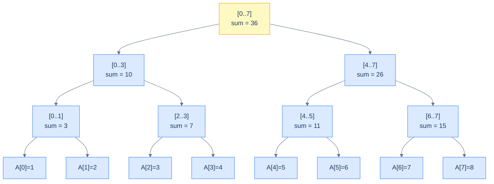

# 1. Introduction to Segment Trees

## The Hook

You have an array of a million numbers. You'll be asked, repeatedly, two kinds of question:

- **Range sum:** what's the sum of `arr[lo..hi]`?
- **Point update:** set `arr[i] = newValue`.

The naive answers are `O(n)` per query (linear scan) and `O(1)` per update — fine if you have only a few queries, fatal once you're handling thousands per second on a million-element array. If you precompute a prefix-sum array (cumulative sum at every index), range sum collapses to `O(1)` (`prefix[hi] - prefix[lo-1]`), but every point update now costs `O(n)` to rebuild the prefix.

A **segment tree** makes both operations `O(log n)`. It's a binary tree where each node stores an *aggregate* (sum, min, max, GCD, anything associative) over a contiguous range of array indices. The root covers `[0, n-1]`. Each child covers half. Leaves are individual array slots. A range query walks the tree gathering the relevant pre-aggregated subranges; a point update walks from the leaf up, refreshing the affected nodes.

This chapter is the introduction. By the end you'll be able to build a segment tree, do point updates and range queries in `O(log n)`, extend it to range updates via lazy propagation, and recognise where segment trees show up in database query planners and competitive programming.

---

## Table of contents

1. [The range-query problem](#the-range-query-problem)
2. [The segment tree shape](#the-segment-tree-shape)
3. [Build, query, update](#build-query-update)
4. [Lazy propagation: range updates in O(log n)](#lazy-propagation-range-updates-in-o-log-n)
5. [Implementation](#implementation)
6. [Edge cases and pitfalls](#edge-cases-and-pitfalls)
7. [Production reality](#production-reality)
8. [Practice ladder](#practice-ladder)
9. [Cross-links](#cross-links)
10. [Final takeaway](#final-takeaway)

***

# The range-query problem

The range-query problem is the umbrella for a family of operations on an array `A` of length `n`:

- `query(lo, hi)` — return the aggregate of `A[lo..hi]` (sum, min, max, GCD, XOR, …).
- `update(i, x)` — set `A[i] = x` (point update).
- `range_update(lo, hi, x)` — add `x` to every element of `A[lo..hi]` (range update — needs lazy propagation).

The naive solutions:

| Strategy | query | update | range_update |
|---|---|---|---|
| Plain array | `O(n)` | `O(1)` | `O(n)` |
| Prefix sum | `O(1)` | `O(n)` | `O(n)` |
| Segment tree | `O(log n)` | `O(log n)` | `O(log n)` (with lazy propagation) |

Segment tree wins when you need *both* range queries and frequent updates on the same data.

***

# The segment tree shape

A segment tree over an array of size `n` is a binary tree with these properties:

1. **The root** represents the full range `[0, n-1]`.
2. **Each internal node** representing `[l, r]` has two children: left covers `[l, mid]`, right covers `[mid+1, r]`, where `mid = (l + r) / 2`.
3. **Each leaf** represents a single array index `[i, i]`.
4. **Each node stores the aggregate** (sum, min, max, …) of its range.

For `n` not a power of 2, the tree is "almost complete" — height is `⌈log₂ n⌉ + 1`. We store it in a flat array of size `4n` (large enough to handle worst-case sizing); index 1 is the root, index `2k` is the left child of index `k`, index `2k + 1` is the right child.



<p align="center"><strong>Segment tree for <code>A = [1,2,3,4,5,6,7,8]</code> storing range sums. The root covers the full array; each internal node aggregates its two children; leaves are single array slots.</strong></p>

***

# Build, query, update

## Build

Build the tree recursively from leaves up. `O(n)` time.

```pseudocode
function build(node, l, r):
    if l = r:
        tree[node] ← A[l]
        return
    mid ← (l + r) / 2
    build(2*node,     l,     mid)
    build(2*node + 1, mid+1, r)
    tree[node] ← tree[2*node] + tree[2*node + 1]
```

## Range query

Recursively descend; at each node, decide whether the current node's range is *fully inside* the query range, *fully outside*, or *partially overlapping*.

```pseudocode
function query(node, l, r, ql, qr):
    if qr < l OR ql > r: return 0           # no overlap
    if ql ≤ l AND r ≤ qr: return tree[node] # fully inside
    mid ← (l + r) / 2
    return query(2*node,     l,     mid, ql, qr)
         + query(2*node + 1, mid+1, r,   ql, qr)
```

`O(log n)` because at most 4 "partial overlap" nodes per level.

## Point update

```pseudocode
function update(node, l, r, idx, value):
    if l = r:
        tree[node] ← value
        return
    mid ← (l + r) / 2
    if idx ≤ mid: update(2*node,     l,     mid, idx, value)
    else:         update(2*node + 1, mid+1, r,   idx, value)
    tree[node] ← tree[2*node] + tree[2*node + 1]
```

`O(log n)` — walk down to the leaf, update it, refresh aggregates on the way back up.

***

# Lazy propagation: range updates in O(log n)

A naive range update — "add `x` to every `A[i]` for `lo ≤ i ≤ hi`" — touches `hi - lo + 1` nodes, `O(n)` worst case.

**Lazy propagation** fixes this. Idea: when you'd update an entire subtree, just mark the *root of that subtree* with a "pending: add `x` to my range" tag. Defer the actual propagation until someone queries inside the subtree.

Each node carries a `lazy` field, initially 0. When we visit a node with non-zero `lazy`:

1. Apply the lazy to the node's aggregate (`tree[node] += lazy * range_size`).
2. *Push* the lazy to children if not a leaf (`lazy[children] += lazy`).
3. Clear the node's lazy.

Range update walks the tree; at any node whose range is entirely inside the update range, mark `lazy` and stop descending. Otherwise, push pending lazy to children and recurse.

```pseudocode
function push(node, l, r):
    if lazy[node] ≠ 0:
        tree[node] ← tree[node] + lazy[node] * (r − l + 1)
        if l ≠ r:                                  # not a leaf
            lazy[2*node]     += lazy[node]
            lazy[2*node + 1] += lazy[node]
        lazy[node] ← 0

function range_update(node, l, r, ql, qr, val):
    push(node, l, r)
    if qr < l OR ql > r: return
    if ql ≤ l AND r ≤ qr:
        lazy[node] += val
        push(node, l, r)
        return
    mid ← (l + r) / 2
    range_update(2*node,     l,     mid, ql, qr, val)
    range_update(2*node + 1, mid+1, r,   ql, qr, val)
    tree[node] ← tree[2*node] + tree[2*node + 1]

function range_query(node, l, r, ql, qr):
    if qr < l OR ql > r: return 0
    push(node, l, r)
    if ql ≤ l AND r ≤ qr: return tree[node]
    mid ← (l + r) / 2
    return range_query(2*node, l, mid, ql, qr)
         + range_query(2*node + 1, mid+1, r, ql, qr)
```

Both operations are `O(log n)`. The `lazy` array is touched at most `O(log n)` times per call; pending updates accumulate and are pushed only when needed.

***

# Implementation

```python run
class SegTree:
    def __init__(self, arr):
        self.n = len(arr)
        self.tree = [0] * (4 * self.n)
        self.lazy = [0] * (4 * self.n)
        if self.n > 0:
            self._build(arr, 1, 0, self.n - 1)

    def _build(self, arr, node, l, r):
        if l == r:
            self.tree[node] = arr[l]
            return
        mid = (l + r) // 2
        self._build(arr, 2*node,   l,     mid)
        self._build(arr, 2*node+1, mid+1, r)
        self.tree[node] = self.tree[2*node] + self.tree[2*node+1]

    def _push(self, node, l, r):
        if self.lazy[node]:
            self.tree[node] += self.lazy[node] * (r - l + 1)
            if l != r:
                self.lazy[2*node]   += self.lazy[node]
                self.lazy[2*node+1] += self.lazy[node]
            self.lazy[node] = 0

    def range_update(self, ql, qr, val, node=1, l=0, r=None):
        if r is None: r = self.n - 1
        self._push(node, l, r)
        if qr < l or ql > r: return
        if ql <= l and r <= qr:
            self.lazy[node] += val
            self._push(node, l, r)
            return
        mid = (l + r) // 2
        self.range_update(ql, qr, val, 2*node,   l,     mid)
        self.range_update(ql, qr, val, 2*node+1, mid+1, r)
        self.tree[node] = self.tree[2*node] + self.tree[2*node+1]

    def range_query(self, ql, qr, node=1, l=0, r=None):
        if r is None: r = self.n - 1
        if qr < l or ql > r: return 0
        self._push(node, l, r)
        if ql <= l and r <= qr: return self.tree[node]
        mid = (l + r) // 2
        return (self.range_query(ql, qr, 2*node,   l,     mid)
              + self.range_query(ql, qr, 2*node+1, mid+1, r))


if __name__ == "__main__":
    arr = [1, 2, 3, 4, 5, 6, 7, 8]
    st = SegTree(arr)

    print(f"sum of [0..7]:  {st.range_query(0, 7)}   (expected 36)")
    print(f"sum of [2..5]:  {st.range_query(2, 5)}   (expected 18)")

    # Range update: add 10 to every element in [3..5]
    st.range_update(3, 5, 10)
    print(f"after +10 on [3..5]:")
    print(f"  sum of [0..7]:  {st.range_query(0, 7)}   (expected 36 + 30 = 66)")
    print(f"  sum of [3..5]:  {st.range_query(3, 5)}   (expected 4+5+6 + 30 = 45)")
    print(f"  sum of [0..2]:  {st.range_query(0, 2)}   (expected 1+2+3 = 6, unchanged)")
```

```java run
public class Main {
    static int n;
    static long[] tree, lazy;

    static void build(int[] arr, int node, int l, int r) {
        if (l == r) { tree[node] = arr[l]; return; }
        int mid = (l + r) / 2;
        build(arr, 2*node,   l,     mid);
        build(arr, 2*node+1, mid+1, r);
        tree[node] = tree[2*node] + tree[2*node+1];
    }

    static void push(int node, int l, int r) {
        if (lazy[node] != 0) {
            tree[node] += lazy[node] * (long)(r - l + 1);
            if (l != r) {
                lazy[2*node]   += lazy[node];
                lazy[2*node+1] += lazy[node];
            }
            lazy[node] = 0;
        }
    }

    static void rangeUpdate(int node, int l, int r, int ql, int qr, int val) {
        push(node, l, r);
        if (qr < l || ql > r) return;
        if (ql <= l && r <= qr) {
            lazy[node] += val;
            push(node, l, r);
            return;
        }
        int mid = (l + r) / 2;
        rangeUpdate(2*node,   l,     mid, ql, qr, val);
        rangeUpdate(2*node+1, mid+1, r,   ql, qr, val);
        tree[node] = tree[2*node] + tree[2*node+1];
    }

    static long rangeQuery(int node, int l, int r, int ql, int qr) {
        if (qr < l || ql > r) return 0;
        push(node, l, r);
        if (ql <= l && r <= qr) return tree[node];
        int mid = (l + r) / 2;
        return rangeQuery(2*node,   l,     mid, ql, qr)
             + rangeQuery(2*node+1, mid+1, r,   ql, qr);
    }

    public static void main(String[] args) {
        int[] arr = {1, 2, 3, 4, 5, 6, 7, 8};
        n = arr.length;
        tree = new long[4*n];
        lazy = new long[4*n];
        build(arr, 1, 0, n-1);
        System.out.println("sum [0..7] = " + rangeQuery(1, 0, n-1, 0, 7));
        rangeUpdate(1, 0, n-1, 3, 5, 10);
        System.out.println("after +10 on [3..5], sum [0..7] = " + rangeQuery(1, 0, n-1, 0, 7));
    }
}
```

```c run
#include <stdio.h>
#include <stdlib.h>

#define N 8
long tree[4*N], lazy[4*N];
int A[N] = {1, 2, 3, 4, 5, 6, 7, 8};

void build(int node, int l, int r) {
    if (l == r) { tree[node] = A[l]; return; }
    int mid = (l + r) / 2;
    build(2*node,   l,     mid);
    build(2*node+1, mid+1, r);
    tree[node] = tree[2*node] + tree[2*node+1];
}

void push(int node, int l, int r) {
    if (lazy[node]) {
        tree[node] += lazy[node] * (long)(r - l + 1);
        if (l != r) {
            lazy[2*node]   += lazy[node];
            lazy[2*node+1] += lazy[node];
        }
        lazy[node] = 0;
    }
}

void range_update(int node, int l, int r, int ql, int qr, int val) {
    push(node, l, r);
    if (qr < l || ql > r) return;
    if (ql <= l && r <= qr) { lazy[node] += val; push(node, l, r); return; }
    int mid = (l + r) / 2;
    range_update(2*node,   l,     mid, ql, qr, val);
    range_update(2*node+1, mid+1, r,   ql, qr, val);
    tree[node] = tree[2*node] + tree[2*node+1];
}

long range_query(int node, int l, int r, int ql, int qr) {
    if (qr < l || ql > r) return 0;
    push(node, l, r);
    if (ql <= l && r <= qr) return tree[node];
    int mid = (l + r) / 2;
    return range_query(2*node,   l,     mid, ql, qr)
         + range_query(2*node+1, mid+1, r,   ql, qr);
}

int main(void) {
    build(1, 0, N-1);
    printf("sum [0..7] = %ld\n", range_query(1, 0, N-1, 0, 7));
    range_update(1, 0, N-1, 3, 5, 10);
    printf("after +10 on [3..5], sum [0..7] = %ld\n", range_query(1, 0, N-1, 0, 7));
    return 0;
}
```

```scala run
object Main extends App {
  val A = Array(1, 2, 3, 4, 5, 6, 7, 8)
  val n = A.length
  val tree = new Array[Long](4 * n)
  val lazyA = new Array[Long](4 * n)

  def build(node: Int, l: Int, r: Int): Unit = {
    if (l == r) { tree(node) = A(l); return }
    val mid = (l + r) / 2
    build(2*node, l, mid); build(2*node + 1, mid + 1, r)
    tree(node) = tree(2*node) + tree(2*node + 1)
  }

  def push(node: Int, l: Int, r: Int): Unit = {
    if (lazyA(node) != 0L) {
      tree(node) += lazyA(node) * (r - l + 1).toLong
      if (l != r) { lazyA(2*node) += lazyA(node); lazyA(2*node + 1) += lazyA(node) }
      lazyA(node) = 0L
    }
  }

  def rangeUpdate(node: Int, l: Int, r: Int, ql: Int, qr: Int, v: Long): Unit = {
    push(node, l, r)
    if (qr < l || ql > r) return
    if (ql <= l && r <= qr) { lazyA(node) += v; push(node, l, r); return }
    val mid = (l + r) / 2
    rangeUpdate(2*node, l, mid, ql, qr, v)
    rangeUpdate(2*node + 1, mid + 1, r, ql, qr, v)
    tree(node) = tree(2*node) + tree(2*node + 1)
  }

  def rangeQuery(node: Int, l: Int, r: Int, ql: Int, qr: Int): Long = {
    if (qr < l || ql > r) return 0L
    push(node, l, r)
    if (ql <= l && r <= qr) return tree(node)
    val mid = (l + r) / 2
    rangeQuery(2*node, l, mid, ql, qr) + rangeQuery(2*node + 1, mid + 1, r, ql, qr)
  }

  build(1, 0, n - 1)
  println(s"sum [0..7] = ${rangeQuery(1, 0, n - 1, 0, 7)}")
  rangeUpdate(1, 0, n - 1, 3, 5, 10)
  println(s"after +10 on [3..5], sum [0..7] = ${rangeQuery(1, 0, n - 1, 0, 7)}")
}
```

***

# Edge cases and pitfalls

- **The `4n` array sizing.** The tree array needs to be at least `4n` to handle the worst-case (non-power-of-2 `n`). Sizing it `2n` works for power-of-2 sizes but corrupts memory otherwise. Always use `4n`.
- **Forgetting to push lazy before reading.** Every `query` and `range_update` must `push` *before* it descends. Forget the push and stale aggregates leak into your answer.
- **Lazy combine rule depends on the operation.** For sum-with-range-add, `lazy += val`. For min-with-range-set, `lazy = val` (overwrite). For min-with-range-add, `lazy += val` and the propagation is `tree[node] += lazy[node]`. Each combination has its own arithmetic; document what you intend.
- **Integer overflow.** `lazy[node] * (r - l + 1)` can overflow `int32_t` for large ranges and large pending values. Use `int64_t` (Java `long`, C++ `long long`).
- **Sizing arrays in dynamic languages.** Python lists grow on demand, but pre-allocating `4n` zero-filled is `O(n)` and avoids resize-during-build. Java/C/C++ require `4n` fixed sizing.
- **Recursive call stack.** A segment tree on `n = 10⁶` has depth `~20` — no stack-overflow concern. For `n` in the billions (unusual; segment trees on arrays that big don't fit in memory), iterative implementations exist.
- **0-indexed vs 1-indexed for tree storage.** The tree uses 1-indexed (`2k`, `2k+1` for children). The array `A` and the query interface should use 0-indexed. Mixing them is the most common source of off-by-one bugs.
- **Range bounds inclusive vs exclusive.** This chapter uses *inclusive* `[l, r]` throughout. Some references use half-open `[l, r)`. Pick one and stick with it; converting between them is a frequent off-by-one.

***

# Production reality

- **Competitive programming.** Segment trees are a workhorse — Codeforces, ICPC, IOI problems involving "answer K queries of form Q on an array" almost always solve via segment tree (or its sibling, the Fenwick tree).
- **Time-series databases.** TimescaleDB's continuous aggregates and InfluxDB's window functions use segment-tree-like structures internally for fast range aggregation. The query "average value over the last hour" doesn't scan the raw data — it walks pre-aggregated buckets.
- **Database query optimisers.** Range-statistics histograms inside Postgres (used to estimate the cost of `WHERE x BETWEEN a AND b`) use range-tree techniques conceptually similar to segment trees, though the on-disk layout differs.
- **Computer graphics: BVH (Bounding Volume Hierarchy)** trees used for ray-tracing acceleration are spatial generalisations of segment trees — a tree where each node stores an AABB (axis-aligned bounding box) over its subtree, and ray-AABB intersection prunes the search.
- **Linux kernel `lib/interval_tree.c`** uses an augmented red-black tree for one-dimensional range queries — a different implementation strategy for the same kind of query.
- **Game engines.** Spatial query structures (k-d trees, BVHs, octrees) for collision detection and visibility culling are higher-dimensional segment-tree variants.
- **Why not used for general range queries in databases?** Segment trees have `O(log n)` per query but with significant constant factors, and don't compose well with on-disk pages. For OLAP workloads, columnar formats with skip indexes (Parquet) are a better disk-aware fit.

***

# Practice ladder

1. **Range Sum Query - Mutable** ([LeetCode 307](https://leetcode.com/problems/range-sum-query-mutable/)) — implement `update(i, val)` and `sumRange(l, r)`.
   > *Hint:* the chapter's segment tree, copy and adapt.

2. **Range Minimum** — modify the segment tree to support range minimum queries instead of sum. What changes?
   > *Hint:* aggregate function changes from `+` to `min`. The lazy operation depends on whether you want range *set* (overwrite) or range *add*. For range-set min, lazy is "the value all nodes in this range have been set to"; query reads `lazy` if non-null else `tree`.

3. **Count of Range Sum** ([LeetCode 327](https://leetcode.com/problems/count-of-range-sum/)) — given an array and a range `[lower, upper]`, count subarrays whose sum is in that range.
   > *Hint:* compute prefix sums, sort their compressed coordinates, build a segment tree indexed by prefix-sum value, and for each prefix sum count how many earlier prefix sums fall in `[prefix - upper, prefix - lower]`.

4. **Lazy propagation: range update + range query.** Implement a segment tree supporting both `add v to A[l..r]` and `sum of A[l..r]`. Test on a billion operations and verify correctness against brute force on small inputs.
   > *Hint:* the chapter's implementation. The bug to watch for: forgetting to push lazy in `query` before descending.

5. **Segment tree beats: hardest competitive variant.** Read about [Segment Tree Beats](https://codeforces.com/blog/entry/57319). Implement a tree supporting `chmin(l, r, x)` (clip every element in `[l..r]` to at most `x`) and range-sum query, in `O(log² n)` amortized.
   > *Hint:* each node stores max, second-max, count of max, and sum. The "beats" trick is to skip subtrees whose max is already ≤ x, descend lazily otherwise.

***

# Memorize

The high-leverage facts to commit to long-term memory — atomic enough for an Anki card, concrete enough to recall under pressure or during production debugging. Segment trees are competitive-programming bread and butter; the array-sizing and lazy-push patterns are easy to get wrong without these on the tip of your tongue.

## Quick recall

Click any question to reveal the answer.

<details>
<summary><strong>Q:</strong> Worst-case complexity of segment-tree range query and point update?</summary>

**A:** Both `O(log n)`.

</details>

<details>
<summary><strong>Q:</strong> Worst-case complexity of range update with lazy propagation?</summary>

**A:** `O(log n)` (without lazy it'd be `O(n)`).

</details>

<details>
<summary><strong>Q:</strong> Required tree-array sizing?</summary>

**A:** `4 · n`. Sizing `2 · n` only works for power-of-2 `n` and corrupts memory otherwise. Always use `4 · n`.

</details>

<details>
<summary><strong>Q:</strong> What does the lazy <code>push</code> operation do?</summary>

**A:** Applies the pending lazy value to the node's aggregate, propagates it to children (if not a leaf), then clears the node's lazy. Must be called at the start of every recursive descent.

</details>

<details>
<summary><strong>Q:</strong> Why must <code>push</code> happen before reading a child?</summary>

**A:** A pending lazy on the parent reflects an uncommitted update over the children's range. Reading a child without pushing first returns a stale aggregate.

</details>

<details>
<summary><strong>Q:</strong> Three node-relationship cases during a recursive query?</summary>

**A:** **No overlap** with query range → return identity. **Fully inside** query range → return the node's aggregate (no descent). **Partial overlap** → push lazy, recurse on both children, combine.

</details>

<details>
<summary><strong>Q:</strong> When is a Fenwick tree better than a segment tree?</summary>

**A:** When the operation is *invertible* (sum, XOR) and you only need point updates + prefix queries. Half the LOC, half the constant factor.

</details>

<details>
<summary><strong>Q:</strong> When is a segment tree the only choice (over Fenwick)?</summary>

**A:** Non-invertible operations (min, max, GCD), range updates with lazy propagation, or augmented operations (segment-tree beats, persistent segment trees).

</details>

<details>
<summary><strong>Q:</strong> Where do segment trees show up in production (vs competitive programming)?</summary>

**A:** Time-series databases (continuous aggregates), spatial indexing (BVH for ray tracing is a 3D segment tree), Linux's `interval_tree.c` for one-dimensional range queries.

</details>

<details>
<summary><strong>Q:</strong> What's the integer-overflow trap when applying a lazy value over a range?</summary>

**A:** `lazy * (r − l + 1)` overflows `int32` for large ranges and large lazy values. Use `int64` (Java `long`, C++ `long long`).

</details>

## Code template

```python
class SegTree:
    def __init__(self, arr):
        self.n = len(arr)
        self.tree = [0] * (4 * self.n)
        self.lazy = [0] * (4 * self.n)
        if self.n > 0: self._build(arr, 1, 0, self.n - 1)

    def _build(self, arr, node, l, r):
        if l == r: self.tree[node] = arr[l]; return
        mid = (l + r) // 2
        self._build(arr, 2*node,   l,     mid)
        self._build(arr, 2*node+1, mid+1, r)
        self.tree[node] = self.tree[2*node] + self.tree[2*node+1]

    def _push(self, node, l, r):
        if self.lazy[node]:
            self.tree[node] += self.lazy[node] * (r - l + 1)
            if l != r:
                self.lazy[2*node]   += self.lazy[node]
                self.lazy[2*node+1] += self.lazy[node]
            self.lazy[node] = 0

    # range_update / range_query: push first, then 3-case branch.
```

## Pattern triggers

- **"Range sum + point update on a mutable array"** → Fenwick is simpler; segment tree if you need range updates too
- **"Range min/max/GCD + point/range update"** → segment tree (Fenwick can't do non-invertible ops)
- **"Range assignment + range query"** → segment tree with lazy = "the value the entire range was set to"
- **"K-th smallest in a range"** → persistent segment tree, or merge sort tree
- **"Count inversions"** → Fenwick over coordinate-compressed values; segment tree works too
- **"Range queries on a 2D grid"** → 2D segment tree or 2D Fenwick (`O(log² n)` per op)
- **"Forgetting to push lazy in query"** → returns stale aggregates; classic bug
- **"`tree[]` sized `2n` and getting weird answers"** → resize to `4n`

***

# Cross-links

- **Sibling structure:** [Fenwick Tree](/cortex/data-structures-and-algorithms/trees-fenwick-tree-introduction-to-fenwick-trees) — half the constant factor and half the lines of code, restricted to commutative operations.
- **Used by:** [Strings module](/cortex/data-structures-and-algorithms/strings-index) — segment trees over suffix-array LCP values are a standard tool.
- **Foundations:** [Asymptotic Analysis](/cortex/data-structures-and-algorithms/foundations-asymptotic-analysis), [Recurrence Relations](/cortex/data-structures-and-algorithms/foundations-recurrence-relations-and-master-theorem) (segment tree query has the recurrence `T(n) = T(n/2) + O(1)` × at most 2 paths = `O(log n)`).

***

# Final Takeaway

A segment tree is a binary tree of pre-aggregated subarrays. Three patterns to internalise:

1. **Both queries and updates in O(log n).** That's the operating point a plain array (O(1) update, O(n) query) and prefix sum (O(1) query, O(n) update) can't reach.
2. **Lazy propagation buys range updates.** Without lazy, range updates are O(n). With lazy, they're O(log n). Worth the extra `lazy` array and the extra `push` discipline.
3. **The right tool for "lots of queries + lots of updates on the same array".** For pure queries on a static array, prefix sum or RMQ-via-sparse-table is faster (O(1) per query). For point updates only, Fenwick tree is simpler. Segment tree dominates when both query and update are frequent.
