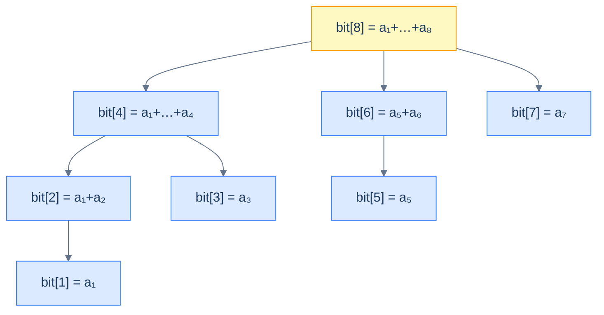

# 1. Introduction to Fenwick Trees (BIT)

## The Hook

Peter Fenwick published a five-page paper in 1994 titled "A new data structure for cumulative frequency tables". It described an algorithm for prefix-sum queries with point updates that ran in `O(log n)` and fit in *one array of size n* — no tree, no nodes, no pointers. The whole implementation was six lines per operation.

The trick was a single bit-manipulation expression: `i & (-i)`. That expression isolates the **lowest set bit** of `i`, and Fenwick noticed that *jumping by the lowest set bit*, repeatedly, walks an implicit binary tree over the array. Updates climb up; queries descend. The tree is never built; it's an artefact of the bit pattern of integers from 1 to n.

The Fenwick tree (also called a **BIT** for Binary Indexed Tree) does exactly what a segment tree does for prefix sums and point updates — *and* does it with half the code, half the memory, and a smaller constant factor. The catch: it only works for **invertible** operations (sum, XOR), not min or max. For sum-with-point-update, it's the cleanest implementation in any data-structure textbook. This chapter is the introduction.

---

## Table of contents

1. [The lowest-set-bit trick](#the-lowest-set-bit-trick)
2. [How the implicit tree works](#how-the-implicit-tree-works)
3. [Operations: prefix sum, point update, range sum](#operations-prefix-sum-point-update-range-sum)
4. [Implementation](#implementation)
5. [Edge cases and pitfalls](#edge-cases-and-pitfalls)
6. [Production reality](#production-reality)
7. [Practice ladder](#practice-ladder)
8. [Cross-links](#cross-links)
9. [Final takeaway](#final-takeaway)

***

# The lowest-set-bit trick

In two's-complement integer arithmetic, `i & (-i)` returns the lowest set bit of `i`. For example:

```
i  =     12  =  0000 1100
-i =          1111 0100      (two's complement)
i & -i  =    0000 0100  =  4
```

The lowest set bit of `12` is `4`. The lowest set bit of `13` is `1`. The lowest set bit of `8` is `8`. The lowest set bit of any power-of-2 is the number itself.

This expression is the *one* trick that powers everything in this chapter. Memorise it — it'll show up in [Bit Tricks](/cortex/data-structures-and-algorithms/bit-tricks-index) too.

***

# How the implicit tree works

A Fenwick tree of size `n` is a single array `bit[1..n]` (1-indexed throughout). Each `bit[i]` stores the sum of a *specific range* of the underlying array `A`:

> `bit[i]` stores the sum of `A[i - lowbit(i) + 1 .. i]`.

That is, each cell stores a sum of `lowbit(i)` consecutive `A` values, ending at index `i`.

```
i:        1     2     3     4     5     6     7     8
A[i]:     a₁    a₂    a₃    a₄    a₅    a₆    a₇    a₈
lowbit(i):1     2     1     4     1     2     1     8
bit[i]:   a₁  a₁+a₂   a₃   a₁+a₂+a₃+a₄   a₅  a₅+a₆   a₇   a₁+...+a₈
                                                          (full sum)
```

Visualised as ranges, each `bit[i]` covers a power-of-2-sized slice ending at `i`. The slices form a forest of implicit trees:



<p align="center"><strong>The implicit tree inside a Fenwick array. Each node's range covers a power of 2 slots; the tree's edges aren't stored — they emerge from the bit pattern of indices.</strong></p>

The tree is never materialised. The array `bit[]` is the entire data structure.

***

# Operations: prefix sum, point update, range sum

## Prefix sum (`sum of A[1..i]`)

Walk *down* the tree by repeatedly subtracting the lowest set bit until reaching 0. At each step add the current cell to the running sum.

```pseudocode
function prefixSum(i):
    s ← 0
    while i > 0:
        s ← s + bit[i]
        i ← i − (i & −i)              # strip lowest set bit
    return s
```

For `i = 13` (binary `1101`), the walk visits `13, 12, 8, 0`: subtract 1, then 4, then 8.

`O(log n)` — at most one bit removed per iteration, so at most `log₂(i)` iterations.

## Point update (`A[i] += delta`)

Walk *up* the tree by repeatedly adding the lowest set bit until reaching beyond `n`. At each step add `delta` to the current cell.

```pseudocode
function update(i, delta):
    while i ≤ n:
        bit[i] ← bit[i] + delta
        i ← i + (i & −i)              # add lowest set bit
```

For `i = 5` (binary `101`), the walk visits `5, 6, 8, 16, …`: add 1, then 2, then 8, …

`O(log n)`.

## Range sum (`sum of A[l..r]`)

```pseudocode
function rangeSum(l, r):
    return prefixSum(r) − prefixSum(l − 1)
```

`O(log n)` — two prefix-sum calls.

***

# Implementation

```python run
class Fenwick:
    def __init__(self, n):
        self.n = n
        self.bit = [0] * (n + 1)                                   # 1-indexed; bit[0] unused

    def update(self, i, delta):
        """Add `delta` to A[i] (1-indexed)."""
        while i <= self.n:
            self.bit[i] += delta
            i += i & -i

    def prefix_sum(self, i):
        """Return sum of A[1..i]."""
        s = 0
        while i > 0:
            s += self.bit[i]
            i -= i & -i
        return s

    def range_sum(self, l, r):
        return self.prefix_sum(r) - self.prefix_sum(l - 1)


if __name__ == "__main__":
    arr = [1, 2, 3, 4, 5, 6, 7, 8]
    bit = Fenwick(len(arr))
    for i, v in enumerate(arr, start=1):
        bit.update(i, v)

    print(f"sum [1..8] = {bit.range_sum(1, 8)}    (expected {sum(arr)})")
    print(f"sum [3..6] = {bit.range_sum(3, 6)}    (expected {sum(arr[2:6])})")

    bit.update(5, 100)                                              # A[5] += 100
    print(f"after A[5] += 100:")
    print(f"  sum [1..8] = {bit.range_sum(1, 8)}    (expected {sum(arr) + 100})")
    print(f"  sum [3..6] = {bit.range_sum(3, 6)}    (expected {sum(arr[2:6]) + 100})")
```

```java run
class Solution {
    static int n;
    static long[] bit;

    static void update(int i, long delta) {
        while (i <= n) { bit[i] += delta; i += i & -i; }
    }

    static long prefixSum(int i) {
        long s = 0;
        while (i > 0) { s += bit[i]; i -= i & -i; }
        return s;
    }

    static long rangeSum(int l, int r) { return prefixSum(r) - prefixSum(l - 1); }

    public static void main(String[] args) {
        int[] arr = {1, 2, 3, 4, 5, 6, 7, 8};
        n = arr.length;
        bit = new long[n + 1];
        for (int i = 1; i <= n; i++) update(i, arr[i - 1]);
        System.out.println("sum [1..8] = " + rangeSum(1, 8));
        update(5, 100);
        System.out.println("after A[5] += 100, sum [1..8] = " + rangeSum(1, 8));
    }
}
```

```c run
#include <stdio.h>

#define N 8
long bit[N + 1];

void update(int i, long delta) {
    while (i <= N) { bit[i] += delta; i += i & -i; }
}

long prefix_sum(int i) {
    long s = 0;
    while (i > 0) { s += bit[i]; i -= i & -i; }
    return s;
}

long range_sum(int l, int r) { return prefix_sum(r) - prefix_sum(l - 1); }

int main(void) {
    int A[] = {1, 2, 3, 4, 5, 6, 7, 8};
    for (int i = 1; i <= N; i++) update(i, A[i - 1]);
    printf("sum [1..8] = %ld\n", range_sum(1, 8));
    update(5, 100);
    printf("after A[5] += 100, sum [1..8] = %ld\n", range_sum(1, 8));
    return 0;
}
```

```scala run
object Solution {
  val n = 8
  val bit = new Array[Long](n + 1)

  def update(iIn: Int, delta: Long): Unit = {
    var i = iIn
    while (i <= n) { bit(i) += delta; i += i & -i }
  }

  def prefixSum(iIn: Int): Long = {
    var i = iIn; var s = 0L
    while (i > 0) { s += bit(i); i -= i & -i }
    s
  }

  def rangeSum(l: Int, r: Int): Long = prefixSum(r) - prefixSum(l - 1)

  def main(args: Array[String]): Unit = {
    val A = Array(1, 2, 3, 4, 5, 6, 7, 8)
    for (i <- 1 to n) update(i, A(i - 1))
    println(s"sum [1..8] = ${rangeSum(1, 8)}")
    update(5, 100)
    println(s"after A[5] += 100, sum [1..8] = ${rangeSum(1, 8)}")
  }
}
```

That's the entire structure. Six lines for `update`, six lines for `prefix_sum`, one line for `range_sum`. Compare to the segment tree, which needs hundreds of lines for the same functionality.

***

# Edge cases and pitfalls

- **1-indexed.** Fenwick trees are *always* 1-indexed. The `i & -i` trick relies on `i ≠ 0`, and `bit[0]` would be the loop's terminating sentinel. Convert from 0-indexed input arrays at the boundary.
- **Range update + point query** is also possible, with the *difference array* trick — we'd update at `l` (delta) and `r + 1` (-delta), then prefix-sum to read `A[i]`. The roles of update and query are swapped.
- **Range update + range query** is possible with *two* Fenwick trees, but the algebra is more involved. For range-update-range-query workloads, segment trees with lazy propagation are usually clearer.
- **Only invertible operations.** Fenwick trees work for sum (`+`/`−`), XOR (`^` is its own inverse), product modulo a prime (`*`/inverse). They *don't* work for min or max — there's no "subtract a value" operation that gives you back the min if you remove that value. For range-min queries with point updates, use a segment tree.
- **2D Fenwick trees** exist — `bit[i][j]` indexed by both axes; the loops are nested. They support range queries on a 2D grid in `O(log² n)`. Used in some image-processing and matrix-statistics workloads.
- **Coordinate compression** for non-integer or sparse keys. If your queries are over arbitrary `int64` keys (timestamps, IDs), index them by *rank* (their sorted position among all queried values) before feeding to the Fenwick tree.
- **Building from an array in O(n).** Naive build is `O(n log n)` (call `update` for each element). The trick: `bit[i] = sum of A[i - lowbit(i) + 1..i]`; compute by accumulating the *partial sums* of `A` and reading the right slice for each `i`. Or: incrementally, add `bit[i]`'s contribution to `bit[i + lowbit(i)]`. Either gets to `O(n)`.

***

# Production reality

- **Competitive programming.** Fenwick trees are *the* go-to for prefix-sum-with-updates problems. The implementation is short enough to memorise; you can write it during a contest in a minute.
- **Time-series databases and metrics systems.** Internal storage of time-bucketed counters often uses Fenwick-tree-like structures for fast cumulative queries.
- **Histograms.** Building a cumulative-distribution function (CDF) over a stream of observations: each new value is a point update, and percentile queries are prefix sums (compared to a target frequency).
- **Range counting in geometry.** "How many points are in this rectangle?" → after coordinate compression, a 2D Fenwick tree answers in `O(log² n)`.
- **Linux's perf event infrastructure** uses cumulative counters with locking around updates; conceptually the same prefix-sum-with-updates problem, though not directly a BIT. Any "running total over time" structure is in spirit a Fenwick tree.
- **Order statistics**: a Fenwick tree indexed by *value* can answer "rank of value `x`" or "value at rank `k`" in `O(log n)`. This is the same role an *order-statistic BST* fills, with simpler code.
- **Why not in standard libraries?** Fenwick trees solve a niche problem (range query with invertible operation + point update). Most code that needs that ends up with a segment tree (more general) or a `numpy.cumsum` (when no updates). Fenwick stays specialised.

***

# Practice ladder

1. **Range Sum Query - Mutable** ([LeetCode 307](https://leetcode.com/problems/range-sum-query-mutable/)) — implement with a Fenwick tree. Compare LOC and runtime to the segment-tree solution.
   > *Hint:* the chapter's BIT class is sufficient. The LeetCode solution will be ~10 lines.

2. **Count of Smaller Numbers After Self** ([LeetCode 315](https://leetcode.com/problems/count-of-smaller-numbers-after-self/)) — for each `i`, count how many `j > i` have `A[j] < A[i]`.
   > *Hint:* coordinate-compress the values to dense integers. Walk `A` from right to left. For each value, query the BIT for "count of values seen so far that are less than this one" (prefix sum up to `value - 1`), then update the BIT with this value.

3. **Reverse Pairs** ([LeetCode 493](https://leetcode.com/problems/reverse-pairs/)) — count pairs `(i, j)` with `i < j` and `A[i] > 2 * A[j]`.
   > *Hint:* same idea as above, with a slight twist: query for `count of values > 2 * A[j]` while walking left to right.

4. **Range Sum Query 2D - Mutable** ([LeetCode 308](https://leetcode.com/problems/range-sum-query-2d-mutable/)) — point update on a 2D grid; range sum query over a rectangular region.
   > *Hint:* 2D Fenwick tree. `bit[i][j] += delta` walks both axes by their lowest-bit jumps. The query is two-dimensional inclusion-exclusion of prefix sums.

5. **K-th Smallest after each insertion.** Maintain a stream of integers. After each insertion, return the k-th smallest element seen so far.
   > *Hint:* Fenwick tree indexed by value (after coordinate compression). Each insertion updates by 1 at position `value`. To find the k-th smallest, *binary lift* down the BIT structure: descend from the highest bit looking for the smallest prefix sum ≥ k. `O(log n)` per query.

***

# Memorize

The high-leverage facts to commit to long-term memory — atomic enough for an Anki card, concrete enough to recall under pressure or during production debugging. The Fenwick tree is six lines per operation; if you can write it cold, you can solve every prefix-sum-with-updates problem.

## Quick recall

Click any question to reveal the answer.

<details>
<summary><strong>Q:</strong> What single bit-trick is the entire Fenwick tree built on?</summary>

**A:** `i & (−i)` — isolates the lowest set bit of `i`.

</details>

<details>
<summary><strong>Q:</strong> Update direction vs query direction?</summary>

**A:** **Update** walks *up*: `i += i & −i` until past `n`. **Query** walks *down*: `i -= i & −i` until 0.

</details>

<details>
<summary><strong>Q:</strong> Time complexity of update and prefix-sum query?</summary>

**A:** Both `O(log n)`. Each step strips or adds one bit.

</details>

<details>
<summary><strong>Q:</strong> Why is Fenwick 1-indexed?</summary>

**A:** The `i & −i` trick relies on `i ≠ 0`. `bit[0]` is the loop's terminating sentinel.

</details>

<details>
<summary><strong>Q:</strong> When can Fenwick replace segment tree?</summary>

**A:** When the operation is *invertible* (sum, XOR, product mod prime) and you need point updates + prefix/range queries. Half the code, half the memory, half the constant factor.

</details>

<details>
<summary><strong>Q:</strong> When can Fenwick <em>not</em> replace segment tree?</summary>

**A:** Min, max, GCD — there's no "subtract a value" inverse. Range update + range query is also more natural in segment tree.

</details>

<details>
<summary><strong>Q:</strong> Range sum from <code>l</code> to <code>r</code>?</summary>

**A:** `prefix_sum(r) − prefix_sum(l − 1)`. Two prefix-sum calls, `O(log n)` total.

</details>

<details>
<summary><strong>Q:</strong> Build cost from a length-<code>n</code> array — naive vs optimal?</summary>

**A:** Naive (call `update` for each): `O(n log n)`. Optimal (incremental partial-sum trick): `O(n)`.

</details>

## Code template

```python
class Fenwick:
    def __init__(self, n):
        self.n = n
        self.bit = [0] * (n + 1)                                    # 1-indexed

    def update(self, i, delta):                                     # O(log n)
        while i <= self.n:
            self.bit[i] += delta
            i += i & -i                                             # walk up

    def prefix_sum(self, i):                                        # O(log n)
        s = 0
        while i > 0:
            s += self.bit[i]
            i -= i & -i                                             # walk down
        return s

    def range_sum(self, l, r):                                      # O(log n)
        return self.prefix_sum(r) - self.prefix_sum(l - 1)
```

## Pattern triggers

- **"Prefix sum that needs to support point updates"** → Fenwick
- **"Count inversions in an array"** → Fenwick over coordinate-compressed values
- **"Count smaller elements after self / Count of range sum"** → Fenwick
- **"K-th smallest in a stream"** → Fenwick indexed by value + binary-lift descent
- **"2D range counting after coordinate compression"** → 2D Fenwick, `O(log² n)`
- **"Range sum + point update"** → Fenwick (over segment tree's overhead)
- **"Range update + point query"** → Fenwick on a difference array
- **"Min/max/GCD over a range"** → segment tree, not Fenwick

***

# Cross-links

- **Sibling structure:** [Segment Tree](/cortex/data-structures-and-algorithms/trees-segment-tree-introduction-to-segment-trees) — more general, more complex, more memory.
- **Bit-trick reference:** [Pattern: Kth Bit](/cortex/data-structures-and-algorithms/bit-tricks-pattern-kth-bit) — the `i & -i` move comes from there.
- **Foundations:** [Asymptotic Analysis](/cortex/data-structures-and-algorithms/foundations-asymptotic-analysis), [Recurrence Relations](/cortex/data-structures-and-algorithms/foundations-recurrence-relations-and-master-theorem) (the BIT operation cost is the recurrence `T(n) = T(n/2) + O(1) → O(log n)`).

***

# Final Takeaway

The Fenwick tree is the one-trick wonder of competitive programming. Three patterns to internalise:

1. **`i & (-i)` is the whole structure.** That single bit-trick is what turns the implicit tree into a flat array. Once you've internalised the trick, the algorithm is six lines.
2. **Restricted to invertible operations.** Sum, XOR, product modulo a prime work. Min, max, GCD don't. For non-invertible operations, use a segment tree.
3. **Half the cost of a segment tree.** Half the memory (`n` instead of `4n`), half the constant factor in operations (no recursion, simpler memory access pattern), an order of magnitude less code. When the problem fits, the BIT wins.
