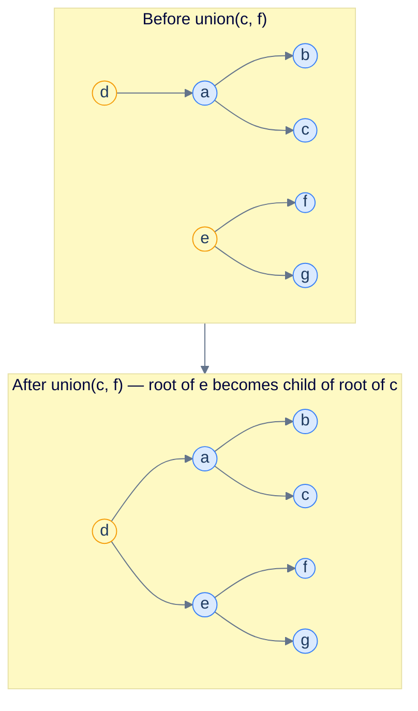
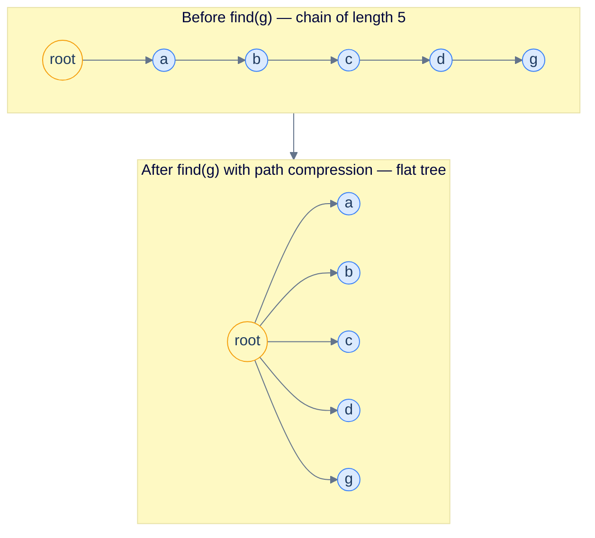

# 1. Introduction to Disjoint Set Union

## The Hook

You're running an online social network. As friendships are added in real time (one edge per millisecond), you need to answer queries in real time too: *are these two users in the same friend cluster?* — i.e. is there *any* path of friendships between them?

Treat the network as a graph. Each `add_friend(u, v)` adds an undirected edge. Each `same_cluster(u, v)` asks if `u` and `v` are in the same connected component. With BFS/DFS for each query, every `same_cluster` is `O(V + E)` — fatal.

The data structure that makes both operations effectively `O(1)` is the **Disjoint Set Union** (DSU), also called the **Union-Find**. It maintains a collection of disjoint sets and supports two operations:

- **`find(x)`** — return a *representative* of the set containing `x` (a "leader" of the cluster).
- **`union(x, y)`** — merge the two sets containing `x` and `y` into one.

Two queries on the same component get the same representative; otherwise different. The whole structure fits in a single integer array of size `n`. With two simple optimisations — *path compression* and *union by rank* — both operations run in `O(α(n))` amortised time, where `α` is the inverse Ackermann function. For any `n` you'll ever see in production, `α(n) ≤ 4`. Effectively constant.

This chapter is the introduction. By the end you'll be able to implement DSU, see why path compression + union by rank gives the famous `α(n)` bound, and recognise where DSU shows up in Kruskal's MST and graph-connectivity problems across the curriculum.

---

## Table of contents

1. [The connectivity problem](#the-connectivity-problem)
2. [Naive implementation: linked lists](#naive-implementation-linked-lists)
3. [DSU: parent pointers](#dsu-parent-pointers)
4. [Path compression](#path-compression)
5. [Union by rank (or size)](#union-by-rank-or-size)
6. [Why both together gives α(n)](#why-both-together-gives-an)
7. [Implementation](#implementation)
8. [Edge cases and pitfalls](#edge-cases-and-pitfalls)
9. [Production reality](#production-reality)
10. [Practice ladder](#practice-ladder)
11. [Cross-links](#cross-links)
12. [Final takeaway](#final-takeaway)

***

# The connectivity problem

You have `n` items, initially each in its own set. You'll process a sequence of `m` operations, each being either:

- `union(x, y)` — merge `x`'s set with `y`'s set.
- `same_set(x, y)` — return `true` iff `x` and `y` are currently in the same set.

The total work matters: across all `m` operations, what's the total cost? If individual ops are cheap, the structure scales.

Naive approaches:

- **Adjacency list of edges, BFS per query.** `O(n + m)` per `same_set`; `O(m × (n + m))` total. Fatal.
- **Map each element to an integer "set ID", relabel on union.** `O(1)` per `same_set` but `O(n)` per `union` (worst case: half the elements need relabelling). Fatal.

DSU does both in *amortised constant time*.

***

# Naive implementation: linked lists

The simplest DSU: each set is a linked list, and each element stores a pointer to the head (the set's "leader"). `find(x)` returns `x.head` in `O(1)`. `union(x, y)` walks the smaller list, repointing each element's head to the larger set's head. `O(min(|set(x)|, |set(y)|))` per union — quadratic in the worst case but linearithmic on average.

This is the "naive but workable" baseline. Real DSU goes further.

***

# DSU: parent pointers

Each element stores a single parent pointer, forming a forest. The "leader" of a set is the **root** of the tree containing that element.

- `find(x)`: walk up parent pointers until reaching the root.
- `union(x, y)`: find both roots; make one the parent of the other.

```d3 widget=union-find
{
  "title": "DSU — initial state (n=5)",
  "steps": [
    {
      "nodes": [
        {"id": "0", "label": "0", "kind": "root", "slot": 0, "meta": [], "cardId": "", "layoutKind": ""},
        {"id": "1", "label": "1", "kind": "root", "slot": 1, "meta": [], "cardId": "", "layoutKind": ""},
        {"id": "2", "label": "2", "kind": "root", "slot": 2, "meta": [], "cardId": "", "layoutKind": ""},
        {"id": "3", "label": "3", "kind": "root", "slot": 3, "meta": [], "cardId": "", "layoutKind": ""},
        {"id": "4", "label": "4", "kind": "root", "slot": 4, "meta": [], "cardId": "", "layoutKind": ""}
      ],
      "edges": [
        {"from": "0", "to": "0", "label": ""},
        {"from": "1", "to": "1", "label": ""},
        {"from": "2", "to": "2", "label": ""},
        {"from": "3", "to": "3", "label": ""},
        {"from": "4", "to": "4", "label": ""}
      ],
      "cursor": [], "highlight": [], "changed": [], "removed": [],
      "annotation": "Initial state: parent = [0, 1, 2, 3, 4]. Each element is its own root.",
      "line": 0, "frames": [], "cardCursor": []
    }
  ]
}
```

<p align="center"><strong>Initial state: each element is its own root. parent[i] = i for all i.</strong></p>



<p align="center"><strong>DSU as a parent-pointer forest. <code>find(c)</code> walks up <code>c → a → d</code> and returns <code>d</code>. <code>find(f)</code> walks up <code>f → e</code> and returns <code>e</code>. <code>union(c, f)</code> makes <code>e</code> a child of <code>d</code>; now both trees share root <code>d</code>.</strong></p>

Worst-case `find` cost: `O(tree height)`. Without optimisation, the tree can become a long chain — `O(n)` per query. The two optimisations below fix that.

***

# Path compression

When `find(x)` walks up to the root, *re-point every node along the path directly to the root* on the way back down. The next `find` on any of those nodes is `O(1)`.



<p align="center"><strong>Path compression flattens the tree as a side effect of every <code>find</code>. The first <code>find(g)</code> on a chain of 5 takes 5 hops; subsequent <code>find</code>s on any of those nodes take 1 hop.</strong></p>

***

# Union by rank (or size)

When unioning two trees, attach the *shorter* one under the *taller* one — or by *size*, attach the *smaller* one under the *larger* one. Either keeps the height growth slow.

**Union by rank.** Each root tracks an upper-bound estimate of its tree height (the *rank*). Union the lower-rank root under the higher-rank root. Only when ranks are equal does the resulting root's rank increase by 1.

**Union by size.** Each root tracks the number of nodes in its tree. Union the smaller-size root under the larger-size root. Equivalent in asymptotic behaviour; the implementation is slightly different.

Without path compression, union-by-rank alone gives `O(log n)` worst-case `find`. With path compression alone, you get `O(log n)` amortised. *Combined*, you get `O(α(n))` amortised — essentially constant.

***

# Why both together gives α(n)

The proof is an amortised analysis using the potential method (the same technique covered in [Amortized Analysis](/cortex/data-structures-and-algorithms/foundations-amortized-analysis)). The potential function is roughly "the sum of `log*` (the iterated log) of each node's rank". Every `find` either reaches the root quickly (cheap) or compresses the path (paid for by potential drop). Tarjan's 1975 analysis showed the resulting amortised cost is `O(α(m, n))` per operation.

`α(n)` (the inverse Ackermann function) grows so slowly that for all conceivable inputs:

| `n` | `α(n)` |
|---|---|
| `2³ = 8` | 3 |
| `2¹⁶ = 65,536` | 4 |
| `2⁶⁵⁵³⁶` (a number with ~20,000 digits) | 5 |

You will never run a DSU large enough to push `α(n)` past 4. For all practical purposes, *DSU operations are constant-time*.

A weaker but useful intuition: each `find` that's forced to walk far gets "punished" by path compression, dramatically reducing future find costs. Most `find`s are 1-step lookups; the ones that aren't pay forward.

***

# Implementation

```python run viz=grid viz-root=edges
class DSU:
    def __init__(self, n):
        self.parent = list(range(n))                                # everyone is their own parent
        self.rank = [0] * n
        self.num_sets = n                                           # bookkeeping

    def find(self, x):
        # Path compression: every node on the find path becomes a child of the root.
        if self.parent[x] != x:
            self.parent[x] = self.find(self.parent[x])
        return self.parent[x]

    def union(self, x, y):
        rx, ry = self.find(x), self.find(y)
        if rx == ry: return False                                   # already same set
        # Union by rank
        if self.rank[rx] < self.rank[ry]:
            rx, ry = ry, rx
        self.parent[ry] = rx
        if self.rank[rx] == self.rank[ry]:
            self.rank[rx] += 1
        self.num_sets -= 1
        return True

    def same_set(self, x, y):
        return self.find(x) == self.find(y)


if __name__ == "__main__":
    dsu = DSU(10)
    edges = [(0, 1), (1, 2), (3, 4), (5, 6), (6, 7)]
    for u, v in edges:
        dsu.union(u, v)
    print(f"After {len(edges)} unions, {dsu.num_sets} components remain")
    print(f"same_set(0, 2)? {dsu.same_set(0, 2)}    (expected True; 0-1-2 are connected)")
    print(f"same_set(0, 3)? {dsu.same_set(0, 3)}    (expected False)")

    dsu.union(2, 3)
    print(f"After union(2, 3): same_set(0, 4)? {dsu.same_set(0, 4)}   (expected True)")

    # Demonstrate path-compression effect: building a chain, then querying
    chain = DSU(100)
    for i in range(99):
        chain.union(i, i + 1)
    # Without path compression the chain would be 100 long; let's check it's flat now.
    chain.find(0)                                                   # triggers compression
    depths = [0]
    for x in range(100):
        d = 0
        while chain.parent[x] != x:
            x = chain.parent[x]
            d += 1
        depths.append(d)
    print(f"Max depth in 100-element chain after one find: {max(depths)}    (would be 99 without compression)")
```

```java run viz=grid viz-root=edges
public class Main {
    static int[] parent, rank_;

    static int find(int x) {
        if (parent[x] != x) parent[x] = find(parent[x]);
        return parent[x];
    }

    static boolean union(int x, int y) {
        int rx = find(x), ry = find(y);
        if (rx == ry) return false;
        if (rank_[rx] < rank_[ry]) { int t = rx; rx = ry; ry = t; }
        parent[ry] = rx;
        if (rank_[rx] == rank_[ry]) rank_[rx]++;
        return true;
    }

    public static void main(String[] args) {
        int n = 10;
        parent = new int[n]; rank_ = new int[n];
        for (int i = 0; i < n; i++) parent[i] = i;
        int[][] edges = {{0,1}, {1,2}, {3,4}, {5,6}, {6,7}};
        for (int[] e : edges) union(e[0], e[1]);
        System.out.println("same_set(0, 2)? " + (find(0) == find(2)));
        System.out.println("same_set(0, 3)? " + (find(0) == find(3)));
    }
}
```

```d3 widget=union-find
{
  "title": "DSU — parent-pointer array after two unions",
  "steps": [
    {
      "nodes": [
        {"id": "0", "label": "0", "kind": "root", "slot": 0, "meta": [], "cardId": "", "layoutKind": ""},
        {"id": "1", "label": "1", "kind": "root", "slot": 1, "meta": [], "cardId": "", "layoutKind": ""},
        {"id": "2", "label": "2", "kind": "root", "slot": 2, "meta": [], "cardId": "", "layoutKind": ""},
        {"id": "3", "label": "3", "kind": "root", "slot": 3, "meta": [], "cardId": "", "layoutKind": ""},
        {"id": "4", "label": "4", "kind": "root", "slot": 4, "meta": [], "cardId": "", "layoutKind": ""}
      ],
      "edges": [
        {"from": "0", "to": "0", "label": ""},
        {"from": "1", "to": "1", "label": ""},
        {"from": "2", "to": "2", "label": ""},
        {"from": "3", "to": "3", "label": ""},
        {"from": "4", "to": "4", "label": ""}
      ],
      "cursor": [], "highlight": [], "changed": [], "removed": [],
      "annotation": "Initial: parent = [0, 1, 2, 3, 4]. Five disjoint components.",
      "line": 0, "frames": [], "cardCursor": []
    },
    {
      "nodes": [
        {"id": "0", "label": "0", "kind": "node", "slot": 0, "meta": [], "cardId": "", "layoutKind": ""},
        {"id": "1", "label": "1", "kind": "root", "slot": 1, "meta": [], "cardId": "", "layoutKind": ""},
        {"id": "2", "label": "2", "kind": "root", "slot": 2, "meta": [], "cardId": "", "layoutKind": ""},
        {"id": "3", "label": "3", "kind": "root", "slot": 3, "meta": [], "cardId": "", "layoutKind": ""},
        {"id": "4", "label": "4", "kind": "root", "slot": 4, "meta": [], "cardId": "", "layoutKind": ""}
      ],
      "edges": [
        {"from": "0", "to": "1", "label": ""},
        {"from": "1", "to": "1", "label": ""},
        {"from": "2", "to": "2", "label": ""},
        {"from": "3", "to": "3", "label": ""},
        {"from": "4", "to": "4", "label": ""}
      ],
      "cursor": [], "highlight": ["0", "1"], "changed": ["0"], "removed": [],
      "annotation": "After union(0, 1): parent[0] = 1. Elements 0 and 1 share root 1.",
      "line": 0, "frames": [], "cardCursor": []
    },
    {
      "nodes": [
        {"id": "0", "label": "0", "kind": "node", "slot": 0, "meta": [], "cardId": "", "layoutKind": ""},
        {"id": "1", "label": "1", "kind": "root", "slot": 1, "meta": [], "cardId": "", "layoutKind": ""},
        {"id": "2", "label": "2", "kind": "node", "slot": 2, "meta": [], "cardId": "", "layoutKind": ""},
        {"id": "3", "label": "3", "kind": "root", "slot": 3, "meta": [], "cardId": "", "layoutKind": ""},
        {"id": "4", "label": "4", "kind": "root", "slot": 4, "meta": [], "cardId": "", "layoutKind": ""}
      ],
      "edges": [
        {"from": "0", "to": "1", "label": ""},
        {"from": "1", "to": "1", "label": ""},
        {"from": "2", "to": "3", "label": ""},
        {"from": "3", "to": "3", "label": ""},
        {"from": "4", "to": "4", "label": ""}
      ],
      "cursor": [], "highlight": ["2", "3"], "changed": ["2"], "removed": [],
      "annotation": "After union(2, 3): parent[2] = 3. Three components remain: {0,1}, {2,3}, {4}.",
      "line": 0, "frames": [], "cardCursor": []
    }
  ]
}
```

<p align="center"><strong>Parent-pointer array after two union operations.</strong></p>

***

# Edge cases and pitfalls

- **Forgetting to call `find` before comparing roots.** `parent[x] == parent[y]` is *not* the same as "x and y are in the same set" — `parent[x]` might point to a non-root. Always go through `find`.
- **Recursive `find` and stack overflow on huge inputs.** Path compression's recursive form has depth `O(α(n))` after warmup but `O(n)` on the first call to a freshly-built chain. For `n = 10⁶+`, the recursion can blow the stack on small-stack systems. Iterative path compression is safer:
  ```python
  def find(self, x):
      root = x
      while self.parent[root] != root:
          root = self.parent[root]
      while self.parent[x] != root:
          self.parent[x], x = root, self.parent[x]
      return root
  ```
- **Union by *size* vs union by *rank*.** Both work; pick one. Mixing them in the same implementation is a bug.
- **DSU doesn't support split.** Once unioned, you can't unmerge two sets without rebuilding from scratch (or using more advanced structures like link-cut trees). For dynamic-connectivity workloads with deletes, DSU isn't the right choice.
- **DSU is not a multimap.** It only tracks set membership, not auxiliary data per element. To answer "what's the size of the component containing x?", augment the structure with a per-root size counter; update on union.
- **Iterators don't make sense.** DSU doesn't expose its sets as enumerable groups efficiently. To enumerate, walk all `n` elements computing `find(i)` and grouping by root — `O(n α(n))`.

***

# Production reality

- **Kruskal's MST.** The classic algorithm: sort edges by weight, iterate, and for each edge use DSU to check whether the two endpoints are already connected. If not, accept the edge and union them. `O(m log m)` via the sort, plus `O(m α(n))` via DSU. We'll see the full algorithm in [Minimum Spanning Trees](/cortex/data-structures-and-algorithms/graphs-minimum-spanning-trees) — *stub*.
- **Tarjan's offline LCA algorithm.** Compute lowest common ancestor for a batch of queries in `O((n + q) α(n))` via DSU. The Linux kernel's `lib/lca.c` (used in some VFS subsystems) is a variant.
- **Image segmentation.** Connected-component labelling on an image (group adjacent pixels of the same colour into regions) is a textbook DSU application — one pass over pixels, unioning neighbours that match.
- **Online network connectivity.** Twitter, Facebook, LinkedIn — anywhere you need real-time "are these two users in the same friend cluster" — use DSU or its generalisations.
- **Compiler register allocation.** Some register allocators use DSU to coalesce variables that should share a register.
- **Percolation theory and physics simulations.** Modelling fluid flow through a porous medium, or statistical-mechanical phase transitions, uses DSU to track connected clusters of "open" cells.
- **The Linux kernel's `cgroups` and `mounts`** internally use union-find-like logic for hierarchical accounting and mount-point tracking, though not strictly DSU.
- **Online learning algorithms.** "Are these two records the same person?" entity-resolution systems use DSU under the hood after a similarity-classifier produces edge proposals.

***

# Practice ladder

1. **Number of Connected Components in an Undirected Graph** ([LeetCode 323](https://leetcode.com/problems/number-of-connected-components-in-an-undirected-graph/)) — given `n` nodes and a list of edges, return the number of connected components.
   > *Hint:* DSU. Initialize `n` separate sets. For each edge, `union`. The remaining number of distinct roots is the answer.

2. **Redundant Connection** ([LeetCode 684](https://leetcode.com/problems/redundant-connection/)) — given a tree to which one extra edge has been added, identify the extra edge.
   > *Hint:* iterate edges. If both endpoints are already in the same component, this edge is the extra. Otherwise union and continue.

3. **Friend Circles / Number of Provinces** ([LeetCode 547](https://leetcode.com/problems/number-of-provinces/)) — given an `n × n` adjacency matrix, count the number of friend circles.
   > *Hint:* same as #1, but the input is a matrix. Iterate `i, j` with `i < j`; union when `M[i][j] == 1`.

4. **Accounts Merge** ([LeetCode 721](https://leetcode.com/problems/accounts-merge/)) — given a list of accounts, each a list of emails, merge accounts that share any email.
   > *Hint:* DSU over emails. Two emails in the same account → union. Then group emails by root.

5. **Smallest String With Swaps** ([LeetCode 1202](https://leetcode.com/problems/smallest-string-with-swaps/)) — given a string and a list of allowed-swap pairs of indices, find the lex-smallest string achievable.
   > *Hint:* DSU on indices to find swap-equivalent groups. Within each group, sort the characters and place them back in sorted order at those indices.

***

# Memorize

The high-leverage facts to commit to long-term memory — atomic enough for an Anki card, concrete enough to recall under pressure or during production debugging. DSU is two integer arrays plus two short methods; recognising the "merge groups + query group membership" shape lets you solve a vast class of problems in linear time.

## Quick recall

Click any question to reveal the answer.

<details>
<summary><strong>Q:</strong> Two operations a DSU supports?</summary>

**A:** **`find(x)`** — return a representative of the set containing `x`. **`union(x, y)`** — merge the two sets containing `x` and `y`.

</details>
<details>
<summary><strong>Q:</strong> Amortized complexity per operation with both optimisations?</summary>

**A:** `O(α(n))` where `α` is the inverse Ackermann function. For any practical `n`, `α(n) ≤ 4` — effectively constant.

</details>
<details>
<summary><strong>Q:</strong> Two non-negotiable optimisations?</summary>

**A:** **Path compression** (every node on the find path becomes a child of the root) + **union by rank** (or by size). Either alone gives `O(log n)`; together give `O(α(n))`.

</details>
<details>
<summary><strong>Q:</strong> What does <code>find(x)</code> with path compression do, in three lines?</summary>

**A:**
```
def find(x):
    if parent[x] != x:
        parent[x] = find(parent[x])
    return parent[x]
```

</details>
<details>
<summary><strong>Q:</strong> Recursion-depth gotcha for big inputs?</summary>

**A:** Recursive `find` can blow the stack on `n = 10⁶` chains before path compression has kicked in. Use iterative two-pass: walk to the root, then re-walk compressing.

</details>
<details>
<summary><strong>Q:</strong> Common bug: comparing membership without going through <code>find</code>?</summary>

**A:** `parent[x] == parent[y]` is *not* the same as "same set". Always use `find(x) == find(y)`. Easy mistake.

</details>
<details>
<summary><strong>Q:</strong> Operation DSU does NOT support?</summary>

**A:** Split. Once unioned, you can't unmerge without rebuilding from scratch. For dynamic-connectivity-with-deletes, use link-cut trees instead.

</details>
<details>
<summary><strong>Q:</strong> What's the canonical algorithm DSU enables?</summary>

**A:** **Kruskal's MST** — sort edges by weight, walk in order, accept an edge iff its endpoints are in different DSU components.

</details>
<details>
<summary><strong>Q:</strong> Memory layout?</summary>

**A:** Two arrays of size `n`: `parent[]` (initial: `parent[i] = i`) and `rank[]` (initial: zeros). That's it.

</details>

## Code template

```python
class DSU:
    def __init__(self, n):
        self.parent = list(range(n))
        self.rank = [0] * n
        self.num_sets = n

    def find(self, x):
        # Path compression: every node on the find path → child of root.
        if self.parent[x] != x:
            self.parent[x] = self.find(self.parent[x])
        return self.parent[x]

    def union(self, x, y):
        rx, ry = self.find(x), self.find(y)
        if rx == ry: return False
        # Union by rank: shorter tree under taller one.
        if self.rank[rx] < self.rank[ry]:
            rx, ry = ry, rx
        self.parent[ry] = rx
        if self.rank[rx] == self.rank[ry]:
            self.rank[rx] += 1
        self.num_sets -= 1
        return True

    def same_set(self, x, y):
        return self.find(x) == self.find(y)
```

## Pattern triggers

- **"Are X and Y in the same connected component?"** → DSU
- **"Build MST"** → Kruskal: sort edges, DSU-union
- **"Count connected components"** → initial `n`, decrement on each successful union
- **"Cycle detected in undirected graph?"** → adding an edge whose endpoints are already same-set
- **"Image segmentation: group adjacent pixels"** → DSU per pixel
- **"Accounts merge / entity resolution"** → DSU on identifiers
- **"Are two cells reachable in a grid?"** → DSU on cells (offline) or BFS (online)
- **"Online connectivity with deletes"** → DSU isn't enough; link-cut tree
- **"Connectivity over a stream of merges, query after each"** → vanilla DSU is perfect

***

# Cross-links

- **Foundations:** [Amortized Analysis](/cortex/data-structures-and-algorithms/foundations-amortized-analysis) — the `O(α(n))` proof is the most sophisticated amortized analysis in this curriculum.
- **Used by:** [Kruskal's MST](/cortex/data-structures-and-algorithms/graphs-minimum-spanning-trees) — *stub* — the classical application.
- **Sibling structure:** [Trie](/cortex/data-structures-and-algorithms/trees-trie-introduction-to-tries) — both maintain hierarchies via parent pointers, but for very different purposes.
- **Production deep-dive:** [Linux Red-Black Tree](/cortex/data-structures-and-algorithms/dsa-in-real-systems-linux-red-black-tree-in-the-cfs-scheduler) — *stub*; some kernel subsystems use DSU-flavoured tracking for grouping.

***

# Final Takeaway

DSU is the structure for "are these things in the same group?" with merging support. Three patterns to internalise:

1. **Two optimisations are non-negotiable.** Path compression *and* union by rank/size. Either alone gives `O(log n)`; together they give `O(α(n))` — essentially constant. Production code always uses both.
2. **The structure is just two integer arrays.** `parent[]` and `rank[]`, both of size `n`. The whole thing is the smallest non-trivial data structure in this curriculum that has a serious algorithmic theorem behind it.
3. **It's the right answer for "merge groups, query group membership".** Kruskal's MST, image segmentation, online connectivity, entity resolution — all the same DSU shape. Once you've internalised the pattern, you'll see it everywhere.

This concludes the Trees module. Eight new chapters, plus the existing three (binary tree, BST, heap), now form a coherent path from "what's a tree" through "the structures that run real systems".

<!-- ============================================== -->
<!-- SWEEP 2 — missing sections (placeholders only) -->
<!-- ============================================== -->

<!-- TODO: Understanding the Problem — missing, needs to be written -->
<!--       Guidance: frame the gap the structure/algorithm fills -->

<!-- TODO: Supported Operations — missing, needs to be written -->
<!--       Guidance: table: operation / time / notes -->

<!-- TODO: Internal Mechanics — missing, needs to be written -->
<!--       Guidance: how it actually works under the hood -->

<!-- TODO: Working Example — missing, needs to be written -->
<!--       Guidance: one fully worked end-to-end example -->

<!-- TODO: Quiz — missing, needs to be written -->
<!--       Guidance: 3–5 questions, each labeled [Recall]/[Reasoning]/[Tradeoff] -->

<!-- TODO: Further Reading — missing, needs to be written -->
<!--       Guidance: annotated: ★ Essential / ◆ Advanced / → Reference -->
