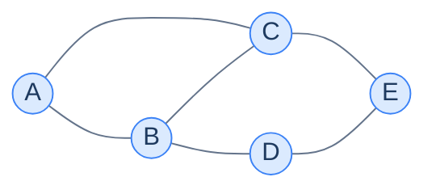
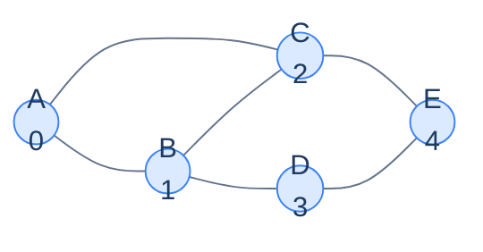
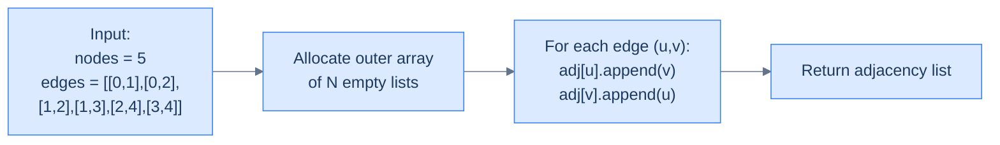
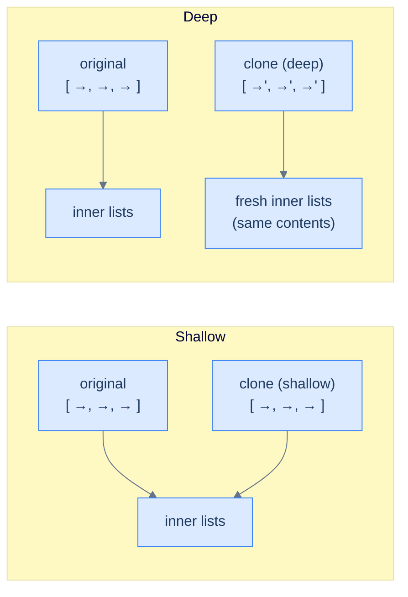
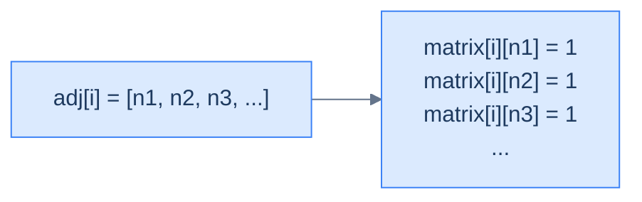
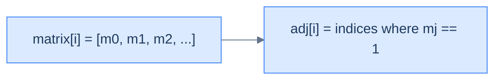

# 3. Adjacency list representation

This lesson covers the **adjacency list** — the representation that fits the way most graphs in the real world actually look. By the end you'll know exactly why this is the default choice for graph problems, and you'll be able to convert freely between matrix and list whenever the problem demands it.

## Table of contents

1. [The matrix's blind spot](#the-matrixs-blind-spot)
2. [Structure of an adjacency list](#structure-of-an-adjacency-list)
3. [Implementation](#implementation)
4. [Storing weighted edges](#storing-weighted-edges)
5. [Storing data on nodes](#storing-data-on-nodes)
6. [Complexity analysis](#complexity-analysis)
7. [Problem: Clone an adjacency list](#problem-clone-an-adjacency-list)
8. [Problem: Adjacency list → adjacency matrix](#problem-adjacency-list--adjacency-matrix)
9. [Problem: Adjacency matrix → adjacency list](#problem-adjacency-matrix--adjacency-list)

***

# The Matrix's Blind Spot

The adjacency matrix has one fatal flaw: it pays for **every edge that *could* exist**, even when most of them don't. A graph of 10 000 nodes with 20 000 edges still costs `10 000² = 100 million` cells — 99.98% of which are wasted.

Real graphs are mostly **sparse**. Your phone contacts: a few hundred people, each connected to a few dozen others — not to every other person on Earth. Wikipedia: millions of articles, each linking to maybe 50 others — not to every article. The road network of a country: thousands of intersections, each connected to 2-5 neighbours — not to every other intersection.

For graphs like these, asking the matrix to allocate a row of `N` cells per node is criminal. Most of those rows will be 99% empty. We need a representation that **scales with the edges that actually exist**, not with the edges that *could* exist.

> *Before reading on — flip the matrix's view. Instead of "what cells does every node need?", ask "what does each node know about its own edges?". What's the smallest possible answer?*

The smallest possible answer is: each node knows **the list of its neighbours**. Nothing more. If node 0 has 3 neighbours, store 3 IDs. If node 1 has 50 neighbours, store 50 IDs. Pay only for what exists.

That single shift gives us the adjacency list.

***

# Structure of an Adjacency List

Take the same 5-node graph from the matrix lesson.



<p align="center"><strong>The same example graph from the previous lesson — 5 nodes, 6 edges, undirected.</strong></p>

Instead of asking *"between every pair, is there an edge?"* we now ask *"for each node, who are its neighbours?"*. Walk through the graph node by node:

| Node | Direct neighbours |
|---|---|
| 0 (A) | 1, 2 |
| 1 (B) | 0, 2, 3 |
| 2 (C) | 0, 1, 4 |
| 3 (D) | 1, 4 |
| 4 (E) | 2, 3 |

Each row is a small list. Some short, some longer. **Nothing wasted.**

---

## Step 1 — Enumerate the Nodes

The same enumeration trick from the matrix lesson: assign every node an integer `0` to `N-1`. We need this so the *outer* container can be a flat array indexed by node ID.



<p align="center"><strong>Each node carries a unique integer ID. Same enumeration as for the matrix — the integer drives the indexing.</strong></p>

---

## Step 2 — Build a List of Lists

Create an outer array of size `N`. At index `i` store the list of integers — the IDs of node `i`'s neighbours.

```d2
direction: right

outer: "Outer array (one slot per node)" {
  grid-rows: 5
  grid-columns: 1
  grid-gap: 0
  o0: |md
    **0 (A)** → [1, 2]
  |
  o1: |md
    **1 (B)** → [0, 2, 3]
  |
  o2: |md
    **2 (C)** → [0, 1, 4]
  |
  o3: |md
    **3 (D)** → [1, 4]
  |
  o4: |md
    **4 (E)** → [2, 3]
  |
}
```

<p align="center"><strong>The adjacency list. The outer array indexes by node ID. Each cell holds the inner list of that node's neighbours.</strong></p>

The total number of integers stored across all inner lists is **`2 × E`** for an undirected graph (each edge contributes its two endpoints to two different lists) and **`E`** for a directed graph. Compare this to the matrix's unconditional `N²`. For a sparse graph that's a massive win.

---

## How It Lives in Memory

The outer container is a fixed-size array of N slots. Each slot holds a *reference* to a dynamically-sized inner array (a `vector` / `ArrayList` / `list`). The inner arrays live elsewhere in the heap and grow on demand.

```d2
direction: right

outer: "Outer array (size N)" {
  grid-rows: 5
  grid-columns: 1
  grid-gap: 0
  o0: "0 →"
  o1: "1 →"
  o2: "2 →"
  o3: "3 →"
  o4: "4 →"
}

inner0: "Inner list for 0" {
  grid-rows: 1
  grid-columns: 2
  grid-gap: 0
  c0: "1"
  c1: "2"
}

inner1: "Inner list for 1" {
  grid-rows: 1
  grid-columns: 3
  grid-gap: 0
  c0: "0"
  c1: "2"
  c2: "3"
}

inner2: "Inner list for 2" {
  grid-rows: 1
  grid-columns: 3
  grid-gap: 0
  c0: "0"
  c1: "1"
  c2: "4"
}

inner3: "Inner list for 3" {
  grid-rows: 1
  grid-columns: 2
  grid-gap: 0
  c0: "1"
  c1: "4"
}

inner4: "Inner list for 4" {
  grid-rows: 1
  grid-columns: 2
  grid-gap: 0
  c0: "2"
  c1: "3"
}

outer.o0 -> inner0
outer.o1 -> inner1
outer.o2 -> inner2
outer.o3 -> inner3
outer.o4 -> inner4
```

<p align="center"><strong>Outer array indexes by node; each slot points to a separately-allocated inner array of neighbours. Inner arrays size themselves to the actual degree of each node.</strong></p>

Why dynamic arrays for the inner lists rather than linked lists? Two reasons:

1. **Random access** — to scan a node's neighbours quickly, contiguous memory wins (the CPU prefetcher loves it).
2. **Locality of reference** — `vector` / `ArrayList` keeps neighbours adjacent in cache, while linked-list nodes scatter across the heap and incur a cache miss per pointer follow.

Linked-list-based adjacency lists do exist in textbooks but are essentially never the right choice in modern code. Default to dynamic arrays.

So how do we build this in a single pass over the edge list?

***

# Implementation

The function `createGraph` takes the node count `N` and the edge list, and returns the list of lists.

Two steps:

1. Allocate an outer array of `N` empty inner lists.
2. For each edge `(u, v)`, append `v` to `adj[u]` and `u` to `adj[v]` (the second line is the "undirected" half).



<p align="center"><strong>Two-step build. Each edge appends one entry to each of its two endpoint's lists.</strong></p>


```python run
def create_graph(nodes, edges):
    # Create adjacency list
    adj = [[] for _ in range(nodes)]

    for edge in edges:
        # Add nodeB (edge[1]) to adjacency list of nodeA (edge[0])
        adj[edge[0]].append(edge[1])

        # Add nodeA (edge[0]) to adjacency list of nodeB (edge[1])
        adj[edge[1]].append(edge[0])

    return adj


edges = [[0, 1], [0, 2], [1, 2], [1, 3], [2, 4], [3, 4]]
adj = create_graph(5, edges)
for i, neighbours in enumerate(adj):
    print(f"{i}: {neighbours}")
```

```java run
import java.util.ArrayList;
import java.util.List;

public class Main {
    public static List<List<Integer>> createGraph(int nodes, int[][] edges)
    {
        // Create adjacency list
        List<List<Integer>> adj = new ArrayList<List<Integer>>();

        for(int i=0; i<nodes; i++)
        {
            adj.add(new ArrayList<Integer>());
        }

        for (int[] edge: edges)
        {
            // Add nodeB (edge[1]) to adjacency list of nodeA (edge[0])
            adj.get(edge[0]).add(edge[1]);

            // Add nodeA (edge[0]) to adjacency list of nodeB (edge[1])
            adj.get(edge[1]).add(edge[0]);
        }

        return adj;
    }

    public static void main(String[] args) {
        int[][] edges = {{0, 1}, {0, 2}, {1, 2}, {1, 3}, {2, 4}, {3, 4}};
        List<List<Integer>> adj = createGraph(5, edges);
        for (int i = 0; i < adj.size(); i++) System.out.println(i + ": " + adj.get(i));
    }
}
```


The Python and JavaScript implementations both contain a tiny but vicious gotcha worth calling out again: `[[]] * nodes` and `Array(n).fill([])` *both* create `n` references to **the same** inner list, so every `append` ends up landing in every row at once. Always build the inner lists with a factory (`[[] for _ in range(n)]` or `Array.from({length: n}, () => [])`).

> *Before reading on — for a directed graph, what's the one-line change to the implementation?*

Drop the second `append` line — only `adj[u].append(v)`. The asymmetry of the resulting list is the asymmetry of the directed edges.

***

# Storing Weighted Edges

For weighted graphs the inner lists need to hold **two pieces of information per neighbour**: the neighbour ID *and* the edge weight. Three idiomatic ways to do this:

1. **Pair / tuple** — `[(neighbour, weight), ...]`. Dead simple, works in every language.
2. **Two parallel lists** — `neighbours = [...]`, `weights = [...]`. Tighter cache layout, ugly to use.
3. **Edge struct** — `{to: int, weight: int}`. Most readable, slightly more memory.

We'll use the pair form here because it's the most universal.

```d2
direction: right

list: "Weighted adjacency list" {
  grid-rows: 5
  grid-columns: 1
  grid-gap: 0
  o0: |md
    **0 (A)** → [(1, 5), (2, 2)]
  |
  o1: |md
    **1 (B)** → [(0, 5), (2, 1), (3, 7)]
  |
  o2: |md
    **2 (C)** → [(0, 2), (1, 1), (4, 4)]
  |
  o3: |md
    **3 (D)** → [(1, 7), (4, 3)]
  |
  o4: |md
    **4 (E)** → [(2, 4), (3, 3)]
  |
}
```

<p align="center"><strong>Each inner list now stores <code>(neighbour, weight)</code> pairs. The graph structure is unchanged; we've simply enriched what every neighbour entry carries.</strong></p>


```python run
"""
 * Function to create graph
 * nodes: The number of nodes in the graph
 * edges[in]: A list of edges. An edge is a list storing
 * the two nodes it connects and the weight.
 *
 * returns: Adjacency list
"""
def create_graph(nodes, edges):
    # Create adjacency list
    adj = [[] for _ in range(nodes)]

    for edge in edges:
        # Add nodeB (edge[1]) and edge weight (edge[2])
        # to adjacency list of nodeA (edge[0])
        adj[edge[0]].append((edge[1], edge[2]))

        # Add nodeA (edge[0]) and edge weight (edge[2])
        # to adjacency list of nodeB (edge[1])
        adj[edge[1]].append((edge[0], edge[2]))

    return adj


edges = [[0,1,5],[0,2,2],[1,2,1],[1,3,7],[2,4,4],[3,4,3]]
adj = create_graph(5, edges)
for i, n in enumerate(adj):
    print(f"{i}: {n}")
```

```java run
import java.util.ArrayList;
import java.util.List;

public class Main {
    /*
     * Function to create graph
     * nodes: The number of nodes in the graph
     * edges[in]: A list of edges. An edge is a list storing
     * the two nodes it connects and the weight.
     *
     * returns: Adjacency list
     */
    public static List<List<List<Integer>>> createGraph(int nodes, int[][] edges)
    {
        // Create adjacency list
        List<List<List<Integer>>> adj = new ArrayList<List<List<Integer>>>();

        for(int i=0; i<nodes; i++)
        {
            adj.add(new ArrayList<List<Integer>>());
        }

        for (int[] edge: edges)
        {
            // Add nodeB (edge[1]) and edge weight (edge[2])
            // to adjacency list of nodeA (edge[0])
            List<Integer> pair1 = new ArrayList<Integer>();
            pair1.add(edge[1]);
            pair1.add(edge[2]);
            adj.get(edge[0]).add(pair1);

            // Add nodeA (edge[0]) and edge weight (edge[2])
            // to adjacency list of nodeB (edge[1])
            List<Integer> pair2 = new ArrayList<Integer>();
            pair2.add(edge[0]);
            pair2.add(edge[2]);
            adj.get(edge[1]).add(pair2);
        }

        return adj;
    }

    public static void main(String[] args) {
        int[][] edges = {{0,1,5},{0,2,2},{1,2,1},{1,3,7},{2,4,4},{3,4,3}};
        List<List<List<Integer>>> adj = createGraph(5, edges);
        for (int i = 0; i < adj.size(); i++) {
            System.out.println(i + ": " + adj.get(i));
        }
    }
}
```


The change is purely about *what each list element holds*. The outer indexing strategy and the build loop are unchanged.

***

# Storing Data on Nodes

Two approaches, both common and useful:

1. **Parallel array** — same as the matrix version: a 1D array `nodeData[i]` of size `N`, indexed in lockstep with the adjacency list. Quick, no extra type, easy to share with code written against just the IDs.
2. **Custom node type** — wrap each node's data and adjacency list inside a single object/struct, then store a flat array of those objects. More OOP-flavoured, friendlier when the per-node payload grows.

```d2
direction: right

approach1: "Approach 1: parallel arrays" {
  grid-rows: 1
  grid-columns: 2
  grid-gap: 16
  data: |md
    **node_data[]**

    [Bangalore, Tokyo, Paris, NYC, London]
  |
  adj: |md
    **adj[]**

    [[(1,5),(2,2)], [(0,5),(2,1),(3,7)], …]
  |
}

approach2: "Approach 2: nodes as objects" {
  grid-rows: 1
  grid-columns: 1
  grid-gap: 0
  obj: |md
    **nodes[]** = list of `Node {data, adj}`

    nodes[0] = Node("Bangalore", [(1,5),(2,2)])

    nodes[1] = Node("Tokyo",     [(0,5),(2,1),(3,7)])

    …
  |
}
```

<p align="center"><strong>Two equivalent ways to attach per-node data. Both store the same information; the choice is about ergonomics.</strong></p>

Here's the **node-as-object** approach in Python and Java — it's the more general one because it scales naturally as the per-node payload grows.


```python run
class Node:
    def __init__(self, data = 0):
        self.data = data
        self.adj = []


"""
 * Function to create graph
 * nodeData: A list of node data
 * edges[in]: A list of edges. An edge is a list storing
 * the two nodes it connects and the weight.
 *
 * returns: graph as array of nodes
"""
def create_graph(nodeData, edges):
    # Create the list of nodes
    nodes = []

    # Fill in the node data
    for data in nodeData:
        nodes.append(Node(data))

    for edge in edges:
        # Add nodeB (edge[1]) and edge weight (edge[2])
        # to adjacency list of nodeA (edge[0])
        nodes[edge[0]].adj.append((edge[1], edge[2]))

        # Add nodeA (edge[0]) and edge weight (edge[2])
        # to adjacency list of nodeB (edge[1])
        nodes[edge[1]].adj.append((edge[0], edge[2]))

    return nodes


cities = ["Bangalore", "Tokyo", "Paris", "NYC", "London"]
edges  = [[0,1,5],[0,2,2],[1,2,1],[1,3,7],[2,4,4],[3,4,3]]
graph = create_graph(cities, edges)
for i, n in enumerate(graph):
    print(f"{i} ({n.data}): {n.adj}")
```

```java run
import java.util.ArrayList;
import java.util.List;

public class Main {
    static class Node
    {
        public int data;
        public List<List<Integer>> adj;

        Node(int data)
        {
            this.data = data;
            this.adj = new ArrayList<List<Integer>>();
        }
    };

    /*
     * Function to create graph
     * nodeData: A list of node data
     * edges[in]: A list of edges. An edge is a list storing
     * the two nodes it connects and the weight.
     *
     * returns: graph as array of nodes
     */
    public static List<Node> createGraph(int[] nodeData, int[][] edges)
    {
        // Create the list of nodes
        List<Node> nodes = new ArrayList<Node>();

        // Fill in the node data
        for(int i=0; i<nodeData.length; i++)
        {
            nodes.add(new Node(nodeData[i]));
        }

        for (int[] edge: edges)
        {
            // Add nodeB (edge[1]) and edge weight (edge[2])
            // to adjacency list of nodeA (edge[0])
            List<Integer> pair1 = new ArrayList<Integer>();
            pair1.add(edge[1]);
            pair1.add(edge[2]);
            nodes.get(edge[0]).adj.add(pair1);

            // Add nodeA (edge[0]) and edge weight (edge[2])
            // to adjacency list of nodeB (edge[1])
            List<Integer> pair2 = new ArrayList<Integer>();
            pair2.add(edge[0]);
            pair2.add(edge[2]);
            nodes.get(edge[1]).adj.add(pair2);
        }

        return nodes;
    }

    public static void main(String[] args) {
        int[] cities = {0, 1, 2, 3, 4};
        int[][] edges = {{0,1,5},{0,2,2},{1,2,1},{1,3,7},{2,4,4},{3,4,3}};
        List<Node> g = createGraph(cities, edges);
        for (int i = 0; i < g.size(); i++) {
            System.out.println(i + " (" + g.get(i).data + "): " + g.get(i).adj);
        }
    }
}
```


Both approaches encode the same information. The choice is mostly stylistic — whichever you find clearer, use that. Many real codebases mix the two: a `Graph` class internally holds a parallel array and exposes a `node(i)` method that returns a struct view.

***

# Complexity Analysis

| Operation | Adjacency list | Adjacency matrix | Winner |
|---|---|---|---|
| **Build** | O(N + E) | O(N² + E) | List (when E ≪ N²) |
| **Check edge `(i, j)`** | O(degree(i)) | O(1) | Matrix |
| **Get all neighbours of `i`** | O(degree(i)) | O(N) | List (when degree(i) ≪ N) |
| **Add an edge** | O(1) amortised | O(1) | Tie |
| **Remove an edge** | O(degree(i)) | O(1) | Matrix |
| **Add a node** | O(1) amortised | O(N²) | List |
| **Space** | O(N + E) | O(N²) | List (when sparse) |

The trade-off is sharp: **the matrix wins on per-edge operations; the list wins on per-node operations and on memory for sparse graphs.**

For the typical real-world graph — sparse, frequently traversed by walking neighbours, occasionally added to — the list wins. That's why the list is the default in every algorithm we'll meet from here on, and the matrix is reserved for special cases.

> **Why is "Get all neighbours" so important?** Almost every graph algorithm — BFS, DFS, Dijkstra, you name it — has a hot inner step that reads "for each neighbour of the current node, do something". With the list, this is a tight `for n in adj[i]` loop. With the matrix, it's a full row scan that re-checks `N - degree(i)` cells the algorithm doesn't care about. On a graph with a million sparse nodes, that's the difference between a fast algorithm and an unusable one.

Now that you can build either representation, three classic problems test that you actually understand them.

***

# Problem: Clone an Adjacency List

## The Problem

Given the adjacency list of a directed graph, return a deep clone — a new list independent of the original such that mutating one does not affect the other.

```
Input:  adjList = [[1, 3], [4], [4], [2], [3]]
Output: A new list with the same contents [[1, 3], [4], [4], [2], [3]]

Input:  adjList = [[4], [0, 3], [0, 4], [2, 4], [1]]
Output: A new list with the same contents [[4], [0, 3], [0, 4], [2, 4], [1]]
```

<details>
<summary><h2>What "Deep Clone" Means</h2></summary>


A **shallow copy** of a list-of-lists copies only the outer container — the inner lists are still shared references. Mutating `clone[0]` would mutate `original[0]` too. A **deep clone** allocates a brand-new outer container *and* a brand-new inner list for each node, then copies the integer IDs across.



<p align="center"><strong>Shallow vs deep. Shallow shares the inner lists; mutating one container mutates both. Deep gives the clone its own inner lists.</strong></p>

For a list of integer IDs, "deep" only needs to go one level — the integers themselves are immutable in every language we care about. (If the inner lists held mutable objects, deep cloning would have to recurse further.)

</details>
<details>
<summary><h2>The Strategy</h2></summary>


Two nested loops:

1. Allocate the outer list of `N` empty inner lists.
2. For each node `i`, copy every neighbour ID from `original[i]` into `clone[i]`.

That's literally it. No clever insight — just don't share references.

</details>
<details>
<summary><h2>Solution &amp; Analysis</h2></summary>

### The Solution

```python run
from typing import List

class Solution:
    def clone_adjacency_list(
        self, adj_list: List[List[int]]
    ) -> List[List[int]]:
        n = len(adj_list)

        # Create a new adjacency list for the cloned adj_list
        cloned_list = [[] for _ in range(n)]

        # Copy each node's neighbours from the original adj_list to the
        # cloned adj_list
        for i in range(n):

            # Iterate over the neighbours of node i in the original
            # adj_list
            for j in range(len(adj_list[i])):

                # Add the neighbour to the cloned adj_list
                cloned_list[i].append(adj_list[i][j])

        # Return the cloned adj_list
        return cloned_list


# Examples from the problem statement
print(Solution().clone_adjacency_list([[1, 3], [4], [4], [2], [3]]))   # [[1, 3], [4], [4], [2], [3]]
print(Solution().clone_adjacency_list([[4], [0, 3], [0, 4], [2, 4], [1]]))  # [[4], [0, 3], [0, 4], [2, 4], [1]]

# Edge cases
print(Solution().clone_adjacency_list([]))                              # []
print(Solution().clone_adjacency_list([[]])  )                          # [[]]
print(Solution().clone_adjacency_list([[1], [0]]))                      # [[1], [0]]
print(Solution().clone_adjacency_list([[1, 2], [0], [0]]))              # [[1, 2], [0], [0]]
print(Solution().clone_adjacency_list([[0]]))                           # [[0]]
```

```java run
import java.util.*;

public class Main {
    static class Solution {
        public List<List<Integer>> cloneAdjacencyList(
            List<List<Integer>> adjList
        ) {
            int n = adjList.size();

            // Create a new adjacency list for the cloned adjList
            List<List<Integer>> clonedList = new ArrayList<>();

            // Copy each node's neighbours from the original adjList to the
            // cloned adjList
            for (int i = 0; i < n; i++) {
                clonedList.add(new ArrayList<Integer>());

                // Iterate over the neighbours of node i in the original
                // adjList
                for (int j = 0; j < adjList.get(i).size(); j++) {

                    // Add the neighbour to the cloned adjList
                    clonedList.get(i).add(adjList.get(i).get(j));
                }
            }

            // Return the cloned adjList
            return clonedList;
        }
    }

    public static void main(String[] args) {
        // Examples from the problem statement
        System.out.println(new Solution().cloneAdjacencyList(List.of(List.of(1,3),List.of(4),List.of(4),List.of(2),List.of(3))));  // [[1, 3], [4], [4], [2], [3]]
        System.out.println(new Solution().cloneAdjacencyList(List.of(List.of(4),List.of(0,3),List.of(0,4),List.of(2,4),List.of(1))));  // [[4], [0, 3], [0, 4], [2, 4], [1]]

        // Edge cases
        System.out.println(new Solution().cloneAdjacencyList(new ArrayList<>()));  // []
        System.out.println(new Solution().cloneAdjacencyList(List.of(new ArrayList<>())));  // [[]]
        System.out.println(new Solution().cloneAdjacencyList(List.of(List.of(1),List.of(0))));  // [[1], [0]]
        System.out.println(new Solution().cloneAdjacencyList(List.of(List.of(1,2),List.of(0),List.of(0))));  // [[1, 2], [0], [0]]
        System.out.println(new Solution().cloneAdjacencyList(List.of(List.of(0))));  // [[0]]
    }
}
```

### Complexity Analysis

| | Complexity | Reasoning |
|---|---|---|
| **Time** | O(N + E) | Visit every node and every neighbour entry once |
| **Space** | O(N + E) | The cloned list is the same size as the original |

</details>

***

# Problem: Adjacency List → Adjacency Matrix

## The Problem

Given the adjacency list of a directed graph, build the equivalent N×N adjacency matrix where `adj[i][j] = 1` if and only if there's an edge from `i` to `j`.

```
Input:  adjList = [[1, 3], [4], [4], [2], [3]]
Output: [[0,1,0,1,0],[0,0,0,0,1],[0,0,0,0,1],[0,0,1,0,0],[0,0,0,1,0]]

Input:  adjList = [[4], [0, 3], [0, 4], [2, 4], [1]]
Output: [[0,0,0,0,1],[1,0,0,1,0],[1,0,0,0,1],[0,0,1,0,1],[0,1,0,0,0]]
```

<details>
<summary><h2>The Strategy</h2></summary>


Allocate an `N×N` zero matrix. Then for each list entry `j` in `adj[i]`, set `matrix[i][j] = 1`. That's it — **no symmetric assignment**, because the input is directed.



<p align="center"><strong>One row of the input list directly populates one row of the output matrix.</strong></p>

</details>
<details>
<summary><h2>Solution &amp; Analysis</h2></summary>

### The Solution

```python run
from typing import List

class Solution:
    def adjacency_list_to_adjacency_matrix(
        self, adj_list: List[List[int]]
    ) -> List[List[int]]:
        n = len(adj_list)

        # Initialize adjacency matrix with 0s
        adj_matrix = [[0] * n for _ in range(n)]

        for i in range(n):
            for j in range(len(adj_list[i])):
                neighbour = adj_list[i][j]

                # Mark the corresponding cell in the matrix as 1
                adj_matrix[i][neighbour] = 1

        return adj_matrix


# Examples from the problem statement
print(Solution().adjacency_list_to_adjacency_matrix([[1, 3], [4], [4], [2], [3]]))
# [[0, 1, 0, 1, 0], [0, 0, 0, 0, 1], [0, 0, 0, 0, 1], [0, 0, 1, 0, 0], [0, 0, 0, 1, 0]]

print(Solution().adjacency_list_to_adjacency_matrix([[4], [0, 3], [0, 4], [2, 4], [1]]))
# [[0, 0, 0, 0, 1], [1, 0, 0, 1, 0], [1, 0, 0, 0, 1], [0, 0, 1, 0, 1], [0, 1, 0, 0, 0]]

# Edge cases
print(Solution().adjacency_list_to_adjacency_matrix([[]]))              # [[0]]
print(Solution().adjacency_list_to_adjacency_matrix([[1], [0]]))        # [[0, 1], [1, 0]]
print(Solution().adjacency_list_to_adjacency_matrix([[1, 2], [0, 2], [0, 1]]))
# [[0, 1, 1], [1, 0, 1], [1, 1, 0]]
print(Solution().adjacency_list_to_adjacency_matrix([[0]]))             # [[1]]
```

```java run
import java.util.*;

public class Main {
    static class Solution {
        public int[][] adjacencyListToAdjacencyMatrix(
            List<List<Integer>> adjList
        ) {
            int n = adjList.size();

            // Initialize adjacency matrix with 0s
            int[][] adjMatrix = new int[n][n];

            for (int i = 0; i < n; i++) {
                for (int j = 0; j < adjList.get(i).size(); j++) {
                    int neighbour = adjList.get(i).get(j);

                    // Mark the corresponding cell in the matrix as 1
                    adjMatrix[i][neighbour] = 1;
                }
            }

            return adjMatrix;
        }
    }

    public static void main(String[] args) {
        // Examples from the problem statement
        System.out.println(Arrays.deepToString(new Solution().adjacencyListToAdjacencyMatrix(
            List.of(List.of(1,3),List.of(4),List.of(4),List.of(2),List.of(3)))));
        // [[0, 1, 0, 1, 0], [0, 0, 0, 0, 1], [0, 0, 0, 0, 1], [0, 0, 1, 0, 0], [0, 0, 0, 1, 0]]

        System.out.println(Arrays.deepToString(new Solution().adjacencyListToAdjacencyMatrix(
            List.of(List.of(4),List.of(0,3),List.of(0,4),List.of(2,4),List.of(1)))));
        // [[0, 0, 0, 0, 1], [1, 0, 0, 1, 0], [1, 0, 0, 0, 1], [0, 0, 1, 0, 1], [0, 1, 0, 0, 0]]

        // Edge cases
        System.out.println(Arrays.deepToString(new Solution().adjacencyListToAdjacencyMatrix(
            List.of(new ArrayList<>()))));                              // [[0]]
        System.out.println(Arrays.deepToString(new Solution().adjacencyListToAdjacencyMatrix(
            List.of(List.of(1),List.of(0)))));                         // [[0, 1], [1, 0]]
        System.out.println(Arrays.deepToString(new Solution().adjacencyListToAdjacencyMatrix(
            List.of(List.of(1,2),List.of(0,2),List.of(0,1)))));
        // [[0, 1, 1], [1, 0, 1], [1, 1, 0]]
        System.out.println(Arrays.deepToString(new Solution().adjacencyListToAdjacencyMatrix(
            List.of(List.of(0)))));                                    // [[1]]
    }
}
```

### Complexity Analysis

| | Complexity | Reasoning |
|---|---|---|
| **Time** | O(N² + E) | The matrix allocation costs O(N²); marking each edge is O(1) and there are E of them |
| **Space** | O(N²) | The output matrix dominates |

</details>

***

# Problem: Adjacency Matrix → Adjacency List

## The Problem

The reverse direction — given a directed graph as an N×N matrix, return its adjacency list.

```
Input:  matrix = [[0,1,0,1,0],[0,0,0,0,1],[0,0,0,0,1],[0,0,1,0,0],[0,0,0,1,0]]
Output: [[1, 3], [4], [4], [2], [3]]

Input:  matrix = [[0,0,0,0,1],[1,0,0,1,0],[1,0,0,0,1],[0,0,1,0,1],[0,1,0,0,0]]
Output: [[4], [0, 3], [0, 4], [2, 4], [1]]
```

<details>
<summary><h2>The Strategy</h2></summary>


Walk the matrix row by row. For each cell that's `1`, append the column index to the row's adjacency list.



<p align="center"><strong>For each row, the adjacency list is just the indices where the cell is 1.</strong></p>

</details>
<details>
<summary><h2>Solution &amp; Analysis</h2></summary>

### The Solution

```python run
from typing import List

class Solution:
    def adjacency_matrix_to_adjacency_list(
        self, adj_matrix: List[List[int]]
    ) -> List[List[int]]:
        n = len(adj_matrix)
        adj_list = [[] for _ in range(n)]

        # Traverse the adjacency matrix
        for i in range(n):
            for j in range(n):

                # If an edge exists between nodes i and j
                if adj_matrix[i][j] == 1:

                    # Add node j to the adjacency list of node i
                    adj_list[i].append(j)

        return adj_list


# Examples from the problem statement
print(Solution().adjacency_matrix_to_adjacency_list(
    [[0,1,0,1,0],[0,0,0,0,1],[0,0,0,0,1],[0,0,1,0,0],[0,0,0,1,0]]))
# [[1, 3], [4], [4], [2], [3]]

print(Solution().adjacency_matrix_to_adjacency_list(
    [[0,0,0,0,1],[1,0,0,1,0],[1,0,0,0,1],[0,0,1,0,1],[0,1,0,0,0]]))
# [[4], [0, 3], [0, 4], [2, 4], [1]]

# Edge cases
print(Solution().adjacency_matrix_to_adjacency_list([[0]]))             # [[]]
print(Solution().adjacency_matrix_to_adjacency_list([[1]]))             # [[0]]
print(Solution().adjacency_matrix_to_adjacency_list([[0, 1], [1, 0]])) # [[1], [0]]
print(Solution().adjacency_matrix_to_adjacency_list([[0, 1, 1], [1, 0, 1], [1, 1, 0]]))
# [[1, 2], [0, 2], [0, 1]]
```

```java run
import java.util.*;

public class Main {
    static class Solution {
        public List<List<Integer>> adjacencyMatrixToAdjacencyList(
            int[][] adjMatrix
        ) {
            int n = adjMatrix.length;
            List<List<Integer>> adjList = new ArrayList<>();

            // Traverse the adjacency matrix
            for (int i = 0; i < n; i++) {
                adjList.add(new ArrayList<>());
                for (int j = 0; j < n; j++) {

                    // If an edge exists between nodes i and j
                    if (adjMatrix[i][j] == 1) {

                        // Add node j to the adjacency list of node i
                        adjList.get(i).add(j);
                    }
                }
            }

            return adjList;
        }
    }

    public static void main(String[] args) {
        // Examples from the problem statement
        System.out.println(new Solution().adjacencyMatrixToAdjacencyList(
            new int[][]{{0,1,0,1,0},{0,0,0,0,1},{0,0,0,0,1},{0,0,1,0,0},{0,0,0,1,0}}));
        // [[1, 3], [4], [4], [2], [3]]

        System.out.println(new Solution().adjacencyMatrixToAdjacencyList(
            new int[][]{{0,0,0,0,1},{1,0,0,1,0},{1,0,0,0,1},{0,0,1,0,1},{0,1,0,0,0}}));
        // [[4], [0, 3], [0, 4], [2, 4], [1]]

        // Edge cases
        System.out.println(new Solution().adjacencyMatrixToAdjacencyList(new int[][]{{0}}));   // [[]]
        System.out.println(new Solution().adjacencyMatrixToAdjacencyList(new int[][]{{1}}));   // [[0]]
        System.out.println(new Solution().adjacencyMatrixToAdjacencyList(new int[][]{{0,1},{1,0}}));  // [[1], [0]]
        System.out.println(new Solution().adjacencyMatrixToAdjacencyList(
            new int[][]{{0,1,1},{1,0,1},{1,1,0}}));  // [[1, 2], [0, 2], [0, 1]]
    }
}
```

### Complexity Analysis

| | Complexity | Reasoning |
|---|---|---|
| **Time** | O(N²) | Every cell of the input matrix is examined once |
| **Space** | O(N + E) | The output adjacency list holds N empty lists plus E entries total |

The matrix→list conversion is **strictly upper-bound by O(N²)** even when the graph is sparse — you can't avoid scanning every cell because there's no way to know in advance which cells are 1. This is the matrix's last word in the trade-off: even reading it takes quadratic time.

</details>
<details>
<summary><h2>Final Takeaway</h2></summary>


The adjacency list is the default for almost every graph problem you'll meet from here on. It uses memory proportional to actual edges, makes "iterate over my neighbours" a tight inner loop, and adapts to weighted graphs and per-node data with minor tweaks.

You now know how to build it from scratch, how to enrich it with weights and node objects, and how to translate freely between list and matrix forms. Every algorithm in the rest of this chapter — BFS, DFS, Dijkstra, topological sort — will assume an adjacency list as input. With the build code burned in, the algorithm code is all that's left.

But what we've built is just **storage**. We haven't yet made the graph *do* anything. The very next step is the most fundamental graph operation of all: visiting every node, in some sensible order, exactly once. That's traversal — the next lesson.

> **Transfer challenge.** A social network has 500 million users with an average of 200 friends each. Estimate the memory usage in megabytes for storing the friend graph as (a) an adjacency matrix of bits, (b) an adjacency list of 4-byte ints. Which one fits on a single server, and which one needs a distributed system? *(Numbers in the answer block.)*

</details>
<details>
<summary><strong>Solution</strong></summary>

- Matrix of bits: `(5×10⁸)² / 8` bytes ≈ **3.1 × 10¹⁶ bytes ≈ 31 petabytes**. Definitely distributed.
- List of 4-byte ints: `5 × 10⁸ × 200 × 4 × 2` (the ×2 is for undirected) ≈ **800 GB**. Tight on a single server but feasible; comfortably distributed across a small cluster.

The factor between them is **~40 000×** — a perfect demonstration of why sparse graphs need adjacency lists.

</details>
