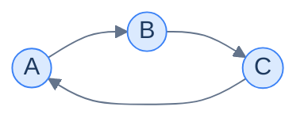
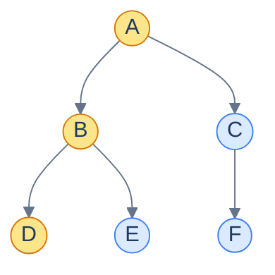
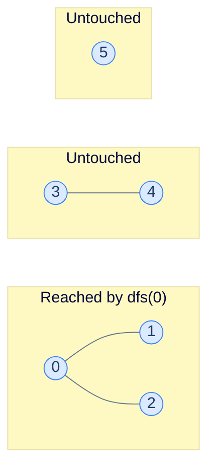
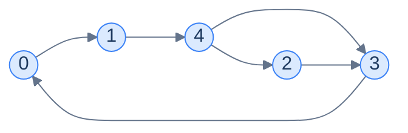
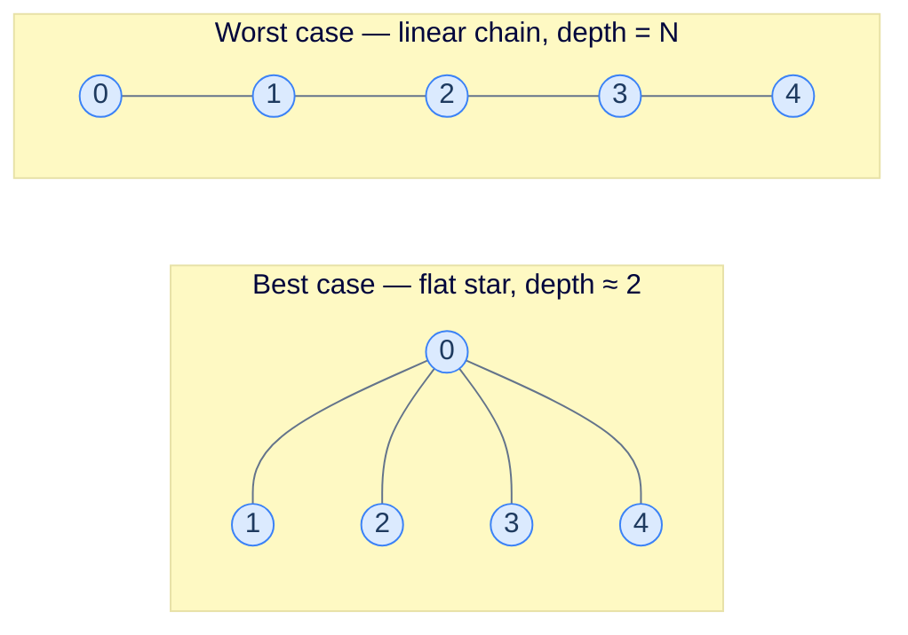
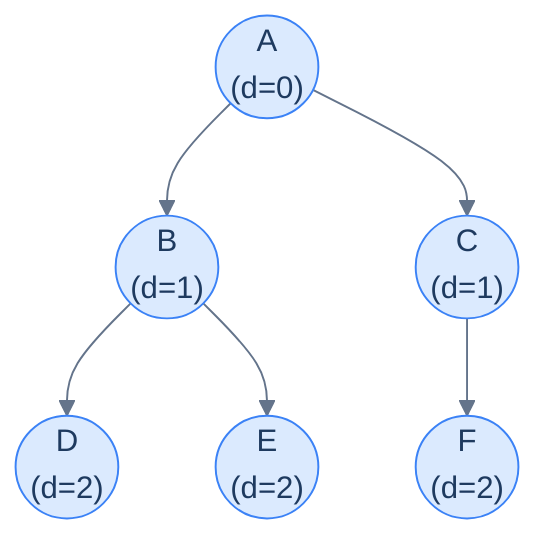

# 4. Traversing a graph

This lesson teaches the **two fundamental ways to walk every node of a graph** — depth-first and breadth-first traversal. Together, these two patterns are the foundation of essentially every advanced graph algorithm you'll meet later.

## Table of contents

1. [Why a `for` loop isn't enough](#why-a-for-loop-isnt-enough)
2. [Depth-first traversal — go deep, then back](#depth-first-traversal--go-deep-then-back)
3. [DFS implementation](#dfs-implementation)
4. [Breadth-first traversal — ripple outward](#breadth-first-traversal--ripple-outward)
5. [BFS implementation](#bfs-implementation)
6. [DFS vs BFS — when to choose which](#dfs-vs-bfs--when-to-choose-which)

***

# Why a `for` Loop Isn't Enough

For an array, "visit every element" is a one-line `for` loop. For a tree it's a slightly fancier recursion. For a graph? **Neither works.**

Walk through why a naive `for i in 0..N-1` fails:

- It would visit nodes in their *index order*, ignoring the structure entirely.
- It tells you nothing about which nodes are reachable from which.
- It can't naturally answer "what's connected to node X?" — the question every graph algorithm asks.

Even tree recursion fails on graphs because graphs can have **cycles**. A pure recursive walk on a cyclic graph runs forever — A → B → C → A → B → C → A → … until your call stack explodes.



<p align="center"><strong>A 3-node cycle. A naive recursive walk from A visits A, B, C, A, B, C, ... forever. Graphs need a way to remember "I've already been here".</strong></p>

So graph traversal must:

1. Pick **some sensible order** to visit nodes (not just index order).
2. **Remember which nodes are already visited** so cycles don't trap us.
3. Handle **disconnected graphs** — sometimes a single starting node can't reach the whole graph.

Two famous orderings handle (1) cleanly. They share the visited-tracking and disconnected-handling machinery, but disagree on the order. They're called **depth-first** and **breadth-first** traversal — and choosing between them is one of the most common decisions in graph code.

> *Before reading on — picture a 5-node graph and yourself starting at node 0. Without any rules, list the order you'd visit nodes. Now redo it imagining you can only walk one path at a time and must finish each path before starting another. Then redo it imagining you must visit all "1-step neighbours" before any "2-step neighbour". Those last two are DFS and BFS.*

***

# Depth-First Traversal — Go Deep, Then Back

**Depth-first search (DFS)** says: follow one path as deep as possible. When you hit a dead end (or already-visited territory), back up to the last branching point and try a different unexplored path.

Think of a maze. You stand at a fork. You pick a corridor and walk to its end. Stuck or seen-before? Walk back to the fork. Pick the next corridor. Repeat. Eventually every corridor is walked.



<p align="center"><strong>Starting from A, DFS explores A → B → D fully before backing up to B and exploring B → E, then backing up to A and exploring A → C → F. The highlighted subtree is the first complete branch DFS finishes.</strong></p>

DFS naturally maps to **recursion**. The function call stack *is* the trail of branching points you'd retrace in the maze. Every recursive call goes one step deeper; every `return` is the act of "backing up".

---

## The Core Recursive Idea

For one starting node `s`, DFS is two lines:

```
dfs(s):
    mark s visited
    for each neighbour n of s:
        if n not visited:  dfs(n)
```

That's the whole search. Read it twice — it's exactly "I'm here; let me finish exploring everywhere I can reach from here, recursively, before I leave."

But this only finds the **connected component** containing `s`. If the graph has 3 disconnected pieces, calling `dfs(s)` only walks the piece containing `s` — the other two are untouched.



<p align="center"><strong>Calling dfs(0) reaches only the leftmost component. Nodes 3, 4 and 5 stay unvisited — DFS from a single source can't cross the disconnect.</strong></p>

The fix is a wrapper that loops over every node and calls `dfs` from each unvisited one:

```
depthFirstTraversal(graph):
    visited = empty set
    for each node v in graph:
        if v not visited:  dfs(v)
```

For a connected graph, the outer loop runs `dfs` exactly once and stops. For a disconnected graph, it runs `dfs` once per component. Either way, every node is visited exactly once.

---

## The Two-Level Algorithm

Step-by-step, in human words:

> **`dfs(node, graph, visited, result)`**
> 1. Mark `node` as visited.
> 2. Append `node` to the result.
> 3. For each `neighbour` in `graph[node]`:
>    - If `neighbour` not visited, recursively call `dfs(neighbour)`.
>
> **`depthFirstTraversal(graph)`**
> 1. Create an empty `visited` set and an empty `result` list.
> 2. For each `node` from 0 to N-1:
>    - If `node` not visited, call `dfs(node, ...)`.
> 3. Return `result`.

> *Before reading on — for the graph below, predict the DFS order starting from node 0. Don't peek at the trace until you've written your guess down.*



<p align="center"><strong>Test graph for the DFS dry run. Adjacency list: <code>0→[1], 1→[4], 2→[3], 3→[0], 4→[2,3]</code>.</strong></p>

DFS from 0: visit 0, go to 1, go to 4, go to 4's first unvisited neighbour 2, go to 2's first unvisited neighbour 3 (3's only neighbour 0 is already visited so we return), back to 2 (no more), back to 4, try 4's next neighbour 3 (already visited), return. Full order: **0, 1, 4, 2, 3**.

If your guess matched: you've internalised "go deep first". If not, trace it once more on paper before moving on.

***

# DFS Implementation

We assume the graph is given as an adjacency list `graph` where `graph[i]` is the list of neighbours of node `i`. Nodes are integers `0..N-1`.


```python run viz=graph viz-root=graph
from typing import List, Set

class Solution:
    def dfs(
        self,
        graph: List[List[int]],
        node: int,
        visited: Set[int],
        result: List[int],
    ) -> None:

        # Mark the current node as visited
        visited.add(node)

        # Add the current node to the result list
        result.append(node)

        # Traverse all the neighbours of the current node
        for neighbour in graph[node]:

            # If the neighbour is not visited, recursively call the DFS
            # function on the neighbour
            if neighbour not in visited:
                self.dfs(graph, neighbour, visited, result)

    def depth_first_traversal(self, graph: List[List[int]]) -> List[int]:

        # Number of nodes in the graph
        n = len(graph)

        # If the graph is empty, return an empty result
        if n == 0:
            return []

        # Initialize a list to store the result of the DFS which will
        # contain the nodes visited during the DFS traversal
        result: List[int] = []

        # Initialize visited set
        visited: Set[int] = set()

        # Traverse all nodes in the graph
        for node in range(n):

            # If the node is already visited, continue to the next node
            if node in visited:
                continue

            # Perform DFS on this new node to visit all the nodes
            # connected to it.
            self.dfs(graph, node, visited, result)

        return result


# Examples from the problem statement
print(Solution().depth_first_traversal([[1], [4], [3], [0], [2, 3]]))  # [0, 1, 4, 2, 3]
print(Solution().depth_first_traversal([[4], [0, 3], [0, 4], [2, 4], [1]]))  # [0, 4, 1, 3, 2]

# Edge cases
print(Solution().depth_first_traversal([]))                            # []
print(Solution().depth_first_traversal([[]])  )                        # [0]
print(Solution().depth_first_traversal([[1], [0]]))                    # [0, 1]
print(Solution().depth_first_traversal([[], [], []]))                  # [0, 1, 2] — disconnected
print(Solution().depth_first_traversal([[1], [], [3], []]))            # [0, 1, 2, 3] — two components
```

```java run viz=graph viz-root=graph
import java.util.*;

public class Main {
    static class Solution {
        private void dfs(
            List<List<Integer>> graph,
            int node,
            Set<Integer> visited,
            List<Integer> result
        ) {

            // Mark the current node as visited in the graph to avoid
            // visiting it again
            visited.add(node);

            // Add the current node to the result list
            result.add(node);

            // Traverse all the neighbours of the current node
            for (int neighbour : graph.get(node)) {

                // If the neighbour is not visited, recursively call the DFS
                // function on the neighbour
                if (!visited.contains(neighbour)) {
                    dfs(graph, neighbour, visited, result);
                }
            }
        }

        public List<Integer> depthFirstTraversal(List<List<Integer>> graph) {

            // Number of nodes in the graph
            int N = graph.size();

            // If the graph is empty, return an empty result
            if (N == 0) {
                return new ArrayList<>();
            }

            // Initialize a list to store the result of the DFS which will
            // contain the nodes visited during the DFS traversal
            List<Integer> result = new ArrayList<>();

            // Initialize visited set
            Set<Integer> visited = new HashSet<>();

            // Traverse all nodes in the graph
            for (int node = 0; node < N; node++) {

                // If the node is already visited, continue to the next node
                if (visited.contains(node)) {
                    continue;
                }

                // Perform DFS on this new node to visit all the nodes
                // connected to it.
                dfs(graph, node, visited, result);
            }

            return result;
        }
    }

    public static void main(String[] args) {
        // Examples from the problem statement
        System.out.println(new Solution().depthFirstTraversal(
            List.of(List.of(1),List.of(4),List.of(3),List.of(0),List.of(2,3))));  // [0, 1, 4, 2, 3]
        System.out.println(new Solution().depthFirstTraversal(
            List.of(List.of(4),List.of(0,3),List.of(0,4),List.of(2,4),List.of(1))));  // [0, 4, 1, 3, 2]

        // Edge cases
        System.out.println(new Solution().depthFirstTraversal(new ArrayList<>()));  // []
        System.out.println(new Solution().depthFirstTraversal(List.of(new ArrayList<>())));  // [0]
        System.out.println(new Solution().depthFirstTraversal(List.of(List.of(1),List.of(0))));  // [0, 1]
        System.out.println(new Solution().depthFirstTraversal(
            List.of(new ArrayList<>(),new ArrayList<>(),new ArrayList<>())));  // [0, 1, 2]
        System.out.println(new Solution().depthFirstTraversal(
            List.of(List.of(1),new ArrayList<>(),List.of(3),new ArrayList<>())));  // [0, 1, 2, 3]
    }
}
```

### Step through the execution

Click **Trace** to step through the recursive DFS. Each call to `dfs` pushes a new frame — watch the caption change as the algorithm dives deeper into the graph. The `visited` array in the locals panel fills in as nodes are reached.

```python trace
def dfs(graph, node, visited, result):
    visited.add(node)
    result.append(node)
    for neighbour in graph[node]:
        if neighbour not in visited:
            dfs(graph, neighbour, visited, result)


graph = [[1, 2], [3], [], []]
visited = set()
result = []
dfs(graph, 0, visited, result)
print(result)  # [0, 1, 3, 2]
```

Same traversal in Java. The `visited` boolean array expands in the locals panel so you can see which nodes are marked at each step. Each recursive call deepens the call stack — the frame caption reflects the current depth. The **Kotlin** and **Scala** tabs show equivalent source.

```java trace
import java.util.ArrayList;
import java.util.List;

public class Main {
    static void dfs(int[][] graph, int node, boolean[] visited, List<Integer> result) {
        visited[node] = true;
        result.add(node);
        for (int neighbour : graph[node]) {
            if (!visited[neighbour]) {
                dfs(graph, neighbour, visited, result);
            }
        }
    }

    public static void main(String[] args) {
        int[][] graph = {{1, 2}, {3}, {}, {}};
        boolean[] visited = new boolean[graph.length];
        List<Integer> result = new ArrayList<>();
        dfs(graph, 0, visited, result);
        System.out.println(result);  // [0, 1, 3, 2]
    }
}
```

```kotlin trace
fun dfs(graph: Array<IntArray>, node: Int, visited: BooleanArray, result: MutableList<Int>) {
    visited[node] = true
    result += node
    for (neighbour in graph[node]) {
        if (!visited[neighbour]) dfs(graph, neighbour, visited, result)
    }
}

fun main() {
    val graph   = arrayOf(intArrayOf(1, 2), intArrayOf(3), intArrayOf(), intArrayOf())
    val visited = BooleanArray(graph.size)
    val result  = mutableListOf<Int>()
    dfs(graph, 0, visited, result)
    println(result)  // [0, 1, 3, 2]
}
```

```scala trace
import scala.collection.mutable

def dfs(graph: Array[Array[Int]], node: Int, visited: Array[Boolean], result: mutable.ListBuffer[Int]): Unit =
  visited(node) = true
  result += node
  for neighbour <- graph(node) do
    if !visited(neighbour) then dfs(graph, neighbour, visited, result)

@main def run(): Unit =
  val graph   = Array(Array(1, 2), Array(3), Array[Int](), Array[Int]())
  val visited = Array.fill(graph.length)(false)
  val result  = mutable.ListBuffer[Int]()
  dfs(graph, 0, visited, result)
  println(result.toList)  // List(0, 1, 3, 2)
```


<details>
<summary><strong>Trace — graph = [[1], [4], [3], [0], [2, 3]]</strong></summary>

```
Step │ Stack (top = current)        │ Action                         │ visited       │ result
─────┼──────────────────────────────┼────────────────────────────────┼───────────────┼────────
1    │ dfs(0)                       │ enter 0, visited += 0          │ {0}           │ [0]
2    │ dfs(0) → dfs(1)              │ enter 1, visited += 1          │ {0,1}         │ [0,1]
3    │ dfs(0) → dfs(1) → dfs(4)     │ enter 4, visited += 4          │ {0,1,4}       │ [0,1,4]
4    │ → → dfs(4) → dfs(2)          │ enter 2, visited += 2          │ {0,1,2,4}     │ [0,1,4,2]
5    │ → → → dfs(2) → dfs(3)        │ enter 3, visited += 3          │ {0,1,2,3,4}   │ [0,1,4,2,3]
6    │ → → → dfs(3) checks 0        │ 0 visited; return              │               │
7    │ pop back to dfs(2)           │ no more neighbours; return     │               │
8    │ pop back to dfs(4)           │ next neighbour 3 already visited; return       │
9    │ pop back to dfs(1) → dfs(0)  │ no unvisited neighbours; return                │
10   │ outer loop: 1,2,3,4 visited  │ done                           │               │
Result: [0, 1, 4, 2, 3] ✓
```

</details>

---

## Complexity Analysis

| | Complexity | Reasoning |
|---|---|---|
| **Time** | O(N + E) | Each node is marked visited once; each edge is examined once when its endpoint is processed |
| **Space** | O(N) | The `visited` set stores up to N entries; the recursion stack depth is at most N for a long chain |

The recursion stack depth varies: on a linear path (0 → 1 → 2 → ... → N-1) the stack reaches N frames; on a star (everyone connected directly to a hub) the stack is at most 2 frames. The worst case is the long-chain shape, so we report O(N).



<p align="center"><strong>The recursion-depth extremes. A balanced graph sits between the two — but the algorithmic bound has to assume the worst.</strong></p>

For graphs deeper than a few thousand nodes, default recursion can blow the call stack. The fix is to convert DFS to an explicit-stack iterative form — same algorithm, your own stack instead of the call stack. We'll use that form in problems where deep graphs are expected.

DFS is wonderful when you want to *exhaustively explore one path at a time* — looking for cycles, finding any path, doing topological sort. But what if you want the **shortest** path? DFS doesn't give you that — it might find one path, but not necessarily the shortest. For shortest-path problems, you need a different ordering: **breadth-first**.

***

# Breadth-First Traversal — Ripple Outward

**Breadth-first search (BFS)** says: visit every node at distance 1 before any node at distance 2; every node at distance 2 before any node at distance 3; and so on.

Picture a stone dropped in a pond. Concentric ripples expand outward. Every point at radius 1 is reached together; then every point at radius 2; then radius 3. BFS is that — applied to graph nodes instead of water molecules.



<p align="center"><strong>BFS from A. The label <code>d</code> is the distance (in hops) from the source. BFS visits all <code>d=1</code> nodes before any <code>d=2</code> node.</strong></p>

BFS is exactly tree level-order traversal generalised to graphs. The only difference is the visited set — without it, cycles would let nodes appear at multiple "levels" and re-enter the queue forever.

---

## The Mechanism — A Queue

DFS uses recursion (= the implicit call stack — last-in-first-out). BFS uses an **explicit queue** — first-in-first-out. The queue's order *is* the wavefront of the ripple.

```
bfs(source):
    queue = [source]
    mark source visited
    while queue not empty:
        node = queue.pop_front()
        for each neighbour n of node:
            if n not visited:
                mark n visited
                queue.push_back(n)
```

The queue starts with the source. We pop the front node, examine its neighbours, and **push every unvisited neighbour to the back**. Because pushes go to the back and pops come from the front, by the time we get to depth-2 nodes, every depth-1 node has already been popped.

> **Why mark visited at push, not pop?** If you marked at pop, a node could be pushed multiple times by different parents before it's first popped — bloating the queue and risking duplicate work. Marking at push guarantees each node enters the queue exactly once. This is the single most common BFS bug — write it on a sticky note.

Just like DFS, a single BFS only walks one connected component. The wrapper looping over every node solves that:

```
breadthFirstTraversal(graph):
    visited = empty set
    for each node v in graph:
        if v not visited:  bfs(v)
```

---

## The Two-Level Algorithm

Step-by-step:

> **`bfs(source, graph, visited, result)`**
> 1. Create an empty `queue`.
> 2. Add `source` to the queue and mark it visited.
> 3. While queue is not empty:
>    - Pop `node` from front of queue.
>    - Append `node` to result.
>    - For each `neighbour` in `graph[node]`:
>      - If `neighbour` not visited: mark it visited and push to queue.
>
> **`breadthFirstTraversal(graph)`**
> 1. Create empty `visited` set and `result` list.
> 2. For each `node` from 0 to N-1:
>    - If `node` not visited, call `bfs(node, ...)`.
> 3. Return `result`.

> *Before reading on — for the same graph as the DFS dry run, predict the BFS order from node 0.*

DFS gave us **0, 1, 4, 2, 3**. BFS from 0: queue starts `[0]`. Pop 0 → push 1 → queue `[1]`. Pop 1 → push 4 → queue `[4]`. Pop 4 → push 2 (and 3) → queue `[2,3]`. Pop 2 → 3 is already queued so nothing new. Pop 3 → 0 visited. Done. Order: **0, 1, 4, 2, 3**.

For *this* graph, DFS and BFS happen to agree because each node has at most one new neighbour per visit, so depth and breadth produce the same sequence. On a denser graph, they'd diverge sharply.

***

# BFS Implementation


```python run viz=graph viz-root=graph
from queue import Queue
from typing import List, Set

class Solution:
    def bfs(
        self,
        graph: List[List[int]],
        source: int,
        visited: Set[int],
        result: List[int],
    ) -> None:

        # Create a queue to perform breadth-first search
        queue = Queue()

        # Add the source node to the queue
        queue.put(source)

        # Mark the current node as visited
        visited.add(source)

        # Perform BFS from the source node
        while not queue.empty():
            node = queue.get()

            # Add the current node to the result
            result.append(node)

            # Visit all the neighbours of the current node
            for neighbour in graph[node]:

                # If the neighbour is not visited, add it to the queue
                if neighbour not in visited:

                    # Add the neighbour to the queue
                    queue.put(neighbour)

                    # Mark the neighbour node as visited
                    visited.add(neighbour)

    def breadth_first_traversal(
        self, graph: List[List[int]]
    ) -> List[int]:

        # Number of nodes in the graph
        n = len(graph)

        # If the graph is empty, return an empty result
        if n == 0:
            return []

        # Initialize a list to store the result of the BFS which will
        # contain the nodes visited during the BFS traversal
        result: List[int] = []

        # Initialize visited set
        visited: Set[int] = set()

        # Traverse all nodes in the graph
        for node in range(n):

            # If the node is already visited, all the nodes connected to
            # it are also visited
            if node in visited:
                continue

            # Perform BFS on this new node to visit all the nodes
            # connected to it.
            self.bfs(graph, node, visited, result)

        return result


# Examples from the problem statement
print(Solution().breadth_first_traversal([[1, 2], [4], [3], [0], [2, 3]]))  # [0, 1, 2, 4, 3]
print(Solution().breadth_first_traversal([[4], [0, 3], [0, 4], [2, 4], [1]]))  # [0, 4, 1, 3, 2]

# Edge cases
print(Solution().breadth_first_traversal([]))                          # []
print(Solution().breadth_first_traversal([[]]))                        # [0]
print(Solution().breadth_first_traversal([[1], [0]]))                  # [0, 1]
print(Solution().breadth_first_traversal([[], [], []]))                # [0, 1, 2] — disconnected
print(Solution().breadth_first_traversal([[1], [], [3], []]))          # [0, 1, 2, 3]
```

```java run viz=graph viz-root=graph
import java.util.*;

public class Main {
    static class Solution {
        private void bfs(
            List<List<Integer>> graph,
            int source,
            Set<Integer> visited,
            List<Integer> result
        ) {

            // Create a queue to perform breadth-first search
            Queue<Integer> queue = new LinkedList<>();

            // Add the source node to the queue
            queue.add(source);

            // Mark the source node as visited
            visited.add(source);

            // Perform BFS
            while (!queue.isEmpty()) {

                // Get the front node from the queue
                int node = queue.poll();

                // Add the current node to the result
                result.add(node);

                // Visit all the neighbours of the current node
                for (int neighbour : graph.get(node)) {

                    // If the neighbour is not visited, add it to the queue
                    if (!visited.contains(neighbour)) {

                        // Add the neighbour to the queue
                        queue.add(neighbour);

                        // Mark the neighbour node as visited
                        visited.add(neighbour);
                    }
                }
            }
        }

        public List<Integer> breadthFirstTraversal(
            List<List<Integer>> graph
        ) {

            // Number of nodes in the graph
            int N = graph.size();

            // If the graph is empty, return an empty result
            if (N == 0) {
                return new ArrayList<>();
            }

            // Initialize a list to store the result of the BFS which will
            // contain the nodes visited during the BFS traversal
            List<Integer> result = new ArrayList<>();

            // Initialize visited set
            Set<Integer> visited = new HashSet<>();

            // Traverse all nodes in the graph
            for (int node = 0; node < N; node++) {

                // If the node is already visited, continue to the next node
                if (visited.contains(node)) {
                    continue;
                }

                // Perform DFS on this new node to visit all the nodes
                // connected to it.
                bfs(graph, node, visited, result);
            }

            return result;
        }
    }

    public static void main(String[] args) {
        // Examples from the problem statement
        System.out.println(new Solution().breadthFirstTraversal(
            List.of(List.of(1,2),List.of(4),List.of(3),List.of(0),List.of(2,3))));  // [0, 1, 2, 4, 3]
        System.out.println(new Solution().breadthFirstTraversal(
            List.of(List.of(4),List.of(0,3),List.of(0,4),List.of(2,4),List.of(1))));  // [0, 4, 1, 3, 2]

        // Edge cases
        System.out.println(new Solution().breadthFirstTraversal(new ArrayList<>()));  // []
        System.out.println(new Solution().breadthFirstTraversal(List.of(new ArrayList<>())));  // [0]
        System.out.println(new Solution().breadthFirstTraversal(List.of(List.of(1),List.of(0))));  // [0, 1]
        System.out.println(new Solution().breadthFirstTraversal(
            List.of(new ArrayList<>(),new ArrayList<>(),new ArrayList<>())));  // [0, 1, 2]
        System.out.println(new Solution().breadthFirstTraversal(
            List.of(List.of(1),new ArrayList<>(),List.of(3),new ArrayList<>())));  // [0, 1, 2, 3]
    }
}
```

### Step through the execution

Click **Trace** to step through the queue-based BFS. Unlike DFS, the call stack stays flat — there is only one frame throughout. Watch `queue`, `visited`, and `result` evolve as the algorithm processes nodes level by level; `front` and `back` index into the queue so you can see exactly what is enqueued at each step.

```python trace
from collections import deque


def bfs(graph, source):
    visited = set()
    result = []
    queue = deque([source])
    visited.add(source)
    while queue:
        node = queue.popleft()
        result.append(node)
        for neighbour in graph[node]:
            if neighbour not in visited:
                queue.append(neighbour)
                visited.add(neighbour)
    return result


graph = [[1, 2], [3], [], []]
print(bfs(graph, 0))  # [0, 1, 2, 3]
```

Same traversal in Java with an array-backed queue. The `queue`, `visited`, and `result` arrays all expand in the locals panel; `front` and `back` index into the queue so you can see exactly what is enqueued at each step. The **Kotlin** and **Scala** tabs show equivalent source.

```java trace
import java.util.Arrays;

public class Main {
    static int[] bfs(int[][] graph, int source) {
        int n = graph.length;
        boolean[] visited = new boolean[n];
        int[] queue = new int[n];
        int[] result = new int[n];
        int front = 0;
        int back = 0;
        int resLen = 0;
        queue[back++] = source;
        visited[source] = true;
        while (front < back) {
            int node = queue[front++];
            result[resLen++] = node;
            for (int neighbour : graph[node]) {
                if (!visited[neighbour]) {
                    queue[back++] = neighbour;
                    visited[neighbour] = true;
                }
            }
        }
        return Arrays.copyOf(result, resLen);
    }

    public static void main(String[] args) {
        int[][] graph = {{1, 2}, {3}, {}, {}};
        System.out.println(Arrays.toString(bfs(graph, 0)));  // [0, 1, 2, 3]
    }
}
```

```kotlin trace
fun bfs(graph: Array<IntArray>, source: Int): IntArray {
    val n       = graph.size
    val visited = BooleanArray(n)
    val queue   = IntArray(n)
    val result  = IntArray(n)
    var front   = 0
    var back    = 0
    var resLen  = 0
    queue[back++]   = source
    visited[source] = true
    while (front < back) {
        val node = queue[front++]
        result[resLen++] = node
        for (neighbour in graph[node]) {
            if (!visited[neighbour]) {
                queue[back++]      = neighbour
                visited[neighbour] = true
            }
        }
    }
    return result.copyOf(resLen)
}

fun main() {
    val graph = arrayOf(intArrayOf(1, 2), intArrayOf(3), intArrayOf(), intArrayOf())
    println(bfs(graph, 0).contentToString())  // [0, 1, 2, 3]
}
```

```scala trace
def bfs(graph: Array[Array[Int]], source: Int): Array[Int] =
  val n       = graph.length
  val visited = Array.fill(n)(false)
  val queue   = Array.ofDim[Int](n)
  val result  = Array.ofDim[Int](n)
  var front   = 0
  var back    = 0
  var resLen  = 0
  queue(back) = source; back += 1
  visited(source) = true
  while front < back do
    val node = queue(front); front += 1
    result(resLen) = node; resLen += 1
    for neighbour <- graph(node) do
      if !visited(neighbour) then
        queue(back) = neighbour; back += 1
        visited(neighbour) = true
  result.take(resLen)

@main def run(): Unit =
  val graph = Array(Array(1, 2), Array(3), Array[Int](), Array[Int]())
  println(bfs(graph, 0).mkString("[", ", ", "]"))  // [0, 1, 2, 3]
```


<details>
<summary><strong>Trace — graph = [[1], [4], [3], [0], [2, 3]] starting from node 0</strong></summary>

```
Step │ Queue        │ Action                                  │ visited       │ result
─────┼──────────────┼─────────────────────────────────────────┼───────────────┼──────────
1    │ [0]          │ push 0; mark 0                          │ {0}           │ []
2    │ [1]          │ pop 0; push 1; mark 1                   │ {0,1}         │ [0]
3    │ [4]          │ pop 1; push 4; mark 4                   │ {0,1,4}       │ [0,1]
4    │ [2,3]        │ pop 4; push 2,3; mark 2,3               │ {0,1,2,3,4}   │ [0,1,4]
5    │ [3]          │ pop 2; 3 already marked → no push       │ {0,1,2,3,4}   │ [0,1,4,2]
6    │ [ ]          │ pop 3; 0 already marked → no push       │ {0,1,2,3,4}   │ [0,1,4,2,3]
Result: [0, 1, 4, 2, 3] ✓
```

</details>

---

## Complexity Analysis

| | Complexity | Reasoning |
|---|---|---|
| **Time** | O(N + E) | Each node enters the queue at most once; each edge is examined exactly once when its endpoint is dequeued |
| **Space** | O(N) | The queue holds at most N entries; visited stores up to N |

Same Big-O as DFS — both visit every node and every edge once. The constant factors and the *order* differ, not the asymptotic cost.

***

# DFS vs BFS — When to Choose Which

The two traversals share their Big-O budget. They differ in three ways that matter at the algorithm-choice stage:

| | DFS | BFS |
|---|---|---|
| Data structure | Recursion (call stack) | Queue (explicit) |
| Order | One path deep, then back | Concentric "rings" outward |
| Memory shape | Stack depth = longest path | Queue width = max ring size |
| Sweet spot | Topology / cycles / paths / "exists a path" | **Shortest path** in unweighted graphs / level-by-level |

```d2
direction: right

decision: "Pick a traversal" {
  q1: |md
    **Need shortest path**

    in unweighted graph?
  |
  q2: |md
    **Need to track levels**

    or distances from start?
  |
  q3: |md
    **Doing topological sort,**

    cycle detection,

    or 'find any path'?
  |
  bfs: |md
    **BFS**

    Use a queue.
  |
  dfs: |md
    **DFS**

    Use recursion.
  |

  q1 -> bfs: yes
  q2 -> bfs: yes
  q3 -> dfs: yes
}
```

<p align="center"><strong>Quick selection guide. The headline rule: shortest-path-on-unweighted ⇒ BFS; everything else, default to DFS.</strong></p>

DFS is also the only sensible choice when the graph is a tree-shaped DAG (e.g. a directory tree or a JSON tree) and you want full traversal in one pass — the call stack handles backtracking naturally.

BFS is the only sensible choice when the question contains the word *"shortest"*, *"minimum hops"*, *"closest"*, or *"level"*. In an unweighted graph, BFS finds the minimum-hop path from the source to any other node "for free" — it's a side effect of the wavefront.

> **Memory trick — "DFS dives, BFS sweeps."** DFS dives down one path; BFS sweeps across every depth.

---

## Final Takeaway

DFS and BFS aren't two algorithms — they're **two perspectives on the same act of visiting every node**. Once both perspectives are second nature, every advanced graph algorithm (Dijkstra, topological sort, bipartite check, cycle detection, shortest path on grids) is a small mutation of one of them.

You now have:
- A mental model for each (deep dive / ripple)
- The two-level structure that handles disconnected graphs
- Implementations in Python and Java
- The selection rule for when to use which

The rest of this chapter weaponises these two patterns. Cycle detection? DFS plus a 3-colour state. Topological sort? DFS plus a "completed" stack. Shortest path on grid? BFS plus directional moves. Once you see the seed pattern, the rest writes itself.

But there's a different kind of graph we haven't talked about yet — one that's all around you in 2D and grows up to 3D, 4D, even higher. **Grids.** They're graphs in disguise, and they have their own quirks. That's the next lesson.

> **Transfer challenge.** You have a 1024-node graph where the longest path is 1023 nodes. You want to traverse it. Your runtime gives you a 1MB call stack. Which traversal do you pick, and why? Could the other one work with a small change?

<details>
<summary><strong>Solution</strong></summary>

DFS recursion with default Python (~1KB per frame) would overflow at depth ~1000. Pick **BFS** — the queue lives on the heap, no stack-depth concern. Alternatively, convert DFS to **iterative DFS** with your own explicit stack on the heap — same algorithm, no recursion, no stack overflow. Most production graph code uses iterative DFS for exactly this reason.

</details>

<!-- ============================================== -->
<!-- SWEEP 2 — missing sections (placeholders only) -->
<!-- ============================================== -->

<!-- TODO: The Hook — missing, needs to be written -->
<!--       Guidance: real-world story opening before any definition -->

<!-- TODO: Understanding the Problem — missing, needs to be written -->
<!--       Guidance: frame the gap the structure/algorithm fills -->

<!-- TODO: Supported Operations — missing, needs to be written -->
<!--       Guidance: table: operation / time / notes -->

<!-- TODO: Internal Mechanics — missing, needs to be written -->
<!--       Guidance: how it actually works under the hood -->

<!-- TODO: Working Example — missing, needs to be written -->
<!--       Guidance: one fully worked end-to-end example -->

<!-- TODO: Edge Cases & Pitfalls — missing, needs to be written -->
<!--       Guidance: bulleted list of gotchas -->

<!-- TODO: Production Reality — missing, needs to be written -->
<!--       Guidance: 4–6 entries: System — uses X — because Y -->

<!-- TODO: Quiz — missing, needs to be written -->
<!--       Guidance: 3–5 questions, each labeled [Recall]/[Reasoning]/[Tradeoff] -->

<!-- TODO: Practice Ladder — missing, needs to be written -->
<!--       Guidance: table: 5 links into pattern problems + hints -->

<!-- TODO: Further Reading — missing, needs to be written -->
<!--       Guidance: annotated: ★ Essential / ◆ Advanced / → Reference -->

<!-- TODO: Cross-Links — missing, needs to be written -->
<!--       Guidance: Prerequisites | What comes next -->
