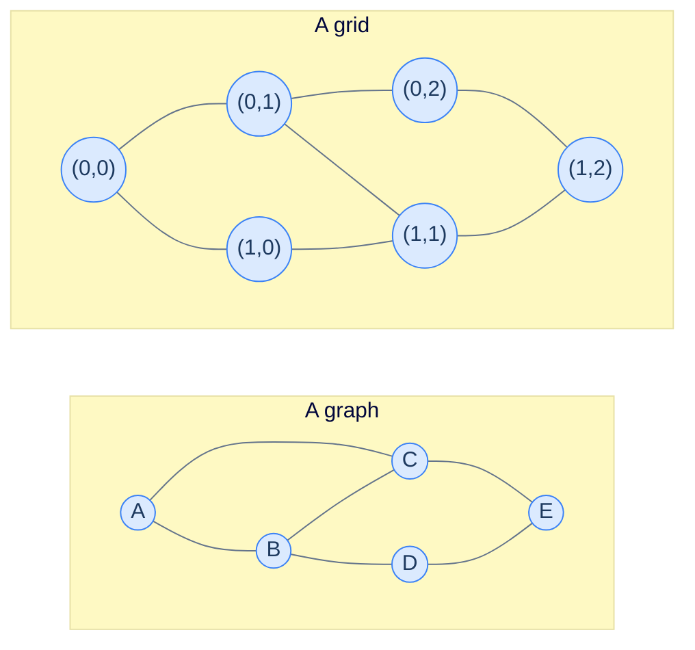
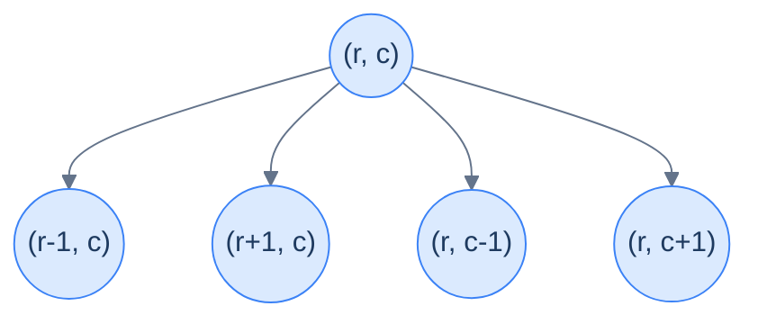
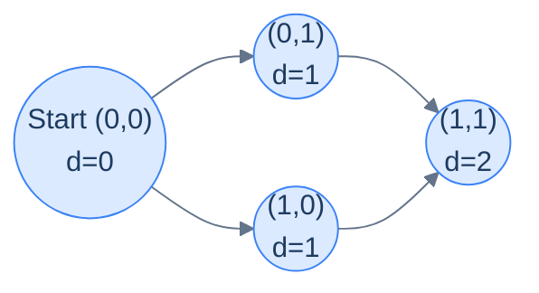

# 5. Traversing a grid

This lesson teaches you to **see grids as graphs** — and once you do, every grid problem you'll ever face becomes a slightly disguised version of DFS or BFS.

## Table of contents

1. [The graph hiding in every grid](#the-graph-hiding-in-every-grid)
2. [DFS on a grid](#dfs-on-a-grid)
3. [DFS implementation](#dfs-implementation)
4. [BFS on a grid](#bfs-on-a-grid)
5. [BFS implementation](#bfs-implementation)

***

# The Graph Hiding in Every Grid

Open any list of "common DSA problems" and a startling fraction look like grid problems: number of islands, flood fill, rotting oranges, shortest path in a maze, word search, count enclaves, surrounded regions, walls and gates… The list goes on for pages.

But here's the secret: **none of these are really grid problems**. They're graph problems wearing a 2D costume. Once you see how to translate, every grid problem in existence collapses into the two algorithms you already know — DFS and BFS.

> *Before reading on — sketch a 3×3 grid and label its cells (0,0) through (2,2). Now think: from (1,1), how many neighbours does it have? From (0,0), how many? You're already thinking like a graph.*



<p align="center"><strong>Both pictures are graphs. The right one happens to have a regular structure where every node connects only to its grid neighbours — but the abstraction is identical.</strong></p>

The translation rule is dead simple:

- **Each cell becomes a node.** Its identity is `(row, col)` instead of an integer.
- **Each adjacency becomes an edge.** Most often: a cell is adjacent to its 4 cardinal neighbours (up, down, left, right). Some problems add the 4 diagonals for 8-directional movement.
- **Cell value is the per-node payload.** Often a binary flag: `1` means "walkable", `0` means "blocked", or land vs water, or healthy vs infected.



<p align="center"><strong>From any cell <code>(r, c)</code>, the 4 cardinal neighbours are computed by ±1 on row or column.</strong></p>

The thing that *looks* novel about grids is **we never build an adjacency list**. The cell coordinates *are* the IDs and the neighbours can be **computed on demand** from `(r ± 1, c)` and `(r, c ± 1)`. No pre-processing, no matrix, no adjacency list. The graph is implicit, encoded in the geometry itself.

That implicit graph still runs DFS and BFS — only the "get neighbours" step changes. Everything else (visited tracking, disconnected components, complexity) is identical to what you learned last lesson.

***

# DFS on a Grid

Take a 4×5 grid where `1` means walkable and `0` means blocked. The goal: starting from any walkable cell, visit every walkable cell connected to it (cardinally), then move on to the next unvisited walkable cell, until the entire grid is processed.

```d2
direction: right

grid: "Input grid (1 = walkable, 0 = blocked)" {
  grid-rows: 4
  grid-columns: 5
  grid-gap: 0
  c00: "1"
  c01: "1"
  c02: "0"
  c03: "1"
  c04: "0"
  c10: "1"
  c11: "1"
  c12: "0"
  c13: "0"
  c14: "0"
  c20: "0"
  c21: "0"
  c22: "0"
  c23: "1"
  c24: "1"
  c30: "0"
  c31: "0"
  c32: "1"
  c33: "1"
  c34: "0"
}
```

<p align="center"><strong>A 4×5 input grid. The 1s form three disconnected "islands"; DFS visits each island in turn, the way it visits each component of a disconnected graph.</strong></p>

The shape of the algorithm is *exactly* the disconnected-graph DFS from the previous lesson:

```
depthFirstTraversal(grid):
    visited = 2D bool array, all false
    for each cell (r, c) in grid:
        if grid[r][c] == 1 and not visited[r][c]:
            dfs(r, c, ...)
```

The recursive helper:

```
dfs(r, c, grid, visited):
    mark visited[r][c]
    record (r, c)
    for each (dr, dc) in [(-1, 0), (1, 0), (0, -1), (0, 1)]:
        nr, nc = r + dr, c + dc
        if (nr, nc) is in-bounds and grid[nr][nc] == 1 and not visited[nr][nc]:
            dfs(nr, nc, ...)
```

The crucial new line is the **direction array** — a list of `(row delta, col delta)` pairs — and the `(nr, nc)` computation that turns "neighbour" into a small calculation rather than a list lookup.

---

## The Direction Array — Don't Hardcode Four `if`s

Hand-rolling four separate `if` statements for up/down/left/right is the most common beginner mistake on grid problems. The direction array eliminates duplication and makes 8-directional moves a one-line change.

```d2
direction: right

dirs: "Direction deltas" {
  grid-rows: 1
  grid-columns: 4
  grid-gap: 0
  d_up: |md
    **up**

    (-1, 0)
  |
  d_right: |md
    **right**

    (0, 1)
  |
  d_down: |md
    **down**

    (1, 0)
  |
  d_left: |md
    **left**

    (0, -1)
  |
}

cell: "(r, c) + delta = (r+dr, c+dc)" {
  grid-rows: 1
  grid-columns: 1
  grid-gap: 0
  c: |md
    From (1, 2):

    + (-1, 0) → (0, 2)

    + ( 0, 1) → (1, 3)

    + ( 1, 0) → (2, 2)

    + ( 0,-1) → (1, 1)
  |
}
```

<p align="center"><strong>One direction array, one loop, four neighbours. Adding diagonals later is just adding 4 more pairs to the array.</strong></p>

> **Memory trick — read the deltas as compass arrows.** `(-1, 0)` is "row decreases" = up. `(0, +1)` is "column increases" = right. Once that mental link clicks, the array is no longer arbitrary numbers.

---

## Bounds Checking — The Other Common Bug

Unlike a real graph, a grid has **edges of the world**. From `(0, 0)` the "up" neighbour `(-1, 0)` is off the map. Every neighbour computation must check:

```
0 <= nr < rows  AND  0 <= nc < cols
```

If you forget, you get `IndexError` (Python), `ArrayIndexOutOfBoundsException` (Java), or — worst — a silent crash because of negative indexing wrapping around in some languages.

A clean pattern: a tiny `is_valid(r, c)` helper that bundles bounds + walkable into one check.

> *Before reading on — for a 5×5 grid, how many of the 4 neighbours are valid for cell (0, 0)? For (2, 2)? For (4, 4)? Predict before scrolling.*

Cell `(0,0)`: only `(0,1)` and `(1,0)` are in bounds — 2 valid. Cell `(2,2)`: all four are in bounds — 4 valid. Cell `(4,4)`: only `(3,4)` and `(4,3)` are in bounds — 2 valid. Corners get 2, edges get 3, interiors get 4.

***

# DFS Implementation

The full algorithm in 10 languages.


```pseudocode
function isValid(grid, r, c):
    return r ≥ 0 AND r < rows AND c ≥ 0 AND c < cols AND grid[r][c] = 1

function dfs(grid, r, c, visited, result):
    visited[r][c] ← true
    append (r, c) to result
    for each (dr, dc) in DIRS:   # DIRS = [(-1,0),(0,1),(1,0),(0,-1)]
        nr, nc ← r+dr, c+dc
        if isValid(grid, nr, nc) AND NOT visited[nr][nc]:
            dfs(grid, nr, nc, visited, result)

function depthFirstTraversalGrid(grid):
    visited ← rows×cols matrix of false
    result ← empty list
    for r from 0 to rows−1:
        for c from 0 to cols−1:
            if grid[r][c] = 1 AND NOT visited[r][c]:
                dfs(grid, r, c, visited, result)
    return result
```

```python run
from typing import List, Tuple

# Direction deltas: up, right, down, left.
DIRS = [(-1, 0), (0, 1), (1, 0), (0, -1)]

class Solution:
    def is_valid(self, grid: List[List[int]], r: int, c: int) -> bool:
        rows, cols = len(grid), len(grid[0])
        # Bounds check AND walkable check in one helper — keeps dfs uncluttered.
        return 0 <= r < rows and 0 <= c < cols and grid[r][c] == 1

    def dfs(self,
            grid: List[List[int]],
            r: int, c: int,
            visited: List[List[bool]],
            result: List[Tuple[int, int]]) -> None:
        visited[r][c] = True
        result.append((r, c))

        for dr, dc in DIRS:
            nr, nc = r + dr, c + dc
            # is_valid covers bounds + walkable; the 'not visited' check handles cycles
            # (loops back through cardinal neighbours create implicit cycles in the graph).
            if self.is_valid(grid, nr, nc) and not visited[nr][nc]:
                self.dfs(grid, nr, nc, visited, result)

    def depth_first_traversal_grid(self, grid: List[List[int]]) -> List[Tuple[int, int]]:
        if not grid or not grid[0]:
            return []
        rows, cols = len(grid), len(grid[0])
        visited = [[False] * cols for _ in range(rows)]
        result: List[Tuple[int, int]] = []

        # Outer scan — every component (= each island of 1s) gets its own DFS root.
        for r in range(rows):
            for c in range(cols):
                if grid[r][c] == 1 and not visited[r][c]:
                    self.dfs(grid, r, c, visited, result)
        return result


grid = [
    [1, 1, 0, 1, 0],
    [1, 1, 0, 0, 0],
    [0, 0, 0, 1, 1],
    [0, 0, 1, 1, 0],
]
print(Solution().depth_first_traversal_grid(grid))
```

```java run
import java.util.*;

public class Main {
    static class Solution {
        // up, right, down, left
        static final int[][] DIRS = {{-1, 0}, {0, 1}, {1, 0}, {0, -1}};

        boolean isValid(int[][] grid, int r, int c) {
            return r >= 0 && r < grid.length && c >= 0 && c < grid[0].length && grid[r][c] == 1;
        }

        void dfs(int[][] grid, int r, int c, boolean[][] visited, List<int[]> result) {
            visited[r][c] = true;
            result.add(new int[]{r, c});
            for (int[] d : DIRS) {
                int nr = r + d[0], nc = c + d[1];
                if (isValid(grid, nr, nc) && !visited[nr][nc])
                    dfs(grid, nr, nc, visited, result);
            }
        }

        List<int[]> depthFirstTraversalGrid(int[][] grid) {
            if (grid.length == 0) return new ArrayList<>();
            int rows = grid.length, cols = grid[0].length;
            boolean[][] visited = new boolean[rows][cols];
            List<int[]> result = new ArrayList<>();
            for (int r = 0; r < rows; r++)
                for (int c = 0; c < cols; c++)
                    if (grid[r][c] == 1 && !visited[r][c])
                        dfs(grid, r, c, visited, result);
            return result;
        }
    }

    public static void main(String[] args) {
        int[][] grid = {{1,1,0,1,0},{1,1,0,0,0},{0,0,0,1,1},{0,0,1,1,0}};
        for (int[] cell : new Solution().depthFirstTraversalGrid(grid))
            System.out.print(Arrays.toString(cell) + " ");
        System.out.println();
    }
}
```

```c run
#include <stdio.h>
#include <stdlib.h>
#include <stdbool.h>

static const int DIRS[4][2] = {{-1, 0}, {0, 1}, {1, 0}, {0, -1}};

static bool is_valid(int** grid, int rows, int cols, int r, int c) {
    return r >= 0 && r < rows && c >= 0 && c < cols && grid[r][c] == 1;
}

static void dfs(int** grid, int rows, int cols, int r, int c,
                bool** visited, int* result, int* idx) {
    visited[r][c] = true;
    result[(*idx)++] = r * cols + c;   // pack (r, c) into one int for printing
    for (int d = 0; d < 4; d++) {
        int nr = r + DIRS[d][0], nc = c + DIRS[d][1];
        if (is_valid(grid, rows, cols, nr, nc) && !visited[nr][nc])
            dfs(grid, rows, cols, nr, nc, visited, result, idx);
    }
}

int main() {
    int data[4][5] = {{1,1,0,1,0},{1,1,0,0,0},{0,0,0,1,1},{0,0,1,1,0}};
    int* grid[4];
    bool* visited[4];
    for (int i = 0; i < 4; i++) {
        grid[i] = data[i];
        visited[i] = calloc(5, sizeof(bool));
    }
    int result[20], idx = 0;
    for (int r = 0; r < 4; r++)
        for (int c = 0; c < 5; c++)
            if (grid[r][c] == 1 && !visited[r][c])
                dfs(grid, 4, 5, r, c, visited, result, &idx);
    for (int i = 0; i < idx; i++) printf("(%d,%d) ", result[i] / 5, result[i] % 5);
    printf("\n");
    for (int i = 0; i < 4; i++) free(visited[i]);
    return 0;
}
```

```scala run
import scala.collection.mutable.ArrayBuffer

object Main extends App {
  val DIRS = Array((-1, 0), (0, 1), (1, 0), (0, -1))

  class Solution {
    def isValid(grid: Array[Array[Int]], r: Int, c: Int): Boolean =
      r >= 0 && r < grid.length && c >= 0 && c < grid(0).length && grid(r)(c) == 1

    def dfs(grid: Array[Array[Int]], r: Int, c: Int,
            visited: Array[Array[Boolean]],
            result: ArrayBuffer[(Int, Int)]): Unit = {
      visited(r)(c) = true
      result.append((r, c))
      for ((dr, dc) <- DIRS) {
        val nr = r + dr; val nc = c + dc
        if (isValid(grid, nr, nc) && !visited(nr)(nc)) dfs(grid, nr, nc, visited, result)
      }
    }

    def depthFirstTraversalGrid(grid: Array[Array[Int]]): ArrayBuffer[(Int, Int)] = {
      if (grid.isEmpty) return ArrayBuffer.empty
      val rows = grid.length; val cols = grid(0).length
      val visited = Array.ofDim[Boolean](rows, cols)
      val result = ArrayBuffer.empty[(Int, Int)]
      for (r <- 0 until rows; c <- 0 until cols
           if grid(r)(c) == 1 && !visited(r)(c)) dfs(grid, r, c, visited, result)
      result
    }
  }

  val grid = Array(Array(1,1,0,1,0), Array(1,1,0,0,0), Array(0,0,0,1,1), Array(0,0,1,1,0))
  println(new Solution().depthFirstTraversalGrid(grid).mkString(", "))
}
```


<details>
<summary><strong>Trace — first island in the example grid</strong></summary>

```
Step │ Stack (top = current)        │ Action                     │ visited cells
─────┼──────────────────────────────┼────────────────────────────┼─────────────────
1    │ dfs(0,0)                     │ visit (0,0)                │ (0,0)
2    │ dfs(0,0) → up (-1,0) invalid │ try right                  │
3    │ dfs(0,0) → dfs(0,1)          │ visit (0,1)                │ (0,0),(0,1)
4    │ → → up invalid, right=0 grid │ skip; try down (1,1)       │
5    │ → → dfs(1,1)                 │ visit (1,1)                │ (0,0),(0,1),(1,1)
6    │ → → → up=(0,1) visited;      │                            │
       right=(1,2)=0; down=(2,1)=0 │ try left (1,0)             │
7    │ → → → dfs(1,0)               │ visit (1,0)                │ (0,0),(0,1),(1,1),(1,0)
8    │ → → → → all neighbours       │ return through chain       │
       visited or 0; backtrack     │                            │
9    │ outer loop hits (0,3)        │ start new DFS for next island │
…    │ … same pattern repeats       │                            │
Result (one possible order): [(0,0),(0,1),(1,1),(1,0),(0,3),(2,3),(2,4),(3,3),(3,2)] ✓
```

</details>

---

## Complexity Analysis

| | Complexity | Reasoning |
|---|---|---|
| **Time** | O(R × C) | Each cell is visited at most once and contributes O(1) work (4 neighbour checks) |
| **Space** | O(R × C) | The `visited` matrix is R × C; recursion depth is at most R × C in the worst case (a snake-shaped path) |

The recursion depth in the **worst case** is the entire grid — imagine a snake-shaped path of 1s that fills the whole grid. That's a real concern: a 1000×1000 grid can hit recursion depth 10⁶, far past most language defaults. For grids of that size, convert to **iterative DFS** with an explicit stack — same algorithm, O(R×C) heap usage instead of stack frames.

DFS is great when you want to "sink" into one island, count something on the way, and move on. But what if the question is *"how many steps to reach the closest treasure?"* That's a shortest-path question — call BFS.

***

# BFS on a Grid

The translation from graph-BFS to grid-BFS is identical to the DFS one — only how you compute neighbours changes. Mechanically:

```
bfs(start_r, start_c):
    queue = [(start_r, start_c)]
    visited[start_r][start_c] = true
    while queue not empty:
        (r, c) = queue.pop_front()
        record (r, c)
        for each (dr, dc) in [(-1, 0), (0, 1), (1, 0), (0, -1)]:
            nr, nc = r + dr, c + dc
            if is_valid(nr, nc) and not visited[nr][nc]:
                visited[nr][nc] = true
                queue.push_back((nr, nc))
```

Notice the `visited[nr][nc] = true` happens at **push**, not pop. Same rule as graph-BFS, same reason: a cell could otherwise be queued multiple times by different parents, leading to bugs and bloat.

> *Before reading on — for the same example grid, predict the BFS visit order from cell (0, 0). Then check the trace.*

Same wrapping pattern for disconnected pieces: outer scan across every cell, kick off a fresh BFS each time you find an unvisited walkable cell.



<p align="center"><strong>BFS from (0,0) on the first island. The wavefront reaches all cells at distance 1 before any cell at distance 2 — exactly the property that lets BFS solve "shortest path on unweighted grids" for free.</strong></p>

***

# BFS Implementation


```pseudocode
function bfs(grid, startR, startC, visited, result):
    queue ← empty queue
    enqueue (startR, startC) to queue
    visited[startR][startC] ← true   # mark at push
    while queue is not empty:
        (r, c) ← dequeue from queue
        append (r, c) to result
        for each (dr, dc) in DIRS:
            nr, nc ← r+dr, c+dc
            if isValid(grid, nr, nc) AND NOT visited[nr][nc]:
                visited[nr][nc] ← true
                enqueue (nr, nc) to queue

function breadthFirstTraversalGrid(grid):
    visited ← rows×cols matrix of false
    result ← empty list
    for r from 0 to rows−1:
        for c from 0 to cols−1:
            if grid[r][c] = 1 AND NOT visited[r][c]:
                bfs(grid, r, c, visited, result)
    return result
```

```python run
from typing import List, Tuple
from collections import deque

DIRS = [(-1, 0), (0, 1), (1, 0), (0, -1)]

class Solution:
    def is_valid(self, grid: List[List[int]], r: int, c: int) -> bool:
        rows, cols = len(grid), len(grid[0])
        return 0 <= r < rows and 0 <= c < cols and grid[r][c] == 1

    def bfs(self,
            grid: List[List[int]],
            start_r: int, start_c: int,
            visited: List[List[bool]],
            result: List[Tuple[int, int]]) -> None:
        queue = deque([(start_r, start_c)])
        # Mark at PUSH so a cell never enters the queue twice.
        visited[start_r][start_c] = True

        while queue:
            r, c = queue.popleft()
            result.append((r, c))
            for dr, dc in DIRS:
                nr, nc = r + dr, c + dc
                if self.is_valid(grid, nr, nc) and not visited[nr][nc]:
                    visited[nr][nc] = True
                    queue.append((nr, nc))

    def breadth_first_traversal_grid(self, grid: List[List[int]]) -> List[Tuple[int, int]]:
        if not grid or not grid[0]:
            return []
        rows, cols = len(grid), len(grid[0])
        visited = [[False] * cols for _ in range(rows)]
        result: List[Tuple[int, int]] = []
        for r in range(rows):
            for c in range(cols):
                if grid[r][c] == 1 and not visited[r][c]:
                    self.bfs(grid, r, c, visited, result)
        return result


grid = [
    [1, 1, 0, 1, 0],
    [1, 1, 0, 0, 0],
    [0, 0, 0, 1, 1],
    [0, 0, 1, 1, 0],
]
print(Solution().breadth_first_traversal_grid(grid))
```

```java run
import java.util.*;

public class Main {
    static class Solution {
        static final int[][] DIRS = {{-1, 0}, {0, 1}, {1, 0}, {0, -1}};

        boolean isValid(int[][] grid, int r, int c) {
            return r >= 0 && r < grid.length && c >= 0 && c < grid[0].length && grid[r][c] == 1;
        }

        void bfs(int[][] grid, int sr, int sc, boolean[][] visited, List<int[]> result) {
            Queue<int[]> queue = new ArrayDeque<>();
            queue.add(new int[]{sr, sc});
            visited[sr][sc] = true;
            while (!queue.isEmpty()) {
                int[] cur = queue.poll();
                result.add(cur);
                for (int[] d : DIRS) {
                    int nr = cur[0] + d[0], nc = cur[1] + d[1];
                    if (isValid(grid, nr, nc) && !visited[nr][nc]) {
                        visited[nr][nc] = true;
                        queue.add(new int[]{nr, nc});
                    }
                }
            }
        }

        List<int[]> breadthFirstTraversalGrid(int[][] grid) {
            if (grid.length == 0) return new ArrayList<>();
            int rows = grid.length, cols = grid[0].length;
            boolean[][] visited = new boolean[rows][cols];
            List<int[]> result = new ArrayList<>();
            for (int r = 0; r < rows; r++)
                for (int c = 0; c < cols; c++)
                    if (grid[r][c] == 1 && !visited[r][c])
                        bfs(grid, r, c, visited, result);
            return result;
        }
    }

    public static void main(String[] args) {
        int[][] grid = {{1,1,0,1,0},{1,1,0,0,0},{0,0,0,1,1},{0,0,1,1,0}};
        for (int[] cell : new Solution().breadthFirstTraversalGrid(grid))
            System.out.print(Arrays.toString(cell) + " ");
        System.out.println();
    }
}
```

```c run
#include <stdio.h>
#include <stdlib.h>
#include <stdbool.h>

static const int DIRS[4][2] = {{-1, 0}, {0, 1}, {1, 0}, {0, -1}};

static bool is_valid(int** grid, int rows, int cols, int r, int c) {
    return r >= 0 && r < rows && c >= 0 && c < cols && grid[r][c] == 1;
}

static void bfs(int** grid, int rows, int cols, int sr, int sc,
                bool** visited, int* result, int* idx) {
    int (*q)[2] = malloc(rows * cols * sizeof(*q));
    int head = 0, tail = 0;
    q[tail][0] = sr; q[tail][1] = sc; tail++;
    visited[sr][sc] = true;
    while (head < tail) {
        int r = q[head][0], c = q[head][1]; head++;
        result[(*idx)++] = r * cols + c;
        for (int d = 0; d < 4; d++) {
            int nr = r + DIRS[d][0], nc = c + DIRS[d][1];
            if (is_valid(grid, rows, cols, nr, nc) && !visited[nr][nc]) {
                visited[nr][nc] = true;
                q[tail][0] = nr; q[tail][1] = nc; tail++;
            }
        }
    }
    free(q);
}

int main() {
    int data[4][5] = {{1,1,0,1,0},{1,1,0,0,0},{0,0,0,1,1},{0,0,1,1,0}};
    int* grid[4];
    bool* visited[4];
    for (int i = 0; i < 4; i++) {
        grid[i] = data[i];
        visited[i] = calloc(5, sizeof(bool));
    }
    int result[20], idx = 0;
    for (int r = 0; r < 4; r++)
        for (int c = 0; c < 5; c++)
            if (grid[r][c] == 1 && !visited[r][c])
                bfs(grid, 4, 5, r, c, visited, result, &idx);
    for (int i = 0; i < idx; i++) printf("(%d,%d) ", result[i] / 5, result[i] % 5);
    printf("\n");
    for (int i = 0; i < 4; i++) free(visited[i]);
    return 0;
}
```

```scala run
import scala.collection.mutable.{ArrayBuffer, Queue}

object Main extends App {
  val DIRS = Array((-1, 0), (0, 1), (1, 0), (0, -1))

  class Solution {
    def isValid(grid: Array[Array[Int]], r: Int, c: Int): Boolean =
      r >= 0 && r < grid.length && c >= 0 && c < grid(0).length && grid(r)(c) == 1

    def bfs(grid: Array[Array[Int]], sr: Int, sc: Int,
            visited: Array[Array[Boolean]],
            result: ArrayBuffer[(Int, Int)]): Unit = {
      val queue = Queue[(Int, Int)]((sr, sc))
      visited(sr)(sc) = true
      while (queue.nonEmpty) {
        val (r, c) = queue.dequeue()
        result.append((r, c))
        for ((dr, dc) <- DIRS) {
          val nr = r + dr; val nc = c + dc
          if (isValid(grid, nr, nc) && !visited(nr)(nc)) {
            visited(nr)(nc) = true
            queue.enqueue((nr, nc))
          }
        }
      }
    }

    def breadthFirstTraversalGrid(grid: Array[Array[Int]]): ArrayBuffer[(Int, Int)] = {
      if (grid.isEmpty) return ArrayBuffer.empty
      val rows = grid.length; val cols = grid(0).length
      val visited = Array.ofDim[Boolean](rows, cols)
      val result = ArrayBuffer.empty[(Int, Int)]
      for (r <- 0 until rows; c <- 0 until cols
           if grid(r)(c) == 1 && !visited(r)(c)) bfs(grid, r, c, visited, result)
      result
    }
  }

  val grid = Array(Array(1,1,0,1,0), Array(1,1,0,0,0), Array(0,0,0,1,1), Array(0,0,1,1,0))
  println(new Solution().breadthFirstTraversalGrid(grid).mkString(", "))
}
```


<details>
<summary><strong>Trace — first island starting at (0,0)</strong></summary>

```
Step │ Queue                  │ Action                       │ visited
─────┼────────────────────────┼──────────────────────────────┼─────────────────────────
1    │ [(0,0)]                │ push (0,0); mark             │ (0,0)
2    │ [(0,1),(1,0)]          │ pop (0,0); push (0,1),(1,0)  │ (0,0),(0,1),(1,0)
3    │ [(1,0),(1,1)]          │ pop (0,1); push (1,1)        │ (0,0),(0,1),(1,0),(1,1)
4    │ [(1,1)]                │ pop (1,0); all neighbours    │
                              │ already visited or =0        │
5    │ [ ]                    │ pop (1,1); same — no pushes  │ (no change)
Outer scan continues; (0,3), (2,3), (3,2) start fresh BFS calls.
Result: [(0,0),(0,1),(1,0),(1,1),(0,3),(2,3),(2,4),(3,3),(3,2)] ✓
```

</details>

---

## Complexity Analysis

| | Complexity | Reasoning |
|---|---|---|
| **Time** | O(R × C) | Each cell enters the queue at most once; each examines 4 neighbours |
| **Space** | O(R × C) | `visited` matrix dominates; queue width is at most O(R + C) for a "diamond" wavefront |

The BFS queue's *peak size* is genuinely smaller than the total cell count — at any one moment it only holds the cells on the current wavefront, which for an open grid is roughly O(min(R, C)). But the **visited matrix is unconditionally** O(R × C), so that's what the bound looks like.

---

## Final Takeaway

Grids are graphs — period. Once you see the equivalence:

- **Cell** = node, identified by `(r, c)`.
- **Cardinal adjacency** = edge, computed via a tiny direction array.
- **Implicit graph** = no adjacency list, no matrix; the geometry encodes it.

Every grid problem you encounter reduces to "DFS or BFS the implicit graph". The DSA challenge then becomes deciding **which** of the two, and **what to record at each cell** (a count, a colour, a distance, a parent pointer). The structure stays the same.

Memorise the four-direction array. Memorise the `is_valid` helper. Memorise the "mark on push" rule. With those three habits, you'll write grid traversal correctly on the first try, every time.

The next set of lessons starts piling actual *questions* on top of these traversals — *is there a cycle?*, *what's the topological order?*, *what's the shortest path?* — but each of them is a small mutation of the bones you just laid.

> **Transfer challenge.** A grid has rooms (`1`) and walls (`0`), plus a single fire source `2` and a single exit `3`. Each step, fire spreads to all 4-cardinal neighbours that are rooms. You start at the exit and want the longest possible path back to your starting room such that fire never catches up. Outline the algorithm in 3 sentences. *(Hint: two BFS waves — one for fire, one for you.)*

<details>
<summary><strong>Sketch</strong></summary>

1. Run BFS from the fire source first, recording `fire_time[r][c]` for every reachable cell — the step number at which fire arrives.
2. Run a modified BFS from the exit, recording `your_time[r][c]` and only allowing entry to a cell where `your_time < fire_time` (you must arrive *strictly before* fire).
3. The answer is `your_time[start]` if reachable, else "trapped".

This is the structure of LeetCode's "Escape the Spreading Fire" problem and the underlying technique generalises to every adversarial-grid puzzle.

</details>
