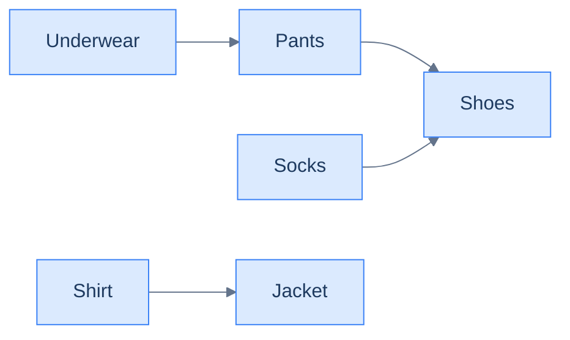
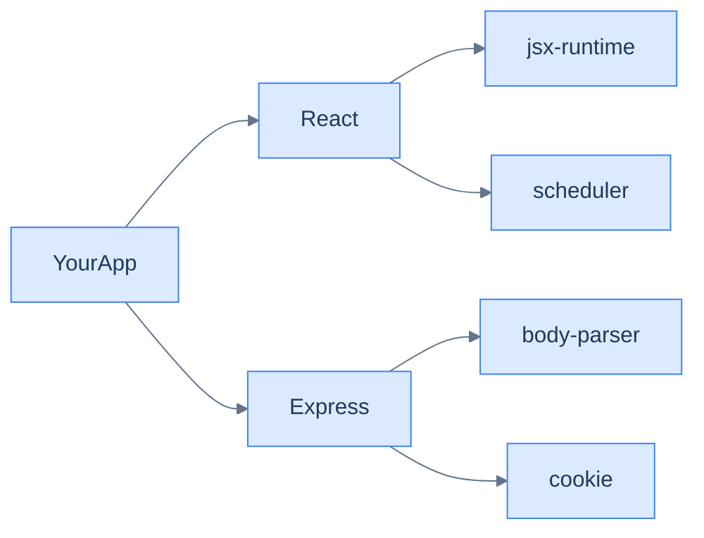
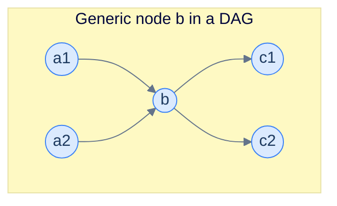
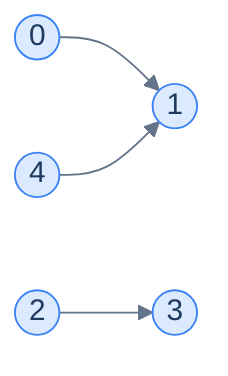

# 7. Topological sort

This lesson teaches you the algorithm that runs your **package manager**, your **build system**, your **task scheduler**, and your **course planner** — all of them are special cases of the same procedure: **topological sort**.

## Table of contents

1. [The ordering problem](#the-ordering-problem)
2. [Where topological sort lives in real software](#where-topological-sort-lives-in-real-software)
3. [The DFS-based algorithm](#the-dfs-based-algorithm)
4. [Implementation](#implementation)
5. [Topological sort with cycle detection](#topological-sort-with-cycle-detection)

***

# The Ordering Problem

You're packing for a trip. **Underwear before pants. Pants before shoes. Shirt before jacket. Socks before shoes.** That's it — those are the rules. Now: in what order should you put things on?



<p align="center"><strong>Getting-dressed dependency graph. Each arrow says "this must happen before that". The whole thing is directed (the rules have direction) and acyclic (you don't put on shoes <em>before</em> shoes).</strong></p>

There are several valid sequences:

- Underwear → Pants → Socks → Shoes → Shirt → Jacket ✓
- Shirt → Underwear → Pants → Socks → Shoes → Jacket ✓
- Socks → Underwear → Pants → Shoes → Shirt → Jacket ✓

What makes them valid? **Every arrow points forward in the sequence.** No item ever appears before something it depends on. Any sequence with that property is called a **topological order** of the graph.

A topological sort is just an algorithm that *produces one such valid sequence*. There can be many — usually there are.

> *Before reading on — if I added the rule "Jacket before Shoes", would there still be a valid order? What if I added "Shoes before Underwear" on top of the original rules?*

The first addition keeps things consistent: now jacket comes before shoes too. The second creates a cycle: Underwear → Pants → Shoes → Underwear. **No valid order exists for cyclic graphs** — a topological sort *cannot* be produced. Cycle detection (last lesson) is the precondition; topological sort is the construction.

> **Definition.** A *topological order* of a directed acyclic graph is a linear arrangement of its nodes such that for every edge `u → v`, `u` appears before `v`.

***

# Where Topological Sort Lives in Real Software

The reason this is one of the most-asked algorithms in interviews is that it shows up *everywhere*:

## Package managers (npm, pip, apt, cargo)

When you run `npm install`, the package manager builds the dependency DAG of all libraries your project pulls in. Some libraries depend on others; those depend on still others. **The install order is a topological sort of the dependency DAG**, so every dependency is in place before its dependents try to load it.



<p align="center"><strong>A simplified <code>node_modules</code> dependency graph. The package manager installs leaves first (jsx-runtime, scheduler, body-parser, cookie), works inward (React, Express), and finishes with your app.</strong></p>

## Build systems (Make, Bazel, Gradle)

A C++ project compiles `lib_a.o`, `lib_b.o`, `main.o`, then links the binary. `main.cpp` includes `lib_a.h`, so `lib_a` must compile first. The build tool runs a topological sort on the file dependency DAG and pipes the order to the compiler.

## Workflow engines (Airflow, Prefect, Argo)

You define a pipeline: download data → clean → train → evaluate → publish. The engine builds a DAG and topologically schedules tasks, running independent ones in parallel.

## Course planning

Calculus 2 requires Calculus 1. Linear Algebra requires Calc 1. ML requires both Linear Algebra and Probability. Your registrar's "earliest order" view is — you guessed it — a topological sort.

The pattern is identical in all four cases: there's a "X must finish before Y" relationship between things, the things form a DAG, and the answer is some linear order respecting all the arrows. **The algorithm we're about to learn solves all of them at once.**

***

# The DFS-Based Algorithm

The algorithm sounds counter-intuitive at first:

> **Run DFS. As you finish each node (i.e. all its descendants are done), append it to a list. Reverse the list at the end. That list is a topological order.**

Two strange things to notice:

1. We append on **finish**, not on **enter**.
2. We **reverse** at the end.

Both quirks come from the same insight, which is worth dwelling on for a moment.

---

## Why "Append on Finish" Gives Reverse Topological Order

When DFS finishes a node, it has *completely explored everything reachable from that node via outgoing edges*. That means every descendant has already been finished — and therefore already appended to the list — before this node is appended.

So at the moment we append node `b`:

- Every node reachable from `b` is already in the list.
- `b` is added *after* them.

In a topological order, `b` must come *before* its descendants. So adding `b` after its descendants gives the **reverse** topological order. One final reverse, and we're done.



<p align="center"><strong>Inputs to <code>b</code>: <code>a1, a2</code>. Outputs of <code>b</code>: <code>c1, c2</code>. DFS finishes <code>c1</code> and <code>c2</code> before finishing <code>b</code> — so when we append on finish, c's land in the list before b. The list is in reverse topological order.</strong></p>

---

## Why "Order of DFS Roots Doesn't Matter"

Suppose we run DFS from `b` first, then from `a1`. After DFS(b) finishes, the list contains `b` and all its descendants — *in reverse topological order*. When we then call DFS(a1), `b` is already visited, so DFS(a1) just appends `a1`. `a1` lands *after* everything DFS(b) added. Reading right-to-left, `a1` comes before `b`. Correct.

It works no matter which order we kick off DFS from each root. As long as we **append on finish** and **reverse at the end**, we always get a valid topological order. The choice of starting node only changes *which* of the many valid orders we produce.

---

## The Algorithm

> **`dfs(node, graph, visited, result)`**
> 1. Mark `node` as visited.
> 2. For each `neighbour` in `graph[node]`:
>    - If not visited, recurse.
> 3. Append `node` to `result`. *(Note: append on exit, not on enter.)*
>
> **`topologicalSort(graph)`**
> 1. Create empty `visited` set and `result` list.
> 2. For each `node` from 0 to N-1:
>    - If not visited, call `dfs(node, …)`.
> 3. Reverse `result`.
> 4. Return `result`.

Compare to plain DFS traversal: the *only difference* is *when* we record the node — at exit instead of at entry — and a final reverse.

---

## Walked Example

Take this graph:



<p align="center"><strong>Graph: 0→1, 2→3, 4→1. Adjacency list: <code>0:[1], 1:[], 2:[3], 3:[], 4:[1]</code>.</strong></p>

DFS from 0: visit 0 → visit 1 → 1 has no neighbours → finish 1 (append 1 → result = `[1]`) → finish 0 (append 0 → result = `[1, 0]`).

DFS from 2: visit 2 → visit 3 → finish 3 (`[1, 0, 3]`) → finish 2 (`[1, 0, 3, 2]`).

DFS from 4: visit 4 → 1 already visited → finish 4 (`[1, 0, 3, 2, 4]`).

Final reverse: **`[4, 2, 3, 0, 1]`**.

Verify: every edge points forward. 0→1: 0 at index 3, 1 at index 4 ✓. 2→3: 2 at 1, 3 at 2 ✓. 4→1: 4 at 0, 1 at 4 ✓. Done.

> *Before reading on — pick a different DFS starting order (say start at 4 first). Trace it. Do you get the same answer or a different valid topological order?*

Starting at 4 first: DFS(4) → DFS(1) → finish 1 → finish 4. List = `[1, 4]`. Then DFS(0) → 1 visited → finish 0. List = `[1, 4, 0]`. Then DFS(2) → DFS(3) → finish 3 → finish 2. List = `[1, 4, 0, 3, 2]`. Reverse: **`[2, 3, 0, 4, 1]`**. *Different but still valid* — every edge still points forward. Confirms the "order of DFS roots doesn't matter" lemma.

***

# Implementation

We assume the input is a DAG; if you can't make that assumption, jump to the next section.


```python run
from typing import List, Set

class Solution:
    def dfs(
        self,
        graph: List[List[int]],
        node: int,
        visited: Set[int],
        result: List[int],
    ) -> None:

        # Mark the current node as visited in the graph to avoid
        # visiting it again
        visited.add(node)

        # Recursively visit all the adjacent nodes
        for neighbour in graph[node]:

            # If the neighbour node is not visited, visit it recursively
            if neighbour not in visited:
                self.dfs(graph, neighbour, visited, result)

        # Push the current node to the result after all its neighbours
        # have been visited
        result.append(node)

    def topological_sort(self, graph: List[List[int]]) -> List[int]:

        # Number of nodes in the graph
        n = len(graph)

        # If the graph is empty, return an empty list
        if n == 0:
            return []

        # Set to keep track of visited nodes
        visited: Set[int] = set()

        # Keep track of the topological sort ordering
        result: List[int] = []

        # Perform DFS on each unvisited node
        for node in range(n):
            if node not in visited:

                # If a node is not visited, start DFS on it to visit all
                # the nodes connected to it.
                self.dfs(graph, node, visited, result)

        # Reverse the result to get the topological sort in correct
        # order
        result.reverse()
        return result


# Examples from the problem statement
print(Solution().topological_sort([[1],[],[3],[],[1]]))      # [4, 2, 3, 0, 1]
print(Solution().topological_sort([[],[4],[0,1,3],[],[]]))  # [2, 3, 1, 4, 0]

# Edge cases
print(Solution().topological_sort([]))                      # []
print(Solution().topological_sort([[]])  )                  # [0]
print(Solution().topological_sort([[1],[]]))                # [0, 1]
print(Solution().topological_sort([[], [], []]))            # [2, 1, 0] or similar valid order
print(Solution().topological_sort([[1, 2], [], []]))        # [0, 2, 1] or similar valid order
```

```java run
import java.util.*;

public class Main {
    static class Solution {
        private void dfs(
            List<List<Integer>> graph,
            int node,
            Set<Integer> visited,
            List<Integer> result
        ) {

            // Mark the current node as visited in the graph to avoid
            // visiting it again
            visited.add(node);

            // Recursively visit all the adjacent nodes
            for (int neighbour : graph.get(node)) {

                // If the neighbour node is not visited, visit it recursively
                if (!visited.contains(neighbour)) {
                    dfs(graph, neighbour, visited, result);
                }
            }

            // Push the current node to the result after all its neighbours
            // have been visited
            result.add(node);
        }

        public List<Integer> topologicalSort(List<List<Integer>> graph) {

            // Number of nodes in the graph
            int N = graph.size();

            // If the graph is empty, return an empty list
            if (N == 0) {
                return new ArrayList<>();
            }

            // Set to keep track of visited nodes
            Set<Integer> visited = new HashSet<>();

            // Keep track of the topological sort ordering
            List<Integer> result = new ArrayList<>();

            // Perform DFS on each unvisited node
            for (int node = 0; node < N; node++) {
                if (!visited.contains(node)) {

                    // If a node is not visited, start DFS on it to visit all
                    // the nodes connected to it.
                    dfs(graph, node, visited, result);
                }
            }

            // Reverse the result to get the topological sort in correct
            // order
            Collections.reverse(result);
            return result;
        }
    }

    public static void main(String[] args) {
        // Examples from the problem statement
        System.out.println(new Solution().topologicalSort(
            List.of(List.of(1),new ArrayList<>(),List.of(3),new ArrayList<>(),List.of(1))));
        // [4, 2, 3, 0, 1]

        System.out.println(new Solution().topologicalSort(
            List.of(new ArrayList<>(),List.of(4),List.of(0,1,3),new ArrayList<>(),new ArrayList<>())));
        // [2, 3, 1, 4, 0]

        // Edge cases
        System.out.println(new Solution().topologicalSort(new ArrayList<>()));  // []
        System.out.println(new Solution().topologicalSort(List.of(new ArrayList<>())));  // [0]
        System.out.println(new Solution().topologicalSort(List.of(List.of(1),new ArrayList<>())));  // [0, 1]
        System.out.println(new Solution().topologicalSort(
            List.of(new ArrayList<>(),new ArrayList<>(),new ArrayList<>())));  // valid topo order
        System.out.println(new Solution().topologicalSort(
            List.of(List.of(1,2),new ArrayList<>(),new ArrayList<>())));  // [0, 2, 1] or similar
    }
}
```


<details>
<summary><strong>Trace — graph = [[1], [], [3], [], [1]]</strong></summary>

```
Step │ Stack       │ Action                      │ visited       │ result
─────┼─────────────┼─────────────────────────────┼───────────────┼────────
1    │ dfs(0)      │ enter 0, visited += 0       │ {0}           │ []
2    │ dfs(1)      │ enter 1, visited += 1       │ {0,1}         │ []
3    │ dfs(1)      │ no neighbours; APPEND 1     │ {0,1}         │ [1]
4    │ dfs(0)      │ done; APPEND 0              │ {0,1}         │ [1,0]
5    │ dfs(2)      │ enter 2, visited += 2       │ {0,1,2}       │ [1,0]
6    │ dfs(3)      │ enter 3, visited += 3       │ {0,1,2,3}     │ [1,0]
7    │ dfs(3)      │ no neighbours; APPEND 3     │ {0,1,2,3}     │ [1,0,3]
8    │ dfs(2)      │ done; APPEND 2              │ {0,1,2,3}     │ [1,0,3,2]
9    │ dfs(4)      │ enter 4, visited += 4       │ {0,1,2,3,4}   │ [1,0,3,2]
10   │ dfs(4)      │ neighbour 1 visited; APPEND │ {0,1,2,3,4}   │ [1,0,3,2,4]
─────┴─────────────┴─────────────────────────────┴───────────────┴────────
After reverse: [4, 2, 3, 0, 1] ✓
```

</details>

## Complexity Analysis

| | Complexity | Reasoning |
|---|---|---|
| **Time** | O(N + E) | Same as plain DFS; the reverse at the end is O(N) |
| **Space** | O(N) | Visited set + recursion stack + result list |

***

# Topological Sort With Cycle Detection

The algorithm above assumes the input is a DAG. In practice, you often need to **handle the cyclic case gracefully** — package managers must reject circular dependencies; build systems must report which files form a cycle.

The fix is mechanical: **fuse last lesson's directed-cycle check into the DFS**. Same colour-coded logic — `visited` for "ever entered", `nodesInPath` for "currently on the stack". If you ever step into a node that's in `nodesInPath`, it's a cycle and there's no valid topological order — return empty.

> **`hasCycle(node, graph, visited, nodesInPath, result)`**
> 1. Mark visited; add to `nodesInPath`.
> 2. For each neighbour:
>    - If in `nodesInPath` → return `true` (cycle).
>    - Else if not visited → recurse; if recursion returns `true`, propagate.
> 3. Remove from `nodesInPath`.
> 4. **Append node to `result`.**
> 5. Return `false`.
>
> **`topologicalSortWithCycleCheck(graph)`**
> 1. Initialise empty sets and result list.
> 2. For each unvisited node: if `hasCycle` returns true → return empty list.
> 3. Reverse `result`.
> 4. Return `result`.

The integration is clean: the same single DFS does both jobs in one pass — detects the cycle *and* builds the (potential) topological order. If a cycle is found, throw the partial result away.


```python run
from typing import List, Set

class Solution:
    def has_cycle(
        self,
        graph: List[List[int]],
        node: int,
        visited: Set[int],
        nodes_in_path: Set[int],
        result: List[int],
    ) -> bool:

        # Mark the current node as visited in the graph to avoid
        # visiting it again
        visited.add(node)

        # Insert the current node into the set of nodes in the current
        # path to detect cycles
        nodes_in_path.add(node)

        # Recursively visit all the adjacent nodes
        for neighbour in graph[node]:

            # If the neighbour node is not visited, visit it recursively
            if neighbour not in visited:
                if self.has_cycle(
                    graph, neighbour, visited, nodes_in_path, result
                ):
                    return True

            # If the neighbour node is already visited and present in
            # the current path, a cycle is detected
            elif neighbour in nodes_in_path:
                return True

        # Remove the current node from the current path as we are done
        # exploring it
        nodes_in_path.remove(node)

        # Push the current node to the result after all its neighbours
        # have been visited
        result.append(node)

        # No cycle detected
        return False

    def topological_sort_ii(self, graph: List[List[int]]) -> List[int]:

        # Number of nodes in the graph
        n = len(graph)

        # If the graph is empty, return an empty list
        if n == 0:
            return []

        # Set to keep track of visited nodes
        visited: Set[int] = set()

        # Set to keep track of nodes in the current path
        nodes_in_path: Set[int] = set()

        # Keep track of the topological sort ordering
        result: List[int] = []

        # Perform DFS on each unvisited node
        for node in range(n):
            if node not in visited:

                # If a cycle is detected, topological sort is not
                # possible
                if self.has_cycle(
                    graph, node, visited, nodes_in_path, result
                ):
                    return []

        # Reverse the result to get the topological sort in correct
        # order
        result.reverse()
        return result


# Examples from the problem statement
print(Solution().topological_sort_ii([[1], [], [3], [], [1]]))      # [4, 2, 3, 0, 1]
print(Solution().topological_sort_ii([[1], [2], [0, 3], [], [1]])) # []

# Edge cases
print(Solution().topological_sort_ii([]))                           # []
print(Solution().topological_sort_ii([[]])  )                       # [0]
print(Solution().topological_sort_ii([[], []]))                     # [1, 0] or [0, 1]
print(Solution().topological_sort_ii([[1], []]))                    # [0, 1]
print(Solution().topological_sort_ii([[1, 2], [3], [3], []]))       # [0, 2, 1, 3]
```

```java run
import java.util.*;

public class Main {
    static class Solution {
        private boolean hasCycle(
            List<List<Integer>> graph,
            int node,
            Set<Integer> visited,
            Set<Integer> nodesInPath,
            List<Integer> result
        ) {

            // Mark the current node as visited in the graph to avoid
            // visiting it again
            visited.add(node);

            // Insert the current node into the set of nodes in the current
            // path to detect cycles
            nodesInPath.add(node);

            // Recursively visit all the adjacent nodes
            for (int neighbour : graph.get(node)) {

                // If the neighbour node is not visited, visit it recursively
                if (!visited.contains(neighbour)) {
                    if (
                        hasCycle(
                            graph,
                            neighbour,
                            visited,
                            nodesInPath,
                            result
                        )
                    ) {
                        return true;
                    }
                }

                // If the neighbour node is already visited and present in
                // the current path, a cycle is detected
                else if (nodesInPath.contains(neighbour)) {
                    return true;
                }
            }

            // Remove the current node from the current path as we are done
            // exploring it
            nodesInPath.remove(node);

            // Push the current node to the result after all its neighbours
            // have been visited
            result.add(node);

            // No cycle detected
            return false;
        }

        public List<Integer> topologicalSortII(List<List<Integer>> graph) {

            // Number of nodes in the graph
            int N = graph.size();

            // If the graph is empty, return an empty list
            if (N == 0) {
                return new ArrayList<>();
            }

            // Set to keep track of visited nodes
            Set<Integer> visited = new HashSet<>();

            // Set to keep track of nodes in the current path
            Set<Integer> nodesInPath = new HashSet<>();

            // Keep track of the topological sort ordering
            List<Integer> result = new ArrayList<>();

            // Perform DFS on each unvisited node
            for (int node = 0; node < N; node++) {
                if (!visited.contains(node)) {

                    // If a cycle is detected, topological sort is not
                    // possible
                    if (
                        hasCycle(graph, node, visited, nodesInPath, result)
                    ) {
                        return new ArrayList<>();
                    }
                }
            }

            // Reverse the result to get the topological sort in correct
            // order
            Collections.reverse(result);
            return result;
        }
    }

    static List<List<Integer>> g(int[]... edges) {
        int n = edges.length;
        List<List<Integer>> graph = new ArrayList<>();
        for (int[] row : edges) {
            List<Integer> adj = new ArrayList<>();
            for (int v : row) adj.add(v);
            graph.add(adj);
        }
        return graph;
    }

    public static void main(String[] args) {
        Solution sol = new Solution();

        // Examples from the problem statement
        System.out.println(sol.topologicalSortII(g(new int[]{1}, new int[]{}, new int[]{3}, new int[]{}, new int[]{1})));  // [4, 2, 3, 0, 1]
        System.out.println(sol.topologicalSortII(g(new int[]{1}, new int[]{2}, new int[]{0, 3}, new int[]{}, new int[]{1}))); // []

        // Edge cases
        System.out.println(sol.topologicalSortII(new ArrayList<>()));  // []
        System.out.println(sol.topologicalSortII(g(new int[]{})));     // [0]
        System.out.println(sol.topologicalSortII(g(new int[]{}, new int[]{}))); // [1, 0] or [0, 1]
        System.out.println(sol.topologicalSortII(g(new int[]{1}, new int[]{}))); // [0, 1]
        System.out.println(sol.topologicalSortII(g(new int[]{1, 2}, new int[]{3}, new int[]{3}, new int[]{}))); // [0, 2, 1, 3]
    }
}
```


Both versions share the same Big-O of O(N + E). The cycle-aware version costs an extra `nodesInPath` set but never re-traverses anything, so the complexity is unchanged.

---

## Final Takeaway

Topological sort is the answer to: *"in what order can these things happen if some must come before others?"* — and the answer is the algorithmic core of every dependency-resolving system you'll ever touch.

The DFS-based recipe is just **"plain DFS, but record nodes on exit and reverse at the end"**. With the cycle-aware variant you get **"…and bail if a cycle exists"**. Two small twists on traversal — and you've solved a problem that powers software that runs the world.

Worth knowing for completeness: there's a *second* topological sort algorithm called **Kahn's algorithm**, which uses BFS and indegree counts instead of DFS exit times. It's equally fast and more parallel-friendly (it can run in waves), but DFS-based is simpler to memorise — pick whichever clicks for you.

Up next, we'll start tackling **shortest paths** — but this time with weighted edges, where the question stops being "fewest hops" and becomes "lowest total cost". That's where Dijkstra and Bellman-Ford enter the picture.

> **Transfer challenge.** A company's onboarding has 12 mandatory tasks (sign NDA, get laptop, set up VPN, complete training, …). Some depend on others. The HR team wants both *the order* and *which tasks can be done in parallel on day 1*. How would you adapt topological sort to identify the parallel layers?

<details>
<summary><strong>Sketch</strong></summary>

Use **Kahn's algorithm** (BFS-based topo sort). The set of nodes with indegree 0 at the start is "Layer 0" — all parallel. Process them, decrement indegrees of their neighbours, and the new indegree-0 set is "Layer 1". Repeat. Each layer is a group of tasks doable in parallel; layers are ordered.

This converts a topological sort from a flat list into a level-by-level partition — exactly what real schedulers (Airflow's DAG executor, for instance) compute.

</details>
