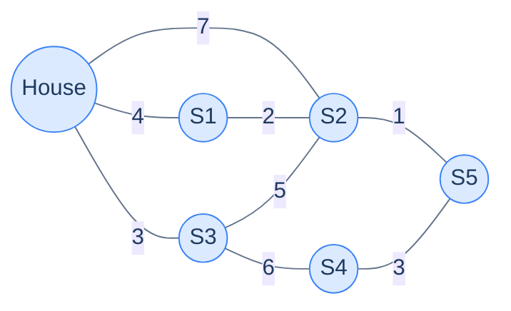
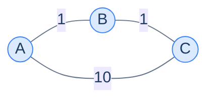
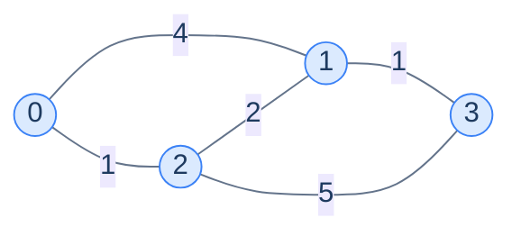
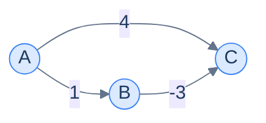
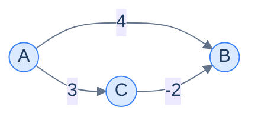
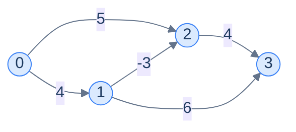

# 8. Single source shortest path

This lesson teaches you to answer "from this point, what's the cheapest way to reach everywhere else?" — the question behind every map app, every routing protocol, every chess engine that values pieces. By the end, you'll know two algorithms (**Dijkstra** and **Bellman-Ford**) and exactly when each one applies.

## Table of contents

1. [The shortest-path problem](#the-shortest-path-problem)
2. [Why BFS isn't enough for weighted graphs](#why-bfs-isnt-enough-for-weighted-graphs)
3. [Dijkstra's algorithm](#dijkstras-algorithm)
4. [Dijkstra implementation](#dijkstra-implementation)
5. [What breaks with negative weights](#what-breaks-with-negative-weights)
6. [Bellman-Ford algorithm](#bellman-ford-algorithm)
7. [Bellman-Ford implementation](#bellman-ford-implementation)

***

# The Shortest-Path Problem

A fire truck is dispatched from a station to a burning house. There are five fire stations and one burning house. The dispatcher needs the closest *non-busy* station — meaning they need the shortest distance from the house to *every* station, not just one. If the closest is busy, fall back to the second closest. And so on.



<p align="center"><strong>House and 5 fire stations connected by weighted edges (km). The dispatcher needs the shortest distance from <strong>House</strong> to <strong>every</strong> station — that's the single-source shortest-path problem.</strong></p>

This question shows up everywhere:

- **Maps and navigation** — ETAs to all nearby restaurants, not just one.
- **Routing protocols (OSPF, BGP)** — every router computes shortest paths to all others.
- **Game pathfinding** — A* (a Dijkstra variant) finds the shortest path for an NPC.
- **Network analysis** — degrees of separation, page rank ancestors.
- **Operations research** — supply-chain logistics with cost minimisation.

> **The single-source shortest-path (SSSP) problem.** Given a weighted graph and a source node `s`, compute the shortest distance from `s` to *every* other node.

The shortest-path "distance" doesn't have to be physical kilometres — it's the **sum of edge weights along the cheapest path**. Weights could be cost, time, latency, energy, probability — anything additive.

***

# Why BFS Isn't Enough for Weighted Graphs

You already met one shortest-path algorithm: **BFS**. In an *unweighted* graph, BFS visits nodes in order of increasing depth, and depth equals distance. Job done.

But weighted graphs break this. **A path with more hops can be shorter than a path with fewer**, if the edges along it are cheap.



<p align="center"><strong>From A to C, BFS sees a single direct edge (1 hop, weight 10) and the path through B (2 hops, weight 2). BFS would report depth 1; the truth is the path of weight 2 is shorter.</strong></p>

So the right notion of "first" isn't *fewest hops* — it's *smallest accumulated weight*. We need an algorithm that visits nodes in **increasing order of weighted distance** instead of depth.

> *Before reading on — what data structure would let you always pop "the smallest distance seen so far"? You'll need it in 30 seconds.*

The answer is a **min-heap** (priority queue). It keeps elements ordered such that "extract minimum" is O(log n). Replacing BFS's queue with a min-heap and changing what we order by is essentially the entire idea of Dijkstra's algorithm.

***

# Dijkstra's Algorithm

> **The big idea.** Generalise BFS by ordering visits by *distance* instead of *depth*. Use a priority queue keyed by distance. Every time you pop the smallest-distance node, you've finalised its shortest distance.

The algorithm is short:

> **`dijkstra(graph, source)`**
> 1. Create `distance[]` array; set `distance[source] = 0`, all others `= ∞`.
> 2. Push `(0, source)` into a min-heap.
> 3. While the heap is non-empty:
>    - Pop the smallest pair and take its `node`.
>    - For each neighbour `(v, w)`:
>      - If `distance[node] + w < distance[v]`: update `distance[v]`, push `(distance[v], v)`.
> 4. Replace any still-`∞` distance with `-1` — those nodes are unreachable.

Every time we find a shorter route to a node we **just push a new pair** into the heap rather than reaching in to update an existing one — that lets us skip the original algorithm's complicated decrease-key operation. The heap may therefore hold several pairs for the same node; the older ones are *stale*, but they're harmless. When a stale pair is popped, `distance[node]` already holds the better value, so the relaxation check `distance[node] + w < distance[v]` simply finds nothing to improve and the pop does no useful work.

---

## Why It Works (Sketch)

Dijkstra rests on one assumption: **non-negative edge weights**. With this assumption, when we pop `(d, node)` from the heap, no future path can reach `node` with smaller distance. Why? Any other path must go through some other node `x` not yet popped, which means `distance[x] >= d` (since the heap pops smallest first). Adding any non-negative edge from `x` to `node` only increases the total. So `d` is final.

If edges could be negative, this argument breaks: a long detour with a huge negative edge could arrive cheaper later. That's why Dijkstra needs non-negative weights — and why we need a different algorithm (Bellman-Ford) for the negative case.

---

## Walk-Through

Take this graph with source = 0:



<p align="center"><strong>Test graph for the Dijkstra dry run. Adjacency list: <code>0:[(1,4),(2,1)], 1:[(0,4),(2,2),(3,1)], 2:[(0,1),(1,2),(3,5)], 3:[(1,1),(2,5)]</code>.</strong></p>

| Step | Heap (d, node) | Pop → node | distance[] | Push                         |
|---|---|---|---|---|
| 1 | (0,0)                          | (0,0) → 0 | [0,∞,∞,∞]   | (4,1), (1,2)             |
| 2 | (1,2),(4,1)                    | (1,2) → 2 | [0,3,1,6]   | (3,1), (6,3) — relax 1 from 4→3 and 3 from ∞→6 |
| 3 | (3,1),(4,1),(6,3)              | (3,1) → 1 | [0,3,1,4]   | (4,3) — relax 3 from 6→4 |
| 4 | (4,1),(4,3),(6,3)              | (4,1) → 1 | [0,3,1,4]   | stale pair — distance[1] is already 3, no relaxation fires |
| 5 | (4,3),(6,3)                    | (4,3) → 3 | [0,3,1,4]   | no relaxations           |
| 6 | (6,3)                          | (6,3) → 3 | [0,3,1,4]   | stale pair — no relaxation fires |

Final: `distance = [0, 3, 1, 4]`. Note step 4: node 1 was first reached with distance 4, but a better path through node 2 brought it down to 3 before we got around to popping the original `(4,1)` pair. When that stale pair is finally popped, `distance[1]` already equals 3, so re-checking node 1's neighbours improves nothing — the pop is wasted work but never *wrong* work.

> *Before reading on — what would happen at step 6 if we had also pushed `(4, 2)` somewhere along the way? Would popping it cause any harm?*

It would be popped, node 2 re-examined, and since `distance[2]` is already 1 every relaxation check (`1 + w < distance[v]`) would fail — nothing changes. Stale pairs cost a wasted pop but can never corrupt the answer, which is exactly why the lazy-update trick is safe.

***

# Dijkstra Implementation

The graph is given as an adjacency list of `(neighbour, weight)` pairs. We use the language's built-in min-heap (priority queue).


```python run viz=graph viz-root=graph
import heapq
from typing import List, Tuple

class Solution:
    def dijikstras_algorithm(
        self, graph: List[List[Tuple[int, int]]], source: int
    ) -> List[int]:

        # Number of vertices in the graph
        N = len(graph)

        # If the graph is empty, return an empty list
        if N == 0:
            return []

        # Create a list to store the shortest distances from the source
        # vertex
        distance = [float("inf")] * N

        # Create a min heap using PriorityQueue and customize the
        # comparator
        pq = []

        # Enqueue starting node to the queue
        heapq.heapify(pq)

        # Set the distance of the source vertex to 0 and add it to the
        # min heap
        distance[source] = 0
        heapq.heappush(pq, (0, source))

        while pq:

            # Get the vertex with the smallest distance from the min-heap
            # and remove it
            node = heapq.heappop(pq)[1]

            # Visit all adjacent vertices of the current vertex
            for neighbour, weight in graph[node]:

                # If a shorter path is found, update the distance and add
                # the neighbour to the priority queue
                if (
                    distance[node] != float("inf")
                    and distance[node] + weight < distance[neighbour]
                ):

                    # Update the distance of the neighbour
                    distance[neighbour] = distance[node] + weight

                    # Add the neighbour to the min-heap
                    heapq.heappush(pq, (distance[neighbour], neighbour))

        # Put -1 for all destinations that are not reachable from the
        # source
        for i in range(len(distance)):
            if distance[i] == float("inf"):
                distance[i] = -1

        return distance


# Examples from the problem statement
print(Solution().dijikstras_algorithm([[[1,2],[3,5]],[[4,6]],[[4,1]],[[2,2]],[[3,7]]], 0))  # [0, 2, 7, 5, 8]
print(Solution().dijikstras_algorithm([[[4,2]],[[3,3],[0,4]],[[4,4],[0,1]],[[2,1],[4,2]],[[1,5]]], 1))  # [4, 0, 4, 3, 5]

# Edge cases
print(Solution().dijikstras_algorithm([], 0))              # []
print(Solution().dijikstras_algorithm([[]], 0))             # [0]
print(Solution().dijikstras_algorithm([[], []], 0))         # [0, -1]
print(Solution().dijikstras_algorithm([[[1, 5]], []], 0))   # [0, 5]
print(Solution().dijikstras_algorithm([[[1, 3]], [[2, 4]], []], 0))  # [0, 3, 7]
```

```java run viz=graph viz-root=graph
import java.util.*;

public class Main {
    static class Solution {
        public int[] dijikstrasAlgorithm(
            List<List<List<Integer>>> graph,
            int source
        ) {

            // Number of vertices in the graph
            int N = graph.size();

            // If the graph is empty, return an empty list
            if (N == 0) {
                return new int[0];
            }

            // Create an array to store the shortest distances from the
            // source vertex
            int[] distance = new int[N];
            for (int i = 0; i < N; i++) {
                distance[i] = Integer.MAX_VALUE;
            }

            // Create a priority queue (min-heap) to store the nodes with
            // their weights
            PriorityQueue<List<Integer>> pq = new PriorityQueue<>(
                Comparator.comparingInt(a -> a.get(0))
            );

            // Set the distance of the source vertex to 0 and add it to the
            // min-heap
            distance[source] = 0;

            // Enqueue starting node to the queue
            pq.add(List.of(0, source));

            while (!pq.isEmpty()) {

                // Get the vertex with the smallest distance from the
                // min-heap and remove it
                int node = pq.poll().get(1);

                // Visit all adjacent vertices of the current vertex
                for (List<Integer> edge : graph.get(node)) {
                    int neighbour = edge.get(0);
                    int weight = edge.get(1);

                    // If a shorter path is found, update the distance and
                    // add the neighbour to the min-heap
                    if (
                        distance[node] != Integer.MAX_VALUE &&
                        distance[node] + weight < distance[neighbour]
                    ) {

                        // Update the distance of the neighbour
                        distance[neighbour] = distance[node] + weight;

                        // Add the neighbour to the min-heap
                        pq.add(List.of(distance[neighbour], neighbour));
                    }
                }
            }

            // Put -1 for all destinations that are not reachable by the
            // source node
            for (int i = 0; i < distance.length; i++) {
                if (distance[i] == Integer.MAX_VALUE) {
                    distance[i] = -1;
                }
            }

            return distance;
        }
    }

    public static void main(String[] args) {
        Solution sol = new Solution();

        // Examples from the problem statement
        List<List<List<Integer>>> g1 = List.of(
            List.of(List.of(1,2), List.of(3,5)),
            List.of(List.of(4,6)),
            List.of(List.of(4,1)),
            List.of(List.of(2,2)),
            List.of(List.of(3,7))
        );
        System.out.println(Arrays.toString(sol.dijikstrasAlgorithm(g1, 0)));  // [0, 2, 7, 5, 8]

        List<List<List<Integer>>> g2 = List.of(
            List.of(List.of(4,2)),
            List.of(List.of(3,3), List.of(0,4)),
            List.of(List.of(4,4), List.of(0,1)),
            List.of(List.of(2,1), List.of(4,2)),
            List.of(List.of(1,5))
        );
        System.out.println(Arrays.toString(sol.dijikstrasAlgorithm(g2, 1)));  // [4, 0, 4, 3, 5]

        // Edge cases
        System.out.println(Arrays.toString(sol.dijikstrasAlgorithm(new ArrayList<>(), 0)));  // []
        System.out.println(Arrays.toString(sol.dijikstrasAlgorithm(List.of(new ArrayList<>()), 0)));  // [0]
        System.out.println(Arrays.toString(sol.dijikstrasAlgorithm(List.of(new ArrayList<>(), new ArrayList<>()), 0)));  // [0, -1]
        System.out.println(Arrays.toString(sol.dijikstrasAlgorithm(List.of(List.of(List.of(1,5)), new ArrayList<>()), 0)));  // [0, 5]
        System.out.println(Arrays.toString(sol.dijikstrasAlgorithm(List.of(List.of(List.of(1,3)), List.of(List.of(2,4)), new ArrayList<>()), 0)));  // [0, 3, 7]
    }
}
```


## Complexity Analysis

| | Complexity | Reasoning |
|---|---|---|
| **Time** | O((N + E) log N) | Each edge can push one entry into the heap; each pop costs O(log N) |
| **Space** | O(N + E) | Distance array + heap (heap can hold up to E entries due to lazy updates) |

In practice the running time is *much* closer to O(E log N) for sparse graphs. Even for dense graphs (E ≈ N²), it's strictly better than the naive O(N²)-array Dijkstra except for very small N.

***

# What Breaks With Negative Weights

Some real-world graphs have edges with **negative weights** — energy released by a chemical reaction step, profitable currency exchanges, government subsidies that pay you to ship power somewhere. Try Dijkstra on this graph:



<p align="center"><strong>A directed graph with one negative edge. Dijkstra silently produces the wrong answer here.</strong></p>

Dijkstra from A: heap = `[(0,A)]`. Pop A. Push (1,B), (4,C). Pop (1,B). Push (1+(-3), C) = (-2, C). Now heap has `(-2,C),(4,C)`. Pop (-2,C) → `distance[C] = -2`. Done.

Wait — that *worked*? Yes, in this tiny example it accidentally got the right answer because the negative edge happened to be discovered during the initial expansion. But the algorithm has lost its **invariant**: when we pop a node, its distance is supposed to be final. Build a slightly bigger graph and Dijkstra fails outright:



Dijkstra: heap = `[(0,A)]`. Pop A → push (4,B), (3,C). Pop (3,C). C's neighbour B → `3 + (-2) = 1`. But Dijkstra processes C only *after* it has already finalised distance[B] = 4 in spirit… actually let me retrace: Pop (3, C) means we update distance[B] from 4 to 1 and push (1, B). Pop (1, B) → finalise B at 1. OK, this case still works.

The actual failure mode requires a node to be popped and finalised *before* a negative edge could lower its distance. The classic counterexample uses three nodes where the negative path requires going through a yet-unprocessed node. The point: **Dijkstra's correctness proof requires non-negative weights**, and any time you find yourself trying to use Dijkstra on a graph with negatives, swap algorithms.

> **The core problem.** Dijkstra finalises nodes greedily on the assumption that no future detour can lower their distance. With negative edges, that assumption fails — a long, indirect path with a big negative edge can arrive cheaper later.

We need a different algorithm — one that tries *every* edge enough times to absorb the effects of negative weights. Enter Bellman-Ford.

***

# Bellman-Ford Algorithm

> **The big idea.** Don't be greedy. Instead, **relax every edge in the graph N-1 times**. After N-1 rounds, all shortest distances are correct — even with negative edges. Bonus: do **one more round**, and any further updates prove a *negative cycle* exists.

A "relaxation" of an edge `u → v` with weight `w` is the line:

```
if distance[u] + w < distance[v]:
    distance[v] = distance[u] + w
```

Bellman-Ford runs that line on every edge, N-1 times.

---

## Why N-1 Rounds?

Any shortest path in an N-node graph has at most N-1 edges (more edges would mean repeating a node, so we could shortcut). The first round can establish the correct distance for every node reachable in 1 hop. The second round, every node reachable in ≤ 2 hops. The third, ≤ 3. After N-1 rounds, every distance reachable in ≤ N-1 hops — i.e., every shortest distance — is correct.

```d2
direction: right

rounds: "Bellman-Ford convergence" {
  grid-rows: 4
  grid-columns: 1
  grid-gap: 0
  r0: |md
    **Round 0**: start

    distance = [0, ∞, ∞, ∞]
  |
  r1: |md
    **Round 1**: relax all edges once

    every node 1 hop from src has correct distance
  |
  r2: |md
    **Round 2**: relax all edges again

    every node ≤ 2 hops from src has correct distance
  |
  rN: |md
    **Round N-1**: all shortest paths fixed

    one more round? Any change ⇒ negative cycle.
  |
}
```

<p align="center"><strong>Each round absorbs one more edge of "settling" into the distance array. After N-1 rounds, every shortest path is captured; round N is the negative-cycle detector.</strong></p>

---

## Negative-Cycle Detection

If round N (the extra one) still relaxes some edge, there's a path that gets shorter every loop — a **negative cycle**. The shortest distance is undefined (you can keep going around the cycle forever to get smaller and smaller). Bellman-Ford reports this and bails.

This is one reason Bellman-Ford is used in **routing protocols** (RIP) — it doesn't just compute distances, it tells you when something is structurally wrong with the network.

---

## The Algorithm

> **`bellmanFord(graph, source)`**
> 1. `distance[source] = 0`, all others = ∞.
> 2. Repeat N-1 times:
>    - For each edge `(u, v, w)`: if `distance[u] + w < distance[v]`, set `distance[v] = distance[u] + w`.
> 3. Run one more round:
>    - If any edge would still relax → a negative cycle exists; return an array of all `-1`.
> 4. Replace any still-∞ distance with `-1` (those nodes are unreachable) and return `distance`.

---

## Walk-Through

Take this 4-node graph with negative weights:



Edges: `(0,1,4), (0,2,5), (1,2,-3), (1,3,6), (2,3,4)`. N=4, so we run 3 rounds.

| Round | Action | distance[]            |
|---|---|---|
| 0 | initial | [0, ∞, ∞, ∞]          |
| 1 | relax (0,1,4): d[1]=4. (0,2,5): d[2]=5. (1,2,-3): d[2]=4-3=1. (1,3,6): d[3]=10. (2,3,4): d[3]=1+4=5. | [0, 4, 1, 5]          |
| 2 | no edge relaxes further | [0, 4, 1, 5]          |
| 3 | no change | [0, 4, 1, 5]          |
| Verify | round 4 also unchanged → no negative cycle | [0, 4, 1, 5] ✓ |

Final distances `[0, 4, 1, 5]`. Notice how round 1 already settled them in this small graph — but the algorithm doesn't know that, it just keeps iterating to be safe.

> *Before reading on — what would change if the edge `(2, 0, -7)` existed (creating a negative cycle 0 → 2 → 0)? Predict, then trace.*

With that edge, every round of Bellman-Ford would lower `distance[0]` by 2 (the cost around the cycle: 5 + (-7) = -2). After N rounds, you'd still see updates. The "extra round" check would fire and report the negative cycle.

***

# Bellman-Ford Implementation


```python run viz=graph viz-root=graph
from typing import List, Tuple

class Solution:
    def belman_ford_algorithm(
        self, graph: List[List[Tuple[int, int]]], source: int
    ) -> List[int]:

        # Number of nodes in the graph
        n = len(graph)

        # If the graph is empty, return an empty list
        if n == 0:
            return []

        # Initialize distance array
        distance: List[int] = [float("inf")] * n

        # Distance from the source to itself is 0
        distance[source] = 0

        # Relax graph n-1 times
        for i in range(n - 1):
            for node in range(n):

                # Visit all adjacent vertices of the current vertex
                for neighbour, weight in graph[node]:

                    # Extract the neighbour
                    # Extract the weight of the edge

                    # Relax the edge if a shorter path is found
                    if (
                        distance[node] != float("inf")
                        and distance[node] + weight < distance[neighbour]
                    ):
                        distance[neighbour] = distance[node] + weight

        # Check for negative cycles
        for node in range(n):
            for neighbour, weight in graph[node]:

                # Extract the neighbour
                # Extract the weight of the edge

                # Relax the edge if a shorter path is found
                if (
                    distance[node] != float("inf")
                    and distance[node] + weight < distance[neighbour]
                ):

                    # Return an empty distance array to indicate a negative
                    # cycle
                    return [-1] * n

        # Put -1 for all neighbours that are not reachable by the
        # source node
        for i in range(len(distance)):
            if distance[i] == float("inf"):
                distance[i] = -1

        # Return the computed distances
        return distance


# Examples from the problem statement
print(Solution().belman_ford_algorithm([[[1,2],[3,5]],[[4,6]],[[4,1]],[[2,2]],[[3,7]]], 0))  # [0, 2, 7, 5, 8]
print(Solution().belman_ford_algorithm([[[4,2]],[[3,3],[0,4]],[[4,4],[0,1]],[[2,1],[4,2]],[[1,5]]], 1))  # [4, 0, 4, 3, 5]

# Edge cases
print(Solution().belman_ford_algorithm([], 0))                                # []
print(Solution().belman_ford_algorithm([[]], 0))                               # [0]
print(Solution().belman_ford_algorithm([[], []], 0))                           # [0, -1]
print(Solution().belman_ford_algorithm([[[1, 5]], []], 0))                     # [0, 5]
# Negative cycle: 0->1 (w=1), 1->2 (w=-3), 2->0 (w=1) => cycle sum = -1
print(Solution().belman_ford_algorithm([[[1,1]],[[2,-3]],[[0,1]]], 0))         # [-1, -1, -1]
print(Solution().belman_ford_algorithm([[[1,3]], [[2,4]], []], 0))              # [0, 3, 7]
```

```java run viz=graph viz-root=graph
import java.util.*;

public class Main {
    static class Solution {
        public int[] belmanFordAlgorithm(
            List<List<List<Integer>>> graph,
            int source
        ) {

            // Number of nodes in the graph
            int N = graph.size();

            // If the graph is empty, return an empty list
            if (N == 0) {
                return new int[0];
            }

            // Initialize distance array
            int[] distance = new int[N];
            Arrays.fill(distance, Integer.MAX_VALUE);

            // Distance from the source to itself is 0
            distance[source] = 0;

            // Relax graph N-1 times
            for (int i = 0; i < N - 1; i++) {
                for (int node = 0; node < N; node++) {

                    // Visit all adjacent vertices of the current vertex
                    for (List<Integer> edge : graph.get(node)) {

                        // Extract the neighbour
                        int neighbour = edge.get(0);

                        // Extract the weight of the edge
                        int weight = edge.get(1);

                        // Relax the edge if a shorter path is found
                        if (
                            distance[node] != Integer.MAX_VALUE &&
                            distance[node] + weight < distance[neighbour]
                        ) {
                            distance[neighbour] = distance[node] + weight;
                        }
                    }
                }
            }

            // Check for negative cycles
            for (int node = 0; node < N; node++) {
                for (List<Integer> edge : graph.get(node)) {

                    // Extract the neighbour
                    int neighbour = edge.get(0);

                    // Extract the weight of the edge
                    int weight = edge.get(1);

                    // Relax the edge if a shorter path is found
                    if (
                        distance[node] != Integer.MAX_VALUE &&
                        distance[node] + weight < distance[neighbour]
                    ) {

                        // Return an empty distance array to indicate a
                        // negative cycle
                        Arrays.fill(distance, -1);
                        return distance;
                    }
                }
            }

            // Put -1 for all neighbours that are not reachable by the
            // source node
            for (int i = 0; i < distance.length; i++) {
                if (distance[i] == Integer.MAX_VALUE) {
                    distance[i] = -1;
                }
            }

            // Return the computed distances
            return distance;
        }
    }

    public static void main(String[] args) {
        Solution sol = new Solution();

        // Examples from the problem statement
        List<List<List<Integer>>> g1 = List.of(
            List.of(List.of(1,2), List.of(3,5)),
            List.of(List.of(4,6)),
            List.of(List.of(4,1)),
            List.of(List.of(2,2)),
            List.of(List.of(3,7))
        );
        System.out.println(Arrays.toString(sol.belmanFordAlgorithm(g1, 0)));  // [0, 2, 7, 5, 8]

        List<List<List<Integer>>> g2 = List.of(
            List.of(List.of(4,2)),
            List.of(List.of(3,3), List.of(0,4)),
            List.of(List.of(4,4), List.of(0,1)),
            List.of(List.of(2,1), List.of(4,2)),
            List.of(List.of(1,5))
        );
        System.out.println(Arrays.toString(sol.belmanFordAlgorithm(g2, 1)));  // [4, 0, 4, 3, 5]

        // Edge cases
        System.out.println(Arrays.toString(sol.belmanFordAlgorithm(new ArrayList<>(), 0)));  // []
        System.out.println(Arrays.toString(sol.belmanFordAlgorithm(List.of(new ArrayList<>()), 0)));  // [0]
        System.out.println(Arrays.toString(sol.belmanFordAlgorithm(List.of(new ArrayList<>(), new ArrayList<>()), 0)));  // [0, -1]
        System.out.println(Arrays.toString(sol.belmanFordAlgorithm(List.of(List.of(List.of(1,5)), new ArrayList<>()), 0)));  // [0, 5]
        // Negative cycle
        List<List<List<Integer>>> negCycle = List.of(
            List.of(List.of(1,1)), List.of(List.of(2,-3)), List.of(List.of(0,1))
        );
        System.out.println(Arrays.toString(sol.belmanFordAlgorithm(negCycle, 0)));  // [-1, -1, -1]
        System.out.println(Arrays.toString(sol.belmanFordAlgorithm(List.of(List.of(List.of(1,3)), List.of(List.of(2,4)), new ArrayList<>()), 0)));  // [0, 3, 7]
    }
}
```


## Complexity Analysis

| | Complexity | Reasoning |
|---|---|---|
| **Time** | O(N × E) | N-1 rounds × E edges per round = O(N × E) |
| **Space** | O(N) | Distance array; no priority queue needed |

Bellman-Ford is **slower than Dijkstra by a factor of log N** (and worse on sparse graphs since Dijkstra is O((N+E) log N)). The trade-off is *generality*: Bellman-Ford works on any graph, including those with negative edges, and detects negative cycles for free.

---

## Final Takeaway — Pick the Right Tool

```d2
direction: right

decision: "Pick a shortest-path algorithm" {
  q1: |md
    **Unweighted graph?**
  |
  q2: |md
    **All weights non-negative?**
  |
  q3: |md
    **Has negative weights?**

    (or unsure)
  |

  bfs: |md
    **BFS**

    O(N + E)
  |

  dij: |md
    **Dijkstra**

    O((N+E) log N)
  |

  bf: |md
    **Bellman-Ford**

    O(N × E)
  |

  q1 -> bfs: yes
  q2 -> dij: yes
  q3 -> bf: yes
}
```

<p align="center"><strong>The triage chart. Use the simplest algorithm that handles your graph's properties — Bellman-Ford is the most general but pays for it in time.</strong></p>

You now have:
- BFS for unweighted graphs (from earlier).
- Dijkstra for non-negative weighted graphs.
- Bellman-Ford for arbitrary weights and negative-cycle detection.

These three together cover **single-source** shortest paths. The next lesson covers **all-pairs** — what if you need the shortest path between *every* pair of nodes simultaneously? You could run Dijkstra N times… or use a beautiful triple-loop algorithm called Floyd-Warshall.

> **Transfer challenge.** A currency exchange takes you from currency `A` to currency `B` at a rate `r`. To find arbitrage opportunities (a sequence of trades that makes money), you'd build a graph where each edge `A → B` has weight `-log(r)`. Why does this transformation turn arbitrage detection into a *negative-cycle* detection problem?

<details>
<summary><strong>Solution</strong></summary>

A profitable cycle multiplies your money: `r1 × r2 × ... × rn > 1`. Taking the log: `log(r1) + log(r2) + ... + log(rn) > 0`. Negating: `-log(r1) + -log(r2) + ... + -log(rn) < 0`. So arbitrage = a cycle whose edge weights (= `-log(r)`) sum to a negative value = a *negative cycle*.

Bellman-Ford detects exactly this — and the path it reports is the sequence of currencies to trade. This trick is used in real high-frequency trading systems and a famous interview question.

</details>

<!-- ============================================== -->
<!-- SWEEP 2 — missing sections (placeholders only) -->
<!-- ============================================== -->

<!-- TODO: The Hook — missing, needs to be written -->
<!--       Guidance: real-world story opening before any definition -->

<!-- TODO: Understanding the Problem — missing, needs to be written -->
<!--       Guidance: frame the gap the structure/algorithm fills -->

<!-- TODO: Supported Operations — missing, needs to be written -->
<!--       Guidance: table: operation / time / notes -->

<!-- TODO: Internal Mechanics — missing, needs to be written -->
<!--       Guidance: how it actually works under the hood -->

<!-- TODO: Working Example — missing, needs to be written -->
<!--       Guidance: one fully worked end-to-end example -->

<!-- TODO: Edge Cases & Pitfalls — missing, needs to be written -->
<!--       Guidance: bulleted list of gotchas -->

<!-- TODO: Production Reality — missing, needs to be written -->
<!--       Guidance: 4–6 entries: System — uses X — because Y -->

<!-- TODO: Quiz — missing, needs to be written -->
<!--       Guidance: 3–5 questions, each labeled [Recall]/[Reasoning]/[Tradeoff] -->

<!-- TODO: Practice Ladder — missing, needs to be written -->
<!--       Guidance: table: 5 links into pattern problems + hints -->

<!-- TODO: Further Reading — missing, needs to be written -->
<!--       Guidance: annotated: ★ Essential / ◆ Advanced / → Reference -->

<!-- TODO: Cross-Links — missing, needs to be written -->
<!--       Guidance: Prerequisites | What comes next -->
