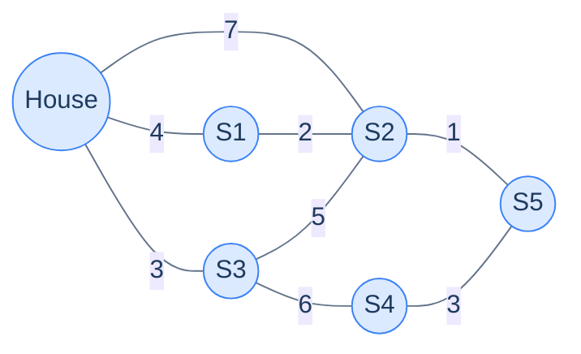
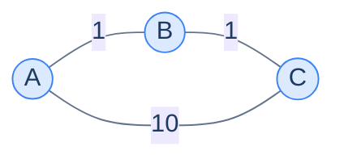
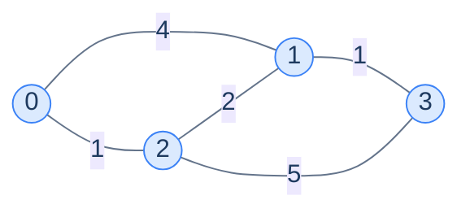
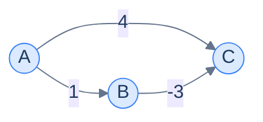
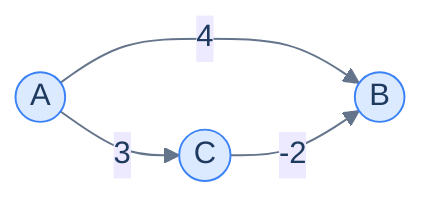
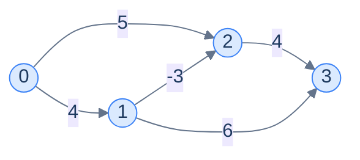

# 8. Single source shortest path

This lesson teaches you to answer "from this point, what's the cheapest way to reach everywhere else?" — the question behind every map app, every routing protocol, every chess engine that values pieces. By the end, you'll know two algorithms (**Dijkstra** and **Bellman-Ford**) and exactly when each one applies.

## Table of contents

1. [The shortest-path problem](#the-shortest-path-problem)
2. [Why BFS isn't enough for weighted graphs](#why-bfs-isnt-enough-for-weighted-graphs)
3. [Dijkstra's algorithm](#dijkstras-algorithm)
4. [Dijkstra implementation](#dijkstra-implementation)
5. [What breaks with negative weights](#what-breaks-with-negative-weights)
6. [Bellman-Ford algorithm](#bellman-ford-algorithm)
7. [Bellman-Ford implementation](#bellman-ford-implementation)

***

# The Shortest-Path Problem

A fire truck is dispatched from a station to a burning house. There are five fire stations and one burning house. The dispatcher needs the closest *non-busy* station — meaning they need the shortest distance from the house to *every* station, not just one. If the closest is busy, fall back to the second closest. And so on.



<p align="center"><strong>House and 5 fire stations connected by weighted edges (km). The dispatcher needs the shortest distance from <strong>House</strong> to <strong>every</strong> station — that's the single-source shortest-path problem.</strong></p>

This question shows up everywhere:

- **Maps and navigation** — ETAs to all nearby restaurants, not just one.
- **Routing protocols (OSPF, BGP)** — every router computes shortest paths to all others.
- **Game pathfinding** — A* (a Dijkstra variant) finds the shortest path for an NPC.
- **Network analysis** — degrees of separation, page rank ancestors.
- **Operations research** — supply-chain logistics with cost minimisation.

> **The single-source shortest-path (SSSP) problem.** Given a weighted graph and a source node `s`, compute the shortest distance from `s` to *every* other node.

The shortest-path "distance" doesn't have to be physical kilometres — it's the **sum of edge weights along the cheapest path**. Weights could be cost, time, latency, energy, probability — anything additive.

***

# Why BFS Isn't Enough for Weighted Graphs

You already met one shortest-path algorithm: **BFS**. In an *unweighted* graph, BFS visits nodes in order of increasing depth, and depth equals distance. Job done.

But weighted graphs break this. **A path with more hops can be shorter than a path with fewer**, if the edges along it are cheap.



<p align="center"><strong>From A to C, BFS sees a single direct edge (1 hop, weight 10) and the path through B (2 hops, weight 2). BFS would report depth 1; the truth is the path of weight 2 is shorter.</strong></p>

So the right notion of "first" isn't *fewest hops* — it's *smallest accumulated weight*. We need an algorithm that visits nodes in **increasing order of weighted distance** instead of depth.

> *Before reading on — what data structure would let you always pop "the smallest distance seen so far"? You'll need it in 30 seconds.*

The answer is a **min-heap** (priority queue). It keeps elements ordered such that "extract minimum" is O(log n). Replacing BFS's queue with a min-heap and changing what we order by is essentially the entire idea of Dijkstra's algorithm.

***

# Dijkstra's Algorithm

> **The big idea.** Generalise BFS by ordering visits by *distance* instead of *depth*. Use a priority queue keyed by distance. Every time you pop the smallest-distance node, you've finalised its shortest distance.

The algorithm is short:

> **`dijkstra(graph, source)`**
> 1. Create `distance[]` array; set `distance[source] = 0`, all others `= ∞`.
> 2. Push `(0, source)` into a min-heap.
> 3. While the heap is non-empty:
>    - Pop `(d, node)` — the smallest-distance pair.
>    - If `d > distance[node]`, this is a *stale* pair from an earlier push; skip it.
>    - For each neighbour `(v, w)`:
>      - `new_dist = distance[node] + w`
>      - If `new_dist < distance[v]`: update `distance[v]`, push `(new_dist, v)`.

The "stale entry" check is the key trick that makes the priority-queue-based variant of Dijkstra work without the original algorithm's complicated decrease-key operation. Every time we'd want to *update* a heap entry, we instead **just push a new one** — the old one becomes stale, but it's harmless because we skip it when popped.

---

## Why It Works (Sketch)

Dijkstra rests on one assumption: **non-negative edge weights**. With this assumption, when we pop `(d, node)` from the heap, no future path can reach `node` with smaller distance. Why? Any other path must go through some other node `x` not yet popped, which means `distance[x] >= d` (since the heap pops smallest first). Adding any non-negative edge from `x` to `node` only increases the total. So `d` is final.

If edges could be negative, this argument breaks: a long detour with a huge negative edge could arrive cheaper later. That's why Dijkstra needs non-negative weights — and why we need a different algorithm (Bellman-Ford) for the negative case.

---

## Walk-Through

Take this graph with source = 0:



<p align="center"><strong>Test graph for the Dijkstra dry run. Adjacency list: <code>0:[(1,4),(2,1)], 1:[(0,4),(2,2),(3,1)], 2:[(0,1),(1,2),(3,5)], 3:[(1,1),(2,5)]</code>.</strong></p>

| Step | Heap (d, node) | Pop | distance[] | Push                         |
|---|---|---|---|---|
| 1 | (0,0)                          | (0,0) | [0,∞,∞,∞]   | (4,1), (1,2)             |
| 2 | (1,2),(4,1)                    | (1,2) | [0,3,1,6]   | (3,1), (6,3) — relax 1 from 4→3 and 3 from ∞→6 |
| 3 | (3,1),(4,1),(6,3)              | (3,1) | [0,3,1,4]   | (4,3) — relax 3 from 6→4 |
| 4 | (4,1),(4,3),(6,3)              | (4,1) | [0,3,1,4]   | stale (4 ≠ distance[1]=3); skip |
| 5 | (4,3),(6,3)                    | (4,3) | [0,3,1,4]   | no relaxations           |
| 6 | (6,3)                          | (6,3) | [0,3,1,4]   | stale; skip              |

Final: `distance = [0, 3, 1, 4]`. Note how step 4 demonstrates the stale-pair skip — node 1 was first reached with distance 4, but a better path through node 2 brought it down to 3 before we got around to processing the original entry.

> *Before reading on — what would happen at step 6 if we had also pushed `(4, 2)` somewhere along the way? Would popping it cause any harm?*

It would be popped, the check `4 > distance[2]=1` would catch it, and it would be skipped. Stale entries always lose this check — that's the whole reason the lazy-update trick works.

***

# Dijkstra Implementation

The graph is given as an adjacency list of `(neighbour, weight)` pairs. We use the language's built-in min-heap (priority queue).


```pseudocode
function dijkstra(graph, source):
    dist ← array of ∞, size N
    dist[source] ← 0
    pq ← empty min-heap
    push (0, source) to pq
    while pq is not empty:
        (d, node) ← pop (dist, node) from pq
        if d > dist[node]:
            continue             # stale entry — a better path was already found
        for (neighbor, weight) in graph[node]:
            newDist ← d + weight
            if newDist < dist[neighbor]:
                dist[neighbor] ← newDist
                push (newDist, neighbor) to pq
    return dist
```

```python run
import heapq
from typing import List, Tuple

INF = float('inf')

def dijkstra(graph: List[List[Tuple[int, int]]], source: int) -> List[float]:
    n = len(graph)
    distance = [INF] * n
    distance[source] = 0

    # Min-heap of (distance, node) pairs. Python's heapq is a min-heap by default.
    heap: List[Tuple[float, int]] = [(0, source)]

    while heap:
        d, node = heapq.heappop(heap)

        # STALE check: an earlier push got a better distance for this node;
        # skip the outdated pair.
        if d > distance[node]:
            continue

        for neighbour, weight in graph[node]:
            new_dist = d + weight
            if new_dist < distance[neighbour]:
                distance[neighbour] = new_dist
                heapq.heappush(heap, (new_dist, neighbour))
    return distance


graph = [
    [(1, 4), (2, 1)],
    [(0, 4), (2, 2), (3, 1)],
    [(0, 1), (1, 2), (3, 5)],
    [(1, 1), (2, 5)],
]
print(dijkstra(graph, 0))   # [0, 3, 1, 4]
```

```java run
import java.util.*;

public class Main {
    public static int[] dijkstra(List<List<int[]>> graph, int source) {
        int n = graph.size();
        int[] distance = new int[n];
        Arrays.fill(distance, Integer.MAX_VALUE);
        distance[source] = 0;

        // (distance, node) — natural ordering by first element.
        PriorityQueue<int[]> pq = new PriorityQueue<>((a, b) -> a[0] - b[0]);
        pq.offer(new int[]{0, source});

        while (!pq.isEmpty()) {
            int[] cur = pq.poll();
            int d = cur[0], node = cur[1];
            if (d > distance[node]) continue;     // stale
            for (int[] edge : graph.get(node)) {
                int neighbour = edge[0], weight = edge[1];
                int nd = d + weight;
                if (nd < distance[neighbour]) {
                    distance[neighbour] = nd;
                    pq.offer(new int[]{nd, neighbour});
                }
            }
        }
        return distance;
    }

    public static void main(String[] args) {
        List<List<int[]>> g = List.of(
            List.of(new int[]{1, 4}, new int[]{2, 1}),
            List.of(new int[]{0, 4}, new int[]{2, 2}, new int[]{3, 1}),
            List.of(new int[]{0, 1}, new int[]{1, 2}, new int[]{3, 5}),
            List.of(new int[]{1, 1}, new int[]{2, 5}));
        System.out.println(Arrays.toString(dijkstra(g, 0)));
    }
}
```

```c run
#include <stdio.h>
#include <stdlib.h>
#include <string.h>
#include <limits.h>

typedef struct { int to, weight; } Edge;
typedef struct { Edge* data; int size; } AdjList;

// Tiny min-heap of (dist, node).
typedef struct { int d, node; } HeapEntry;
typedef struct { HeapEntry* data; int size; int capacity; } Heap;

static void heap_push(Heap* h, HeapEntry e) {
    if (h->size == h->capacity) {
        h->capacity = h->capacity ? h->capacity * 2 : 16;
        h->data = realloc(h->data, h->capacity * sizeof(HeapEntry));
    }
    int i = h->size++;
    h->data[i] = e;
    while (i > 0) {
        int p = (i - 1) / 2;
        if (h->data[p].d <= h->data[i].d) break;
        HeapEntry t = h->data[p]; h->data[p] = h->data[i]; h->data[i] = t;
        i = p;
    }
}
static HeapEntry heap_pop(Heap* h) {
    HeapEntry top = h->data[0];
    h->data[0] = h->data[--h->size];
    int i = 0;
    while (true) {
        int l = 2*i+1, r = 2*i+2, best = i;
        if (l < h->size && h->data[l].d < h->data[best].d) best = l;
        if (r < h->size && h->data[r].d < h->data[best].d) best = r;
        if (best == i) break;
        HeapEntry t = h->data[i]; h->data[i] = h->data[best]; h->data[best] = t;
        i = best;
    }
    return top;
}

int* dijkstra(AdjList* graph, int n, int source) {
    int* distance = malloc(n * sizeof(int));
    for (int i = 0; i < n; i++) distance[i] = INT_MAX;
    distance[source] = 0;

    Heap heap = {0};
    heap_push(&heap, (HeapEntry){0, source});

    while (heap.size > 0) {
        HeapEntry cur = heap_pop(&heap);
        if (cur.d > distance[cur.node]) continue;
        for (int i = 0; i < graph[cur.node].size; i++) {
            Edge e = graph[cur.node].data[i];
            int nd = cur.d + e.weight;
            if (nd < distance[e.to]) {
                distance[e.to] = nd;
                heap_push(&heap, (HeapEntry){nd, e.to});
            }
        }
    }
    free(heap.data);
    return distance;
}

int main() {
    Edge e0[] = {{1,4},{2,1}};
    Edge e1[] = {{0,4},{2,2},{3,1}};
    Edge e2[] = {{0,1},{1,2},{3,5}};
    Edge e3[] = {{1,1},{2,5}};
    AdjList g[] = {{e0,2},{e1,3},{e2,3},{e3,2}};
    int* d = dijkstra(g, 4, 0);
    for (int i = 0; i < 4; i++) printf("%d ", d[i]);
    printf("\n");
    free(d);
    return 0;
}
```

```scala run
import scala.collection.mutable

object Main extends App {
  def dijkstra(graph: Array[Array[(Int, Int)]], source: Int): Array[Int] = {
    val n = graph.length
    val distance = Array.fill(n)(Int.MaxValue)
    distance(source) = 0

    // Min-heap of (distance, node) — Scala's PriorityQueue is max-heap; reverse the order.
    val pq = mutable.PriorityQueue.empty[(Int, Int)](Ordering.by[(Int, Int), Int](_._1).reverse)
    pq.enqueue((0, source))

    while (pq.nonEmpty) {
      val (d, node) = pq.dequeue()
      if (d <= distance(node)) {
        for ((neighbour, weight) <- graph(node)) {
          val nd = d + weight
          if (nd < distance(neighbour)) {
            distance(neighbour) = nd
            pq.enqueue((nd, neighbour))
          }
        }
      }
    }
    distance
  }

  val g = Array(
    Array((1, 4), (2, 1)), Array((0, 4), (2, 2), (3, 1)),
    Array((0, 1), (1, 2), (3, 5)), Array((1, 1), (2, 5)))
  println(dijkstra(g, 0).mkString(", "))
}
```


## Complexity Analysis

| | Complexity | Reasoning |
|---|---|---|
| **Time** | O((N + E) log N) | Each edge can push one entry into the heap; each pop costs O(log N) |
| **Space** | O(N + E) | Distance array + heap (heap can hold up to E entries due to lazy updates) |

In practice the running time is *much* closer to O(E log N) for sparse graphs. Even for dense graphs (E ≈ N²), it's strictly better than the naive O(N²)-array Dijkstra except for very small N.

***

# What Breaks With Negative Weights

Some real-world graphs have edges with **negative weights** — energy released by a chemical reaction step, profitable currency exchanges, government subsidies that pay you to ship power somewhere. Try Dijkstra on this graph:



<p align="center"><strong>A directed graph with one negative edge. Dijkstra silently produces the wrong answer here.</strong></p>

Dijkstra from A: heap = `[(0,A)]`. Pop A. Push (1,B), (4,C). Pop (1,B). Push (1+(-3), C) = (-2, C). Now heap has `(-2,C),(4,C)`. Pop (-2,C) → `distance[C] = -2`. Done.

Wait — that *worked*? Yes, in this tiny example it accidentally got the right answer because the negative edge happened to be discovered during the initial expansion. But the algorithm has lost its **invariant**: when we pop a node, its distance is supposed to be final. Build a slightly bigger graph and Dijkstra fails outright:



Dijkstra: heap = `[(0,A)]`. Pop A → push (4,B), (3,C). Pop (3,C). C's neighbour B → `3 + (-2) = 1`. But Dijkstra processes C only *after* it has already finalised distance[B] = 4 in spirit… actually let me retrace: Pop (3, C) means we update distance[B] from 4 to 1 and push (1, B). Pop (1, B) → finalise B at 1. OK, this case still works.

The actual failure mode requires a node to be popped and finalised *before* a negative edge could lower its distance. The classic counterexample uses three nodes where the negative path requires going through a yet-unprocessed node. The point: **Dijkstra's correctness proof requires non-negative weights**, and any time you find yourself trying to use Dijkstra on a graph with negatives, swap algorithms.

> **The core problem.** Dijkstra finalises nodes greedily on the assumption that no future detour can lower their distance. With negative edges, that assumption fails — a long, indirect path with a big negative edge can arrive cheaper later.

We need a different algorithm — one that tries *every* edge enough times to absorb the effects of negative weights. Enter Bellman-Ford.

***

# Bellman-Ford Algorithm

> **The big idea.** Don't be greedy. Instead, **relax every edge in the graph N-1 times**. After N-1 rounds, all shortest distances are correct — even with negative edges. Bonus: do **one more round**, and any further updates prove a *negative cycle* exists.

A "relaxation" of an edge `u → v` with weight `w` is the line:

```
if distance[u] + w < distance[v]:
    distance[v] = distance[u] + w
```

Bellman-Ford runs that line on every edge, N-1 times.

---

## Why N-1 Rounds?

Any shortest path in an N-node graph has at most N-1 edges (more edges would mean repeating a node, so we could shortcut). The first round can establish the correct distance for every node reachable in 1 hop. The second round, every node reachable in ≤ 2 hops. The third, ≤ 3. After N-1 rounds, every distance reachable in ≤ N-1 hops — i.e., every shortest distance — is correct.

```d2
direction: right

rounds: "Bellman-Ford convergence" {
  grid-rows: 4
  grid-columns: 1
  grid-gap: 0
  r0: |md
    **Round 0**: start

    distance = [0, ∞, ∞, ∞]
  |
  r1: |md
    **Round 1**: relax all edges once

    every node 1 hop from src has correct distance
  |
  r2: |md
    **Round 2**: relax all edges again

    every node ≤ 2 hops from src has correct distance
  |
  rN: |md
    **Round N-1**: all shortest paths fixed

    one more round? Any change ⇒ negative cycle.
  |
}
```

<p align="center"><strong>Each round absorbs one more edge of "settling" into the distance array. After N-1 rounds, every shortest path is captured; round N is the negative-cycle detector.</strong></p>

---

## Negative-Cycle Detection

If round N (the extra one) still relaxes some edge, there's a path that gets shorter every loop — a **negative cycle**. The shortest distance is undefined (you can keep going around the cycle forever to get smaller and smaller). Bellman-Ford reports this and bails.

This is one reason Bellman-Ford is used in **routing protocols** (RIP) — it doesn't just compute distances, it tells you when something is structurally wrong with the network.

---

## The Algorithm

> **`bellmanFord(graph, source)`**
> 1. `distance[source] = 0`, all others = ∞.
> 2. Repeat N-1 times:
>    - For each edge `(u, v, w)`: if `distance[u] + w < distance[v]`, set `distance[v] = distance[u] + w`.
> 3. Run one more round:
>    - If any edge would still relax → return "negative cycle".
> 4. Return `distance`.

---

## Walk-Through

Take this 4-node graph with negative weights:



Edges: `(0,1,4), (0,2,5), (1,2,-3), (1,3,6), (2,3,4)`. N=4, so we run 3 rounds.

| Round | Action | distance[]            |
|---|---|---|
| 0 | initial | [0, ∞, ∞, ∞]          |
| 1 | relax (0,1,4): d[1]=4. (0,2,5): d[2]=5. (1,2,-3): d[2]=4-3=1. (1,3,6): d[3]=10. (2,3,4): d[3]=1+4=5. | [0, 4, 1, 5]          |
| 2 | no edge relaxes further | [0, 4, 1, 5]          |
| 3 | no change | [0, 4, 1, 5]          |
| Verify | round 4 also unchanged → no negative cycle | [0, 4, 1, 5] ✓ |

Final distances `[0, 4, 1, 5]`. Notice how round 1 already settled them in this small graph — but the algorithm doesn't know that, it just keeps iterating to be safe.

> *Before reading on — what would change if the edge `(2, 0, -7)` existed (creating a negative cycle 0 → 2 → 0)? Predict, then trace.*

With that edge, every round of Bellman-Ford would lower `distance[0]` by 2 (the cost around the cycle: 5 + (-7) = -2). After N rounds, you'd still see updates. The "extra round" check would fire and report the negative cycle.

***

# Bellman-Ford Implementation


```pseudocode
function bellmanFord(graph, source):
    dist ← array of ∞, size N
    dist[source] ← 0
    for round from 1 to N−1:   # at most N−1 edges in any shortest path
        updated ← false
        for u from 0 to N−1:
            if dist[u] = ∞: continue
            for (v, w) in graph[u]:
                if dist[u] + w < dist[v]:
                    dist[v] ← dist[u] + w
                    updated ← true
        if NOT updated: break   # converged early
    # extra round: any relaxation here means a negative cycle
    for u from 0 to N−1:
        if dist[u] = ∞: continue
        for (v, w) in graph[u]:
            if dist[u] + w < dist[v]:
                return empty list   # negative cycle detected
    return dist
```

```python run
from typing import List, Tuple

INF = float('inf')

def bellman_ford(graph: List[List[Tuple[int, int]]], source: int) -> List[float]:
    """Returns distances or empty list if a negative cycle is detected."""
    n = len(graph)
    distance: List[float] = [INF] * n
    distance[source] = 0

    # Round 1..N-1 — every shortest path uses at most N-1 edges.
    for _ in range(n - 1):
        updated = False
        for u in range(n):
            if distance[u] == INF:           # can't relax from an unreachable node
                continue
            for v, w in graph[u]:
                if distance[u] + w < distance[v]:
                    distance[v] = distance[u] + w
                    updated = True
        if not updated:                       # converged early — common in practice
            break

    # One more round — any further relaxation means a negative cycle.
    for u in range(n):
        if distance[u] == INF:
            continue
        for v, w in graph[u]:
            if distance[u] + w < distance[v]:
                return []                     # negative cycle detected

    return distance


graph = [
    [(1, 4), (2, 5)],
    [(2, -3), (3, 6)],
    [(3, 4)],
    [],
]
print(bellman_ford(graph, 0))   # [0, 4, 1, 5]
```

```java run
import java.util.*;

public class Main {
    public static int[] bellmanFord(List<List<int[]>> graph, int source) {
        int n = graph.size();
        int[] distance = new int[n];
        Arrays.fill(distance, Integer.MAX_VALUE);
        distance[source] = 0;

        for (int i = 0; i < n - 1; i++) {
            boolean updated = false;
            for (int u = 0; u < n; u++) {
                if (distance[u] == Integer.MAX_VALUE) continue;
                for (int[] e : graph.get(u)) {
                    int v = e[0], w = e[1];
                    if (distance[u] + w < distance[v]) {
                        distance[v] = distance[u] + w;
                        updated = true;
                    }
                }
            }
            if (!updated) break;
        }

        for (int u = 0; u < n; u++) {
            if (distance[u] == Integer.MAX_VALUE) continue;
            for (int[] e : graph.get(u)) {
                if (distance[u] + e[1] < distance[e[0]]) {
                    return new int[0];   // negative cycle
                }
            }
        }
        return distance;
    }

    public static void main(String[] args) {
        List<List<int[]>> g = List.of(
            List.of(new int[]{1, 4}, new int[]{2, 5}),
            List.of(new int[]{2, -3}, new int[]{3, 6}),
            List.of(new int[]{3, 4}),
            List.of());
        System.out.println(Arrays.toString(bellmanFord(g, 0)));
    }
}
```

```c run
#include <stdio.h>
#include <stdlib.h>
#include <stdbool.h>
#include <limits.h>

typedef struct { int to, weight; } Edge;
typedef struct { Edge* data; int size; } AdjList;

int* bellman_ford(AdjList* graph, int n, int source, bool* has_neg_cycle) {
    int* distance = malloc(n * sizeof(int));
    for (int i = 0; i < n; i++) distance[i] = INT_MAX;
    distance[source] = 0;
    *has_neg_cycle = false;

    for (int i = 0; i < n - 1; i++) {
        bool updated = false;
        for (int u = 0; u < n; u++) {
            if (distance[u] == INT_MAX) continue;
            for (int j = 0; j < graph[u].size; j++) {
                Edge e = graph[u].data[j];
                if (distance[u] + e.weight < distance[e.to]) {
                    distance[e.to] = distance[u] + e.weight;
                    updated = true;
                }
            }
        }
        if (!updated) break;
    }
    for (int u = 0; u < n; u++) {
        if (distance[u] == INT_MAX) continue;
        for (int j = 0; j < graph[u].size; j++) {
            Edge e = graph[u].data[j];
            if (distance[u] + e.weight < distance[e.to]) {
                *has_neg_cycle = true;
                return distance;
            }
        }
    }
    return distance;
}

int main() {
    Edge e0[] = {{1,4},{2,5}};
    Edge e1[] = {{2,-3},{3,6}};
    Edge e2[] = {{3,4}};
    AdjList g[] = {{e0,2},{e1,2},{e2,1},{NULL,0}};
    bool ncc;
    int* d = bellman_ford(g, 4, 0, &ncc);
    if (ncc) printf("negative cycle\n");
    else { for (int i = 0; i < 4; i++) printf("%d ", d[i]); printf("\n"); }
    free(d);
    return 0;
}
```

```scala run
object Main extends App {
  def bellmanFord(graph: Array[Array[(Int, Int)]], source: Int): Array[Int] = {
    val n = graph.length
    val distance = Array.fill(n)(Int.MaxValue)
    distance(source) = 0

    var i = 0
    var converged = false
    while (i < n - 1 && !converged) {
      var updated = false
      for (u <- 0 until n if distance(u) != Int.MaxValue;
           (v, w) <- graph(u)) {
        if (distance(u) + w < distance(v)) { distance(v) = distance(u) + w; updated = true }
      }
      if (!updated) converged = true
      i += 1
    }
    for (u <- 0 until n if distance(u) != Int.MaxValue;
         (v, w) <- graph(u)) {
      if (distance(u) + w < distance(v)) return Array.empty
    }
    distance
  }

  val g = Array(
    Array((1, 4), (2, 5)), Array((2, -3), (3, 6)),
    Array((3, 4)), Array.empty[(Int, Int)])
  println(bellmanFord(g, 0).mkString(", "))
}
```


## Complexity Analysis

| | Complexity | Reasoning |
|---|---|---|
| **Time** | O(N × E) | N-1 rounds × E edges per round = O(N × E) |
| **Space** | O(N) | Distance array; no priority queue needed |

Bellman-Ford is **slower than Dijkstra by a factor of log N** (and worse on sparse graphs since Dijkstra is O((N+E) log N)). The trade-off is *generality*: Bellman-Ford works on any graph, including those with negative edges, and detects negative cycles for free.

---

## Final Takeaway — Pick the Right Tool

```d2
direction: right

decision: "Pick a shortest-path algorithm" {
  q1: |md
    **Unweighted graph?**
  |
  q2: |md
    **All weights non-negative?**
  |
  q3: |md
    **Has negative weights?**

    (or unsure)
  |

  bfs: |md
    **BFS**

    O(N + E)
  |

  dij: |md
    **Dijkstra**

    O((N+E) log N)
  |

  bf: |md
    **Bellman-Ford**

    O(N × E)
  |

  q1 -> bfs: yes
  q2 -> dij: yes
  q3 -> bf: yes
}
```

<p align="center"><strong>The triage chart. Use the simplest algorithm that handles your graph's properties — Bellman-Ford is the most general but pays for it in time.</strong></p>

You now have:
- BFS for unweighted graphs (from earlier).
- Dijkstra for non-negative weighted graphs.
- Bellman-Ford for arbitrary weights and negative-cycle detection.

These three together cover **single-source** shortest paths. The next lesson covers **all-pairs** — what if you need the shortest path between *every* pair of nodes simultaneously? You could run Dijkstra N times… or use a beautiful triple-loop algorithm called Floyd-Warshall.

> **Transfer challenge.** A currency exchange takes you from currency `A` to currency `B` at a rate `r`. To find arbitrage opportunities (a sequence of trades that makes money), you'd build a graph where each edge `A → B` has weight `-log(r)`. Why does this transformation turn arbitrage detection into a *negative-cycle* detection problem?

<details>
<summary><strong>Solution</strong></summary>

A profitable cycle multiplies your money: `r1 × r2 × ... × rn > 1`. Taking the log: `log(r1) + log(r2) + ... + log(rn) > 0`. Negating: `-log(r1) + -log(r2) + ... + -log(rn) < 0`. So arbitrage = a cycle whose edge weights (= `-log(r)`) sum to a negative value = a *negative cycle*.

Bellman-Ford detects exactly this — and the path it reports is the sequence of currencies to trade. This trick is used in real high-frequency trading systems and a famous interview question.

</details>
