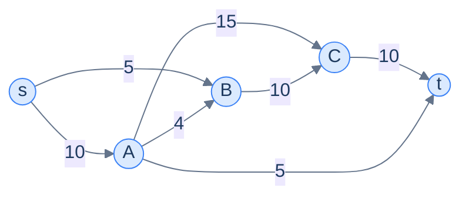
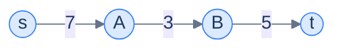
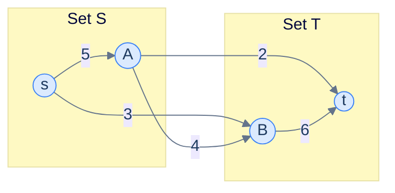
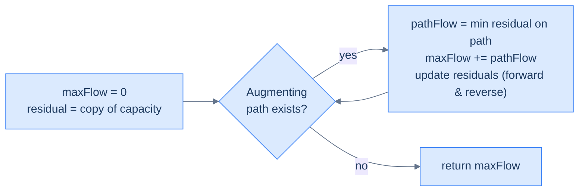
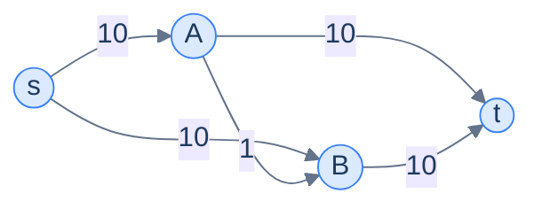

# 10. Max-flow min-cut theorem

This lesson teaches you to answer "given a network of pipes with capacities, what's the most water (or traffic, or data, or merchandise) we can push through it?" — and reveals the deep, beautiful theorem that links the answer to the **weakest link** in the network.

## Table of contents

1. [The maximum flow problem](#the-maximum-flow-problem)
2. [Three pieces of vocabulary](#three-pieces-of-vocabulary)
3. [The max-flow min-cut theorem](#the-max-flow-min-cut-theorem)
4. [The Ford-Fulkerson method](#the-ford-fulkerson-method)
5. [Why we need reverse edges](#why-we-need-reverse-edges)
6. [Implementation](#implementation)

***

# The Maximum Flow Problem

Take any directed graph where each edge carries a **capacity** — a maximum amount it can transmit. Pick a **source** node `s` and a **sink** node `t`. The question:

> *What is the maximum amount of "stuff" you can push from `s` to `t`* — given that no edge can carry more than its capacity, and that no node (other than `s` and `t`) can hoard or invent stuff (everything coming in must go out)?

That last rule is **conservation of flow**: an internal node is a junction, not a tank.



<p align="center"><strong>A flow network. Each edge label is the maximum capacity. Find the maximum amount that can flow from <code>s</code> to <code>t</code> obeying capacities and conservation.</strong></p>

This pattern shows up in surprisingly many places:

- **Road networks.** Edges = roads, capacities = lanes × speed limit. Maximum flow = peak traffic that can move through the network.
- **Heating systems.** Edges = pipes, capacities = pipe diameters. Maximum flow = peak water deliverable to all houses.
- **Data centres.** Edges = network cables, capacities = bandwidth. Maximum flow = bytes/sec deliverable from server to client.
- **Logistics.** Edges = trucking routes, capacities = trucks × payload. Maximum flow = goods/day deliverable.
- **Bipartite matching.** A surprising one — you can solve "match every applicant to a job" by reducing it to max-flow. We'll cover that in the next lesson.

> *Before reading on — for the network above, what's the answer? Try to push flow by hand and see what the maximum total turns out to be. Spend 60 seconds before scrolling.*

The answer is 15. There are several ways to achieve it; one is `s → A → C → t` (flow 10) plus `s → A → t` (flow 5) plus `s → B → C → t` (flow 5), but the last would require routing around the bottleneck — and the actual max stops at 15 because of capacity constraints on edges into `t`. The maximum flow is hard to pin down by inspection — and that's the point of the algorithm we'll learn.

***

# Three Pieces of Vocabulary

Before we attack the algorithm, we need three concepts that everyone in the field uses interchangeably with their abbreviations.

---

## 1. Residual Graph

When some flow has already been pushed through the network, each edge has *less remaining capacity* than its original. The **residual graph** is the same network but each edge's weight is its **remaining (unused) capacity**.

```d2
direction: right

orig: "Original capacity" {
  grid-rows: 1
  grid-columns: 1
  grid-gap: 0
  e: "u → v: cap = 10"
}

flow: "Push flow 6 along u → v" {
  grid-rows: 1
  grid-columns: 1
  grid-gap: 0
  e: "flow now uses 6 of 10"
}

resid: "Residual graph" {
  grid-rows: 2
  grid-columns: 1
  grid-gap: 0
  e1: "u → v: residual = 10 - 6 = 4"
  e2: "v → u: residual = 6 (REVERSE edge!)"
}

orig -> flow -> resid
```

<p align="center"><strong>Pushing flow updates the residual graph. The forward edge loses capacity equal to the flow; a reverse edge appears (or grows) carrying capacity equal to the flow.</strong></p>

The **reverse edge** is the bit that surprises everyone. We'll dedicate a section to why it matters — but the mechanical rule is simple: every time you push flow `f` along `u → v`, decrease the forward edge's residual by `f` and *increase* the reverse edge's residual by `f`.

---

## 2. Augmenting Path

An **augmenting path** in the residual graph is any simple `s → … → t` path where every edge has *positive remaining capacity*. The amount of flow you can push along an augmenting path is the **minimum residual capacity** of any edge on it (the bottleneck).



<p align="center"><strong>Augmenting path <code>s → A → B → t</code> with residual capacities 7, 3, 5. The bottleneck is 3, so 3 units can be pushed along this path.</strong></p>

If we push 3 units along this path, the residuals become 4, 0, 2. Edge `A → B` is now saturated and can't carry any more flow.

---

## 3. Cut

A **cut** `(S, T)` partitions the graph's nodes into two sets — `S` containing the source, `T` containing the sink — such that any edge from `S` to `T` is "crossed" by the cut.

The **capacity of a cut** is the sum of capacities of all edges going *from* `S` *to* `T` (reverse-direction edges don't count).



<p align="center"><strong>Cut <code>(S, T)</code> with <code>S = {s, A}</code>, <code>T = {B, t}</code>. Edges crossing the cut left-to-right: <code>s→B (3)</code>, <code>A→B (4)</code>, <code>A→t (2)</code>. Capacity of this cut = 3 + 4 + 2 = 9.</strong></p>

A graph has many possible cuts. Each one represents a possible "wall" separating source from sink — and the capacity of that cut is the maximum amount of flow that can ever cross it. The smallest such wall is therefore the **bottleneck of the entire network**.

***

# The Max-Flow Min-Cut Theorem

> **Theorem.** In any flow network, the **maximum flow** from source to sink equals the **minimum capacity of any cut** separating them.

In symbols:

```
max flow = min cut capacity
```

This is one of the most beautiful results in graph theory. It says: *"the most you can push is exactly limited by your weakest wall."* Intuitive in retrospect, dazzling at first encounter.

> *Before reading on — read the theorem twice. Why must max-flow ≤ min-cut be obvious? Why is the equality much harder?*

The "≤" direction is easy: every flow must cross every cut, so it can't exceed any cut's capacity (and certainly not the min). The "≥" direction is the surprise — it says we can *always* find a flow as big as the min cut. Why aren't there gaps?

## The Proof in One Paragraph

Suppose the max flow `f_max` has no augmenting path in its residual graph (otherwise we could push more flow and `f_max` wasn't max). Define `S` as all nodes reachable from `s` in the residual graph and `T` as the rest. Source ∈ `S`; sink ∈ `T` (sink unreachable in the residual graph by assumption). Now look at every edge `u → v` with `u ∈ S, v ∈ T` in the original graph: it must be saturated (zero residual) — otherwise `v` would be reachable from `s`. So all `S → T` edges are full. The total flow is the total capacity of the `(S, T)` cut. Hence `f_max = capacity(S, T) ≥ min cut`. Combined with the easy direction, equality. ∎

The corollary that drives every max-flow algorithm:

> **A flow is maximum if and only if no augmenting path exists in its residual graph.**

This gives us the algorithmic recipe: **keep finding augmenting paths and pushing flow until you can't**. That's exactly Ford-Fulkerson.

***

# The Ford-Fulkerson Method

> **Repeat:** find any augmenting path in the residual graph; push as much flow along it as possible; update the residual graph; record the contribution to total flow. **Stop** when no augmenting path remains.

The word "method" (rather than "algorithm") is intentional: Ford-Fulkerson **doesn't specify** how to find the augmenting path. You can use DFS (any path will do), BFS (shortest path — leads to the **Edmonds-Karp** specialisation with cleaner runtime guarantees), or anything that finds *some* path with all edges having positive residual.



<p align="center"><strong>The Ford-Fulkerson outer loop. Each iteration finds one augmenting path and squeezes the bottleneck flow out of it. Stop when the residual graph has no s–t path left.</strong></p>

***

# Why We Need Reverse Edges

The single most important — and confusing — part of Ford-Fulkerson is the **reverse edge**. When we push flow `f` along `u → v`, we add (or grow) a residual edge from `v` back to `u` with capacity `f`. Why?

Because the algorithm is allowed to make **mistakes early** that it can later **undo**.

Consider this graph:



Suppose DFS first finds the path `s → A → B → t` and pushes 1 unit (the `A → B` edge is the bottleneck at 1). Now `A → B` has 0 residual; total flow = 1.

Without reverse edges, DFS could next find `s → A → t` (push 9) and `s → B → t` (push 10). Total = 1 + 9 + 10 = **20**. But we pushed 1 unit through `A → B` at the start, which was wasteful — the *true* max flow is 20, but it requires us to *not* use `A → B`.

Now suppose DFS first picked the bad path and got stuck. With reverse edges:

- After `s → A → B → t (1)`, the residual graph has a reverse edge `B → A` with capacity 1.
- DFS finds `s → B → A → t` (using the reverse edge). Bottleneck = 1. Push 1.
- This effectively *cancels* the original flow through `A → B` — flow on `A → B` is back to 0, while we've "rerouted" through `s → B → A → t` instead.
- Total: 2 units flow = 1 (s→A→B→t) + 1 (s→B→A→t). The 1 on `A→B` and 1 on `B→A` cancel, leaving 0 on `A→B` and 1 unit `s→B→...→t` and 1 unit `s→...→A→t`. (This is what the maths says.)
- DFS keeps finding paths until done. Final answer: 20.

> **The reverse-edge insight.** Reverse edges let the algorithm *undo* a poor early choice. They convert Ford-Fulkerson from "greedy and wrong" into "explorative and provably optimal".

Without reverse edges, you'd have to be clever about which augmenting path to choose; with them, you can pick *any* path each iteration and the algorithm still converges to the maximum.

***

# Implementation

We use a **2D residual matrix** `residual[u][v]` instead of an adjacency list — it makes adding reverse edges and updating residuals trivial (just two cell updates per edge per push). For each iteration we DFS from source to sink, find the path's bottleneck, and update.

The graph is given as an adjacency list of `(neighbour, capacity)` pairs.


```python run viz=graph viz-root=graph
import sys
from typing import List, Tuple, Set

class Solution:
    def dfs(
        self,
        residual_graph: List[List[int]],
        visited: Set[int],
        path: List[int],
        node: int,
        sink: int,
    ) -> bool:

        # Mark the current node as visited in the graph to avoid
        # visiting it again
        visited.add(node)

        # Add the current node to the path
        path.append(node)

        # If the current node is the sink, return true
        if node == sink:
            return True

        # Explore all neighbours of the current node
        for neighbour in range(len(residual_graph)):

            # If the neighbour is not visited and has a positive
            # capacity in the residual graph, recursively call DFS
            if (
                neighbour not in visited
                and residual_graph[node][neighbour] > 0
            ):

                # If the DFS call returns true, propagate the result
                # back to the previous call
                if self.dfs(
                    residual_graph, visited, path, neighbour, sink
                ):
                    return True

        # If no path to the sink is found, remove the current node
        # from the path
        path.pop()

        # If no path to the sink is found from this node, backtrack
        return False

    def maximum_flow(
        self, graph: List[List[Tuple[int, int]]], source: int, sink: int
    ) -> int:

        # Number of nodes in the graph
        n = len(graph)

        # If the graph is empty, return 0
        if n == 0:
            return 0

        # Create a residual graph and initialize it with the original
        # capacities
        residual_graph = [[0] * n for _ in range(n)]
        for node in range(n):
            for neighbour, capacity in graph[node]:
                residual_graph[node][neighbour] = capacity

        # Initialize the maximum flow
        max_flow = 0

        # Find augmenting paths in the residual graph using
        # Depth-First Search
        while True:

            # Create a set to keep track of visited nodes
            visited: Set[int] = set()

            # List to store the path from source to sink
            path: List[int] = []

            # If no more augmenting paths exist, break
            if not self.dfs(residual_graph, visited, path, source, sink):
                break

            # Find the minimum capacity along the augmenting path
            path_flow = sys.maxsize
            for i in range(len(path) - 1):
                u = path[i]
                v = path[i + 1]
                path_flow = min(path_flow, residual_graph[u][v])

            # Update the residual capacities and reverse edges along the
            # augmenting path
            for i in range(len(path) - 1):
                u = path[i]
                v = path[i + 1]
                residual_graph[u][v] -= path_flow
                residual_graph[v][u] += path_flow

            # Add the path flow to the maximum flow
            max_flow += path_flow

        return max_flow


# Examples from the problem statement
print(Solution().maximum_flow([[[1,1]],[[4,5]],[[1,2]],[[1,3]],[]], 0, 4))    # 1
print(Solution().maximum_flow([[[1,8],[2,10]],[],[[3,3]],[[1,2]]], 0, 1))      # 10

# Edge cases
print(Solution().maximum_flow([], 0, 0))                                        # 0
print(Solution().maximum_flow([[]], 0, 0))                                      # 0
print(Solution().maximum_flow([[[1,5]], []], 0, 1))                             # 5
print(Solution().maximum_flow([[[1,3],[2,4]],[[3,2]],[[3,3]],[]], 0, 3))        # 5
# Source equals sink
print(Solution().maximum_flow([[[1,5]], []], 0, 0))                             # 0
```

```java run viz=graph viz-root=graph
import java.util.*;

public class Main {
    static class Solution {
        private boolean dfs(
            int[][] residualGraph,
            Set<Integer> visited,
            List<Integer> path,
            int node,
            int sink
        ) {

            // Mark the current node as visited in the graph to avoid
            // visiting it again
            visited.add(node);

            // Add the current node to the path
            path.add(node);

            // If the current node is the sink, return true
            if (node == sink) {
                return true;
            }

            // Explore all neighbours of the current node
            for (
                int neighbour = 0;
                neighbour < residualGraph.length;
                ++neighbour
            ) {

                // If the neighbour is not visited and has a positive
                // capacity in the residual graph, recursively call DFS
                if (
                    !visited.contains(neighbour) &&
                    residualGraph[node][neighbour] > 0
                ) {

                    // If the DFS call returns true, propagate the result
                    // back to the previous call
                    if (dfs(residualGraph, visited, path, neighbour, sink)) {
                        return true;
                    }
                }
            }

            // If no path to the sink is found, remove the current node
            // from the path
            path.remove(path.size() - 1);

            // If no path to the sink is found from this node, backtrack
            return false;
        }

        public int maximumFlow(
            List<List<List<Integer>>> graph,
            int source,
            int sink
        ) {

            // Number of nodes in the graph
            int N = graph.size();

            // If the graph is empty, return 0
            if (N == 0) {
                return 0;
            }

            // Create a residual graph and initialize it with the original
            // capacities
            int[][] residualGraph = new int[N][N];
            for (int node = 0; node < N; ++node) {
                for (List<Integer> edge : graph.get(node)) {
                    int neighbour = edge.get(0);
                    int capacity = edge.get(1);
                    residualGraph[node][neighbour] = capacity;
                }
            }

            // Initialize the maximum flow
            int maxFlow = 0;

            // Find augmenting paths in the residual graph using
            // Depth-First Search
            while (true) {

                // Create a set to keep track of visited nodes
                Set<Integer> visited = new HashSet<>();

                // List to store the path from source to sink
                List<Integer> path = new ArrayList<>();

                // If no more augmenting paths exist, break
                if (!dfs(residualGraph, visited, path, source, sink)) {
                    break;
                }

                // Find the minimum capacity along the augmenting path
                int pathFlow = Integer.MAX_VALUE;
                for (int i = 0; i < path.size() - 1; ++i) {
                    int u = path.get(i);
                    int v = path.get(i + 1);
                    pathFlow = Math.min(pathFlow, residualGraph[u][v]);
                }

                // Update the residual capacities and reverse edges along the
                // augmenting path
                for (int i = 0; i < path.size() - 1; ++i) {
                    int u = path.get(i);
                    int v = path.get(i + 1);
                    residualGraph[u][v] -= pathFlow;
                    residualGraph[v][u] += pathFlow;
                }

                // Add the path flow to the maximum flow
                maxFlow += pathFlow;
            }

            return maxFlow;
        }
    }

    public static void main(String[] args) {
        Solution sol = new Solution();

        // Examples from the problem statement
        System.out.println(sol.maximumFlow(List.of(List.of(List.of(1,1)), List.of(List.of(4,5)), List.of(List.of(1,2)), List.of(List.of(1,3)), new ArrayList<>()), 0, 4));  // 1
        System.out.println(sol.maximumFlow(List.of(List.of(List.of(1,8), List.of(2,10)), new ArrayList<>(), List.of(List.of(3,3)), List.of(List.of(1,2))), 0, 1));  // 10

        // Edge cases
        System.out.println(sol.maximumFlow(new ArrayList<>(), 0, 0));  // 0
        System.out.println(sol.maximumFlow(List.of(new ArrayList<>()), 0, 0));  // 0
        System.out.println(sol.maximumFlow(List.of(List.of(List.of(1,5)), new ArrayList<>()), 0, 1));  // 5
        System.out.println(sol.maximumFlow(List.of(List.of(List.of(1,3), List.of(2,4)), List.of(List.of(3,2)), List.of(List.of(3,3)), new ArrayList<>()), 0, 3));  // 5
        // Source equals sink
        System.out.println(sol.maximumFlow(List.of(List.of(List.of(1,5)), new ArrayList<>()), 0, 0));  // 0
    }
}
```


## Complexity Analysis

| | Complexity | Reasoning |
|---|---|---|
| **Time** | O(E × max_flow) | Each augmenting path adds at least 1 to the flow; finding a path costs O(E) |
| **Space** | O(N²) | The residual matrix |

The worst-case time is *pathological*: if the algorithm picks bad augmenting paths, it can take as many iterations as the *value* of the max flow — exponential in the number of edges in the worst case. **Edmonds-Karp** (Ford-Fulkerson with BFS for path-finding) fixes this — its bound is O(V × E²), polynomial regardless of capacity values. In practice, both are fast for small networks.

---

## Final Takeaway

The max-flow / min-cut duality is one of the deepest ideas in graph theory: *the most you can push equals the weakest wall*. Ford-Fulkerson turns the theorem into an algorithm by greedily filling augmenting paths and using **reverse edges** to undo any earlier wrong turns. The result is correct *no matter which augmenting path you pick* — a rare property that makes the algorithm both elegant and forgiving.

Once you have max-flow, a startling number of seemingly unrelated problems collapse into it. The next lesson covers the most famous one: **bipartite matching** — assigning workers to jobs, students to schools, content to viewers — solved by reducing it to a max-flow problem with capacity 1 on every edge.

> **Transfer challenge.** A scheduling system has 5 servers, each with a CPU capacity. 8 jobs arrive, each with a CPU requirement. Each job can run on a subset of servers (compatibility list). Sketch how to model "what's the maximum number of jobs we can schedule?" as a max-flow problem.

<details>
<summary><strong>Sketch</strong></summary>

Build a graph with:
- A source `s`.
- One node per job; edge from `s` to each job-node with capacity = job's CPU requirement.
- One node per server; edge from each server-node to a sink `t` with capacity = server's CPU capacity.
- For each (job, compatible server) pair: edge from job-node to server-node with capacity = job's CPU requirement.

Run Ford-Fulkerson from `s` to `t`. The max-flow equals the maximum CPU-weighted job throughput. The "what assignment?" answer is read off the saturated edges in the residual graph.

This is one of dozens of problems where max-flow shows up disguised as something else.

</details>

<!-- ============================================== -->
<!-- SWEEP 2 — missing sections (placeholders only) -->
<!-- ============================================== -->

<!-- TODO: The Hook — missing, needs to be written -->
<!--       Guidance: real-world story opening before any definition -->

<!-- TODO: Understanding the Problem — missing, needs to be written -->
<!--       Guidance: frame the gap the structure/algorithm fills -->

<!-- TODO: Supported Operations — missing, needs to be written -->
<!--       Guidance: table: operation / time / notes -->

<!-- TODO: Internal Mechanics — missing, needs to be written -->
<!--       Guidance: how it actually works under the hood -->

<!-- TODO: Working Example — missing, needs to be written -->
<!--       Guidance: one fully worked end-to-end example -->

<!-- TODO: Edge Cases & Pitfalls — missing, needs to be written -->
<!--       Guidance: bulleted list of gotchas -->

<!-- TODO: Production Reality — missing, needs to be written -->
<!--       Guidance: 4–6 entries: System — uses X — because Y -->

<!-- TODO: Quiz — missing, needs to be written -->
<!--       Guidance: 3–5 questions, each labeled [Recall]/[Reasoning]/[Tradeoff] -->

<!-- TODO: Practice Ladder — missing, needs to be written -->
<!--       Guidance: table: 5 links into pattern problems + hints -->

<!-- TODO: Further Reading — missing, needs to be written -->
<!--       Guidance: annotated: ★ Essential / ◆ Advanced / → Reference -->

<!-- TODO: Cross-Links — missing, needs to be written -->
<!--       Guidance: Prerequisites | What comes next -->
