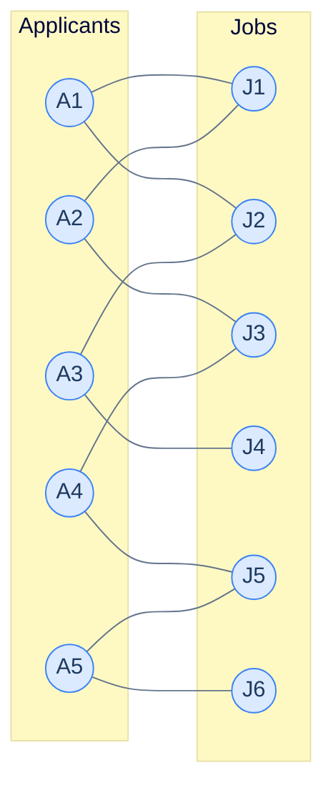
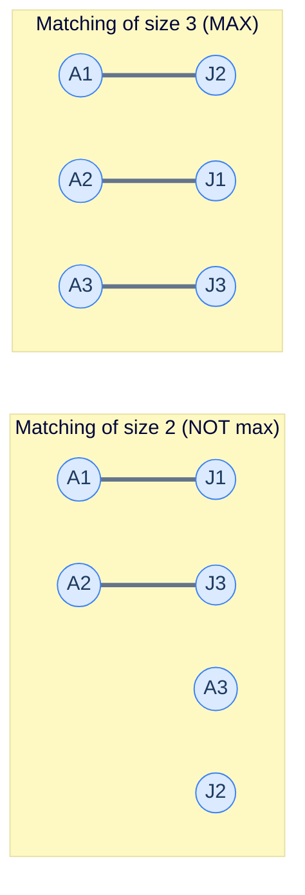
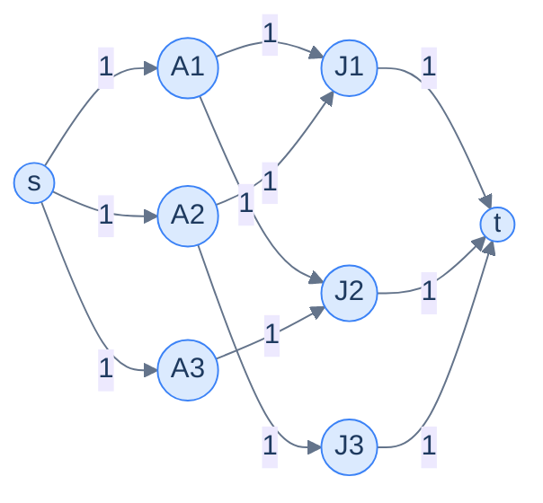

# 11. Maximum bipartite matching

This lesson teaches you to solve the **assignment problem** — match workers to jobs, students to schools, taxis to riders — using a strikingly elegant trick: convert the problem into a max-flow problem and let the algorithm from the last lesson do the work.

## Table of contents

1. [The matching problem](#the-matching-problem)
2. [What "matching" really means](#what-matching-really-means)
3. [Real-world applications](#real-world-applications)
4. [The trick — turn it into max-flow](#the-trick--turn-it-into-max-flow)
5. [Implementation](#implementation)

***

# The Matching Problem

You have **5 job applicants** and **6 open jobs**. Some applicants are qualified for some jobs (and not others). Each applicant can take *at most one* job. Each job can be filled by *at most one* applicant.

> **Question.** What's the maximum number of applicants that can land a qualifying job?



<p align="center"><strong>5 applicants, 6 jobs, edges = qualifications. Find the maximum number of applicants that can be assigned to jobs such that no applicant takes two jobs and no job has two applicants.</strong></p>

The catch: pick the wrong assignments early and you'll *block* better ones. If A1 takes J1, then A2 can only take J3, then A4 must take J5, leaving A5 with only J6 — that's 4 matches. But assign A2 to J1 first, A1 takes J2, A3 takes J4, A4 takes J3, A5 takes J5 → 5 matches. Same graph, different choices, different totals. **Greedy alone doesn't work.**

The good news: a beautiful, *proven-optimal* algorithm exists — and it doesn't require a new technique. It's max-flow in disguise.

***

# What "Matching" Really Means

A graph is **bipartite** when its nodes split into two disjoint sets `L` and `R` such that every edge connects an `L`-node to an `R`-node — never `L`-to-`L` or `R`-to-`R`.

A **matching** in a bipartite graph is a subset of edges such that *no node has more than one edge in the subset*. The **size** (or *cardinality*) of a matching is the number of edges in it.

A **maximum matching** is a matching with the largest possible cardinality.



<p align="center"><strong>Two valid matchings on the same 3-applicant, 3-job graph. The right one has more edges (3 vs 2) and uses every node — that's a perfect matching.</strong></p>

A **perfect matching** is a maximum matching that covers *every* node on the smaller side. Not every bipartite graph admits a perfect matching, but every bipartite graph has *some* maximum matching, and that's what we'll find.

> *Before reading on — for a graph with 4 applicants and 5 jobs, what's the largest possible matching size? Could we ever match more applicants than there are applicants?*

The matching size is bounded by `min(|L|, |R|)` — neither side can contribute more edges than nodes. So with 4 applicants and 5 jobs, you'll never beat 4. (And with 4 applicants and 3 jobs, never beat 3.)

***

# Real-World Applications

The "match these to those" pattern shows up everywhere.

## College admissions

Students each list a few colleges they want to apply to. Each college has a fixed number of seats. Maximum bipartite matching answers: how many students can be admitted to a college on their list?

(In real life this is *weighted* and ranked — for that you'd use the **Gale-Shapley** algorithm — but if all assignments are equally good, it's pure max matching.)

## Taxi dispatch

A ride-share app has dozens of pending requests and hundreds of drivers in range. Each (rider, driver) pair has a compatibility (distance < threshold, vehicle type, language). The dispatcher wants to maximise the number of riders served *right now*. That's bipartite matching.

## Network scheduling

Schedule packets to be sent on output ports of a switch. Each packet has compatible ports; each port can transmit one packet per cycle. Max packets per cycle = max bipartite matching.

## DNA sequence alignment

Pair up reads in two batches based on overlap quality. Bipartite matching finds the largest non-conflicting set of pairings.

## Interview round-robin

Pair candidates with interviewers given availability constraints. Same idea.

The list goes on. **Whenever you have two pools and an "is compatible" relation, with the goal of maximising disjoint assignments, you're looking at maximum bipartite matching.**

***

# The Trick — Turn It Into Max-Flow

Here's the elegant move:

> **Add a source `s` connected to every L-node with edges of capacity 1.**
> **Add a sink `t` connected from every R-node with edges of capacity 1.**
> **Direct every original L-R edge from L to R, with capacity 1.**
> **Run max-flow from `s` to `t`. The answer equals the maximum matching size.**



<p align="center"><strong>The bipartite graph turned into a flow network. Every edge has capacity 1. Max-flow from <code>s</code> to <code>t</code> = max matching.</strong></p>

## Why It Works

Walk through the logic:

1. Each unit of flow leaves `s` through *exactly one* L-node (capacity 1 between `s` and each L-node).
2. That unit crosses to *exactly one* R-node (each L-R edge has capacity 1).
3. That unit enters `t` through that R-node and *only* that R-node (each R-`t` edge has capacity 1).

Each unit of flow corresponds to a path `s → L_i → R_j → t` — i.e., a single assignment of applicant `L_i` to job `R_j`. Because the capacity-1 constraint guarantees no two units share the same L-node or R-node, every flow unit is a distinct, non-conflicting assignment. The total flow is therefore the size of the matching.

Maximum flow = maximum matching. ✓

The Ford-Fulkerson method's reverse edges turn out to be the secret sauce here too — they let the algorithm "unmatch" an early assignment when a better one becomes available, just like in the bare max-flow problem. That's how it avoids the greedy trap that defeats naive approaches.

> *Before reading on — verify intuitively: the source-side capacity-1 edges enforce "each applicant has at most one job". Which capacity edges enforce "each job has at most one applicant"?*

The sink-side edges. Each R-`t` edge has capacity 1, so at most 1 unit of flow can enter `t` through any given R-node. That's exactly "each job is filled by at most one applicant". The capacity-1 constraint on every edge is *the entire encoding* of the matching rules — beautifully tight.

***

# Implementation

We build the flow network on top of the input bipartite graph and reuse the Ford-Fulkerson `maximum_flow` code from the previous lesson verbatim. The implementation is concise — the heavy lifting was already done.

The input is given as:
- `graph[i]` — list of jobs applicant `i` is qualified for.
- `left` — list of applicant node IDs.
- `right` — list of job node IDs.

`maximum_bipartite_matching` copies the original edges into a `flow_graph` adjacency list of `(neighbour, capacity)` pairs (every capacity is 1 — the matching constraint), appends 2 new nodes (source and sink), wires the source to every `left` node and every `right` node to the sink, then hands the whole network to `maximum_flow`.


```python run viz=graph viz-root=graph
import sys
from typing import List, Tuple, Set

class Solution:
    def dfs(
        self,
        residual_graph: List[List[int]],
        visited: Set[int],
        path: List[int],
        node: int,
        sink: int,
    ) -> bool:

        # Mark the current node as visited in the graph to avoid
        # visiting it again
        visited.add(node)

        # Add the current node to the path
        path.append(node)

        # If the current node is the sink, return true
        if node == sink:
            return True

        # Explore all neighbours of the current node
        for neighbour in range(len(residual_graph)):

            # If the neighbour is not visited and has a positive
            # capacity in the residual graph, recursively call DFS
            if (
                neighbour not in visited
                and residual_graph[node][neighbour] > 0
            ):

                # If the DFS call returns true, propagate the result
                # back to the previous call
                if self.dfs(
                    residual_graph, visited, path, neighbour, sink
                ):
                    return True

        # If no path to the sink is found, remove the current node
        # from the path
        path.pop()

        # If no path to the sink is found from this node, backtrack
        return False

    def maximum_flow(
        self, graph: List[List[Tuple[int, int]]], source: int, sink: int
    ) -> int:

        # Number of nodes in the graph
        n = len(graph)

        # If the graph is empty, return 0
        if n == 0:
            return 0

        # Create a residual graph and initialize it with the original
        # capacities
        residual_graph = [[0] * n for _ in range(n)]
        for node in range(n):
            for neighbour, capacity in graph[node]:
                residual_graph[node][neighbour] = capacity

        # Initialize the maximum flow
        max_flow = 0

        # Find augmenting paths in the residual graph using
        # Depth-First Search
        while True:

            # Create a set to keep track of visited nodes
            visited: Set[int] = set()

            # List to store the path from source to sink
            path: List[int] = []

            # If no more augmenting paths exist, break
            if not self.dfs(residual_graph, visited, path, source, sink):
                break

            # Find the minimum capacity along the augmenting path
            path_flow = sys.maxsize
            for i in range(len(path) - 1):
                u = path[i]
                v = path[i + 1]
                path_flow = min(path_flow, residual_graph[u][v])

            # Update the residual capacities and reverse edges along the
            # augmenting path
            for i in range(len(path) - 1):
                u = path[i]
                v = path[i + 1]
                residual_graph[u][v] -= path_flow
                residual_graph[v][u] += path_flow

            # Add the path flow to the maximum flow
            max_flow += path_flow

        return max_flow

    def maximum_bipartite_matching(
        self, graph: List[List[int]], left: List[int], right: List[int]
    ) -> int:
        flow_graph: List[List[Tuple[int, int]]] = [
            [] for _ in range(len(graph))
        ]

        # Copy the connections from the input graph to the flow graph
        # with capacity 1
        for node in range(len(graph)):
            for neighbour in graph[node]:
                flow_graph[node].append((neighbour, 1))

        # Get the index of the source node
        source = len(flow_graph)

        # Add the source node to the flow graph
        flow_graph.append([])

        # Connect the source node to all nodes in the left partition with
        # capacity 1
        for node in left:
            flow_graph[source].append((node, 1))

        # Get the index of the sink node
        sink = len(flow_graph)

        # Add the sink node to the flow graph
        flow_graph.append([])

        # Connect all nodes in the right partition to the sink node with
        # capacity 1
        for node in right:
            flow_graph[node].append((sink, 1))

        # Call the Ford-Fulkerson maximum flow function to compute the
        # result
        return self.maximum_flow(flow_graph, source, sink)


# Examples from the problem statement
print(Solution().maximum_bipartite_matching([[4],[5],[6],[7],[0],[1],[2],[3]], [0,1,2,3], [4,5,6,7]))  # 4
print(Solution().maximum_bipartite_matching([[4,5],[5],[6],[4,6],[0,3],[0,1],[2,3],[]], [0,1,2,3], [4,5,6,7]))  # 3

# Edge cases
print(Solution().maximum_bipartite_matching([], [], []))          # 0
print(Solution().maximum_bipartite_matching([[1],[]], [0], [1]))   # 1
print(Solution().maximum_bipartite_matching([[],[]], [0], [1]))    # 0
# Two left, one right — max 1
print(Solution().maximum_bipartite_matching([[2],[2],[0,1]], [0,1], [2]))  # 1
```

```java run
import java.util.*;

public class Main {
    static class Solution {
        private boolean dfs(
            int[][] residualGraph,
            Set<Integer> visited,
            List<Integer> path,
            int node,
            int sink
        ) {

            // Mark the current node as visited in the graph to avoid
            // visiting it again
            visited.add(node);

            // Add the current node to the path
            path.add(node);

            // If the current node is the sink, return true
            if (node == sink) {
                return true;
            }

            // Explore all neighbours of the current node
            for (
                int neighbour = 0;
                neighbour < residualGraph.length;
                ++neighbour
            ) {

                // If the neighbour is not visited and has a positive
                // capacity in the residual graph, recursively call DFS
                if (
                    !visited.contains(neighbour) &&
                    residualGraph[node][neighbour] > 0
                ) {

                    // If the DFS call returns true, propagate the result
                    // back to the previous call
                    if (dfs(residualGraph, visited, path, neighbour, sink)) {
                        return true;
                    }
                }
            }

            // If no path to the sink is found, remove the current node
            // from the path
            path.remove(path.size() - 1);

            // If no path to the sink is found from this node, backtrack
            return false;
        }

        private int maximumFlow(
            List<List<List<Integer>>> graph,
            int source,
            int sink
        ) {

            // Number of nodes in the graph
            int N = graph.size();

            // If the graph is empty, return 0
            if (N == 0) {
                return 0;
            }

            // Create a residual graph and initialize it with the original
            // capacities
            int[][] residualGraph = new int[N][N];
            for (int node = 0; node < N; ++node) {
                for (List<Integer> edge : graph.get(node)) {
                    int neighbour = edge.get(0);
                    int capacity = edge.get(1);
                    residualGraph[node][neighbour] = capacity;
                }
            }

            // Initialize the maximum flow
            int maxFlow = 0;

            // Find augmenting paths in the residual graph using
            // Depth-First Search
            while (true) {

                // Create a set to keep track of visited nodes
                Set<Integer> visited = new HashSet<>();

                // List to store the path from source to sink
                List<Integer> path = new ArrayList<>();

                // If no more augmenting paths exist, break
                if (!dfs(residualGraph, visited, path, source, sink)) {
                    break;
                }

                // Find the minimum capacity along the augmenting path
                int pathFlow = Integer.MAX_VALUE;
                for (int i = 0; i < path.size() - 1; ++i) {
                    int u = path.get(i);
                    int v = path.get(i + 1);
                    pathFlow = Math.min(pathFlow, residualGraph[u][v]);
                }

                // Update the residual capacities and reverse edges along the
                // augmenting path
                for (int i = 0; i < path.size() - 1; ++i) {
                    int u = path.get(i);
                    int v = path.get(i + 1);
                    residualGraph[u][v] -= pathFlow;
                    residualGraph[v][u] += pathFlow;
                }

                // Add the path flow to the maximum flow
                maxFlow += pathFlow;
            }

            return maxFlow;
        }

        public int maximumBipartiteMatching(
            List<List<Integer>> graph,
            List<Integer> left,
            List<Integer> right
        ) {
            List<List<List<Integer>>> flowGraph = new ArrayList<>();

            for (int i = 0; i < graph.size(); ++i) {
                flowGraph.add(new ArrayList<>());
            }

            // Copy the connections from the input graph to the flow graph
            // with capacity 1
            for (int node = 0; node < graph.size(); ++node) {
                for (int neighbour : graph.get(node)) {
                    flowGraph.get(node).add(List.of(neighbour, 1));
                }
            }

            // Get the index of the source node
            int source = flowGraph.size();

            // Add the source node to the flow graph
            flowGraph.add(new ArrayList<>());

            // Connect the source node to all nodes in the left partition
            // with capacity 1
            for (int node : left) {
                flowGraph.get(source).add(List.of(node, 1));
            }

            // Get the index of the sink node
            int sink = flowGraph.size();

            // Add the sink node to the flow graph
            flowGraph.add(new ArrayList<>());

            // Connect all nodes in the right partition
            // to the sink node with capacity 1
            for (int node : right) {
                flowGraph.get(node).add(List.of(sink, 1));
            }

            // Call the Ford-Fulkerson maximum flow function to compute the
            // result
            return maximumFlow(flowGraph, source, sink);
        }
    }

    public static void main(String[] args) {
        Solution sol = new Solution();

        // Examples from the problem statement
        System.out.println(sol.maximumBipartiteMatching(
            List.of(List.of(4),List.of(5),List.of(6),List.of(7),List.of(0),List.of(1),List.of(2),List.of(3)),
            List.of(0,1,2,3), List.of(4,5,6,7)));  // 4
        System.out.println(sol.maximumBipartiteMatching(
            List.of(List.of(4,5),List.of(5),List.of(6),List.of(4,6),List.of(0,3),List.of(0,1),List.of(2,3),new ArrayList<>()),
            List.of(0,1,2,3), List.of(4,5,6,7)));  // 3

        // Edge cases
        System.out.println(sol.maximumBipartiteMatching(new ArrayList<>(), new ArrayList<>(), new ArrayList<>()));  // 0
        System.out.println(sol.maximumBipartiteMatching(List.of(List.of(1), new ArrayList<>()), List.of(0), List.of(1)));  // 1
        System.out.println(sol.maximumBipartiteMatching(List.of(new ArrayList<>(), new ArrayList<>()), List.of(0), List.of(1)));  // 0
        // Two left, one right — max 1
        System.out.println(sol.maximumBipartiteMatching(List.of(List.of(2), List.of(2), List.of(0,1)), List.of(0,1), List.of(2)));  // 1
    }
}
```


## Complexity Analysis

| | Complexity | Reasoning |
|---|---|---|
| **Time** | O(V × E) | Each augmenting path adds 1 to the flow (capacity-1 edges); flow ≤ min(L, R) ≤ V; each DFS is O(V + E) |
| **Space** | O(V²) | The residual matrix |

The capacity-1 trick is what makes this fast: max-flow on a general graph can be exponential in the worst case, but on a unit-capacity bipartite graph it's polynomial — at most `min(|L|, |R|)` augmenting paths. **Hopcroft-Karp** is a specialised algorithm that does it in O(E × √V), faster still.

---

## Final Takeaway

Maximum bipartite matching is the canonical example of **algorithmic reduction** — taking a problem from one domain (matching) and recasting it as a problem in another (max-flow). Reductions are an enormously powerful technique: rather than invent a new algorithm for every new problem, you find a known shape under the surface and let an existing algorithm do the work.

The reduction we just used — `add s, add t, all edges capacity 1` — is one of the most common in algorithm design. You'll see it again in:

- **Vertex cover and independent set** in bipartite graphs (König's theorem).
- **Edge-disjoint path counting**.
- **Project selection** (maximum-weight closure).
- **Image segmentation** (foreground/background separation).

The pattern to memorise:

> Whenever you need to pair items from two pools subject to compatibility and capacity-1 limits — **build the flow network and run max-flow**.

The graph chapter from here on continues with **patterns** — recurring problem shapes (DFS-pattern, connected-components, two-colouring, BFS-shortest-path, Dijkstra-pattern) that wrap the algorithms you've learned into ready-to-deploy templates for interview-style problems.

> **Transfer challenge.** A school's chess club has 5 students and a 4-board team match next week. Each student is willing to play on a subset of the boards (some refuse to play board 1, some only know openings for board 2, etc.). The coach wants to send the maximum number of students to the match. Set up the bipartite graph, then explain in one sentence how the answer follows from running max-flow.

<details>
<summary><strong>Sketch</strong></summary>

L = students, R = boards. Edge `(student, board)` if the student is willing to play that board. Add `s` connected to every student (cap 1). Add `t` connected from every board (cap 1). Every L-R edge gets cap 1. Max-flow from `s` to `t` = number of students that can be assigned to a board they accept = answer.

This is identical to the applicants-and-jobs example with smaller numbers. The reduction is universal.

</details>

<!-- ============================================== -->
<!-- SWEEP 2 — missing sections (placeholders only) -->
<!-- ============================================== -->

<!-- TODO: The Hook — missing, needs to be written -->
<!--       Guidance: real-world story opening before any definition -->

<!-- TODO: Understanding the Problem — missing, needs to be written -->
<!--       Guidance: frame the gap the structure/algorithm fills -->

<!-- TODO: Supported Operations — missing, needs to be written -->
<!--       Guidance: table: operation / time / notes -->

<!-- TODO: Internal Mechanics — missing, needs to be written -->
<!--       Guidance: how it actually works under the hood -->

<!-- TODO: Working Example — missing, needs to be written -->
<!--       Guidance: one fully worked end-to-end example -->

<!-- TODO: Edge Cases & Pitfalls — missing, needs to be written -->
<!--       Guidance: bulleted list of gotchas -->

<!-- TODO: Production Reality — missing, needs to be written -->
<!--       Guidance: 4–6 entries: System — uses X — because Y -->

<!-- TODO: Quiz — missing, needs to be written -->
<!--       Guidance: 3–5 questions, each labeled [Recall]/[Reasoning]/[Tradeoff] -->

<!-- TODO: Practice Ladder — missing, needs to be written -->
<!--       Guidance: table: 5 links into pattern problems + hints -->

<!-- TODO: Further Reading — missing, needs to be written -->
<!--       Guidance: annotated: ★ Essential / ◆ Advanced / → Reference -->

<!-- TODO: Cross-Links — missing, needs to be written -->
<!--       Guidance: Prerequisites | What comes next -->
