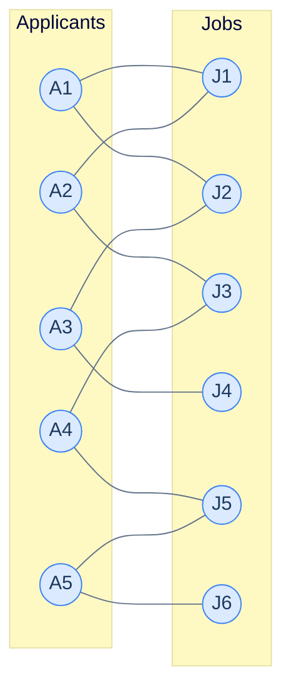
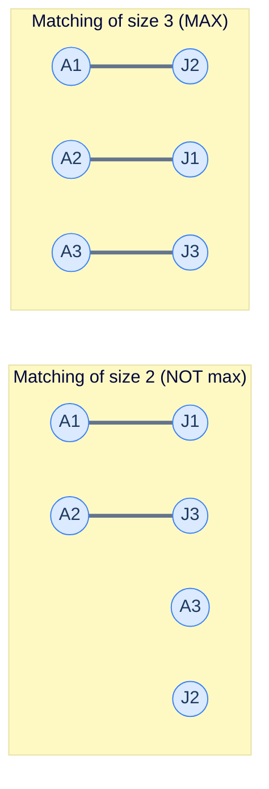
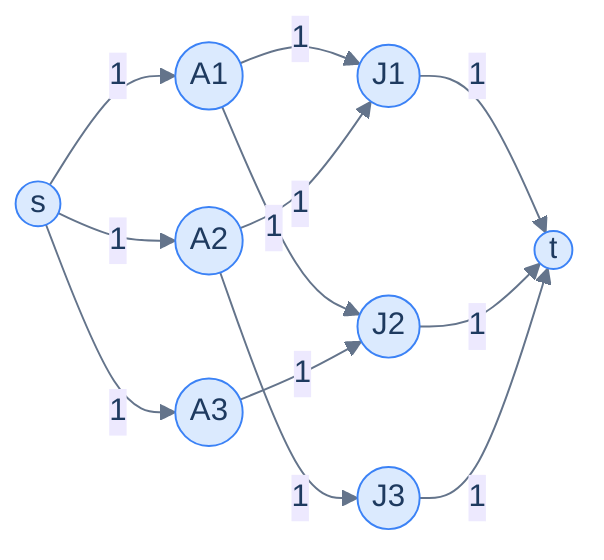

# 11. Maximum bipartite matching

This lesson teaches you to solve the **assignment problem** — match workers to jobs, students to schools, taxis to riders — using a strikingly elegant trick: convert the problem into a max-flow problem and let the algorithm from the last lesson do the work.

## Table of contents

1. [The matching problem](#the-matching-problem)
2. [What "matching" really means](#what-matching-really-means)
3. [Real-world applications](#real-world-applications)
4. [The trick — turn it into max-flow](#the-trick--turn-it-into-max-flow)
5. [Implementation](#implementation)

***

# The Matching Problem

You have **5 job applicants** and **6 open jobs**. Some applicants are qualified for some jobs (and not others). Each applicant can take *at most one* job. Each job can be filled by *at most one* applicant.

> **Question.** What's the maximum number of applicants that can land a qualifying job?



<p align="center"><strong>5 applicants, 6 jobs, edges = qualifications. Find the maximum number of applicants that can be assigned to jobs such that no applicant takes two jobs and no job has two applicants.</strong></p>

The catch: pick the wrong assignments early and you'll *block* better ones. If A1 takes J1, then A2 can only take J3, then A4 must take J5, leaving A5 with only J6 — that's 4 matches. But assign A2 to J1 first, A1 takes J2, A3 takes J4, A4 takes J3, A5 takes J5 → 5 matches. Same graph, different choices, different totals. **Greedy alone doesn't work.**

The good news: a beautiful, *proven-optimal* algorithm exists — and it doesn't require a new technique. It's max-flow in disguise.

***

# What "Matching" Really Means

A graph is **bipartite** when its nodes split into two disjoint sets `L` and `R` such that every edge connects an `L`-node to an `R`-node — never `L`-to-`L` or `R`-to-`R`.

A **matching** in a bipartite graph is a subset of edges such that *no node has more than one edge in the subset*. The **size** (or *cardinality*) of a matching is the number of edges in it.

A **maximum matching** is a matching with the largest possible cardinality.



<p align="center"><strong>Two valid matchings on the same 3-applicant, 3-job graph. The right one has more edges (3 vs 2) and uses every node — that's a perfect matching.</strong></p>

A **perfect matching** is a maximum matching that covers *every* node on the smaller side. Not every bipartite graph admits a perfect matching, but every bipartite graph has *some* maximum matching, and that's what we'll find.

> *Before reading on — for a graph with 4 applicants and 5 jobs, what's the largest possible matching size? Could we ever match more applicants than there are applicants?*

The matching size is bounded by `min(|L|, |R|)` — neither side can contribute more edges than nodes. So with 4 applicants and 5 jobs, you'll never beat 4. (And with 4 applicants and 3 jobs, never beat 3.)

***

# Real-World Applications

The "match these to those" pattern shows up everywhere.

## College admissions

Students each list a few colleges they want to apply to. Each college has a fixed number of seats. Maximum bipartite matching answers: how many students can be admitted to a college on their list?

(In real life this is *weighted* and ranked — for that you'd use the **Gale-Shapley** algorithm — but if all assignments are equally good, it's pure max matching.)

## Taxi dispatch

A ride-share app has dozens of pending requests and hundreds of drivers in range. Each (rider, driver) pair has a compatibility (distance < threshold, vehicle type, language). The dispatcher wants to maximise the number of riders served *right now*. That's bipartite matching.

## Network scheduling

Schedule packets to be sent on output ports of a switch. Each packet has compatible ports; each port can transmit one packet per cycle. Max packets per cycle = max bipartite matching.

## DNA sequence alignment

Pair up reads in two batches based on overlap quality. Bipartite matching finds the largest non-conflicting set of pairings.

## Interview round-robin

Pair candidates with interviewers given availability constraints. Same idea.

The list goes on. **Whenever you have two pools and an "is compatible" relation, with the goal of maximising disjoint assignments, you're looking at maximum bipartite matching.**

***

# The Trick — Turn It Into Max-Flow

Here's the elegant move:

> **Add a source `s` connected to every L-node with edges of capacity 1.**
> **Add a sink `t` connected from every R-node with edges of capacity 1.**
> **Direct every original L-R edge from L to R, with capacity 1.**
> **Run max-flow from `s` to `t`. The answer equals the maximum matching size.**



<p align="center"><strong>The bipartite graph turned into a flow network. Every edge has capacity 1. Max-flow from <code>s</code> to <code>t</code> = max matching.</strong></p>

## Why It Works

Walk through the logic:

1. Each unit of flow leaves `s` through *exactly one* L-node (capacity 1 between `s` and each L-node).
2. That unit crosses to *exactly one* R-node (each L-R edge has capacity 1).
3. That unit enters `t` through that R-node and *only* that R-node (each R-`t` edge has capacity 1).

Each unit of flow corresponds to a path `s → L_i → R_j → t` — i.e., a single assignment of applicant `L_i` to job `R_j`. Because the capacity-1 constraint guarantees no two units share the same L-node or R-node, every flow unit is a distinct, non-conflicting assignment. The total flow is therefore the size of the matching.

Maximum flow = maximum matching. ✓

The Ford-Fulkerson method's reverse edges turn out to be the secret sauce here too — they let the algorithm "unmatch" an early assignment when a better one becomes available, just like in the bare max-flow problem. That's how it avoids the greedy trap that defeats naive approaches.

> *Before reading on — verify intuitively: the source-side capacity-1 edges enforce "each applicant has at most one job". Which capacity edges enforce "each job has at most one applicant"?*

The sink-side edges. Each R-`t` edge has capacity 1, so at most 1 unit of flow can enter `t` through any given R-node. That's exactly "each job is filled by at most one applicant". The capacity-1 constraint on every edge is *the entire encoding* of the matching rules — beautifully tight.

***

# Implementation

We build the flow network on top of the input bipartite graph and reuse the Ford-Fulkerson code from the previous lesson. The implementation is concise — the heavy lifting was already done.

The input is given as:
- `graph[i]` — list of jobs applicant `i` is qualified for.
- `left` — list of applicant node IDs.
- `right` — list of job node IDs.

We add 2 new nodes (source and sink) and wire them up.


```pseudocode
function fordFulkerson(residual, source, sink):
    total ← 0
    while true:
        visited ← empty set
        path ← empty list
        if NOT dfs(residual, visited, path, source, sink): break
        bottleneck ← min residual[path[i]][path[i+1]] for consecutive pairs
        for each consecutive (u, v) in path:
            residual[u][v] ← residual[u][v] − bottleneck
            residual[v][u] ← residual[v][u] + bottleneck
        total ← total + bottleneck
    return total

function maximumBipartiteMatching(graph, left, right):
    source ← N,  sink ← N+1
    residual ← (N+2)×(N+2) matrix of 0
    for u in graph:
        for v in graph[u]:
            residual[u][v] ← 1        # L → R edges, capacity 1
    for u in left:
        residual[source][u] ← 1       # source → L, capacity 1
    for v in right:
        residual[v][sink] ← 1         # R → sink, capacity 1
    return fordFulkerson(residual, source, sink)
```

```python run
from typing import List

class Solution:
    def dfs(self,
            residual: List[List[int]],
            visited: set,
            path: List[int],
            node: int,
            sink: int) -> bool:
        visited.add(node)
        path.append(node)
        if node == sink:
            return True
        for neighbour in range(len(residual)):
            if neighbour not in visited and residual[node][neighbour] > 0:
                if self.dfs(residual, visited, path, neighbour, sink):
                    return True
        path.pop()
        return False

    def ford_fulkerson(self,
                       residual: List[List[int]],
                       source: int,
                       sink: int) -> int:
        max_flow = 0
        while True:
            visited: set = set()
            path: List[int] = []
            if not self.dfs(residual, visited, path, source, sink):
                break
            path_flow = float('inf')
            for i in range(len(path) - 1):
                path_flow = min(path_flow, residual[path[i]][path[i + 1]])
            for i in range(len(path) - 1):
                residual[path[i]][path[i + 1]] -= path_flow
                residual[path[i + 1]][path[i]] += path_flow
            max_flow += path_flow
        return max_flow

    def maximum_bipartite_matching(self,
                                   graph: List[List[int]],
                                   left: List[int],
                                   right: List[int]) -> int:
        n = len(graph)
        # Add 2 new nodes: source = n, sink = n + 1.
        size = n + 2
        source, sink = n, n + 1

        # Build the residual matrix from the bipartite graph + the new s/t edges.
        # Every edge has capacity 1 — this is the matching constraint.
        residual = [[0] * size for _ in range(size)]
        for u in range(n):
            for v in graph[u]:
                residual[u][v] = 1
        for u in left:
            residual[source][u] = 1     # source → L-nodes
        for v in right:
            residual[v][sink] = 1       # R-nodes → sink

        return self.ford_fulkerson(residual, source, sink)


# 5 applicants (0..4), 6 jobs (5..10) — total 11 nodes (excluding s, t).
# Each applicant lists their qualified jobs.
graph = [
    [5, 6],            # A1 (0) qualifies for J1 (5), J2 (6)
    [5, 7],            # A2 (1) qualifies for J1 (5), J3 (7)
    [6, 8],            # A3 (2) qualifies for J2 (6), J4 (8)
    [7, 9],            # A4 (3) qualifies for J3 (7), J5 (9)
    [9, 10],           # A5 (4) qualifies for J5 (9), J6 (10)
    [], [], [], [], [], [],  # job nodes have no outgoing edges in the bipartite spec
]
left  = [0, 1, 2, 3, 4]
right = [5, 6, 7, 8, 9, 10]
print(Solution().maximum_bipartite_matching(graph, left, right))   # 5
```

```java run
import java.util.*;

public class Main {
    static class Solution {
        public boolean dfs(int[][] residual, Set<Integer> visited,
                           List<Integer> path, int node, int sink) {
            visited.add(node);
            path.add(node);
            if (node == sink) return true;
            for (int neighbour = 0; neighbour < residual.length; neighbour++) {
                if (!visited.contains(neighbour) && residual[node][neighbour] > 0) {
                    if (dfs(residual, visited, path, neighbour, sink)) return true;
                }
            }
            path.remove(path.size() - 1);
            return false;
        }

        public int fordFulkerson(int[][] residual, int source, int sink) {
            int max = 0;
            while (true) {
                Set<Integer> visited = new HashSet<>();
                List<Integer> path = new ArrayList<>();
                if (!dfs(residual, visited, path, source, sink)) break;
                int pf = Integer.MAX_VALUE;
                for (int i = 0; i < path.size() - 1; i++)
                    pf = Math.min(pf, residual[path.get(i)][path.get(i + 1)]);
                for (int i = 0; i < path.size() - 1; i++) {
                    residual[path.get(i)][path.get(i + 1)] -= pf;
                    residual[path.get(i + 1)][path.get(i)] += pf;
                }
                max += pf;
            }
            return max;
        }

        public int maximumBipartiteMatching(List<List<Integer>> graph, int[] left, int[] right) {
            int n = graph.size();
            int size = n + 2, source = n, sink = n + 1;
            int[][] residual = new int[size][size];
            for (int u = 0; u < n; u++) for (int v : graph.get(u)) residual[u][v] = 1;
            for (int u : left) residual[source][u] = 1;
            for (int v : right) residual[v][sink] = 1;
            return fordFulkerson(residual, source, sink);
        }
    }

    public static void main(String[] args) {
        List<List<Integer>> g = List.of(
            List.of(5, 6), List.of(5, 7), List.of(6, 8), List.of(7, 9), List.of(9, 10),
            List.of(), List.of(), List.of(), List.of(), List.of(), List.of());
        int[] left = {0, 1, 2, 3, 4};
        int[] right = {5, 6, 7, 8, 9, 10};
        System.out.println(new Solution().maximumBipartiteMatching(g, left, right));
    }
}
```

```c run
#include <stdio.h>
#include <stdlib.h>
#include <stdbool.h>
#include <limits.h>

typedef struct { int* data; int size; } AdjList;

static bool dfs(int** r, int n, bool* visited, int* path, int* ps, int node, int sink) {
    visited[node] = true;
    path[(*ps)++] = node;
    if (node == sink) return true;
    for (int v = 0; v < n; v++) {
        if (!visited[v] && r[node][v] > 0) {
            if (dfs(r, n, visited, path, ps, v, sink)) return true;
        }
    }
    (*ps)--;
    return false;
}

int max_bipartite(AdjList* graph, int n, int* left, int ln, int* right, int rn) {
    int size = n + 2, source = n, sink = n + 1;
    int** r = malloc(size * sizeof(int*));
    for (int i = 0; i < size; i++) r[i] = calloc(size, sizeof(int));
    for (int u = 0; u < n; u++)
        for (int j = 0; j < graph[u].size; j++)
            r[u][graph[u].data[j]] = 1;
    for (int i = 0; i < ln; i++) r[source][left[i]] = 1;
    for (int i = 0; i < rn; i++) r[right[i]][sink] = 1;

    int total = 0;
    while (true) {
        bool* visited = calloc(size, sizeof(bool));
        int* path = malloc(size * sizeof(int));
        int ps = 0;
        if (!dfs(r, size, visited, path, &ps, source, sink)) {
            free(visited); free(path); break;
        }
        int pf = INT_MAX;
        for (int i = 0; i < ps - 1; i++)
            if (r[path[i]][path[i+1]] < pf) pf = r[path[i]][path[i+1]];
        for (int i = 0; i < ps - 1; i++) {
            r[path[i]][path[i+1]] -= pf;
            r[path[i+1]][path[i]] += pf;
        }
        total += pf;
        free(visited); free(path);
    }
    for (int i = 0; i < size; i++) free(r[i]);
    free(r);
    return total;
}

int main() {
    int g0[]={5,6}, g1[]={5,7}, g2[]={6,8}, g3[]={7,9}, g4[]={9,10};
    AdjList g[]={{g0,2},{g1,2},{g2,2},{g3,2},{g4,2},
                 {NULL,0},{NULL,0},{NULL,0},{NULL,0},{NULL,0},{NULL,0}};
    int left[]={0,1,2,3,4};
    int right[]={5,6,7,8,9,10};
    printf("%d\n", max_bipartite(g, 11, left, 5, right, 6));
    return 0;
}
```

```scala run
import scala.collection.mutable

object Main extends App {
  class Solution {
    def dfs(r: Array[Array[Int]], visited: mutable.Set[Int],
            path: mutable.ArrayBuffer[Int], node: Int, sink: Int): Boolean = {
      visited.add(node); path.append(node)
      if (node == sink) return true
      for (v <- r.indices) {
        if (!visited.contains(v) && r(node)(v) > 0)
          if (dfs(r, visited, path, v, sink)) return true
      }
      path.remove(path.length - 1)
      false
    }

    def fordFulkerson(r: Array[Array[Int]], source: Int, sink: Int): Int = {
      var total = 0; var keepGoing = true
      while (keepGoing) {
        val visited = mutable.Set.empty[Int]
        val path = mutable.ArrayBuffer.empty[Int]
        if (!dfs(r, visited, path, source, sink)) keepGoing = false
        else {
          var pf = Int.MaxValue
          for (i <- 0 until path.length - 1) pf = math.min(pf, r(path(i))(path(i+1)))
          for (i <- 0 until path.length - 1) {
            r(path(i))(path(i+1)) -= pf
            r(path(i+1))(path(i)) += pf
          }
          total += pf
        }
      }
      total
    }

    def maximumBipartiteMatching(graph: Array[Array[Int]],
                                 left: Array[Int], right: Array[Int]): Int = {
      val n = graph.length
      val size = n + 2; val source = n; val sink = n + 1
      val r = Array.ofDim[Int](size, size)
      for (u <- 0 until n; v <- graph(u)) r(u)(v) = 1
      for (u <- left) r(source)(u) = 1
      for (v <- right) r(v)(sink) = 1
      fordFulkerson(r, source, sink)
    }
  }

  val g = Array(
    Array(5, 6), Array(5, 7), Array(6, 8), Array(7, 9), Array(9, 10),
    Array.empty[Int], Array.empty[Int], Array.empty[Int],
    Array.empty[Int], Array.empty[Int], Array.empty[Int])
  println(new Solution().maximumBipartiteMatching(g, Array(0,1,2,3,4), Array(5,6,7,8,9,10)))
}
```


## Complexity Analysis

| | Complexity | Reasoning |
|---|---|---|
| **Time** | O(V × E) | Each augmenting path adds 1 to the flow (capacity-1 edges); flow ≤ min(L, R) ≤ V; each DFS is O(V + E) |
| **Space** | O(V²) | The residual matrix |

The capacity-1 trick is what makes this fast: max-flow on a general graph can be exponential in the worst case, but on a unit-capacity bipartite graph it's polynomial — at most `min(|L|, |R|)` augmenting paths. **Hopcroft-Karp** is a specialised algorithm that does it in O(E × √V), faster still.

---

## Final Takeaway

Maximum bipartite matching is the canonical example of **algorithmic reduction** — taking a problem from one domain (matching) and recasting it as a problem in another (max-flow). Reductions are an enormously powerful technique: rather than invent a new algorithm for every new problem, you find a known shape under the surface and let an existing algorithm do the work.

The reduction we just used — `add s, add t, all edges capacity 1` — is one of the most common in algorithm design. You'll see it again in:

- **Vertex cover and independent set** in bipartite graphs (König's theorem).
- **Edge-disjoint path counting**.
- **Project selection** (maximum-weight closure).
- **Image segmentation** (foreground/background separation).

The pattern to memorise:

> Whenever you need to pair items from two pools subject to compatibility and capacity-1 limits — **build the flow network and run max-flow**.

The graph chapter from here on continues with **patterns** — recurring problem shapes (DFS-pattern, connected-components, two-colouring, BFS-shortest-path, Dijkstra-pattern) that wrap the algorithms you've learned into ready-to-deploy templates for interview-style problems.

> **Transfer challenge.** A school's chess club has 5 students and a 4-board team match next week. Each student is willing to play on a subset of the boards (some refuse to play board 1, some only know openings for board 2, etc.). The coach wants to send the maximum number of students to the match. Set up the bipartite graph, then explain in one sentence how the answer follows from running max-flow.

<details>
<summary><strong>Sketch</strong></summary>

L = students, R = boards. Edge `(student, board)` if the student is willing to play that board. Add `s` connected to every student (cap 1). Add `t` connected from every board (cap 1). Every L-R edge gets cap 1. Max-flow from `s` to `t` = number of students that can be assigned to a board they accept = answer.

This is identical to the applicants-and-jobs example with smaller numbers. The reduction is universal.

</details>
