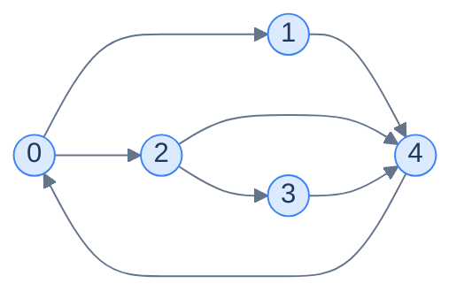
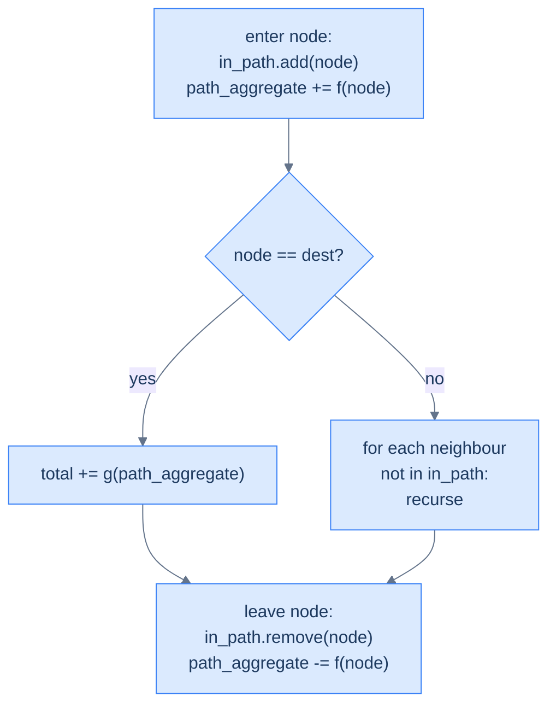

# 12. Pattern: Depth-first search

This lesson teaches you the DFS **pattern** — the family of problems where you need to enumerate, score, or filter every path from a source through some destination. Once you can recognise the pattern, the implementation writes itself.

## Table of contents

1. [Why DFS is more than traversal](#why-dfs-is-more-than-traversal)
2. [The DFS pattern template](#the-dfs-pattern-template)
3. [Identifying the pattern](#identifying-the-pattern)
4. [Problem: Source to target paths](#problem-source-to-target-paths)
5. [Problem: Target paths with given weight](#problem-target-paths-with-given-weight)
6. [Problem: Hamiltonian paths](#problem-hamiltonian-paths)
7. [Problem: Simple cycles](#problem-simple-cycles)

***

# Why DFS Is More Than Traversal

In lesson 4 you used DFS as a *traversal* — a way to visit every node exactly once. That's its simplest use. But DFS has a second, much more powerful use: **enumerating paths**.

Every recursive call walks deeper into one specific path. Every `return` after the recursive call backtracks one step and tries an alternative. With a small twist on the basic traversal — **track which nodes are *currently on the path* (not which have *ever* been visited)** — DFS becomes a tool for exploring every possible route from source to destination.



<p align="center"><strong>How many paths exist from 0 to 4? Try to count by hand. The answer is 3 — and DFS systematically enumerates them.</strong></p>

The "currently on path" set replaces the "visited" set. Without this swap, a node could only be visited once across the whole algorithm — and we'd miss paths that legitimately revisit nodes via a different route. The set behaves like a **stack** that mirrors the recursion: push on entry, pop on exit. When the node leaves the stack, it's available for use in *other* paths through it.

> *Before reading on — for the graph above, list all 3 paths from node 0 to node 4. Try to do it without code. Why did you have to "back up" each time?*

The paths: `0 → 1 → 4`, `0 → 2 → 4`, `0 → 2 → 3 → 4`. After exploring the second one, you "backed up" to node 2 to try its other neighbour (3). After the third, you backed up to 0 to try… nothing more, you've exhausted the options. That backtrack-as-you-go process is *exactly* what DFS does, and the path stack is what tracks where you are.

***

# The DFS Pattern Template

The general DFS-pattern problem looks like this:

> Given a graph, a source `s`, and a destination `t`, **aggregate** some function `f` over the nodes (or edges) of every valid `s → t` path, then **aggregate** those per-path values using a function `g`.

Different choices of `f` and `g` give different problems:

| Problem | `f` (per node) | `g` (across paths) |
|---|---|---|
| List all paths | Append node to current path | Add path to result list |
| Count paths | +1 | Sum |
| Sum of all path weights | Add edge weight | Sum |
| Max-weight path | Add edge weight | Max |
| Number of paths matching a constraint | Check & set flag | Count flagged |
| All Hamiltonian paths | Like "all paths" + length check | Filter by length == N |

The structure of the algorithm is **identical** across all of them. Only the per-node and per-path operations change.

---

## The Generic Algorithm

```
dfs(node, graph, in_path, path_aggregate, total_aggregate):
    in_path.add(node)
    path_aggregate <- f(path_aggregate, node)        # apply f
    
    if node == destination:
        total_aggregate <- g(total_aggregate, path_aggregate)   # apply g
    else:
        for neighbour in graph[node]:
            if neighbour not in in_path:
                dfs(neighbour, ...)
    
    in_path.remove(node)
    path_aggregate <- f⁻¹(path_aggregate, node)      # UNDO f on backtrack
```

The four key steps that distinguish this from a plain traversal:

1. **`in_path` is the current-path stack**, not a global visited set.
2. **`f` is applied on entry** to update the running per-path aggregate.
3. **`g` is applied at the destination** to absorb a complete path's contribution.
4. **`f⁻¹` is applied on exit** to undo the entry's update before backtracking — keeping `path_aggregate` correct for the parent's other branches.



<p align="center"><strong>The DFS-pattern recipe. The "leave node" step is what makes the algorithm correct — without undoing on the way out, sibling branches inherit a polluted aggregate.</strong></p>

The "undo on exit" step is the most-forgotten line in DFS-pattern code. Plant a sticky note: **whatever you change on entry, undo on exit.**

***

# Identifying the Pattern

You can recognise a DFS-pattern problem by these signals:

- The problem mentions **paths** between two specific nodes.
- It asks for *all*, *count*, *sum*, *max*, *min*, or *exists* over those paths.
- The same node may appear in different paths (so a per-traversal "visited" set won't do — we need the per-path "in_path" set instead).
- The graph is **small enough** that exponential enumeration is acceptable. (Path counts can be exponential in N — DFS is for problems where N ≤ ~20 or the graph is sparse.)

A non-exhaustive list of problems that fit:

- All paths from source to destination
- Paths with sum equal to a target value
- Hamiltonian paths (a path visiting every node exactly once)
- Cycles passing through specific nodes
- Maze "all routes" from entrance to exit
- Combination/permutation generation (these *are* DFS on an implicit graph)

If your problem has any of these flavours, you reach for DFS — and you write the same skeleton every time, just with different `f` / `g` operations.

We'll now apply the template to four classic problems, each with a different choice of `f` and `g`.

***

# Problem: Source to Target Paths

## The Problem

Given a directed graph as adjacency list, return *all* paths from node `0` to node `N-1`.

```
Input:  graph = [[1, 2], [4], [3, 4], [4], []]
Output: [[0, 1, 4], [0, 2, 3, 4], [0, 2, 4]]

Input:  graph = [[4], [0, 3], [0, 4], [2, 4], []]
Output: [[0, 4]]
```

## Pattern Mapping

- `f`: append node to current path list.
- `g`: append a copy of the current path to `paths` when destination reached.
- `f⁻¹`: pop last element from current path list on exit.

## The Solution


```pseudocode
function dfs(graph, node, path, paths, inPath):
    add node to inPath
    append node to path
    if node = last node in graph:
        append copy of path to paths   # reached destination
    else:
        for neighbor in graph[node]:
            if neighbor is not in inPath:
                dfs(graph, neighbor, path, paths, inPath)
    pop from path
    remove node from inPath

function sourceToTargetPaths(graph):
    paths ← empty list
    dfs(graph, 0, empty list, paths, empty set)
    return paths
```

```python run
from typing import List, Set

class Solution:
    def dfs(self,
            graph: List[List[int]],
            node: int,
            path: List[int],
            paths: List[List[int]],
            in_path: Set[int]) -> None:
        in_path.add(node)
        path.append(node)                      # f: enter

        if node == len(graph) - 1:
            paths.append(path.copy())          # g: record a snapshot of the path
        else:
            for neighbour in graph[node]:
                if neighbour not in in_path:
                    self.dfs(graph, neighbour, path, paths, in_path)

        path.pop()                             # f⁻¹: leave
        in_path.discard(node)

    def source_to_target_paths(self, graph: List[List[int]]) -> List[List[int]]:
        paths: List[List[int]] = []
        path: List[int] = []
        in_path: Set[int] = set()
        self.dfs(graph, 0, path, paths, in_path)
        return paths


print(Solution().source_to_target_paths([[1, 2], [4], [3, 4], [4], []]))
```

```java run
import java.util.*;

public class Main {
    static class Solution {
        public void dfs(List<List<Integer>> graph, int node, List<Integer> path,
                        List<List<Integer>> paths, Set<Integer> inPath) {
            inPath.add(node);
            path.add(node);
            if (node == graph.size() - 1) paths.add(new ArrayList<>(path));
            else for (int n : graph.get(node))
                if (!inPath.contains(n)) dfs(graph, n, path, paths, inPath);
            path.remove(path.size() - 1);
            inPath.remove(node);
        }

        public List<List<Integer>> sourceToTargetPaths(List<List<Integer>> graph) {
            List<List<Integer>> paths = new ArrayList<>();
            dfs(graph, 0, new ArrayList<>(), paths, new HashSet<>());
            return paths;
        }
    }

    public static void main(String[] args) {
        var g = List.of(List.of(1, 2), List.of(4), List.of(3, 4), List.of(4), List.<Integer>of());
        System.out.println(new Solution().sourceToTargetPaths(g));
    }
}
```

```c run
#include <stdio.h>
#include <stdlib.h>
#include <stdbool.h>

typedef struct { int* data; int size; } AdjList;

static int** all_paths;
static int* all_path_lengths;
static int total_paths;

static void dfs(AdjList* graph, int n, int node, int* path, int path_size, bool* in_path) {
    in_path[node] = true;
    path[path_size++] = node;
    if (node == n - 1) {
        all_paths = realloc(all_paths, (total_paths + 1) * sizeof(int*));
        all_path_lengths = realloc(all_path_lengths, (total_paths + 1) * sizeof(int));
        all_paths[total_paths] = malloc(path_size * sizeof(int));
        for (int i = 0; i < path_size; i++) all_paths[total_paths][i] = path[i];
        all_path_lengths[total_paths] = path_size;
        total_paths++;
    } else {
        for (int i = 0; i < graph[node].size; i++) {
            int neighbour = graph[node].data[i];
            if (!in_path[neighbour]) dfs(graph, n, neighbour, path, path_size, in_path);
        }
    }
    in_path[node] = false;
}

int main() {
    int g0[]={1,2}, g1[]={4}, g2[]={3,4}, g3[]={4};
    AdjList g[]={{g0,2},{g1,1},{g2,2},{g3,1},{NULL,0}};
    int path[10];
    bool in_path[5] = {false};
    all_paths = NULL; all_path_lengths = NULL; total_paths = 0;
    dfs(g, 5, 0, path, 0, in_path);
    for (int i = 0; i < total_paths; i++) {
        printf("[");
        for (int j = 0; j < all_path_lengths[i]; j++) printf("%d ", all_paths[i][j]);
        printf("]\n");
        free(all_paths[i]);
    }
    free(all_paths); free(all_path_lengths);
    return 0;
}
```

```scala run
import scala.collection.mutable

object Main extends App {
  class Solution {
    def dfs(graph: Array[Array[Int]], node: Int,
            path: mutable.ArrayBuffer[Int],
            paths: mutable.ArrayBuffer[Seq[Int]],
            inPath: mutable.Set[Int]): Unit = {
      inPath.add(node); path.append(node)
      if (node == graph.length - 1) paths.append(path.toSeq)
      else for (n <- graph(node) if !inPath.contains(n)) dfs(graph, n, path, paths, inPath)
      path.remove(path.length - 1)
      inPath.remove(node)
    }

    def sourceToTargetPaths(graph: Array[Array[Int]]): Seq[Seq[Int]] = {
      val paths = mutable.ArrayBuffer.empty[Seq[Int]]
      dfs(graph, 0, mutable.ArrayBuffer.empty, paths, mutable.Set.empty)
      paths.toSeq
    }
  }

  val g = Array(Array(1, 2), Array(4), Array(3, 4), Array(4), Array.empty[Int])
  println(new Solution().sourceToTargetPaths(g))
}
```


***

# Problem: Target Paths With Given Weight

## The Problem

Given a **weighted** directed graph, source, destination, and target weight, return all paths from source to destination whose **edge weights sum to exactly the target**.

```
Input:  graph = [[(1,2),(3,5)], [(4,2)], [(4,1)], [(2,2)], [(3,1)]],
        source = 0, destination = 3, target = 5
Output: [[0,1,4,3], [0,3]]
```

## Pattern Mapping

- `f`: append node to path list AND add edge weight to running sum.
- `g`: append the path *only if* the running sum equals target.
- `f⁻¹`: pop node AND subtract the edge weight on exit.

The only twist from the previous problem is the running edge-weight sum carried alongside the path.

## The Solution


```pseudocode
function dfs(graph, node, dest, curSum, target, path, paths, inPath):
    add node to inPath
    append node to path
    if node = dest AND curSum = target:
        append copy of path to paths   # sum-matching path found
    else:
        for (neighbor, weight) in graph[node]:
            if neighbor is not in inPath:
                dfs(graph, neighbor, dest, curSum+weight, target, path, paths, inPath)
    pop from path
    remove node from inPath

function targetPaths(graph, source, dest, target):
    paths ← empty list
    dfs(graph, source, dest, 0, target, empty list, paths, empty set)
    return paths
```

```python run
from typing import List, Tuple, Set

class Solution:
    def dfs(self,
            graph: List[List[Tuple[int, int]]],
            node: int,
            destination: int,
            current_sum: int,
            target: int,
            path: List[int],
            paths: List[List[int]],
            in_path: Set[int]) -> None:
        in_path.add(node)
        path.append(node)

        # Check at the destination — only the sum-equals-target paths qualify.
        if node == destination and current_sum == target:
            paths.append(path.copy())
        else:
            for neighbour, weight in graph[node]:
                if neighbour not in in_path:
                    self.dfs(graph, neighbour, destination, current_sum + weight,
                             target, path, paths, in_path)

        path.pop()
        in_path.discard(node)

    def target_paths(self,
                     graph: List[List[Tuple[int, int]]],
                     source: int, destination: int, target: int) -> List[List[int]]:
        paths: List[List[int]] = []
        self.dfs(graph, source, destination, 0, target, [], paths, set())
        return paths


graph = [[(1, 2), (3, 5)], [(4, 2)], [(4, 1)], [(2, 2)], [(3, 1)]]
print(Solution().target_paths(graph, 0, 3, 5))   # [[0,1,4,3], [0,3]]
```

```java run
import java.util.*;

public class Main {
    static class Solution {
        public void dfs(List<List<int[]>> graph, int node, int dest, int curSum, int target,
                        List<Integer> path, List<List<Integer>> paths, Set<Integer> inPath) {
            inPath.add(node);
            path.add(node);
            if (node == dest && curSum == target) paths.add(new ArrayList<>(path));
            else {
                for (int[] e : graph.get(node))
                    if (!inPath.contains(e[0]))
                        dfs(graph, e[0], dest, curSum + e[1], target, path, paths, inPath);
            }
            path.remove(path.size() - 1);
            inPath.remove(node);
        }

        public List<List<Integer>> targetPaths(List<List<int[]>> graph, int source, int dest, int target) {
            List<List<Integer>> paths = new ArrayList<>();
            dfs(graph, source, dest, 0, target, new ArrayList<>(), paths, new HashSet<>());
            return paths;
        }
    }

    public static void main(String[] args) {
        var g = List.of(
            List.of(new int[]{1, 2}, new int[]{3, 5}),
            List.of(new int[]{4, 2}),
            List.of(new int[]{4, 1}),
            List.of(new int[]{2, 2}),
            List.of(new int[]{3, 1}));
        System.out.println(new Solution().targetPaths(g, 0, 3, 5));
    }
}
```

```c run
#include <stdio.h>
#include <stdlib.h>
#include <stdbool.h>

typedef struct { int to, w; } Edge;
typedef struct { Edge* data; int size; } AdjList;

static int** result; static int* result_lens; static int result_n;

static void dfs(AdjList* g, int node, int dest, int sum, int target,
                int* path, int len, bool* in_path) {
    in_path[node] = true;
    path[len++] = node;
    if (node == dest && sum == target) {
        result = realloc(result, (result_n + 1) * sizeof(int*));
        result_lens = realloc(result_lens, (result_n + 1) * sizeof(int));
        result[result_n] = malloc(len * sizeof(int));
        for (int i = 0; i < len; i++) result[result_n][i] = path[i];
        result_lens[result_n++] = len;
    } else {
        for (int i = 0; i < g[node].size; i++) {
            Edge e = g[node].data[i];
            if (!in_path[e.to]) dfs(g, e.to, dest, sum + e.w, target, path, len, in_path);
        }
    }
    in_path[node] = false;
}

int main() {
    Edge e0[]={{1,2},{3,5}}, e1[]={{4,2}}, e2[]={{4,1}}, e3[]={{2,2}}, e4[]={{3,1}};
    AdjList g[]={{e0,2},{e1,1},{e2,1},{e3,1},{e4,1}};
    int path[10]; bool ip[5]={false};
    result=NULL; result_lens=NULL; result_n=0;
    dfs(g, 0, 3, 0, 5, path, 0, ip);
    for (int i = 0; i < result_n; i++) {
        for (int j = 0; j < result_lens[i]; j++) printf("%d ", result[i][j]);
        printf("\n"); free(result[i]);
    }
    free(result); free(result_lens);
    return 0;
}
```

```scala run
import scala.collection.mutable

object Main extends App {
  class Solution {
    def dfs(graph: Array[Array[(Int, Int)]], node: Int, dest: Int, curSum: Int, target: Int,
            path: mutable.ArrayBuffer[Int], paths: mutable.ArrayBuffer[Seq[Int]],
            inPath: mutable.Set[Int]): Unit = {
      inPath.add(node); path.append(node)
      if (node == dest && curSum == target) paths.append(path.toSeq)
      else for ((n, w) <- graph(node) if !inPath.contains(n))
        dfs(graph, n, dest, curSum + w, target, path, paths, inPath)
      path.remove(path.length - 1)
      inPath.remove(node)
    }

    def targetPaths(graph: Array[Array[(Int, Int)]], source: Int, dest: Int, target: Int): Seq[Seq[Int]] = {
      val paths = mutable.ArrayBuffer.empty[Seq[Int]]
      dfs(graph, source, dest, 0, target, mutable.ArrayBuffer.empty, paths, mutable.Set.empty)
      paths.toSeq
    }
  }

  val g = Array(
    Array((1, 2), (3, 5)), Array((4, 2)), Array((4, 1)), Array((2, 2)), Array((3, 1)))
  println(new Solution().targetPaths(g, 0, 3, 5))
}
```


***

# Problem: Hamiltonian Paths

## The Problem

A **Hamiltonian path** visits *every* vertex of the graph exactly once. Given a directed graph, source, and destination, find all Hamiltonian paths from source to destination.

```
Input:  graph = [[1, 2], [0, 2, 3], [0, 1, 3], [1, 2]], source = 0, destination = 3
Output: [[0, 1, 2, 3], [0, 2, 1, 3]]
```

## Pattern Mapping

- `f`: same as before (append to path).
- `g`: record the path *only if* destination is reached **and** every node has been visited.
- `f⁻¹`: same as before.

The only twist: the destination check now requires `path.length == N`.

> *Before reading on — Hamiltonian path detection is famously **NP-hard**. Why is it still tractable here? What property of the input keeps the algorithm fast?*

It's tractable because we're enumerating, not deciding existence faster than brute force. DFS with the "in_path" pruning has worst case O(N!) in pathological cases — but for typical small graphs (N ≤ ~20) it's fast enough. The intractability shows up when N gets larger; below that, DFS is the only sane approach.

## The Solution


```pseudocode
function dfs(graph, node, dest, path, paths, inPath):
    add node to inPath
    append node to path
    if node = dest AND length of inPath = N:
        append copy of path to paths   # every vertex visited → Hamiltonian path
    else:
        for neighbor in graph[node]:
            if neighbor is not in inPath:
                dfs(graph, neighbor, dest, path, paths, inPath)
    pop from path
    remove node from inPath

function hamiltonianPaths(graph, source, dest):
    paths ← empty list
    dfs(graph, source, dest, empty list, paths, empty set)
    return paths
```

```python run
from typing import List, Set

class Solution:
    def dfs(self,
            graph: List[List[int]],
            node: int,
            destination: int,
            path: List[int],
            paths: List[List[int]],
            in_path: Set[int]) -> None:
        in_path.add(node)
        path.append(node)
        # Hamiltonian = destination reached AND every vertex visited.
        if node == destination and len(in_path) == len(graph):
            paths.append(path.copy())
        else:
            for neighbour in graph[node]:
                if neighbour not in in_path:
                    self.dfs(graph, neighbour, destination, path, paths, in_path)
        path.pop()
        in_path.discard(node)

    def hamiltonian_paths(self,
                          graph: List[List[int]],
                          source: int, destination: int) -> List[List[int]]:
        paths: List[List[int]] = []
        self.dfs(graph, source, destination, [], paths, set())
        return paths


graph = [[1, 2], [0, 2, 3], [0, 1, 3], [1, 2]]
print(Solution().hamiltonian_paths(graph, 0, 3))
```

```java run
import java.util.*;

public class Main {
    static class Solution {
        public void dfs(List<List<Integer>> graph, int node, int dest,
                        List<Integer> path, List<List<Integer>> paths, Set<Integer> inPath) {
            inPath.add(node);
            path.add(node);
            if (node == dest && inPath.size() == graph.size()) paths.add(new ArrayList<>(path));
            else for (int n : graph.get(node))
                if (!inPath.contains(n)) dfs(graph, n, dest, path, paths, inPath);
            path.remove(path.size() - 1);
            inPath.remove(node);
        }

        public List<List<Integer>> hamiltonianPaths(List<List<Integer>> graph, int source, int dest) {
            List<List<Integer>> paths = new ArrayList<>();
            dfs(graph, source, dest, new ArrayList<>(), paths, new HashSet<>());
            return paths;
        }
    }

    public static void main(String[] args) {
        var g = List.of(List.of(1, 2), List.of(0, 2, 3), List.of(0, 1, 3), List.of(1, 2));
        System.out.println(new Solution().hamiltonianPaths(g, 0, 3));
    }
}
```

```c run
#include <stdio.h>
#include <stdlib.h>
#include <stdbool.h>

typedef struct { int* data; int size; } AdjList;
static int** out; static int* out_lens; static int out_n;

static void dfs(AdjList* g, int n, int node, int dest, int* path, int len,
                bool* in_path, int visited_count) {
    in_path[node] = true;
    path[len++] = node;
    visited_count++;
    if (node == dest && visited_count == n) {
        out = realloc(out, (out_n + 1) * sizeof(int*));
        out_lens = realloc(out_lens, (out_n + 1) * sizeof(int));
        out[out_n] = malloc(len * sizeof(int));
        for (int i = 0; i < len; i++) out[out_n][i] = path[i];
        out_lens[out_n++] = len;
    } else {
        for (int i = 0; i < g[node].size; i++) {
            int nb = g[node].data[i];
            if (!in_path[nb]) dfs(g, n, nb, dest, path, len, in_path, visited_count);
        }
    }
    in_path[node] = false;
}

int main() {
    int g0[]={1,2}, g1[]={0,2,3}, g2[]={0,1,3}, g3[]={1,2};
    AdjList g[]={{g0,2},{g1,3},{g2,3},{g3,2}};
    int path[10]; bool ip[4]={false};
    out=NULL; out_lens=NULL; out_n=0;
    dfs(g, 4, 0, 3, path, 0, ip, 0);
    for (int i = 0; i < out_n; i++) {
        for (int j = 0; j < out_lens[i]; j++) printf("%d ", out[i][j]);
        printf("\n"); free(out[i]);
    }
    free(out); free(out_lens);
    return 0;
}
```

```scala run
import scala.collection.mutable

object Main extends App {
  class Solution {
    def dfs(graph: Array[Array[Int]], node: Int, dest: Int,
            path: mutable.ArrayBuffer[Int], paths: mutable.ArrayBuffer[Seq[Int]],
            inPath: mutable.Set[Int]): Unit = {
      inPath.add(node); path.append(node)
      if (node == dest && inPath.size == graph.length) paths.append(path.toSeq)
      else for (n <- graph(node) if !inPath.contains(n)) dfs(graph, n, dest, path, paths, inPath)
      path.remove(path.length - 1)
      inPath.remove(node)
    }

    def hamiltonianPaths(graph: Array[Array[Int]], source: Int, dest: Int): Seq[Seq[Int]] = {
      val paths = mutable.ArrayBuffer.empty[Seq[Int]]
      dfs(graph, source, dest, mutable.ArrayBuffer.empty, paths, mutable.Set.empty)
      paths.toSeq
    }
  }

  val g = Array(Array(1, 2), Array(0, 2, 3), Array(0, 1, 3), Array(1, 2))
  println(new Solution().hamiltonianPaths(g, 0, 3))
}
```


***

# Problem: Simple Cycles

## The Problem

Given a directed graph, source, and destination, count the number of **simple cycles** that *start at the source*, *pass through the destination*, and *return to the source* without repeating any other node.

```
Input:  graph = [[1, 2], [0, 2, 3], [0, 1, 3], [1, 2]], source = 0, destination = 3
Output: 2
Explanation: Cycles 0 → 1 → 3 → 2 → 0 and 0 → 2 → 3 → 1 → 0 both start/end at 0 and pass through 3.
```

## Pattern Mapping

- `f`: same in_path tracking.
- The loop check at each step: if a neighbour is the *source* AND the path has length ≥ 3 (a cycle needs at least 3 nodes) AND the destination has been visited along the way → count one cycle.
- `f⁻¹`: same.

The only structural difference from previous problems: there's no explicit "destination reached → record" branch. Instead, the cycle-completion check is *inline* with the neighbour iteration — when we find a neighbour that's the source and the path qualifies, we increment the counter.

## The Solution


```pseudocode
function dfs(graph, node, source, dest, inPath, cycleCount):
    add node to inPath
    for neighbor in graph[node]:
        if neighbor is not in inPath:
            dfs(graph, neighbor, source, dest, inPath, cycleCount)
        else if neighbor = source AND length of inPath > 2 AND dest is in inPath:
            cycleCount ← cycleCount + 1   # closed a valid cycle through dest
    remove node from inPath

function simpleCycles(graph, source, dest):
    cycles ← 0
    dfs(graph, source, source, dest, empty set, cycles)
    return cycles
```

```python run
from typing import List, Set

class Solution:
    def __init__(self):
        self.cycles = 0

    def dfs(self,
            graph: List[List[int]],
            node: int,
            source: int,
            destination: int,
            in_path: Set[int]) -> None:
        in_path.add(node)
        for neighbour in graph[node]:
            if neighbour not in in_path:
                self.dfs(graph, neighbour, source, destination, in_path)
            elif (neighbour == source
                  and len(in_path) > 2                    # need ≥ 3 nodes for a cycle
                  and destination in in_path):            # destination on the loop
                self.cycles += 1
        in_path.discard(node)

    def simple_cycles(self,
                      graph: List[List[int]],
                      source: int, destination: int) -> int:
        self.cycles = 0
        self.dfs(graph, source, source, destination, set())
        return self.cycles


graph = [[1, 2], [0, 2, 3], [0, 1, 3], [1, 2]]
print(Solution().simple_cycles(graph, 0, 3))   # 2
```

```java run
import java.util.*;

public class Main {
    static class Solution {
        int cycles = 0;
        public void dfs(List<List<Integer>> graph, int node, int source, int dest, Set<Integer> inPath) {
            inPath.add(node);
            for (int n : graph.get(node)) {
                if (!inPath.contains(n)) dfs(graph, n, source, dest, inPath);
                else if (n == source && inPath.size() > 2 && inPath.contains(dest)) cycles++;
            }
            inPath.remove(node);
        }

        public int simpleCycles(List<List<Integer>> graph, int source, int dest) {
            cycles = 0;
            dfs(graph, source, source, dest, new HashSet<>());
            return cycles;
        }
    }

    public static void main(String[] args) {
        var g = List.of(List.of(1, 2), List.of(0, 2, 3), List.of(0, 1, 3), List.of(1, 2));
        System.out.println(new Solution().simpleCycles(g, 0, 3));
    }
}
```

```c run
#include <stdio.h>
#include <stdlib.h>
#include <stdbool.h>

typedef struct { int* data; int size; } AdjList;
static int cycles_count = 0;

static void dfs(AdjList* g, int node, int source, int dest, bool* in_path,
                int path_size, bool dest_in_path) {
    in_path[node] = true;
    path_size++;
    bool now_dest = dest_in_path || (node == dest);
    for (int i = 0; i < g[node].size; i++) {
        int n = g[node].data[i];
        if (!in_path[n]) dfs(g, n, source, dest, in_path, path_size, now_dest);
        else if (n == source && path_size > 2 && now_dest) cycles_count++;
    }
    in_path[node] = false;
}

int main() {
    int g0[]={1,2}, g1[]={0,2,3}, g2[]={0,1,3}, g3[]={1,2};
    AdjList g[]={{g0,2},{g1,3},{g2,3},{g3,2}};
    bool ip[4]={false};
    cycles_count = 0;
    dfs(g, 0, 0, 3, ip, 0, false);
    printf("%d\n", cycles_count);
    return 0;
}
```

```scala run
import scala.collection.mutable

object Main extends App {
  class Solution {
    var cycles = 0
    def dfs(graph: Array[Array[Int]], node: Int, source: Int, dest: Int,
            inPath: mutable.Set[Int]): Unit = {
      inPath.add(node)
      for (n <- graph(node)) {
        if (!inPath.contains(n)) dfs(graph, n, source, dest, inPath)
        else if (n == source && inPath.size > 2 && inPath.contains(dest)) cycles += 1
      }
      inPath.remove(node)
    }

    def simpleCycles(graph: Array[Array[Int]], source: Int, dest: Int): Int = {
      cycles = 0
      dfs(graph, source, source, dest, mutable.Set.empty)
      cycles
    }
  }

  val g = Array(Array(1, 2), Array(0, 2, 3), Array(0, 1, 3), Array(1, 2))
  println(new Solution().simpleCycles(g, 0, 3))
}
```


## Complexity Analysis

| | Complexity | Reasoning |
|---|---|---|
| **Time** | O(V! × E) worst case | Number of paths can be up to V! in dense graphs; each visit costs O(E) |
| **Space** | O(V) | Recursion depth + path storage + in_path set |

This is the price of enumeration — exponential in the worst case. The `in_path` constraint prunes heavily on most real inputs.

---

## Final Takeaway

The DFS pattern is **the** tool when you need to *enumerate, score, or filter* paths through a graph. Once you internalise the four-step recipe — *enter, check destination, recurse, leave* — the rest is choosing what `f` and `g` should compute.

Watch for the giveaways: phrasing like *"all paths"*, *"paths with [property]"*, *"count cycles"*, *"Hamiltonian"*, *"longest/shortest path"* — these are pattern-matching signals that DFS is the right approach.

The next pattern lessons explore three other DFS-flavoured problem families: **connected components** (count or label disjoint pieces of a graph), **two-colouring** (test for bipartiteness), and **shortest paths** with BFS and Dijkstra. Each one applies a small twist to DFS or BFS — and once you recognise the family, the implementation is mechanical.

> **Transfer challenge.** A delivery-robot pathfinding system needs to count the number of distinct valid routes from a warehouse to a destination, with the constraint that the route cost (sum of edge weights) is below a budget. Sketch the f and g you'd use.

<details>
<summary><strong>Sketch</strong></summary>

- `f` (per node): add edge weight to running sum.
- `g` (at destination): if running sum ≤ budget, increment a counter.
- `f⁻¹` (on exit): subtract edge weight.

This is exactly "Target paths with given weight" generalised from "= target" to "≤ budget". Same skeleton; one symbol changes.

</details>
