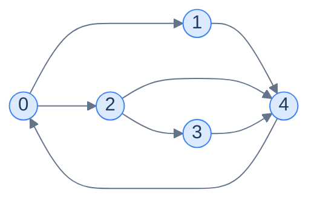
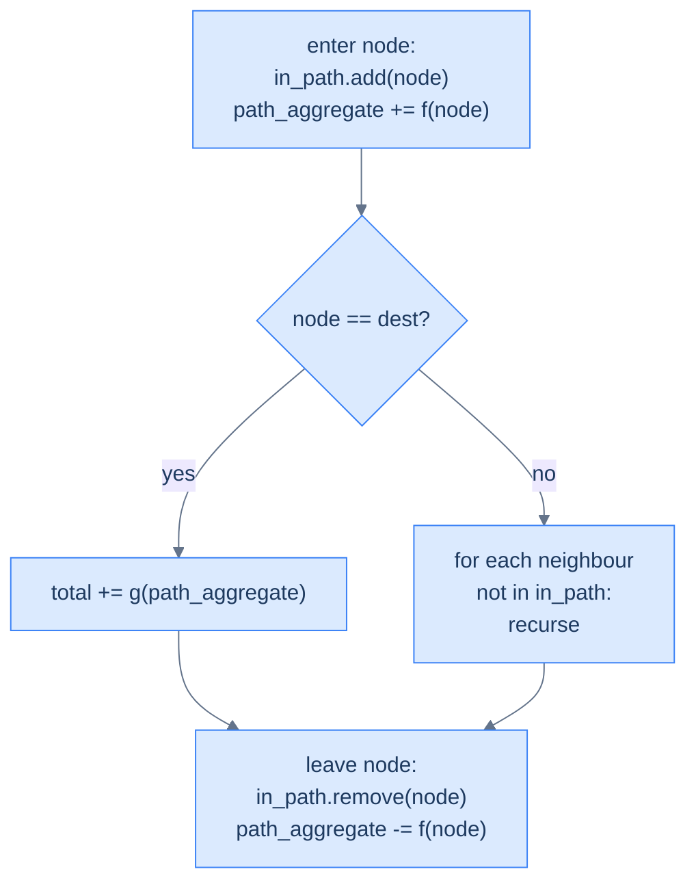

# 12. Pattern: Depth-first search

This lesson teaches you the DFS **pattern** — the family of problems where you need to enumerate, score, or filter every path from a source through some destination. Once you can recognise the pattern, the implementation writes itself.

## Table of contents

1. [Why DFS is more than traversal](#why-dfs-is-more-than-traversal)
2. [The DFS pattern template](#the-dfs-pattern-template)
3. [Identifying the pattern](#identifying-the-pattern)
4. [Problem: Source to target paths](#problem-source-to-target-paths)
5. [Problem: Target paths with given weight](#problem-target-paths-with-given-weight)
6. [Problem: Hamiltonian paths](#problem-hamiltonian-paths)
7. [Problem: Simple cycles](#problem-simple-cycles)

***

# Why DFS Is More Than Traversal

In lesson 4 you used DFS as a *traversal* — a way to visit every node exactly once. That's its simplest use. But DFS has a second, much more powerful use: **enumerating paths**.

Every recursive call walks deeper into one specific path. Every `return` after the recursive call backtracks one step and tries an alternative. With a small twist on the basic traversal — **track which nodes are *currently on the path* (not which have *ever* been visited)** — DFS becomes a tool for exploring every possible route from source to destination.



<p align="center"><strong>How many paths exist from 0 to 4? Try to count by hand. The answer is 3 — and DFS systematically enumerates them.</strong></p>

The "currently on path" set replaces the "visited" set. Without this swap, a node could only be visited once across the whole algorithm — and we'd miss paths that legitimately revisit nodes via a different route. The set behaves like a **stack** that mirrors the recursion: push on entry, pop on exit. When the node leaves the stack, it's available for use in *other* paths through it.

> *Before reading on — for the graph above, list all 3 paths from node 0 to node 4. Try to do it without code. Why did you have to "back up" each time?*

The paths: `0 → 1 → 4`, `0 → 2 → 4`, `0 → 2 → 3 → 4`. After exploring the second one, you "backed up" to node 2 to try its other neighbour (3). After the third, you backed up to 0 to try… nothing more, you've exhausted the options. That backtrack-as-you-go process is *exactly* what DFS does, and the path stack is what tracks where you are.

***

# The DFS Pattern Template

The general DFS-pattern problem looks like this:

> Given a graph, a source `s`, and a destination `t`, **aggregate** some function `f` over the nodes (or edges) of every valid `s → t` path, then **aggregate** those per-path values using a function `g`.

Different choices of `f` and `g` give different problems:

| Problem | `f` (per node) | `g` (across paths) |
|---|---|---|
| List all paths | Append node to current path | Add path to result list |
| Count paths | +1 | Sum |
| Sum of all path weights | Add edge weight | Sum |
| Max-weight path | Add edge weight | Max |
| Number of paths matching a constraint | Check & set flag | Count flagged |
| All Hamiltonian paths | Like "all paths" + length check | Filter by length == N |

The structure of the algorithm is **identical** across all of them. Only the per-node and per-path operations change.

---

## The Generic Algorithm

```
dfs(node, graph, in_path, path_aggregate, total_aggregate):
    in_path.add(node)
    path_aggregate <- f(path_aggregate, node)        # apply f
    
    if node == destination:
        total_aggregate <- g(total_aggregate, path_aggregate)   # apply g
    else:
        for neighbour in graph[node]:
            if neighbour not in in_path:
                dfs(neighbour, ...)
    
    in_path.remove(node)
    path_aggregate <- f⁻¹(path_aggregate, node)      # UNDO f on backtrack
```

The four key steps that distinguish this from a plain traversal:

1. **`in_path` is the current-path stack**, not a global visited set.
2. **`f` is applied on entry** to update the running per-path aggregate.
3. **`g` is applied at the destination** to absorb a complete path's contribution.
4. **`f⁻¹` is applied on exit** to undo the entry's update before backtracking — keeping `path_aggregate` correct for the parent's other branches.



<p align="center"><strong>The DFS-pattern recipe. The "leave node" step is what makes the algorithm correct — without undoing on the way out, sibling branches inherit a polluted aggregate.</strong></p>

The "undo on exit" step is the most-forgotten line in DFS-pattern code. Plant a sticky note: **whatever you change on entry, undo on exit.**

***

# Identifying the Pattern

You can recognise a DFS-pattern problem by these signals:

- The problem mentions **paths** between two specific nodes.
- It asks for *all*, *count*, *sum*, *max*, *min*, or *exists* over those paths.
- The same node may appear in different paths (so a per-traversal "visited" set won't do — we need the per-path "in_path" set instead).
- The graph is **small enough** that exponential enumeration is acceptable. (Path counts can be exponential in N — DFS is for problems where N ≤ ~20 or the graph is sparse.)

A non-exhaustive list of problems that fit:

- All paths from source to destination
- Paths with sum equal to a target value
- Hamiltonian paths (a path visiting every node exactly once)
- Cycles passing through specific nodes
- Maze "all routes" from entrance to exit
- Combination/permutation generation (these *are* DFS on an implicit graph)

If your problem has any of these flavours, you reach for DFS — and you write the same skeleton every time, just with different `f` / `g` operations.

We'll now apply the template to four classic problems, each with a different choice of `f` and `g`.

***

# Problem: Source to Target Paths

## The Problem

Given a directed graph as adjacency list, return *all* paths from node `0` to node `N-1`.

```
Input:  graph = [[1, 2], [4], [3, 4], [4], []]
Output: [[0, 1, 4], [0, 2, 3, 4], [0, 2, 4]]

Input:  graph = [[4], [0, 3], [0, 4], [2, 4], []]
Output: [[0, 4]]
```

<details>
<summary><h2>Pattern Mapping</h2></summary>


- `f`: append node to current path list.
- `g`: append a copy of the current path to `paths` when destination reached.
- `f⁻¹`: pop last element from current path list on exit.

</details>
<details>
<summary><h2>The Solution</h2></summary>


```python run
from typing import List, Set

class Solution:
    def dfs(
        self,
        graph: List[List[int]],
        node: int,
        path: List[int],
        paths: List[List[int]],
        nodes_in_path: Set[int],
    ) -> None:

        # Insert the current node into the set of nodes in the current
        # path to avoid cycles
        nodes_in_path.add(node)

        # Add the current node to the path
        path.append(node)

        # If the current node is the destination node, add the current
        # path to the paths list
        if node == len(graph) - 1:
            paths.append(path.copy())

        # Else, recursively explore all the neighbours of the current
        # node
        else:
            for neighbour in graph[node]:

                # Perform DFS on the neighbour node if it is not already
                # in the current path to avoid cycles
                if neighbour not in nodes_in_path:
                    self.dfs(
                        graph, neighbour, path, paths, nodes_in_path
                    )

        # Remove the current node from the path as we are done exploring
        path.pop()

        # Remove the current node from the set of nodes in the current
        # path to allow it to be visited again in other paths
        nodes_in_path.remove(node)

    def source_to_target_paths(
        self, graph: List[List[int]]
    ) -> List[List[int]]:

        # Result list to store all the paths
        paths: List[List[int]] = []

        # List to store the current path
        path: List[int] = []

        # Set to keep track of nodes in the current path
        nodes_in_path: Set[int] = set()

        # Perform DFS starting from node 0
        self.dfs(graph, 0, path, paths, nodes_in_path)

        # Return the list of paths
        return paths


# Examples from the problem statement
print(Solution().source_to_target_paths([[1,2],[4],[3,4],[4],[0]]))   # [[0,1,4],[0,2,3,4],[0,2,4]]
print(Solution().source_to_target_paths([[4],[0,3],[0,4],[2,4],[1]])) # [[0,4]]

# Edge cases
print(Solution().source_to_target_paths([[0]]))          # [[0]] — single node, src==dst
print(Solution().source_to_target_paths([[1], []]))      # [[0, 1]]
print(Solution().source_to_target_paths([[], [0]]))      # [] — no path from 0 to 1
print(Solution().source_to_target_paths([[1,2],[2],[]]))  # [[0,1,2],[0,2]]
```

```java run
import java.util.*;

public class Main {
    static class Solution {
        private void dfs(
            List<List<Integer>> graph,
            int node,
            List<Integer> path,
            List<List<Integer>> paths,
            Set<Integer> nodesInPath
        ) {

            // Insert the current node into the set of nodes in the current
            // path to avoid cycles
            nodesInPath.add(node);

            // Add the current node to the path
            path.add(node);

            // If the current node is the destination node, add the current
            // path to the paths list
            if (node == graph.size() - 1) {
                paths.add(new ArrayList<>(path));
            }

            // Else, recursively explore all the neighbours of the current
            // node
            else {
                for (int neighbour : graph.get(node)) {

                    // Perform DFS on the neighbour node if it is not already
                    // in the current path to avoid cycles
                    if (!nodesInPath.contains(neighbour)) {
                        dfs(graph, neighbour, path, paths, nodesInPath);
                    }
                }
            }

            // Remove the current node from the path as we are done exploring
            // it
            path.remove(path.size() - 1);

            // Remove the current node from the set of nodes in the current
            // path to allow it to be visited again in other paths
            nodesInPath.remove(node);
        }

        public List<List<Integer>> sourceToTargetPaths(
            List<List<Integer>> graph
        ) {

            // Result list to store all the paths
            List<List<Integer>> paths = new ArrayList<>();

            // List to store the current path
            List<Integer> path = new ArrayList<>();

            // Set to keep track of nodes in the current path
            Set<Integer> nodesInPath = new HashSet<>();

            // Perform DFS starting from node 0
            dfs(graph, 0, path, paths, nodesInPath);

            // Return the list of paths
            return paths;
        }
    }

    public static void main(String[] args) {
        Solution sol = new Solution();

        // Examples from the problem statement
        System.out.println(sol.sourceToTargetPaths(List.of(List.of(1,2),List.of(4),List.of(3,4),List.of(4),List.of(0))));  // [[0,1,4],[0,2,3,4],[0,2,4]]
        System.out.println(sol.sourceToTargetPaths(List.of(List.of(4),List.of(0,3),List.of(0,4),List.of(2,4),List.of(1))));  // [[0,4]]

        // Edge cases
        System.out.println(sol.sourceToTargetPaths(List.of(List.of(0))));  // [[0]] — single node, src==dst
        System.out.println(sol.sourceToTargetPaths(List.of(List.of(1), new ArrayList<>())));  // [[0, 1]]
        System.out.println(sol.sourceToTargetPaths(List.of(new ArrayList<>(), List.of(0))));  // [] — no path from 0 to 1
        System.out.println(sol.sourceToTargetPaths(List.of(List.of(1,2), List.of(2), new ArrayList<>())));  // [[0,1,2],[0,2]]
    }
}
```

</details>


***

# Problem: Target Paths With Given Weight

## The Problem

Given a **weighted** directed graph, source, destination, and target weight, return all paths from source to destination whose **edge weights sum to exactly the target**.

```
Input:  graph = [[(1,2),(3,5)], [(4,2)], [(4,1)], [(2,2)], [(3,1)]],
        source = 0, destination = 3, target = 5
Output: [[0,1,4,3], [0,3]]
```

<details>
<summary><h2>Pattern Mapping</h2></summary>


- `f`: append node to path list AND add edge weight to running sum.
- `g`: append the path *only if* the running sum equals target.
- `f⁻¹`: pop node AND subtract the edge weight on exit.

The only twist from the previous problem is the running edge-weight sum carried alongside the path.

</details>
<details>
<summary><h2>The Solution</h2></summary>


```python run
from typing import List, Set, Tuple

class Solution:
    def dfs(
        self,
        graph: List[List[Tuple[int, int]]],
        node: int,
        destination: int,
        current_sum: int,
        target: int,
        path: List[int],
        paths: List[List[int]],
        nodes_in_path: Set[int],
    ) -> None:

        # Insert the current node into the set of nodes in the current
        # path to avoid revisiting the same node
        nodes_in_path.add(node)

        # Add the current node to the path
        path.append(node)

        # If the current node is the destination and the path sum equals
        # the target sum, store the current path
        if node == destination and current_sum == target:
            paths.append(path.copy())

        # Else, explore all the neighbours of the current node
        else:
            for neighbour, weight in graph[node]:

                # Perform DFS on the neighbour node if it is not already
                # in the current path to avoid cycles
                if neighbour not in nodes_in_path:

                    # Explore neighbour and add its edge weight to the
                    # current sum
                    self.dfs(
                        graph,
                        neighbour,
                        destination,
                        current_sum + weight,
                        target,
                        path,
                        paths,
                        nodes_in_path,
                    )

        # Remove the current node from the path as we are done exploring
        # it
        path.pop()

        # Remove the current node from the set of nodes in the current
        # path to allow it to be visited again in other paths
        nodes_in_path.remove(node)

    def target_paths(
        self,
        graph: List[List[Tuple[int, int]]],
        source: int,
        destination: int,
        target: int,
    ) -> List[List[int]]:

        # Result list to store all the Hamiltonian paths
        paths: List[List[int]] = []

        # List to store the current path being explored
        path: List[int] = []

        # Set to keep track of nodes currently in the path
        nodes_in_path: Set[int] = set()

        # Perform DFS starting from the source node with an initial sum
        # of 0
        self.dfs(
            graph,
            source,
            destination,
            0,
            target,
            path,
            paths,
            nodes_in_path,
        )

        # Return the list of valid paths with the given sum
        return paths


# Examples from the problem statement
print(Solution().target_paths([[[1,2],[3,5]],[[4,2]],[[4,1]],[[2,2]],[[3,1]]], 0, 3, 5))  # [[0,1,4,3],[0,3]]
print(Solution().target_paths([[[4,2]],[[3,3],[0,4]],[[4,3],[0,1]],[[2,1],[4,4]],[[1,5]]], 3, 4, 4))  # [[3,2,4],[3,2,0,4],[3,4]]

# Edge cases
print(Solution().target_paths([], 0, 0, 0))                           # []
print(Solution().target_paths([[]], 0, 0, 0))                         # [[0]]
print(Solution().target_paths([[[1,3]],[]], 0, 1, 3))                 # [[0,1]]
print(Solution().target_paths([[[1,3]],[]], 0, 1, 5))                 # [] — wrong weight
print(Solution().target_paths([[[1,2],[2,3]],[[2,1]],[]], 0, 2, 3))   # [[0,2],[0,1,2]]
```

```java run
import java.util.*;

public class Main {
    static class Solution {
        private void dfs(
            List<List<List<Integer>>> graph,
            int node,
            int destination,
            int currentSum,
            int target,
            List<Integer> path,
            List<List<Integer>> paths,
            Set<Integer> nodesInPath
        ) {

            // Insert the current node into the set of nodes in the current
            // path to avoid revisiting the same node
            nodesInPath.add(node);

            // Add the current node to the path
            path.add(node);

            // If the current node is the destination and the path sum equals
            // the target sum, store the current path
            if (node == destination && currentSum == target) {
                paths.add(new ArrayList<>(path));
            }

            // Else, explore all the neighbours of the current node
            else {
                for (List<Integer> edge : graph.get(node)) {
                    int neighbour = edge.get(0);
                    int weight = edge.get(1);

                    // Perform DFS on the neighbour node if it is not already
                    // in the current path to avoid cycles
                    if (!nodesInPath.contains(neighbour)) {

                        // Explore neighbour and add its edge weight to the
                        // current sum
                        dfs(
                            graph,
                            neighbour,
                            destination,
                            currentSum + weight,
                            target,
                            path,
                            paths,
                            nodesInPath
                        );
                    }
                }
            }

            // Remove the current node from the path as we are done exploring
            // it
            path.remove(path.size() - 1);

            // Remove the current node from the set of nodes in the current
            // path to allow it to be visited again in other paths
            nodesInPath.remove(node);
        }

        public List<List<Integer>> targetPaths(
            List<List<List<Integer>>> graph,
            int source,
            int destination,
            int target
        ) {

            // Result list to store all the Hamiltonian paths
            List<List<Integer>> paths = new ArrayList<>();

            // List to store the current path being explored
            List<Integer> path = new ArrayList<>();

            // Set to keep track of nodes currently in the path
            Set<Integer> nodesInPath = new HashSet<>();

            // Perform DFS starting from the source node with an initial sum
            // of 0
            dfs(
                graph,
                source,
                destination,
                0,
                target,
                path,
                paths,
                nodesInPath
            );

            // Return the list of valid paths with the given sum
            return paths;
        }
    }

    public static void main(String[] args) {
        Solution sol = new Solution();

        // Examples from the problem statement
        System.out.println(sol.targetPaths(List.of(List.of(List.of(1,2),List.of(3,5)),List.of(List.of(4,2)),List.of(List.of(4,1)),List.of(List.of(2,2)),List.of(List.of(3,1))), 0, 3, 5));  // [[0,1,4,3],[0,3]]
        System.out.println(sol.targetPaths(List.of(List.of(List.of(4,2)),List.of(List.of(3,3),List.of(0,4)),List.of(List.of(4,3),List.of(0,1)),List.of(List.of(2,1),List.of(4,4)),List.of(List.of(1,5))), 3, 4, 4));  // [[3,2,4],[3,2,0,4],[3,4]]

        // Edge cases
        System.out.println(sol.targetPaths(List.of(new ArrayList<>()), 0, 0, 0));  // [[0]]
        System.out.println(sol.targetPaths(List.of(List.of(List.of(1,3)), new ArrayList<>()), 0, 1, 3));  // [[0,1]]
        System.out.println(sol.targetPaths(List.of(List.of(List.of(1,3)), new ArrayList<>()), 0, 1, 5));  // []
        System.out.println(sol.targetPaths(List.of(List.of(List.of(1,2),List.of(2,3)),List.of(List.of(2,1)),new ArrayList<>()), 0, 2, 3));  // [[0,2],[0,1,2]]
    }
}
```

</details>


***

# Problem: Hamiltonian Paths

## The Problem

A **Hamiltonian path** visits *every* vertex of the graph exactly once. Given a directed graph, source, and destination, find all Hamiltonian paths from source to destination.

```
Input:  graph = [[1, 2], [0, 2, 3], [0, 1, 3], [1, 2]], source = 0, destination = 3
Output: [[0, 1, 2, 3], [0, 2, 1, 3]]
```

<details>
<summary><h2>Pattern Mapping</h2></summary>


- `f`: same as before (append to path).
- `g`: record the path *only if* destination is reached **and** every node has been visited.
- `f⁻¹`: same as before.

The only twist: the destination check now requires `path.length == N`.

> *Before reading on — Hamiltonian path detection is famously **NP-hard**. Why is it still tractable here? What property of the input keeps the algorithm fast?*

It's tractable because we're enumerating, not deciding existence faster than brute force. DFS with the "in_path" pruning has worst case O(N!) in pathological cases — but for typical small graphs (N ≤ ~20) it's fast enough. The intractability shows up when N gets larger; below that, DFS is the only sane approach.

</details>
<details>
<summary><h2>The Solution</h2></summary>


```python run
from typing import List, Set

class Solution:
    def dfs(
        self,
        graph: List[List[int]],
        node: int,
        destination: int,
        path: List[int],
        paths: List[List[int]],
        nodes_in_path: Set[int],
    ) -> None:

        # Insert the current node into the set of nodes in the current
        # path to avoid revisiting the same node
        nodes_in_path.add(node)

        # Add the current node to the path
        path.append(node)

        # If the current node is the destination node and all nodes
        # have been visited, we have found a valid Hamiltonian Path
        if node == destination and len(nodes_in_path) == len(graph):
            paths.append(path.copy())

        # Else, recursively explore all the neighbours of the current
        # node
        else:
            for neighbour in graph[node]:

                # Perform DFS on the neighbour node if it is not already
                # in the current path to avoid cycles
                if neighbour not in nodes_in_path:
                    self.dfs(
                        graph,
                        neighbour,
                        destination,
                        path,
                        paths,
                        nodes_in_path,
                    )

        # Remove the current node from the path as we are done exploring
        # it
        path.pop()

        # Remove the current node from the set of nodes in the current
        # path to allow it to be visited again in other possible paths
        nodes_in_path.remove(node)

    def hamiltonian_paths(
        self, graph: List[List[int]], source: int, destination: int
    ) -> List[List[int]]:

        # Result list to store all the Hamiltonian paths
        paths: List[List[int]] = []

        # List to store the current path being explored
        path: List[int] = []

        # Set to keep track of nodes currently in the path
        nodes_in_path: Set[int] = set()

        # Perform DFS starting from the source node
        self.dfs(graph, source, destination, path, paths, nodes_in_path)

        # Return the list of all valid Hamiltonian paths
        return paths


# Examples from the problem statement
print(Solution().hamiltonian_paths([[1,2],[0,2,3],[0,1,3],[1,2]], 0, 3))  # [[0,1,2,3],[0,2,1,3]]
print(Solution().hamiltonian_paths([[1],[0,2],[1,3],[2]], 0, 3))           # [[0,1,2,3]]

# Edge cases
print(Solution().hamiltonian_paths([[]], 0, 0))                            # [[0]] — single node
print(Solution().hamiltonian_paths([[1],[]], 0, 1))                        # [[0,1]]
# No Hamiltonian path (missing edges to visit all)
print(Solution().hamiltonian_paths([[1],[2],[]], 0, 2))                    # [[0,1,2]]
# Disconnected — no path
print(Solution().hamiltonian_paths([[],[2],[]], 0, 2))                     # []
# src == dst but must visit all
print(Solution().hamiltonian_paths([[1],[0]], 0, 0))                       # [[0,1,0]] — visits all
```

```java run
import java.util.*;

public class Main {
    static class Solution {
        private void dfs(
            List<List<Integer>> graph,
            int node,
            int destination,
            List<Integer> path,
            List<List<Integer>> paths,
            Set<Integer> nodesInPath
        ) {

            // Insert the current node into the set of nodes in the current
            // path to avoid revisiting the same node
            nodesInPath.add(node);

            // Add the current node to the path
            path.add(node);

            // If the current node is the destination node and all nodes
            // have been visited, we have found a valid Hamiltonian Path
            if (node == destination && nodesInPath.size() == graph.size()) {
                paths.add(new ArrayList<>(path));
            }

            // Else, recursively explore all the neighbours of the current
            // node
            else {
                for (int neighbour : graph.get(node)) {

                    // Perform DFS on the neighbour node if it is not already
                    // in the current path to avoid cycles
                    if (!nodesInPath.contains(neighbour)) {
                        dfs(
                            graph,
                            neighbour,
                            destination,
                            path,
                            paths,
                            nodesInPath
                        );
                    }
                }
            }

            // Remove the current node from the path as we are done exploring
            // it
            path.remove(path.size() - 1);

            // Remove the current node from the set of nodes in the current
            // path to allow it to be visited again in other possible paths
            nodesInPath.remove(node);
        }

        public List<List<Integer>> hamiltonianPaths(
            List<List<Integer>> graph,
            int source,
            int destination
        ) {

            // Result list to store all the Hamiltonian paths
            List<List<Integer>> paths = new ArrayList<>();

            // List to store the current path being explored
            List<Integer> path = new ArrayList<>();

            // Set to keep track of nodes currently in the path
            Set<Integer> nodesInPath = new HashSet<>();

            // Perform DFS starting from the source node
            dfs(graph, source, destination, path, paths, nodesInPath);

            // Return the list of all valid Hamiltonian paths
            return paths;
        }
    }

    public static void main(String[] args) {
        Solution sol = new Solution();

        // Examples from the problem statement
        System.out.println(sol.hamiltonianPaths(List.of(List.of(1,2),List.of(0,2,3),List.of(0,1,3),List.of(1,2)), 0, 3));  // [[0,1,2,3],[0,2,1,3]]
        System.out.println(sol.hamiltonianPaths(List.of(List.of(1),List.of(0,2),List.of(1,3),List.of(2)), 0, 3));            // [[0,1,2,3]]

        // Edge cases
        System.out.println(sol.hamiltonianPaths(List.of(new ArrayList<>()), 0, 0));  // [[0]]
        System.out.println(sol.hamiltonianPaths(List.of(List.of(1), new ArrayList<>()), 0, 1));  // [[0,1]]
        System.out.println(sol.hamiltonianPaths(List.of(List.of(1), List.of(2), new ArrayList<>()), 0, 2));  // [[0,1,2]]
        System.out.println(sol.hamiltonianPaths(List.of(new ArrayList<>(), List.of(2), new ArrayList<>()), 0, 2));  // []
        System.out.println(sol.hamiltonianPaths(List.of(List.of(1), List.of(0)), 0, 0));  // [[0,1,0]]
    }
}
```

</details>


***

# Problem: Simple Cycles

## The Problem

Given a directed graph, source, and destination, count the number of **simple cycles** that *start at the source*, *pass through the destination*, and *return to the source* without repeating any other node.

```
Input:  graph = [[1, 2], [0, 2, 3], [0, 1, 3], [1, 2]], source = 0, destination = 3
Output: 2
Explanation: Cycles 0 → 1 → 3 → 2 → 0 and 0 → 2 → 3 → 1 → 0 both start/end at 0 and pass through 3.
```

<details>
<summary><h2>Pattern Mapping</h2></summary>


- `f`: same in_path tracking.
- The loop check at each step: if a neighbour is the *source* AND the path has length ≥ 3 (a cycle needs at least 3 nodes) AND the destination has been visited along the way → count one cycle.
- `f⁻¹`: same.

The only structural difference from previous problems: there's no explicit "destination reached → record" branch. Instead, the cycle-completion check is *inline* with the neighbour iteration — when we find a neighbour that's the source and the path qualifies, we increment the counter.

</details>
<details>
<summary><h2>Solution &amp; Analysis</h2></summary>

### The Solution

```python run
from typing import List, Set

class Solution:
    def __init__(self) -> None:

        # Counter to store total simple cycles
        self.cycles: int = 0

    def dfs(
        self,
        graph: List[List[int]],
        node: int,
        source: int,
        destination: int,
        nodes_in_path: Set[int],
    ) -> None:

        # Insert the current node into the set of nodes in the current
        # path to detect cycles
        nodes_in_path.add(node)

        # Explore all neighbors of the current node
        for neighbor in graph[node]:

            # Case 1: Neighbor is not visited yet, continue DFS
            if neighbor not in nodes_in_path:
                self.dfs(
                    graph, neighbor, source, destination, nodes_in_path
                )

            # Case 2: Neighbor is the starting node and forms a valid cycle
            # Path must have at least 3 nodes and include the destination
            elif (
                neighbor == source
                and len(nodes_in_path) > 2
                and destination in nodes_in_path
            ):
                self.cycles += 1

        # Remove the current node from the current path as we are done
        # exploring it
        nodes_in_path.remove(node)

    def simple_cycles(
        self, graph: List[List[int]], source: int, destination: int
    ) -> int:

        # Set to keep track of nodes in the current path
        nodes_in_path: Set[int] = set()

        # Perform DFS starting from the source node
        self.dfs(graph, source, source, destination, nodes_in_path)

        # Return total cycles found
        return self.cycles


# Examples from the problem statement
print(Solution().simple_cycles([[1,2],[0,2,3],[0,1,3],[1,2]], 0, 3))  # 2
print(Solution().simple_cycles([[1],[0,2],[1,3],[2]], 0, 3))           # 0

# Edge cases
print(Solution().simple_cycles([[0]], 0, 0))                           # 0 — self-loop, not 3+ nodes
print(Solution().simple_cycles([[1],[0]], 0, 0))                       # 0 — cycle length 2, no dest!=src
print(Solution().simple_cycles([[1,2],[2,0],[0,1]], 0, 1))             # 1
# Source == destination: any cycle through it counts
print(Solution().simple_cycles([[1,2],[2,0],[0,1]], 0, 0))             # 0 — src==dst, must pass through dst
```

```java run
import java.util.*;

public class Main {
    static class Solution {

        // Counter to store total simple cycles
        private int cycles = 0;

        private void dfs(
            List<List<Integer>> graph,
            int node,
            int source,
            int destination,
            Set<Integer> nodesInPath
        ) {

            // Insert the current node into the set of nodes in the current
            // path to detect cycles
            nodesInPath.add(node);

            // Explore all neighbors of the current node
            for (int neighbor : graph.get(node)) {

                // Case 1: Neighbor is not visited yet, continue DFS
                if (!nodesInPath.contains(neighbor)) {
                    dfs(graph, neighbor, source, destination, nodesInPath);
                }

                // Case 2: Neighbor is the starting node and forms a valid
                // cycle Path must have at least 3 nodes and include the
                // destination
                else if (
                    neighbor == source &&
                    nodesInPath.size() > 2 &&
                    nodesInPath.contains(destination)
                ) {
                    cycles++;
                }
            }

            // Remove the current node from the current path as we are done
            // exploring it
            nodesInPath.remove(node);
        }

        public int simpleCycles(
            List<List<Integer>> graph,
            int source,
            int destination
        ) {

            // Set to keep track of nodes in the current path
            Set<Integer> nodesInPath = new HashSet<>();

            // Perform DFS starting from the source node
            dfs(graph, source, source, destination, nodesInPath);

            // Return total cycles found
            return cycles;
        }
    }

    public static void main(String[] args) {
        // Examples from the problem statement
        System.out.println(new Solution().simpleCycles(List.of(List.of(1,2),List.of(0,2,3),List.of(0,1,3),List.of(1,2)), 0, 3));  // 2
        System.out.println(new Solution().simpleCycles(List.of(List.of(1),List.of(0,2),List.of(1,3),List.of(2)), 0, 3));           // 0

        // Edge cases
        System.out.println(new Solution().simpleCycles(List.of(List.of(0)), 0, 0));  // 0
        System.out.println(new Solution().simpleCycles(List.of(List.of(1), List.of(0)), 0, 0));  // 0
        System.out.println(new Solution().simpleCycles(List.of(List.of(1,2), List.of(2,0), List.of(0,1)), 0, 1));  // 1
    }
}
```

### Complexity Analysis

| | Complexity | Reasoning |
|---|---|---|
| **Time** | O(V! × E) worst case | Number of paths can be up to V! in dense graphs; each visit costs O(E) |
| **Space** | O(V) | Recursion depth + path storage + in_path set |

This is the price of enumeration — exponential in the worst case. The `in_path` constraint prunes heavily on most real inputs.

</details>
<details>
<summary><h2>Final Takeaway</h2></summary>


The DFS pattern is **the** tool when you need to *enumerate, score, or filter* paths through a graph. Once you internalise the four-step recipe — *enter, check destination, recurse, leave* — the rest is choosing what `f` and `g` should compute.

Watch for the giveaways: phrasing like *"all paths"*, *"paths with [property]"*, *"count cycles"*, *"Hamiltonian"*, *"longest/shortest path"* — these are pattern-matching signals that DFS is the right approach.

The next pattern lessons explore three other DFS-flavoured problem families: **connected components** (count or label disjoint pieces of a graph), **two-colouring** (test for bipartiteness), and **shortest paths** with BFS and Dijkstra. Each one applies a small twist to DFS or BFS — and once you recognise the family, the implementation is mechanical.

> **Transfer challenge.** A delivery-robot pathfinding system needs to count the number of distinct valid routes from a warehouse to a destination, with the constraint that the route cost (sum of edge weights) is below a budget. Sketch the f and g you'd use.

</details>
<details>
<summary><strong>Sketch</strong></summary>

- `f` (per node): add edge weight to running sum.
- `g` (at destination): if running sum ≤ budget, increment a counter.
- `f⁻¹` (on exit): subtract edge weight.

This is exactly "Target paths with given weight" generalised from "= target" to "≤ budget". Same skeleton; one symbol changes.

</details>
