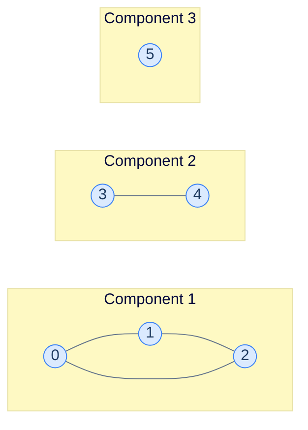
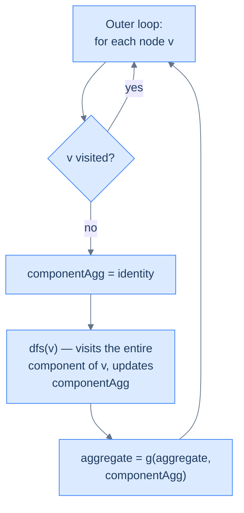

# 13. Pattern: Connected components

This lesson teaches you the **connected-components pattern** — the recipe for finding, counting, or summarising the disjoint pieces of an undirected graph (or grid).

## Table of contents

1. [What is a connected component?](#what-is-a-connected-component)
2. [The pattern template](#the-pattern-template)
3. [Identifying the pattern](#identifying-the-pattern)
4. [Problem: Find connected components](#problem-find-connected-components)
5. [Problem: Sum of minimums](#problem-sum-of-minimums)
6. [Problem: Island count](#problem-island-count)
7. [Problem: Size of largest island](#problem-size-of-largest-island)

***

# What Is a Connected Component?

Take any undirected graph. Walk it. The set of nodes you can reach from your starting point is a **connected component** — a maximal subgraph where every node has a path to every other.



<p align="center"><strong>Three connected components: a triangle (0-1-2), an edge (3-4), and a singleton (5). No edges go between components.</strong></p>

A connected graph has *exactly one* component. A disconnected graph has more — and many real-world questions are really questions about components: *"how many islands?"*, *"how many distinct social cliques?"*, *"how many isolated computers?"*

> **Note.** "Connected component" is the term for *undirected* graphs. Directed graphs have a more complex structure called *strongly connected components* (where you can reach every node *and* return). We're keeping things to undirected here.

***

# The Pattern Template

The pattern problem looks like this:

> Aggregate some function `f` over the nodes of *every* connected component, then aggregate those per-component values across all components using `g`.

| Problem | `f` (per node) | `g` (across components) |
|---|---|---|
| Count components | +1 | Sum (or just count) |
| List nodes per component | Append node to list | Append list to result |
| Sum of minimum values | Take min of value seen so far | Sum |
| Largest component size | +1 | Max |
| Count islands | (visit a cell) | +1 (each DFS-init = one new island) |

The structure is **identical across all of them**. Loop over every node; whenever you find an unvisited node, run DFS from it to absorb its entire component into a per-component aggregate; combine that aggregate into the global result.

---

## The Generic Algorithm

```
componentPattern(graph):
    visited = empty set
    aggregate = identity_g                        # default for g
    
    for each node v in graph:
        if v not visited:
            componentAggregate = identity_f       # reset per component
            dfs(v, ..., componentAggregate, visited)
            aggregate = g(aggregate, componentAggregate)
    
    return aggregate

dfs(node, ..., componentAggregate, visited):
    visited.add(node)
    componentAggregate = f(componentAggregate, node)
    
    for each neighbour n of node:
        if n not in visited:
            dfs(n, ..., componentAggregate, visited)
```

The pattern's defining feature: **the per-component aggregate is reset between components**, but the visited set is **not** — visited is global, accumulating across all components.



<p align="center"><strong>The two-level loop. The outer loop discovers components; the inner DFS exhausts each one. The reset-on-discovery is the heartbeat of the pattern.</strong></p>

***

# Identifying the Pattern

The signal-words to look for in problem statements:

- *"How many groups / cliques / islands / regions / components?"*
- *"For each disconnected piece, return …"*
- *"Find the largest / smallest / sum / min / max over all components"*
- *"Process every isolated subgraph"*

If the problem talks about **independent groups** of nodes/cells, with **no interaction** between groups, you're looking at the connected-components pattern. The graph might be explicit (adjacency list) or implicit (a grid).

We'll work through four problems — two graph-flavoured, two grid-flavoured — to cement the recipe.

***

# Problem: Find Connected Components

## The Problem

Given an undirected graph and a `values` array, return a list of all connected components — but only of the *visitable* nodes (`values[i] > 0`).

```
Input:  graph = [[1], [0, 2], [1, 3], [2, 4], [3, 5], [4, 6], [5]],
        values = [1, 0, 1, 0, 1, 0, 1]
Output: [[0], [2], [4], [6]]
```

The "visitable" twist makes the problem more interesting: nodes with `values[i] == 0` block the DFS entirely, so a chain of zeros isolates the visitable nodes from each other.

<details>
<summary><h2>Pattern Mapping</h2></summary>


- `f`: append node to current component's list.
- `g`: append the component to the master result list.
- *Visitability filter*: only descend into neighbours where `values[neighbour] > 0`.

</details>
<details>
<summary><h2>The Solution</h2></summary>


```python run
from typing import List, Set

class Solution:
    def dfs(
        self,
        graph: List[List[int]],
        node: int,
        values: List[int],
        visited: Set[int],
        component: List[int],
    ) -> None:

        # Mark the current node as visited in the graph to avoid
        # visiting it again
        visited.add(node)

        # Add the current node to the component list
        component.append(node)

        # Traverse all the neighbours of the current node
        for neighbour in graph[node]:

            # If the neighbour is not visited and has a positive value,
            # recursively visit it
            if neighbour not in visited and values[neighbour] != 0:

                # Recursively visit all the nodes in the connected
                # component
                self.dfs(graph, neighbour, values, visited, component)

    def connected_components(
        self, graph: List[List[int]], values: List[int]
    ) -> List[List[int]]:

        # Number of nodes in the graph
        n = len(graph)

        # Initialize visited set
        visited: Set[int] = set()

        # Initialize a list to store the connected components
        components: List[List[int]] = []

        # Iterate through all nodes in the graph
        for node in range(n):

            # Start DFS only if node is unvisited and has a positive
            # value, visiting all nodes in the connected component
            # and adding them to the components list
            if values[node] > 0 and node not in visited:

                # Create a new component to store the nodes in the
                # connected component
                component: List[int] = []

                # Start DFS from the current node and find all nodes
                # in the connected component
                self.dfs(graph, node, values, visited, component)

                # Add the found component to the components list
                components.append(component)

        # Return the list of connected components
        return components


# Examples from the problem statement
print(Solution().connected_components([[1],[0,2],[1,3],[2,4],[3,5],[4,6],[5]], [1,0,1,0,1,0,1]))  # [[0],[2],[4],[6]]
print(Solution().connected_components([[1],[0],[],[4],[3]], [1,1,1,1,1]))  # [[0,1],[2],[3,4]]

# Edge cases
print(Solution().connected_components([], []))                    # []
print(Solution().connected_components([[]], [1]))                  # [[0]]
print(Solution().connected_components([[]], [0]))                  # [] — zero value, unvisitable
print(Solution().connected_components([[1],[0]], [1,1]))           # [[0,1]]
print(Solution().connected_components([[1],[0]], [1,0]))           # [[0]] — node 1 blocked
# All zeros
print(Solution().connected_components([[1],[0]], [0,0]))           # []
```

```java run
import java.util.*;

public class Main {
    static class Solution {
        private void dfs(
            List<List<Integer>> graph,
            int node,
            int[] values,
            Set<Integer> visited,
            List<Integer> component
        ) {

            // Mark the current node as visited in the graph to avoid
            // visiting it again
            visited.add(node);

            // Add the current node to the component list
            component.add(node);

            // Traverse all the neighbours of the current node
            for (int neighbour : graph.get(node)) {

                // If the neighbour is not visited and has a positive value,
                // recursively visit it
                if (!visited.contains(neighbour) && values[neighbour] != 0) {

                    // Recursively visit all the nodes in the connected
                    // component
                    dfs(graph, neighbour, values, visited, component);
                }
            }
        }

        public List<List<Integer>> connectedComponents(
            List<List<Integer>> graph,
            int[] values
        ) {

            // Number of nodes in the graph
            int N = graph.size();

            // Initialize visited set
            Set<Integer> visited = new HashSet<>();

            // Initialize a list to store the connected components
            List<List<Integer>> components = new ArrayList<>();

            // Iterate through all nodes in the graph
            for (int node = 0; node < N; node++) {

                // Start DFS only if node is unvisited and has a positive
                // value, visiting all nodes in the connected component
                // and adding them to the components list
                if (values[node] > 0 && !visited.contains(node)) {

                    // Create a new component to store the nodes in the
                    // connected component
                    List<Integer> component = new ArrayList<>();

                    // Start DFS from the current node and find all nodes
                    // in the connected component
                    dfs(graph, node, values, visited, component);

                    // Add the found component to the components list
                    components.add(component);
                }
            }

            // Return the list of connected components
            return components;
        }
    }

    public static void main(String[] args) {
        Solution sol = new Solution();

        // Examples from the problem statement
        System.out.println(sol.connectedComponents(List.of(List.of(1),List.of(0,2),List.of(1,3),List.of(2,4),List.of(3,5),List.of(4,6),List.of(5)), new int[]{1,0,1,0,1,0,1}));  // [[0],[2],[4],[6]]
        System.out.println(sol.connectedComponents(List.of(List.of(1),List.of(0),new ArrayList<>(),List.of(4),List.of(3)), new int[]{1,1,1,1,1}));  // [[0,1],[2],[3,4]]

        // Edge cases
        System.out.println(sol.connectedComponents(new ArrayList<>(), new int[]{}));  // []
        System.out.println(sol.connectedComponents(List.of(new ArrayList<>()), new int[]{1}));  // [[0]]
        System.out.println(sol.connectedComponents(List.of(new ArrayList<>()), new int[]{0}));  // []
        System.out.println(sol.connectedComponents(List.of(List.of(1), List.of(0)), new int[]{1,1}));  // [[0,1]]
        System.out.println(sol.connectedComponents(List.of(List.of(1), List.of(0)), new int[]{1,0}));  // [[0]]
        System.out.println(sol.connectedComponents(List.of(List.of(1), List.of(0)), new int[]{0,0}));  // []
    }
}
```

</details>


***

# Problem: Sum of Minimums

## The Problem

For each connected component, find the minimum `value` among its nodes. Return the **sum of those minima** across all components.

```
Input:  graph = [[1], [0, 4], [3], [2], [1]], values = [2, 5, 1, 6, 7]
Output: 3
Explanation: Component {0, 1, 4} has min(2, 5, 7) = 2.
             Component {2, 3} has min(1, 6) = 1.
             2 + 1 = 3.
```

<details>
<summary><h2>Pattern Mapping</h2></summary>


- `f`: take min of running component-min and current node's value.
- `g`: sum across components.

The DFS now *returns* the component min instead of building a list. That's a small but important variation: the per-component aggregate doesn't need to be a parameter — it can be the function's return value.

</details>
<details>
<summary><h2>The Solution</h2></summary>


```python run
from typing import List, Set

class Solution:
    def dfs(
        self,
        graph: List[List[int]],
        node: int,
        visited: Set[int],
        values: List[int],
    ) -> int:

        # Mark the current node as visited in the graph to avoid
        # visiting it again
        visited.add(node)

        # Make this as the minimum value so far
        minimum_so_far = values[node]

        # Traverse all the neighbours of the current node
        for neighbour in graph[node]:

            # If the neighbour is not visited, recursively call the DFS
            # function on the neighbour
            if neighbour not in visited:

                # Get the minimum value from all the connected nodes
                min_val = self.dfs(graph, neighbour, visited, values)

                # Update minimum_so_far if there was another node smaller
                # than it
                minimum_so_far = min(minimum_so_far, min_val)

        # Return the minimum value for this component
        return minimum_so_far

    def sum_of_minimums(
        self, graph: List[List[int]], values: List[int]
    ) -> int:

        # Number of nodes in the graph
        n = len(graph)

        # If the graph is empty, return 0
        if n == 0:
            return 0

        # Initialize visited set
        visited: Set[int] = set()

        # Initialise the minimum sum to 0
        min_sum = 0

        # Traverse all nodes in the graph
        for node in range(n):

            # If the node is already visited, all the nodes connected to
            # it are also visited
            if node in visited:
                continue

            # Perform DFS on this new node to visit all the nodes
            # connected to it and get the minimum value in it.
            min_val = self.dfs(graph, node, visited, values)

            # Add the min_val to the min_sum variable
            min_sum += min_val

        # Return the size of min_sum
        return min_sum


# Examples from the problem statement
print(Solution().sum_of_minimums([[1],[0,4],[3],[2],[1]], [2,5,1,6,7]))  # 3
print(Solution().sum_of_minimums([[1],[0],[],[4],[3]], [2,5,1,6,7]))     # 9

# Edge cases
print(Solution().sum_of_minimums([], []))                               # 0
print(Solution().sum_of_minimums([[]], [5]))                             # 5
print(Solution().sum_of_minimums([[1],[0]], [3,7]))                      # 3
print(Solution().sum_of_minimums([[],[],[]], [4,2,9]))                   # 15 — 3 isolated nodes
print(Solution().sum_of_minimums([[1,2],[0],[0]], [1,2,3]))              # 1 — one component
```

```java run
import java.util.*;

public class Main {
    static class Solution {
        private int dfs(
            List<List<Integer>> graph,
            int node,
            Set<Integer> visited,
            int[] values
        ) {

            // Mark the current node as visited in the graph to avoid
            // visiting it again
            visited.add(node);

            // Make this as the minimum value so far
            int minimumSoFar = values[node];

            // Traverse all the neighbours of the current node
            for (int neighbour : graph.get(node)) {

                // If the neighbour is not visited, recursively call the DFS
                // function on the neighbour
                if (!visited.contains(neighbour)) {

                    // Get the minimum value from all the connected nodes
                    int minVal = dfs(graph, neighbour, visited, values);

                    // Update minimumSoFar if there was another node smaller
                    // than it
                    minimumSoFar = Math.min(minimumSoFar, minVal);
                }
            }

            // Return the minimum value for this component
            return minimumSoFar;
        }

        public int sumOfMinimums(List<List<Integer>> graph, int[] values) {

            // Number of nodes in the graph
            int N = graph.size();

            // If the graph is empty, return 0
            if (N == 0) {
                return 0;
            }

            // Initialize visited set
            Set<Integer> visited = new HashSet<>();

            // Initialise the minimum sum to 0
            int minSum = 0;

            // Traverse all nodes in the graph
            for (int node = 0; node < N; node++) {

                // If the node is already visited, continue to the next node
                if (visited.contains(node)) {
                    continue;
                }

                // Perform DFS on this new node to visit all the nodes
                // connected to it and get the minimum value in it.
                int minVal = dfs(graph, node, visited, values);

                // Add the minVal to the minSum variable
                minSum += minVal;
            }

            // Return the size of minSum
            return minSum;
        }
    }

    public static void main(String[] args) {
        Solution sol = new Solution();

        // Examples from the problem statement
        System.out.println(sol.sumOfMinimums(List.of(List.of(1),List.of(0,4),List.of(3),List.of(2),List.of(1)), new int[]{2,5,1,6,7}));  // 3
        System.out.println(sol.sumOfMinimums(List.of(List.of(1),List.of(0),new ArrayList<>(),List.of(4),List.of(3)), new int[]{2,5,1,6,7}));  // 9

        // Edge cases
        System.out.println(sol.sumOfMinimums(new ArrayList<>(), new int[]{}));  // 0
        System.out.println(sol.sumOfMinimums(List.of(new ArrayList<>()), new int[]{5}));  // 5
        System.out.println(sol.sumOfMinimums(List.of(List.of(1), List.of(0)), new int[]{3,7}));  // 3
        System.out.println(sol.sumOfMinimums(List.of(new ArrayList<>(), new ArrayList<>(), new ArrayList<>()), new int[]{4,2,9}));  // 15
        System.out.println(sol.sumOfMinimums(List.of(List.of(1,2), List.of(0), List.of(0)), new int[]{1,2,3}));  // 1
    }
}
```

</details>


***

# Problem: Island Count

## The Problem

A grid of `0`s and `1`s. `1` = land, `0` = water. An **island** is a maximal group of connected `1`s. Two land cells are connected if they're adjacent in **any of 8 directions** (cardinals + diagonals).

Return the number of islands.

```
Input:  grid = [[1, 1, 0, 0],
                [0, 0, 1, 1],
                [1, 0, 1, 1],
                [1, 0, 0, 0]]
Output: 2
```

<details>
<summary><h2>Pattern Mapping</h2></summary>


The grid is just a graph in disguise. Each cell is a node. Each "is-adjacent" relation is an edge.

- `f`: nothing per-cell (just visit).
- `g`: +1 per island found.
- *Connectivity*: 8 directions instead of 4.

The 8-direction array is the only structural change from grid traversal in lesson 5.

</details>
<details>
<summary><h2>The Solution</h2></summary>


```python run
from typing import List, Tuple

class Solution:
    def is_valid_cell(
        self, grid: List[List[int]], row: int, col: int
    ) -> bool:

        # Check if a cell is valid and belongs to a region of 1's, also
        # check that the cell is not water
        return (
            row >= 0
            and row < len(grid)
            and col >= 0
            and col < len(grid[0])
            and grid[row][col] == 1
        )

    def dfs(
        self,
        grid: List[List[int]],
        row: int,
        col: int,
        visited: List[List[bool]],
    ) -> None:

        # Mark the current cell as visited
        visited[row][col] = True

        # Define the possible movements: all 8 directions (up, right, 
        # down, left, and diagonals)
        directions: List[Tuple[int, int]] = [
            (-1,  0), # Top
            (-1,  1), # Top-right
            (0,  1),  # Right
            (1,  1),  # Bottom-right
            (1,  0),  # Bottom
            (1, -1),  # Bottom-left
            (0, -1),  # Left
            (-1, -1), # Top-left
        ]

        # Check all 8 neighbouring cells
        for dr, dc in directions:
            new_row = row + dr
            new_col = col + dc

            # If the neighbour is not visited, recursively call the DFS
            # function on the neighbour
            if (
                self.is_valid_cell(grid, new_row, new_col)
                and not visited[new_row][new_col]
            ):
                self.dfs(grid, new_row, new_col, visited)

    def island_count(self, grid: List[List[int]]) -> int:
        rows = len(grid)

        # Check if the grid is empty
        if rows == 0:
            return 0

        cols = len(grid[0])

        # Initialise the island count to 0
        islands = 0

        # Initialize visited array
        visited = [[False] * cols for _ in range(rows)]

        # Traverse each cell of the grid
        for row in range(rows):
            for col in range(cols):

                # If the cell is a water cell or it's already visited,
                # all the cells connected to it are also visited
                if grid[row][col] == 0 or visited[row][col]:
                    continue

                # Found a new land cell
                islands += 1

                # Perform DFS on this new cell to visit all the cells
                # connected to it.
                self.dfs(grid, row, col, visited)

        # Return the number of islands
        return islands


# Examples from the problem statement
print(Solution().island_count([[1,1,0,0],[0,0,1,1],[1,0,1,1],[1,0,0,0]]))  # 2
print(Solution().island_count([[1,1,0,0],[0,1,1,1],[1,0,1,1],[1,0,0,0]]))  # 1

# Edge cases
print(Solution().island_count([]))                                          # 0
print(Solution().island_count([[0]]))                                       # 0
print(Solution().island_count([[1]]))                                       # 1
print(Solution().island_count([[0,0,0],[0,0,0]]))                           # 0
print(Solution().island_count([[1,1],[1,1]]))                               # 1
print(Solution().island_count([[1,0,1],[0,0,0],[1,0,1]]))                   # 4
```

```java run
import java.util.*;

public class Main {
    static class Solution {
        private boolean isValidCell(int[][] grid, int row, int col) {

            // Check if a cell is valid and belongs to a region of 1's, also
            // check that the cell is not water
            return (
                row >= 0 &&
                row < grid.length &&
                col >= 0 &&
                col < grid[0].length &&
                grid[row][col] == 1
            );
        }

        private void dfs(
            int[][] grid,
            int row,
            int col,
            boolean[][] visited
        ) {

            // Mark the current cell as visited
            visited[row][col] = true;

            // Define the possible movements: all 8 directions (up, right, 
            // down, left, and diagonals)
            int[][] directions = {
                {-1,  0}, // Top
                {-1,  1}, // Top-right
                {0,  1},  // Right
                {1,  1},  // Bottom-right
                {1,  0},  // Bottom
                {1, -1},  // Bottom-left
                {0, -1},  // Left
                {-1, -1}  // Top-left
            };

            // Check all 8 neighbouring cells
            for (int[] dir : directions) {
                int newRow = row + dir[0];
                int newCol = col + dir[1];

                // If the neighbour is not visited, recursively call the DFS
                // function on the neighbour
                if (
                    isValidCell(grid, newRow, newCol) &&
                    !visited[newRow][newCol]
                ) {
                    dfs(grid, newRow, newCol, visited);
                }
            }
        }

        public int islandCount(int[][] grid) {
            int rows = grid.length;

            // Check if the grid is empty
            if (rows == 0) {
                return 0;
            }

            int cols = grid[0].length;

            // Initialise the island count to 0
            int islands = 0;

            // Initialize visited array
            boolean[][] visited = new boolean[rows][cols];

            // Traverse each cell of the grid
            for (int row = 0; row < rows; row++) {
                for (int col = 0; col < cols; col++) {

                    // If the cell is a water cell or it's already visited,
                    // all the cells connected to it are also visited
                    if (grid[row][col] == 0 || visited[row][col]) {
                        continue;
                    }

                    // Found a new land cell
                    islands++;

                    // Perform DFS on this new cell to visit all the cells
                    // connected to it.
                    dfs(grid, row, col, visited);
                }
            }

            // Return the number of islands
            return islands;
        }
    }

    public static void main(String[] args) {
        Solution sol = new Solution();

        // Examples from the problem statement
        System.out.println(sol.islandCount(new int[][]{{1,1,0,0},{0,0,1,1},{1,0,1,1},{1,0,0,0}}));  // 2
        System.out.println(sol.islandCount(new int[][]{{1,1,0,0},{0,1,1,1},{1,0,1,1},{1,0,0,0}}));  // 1

        // Edge cases
        System.out.println(sol.islandCount(new int[][]{}));                          // 0
        System.out.println(sol.islandCount(new int[][]{{0}}));                       // 0
        System.out.println(sol.islandCount(new int[][]{{1}}));                       // 1
        System.out.println(sol.islandCount(new int[][]{{0,0,0},{0,0,0}}));           // 0
        System.out.println(sol.islandCount(new int[][]{{1,1},{1,1}}));               // 1
        System.out.println(sol.islandCount(new int[][]{{1,0,1},{0,0,0},{1,0,1}}));   // 4
    }
}
```

</details>


***

# Problem: Size of Largest Island

## The Problem

Same grid, same 8-direction connectivity. Now return the **size** (cell count) of the *largest* island.

```
Input:  same grid as before
Output: 6
```

<details>
<summary><h2>Pattern Mapping</h2></summary>


- `f`: +1 per cell visited.
- `g`: max across components.

The key change: DFS now **returns the size** of the component instead of just side-effecting visited.

</details>
<details>
<summary><h2>Solution &amp; Analysis</h2></summary>

### The Solution

```python run
from typing import List, Tuple

class Solution:
    def is_valid_cell(
        self, grid: List[List[int]], row: int, col: int
    ) -> bool:

        # Check if a cell is valid and belongs to a region of 1's, also
        # check that the cell is not water
        return (
            row >= 0
            and row < len(grid)
            and col >= 0
            and col < len(grid[0])
            and grid[row][col] == 1
        )

    def dfs(
        self,
        grid: List[List[int]],
        row: int,
        col: int,
        visited: List[List[bool]],
    ) -> int:

        # Mark the current cell as visited
        visited[row][col] = True

        # Define the possible movements: all 8 directions (up, right, 
        # down, left, and diagonals)
        directions: List[Tuple[int, int]] = [
            (-1,  0), # Top
            (-1,  1), # Top-right
            (0,  1),  # Right
            (1,  1),  # Bottom-right
            (1,  0),  # Bottom
            (1, -1),  # Bottom-left
            (0, -1),  # Left
            (-1, -1), # Top-left
        ]

        # Initialize the size of the region
        size = 1

        # Check all 8 neighbouring cells
        for dr, dc in directions:
            new_row = row + dr
            new_col = col + dc

            # If the neighbour is not visited, recursively call the DFS
            # function on the neighbour
            if (
                self.is_valid_cell(grid, new_row, new_col)
                and not visited[new_row][new_col]
            ):
                size += self.dfs(grid, new_row, new_col, visited)

        return size

    def size_of_largest_island(self, grid: List[List[int]]) -> int:
        rows = len(grid)

        # Check if the grid is empty
        if rows == 0:
            return 0

        cols = len(grid[0])

        # Initialise the largest island size to 0
        largest_island_size = 0

        # Initialize visited array
        visited = [[False] * cols for _ in range(rows)]

        # Traverse each cell of the grid
        for row in range(rows):
            for col in range(cols):

                # If the cell is a water cell or it's already visited,
                # all the cells connected to it are also visited
                if grid[row][col] == 0 or visited[row][col]:
                    continue

                # Perform DFS on this new cell to visit all the cells
                # connected to it and get the size of this island.
                island_size = self.dfs(grid, row, col, visited)

                # Update the size of the largest island
                largest_island_size = max(
                    largest_island_size, island_size
                )

        # Return the size of the largest island
        return largest_island_size


# Examples from the problem statement
print(Solution().size_of_largest_island([[1,1,0,0],[0,0,1,1],[1,0,1,1],[1,0,0,0]]))  # 6
print(Solution().size_of_largest_island([[1,1,0,0],[0,1,1,1],[1,0,1,1],[1,0,0,0]]))  # 9

# Edge cases
print(Solution().size_of_largest_island([]))                                          # 0
print(Solution().size_of_largest_island([[0]]))                                       # 0
print(Solution().size_of_largest_island([[1]]))                                       # 1
print(Solution().size_of_largest_island([[1,1],[1,1]]))                               # 4
print(Solution().size_of_largest_island([[1,0,1],[0,0,0],[1,0,1]]))                   # 1
print(Solution().size_of_largest_island([[0,0],[0,0]]))                               # 0
```

```java run
import java.util.*;

public class Main {
    static class Solution {
        private boolean isValidCell(int[][] grid, int row, int col) {

            // Check if a cell is valid and belongs to a region of 1's, also
            // check that the cell is not water
            return (
                row >= 0 &&
                row < grid.length &&
                col >= 0 &&
                col < grid[0].length &&
                grid[row][col] == 1
            );
        }

        private int dfs(int[][] grid, int row, int col, boolean[][] visited) {

            // Mark the current cell as visited
            visited[row][col] = true;

            // Define the possible movements: all 8 directions (up, right, 
            // down, left, and diagonals)
            int[][] directions = {
                {-1,  0}, // Top
                {-1,  1}, // Top-right
                {0,  1},  // Right
                {1,  1},  // Bottom-right
                {1,  0},  // Bottom
                {1, -1},  // Bottom-left
                {0, -1},  // Left
                {-1, -1}  // Top-left
            };

            // Initialize the size of the region
            int size = 1;

            // Check all 8 neighbouring cells
            for (int[] dir : directions) {
                int newRow = row + dir[0];
                int newCol = col + dir[1];

                // If the neighbour is not visited, recursively call the DFS
                // function on the neighbour
                if (
                    isValidCell(grid, newRow, newCol) &&
                    !visited[newRow][newCol]
                ) {
                    size += dfs(grid, newRow, newCol, visited);
                }
            }

            return size;
        }

        public int sizeOfLargestIsland(int[][] grid) {
            int rows = grid.length;

            // Check if the grid is empty
            if (rows == 0) {
                return 0;
            }

            int cols = grid[0].length;

            // Initialise the largest island size to 0
            int largestIslandSize = 0;

            // Initialize visited array
            boolean[][] visited = new boolean[rows][cols];

            // Traverse each cell of the grid
            for (int row = 0; row < rows; row++) {
                for (int col = 0; col < cols; col++) {

                    // If the cell is a water cell or it's already visited,
                    // all the cells connected to it are also visited
                    if (grid[row][col] == 0 || visited[row][col]) {
                        continue;
                    }

                    // Perform DFS on this new cell to visit all the cells
                    // connected to it and get the size of this island.
                    int islandSize = dfs(grid, row, col, visited);

                    // Update the size of the largest island
                    largestIslandSize = Math.max(
                        largestIslandSize,
                        islandSize
                    );
                }
            }

            // Return the size of the largest island
            return largestIslandSize;
        }
    }

    public static void main(String[] args) {
        Solution sol = new Solution();

        // Examples from the problem statement
        System.out.println(sol.sizeOfLargestIsland(new int[][]{{1,1,0,0},{0,0,1,1},{1,0,1,1},{1,0,0,0}}));  // 6
        System.out.println(sol.sizeOfLargestIsland(new int[][]{{1,1,0,0},{0,1,1,1},{1,0,1,1},{1,0,0,0}}));  // 9

        // Edge cases
        System.out.println(sol.sizeOfLargestIsland(new int[][]{}));                          // 0
        System.out.println(sol.sizeOfLargestIsland(new int[][]{{0}}));                       // 0
        System.out.println(sol.sizeOfLargestIsland(new int[][]{{1}}));                       // 1
        System.out.println(sol.sizeOfLargestIsland(new int[][]{{1,1},{1,1}}));               // 4
        System.out.println(sol.sizeOfLargestIsland(new int[][]{{1,0,1},{0,0,0},{1,0,1}}));   // 1
        System.out.println(sol.sizeOfLargestIsland(new int[][]{{0,0},{0,0}}));               // 0
    }
}
```

### Complexity Analysis

| Problem | Time | Space |
|---|---|---|
| Connected components | O(N + E) | O(N) |
| Sum of minimums | O(N + E) | O(N) |
| Island count | O(R × C) | O(R × C) |
| Size of largest island | O(R × C) | O(R × C) |

Each cell or node is visited exactly once, total. The pattern's strength is that **any number of components** sums to the same `O(N + E)` because each node/edge is processed exactly once across *all* DFS calls combined — the outer-loop iterations don't multiply work, they just spread it.

</details>
<details>
<summary><h2>Final Takeaway</h2></summary>


The connected-components pattern is a tiny structural addition over a plain traversal: **a per-component aggregate that resets between components**. Once you see this two-level structure, dozens of "find / count / process every group" problems fold into the same template.

The pattern works equally on graphs (use the adjacency list) and grids (use the direction array). 4-direction or 8-direction connectivity is a trivial change. The choice between DFS and BFS doesn't matter — both walk the component once, in different orders.

Coming up: **two-colouring** — a cousin of the connected-components pattern that uses DFS/BFS to *paint* every node and check for a contradiction. It's the algorithm that decides whether a graph is bipartite.

> **Transfer challenge.** A photo of a chessboard has been corrupted — some squares are white, some black, some grey (unknown). You're told the original was a valid chessboard (white and black alternate). Sketch how connected-components could detect whether the corruption is consistent with an original chessboard.

</details>
<details>
<summary><strong>Sketch</strong></summary>

Treat each non-grey cell as a node; connect cells sharing an edge that are *both* non-grey. For each component, check every adjacent pair: are their colours opposite (W next to B, B next to W)? If yes for every adjacency in every component, the corruption is consistent. If no, it's not.

This is *almost* two-colouring (next lesson) — components do the partitioning, two-colouring does the consistency check. Combining both gives the full chessboard test.

</details>
