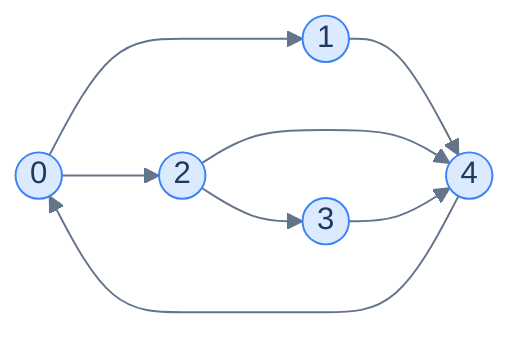
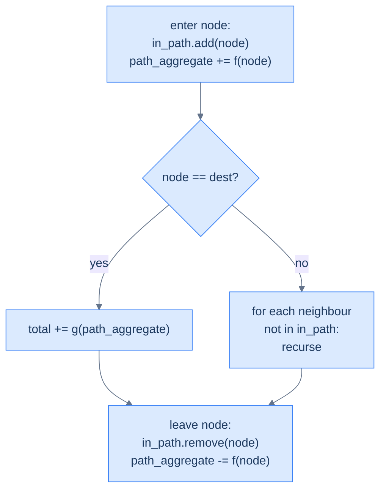

# Why DFS Is More Than Traversal

In lesson 4 you used DFS as a *traversal* — a way to visit every node exactly once. That's its simplest use. But DFS has a second, much more powerful use: **enumerating paths**.

Every recursive call walks deeper into one specific path. Every `return` after the recursive call backtracks one step and tries an alternative. With a small twist on the basic traversal — **track which nodes are *currently on the path* (not which have *ever* been visited)** — DFS becomes a tool for exploring every possible route from source to destination.

> 🖼 Diagram — How many paths exist from 0 to 4? Try to count by hand. The answer is 3 — and DFS systematically enumerates them.


<p align="center"><strong>How many paths exist from 0 to 4? Try to count by hand. The answer is 3 — and DFS systematically enumerates them.</strong></p>

The "currently on path" set replaces the "visited" set. Without this swap, a node could only be visited once across the whole algorithm — and we'd miss paths that legitimately revisit nodes via a different route. The set behaves like a **stack** that mirrors the recursion: push on entry, pop on exit. When the node leaves the stack, it's available for use in *other* paths through it.

> *Before reading on — for the graph above, list all 3 paths from node 0 to node 4. Try to do it without code. Why did you have to "back up" each time?*

The paths: `0 → 1 → 4`, `0 → 2 → 4`, `0 → 2 → 3 → 4`. After exploring the second one, you "backed up" to node 2 to try its other neighbour (3). After the third, you backed up to 0 to try… nothing more, you've exhausted the options. That backtrack-as-you-go process is *exactly* what DFS does, and the path stack is what tracks where you are.

# The DFS Pattern Template

The general DFS-pattern problem looks like this:

> Given a graph, a source `s`, and a destination `t`, **aggregate** some function `f` over the nodes (or edges) of every valid `s → t` path, then **aggregate** those per-path values using a function `g`.

Different choices of `f` and `g` give different problems:

| Problem | `f` (per node) | `g` (across paths) |
|---|---|---|
| List all paths | Append node to current path | Add path to result list |
| Count paths | +1 | Sum |
| Sum of all path weights | Add edge weight | Sum |
| Max-weight path | Add edge weight | Max |
| Number of paths matching a constraint | Check & set flag | Count flagged |
| All Hamiltonian paths | Like "all paths" + length check | Filter by length == N |

The structure of the algorithm is **identical** across all of them. Only the per-node and per-path operations change.

---

## The Generic Algorithm

```
dfs(node, graph, in_path, path_aggregate, total_aggregate):
    in_path.add(node)
    path_aggregate <- f(path_aggregate, node)        # apply f
    
    if node == destination:
        total_aggregate <- g(total_aggregate, path_aggregate)   # apply g
    else:
        for neighbour in graph[node]:
            if neighbour not in in_path:
                dfs(neighbour, ...)
    
    in_path.remove(node)
    path_aggregate <- f⁻¹(path_aggregate, node)      # UNDO f on backtrack
```

The four key steps that distinguish this from a plain traversal:

1. **`in_path` is the current-path stack**, not a global visited set.
2. **`f` is applied on entry** to update the running per-path aggregate.
3. **`g` is applied at the destination** to absorb a complete path's contribution.
4. **`f⁻¹` is applied on exit** to undo the entry's update before backtracking — keeping `path_aggregate` correct for the parent's other branches.

> 🖼 Diagram — The DFS-pattern recipe. The "leave node" step is what makes the algorithm correct — without undoing on the way out, sibling branches inherit a polluted aggregate.


<p align="center"><strong>The DFS-pattern recipe. The "leave node" step is what makes the algorithm correct — without undoing on the way out, sibling branches inherit a polluted aggregate.</strong></p>

The "undo on exit" step is the most-forgotten line in DFS-pattern code. Plant a sticky note: **whatever you change on entry, undo on exit.**

# Identifying the Pattern

You can recognise a DFS-pattern problem by these signals:

- The problem mentions **paths** between two specific nodes.
- It asks for *all*, *count*, *sum*, *max*, *min*, or *exists* over those paths.
- The same node may appear in different paths (so a per-traversal "visited" set won't do — we need the per-path "in_path" set instead).
- The graph is **small enough** that exponential enumeration is acceptable. (Path counts can be exponential in N — DFS is for problems where N ≤ ~20 or the graph is sparse.)

A non-exhaustive list of problems that fit:

- All paths from source to destination
- Paths with sum equal to a target value
- Hamiltonian paths (a path visiting every node exactly once)
- Cycles passing through specific nodes
- Maze "all routes" from entrance to exit
- Combination/permutation generation (these *are* DFS on an implicit graph)

If your problem has any of these flavours, you reach for DFS — and you write the same skeleton every time, just with different `f` / `g` operations.

We'll now apply the template to four classic problems, each with a different choice of `f` and `g`.

<!-- ============================================== -->
<!-- SWEEP 2 — missing sections (placeholders only) -->
<!-- ============================================== -->

<!-- TODO: Understanding the Pattern — missing, needs to be written -->
<!--       Guidance: umbrella H2 with the subsections below -->

<!-- TODO: Why Naive Isn't Enough — missing, needs to be written -->
<!--       Guidance: motivation for why the obvious approach fails -->

<!-- TODO: The Core Idea — missing, needs to be written -->
<!--       Guidance: one paragraph: the central trick -->

<!-- TODO: How the Pointers/Window Move — missing, needs to be written -->
<!--       Guidance: mechanics of the moving parts -->

<!-- TODO: Generic Implementation — missing, needs to be written -->
<!--       Guidance: Python block + Java block of the skeleton -->

<!-- TODO: Complexity Analysis — missing, needs to be written -->
<!--       Guidance: table -->

<!-- TODO: Variants / Taxonomy — missing, needs to be written -->
<!--       Guidance: enumerate sub-shapes of this pattern -->

<!-- TODO: Recognition Checklist — missing, needs to be written -->
<!--       Guidance: 4-question diagnostic — the source of the Problem-section Diagnostic Questions -->

<!-- TODO: Canonical Example — missing, needs to be written -->
<!--       Guidance: fully worked example: brute force → optimised → template fit -->

<!-- TODO: Problems in This Category — missing, needs to be written -->
<!--       Guidance: table with links to the 02-problems/ files -->
