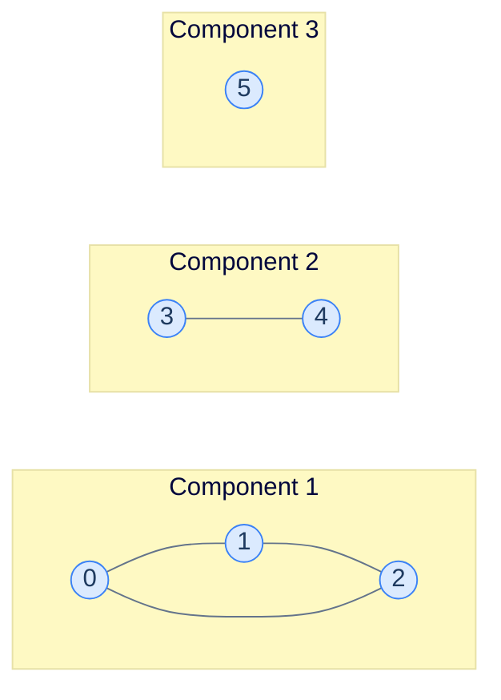
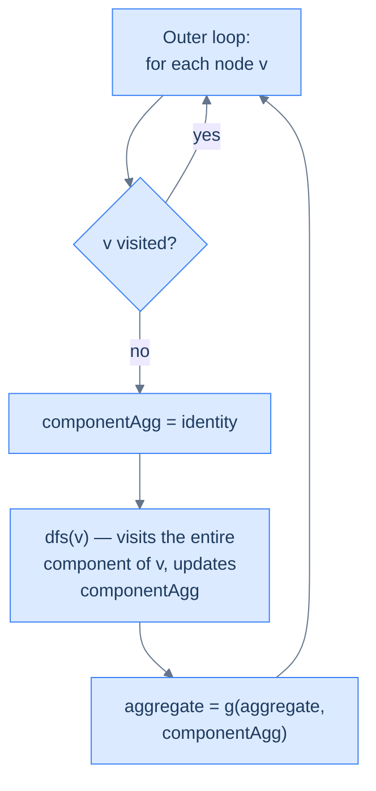

# What Is a Connected Component?

Take any undirected graph. Walk it. The set of nodes you can reach from your starting point is a **connected component** — a maximal subgraph where every node has a path to every other.

> 🖼 Diagram — Three connected components: a triangle (0-1-2), an edge (3-4), and a singleton (5). No edges go between components.


<p align="center"><strong>Three connected components: a triangle (0-1-2), an edge (3-4), and a singleton (5). No edges go between components.</strong></p>

A connected graph has *exactly one* component. A disconnected graph has more — and many real-world questions are really questions about components: *"how many islands?"*, *"how many distinct social cliques?"*, *"how many isolated computers?"*

> **Note.** "Connected component" is the term for *undirected* graphs. Directed graphs have a more complex structure called *strongly connected components* (where you can reach every node *and* return). We're keeping things to undirected here.

# The Pattern Template

The pattern problem looks like this:

> Aggregate some function `f` over the nodes of *every* connected component, then aggregate those per-component values across all components using `g`.

| Problem | `f` (per node) | `g` (across components) |
|---|---|---|
| Count components | +1 | Sum (or just count) |
| List nodes per component | Append node to list | Append list to result |
| Sum of minimum values | Take min of value seen so far | Sum |
| Largest component size | +1 | Max |
| Count islands | (visit a cell) | +1 (each DFS-init = one new island) |

The structure is **identical across all of them**. Loop over every node; whenever you find an unvisited node, run DFS from it to absorb its entire component into a per-component aggregate; combine that aggregate into the global result.

---

## The Generic Algorithm

```
componentPattern(graph):
    visited = empty set
    aggregate = identity_g                        # default for g
    
    for each node v in graph:
        if v not visited:
            componentAggregate = identity_f       # reset per component
            dfs(v, ..., componentAggregate, visited)
            aggregate = g(aggregate, componentAggregate)
    
    return aggregate

dfs(node, ..., componentAggregate, visited):
    visited.add(node)
    componentAggregate = f(componentAggregate, node)
    
    for each neighbour n of node:
        if n not in visited:
            dfs(n, ..., componentAggregate, visited)
```

The pattern's defining feature: **the per-component aggregate is reset between components**, but the visited set is **not** — visited is global, accumulating across all components.

> 🖼 Diagram — The two-level loop. The outer loop discovers components; the inner DFS exhausts each one. The reset-on-discovery is the heartbeat of the pattern.


<p align="center"><strong>The two-level loop. The outer loop discovers components; the inner DFS exhausts each one. The reset-on-discovery is the heartbeat of the pattern.</strong></p>

# Identifying the Pattern

The signal-words to look for in problem statements:

- *"How many groups / cliques / islands / regions / components?"*
- *"For each disconnected piece, return …"*
- *"Find the largest / smallest / sum / min / max over all components"*
- *"Process every isolated subgraph"*

If the problem talks about **independent groups** of nodes/cells, with **no interaction** between groups, you're looking at the connected-components pattern. The graph might be explicit (adjacency list) or implicit (a grid).

We'll work through four problems — two graph-flavoured, two grid-flavoured — to cement the recipe.

<!-- ============================================== -->
<!-- SWEEP 2 — missing sections (placeholders only) -->
<!-- ============================================== -->

<!-- TODO: Understanding the Pattern — missing, needs to be written -->
<!--       Guidance: umbrella H2 with the subsections below -->

<!-- TODO: Why Naive Isn't Enough — missing, needs to be written -->
<!--       Guidance: motivation for why the obvious approach fails -->

<!-- TODO: The Core Idea — missing, needs to be written -->
<!--       Guidance: one paragraph: the central trick -->

<!-- TODO: How the Pointers/Window Move — missing, needs to be written -->
<!--       Guidance: mechanics of the moving parts -->

<!-- TODO: Generic Implementation — missing, needs to be written -->
<!--       Guidance: Python block + Java block of the skeleton -->

<!-- TODO: Complexity Analysis — missing, needs to be written -->
<!--       Guidance: table -->

<!-- TODO: Variants / Taxonomy — missing, needs to be written -->
<!--       Guidance: enumerate sub-shapes of this pattern -->

<!-- TODO: Recognition Checklist — missing, needs to be written -->
<!--       Guidance: 4-question diagnostic — the source of the Problem-section Diagnostic Questions -->

<!-- TODO: Canonical Example — missing, needs to be written -->
<!--       Guidance: fully worked example: brute force → optimised → template fit -->

<!-- TODO: Problems in This Category — missing, needs to be written -->
<!--       Guidance: table with links to the 02-problems/ files -->
