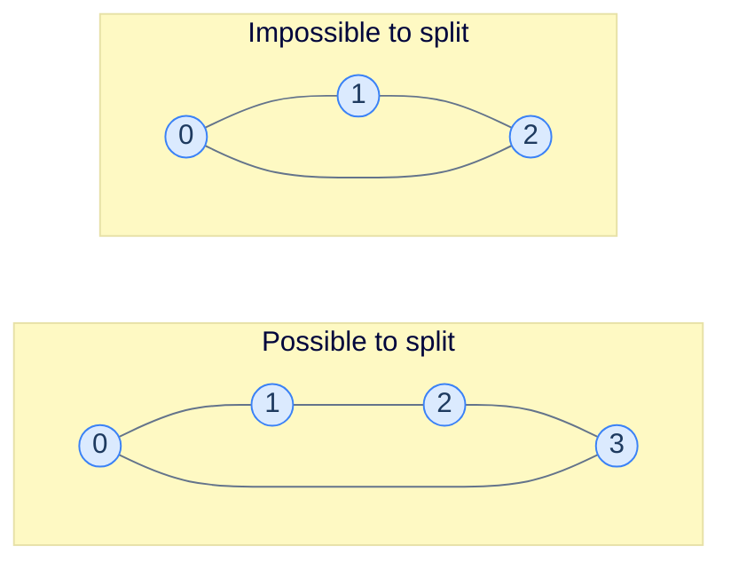

# 14. Pattern: Two colouring

This lesson teaches you the **two-colouring pattern** — the algorithm that decides "can the items in this graph be split into two camps such that every edge crosses the divide?" It's the test for **bipartiteness**, and a workhorse for problems involving conflicts, factions, or alternation.

## Table of contents

1. [The two-camps question](#the-two-camps-question)
2. [Two-colourable = bipartite](#two-colourable--bipartite)
3. [The colouring algorithm](#the-colouring-algorithm)
4. [Implementation](#implementation)
5. [Problem: Two colourable](#problem-two-colourable)
6. [Problem: Dislike pairs](#problem-dislike-pairs)
7. [Problem: Colour repair](#problem-colour-repair)

***

# The Two-Camps Question

You have a group of people, and a list of **dislike** pairs — pairs that *cannot* sit at the same table. You have only **two** tables. Can you seat everyone such that no two enemies share a table?



<p align="center"><strong>The 4-cycle on the left can be 2-coloured: {0, 2} red, {1, 3} blue. The 3-cycle on the right cannot — every assignment of colours forces *some* edge to have same-coloured endpoints.</strong></p>

The pattern shows up wherever you need to detect **antagonism** or **alternation**:

- **Conflict groups.** Can these students be assigned to two project teams so no two who dislike each other are paired?
- **Bipartite verification.** Is this assignment-style problem actually bipartite?
- **Chess-board colouring.** Can these tiles be painted black/white so no adjacent pair is same-coloured?
- **Job scheduling.** Can these jobs be split between two machines so no conflicting jobs run on the same one?
- **Network analysis.** Are these nodes really in two factions, or do internal conflicts make that decomposition impossible?

> *Before reading on — for the 4-cycle above, walk the colouring by hand: start with 0 = red. What must the other three colours be? Which edge is the "tightest"?*

Starting with 0 = red, then 1 must be blue (edge 0-1). Then 2 must be red (edge 1-2). Then 3 must be blue (edge 2-3). Now the closing edge: 3-0 = blue-red. ✓ All edges have opposite-coloured endpoints. Two-colourable.

For the 3-cycle: 0 = red, 1 = blue, 2 must be red (edge 1-2 forces opposite of blue). But edge 2-0: red-red. ✗ Conflict. Not two-colourable.

***

# Two-Colourable = Bipartite

A graph is **two-colourable** if and only if it is **bipartite**. The two terms describe the same property from different angles:

- **Two-colourable** is the algorithmic phrasing: "can I assign one of two labels to each node so adjacent labels differ?"
- **Bipartite** is the structural phrasing: "can the nodes be split into two sets `L` and `R` such that every edge crosses between sets?"

If you can two-colour, just declare "all reds = L, all blues = R" — the colour boundaries become the bipartition. Conversely, if the graph is bipartite, paint `L` red and `R` blue and you have a valid two-colouring.

Both views matter. The two-colour view drives the *algorithm*; the bipartite view drives the *application* (matching, network flow, …).

A famous theorem nails down when two-colouring works:

> **Theorem.** A graph is two-colourable if and only if it has no **odd-length cycle**.

The intuition: walking around an odd cycle, you flip the colour at each step, and after an odd number of flips you arrive back at the start with the *opposite* colour to where you began — a contradiction. Walking an even cycle returns you to the starting colour, no conflict. The 3-cycle above is a tiny version of this argument; any odd cycle, of any length, breaks colouring.

***

# The Colouring Algorithm

Use any traversal — DFS or BFS — and assign a colour at every step. The first node gets a starting colour; every neighbour gets the opposite colour; their neighbours flip back; and so on, alternating with depth.

The trick is the *check*: when you encounter a *visited* neighbour, verify that its colour is the *opposite* of the current node's. If not, it's a conflict, and the graph isn't two-colourable.

> **`colourGraph(node, graph, colour, colourValue)`**
> 1. `colour[node] = colourValue`
> 2. For each `neighbour` in `graph[node]`:
>    - If `neighbour` is uncoloured: recursively call with `1 - colourValue`. If the recursion returns false, return false.
>    - Else if `colour[neighbour] == colourValue` → return false (same-colour conflict).
> 3. Return true.
>
> **`isTwoColourable(graph)`**
> 1. Initialise `colour` map (empty).
> 2. For each unconnected component (= each uncoloured node): call `colourGraph` starting with colour 1. Return false if any component fails.
> 3. Return true.

The outer-loop wrapper handles disconnected graphs — a graph can have multiple components, each individually 2-colourable. We need *all* of them to succeed. (The reference implementation seeds each component with colour 1 and flips to 0 on the first hop; the two values are interchangeable — only the *alternation* matters. An empty graph has nothing to colour, and the implementation reports `false` for that degenerate input.)

> *Before reading on — what does the algorithm look like with BFS instead of DFS? Sketch the change in one sentence.*

With BFS: maintain a queue, push the source with colour 0, pop nodes, paint each neighbour the opposite colour and push it. The conflict check is the same. The choice between DFS and BFS doesn't matter for correctness; both walk every component and propagate the colour rule.

***

# Implementation

We'll use DFS — it's slightly more compact recursively. Colour values are 0 and 1 (or `false`/`true`); flipping is `1 - colour` (or `!colour`).


```python run
from typing import List, Dict

class Solution:
    def colour_graph(
        self,
        graph: List[List[int]],
        node: int,
        colour: Dict[int, int],
        colour_value: int,
    ) -> bool:

        # Colour the node with colourValue
        colour[node] = colour_value

        # Traverse all the neighbours of the current node
        for neighbour in graph[node]:

            # If the neighbour is not coloured, colour it with the
            # opposite colour and recursively call the function on the
            # neighbour
            if neighbour not in colour:

                # If the neighbour is not coloured, colour it with the
                # opposite colour
                if not self.colour_graph(
                    graph, neighbour, colour, 1 - colour_value
                ):

                    # If the colouring fails, return false
                    # (i.e., if a neighbour has the same colour)
                    return False

            # Else if the neighbour is coloured with the same colour
            # return false
            elif colour[neighbour] == colour_value:
                return False

        return True

    def is_two_colourable(self, graph: List[List[int]]) -> bool:

        # Number of nodes in the graph
        n = len(graph)

        # If the graph is empty, return false
        if n == 0:
            return False

        # Create a map to store the colour of each node
        colour: Dict[int, int] = {}

        # Traverse all nodes in the graph
        for node in range(len(graph)):

            # If a node is not coloured, start colouring its
            # connected component recursively starting with colour 1
            if node not in colour:

                # If the colouring fails, return false
                # (i.e., if a neighbour has the same colour)
                if not self.colour_graph(graph, node, colour, 1):
                    return False

        # If all nodes are coloured successfully, return true
        return True


# Examples from the problem statement
print(Solution().is_two_colourable([[1,3],[0,2],[1,3],[0,2]]))  # True
print(Solution().is_two_colourable([[1,2],[0,2],[0,1]]))        # False

# Edge cases
print(Solution().is_two_colourable([]))                         # False
print(Solution().is_two_colourable([[1],[0]]))                  # True
print(Solution().is_two_colourable([[1,2],[0,2],[0,1]]))        # False — odd cycle (triangle)
print(Solution().is_two_colourable([[],[]]))                    # True — disconnected, no edges
print(Solution().is_two_colourable([[1],[0],[3],[2]]))          # True — two separate edges
```

```java run
import java.util.*;

public class Main {
    static class Solution {
        private boolean colourGraph(
            List<List<Integer>> graph,
            int node,
            Map<Integer, Integer> colour,
            int colourValue
        ) {

            // Colour the node with colourValue
            colour.put(node, colourValue);

            // Traverse all the neighbours of the current node
            for (int neighbour : graph.get(node)) {

                // If the neighbour is not coloured, colour it with the
                // opposite colour and recursively call the function on the
                // neighbour
                if (!colour.containsKey(neighbour)) {

                    // If the neighbour is not coloured, colour it with the
                    // opposite colour
                    if (
                        !colourGraph(
                            graph,
                            neighbour,
                            colour,
                            1 - colourValue
                        )
                    ) {

                        // If the colouring fails, return false
                        // (i.e., if a neighbour has the same colour)
                        return false;
                    }
                }

                // Else if the neighbour is coloured with the same colour
                // return false
                else if (colour.get(neighbour) == colourValue) {
                    return false;
                }
            }

            return true;
        }

        public boolean isTwoColourable(List<List<Integer>> graph) {

            // Number of nodes in the graph
            int N = graph.size();

            // If the graph is empty, return false
            if (N == 0) {
                return false;
            }

            // Create a map to store the colour of each node
            Map<Integer, Integer> colour = new HashMap<>();

            // Traverse all nodes in the graph
            for (int node = 0; node < graph.size(); node++) {

                // If a node is not coloured, start colouring its
                // connected component recursively starting with colour 1
                if (!colour.containsKey(node)) {

                    // If the colouring fails, return false
                    // (i.e., if a neighbour has the same colour)
                    if (!colourGraph(graph, node, colour, 1)) {
                        return false;
                    }
                }
            }

            // If all nodes are coloured successfully, return true
            return true;
        }
    }

    public static void main(String[] args) {
        Solution sol = new Solution();

        // Examples from the problem statement
        System.out.println(sol.isTwoColourable(List.of(List.of(1,3),List.of(0,2),List.of(1,3),List.of(0,2))));  // true
        System.out.println(sol.isTwoColourable(List.of(List.of(1,2),List.of(0,2),List.of(0,1))));               // false

        // Edge cases
        System.out.println(sol.isTwoColourable(new ArrayList<>()));                         // false
        System.out.println(sol.isTwoColourable(List.of(List.of(1), List.of(0))));           // true
        System.out.println(sol.isTwoColourable(List.of(new ArrayList<>(), new ArrayList<>())));  // true
        System.out.println(sol.isTwoColourable(List.of(List.of(1),List.of(0),List.of(3),List.of(2))));  // true
    }
}
```


## Complexity Analysis

| | Complexity | Reasoning |
|---|---|---|
| **Time** | O(N + E) | Each node coloured once; each edge inspected once |
| **Space** | O(N) | Colour map + recursion stack |

The pattern is as cheap as a plain DFS — adding the colour check costs O(1) per edge.

***

# Problem: Two Colourable

The example above is the canonical version. Same code as the implementation; same complexity.

***

# Problem: Dislike Pairs

## The Problem

`N` people, a list of `dislikes` pairs. Can the people be split into two groups such that no two who dislike each other end up in the same group?

```
Input:  N = 4, dislikes = [[1, 3], [0, 2], [1, 3], [0, 2]]
Output: true (groups {0, 2} and {1, 3})

Input:  N = 3, dislikes = [[0, 1], [1, 2], [2, 0]]
Output: false (3-cycle of dislikes)
```

<details>
<summary><h2>Pattern Mapping</h2></summary>


This is *literally* two-colourable in disguise:

- People = nodes.
- Dislike pairs = edges.
- "Same group" = same colour.
- "No same-group dislikes" = no same-colour edge endpoints.

Build the adjacency list from the dislikes list (undirected — both directions), then run two-colouring.

> *Before reading on — why is the dislikes graph **undirected**? What would change if we were told "A dislikes B but B's feelings toward A aren't given"?*

Dislikes here are mutual: if A dislikes B, the conflict is the same as if B dislikes A. The graph is undirected. If the dislikes were one-way, you could *still* use this same algorithm — antagonism in a graph is asymmetric only when one side feels it, but the *seating constraint* ("don't put them together") is symmetric. So even a directed-dislikes input would be solved by treating each edge as undirected.

The implementation just adds an edge-list-to-adjacency-list build step in front of the colouring code:


```python run
from typing import List, Dict

class Solution:
    def colour_graph(
        self,
        graph: List[List[int]],
        node: int,
        colour: Dict[int, int],
        colour_value: int,
    ) -> bool:

        # Colour the node with colourValue
        colour[node] = colour_value

        # Traverse all the neighbours of the current node
        for neighbour in graph[node]:

            # If the neighbour is not coloured, colour it with the
            # opposite colour and recursively call the function on the
            # neighbour
            if neighbour not in colour:

                # If the neighbour is not coloured, colour it with the
                # opposite colour
                if not self.colour_graph(
                    graph, neighbour, colour, 1 - colour_value
                ):

                    # If the colouring fails, return false
                    # (i.e., if a neighbour has the same colour)
                    return False

            # Else if the neighbour is coloured with the same colour
            # return false
            elif colour[neighbour] == colour_value:
                return False

        return True

    def dislike_pairs(self, n: int, dislikes: List[List[int]]) -> bool:

        # If the number of people is 0 return false
        if n == 0:
            return False

        # Create an adjacency list for the graph
        graph: List[List[int]] = [[] for _ in range(n)]

        # Add edges to the graph nodes by updating
        # the adjacency list
        for dislike in dislikes:
            graph[dislike[0]].append(dislike[1])
            graph[dislike[1]].append(dislike[0])

        # Create a map to store the colour of each node
        colour: Dict[int, int] = {}

        for node in range(len(graph)):

            # If a node is not coloured, start coloring its
            # connected component recursively starting with colour 1
            if node not in colour:

                # If the colouring fails, return false
                # (i.e., if a neighbour has the same colour)
                if not self.colour_graph(graph, node, colour, 1):
                    return False

        # If all nodes are coloured successfully, return true
        return True


# Examples from the problem statement
print(Solution().dislike_pairs(4, [[1,3],[0,2],[1,3],[0,2]]))  # True
print(Solution().dislike_pairs(3, [[0,1],[1,2],[2,0]]))        # False

# Edge cases
print(Solution().dislike_pairs(0, []))                          # False
print(Solution().dislike_pairs(1, []))                          # True
print(Solution().dislike_pairs(2, [[0,1]]))                     # True
print(Solution().dislike_pairs(4, []))                          # True — no dislikes
# Triangle = odd cycle
print(Solution().dislike_pairs(3, [[0,1],[0,2],[1,2]]))         # False
```

```java run
import java.util.*;

public class Main {
    static class Solution {
        private boolean colourGraph(
            List<List<Integer>> graph,
            int node,
            Map<Integer, Integer> colour,
            int colourValue
        ) {

            // Colour the node with colourValue
            colour.put(node, colourValue);

            // Traverse all the neighbours of the current node
            for (int neighbour : graph.get(node)) {

                // If the neighbour is not coloured, colour it with the
                // opposite colour and recursively call the function on the
                // neighbour
                if (!colour.containsKey(neighbour)) {

                    // If the neighbour is not coloured, colour it with the
                    // opposite colour
                    if (
                        !colourGraph(
                            graph,
                            neighbour,
                            colour,
                            1 - colourValue
                        )
                    ) {

                        // If the colouring fails, return false
                        // (i.e., if a neighbour has the same colour)
                        return false;
                    }
                }

                // Else if the neighbour is coloured with the same colour
                // return false
                else if (colour.get(neighbour) == colourValue) {
                    return false;
                }
            }

            return true;
        }

        public boolean dislikePairs(int N, List<List<Integer>> dislikes) {

            // If the number of people is 0 return false
            if (N == 0) {
                return false;
            }

            // Create an adjacency list for the graph
            List<List<Integer>> graph = new ArrayList<>();
            for (int i = 0; i < N; i++) {
                graph.add(new ArrayList<>());
            }

            // Add edges to the graph nodes by updating the adjacency list
            for (List<Integer> dislike : dislikes) {
                graph.get(dislike.get(0)).add(dislike.get(1));
                graph.get(dislike.get(1)).add(dislike.get(0));
            }

            // Create a map to store the colour of each node
            Map<Integer, Integer> colour = new HashMap<>();

            // Traverse all nodes in the graph
            for (int node = 0; node < graph.size(); node++) {

                // If a node is not coloured, start coloring its
                // connected component recursively starting with colour 1
                if (!colour.containsKey(node)) {

                    // If the colouring fails, return false
                    // (i.e., if a neighbour has the same colour)
                    if (!colourGraph(graph, node, colour, 1)) {
                        return false;
                    }
                }
            }

            // If all nodes are coloured successfully, return true
            return true;
        }
    }

    public static void main(String[] args) {
        Solution sol = new Solution();

        // Examples from the problem statement
        System.out.println(sol.dislikePairs(4, List.of(List.of(1,3),List.of(0,2),List.of(1,3),List.of(0,2))));  // true
        System.out.println(sol.dislikePairs(3, List.of(List.of(0,1),List.of(1,2),List.of(2,0))));               // false

        // Edge cases
        System.out.println(sol.dislikePairs(0, new ArrayList<>()));          // false
        System.out.println(sol.dislikePairs(1, new ArrayList<>()));          // true
        System.out.println(sol.dislikePairs(2, List.of(List.of(0,1))));      // true
        System.out.println(sol.dislikePairs(4, new ArrayList<>()));          // true
        System.out.println(sol.dislikePairs(3, List.of(List.of(0,1),List.of(0,2),List.of(1,2))));  // false
    }
}
```

</details>


***

# Problem: Colour Repair

## The Problem

A graph that's *almost* two-colourable: it can be made bipartite by removing **at most one** edge. Return `true` if so, `false` otherwise.

```
Input:  graph = [[1, 3], [0, 2, 3], [1, 3], [0, 1, 2]]
Output: true (remove edge 1-3)
```

<details>
<summary><h2>Pattern Mapping</h2></summary>


The trick: instead of returning `false` immediately at a colour conflict, **record the conflicting edge** and keep colouring. At the end, count distinct conflicts:

- 0 conflicts → already two-colourable; trivially repairable.
- 1 conflict → removing that one edge restores bipartiteness.
- 2+ conflicts → can't be fixed with a single edge removal.

Because the graph is undirected, each conflict edge gets recorded twice (once from each endpoint). Divide the count by 2 to get distinct conflicts.

</details>
<details>
<summary><h2>The Solution</h2></summary>


```python run
from typing import List, Dict, Tuple

class Solution:
    def colour_graph(
        self,
        graph: List[List[int]],
        node: int,
        colour: Dict[int, int],
        colour_value: int,
        conflicts: List[Tuple[int, int]],
    ) -> bool:

        # Colour the node with colourValue
        colour[node] = colour_value

        # Traverse all the neighbours of the current node
        for neighbour in graph[node]:

            # If the neighbour is not coloured, colour it with the
            # opposite colour
            if neighbour not in colour:
                if not self.colour_graph(
                    graph, neighbour, colour, 1 - colour_value, conflicts
                ):
                    return False

            # Else if the neighbour is coloured with the same colour,
            # record the conflict
            elif colour.get(neighbour) == colour_value:
                conflicts.append((node, neighbour))

        return True

    def colour_repair(self, graph: List[List[int]]) -> bool:
        n = len(graph)

        # If the graph is empty, return false
        if n == 0:
            return False

        # Create a map to store the colour of each node
        colour: Dict[int, int] = {}

        # List to store all edges that cause conflicts (same-coloured
        # endpoints)
        conflicts: List[Tuple[int, int]] = []

        # Traverse all nodes in the graph
        for node in range(n):

            # If a node is not coloured, start colouring its connected
            # component recursively
            if node not in colour:
                self.colour_graph(graph, node, colour, 0, conflicts)

        # The graph can be made bipartite if there is at most one
        # conflict edge. Divide by 2 to account for double counting
        # of edges in an undirected graph
        return len(conflicts) // 2 <= 1


# Examples from the problem statement
print(Solution().colour_repair([[1,3],[0,2,3],[1,3],[0,1,2]]))  # True
print(Solution().colour_repair([[1,2,3],[0,2],[0,1],[0]]))      # True

# Edge cases
print(Solution().colour_repair([]))                              # False
print(Solution().colour_repair([[1],[0]]))                       # True — no conflict
print(Solution().colour_repair([[1,2],[0,2],[0,1]]))             # True — triangle: 1 conflict edge
# Two conflict edges — needs 2 removals, not possible
print(Solution().colour_repair([[1,2,3],[0,2,3],[0,1,3],[0,1,2]]))  # False
print(Solution().colour_repair([[],[]]))                         # True — no edges
```

```java run
import java.util.*;

public class Main {
    static class Solution {
        private boolean colourGraph(
            List<List<Integer>> graph,
            int node,
            Map<Integer, Integer> colour,
            int colourValue,
            List<List<Integer>> conflicts
        ) {

            // Colour the node with colourValue
            colour.put(node, colourValue);

            // Traverse all the neighbours of the current node
            for (int neighbour : graph.get(node)) {

                // If the neighbour is not coloured, colour it with the
                // opposite colour
                if (!colour.containsKey(neighbour)) {
                    if (
                        !colourGraph(
                            graph,
                            neighbour,
                            colour,
                            1 - colourValue,
                            conflicts
                        )
                    ) {
                        return false;
                    }
                }

                // Else if the neighbour is coloured with the same colour,
                // record the conflict
                else if (colour.get(neighbour) == colourValue) {
                    conflicts.add(Arrays.asList(node, neighbour));
                }
            }

            return true;
        }

        public boolean colourRepair(List<List<Integer>> graph) {
            int N = graph.size();

            // If the graph is empty, return false
            if (N == 0) {
                return false;
            }

            // Create a map to store the colour of each node
            Map<Integer, Integer> colour = new HashMap<>();

            // List to store all edges that cause conflicts (same-coloured
            // endpoints)
            List<List<Integer>> conflicts = new ArrayList<>();

            // Traverse all nodes in the graph
            for (int node = 0; node < N; node++) {

                // If a node is not coloured, start colouring its connected
                // component recursively
                if (!colour.containsKey(node)) {
                    colourGraph(graph, node, colour, 0, conflicts);
                }
            }

            // The graph can be made bipartite if there is at most one
            // conflict edge. Divide by 2 to account for double counting
            // of edges in an undirected graph
            return conflicts.size() / 2 <= 1;
        }
    }

    public static void main(String[] args) {
        Solution sol = new Solution();

        // Examples from the problem statement
        System.out.println(sol.colourRepair(List.of(List.of(1,3),List.of(0,2,3),List.of(1,3),List.of(0,1,2))));  // true
        System.out.println(sol.colourRepair(List.of(List.of(1,2,3),List.of(0,2),List.of(0,1),List.of(0))));      // true

        // Edge cases
        System.out.println(sol.colourRepair(new ArrayList<>()));                   // false
        System.out.println(sol.colourRepair(List.of(List.of(1), List.of(0))));     // true
        System.out.println(sol.colourRepair(List.of(List.of(1,2),List.of(0,2),List.of(0,1))));  // true
        System.out.println(sol.colourRepair(List.of(List.of(1,2,3),List.of(0,2,3),List.of(0,1,3),List.of(0,1,2))));  // false
        System.out.println(sol.colourRepair(List.of(new ArrayList<>(), new ArrayList<>())));  // true
    }
}
```

</details>

# Problem: Group Colourable

## The Problem

Given an **undirected** **graph** represented as an adjacency list and a list of **groups**, write a function that returns `true` if the graph can be colored with **two** colours and `false` otherwise.

The graph is given as follows: `graph[i]` is a list of all nodes you can visit from node `i` (i.e., there is a directed edge from node `i` to node `graph[i][j]`).

> You must abide by the following constraint:
>
> -   You must colour the graph such that no two adjacent vertices of the graph are colored with the same colour.
> -   All the nodes in a given group should be coloured with the same colour.

```
Input:  graph = [[1, 3], [0, 2], [1, 3], [0, 2]], groups = [[0, 2], [1, 3]]
Output: true
Input:  graph = [[1, 3], [0, 2], [1, 3], [0, 2]], groups = [[0, 1], [2, 3]]
Output: false
```

<details>
<summary><h2>Pattern Mapping</h2></summary>


This is two-colouring with an extra constraint stacked on top: every node in a group must share one colour. The solution still alternates colours during DFS, but before exploring a node's neighbours it calls `colorGroup`, which propagates the node's colour to every other member of its group — failing if a group member is already coloured differently. A `group_map` precomputes, for each node, the full list of its group-mates so this check is a quick lookup.

The two failure modes are unchanged in spirit: a same-colour adjacency conflict, or a same-group node that's already been forced into the opposite colour. An empty graph returns `false`, matching the base two-colourable convention.

</details>
<details>
<summary><h2>The Solution</h2></summary>


```python run
from typing import List, Dict

class Solution:
    def color_group(
        self,
        node: int,
        colour: Dict[int, int],
        colour_value: int,
        group_map: Dict[int, List[int]],
    ) -> bool:

        # If node belongs to a group, assign the same colour to all
        # nodes in the group
        if node in group_map:

            # Traverse all nodes in the group and assign them the same
            # colour
            for group_node in group_map[node]:

                # If the group node is not coloured, colour it with the same
                # colour as the current node
                if group_node not in colour:
                    colour[group_node] = colour_value

                # If the group node is coloured with a different
                # colour, return false
                elif colour[group_node] != colour_value:
                    return False

        # If all group nodes are coloured successfully,
        return True

    def colour_graph(
        self,
        graph: List[List[int]],
        node: int,
        colour: Dict[int, int],
        colour_value: int,
        group_map: Dict[int, List[int]],
    ) -> bool:

        # Colour the node with colourValue
        colour[node] = colour_value

        # If node belongs to a group, assign the same colour to all
        # nodes in the group, if it fails return false
        if not self.color_group(node, colour, colour_value, group_map):
            return False

        # Traverse all the neighbours of the current node
        for neighbour in graph[node]:

            # If the neighbour is not coloured, colour it with the
            # opposite colour and recursively call the function on the
            # neighbour
            if neighbour not in colour:

                # If the neighbour is not coloured, colour it with the
                # opposite colour
                if not self.colour_graph(
                    graph, neighbour, colour, 1 - colour_value, group_map
                ):

                    # If the colouring fails, return false
                    # (i.e., if a neighbour has the same colour)
                    return False

            # Else if the neighbour is coloured with the same colour
            # return false
            elif colour[neighbour] == colour_value:
                return False

        return True

    def group_colourable(
        self, graph: List[List[int]], groups: List[List[int]]
    ) -> bool:
        n = len(graph)

        # If the graph is empty, return false
        if n == 0:
            return False

        # Create a map to store the colour of each node
        colour: Dict[int, int] = {}

        # Map each node to all nodes in its group
        group_map: Dict[int, List[int]] = {}
        for group in groups:
            for node in group:
                group_map[node] = group

        # Traverse all nodes in the graph
        for node in range(len(graph)):

            # If a node is not coloured, start colouring its
            # connected component recursively starting with colour 1
            if node not in colour:

                # If the colouring fails, return false
                # (i.e., if a neighbour has the same colour)
                if not self.colour_graph(
                    graph, node, colour, 1, group_map
                ):
                    return False

        # If all nodes are coloured successfully, return true
        return True


# Examples from the problem statement
print(Solution().group_colourable([[1,3],[0,2],[1,3],[0,2]], [[0,2],[1,3]]))  # True
print(Solution().group_colourable([[1,3],[0,2],[1,3],[0,2]], [[0,1],[2,3]]))  # False

# Edge cases
print(Solution().group_colourable([], []))                                    # False
print(Solution().group_colourable([[1],[0]], [[0],[1]]))                      # True
# All in same group adjacent to each other
print(Solution().group_colourable([[1],[0]], [[0,1]]))                        # False — adjacent grouped nodes
print(Solution().group_colourable([[1,3],[0,2],[1,3],[0,2]], []))             # True — no group constraints
```

```java run
import java.util.*;

public class Main {
    static class Solution {
        private boolean colorGroup(
            int node,
            Map<Integer, Integer> colour,
            int colourValue,
            Map<Integer, List<Integer>> groupMap
        ) {

            // If node belongs to a group, assign the same colour to all
            // nodes in the group
            if (groupMap.containsKey(node)) {

                // Traverse all nodes in the group and assign them the same
                // colour
                for (int groupNode : groupMap.get(node)) {

                    // If the group node is not coloured, colour it with the
                    // same colour as the current node
                    if (!colour.containsKey(groupNode)) {
                        colour.put(groupNode, colourValue);
                    }

                    // If the group node is coloured with a different
                    // colour, return false
                    else if (colour.get(groupNode) != colourValue) {
                        return false;
                    }
                }
            }

            // If all group nodes are coloured successfully,
            return true;
        }

        private boolean colourGraph(
            List<List<Integer>> graph,
            int node,
            Map<Integer, Integer> colour,
            int colourValue,
            Map<Integer, List<Integer>> groupMap
        ) {

            // Colour the node with colourValue
            colour.put(node, colourValue);

            // If node belongs to a group, assign the same colour to all
            // nodes in the group, if it fails return false
            if (!colorGroup(node, colour, colourValue, groupMap)) {
                return false;
            }

            // Traverse all the neighbours of the current node
            for (int neighbour : graph.get(node)) {

                // If the neighbour is not coloured, colour it with the
                // opposite colour and recursively call the function on the
                // neighbour
                if (!colour.containsKey(neighbour)) {

                    // If the neighbour is not coloured, colour it with the
                    // opposite colour
                    if (
                        !colourGraph(
                            graph,
                            neighbour,
                            colour,
                            1 - colourValue,
                            groupMap
                        )
                    ) {

                        // If the colouring fails, return false
                        // (i.e., if a neighbour has the same colour)
                        return false;
                    }
                }

                // Else if the neighbour is coloured with the same colour
                // return false
                else if (colour.get(neighbour) == colourValue) {
                    return false;
                }
            }

            return true;
        }

        public boolean groupColourable(
            List<List<Integer>> graph,
            List<List<Integer>> groups
        ) {
            int N = graph.size();

            // If the graph is empty, return false
            if (N == 0) {
                return false;
            }

            // Create a map to store the colour of each node
            Map<Integer, Integer> colour = new HashMap<>();

            // Map each node to all nodes in its group
            Map<Integer, List<Integer>> groupMap = new HashMap<>();
            for (List<Integer> group : groups) {
                for (int node : group) {
                    groupMap.put(node, group);
                }
            }

            // Traverse all nodes in the graph
            for (int node = 0; node < graph.size(); node++) {

                // If a node is not coloured, start colouring its
                // connected component recursively starting with colour 1
                if (!colour.containsKey(node)) {

                    // If the colouring fails, return false
                    // (i.e., if a neighbour has the same colour)
                    if (!colourGraph(graph, node, colour, 1, groupMap)) {
                        return false;
                    }
                }
            }

            // If all nodes are coloured successfully, return true
            return true;
        }
    }

    public static void main(String[] args) {
        Solution sol = new Solution();

        // Examples from the problem statement
        System.out.println(sol.groupColourable(List.of(List.of(1,3),List.of(0,2),List.of(1,3),List.of(0,2)), List.of(List.of(0,2),List.of(1,3))));  // true
        System.out.println(sol.groupColourable(List.of(List.of(1,3),List.of(0,2),List.of(1,3),List.of(0,2)), List.of(List.of(0,1),List.of(2,3))));  // false

        // Edge cases
        System.out.println(sol.groupColourable(new ArrayList<>(), new ArrayList<>()));  // false
        System.out.println(sol.groupColourable(List.of(List.of(1), List.of(0)), List.of(List.of(0), List.of(1))));  // true
        System.out.println(sol.groupColourable(List.of(List.of(1), List.of(0)), List.of(List.of(0, 1))));  // false
        System.out.println(sol.groupColourable(List.of(List.of(1,3),List.of(0,2),List.of(1,3),List.of(0,2)), new ArrayList<>()));  // true
    }
}
```

</details>

<details>
<summary><h2>Final Takeaway</h2></summary>


Two-colouring is a deceptively simple algorithm — alternate colours during DFS, conflict on same-colour adjacency — that decides one of the most fundamental properties of a graph: **bipartiteness**. Once you can compute it, an entire family of "split into two" problems becomes a 10-line function.

The key idea: **treat structural questions as colouring questions**. Whenever a problem asks *"can these be split into two camps?"*, *"is this an alternating arrangement?"*, *"can pairings avoid conflicts?"* — reach for two-colouring. If you can colour the graph, the structural property holds; if you find a conflict, it doesn't.

Two more pattern lessons remain — **shortest path with BFS** (the unweighted version) and **shortest path with Dijkstra** (the weighted version). They wrap algorithms you've already met into the pattern-recognition framework that makes them easy to deploy.

> **Transfer challenge.** A meeting room can host two parallel sessions. You have a list of "incompatible-session" pairs (because of overlapping speakers, shared equipment, etc.). Sketch how you'd decide whether you can schedule all sessions in two streams without conflicts.

</details>
<details>
<summary><strong>Sketch</strong></summary>

Build an undirected graph with sessions as nodes and incompatibility pairs as edges. Run two-colouring. If the graph is two-colourable, the colour assignment *is* the stream assignment — colour 0 = stream A, colour 1 = stream B. If not, you can't fit everything in two streams (you'd need more rooms or some sessions to be cancelled).

This is *literally* the dislike-pairs problem with sessions instead of people. Same algorithm, same code.

</details>
