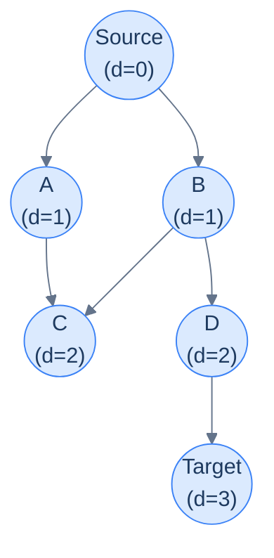
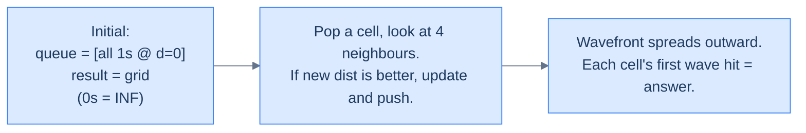

# 15. Pattern: Shortest path (Breadth-first search)

This lesson teaches you the **BFS-shortest-path pattern** — the recipe for any "minimum steps in an unweighted graph" problem. It's the cleanest, fastest path-finding pattern you have, and it works whenever every edge counts the same.

## Table of contents

1. [When BFS is the answer](#when-bfs-is-the-answer)
2. [The BFS shortest-path template](#the-bfs-shortest-path-template)
3. [Identifying the pattern](#identifying-the-pattern)
4. [Problem: Minimum steps in a grid](#problem-minimum-steps-in-a-grid)
5. [Problem: Nearest distance (multi-source BFS)](#problem-nearest-distance-multi-source-bfs)
6. [Problem: Shortest word transformation](#problem-shortest-word-transformation)

***

# When BFS Is the Answer

Earlier in the chapter you met BFS as a *traversal* — a way to visit every node ring-by-ring outward. That ring-by-ring property has a hidden superpower: **the depth at which BFS first encounters a node is exactly its shortest distance from the source** (in number of edges, not weighted distance).

That single fact turns BFS into the simplest, fastest algorithm for *unweighted* shortest-path problems. No priority queue, no relaxation, no clever proofs needed — the FIFO queue alone guarantees correctness.



<p align="center"><strong>BFS layers from the source. Every node's <code>d</code> value is its minimum number of hops from S. The first time BFS sees a node, that's the answer.</strong></p>

The pattern shows up wherever distance == hop-count:

- *"Minimum steps from start to end on an unweighted maze"*
- *"Number of moves from initial chess board state to checkmate"*
- *"Minimum word transformations connecting two dictionary words"*
- *"Closest restaurant within N hops"*
- *"Time for a flood/fire/infection to reach every cell"*
- *"Degrees of separation between two people in a network"*

For all of these, weight per edge is uniform (every step costs 1). BFS solves them in O(V + E).

> *Before reading on — for a 4-cycle 0–1–2–3, what's the shortest distance from 0 to 2? From 0 to 3?*

`0 → 2`: 2 hops (via 1 or via 3). `0 → 3`: 1 hop (direct edge). BFS would discover them in that order at depths 1 and 2 — the queue's FIFO order does the work for you.

***

# The BFS Shortest-Path Template

The plain BFS code is *almost* the pattern; we just need to (a) record distance, and (b) stop when we hit the target.

```
shortestPathBFS(graph, source, target):
    queue = [(source, 0)]
    visited = {source}
    while queue not empty:
        (node, dist) = queue.popleft()
        if node == target:
            return dist
        for neighbour in graph[node]:
            if neighbour not in visited:
                visited.add(neighbour)
                queue.push((neighbour, dist + 1))
    return -1   # target unreachable
```

Two important habits, lifted from the BFS lesson:

1. **Mark visited at PUSH time, not POP time.** A node could otherwise enter the queue multiple times via different parents, ballooning queue size and (worse) producing wrong answers in some variants.
2. **Carry the distance with each queue entry.** This avoids a separate `dist[]` array and makes the early-exit at the target trivial.

For grid problems, the graph is implicit and "neighbours" are computed via a 4- or 8-direction array — no adjacency list construction needed.

***

# Identifying the Pattern

Look for these signals in problem statements:

- *"Minimum number of steps / moves / changes / transformations"*
- *"Shortest path"* in an **unweighted** graph (no edge weights, or all weights are 1)
- *"Minimum jumps"*, *"fewest hops"*
- *"Time to reach every cell from a source"* (for spreading processes)
- The word **"BFS"** is *almost* a giveaway, but more useful is the implicit *"each move costs the same"*

If the problem includes weighted edges with varying costs, you're past BFS — that's Dijkstra (next lesson). If the problem asks for *all paths* rather than *shortest*, that's the DFS pattern.

***

# Problem: Minimum Steps in a Grid

## The Problem

In an N×M grid where `1` = walkable and `0` = wall, find the minimum number of cardinal-direction moves from `(0, 0)` to `(N-1, M-1)`. Return -1 if no path exists.

```
Input:  grid = [[1, 0, 1, 1],
                [1, 1, 1, 1],
                [0, 1, 0, 1]]
Output: 5
```

<details>
<summary><h2>Pattern Mapping</h2></summary>


The grid is a graph with implicit edges. BFS from `(0,0)`. As soon as the dequeued cell is `(N-1, M-1)`, return the carried distance. If the queue empties without finding the destination, return -1.

</details>
<details>
<summary><h2>The Solution</h2></summary>


```python run
from typing import List, Tuple
from queue import Queue

class Cell:
    def __init__(self, row: int, col: int, steps: int):
        self.row = row
        self.col = col
        self.steps = steps

class Solution:
    def is_valid_cell(
        self, grid: List[List[int]], row: int, col: int
    ) -> bool:
        return (
            0 <= row < len(grid)
            and 0 <= col < len(grid[0])
            and grid[row][col] == 1
        )

    def minimum_steps_in_a_grid(self, grid: List[List[int]]) -> int:
        rows = len(grid)
        cols = len(grid[0])

        # Create a visited matrix to keep track of visited cells
        visited = [[False] * cols for _ in range(rows)]

        # Create a queue for BFS traversal
        queue = Queue()
        queue.put(Cell(0, 0, 0))
        visited[0][0] = True

        # Define the possible movements: up, right, down, left
        directions: List[Tuple[int, int]] = [
            (-1, 0),  # up
            (0, 1),   # right
            (1, 0),   # down
            (0, -1)   # left
        ]

        while not queue.empty():
            curr_cell = queue.get()

            curr_row = curr_cell.row
            curr_col = curr_cell.col
            curr_steps = curr_cell.steps

            # Check if reached the destination cell
            if curr_row == rows - 1 and curr_col == cols - 1:
                return curr_steps

            # Explore the neighbours
            for dr, dc in directions:
                new_row = curr_row + dr
                new_col = curr_col + dc

                # Check if the new cell is within the grid boundaries
                # and contains 1
                if self.is_valid_cell(grid, new_row, new_col):

                    # Check if the new cell has not been visited before
                    if not visited[new_row][new_col]:

                        # Add the new cell to the queue
                        queue.put(Cell(new_row, new_col, curr_steps + 1))

                        # Mark the new cell as visited
                        visited[new_row][new_col] = True

        # No path found
        return -1


# Examples from the problem statement
print(Solution().minimum_steps_in_a_grid([[1,0,1,1],[1,1,1,1],[0,1,0,1]]))  # 5
print(Solution().minimum_steps_in_a_grid([[1,1,1,1],[1,1,1,1],[1,1,0,1]]))  # 5

# Edge cases
print(Solution().minimum_steps_in_a_grid([[1]]))                             # 0 — 1x1 passable
print(Solution().minimum_steps_in_a_grid([[0]]))                             # -1 — 1x1 wall
print(Solution().minimum_steps_in_a_grid([[1,1],[1,1]]))                     # 2 — 2x2 all passable
print(Solution().minimum_steps_in_a_grid([[1,0],[0,1]]))                     # -1 — no path
print(Solution().minimum_steps_in_a_grid([[0,1,1],[1,1,1],[1,1,1]]))         # -1 — blocked start
print(Solution().minimum_steps_in_a_grid([[1,1,1],[1,1,1],[1,1,0]]))         # -1 — blocked end
```

```java run
import java.util.*;

public class Main {
    static class Cell {

        int row;
        int col;
        int steps;

        public Cell(int row, int col, int steps) {
            this.row = row;
            this.col = col;
            this.steps = steps;
        }
    }

    static class Solution {
        private boolean isValidCell(int[][] grid, int row, int col) {
            return (
                row >= 0 &&
                row < grid.length &&
                col >= 0 &&
                col < grid[0].length &&
                grid[row][col] == 1
            );
        }

        public int minimumStepsInAGrid(int[][] grid) {
            int rows = grid.length;
            int cols = grid[0].length;

            // Create a visited matrix to keep track of visited cells
            boolean[][] visited = new boolean[rows][cols];

            // Create a queue for BFS traversal
            Queue<Cell> queue = new LinkedList<>();
            queue.add(new Cell(0, 0, 0));
            visited[0][0] = true;

            // Define the possible movements: up, right, down, left
            int[][] directions = {
                {-1, 0}, // up
                {0, 1},  // right
                {1, 0},  // down
                {0, -1}  // left
            };

            while (!queue.isEmpty()) {
                Cell currCell = queue.poll();

                int currRow = currCell.row;
                int currCol = currCell.col;
                int currSteps = currCell.steps;

                // Check if reached the destination cell
                if (currRow == rows - 1 && currCol == cols - 1) {
                    return currSteps;
                }

                // Explore the neighbours
                for (int[] dir : directions) {
                    int newRow = currRow + dir[0];
                    int newCol = currCol + dir[1];

                    // Check if the new cell is within the grid boundaries
                    // and contains 1
                    if (isValidCell(grid, newRow, newCol)) {

                        // Check if the new cell has not been visited before
                        if (!visited[newRow][newCol]) {

                            // Add the new cell to the queue
                            queue.add(
                                new Cell(newRow, newCol, currSteps + 1)
                            );

                            // Mark the new cell as visited
                            visited[newRow][newCol] = true;
                        }
                    }
                }
            }

            // No path found
            return -1;
        }
    }

    public static void main(String[] args) {
        Solution sol = new Solution();

        // Examples from the problem statement
        System.out.println(sol.minimumStepsInAGrid(new int[][]{{1,0,1,1},{1,1,1,1},{0,1,0,1}}));  // 5
        System.out.println(sol.minimumStepsInAGrid(new int[][]{{1,1,1,1},{1,1,1,1},{1,1,0,1}}));  // 5

        // Edge cases
        System.out.println(sol.minimumStepsInAGrid(new int[][]{{1}}));                             // 0
        System.out.println(sol.minimumStepsInAGrid(new int[][]{{0}}));                             // -1
        System.out.println(sol.minimumStepsInAGrid(new int[][]{{1,1},{1,1}}));                     // 2
        System.out.println(sol.minimumStepsInAGrid(new int[][]{{1,0},{0,1}}));                     // -1
        System.out.println(sol.minimumStepsInAGrid(new int[][]{{0,1,1},{1,1,1},{1,1,1}}));         // -1
        System.out.println(sol.minimumStepsInAGrid(new int[][]{{1,1,1},{1,1,1},{1,1,0}}));         // -1
    }
}
```

</details>


***

# Problem: Nearest Distance (Multi-Source BFS)

## The Problem

Grid of `0`s and `1`s. For *every* cell, return its distance to the nearest `1` (Manhattan distance, only horizontal/vertical movement).

```
Input:  grid = [[0, 0, 0, 0],
                [0, 0, 1, 0],
                [0, 0, 0, 0],
                [0, 0, 0, 0]]
Output: [[3, 2, 1, 2],
         [2, 1, 0, 1],
         [3, 2, 1, 2],
         [4, 3, 2, 3]]
```

<details>
<summary><h2>Pattern Mapping — Multi-Source BFS</h2></summary>


The trick: instead of running BFS from each `1` separately (`O(N * (R*C))`), **enqueue every `1` simultaneously at distance 0**, then BFS once. This is **multi-source BFS** — and it's a beautiful, common, often-missed pattern.

The wavefront expands from *all* the 1s in lockstep. The first time any wave reaches a cell, that's the distance to the nearest 1.



<p align="center"><strong>Multi-source BFS. Seed all 1s at distance 0; the unified wavefront races outward and fills the rest of the grid.</strong></p>

> *Before reading on — why does enqueueing every 1 at distance 0 work? Why doesn't it confuse the algorithm?*

Because BFS is **breadth-first** — it dequeues all distance-0 nodes before any distance-1 node, all distance-1 before any distance-2, and so on. The starting set is just bigger than usual; the order property still holds. Every cell still gets reached at its true minimum distance to *any* 1.

</details>
<details>
<summary><h2>The Solution</h2></summary>


```python run
from typing import List, Tuple
from queue import Queue

class Cell:
    def __init__(self, row: int, col: int, distance: int):
        self.row = row
        self.col = col
        self.distance = distance

class Solution:
    def is_valid_cell(
        self, row: int, col: int, rows: int, cols: int
    ) -> bool:
        return 0 <= row < rows and 0 <= col < cols

    def nearest_distance(self, grid: List[List[int]]) -> List[List[int]]:
        rows = len(grid)
        cols = len(grid[0])

        # Create a result matrix to store the nearest distances
        result = [[float("inf")] * cols for _ in range(rows)]

        # Create a queue for BFS traversal
        queue = Queue()

        # Enqueue all the cells with value 1 and initialize their
        # distance as 0
        for row in range(rows):
            for col in range(cols):
                if grid[row][col] == 1:
                    queue.put(Cell(row, col, 0))
                    result[row][col] = 0

        # Define the possible movements: up, right, down, left
        directions: List[Tuple[int, int]] = [
            (-1, 0),  # up
            (0, 1),   # right
            (1, 0),   # down
            (0, -1)   # left
        ]

        while not queue.empty():
            curr_cell = queue.get()

            curr_row = curr_cell.row
            curr_col = curr_cell.col
            curr_distance = curr_cell.distance

            # Explore the neighbours
            for dr, dc in directions:
                new_row = curr_row + dr
                new_col = curr_col + dc

                # Check if the new cell is within the grid boundaries
                # and has a greater distance than the current distance
                if self.is_valid_cell(new_row, new_col, rows, cols) and \
                   curr_distance + 1 < result[new_row][new_col]:

                    # Update the distance for the new cell
                    result[new_row][new_col] = curr_distance + 1

                    # Add the new cell to the queue    
                    queue.put(
                        Cell(new_row, new_col, curr_distance + 1)
                    )

        return result


# Examples from the problem statement
print(Solution().nearest_distance([[0,0,0,0],[0,0,1,0],[0,0,0,0],[0,0,0,0]]))
# [[3,2,1,2],[2,1,0,1],[3,2,1,2],[4,3,2,3]]
print(Solution().nearest_distance([[1,0,0],[0,1,0],[0,0,0]]))
# [[0,1,2],[1,0,1],[2,1,2]]

# Edge cases
print(Solution().nearest_distance([[1]]))               # [[0]] — single cell is 1
print(Solution().nearest_distance([[0]]))               # [[inf]] — single cell is 0
print(Solution().nearest_distance([[1,1],[1,1]]))       # [[0,0],[0,0]] — all 1s
print(Solution().nearest_distance([[1,0],[0,0]]))       # [[0,1],[1,2]] — one source corner
print(Solution().nearest_distance([[0,0],[0,1]]))       # [[2,1],[1,0]] — one source far corner
```

```java run
import java.util.*;

public class Main {
    static class Cell {

        int row;
        int col;
        int distance;

        Cell(int row, int col, int distance) {
            this.row = row;
            this.col = col;
            this.distance = distance;
        }
    }

    static class Solution {
        private boolean isValidCell(int row, int col, int rows, int cols) {
            return row >= 0 && row < rows && col >= 0 && col < cols;
        }

        public int[][] nearestDistance(int[][] grid) {
            int rows = grid.length;
            int cols = grid[0].length;

            // Create a result matrix to store the nearest distances
            int[][] result = new int[rows][cols];
            for (int row = 0; row < rows; row++) {
                Arrays.fill(result[row], Integer.MAX_VALUE);
            }

            // Create a queue for BFS traversal
            Queue<Cell> queue = new LinkedList<>();

            // Enqueue all the cells with value 1 and initialize their
            // distance as 0
            for (int row = 0; row < rows; row++) {
                for (int col = 0; col < cols; col++) {
                    if (grid[row][col] == 1) {
                        queue.add(new Cell(row, col, 0));
                        result[row][col] = 0;
                    }
                }
            }

            // Define the possible movements: up, right, down, left
            int[][] directions = {
                {-1, 0}, // up
                {0, 1},  // right
                {1, 0},  // down
                {0, -1}  // left
            };

            while (!queue.isEmpty()) {
                Cell currCell = queue.poll();

                int currRow = currCell.row;
                int currCol = currCell.col;
                int currDistance = currCell.distance;

                // Explore the neighbours
                for (int[] dir : directions) {
                    int newRow = currRow + dir[0];
                    int newCol = currCol + dir[1];

                    // Check if the new cell is within the grid boundaries 
                    // and has a greater distance than the current distance
                    if (isValidCell(newRow, newCol, rows, cols) &&
                        currDistance + 1 < result[newRow][newCol]) {

                        // Update the distance for the new cell
                        result[newRow][newCol] = currDistance + 1;

                        // Add the new cell to the queue
                        queue.add(
                            new Cell(newRow, newCol, currDistance + 1)
                        );
                    }
                }
            }

            return result;
        }
    }

    public static void main(String[] args) {
        Solution sol = new Solution();

        // Examples from the problem statement
        System.out.println(Arrays.deepToString(sol.nearestDistance(new int[][]{{0,0,0,0},{0,0,1,0},{0,0,0,0},{0,0,0,0}})));
        // [[3,2,1,2],[2,1,0,1],[3,2,1,2],[4,3,2,3]]
        System.out.println(Arrays.deepToString(sol.nearestDistance(new int[][]{{1,0,0},{0,1,0},{0,0,0}})));
        // [[0,1,2],[1,0,1],[2,1,2]]

        // Edge cases
        System.out.println(Arrays.deepToString(sol.nearestDistance(new int[][]{{1}})));               // [[0]]
        System.out.println(Arrays.deepToString(sol.nearestDistance(new int[][]{{1,1},{1,1}})));       // [[0,0],[0,0]]
        System.out.println(Arrays.deepToString(sol.nearestDistance(new int[][]{{1,0},{0,0}})));       // [[0,1],[1,2]]
        System.out.println(Arrays.deepToString(sol.nearestDistance(new int[][]{{0,0},{0,1}})));       // [[2,1],[1,0]]
    }
}
```


The multi-source pattern is **massively** more efficient than running BFS once per source (`O(K * R*C)` where K = number of sources). Multi-source BFS is `O(R*C)` regardless of how many sources you start with. Same algorithm, fundamentally better complexity.

</details>

***

# Problem: Shortest Word Transformation

## The Problem

Given two words `source` and `target` and a `wordList`, find the minimum number of words in a transformation chain `source → s1 → s2 → … → target`, where:

- Each consecutive pair differs by exactly one letter.
- Every word `s1, s2, …, target` is in `wordList`.

Return 0 if no transformation exists.

```
Input:  source = "hit", target = "cog", wordList = ["hot", "dot", "dog", "lot", "log", "cog"]
Output: 5  (hit → hot → dot → dog → cog)
```

<details>
<summary><h2>Pattern Mapping</h2></summary>


The graph is **implicit**:

- Node = a word.
- Edge = "differ by exactly one letter".

The graph is unweighted (each transformation costs 1), and we want minimum hops. **BFS shortest path.**

The trick is generating neighbours efficiently. Two main approaches:

1. **Per-position substitution.** For each character position, try every other letter; check if the mutated word is in `wordList`. O(L × 26) neighbours per word, where L = word length.
2. **Pattern keys.** Pre-build a map from "h*t" → ["hit", "hot", "hat", …]. Each word has L neighbour-pattern keys.

We'll use approach 1 — simpler to code, still fast for typical inputs. The implementation builds the adjacency on the fly during BFS.

</details>
<details>
<summary><h2>The Solution (per-position substitution)</h2></summary>


```python run
from collections import deque
from typing import List

class Solution:
    def shortest_word_transformation(
        self, source: str, target: str, word_list: List[str]
    ) -> int:

        # Create a set to store the words for efficient lookup
        word_set = set(word_list)

        # If the target word is not in the word set, return 0
        if target not in word_set:
            return 0

        # Create a queue for BFS traversal
        queue = deque([source])

        # Create a visited set to keep track of visited words
        visited = set([source])

        # Starting level is 1 (source word is at level 1)
        level = 1

        while queue:
            level_size = len(queue)

            # Traverse all words at the current level
            for _ in range(level_size):
                current_word = queue.popleft()

                # Check if the current word matches the target
                if current_word == target:
                    return level

                # Generate all possible adjacent words
                for j in range(len(current_word)):
                    original_char = current_word[j]
                    for ch in "abcdefghijklmnopqrstuvwxyz":

                        # Skip if the character is the same as the
                        # original
                        if ch == original_char:
                            continue

                        # Change the character at position j
                        new_word = (
                            current_word[:j] + ch + current_word[j + 1:]
                        )

                        # Check if the new word is in the word set and
                        # has not been visited
                        if (
                            new_word in word_set
                            and new_word not in visited
                        ):
                            queue.append(new_word)
                            visited.add(new_word)

            # Increment the level after traversing all words at the
            # current level
            level += 1

        # No transformation sequence exists, return 0
        return 0


# Examples from the problem statement
print(Solution().shortest_word_transformation("hit", "cog", ["hot","dot","dog","lot","log","cog"]))  # 5
print(Solution().shortest_word_transformation("hit", "mad", ["hot","dot","dog","lot","log","cog"]))  # 0
print(Solution().shortest_word_transformation("red", "tax", ["tan","apple","banana","blue","rose"]))  # 0

# Edge cases
print(Solution().shortest_word_transformation("hit", "hot", ["hot"]))                                # 2 — one step
print(Solution().shortest_word_transformation("abc", "abc", ["abc"]))                                # 1 — source equals target
print(Solution().shortest_word_transformation("hit", "cog", []))                                     # 0 — empty word list
print(Solution().shortest_word_transformation("a", "c", ["b","c"]))                                  # 2 — single-char chain
```

```java run
import java.util.*;

public class Main {
    static class Solution {
        public int shortestWordTransformation(
            String source,
            String target,
            List<String> wordList
        ) {

            // Create a set to store the words for efficient lookup
            Set<String> wordSet = new HashSet<>(wordList);

            // If the target word is not in the word set, return 0
            if (!wordSet.contains(target)) {
                return 0;
            }

            // Create a queue for BFS traversal
            Queue<String> queue = new LinkedList<>();
            queue.add(source);

            // Create a visited set to keep track of visited words
            Set<String> visited = new HashSet<>();
            visited.add(source);

            // Starting level is 1 (source word is at level 1)
            int level = 1;

            while (!queue.isEmpty()) {
                int levelSize = queue.size();

                // Traverse all words at the current level
                for (int i = 0; i < levelSize; i++) {
                    String currentWord = queue.poll();

                    // Check if the current word matches the target
                    if (currentWord.equals(target)) {
                        return level;
                    }

                    // Generate all possible adjacent words
                    for (int j = 0; j < currentWord.length(); j++) {
                        char originalChar = currentWord.charAt(j);

                        for (char ch = 'a'; ch <= 'z'; ch++) {

                            // Skip if the character is the same as the
                            // original
                            if (ch == originalChar) continue;

                            // Change the character at position j
                            String newWord =
                                currentWord.substring(0, j) +
                                ch +
                                currentWord.substring(j + 1);

                            // Check if the new word is in the word set and
                            // has not been visited
                            if (
                                wordSet.contains(newWord) &&
                                !visited.contains(newWord)
                            ) {
                                queue.add(newWord);
                                visited.add(newWord);
                            }
                        }
                    }
                }

                // Increment the level after traversing all words at the
                // current level
                level++;
            }

            // No transformation sequence exists, return 0
            return 0;
        }
    }

    public static void main(String[] args) {
        Solution sol = new Solution();

        // Examples from the problem statement
        System.out.println(sol.shortestWordTransformation("hit", "cog", List.of("hot","dot","dog","lot","log","cog")));  // 5
        System.out.println(sol.shortestWordTransformation("hit", "mad", List.of("hot","dot","dog","lot","log","cog")));  // 0
        System.out.println(sol.shortestWordTransformation("red", "tax", List.of("tan","apple","banana","blue","rose")));  // 0

        // Edge cases
        System.out.println(sol.shortestWordTransformation("hit", "hot", List.of("hot")));         // 2
        System.out.println(sol.shortestWordTransformation("abc", "abc", List.of("abc")));         // 1
        System.out.println(sol.shortestWordTransformation("hit", "cog", new ArrayList<>()));      // 0
        System.out.println(sol.shortestWordTransformation("a", "c", List.of("b","c")));           // 2
    }
}
```

</details>
<details>
<summary><h2>Complexity Analysis</h2></summary>


| Problem | Time | Space |
|---|---|---|
| Minimum steps in a grid | O(R × C) | O(R × C) |
| Nearest distance (multi-source) | O(R × C) | O(R × C) |
| Shortest word transformation | O(N × L × 26) | O(N × L) |

Where N = words, L = word length. The word problem is dominated by the per-word neighbour generation (L positions × 26 letters).

</details>

# Problem: Minimum Steps in a Grid II

## The Problem

Given an **NxM** **grid** filled with values of either `0`, or `1` and a non-negative integer **k**, write a function to find and return the minimum number of steps required to reach the cell `(N-1, M-1)` from the cell `(0, 0)`. If there is no valid path, return `-1` instead.

You can convert at most **k** non-walkable cells to walkable cells.

> -   A value of `1` in a cell means it's walkable.
> -   A value of `0` in a cell means it's a wall and not walkable.

> You must abide by the following constraint:
>
> -   You can only move in the four cardinal directions, i.e., `up`, `right`, `down`, and `left`.

```
Input:  grid = [[1, 0, 1, 1], [0, 1, 1, 1], [0, 1, 0, 1]], k = 1
Output: 5
Input:  grid = [[1, 0, 0, 0], [0, 0, 0, 0], [0, 0, 0, 1]], k = 5
Output: 5
```

<details>
<summary><h2>Pattern Mapping</h2></summary>


This is BFS shortest path with a state dimension bolted onto each node. A plain `visited[row][col]` is no longer enough: a cell reached with more wall-removals still in hand may open a shorter route than the same cell reached with none left. The fix is a 3D `visited[row][col][walls_left]` — the BFS state is `(row, col, walls_left)`, not just `(row, col)`.

Moving onto a wall (`0`) costs one of the `k` removals; moving onto a `1` costs none. A neighbour is only enqueued when `walls_left` stays non-negative and that exact state hasn't been visited. Because every step still costs 1, the FIFO queue guarantees the first time the destination is dequeued is the minimum step count.

</details>
<details>
<summary><h2>The Solution</h2></summary>


```python run
from typing import List, Tuple
from queue import Queue

class Cell:
    def __init__(self, row: int, col: int, steps: int, walls_left: int):
        self.row = row
        self.col = col
        self.steps = steps
        self.walls_left = walls_left

class Solution:
    def is_valid_cell(
        self, row: int, col: int, rows: int, cols: int
    ) -> bool:
        return 0 <= row < rows and 0 <= col < cols

    def minimum_steps_in_a_grid_ii(
        self, grid: List[List[int]], k: int
    ) -> int:
        rows = len(grid)
        cols = len(grid[0])

        # Create a visited grid to keep track of visited cells
        visited = [
            [[False] * (k + 1) for _ in range(cols)] for _ in range(rows)
        ]

        # Create a queue for BFS traversal
        queue = Queue()
        queue.put(Cell(0, 0, 0, k))
        visited[0][0][k] = True

        # Define the possible movements: up, right, down, left
        directions: List[Tuple[int, int]] = [
            (-1, 0),  # up
            (0, 1),   # right
            (1, 0),   # down
            (0, -1)   # left
        ]

        while not queue.empty():
            curr_cell = queue.get()

            curr_row = curr_cell.row
            curr_col = curr_cell.col
            curr_steps = curr_cell.steps
            curr_walls_left = curr_cell.walls_left

            # Check if reached the destination
            if curr_row == rows - 1 and curr_col == cols - 1:
                return curr_steps

            # Explore the neighbours
            for dr, dc in directions:
                new_row = curr_row + dr
                new_col = curr_col + dc

                # Check if the new cell is within the grid boundaries
                if self.is_valid_cell(new_row, new_col, rows, cols):
                    new_walls_left = curr_walls_left - (
                        1 if grid[new_row][new_col] == 0 else 0
                    )

                    # If we have walls left to remove and haven't
                    # visited this state
                    if (
                        new_walls_left >= 0
                        and not visited[new_row][new_col][new_walls_left]
                    ):
                        
                        # Add the new cell to the queue
                        queue.put(
                            Cell(
                                new_row,
                                new_col,
                                curr_steps + 1,
                                new_walls_left,
                            )
                        )

                        # Mark the new cell as visited
                        visited[new_row][new_col][new_walls_left] = True

        # No path found
        return -1


# Examples from the problem statement
print(Solution().minimum_steps_in_a_grid_ii([[1,0,1,1],[0,1,1,1],[0,1,0,1]], 1))  # 5
print(Solution().minimum_steps_in_a_grid_ii([[1,0,0,0],[0,0,0,0],[0,0,0,1]], 5))  # 5

# Edge cases
print(Solution().minimum_steps_in_a_grid_ii([[1]], 0))                             # 0 — 1x1
print(Solution().minimum_steps_in_a_grid_ii([[0]], 1))                             # 0 — 1x1 wall removed
print(Solution().minimum_steps_in_a_grid_ii([[1,1],[1,1]], 0))                     # 2 — all passable
print(Solution().minimum_steps_in_a_grid_ii([[1,0],[0,1]], 0))                     # -1 — no removals allowed
print(Solution().minimum_steps_in_a_grid_ii([[1,0],[0,1]], 1))                     # 2 — one removal allowed
print(Solution().minimum_steps_in_a_grid_ii([[1,0,0],[0,0,0],[0,0,1]], 0))         # -1 — need walls but k=0
```

```java run
import java.util.*;

public class Main {
    static class Cell {

        int row;
        int col;
        int steps;
        int wallsLeft;

        public Cell(int row, int col, int steps, int wallsLeft) {
            this.row = row;
            this.col = col;
            this.steps = steps;
            this.wallsLeft = wallsLeft;
        }
    }

    static class Solution {
        private boolean isValidCell(int row, int col, int rows, int cols) {
            return row >= 0 && row < rows && col >= 0 && col < cols;
        }

        public int minimumStepsInAGridII(int[][] grid, int k) {
            int rows = grid.length, cols = grid[0].length;

            // Create a visited grid to keep track of visited cells
            boolean[][][] visited = new boolean[rows][cols][k + 1];

            // Create a queue for BFS traversal
            Queue<Cell> queue = new LinkedList<>();
            queue.add(new Cell(0, 0, 0, k));
            visited[0][0][k] = true;

            // Define the possible movements: up, right, down, left
            int[][] directions = {
                {-1, 0}, // up
                {0, 1},  // right
                {1, 0},  // down
                {0, -1}  // left
            };

            while (!queue.isEmpty()) {
                Cell currCell = queue.poll();

                int currRow = currCell.row;
                int currCol = currCell.col;
                int currSteps = currCell.steps;
                int currWallsLeft = currCell.wallsLeft;

                // Check if reached the destination
                if (currRow == rows - 1 && currCol == cols - 1) {
                    return currSteps;
                }

                // Explore the neighbours
                for (int[] dir : directions) {
                    int newRow = currRow + dir[0];
                    int newCol = currCol + dir[1];

                    // Check if the new cell is within the grid boundaries
                    if (isValidCell(newRow, newCol, rows, cols)) {
                        int newWallsLeft =
                            currWallsLeft -
                            (grid[newRow][newCol] == 0 ? 1 : 0);

                        // If we have walls left to remove and haven't
                        // visited this state
                        if (
                            newWallsLeft >= 0 &&
                            !visited[newRow][newCol][newWallsLeft]
                        ) {

                            // Add the new cell to the queue
                            queue.add(
                                new Cell(
                                    newRow,
                                    newCol,
                                    currSteps + 1,
                                    newWallsLeft
                                )
                            );

                            // Mark the new cell as visited
                            visited[newRow][newCol][newWallsLeft] = true;
                        }
                    }
                }
            }

            // No path found
            return -1;
        }
    }

    public static void main(String[] args) {
        Solution sol = new Solution();

        // Examples from the problem statement
        System.out.println(sol.minimumStepsInAGridII(new int[][]{{1,0,1,1},{0,1,1,1},{0,1,0,1}}, 1));  // 5
        System.out.println(sol.minimumStepsInAGridII(new int[][]{{1,0,0,0},{0,0,0,0},{0,0,0,1}}, 5));  // 5

        // Edge cases
        System.out.println(sol.minimumStepsInAGridII(new int[][]{{1}}, 0));                             // 0
        System.out.println(sol.minimumStepsInAGridII(new int[][]{{0}}, 1));                             // 0
        System.out.println(sol.minimumStepsInAGridII(new int[][]{{1,1},{1,1}}, 0));                     // 2
        System.out.println(sol.minimumStepsInAGridII(new int[][]{{1,0},{0,1}}, 0));                     // -1
        System.out.println(sol.minimumStepsInAGridII(new int[][]{{1,0},{0,1}}, 1));                     // 2
        System.out.println(sol.minimumStepsInAGridII(new int[][]{{1,0,0},{0,0,0},{0,0,1}}, 0));         // -1
    }
}
```

</details>

<details>
<summary><h2>Final Takeaway</h2></summary>


BFS shortest path is the **simplest, most reliable, fastest** algorithm for *unweighted* shortest-path problems. The recipe is dead easy: queue with distance, mark on push, early exit at target. The two power-ups — **multi-source BFS** (seed every starting point at d=0) and **implicit graphs** (compute neighbours on the fly) — turn the same algorithm into a swiss-army knife for grid, word-ladder, and graph-shortest-path problems alike.

When BFS isn't enough — when edges have varying weights — you upgrade to Dijkstra, the next pattern. The mental shift is small: replace the FIFO queue with a min-heap that orders by *cumulative weight* instead of *insertion order*. Same shape, different ordering principle.

> **Transfer challenge.** A virus enters a hospital ward modelled as a grid. Initially several rooms are infected. Each minute, the virus spreads to all empty 4-cardinal neighbours. Find the minimum minutes until every room is infected, or `-1` if some rooms can never be reached. *Hint: this is multi-source BFS in disguise.*

</details>
<details>
<summary><strong>Sketch</strong></summary>

Multi-source BFS from all initially-infected rooms, distance 0. Carry distance with each cell; the maximum distance reached is the answer. If any "empty" room remains unvisited at the end, return -1 (it can never be reached). Same code as nearest-distance, with one extra max-tracking variable.

This is *exactly* LeetCode's "Rotting Oranges" problem. Multi-source BFS = the right tool.

</details>
