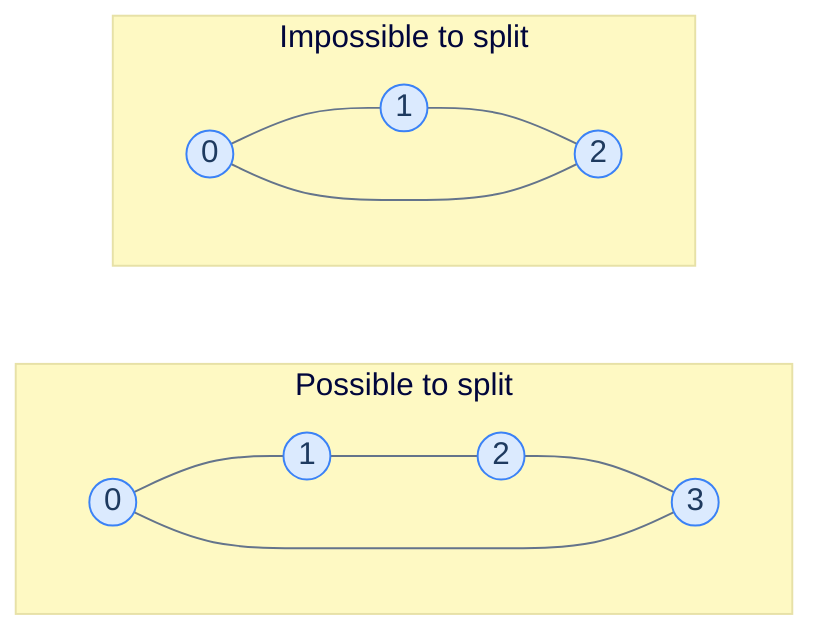

# The Two-Camps Question

You have a group of people, and a list of **dislike** pairs — pairs that *cannot* sit at the same table. You have only **two** tables. Can you seat everyone such that no two enemies share a table?

> 🖼 Diagram — The 4-cycle on the left can be 2-coloured: {0, 2} red, {1, 3} blue. The 3-cycle on the right cannot — every assignment of colours forces *some* edge to have same-coloured endpoints.


<p align="center"><strong>The 4-cycle on the left can be 2-coloured: {0, 2} red, {1, 3} blue. The 3-cycle on the right cannot — every assignment of colours forces *some* edge to have same-coloured endpoints.</strong></p>

The pattern shows up wherever you need to detect **antagonism** or **alternation**:

- **Conflict groups.** Can these students be assigned to two project teams so no two who dislike each other are paired?
- **Bipartite verification.** Is this assignment-style problem actually bipartite?
- **Chess-board colouring.** Can these tiles be painted black/white so no adjacent pair is same-coloured?
- **Job scheduling.** Can these jobs be split between two machines so no conflicting jobs run on the same one?
- **Network analysis.** Are these nodes really in two factions, or do internal conflicts make that decomposition impossible?

> *Before reading on — for the 4-cycle above, walk the colouring by hand: start with 0 = red. What must the other three colours be? Which edge is the "tightest"?*

Starting with 0 = red, then 1 must be blue (edge 0-1). Then 2 must be red (edge 1-2). Then 3 must be blue (edge 2-3). Now the closing edge: 3-0 = blue-red. ✓ All edges have opposite-coloured endpoints. Two-colourable.

For the 3-cycle: 0 = red, 1 = blue, 2 must be red (edge 1-2 forces opposite of blue). But edge 2-0: red-red. ✗ Conflict. Not two-colourable.

# Two-Colourable = Bipartite

A graph is **two-colourable** if and only if it is **bipartite**. The two terms describe the same property from different angles:

- **Two-colourable** is the algorithmic phrasing: "can I assign one of two labels to each node so adjacent labels differ?"
- **Bipartite** is the structural phrasing: "can the nodes be split into two sets `L` and `R` such that every edge crosses between sets?"

If you can two-colour, just declare "all reds = L, all blues = R" — the colour boundaries become the bipartition. Conversely, if the graph is bipartite, paint `L` red and `R` blue and you have a valid two-colouring.

Both views matter. The two-colour view drives the *algorithm*; the bipartite view drives the *application* (matching, network flow, …).

A famous theorem nails down when two-colouring works:

> **Theorem.** A graph is two-colourable if and only if it has no **odd-length cycle**.

The intuition: walking around an odd cycle, you flip the colour at each step, and after an odd number of flips you arrive back at the start with the *opposite* colour to where you began — a contradiction. Walking an even cycle returns you to the starting colour, no conflict. The 3-cycle above is a tiny version of this argument; any odd cycle, of any length, breaks colouring.

# The Colouring Algorithm

Use any traversal — DFS or BFS — and assign a colour at every step. The first node gets a starting colour; every neighbour gets the opposite colour; their neighbours flip back; and so on, alternating with depth.

The trick is the *check*: when you encounter a *visited* neighbour, verify that its colour is the *opposite* of the current node's. If not, it's a conflict, and the graph isn't two-colourable.

> **`colourGraph(node, graph, colour, colourValue)`**
> 1. `colour[node] = colourValue`
> 2. For each `neighbour` in `graph[node]`:
>    - If `neighbour` is uncoloured: recursively call with `1 - colourValue`. If the recursion returns false, return false.
>    - Else if `colour[neighbour] == colourValue` → return false (same-colour conflict).
> 3. Return true.
>
> **`isTwoColourable(graph)`**
> 1. Initialise `colour` map (empty).
> 2. For each unconnected component (= each uncoloured node): call `colourGraph` starting with colour 1. Return false if any component fails.
> 3. Return true.

The outer-loop wrapper handles disconnected graphs — a graph can have multiple components, each individually 2-colourable. We need *all* of them to succeed. (The reference implementation seeds each component with colour 1 and flips to 0 on the first hop; the two values are interchangeable — only the *alternation* matters. An empty graph has nothing to colour, and the implementation reports `false` for that degenerate input.)

> *Before reading on — what does the algorithm look like with BFS instead of DFS? Sketch the change in one sentence.*

With BFS: maintain a queue, push the source with colour 0, pop nodes, paint each neighbour the opposite colour and push it. The conflict check is the same. The choice between DFS and BFS doesn't matter for correctness; both walk every component and propagate the colour rule.

# Implementation

We'll use DFS — it's slightly more compact recursively. Colour values are 0 and 1 (or `false`/`true`); flipping is `1 - colour` (or `!colour`).


```python run viz=graph viz-root=graph
from typing import List, Dict

class Solution:
    def colour_graph(
        self,
        graph: List[List[int]],
        node: int,
        colour: Dict[int, int],
        colour_value: int,
    ) -> bool:

        # Colour the node with colourValue
        colour[node] = colour_value

        # Traverse all the neighbours of the current node
        for neighbour in graph[node]:

            # If the neighbour is not coloured, colour it with the
            # opposite colour and recursively call the function on the
            # neighbour
            if neighbour not in colour:

                # If the neighbour is not coloured, colour it with the
                # opposite colour
                if not self.colour_graph(
                    graph, neighbour, colour, 1 - colour_value
                ):

                    # If the colouring fails, return false
                    # (i.e., if a neighbour has the same colour)
                    return False

            # Else if the neighbour is coloured with the same colour
            # return false
            elif colour[neighbour] == colour_value:
                return False

        return True

    def is_two_colourable(self, graph: List[List[int]]) -> bool:

        # Number of nodes in the graph
        n = len(graph)

        # If the graph is empty, return false
        if n == 0:
            return False

        # Create a map to store the colour of each node
        colour: Dict[int, int] = {}

        # Traverse all nodes in the graph
        for node in range(len(graph)):

            # If a node is not coloured, start colouring its
            # connected component recursively starting with colour 1
            if node not in colour:

                # If the colouring fails, return false
                # (i.e., if a neighbour has the same colour)
                if not self.colour_graph(graph, node, colour, 1):
                    return False

        # If all nodes are coloured successfully, return true
        return True


# Examples from the problem statement
print(Solution().is_two_colourable([[1,3],[0,2],[1,3],[0,2]]))  # True
print(Solution().is_two_colourable([[1,2],[0,2],[0,1]]))        # False

# Edge cases
print(Solution().is_two_colourable([]))                         # False
print(Solution().is_two_colourable([[1],[0]]))                  # True
print(Solution().is_two_colourable([[1,2],[0,2],[0,1]]))        # False — odd cycle (triangle)
print(Solution().is_two_colourable([[],[]]))                    # True — disconnected, no edges
print(Solution().is_two_colourable([[1],[0],[3],[2]]))          # True — two separate edges
```

```java run viz=graph viz-root=graph
import java.util.*;

public class Main {
    static class Solution {
        private boolean colourGraph(
            List<List<Integer>> graph,
            int node,
            Map<Integer, Integer> colour,
            int colourValue
        ) {

            // Colour the node with colourValue
            colour.put(node, colourValue);

            // Traverse all the neighbours of the current node
            for (int neighbour : graph.get(node)) {

                // If the neighbour is not coloured, colour it with the
                // opposite colour and recursively call the function on the
                // neighbour
                if (!colour.containsKey(neighbour)) {

                    // If the neighbour is not coloured, colour it with the
                    // opposite colour
                    if (
                        !colourGraph(
                            graph,
                            neighbour,
                            colour,
                            1 - colourValue
                        )
                    ) {

                        // If the colouring fails, return false
                        // (i.e., if a neighbour has the same colour)
                        return false;
                    }
                }

                // Else if the neighbour is coloured with the same colour
                // return false
                else if (colour.get(neighbour) == colourValue) {
                    return false;
                }
            }

            return true;
        }

        public boolean isTwoColourable(List<List<Integer>> graph) {

            // Number of nodes in the graph
            int N = graph.size();

            // If the graph is empty, return false
            if (N == 0) {
                return false;
            }

            // Create a map to store the colour of each node
            Map<Integer, Integer> colour = new HashMap<>();

            // Traverse all nodes in the graph
            for (int node = 0; node < graph.size(); node++) {

                // If a node is not coloured, start colouring its
                // connected component recursively starting with colour 1
                if (!colour.containsKey(node)) {

                    // If the colouring fails, return false
                    // (i.e., if a neighbour has the same colour)
                    if (!colourGraph(graph, node, colour, 1)) {
                        return false;
                    }
                }
            }

            // If all nodes are coloured successfully, return true
            return true;
        }
    }

    public static void main(String[] args) {
        Solution sol = new Solution();

        // Examples from the problem statement
        System.out.println(sol.isTwoColourable(List.of(List.of(1,3),List.of(0,2),List.of(1,3),List.of(0,2))));  // true
        System.out.println(sol.isTwoColourable(List.of(List.of(1,2),List.of(0,2),List.of(0,1))));               // false

        // Edge cases
        System.out.println(sol.isTwoColourable(new ArrayList<>()));                         // false
        System.out.println(sol.isTwoColourable(List.of(List.of(1), List.of(0))));           // true
        System.out.println(sol.isTwoColourable(List.of(new ArrayList<>(), new ArrayList<>())));  // true
        System.out.println(sol.isTwoColourable(List.of(List.of(1),List.of(0),List.of(3),List.of(2))));  // true
    }
}
```


## Complexity Analysis

| | Complexity | Reasoning |
|---|---|---|
| **Time** | O(N + E) | Each node coloured once; each edge inspected once |
| **Space** | O(N) | Colour map + recursion stack |

The pattern is as cheap as a plain DFS — adding the colour check costs O(1) per edge.

<!-- ============================================== -->
<!-- SWEEP 2 — missing sections (placeholders only) -->
<!-- ============================================== -->

<!-- TODO: Understanding the Pattern — missing, needs to be written -->
<!--       Guidance: umbrella H2 with the subsections below -->

<!-- TODO: Why Naive Isn't Enough — missing, needs to be written -->
<!--       Guidance: motivation for why the obvious approach fails -->

<!-- TODO: The Core Idea — missing, needs to be written -->
<!--       Guidance: one paragraph: the central trick -->

<!-- TODO: How the Pointers/Window Move — missing, needs to be written -->
<!--       Guidance: mechanics of the moving parts -->

<!-- TODO: The Generic Algorithm — missing, needs to be written -->
<!--       Guidance: numbered steps, no code -->

<!-- TODO: Generic Implementation — missing, needs to be written -->
<!--       Guidance: Python block + Java block of the skeleton -->

<!-- TODO: Variants / Taxonomy — missing, needs to be written -->
<!--       Guidance: enumerate sub-shapes of this pattern -->

<!-- TODO: Identifying — missing, needs to be written -->
<!--       Guidance: per-variant: recognition checklist + canonical example -->

<!-- TODO: Recognition Checklist — missing, needs to be written -->
<!--       Guidance: 4-question diagnostic — the source of the Problem-section Diagnostic Questions -->

<!-- TODO: Canonical Example — missing, needs to be written -->
<!--       Guidance: fully worked example: brute force → optimised → template fit -->

<!-- TODO: Problems in This Category — missing, needs to be written -->
<!--       Guidance: table with links to the 02-problems/ files -->
