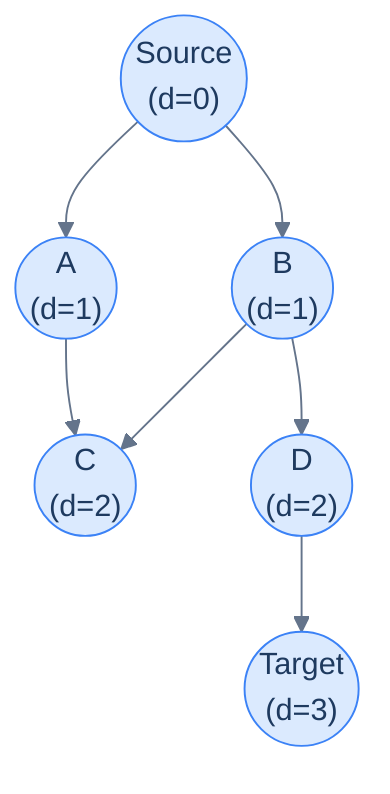

# When BFS Is the Answer

Earlier in the chapter you met BFS as a *traversal* — a way to visit every node ring-by-ring outward. That ring-by-ring property has a hidden superpower: **the depth at which BFS first encounters a node is exactly its shortest distance from the source** (in number of edges, not weighted distance).

That single fact turns BFS into the simplest, fastest algorithm for *unweighted* shortest-path problems. No priority queue, no relaxation, no clever proofs needed — the FIFO queue alone guarantees correctness.

> 🖼 Diagram — BFS layers from the source. Every node's d value is its minimum number of hops from S. The first time BFS sees a node, that's the answer.


<p align="center"><strong>BFS layers from the source. Every node's <code>d</code> value is its minimum number of hops from S. The first time BFS sees a node, that's the answer.</strong></p>

The pattern shows up wherever distance == hop-count:

- *"Minimum steps from start to end on an unweighted maze"*
- *"Number of moves from initial chess board state to checkmate"*
- *"Minimum word transformations connecting two dictionary words"*
- *"Closest restaurant within N hops"*
- *"Time for a flood/fire/infection to reach every cell"*
- *"Degrees of separation between two people in a network"*

For all of these, weight per edge is uniform (every step costs 1). BFS solves them in O(V + E).

> *Before reading on — for a 4-cycle 0–1–2–3, what's the shortest distance from 0 to 2? From 0 to 3?*

`0 → 2`: 2 hops (via 1 or via 3). `0 → 3`: 1 hop (direct edge). BFS would discover them in that order at depths 1 and 2 — the queue's FIFO order does the work for you.

# The BFS Shortest-Path Template

The plain BFS code is *almost* the pattern; we just need to (a) record distance, and (b) stop when we hit the target.

```
shortestPathBFS(graph, source, target):
    queue = [(source, 0)]
    visited = {source}
    while queue not empty:
        (node, dist) = queue.popleft()
        if node == target:
            return dist
        for neighbour in graph[node]:
            if neighbour not in visited:
                visited.add(neighbour)
                queue.push((neighbour, dist + 1))
    return -1   # target unreachable
```

Two important habits, lifted from the BFS lesson:

1. **Mark visited at PUSH time, not POP time.** A node could otherwise enter the queue multiple times via different parents, ballooning queue size and (worse) producing wrong answers in some variants.
2. **Carry the distance with each queue entry.** This avoids a separate `dist[]` array and makes the early-exit at the target trivial.

For grid problems, the graph is implicit and "neighbours" are computed via a 4- or 8-direction array — no adjacency list construction needed.

# Identifying the Pattern

Look for these signals in problem statements:

- *"Minimum number of steps / moves / changes / transformations"*
- *"Shortest path"* in an **unweighted** graph (no edge weights, or all weights are 1)
- *"Minimum jumps"*, *"fewest hops"*
- *"Time to reach every cell from a source"* (for spreading processes)
- The word **"BFS"** is *almost* a giveaway, but more useful is the implicit *"each move costs the same"*

If the problem includes weighted edges with varying costs, you're past BFS — that's Dijkstra (next lesson). If the problem asks for *all paths* rather than *shortest*, that's the DFS pattern.

<!-- ============================================== -->
<!-- SWEEP 2 — missing sections (placeholders only) -->
<!-- ============================================== -->

<!-- TODO: Understanding the Pattern — missing, needs to be written -->
<!--       Guidance: umbrella H2 with the subsections below -->

<!-- TODO: Why Naive Isn't Enough — missing, needs to be written -->
<!--       Guidance: motivation for why the obvious approach fails -->

<!-- TODO: The Core Idea — missing, needs to be written -->
<!--       Guidance: one paragraph: the central trick -->

<!-- TODO: How the Pointers/Window Move — missing, needs to be written -->
<!--       Guidance: mechanics of the moving parts -->

<!-- TODO: The Generic Algorithm — missing, needs to be written -->
<!--       Guidance: numbered steps, no code -->

<!-- TODO: Generic Implementation — missing, needs to be written -->
<!--       Guidance: Python block + Java block of the skeleton -->

<!-- TODO: Complexity Analysis — missing, needs to be written -->
<!--       Guidance: table -->

<!-- TODO: Variants / Taxonomy — missing, needs to be written -->
<!--       Guidance: enumerate sub-shapes of this pattern -->

<!-- TODO: Recognition Checklist — missing, needs to be written -->
<!--       Guidance: 4-question diagnostic — the source of the Problem-section Diagnostic Questions -->

<!-- TODO: Canonical Example — missing, needs to be written -->
<!--       Guidance: fully worked example: brute force → optimised → template fit -->

<!-- TODO: Problems in This Category — missing, needs to be written -->
<!--       Guidance: table with links to the 02-problems/ files -->
