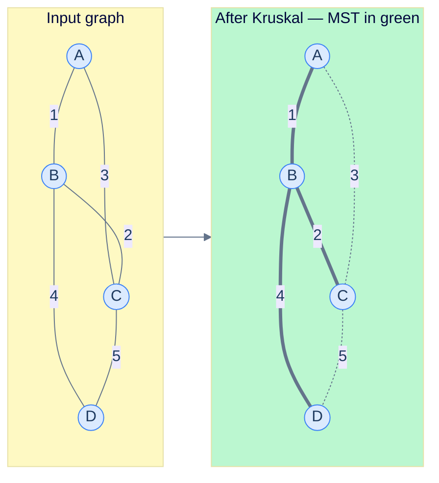

# 17. Minimum Spanning Trees

## The Hook

You're laying internet cable across a country. The map is a graph: cities are vertices, possible cable runs between them are edges, each edge labelled with the cost (distance × terrain). The goal: lay enough cable so every city is reachable from every other, at minimum total cost.

Don't lay every possible cable — you'd be paying for redundancy that's not needed. Don't lay cables haphazardly — you'll fail to connect some cities, or use unnecessarily expensive routes. The optimum is a **spanning tree**: a subset of `V − 1` edges that connects all `V` vertices into a single tree, with no cycles. The spanning tree of *minimum total weight* — the cheapest such connection — is the **Minimum Spanning Tree (MST)**.

Every layout problem with this shape — power grids, water mains, road networks, computer-cluster interconnects, ML feature-clustering, even video-game procedural-map generation — reduces to computing an MST. Two classical algorithms, both `O(E log V)`-class, dominate. **Kruskal** sorts edges by weight and greedily picks the cheapest ones that don't form a cycle (tested via union-find). **Prim** grows the tree from a seed vertex, always adding the cheapest edge to a vertex outside the tree (managed by a priority queue).

This chapter covers both, with implementations, edge cases, and where they live in production.

---

## Table of contents

1. [Spanning trees and the MST property](#spanning-trees-and-the-mst-property)
2. [Kruskal's algorithm](#kruskals-algorithm)
3. [Prim's algorithm](#prims-algorithm)
4. [Implementation](#implementation)
5. [Kruskal vs Prim: which to use](#kruskal-vs-prim-which-to-use)
6. [Edge cases and pitfalls](#edge-cases-and-pitfalls)
7. [Production reality](#production-reality)
8. [Practice ladder](#practice-ladder)
9. [Cross-links](#cross-links)
10. [Final takeaway](#final-takeaway)

***

# Spanning trees and the MST property

Given a connected, undirected, weighted graph `G = (V, E)`:

- A **spanning tree** is a subgraph that includes all `V` vertices, has exactly `V − 1` edges, and is connected and acyclic.
- The **MST** is the spanning tree of minimum total edge-weight.

A graph can have multiple distinct MSTs (when edge weights tie). The MST is unique iff all edge weights are distinct.

The crucial property both algorithms rely on:

> **Cut property.** For any partition of the vertices into two non-empty sets, the **lightest edge crossing the partition** is in *some* MST.

This says: at any moment, if you've identified a "cut" (a way of splitting the vertices), the cheapest edge crossing that cut is safe to include. Both Kruskal and Prim are different strategies for picking the cuts.

***

# Kruskal's algorithm

Walk edges from cheapest to most expensive. Add an edge iff its endpoints are in different components — that's the cut property in action: the edge is the cheapest edge crossing the cut between its component and the rest. Stop when we have `V − 1` edges; the MST is complete.

**Why DSU?** "Are these two endpoints already in the same component?" is exactly the `same_set` query. Path compression + union by rank makes this `O(α(V))` per check.

**Cost.** `O(E log E)` for the sort dominates. The DSU operations across all `E` edges total `O(E α(V))` — essentially linear. Total: `O(E log E) = O(E log V)` (since `E ≤ V²`, `log E ≤ 2 log V`).



<p align="center"><strong>Kruskal builds the MST by adding edges in weight order, skipping any that would form a cycle. Total weight: 1 + 2 + 4 = 7.</strong></p>

***

# Prim's algorithm

Start from an arbitrary vertex. Maintain a frontier of "edges from the tree to outside". Repeatedly pick the cheapest frontier edge; add its outside endpoint to the tree; update the frontier.

The "frontier" is a min-heap (priority queue) keyed by edge weight. Each iteration extracts the cheapest crossing edge — that's the cut property again, with the cut being "tree vs not-tree".

**Cost.** Each edge is pushed onto the heap at most once: `O(E log E) = O(E log V)`. Each vertex is popped at most once: `O(V log V)` extracts. Total: `O((V + E) log V)`.

***

# Implementation

```python run viz=graph viz-root=adj
import heapq

# Kruskal with DSU
class DSU:
    def __init__(self, n):
        self.parent = list(range(n))
        self.rank = [0] * n
    def find(self, x):
        if self.parent[x] != x: self.parent[x] = self.find(self.parent[x])
        return self.parent[x]
    def union(self, x, y):
        rx, ry = self.find(x), self.find(y)
        if rx == ry: return False
        if self.rank[rx] < self.rank[ry]: rx, ry = ry, rx
        self.parent[ry] = rx
        if self.rank[rx] == self.rank[ry]: self.rank[rx] += 1
        return True

def kruskal_mst(n, edges):
    edges = sorted(edges, key=lambda e: e[2])                         # sort by weight
    dsu = DSU(n)
    mst, total = [], 0
    for u, v, w in edges:
        if dsu.union(u, v):
            mst.append((u, v, w))
            total += w
            if len(mst) == n - 1: break
    return mst, total

def prim_mst(n, adj, start=0):
    in_mst = [False] * n
    pq = [(0, start, -1)]                                            # (weight, vertex, parent)
    mst, total = [], 0
    while pq:
        w, u, p = heapq.heappop(pq)
        if in_mst[u]: continue
        in_mst[u] = True
        total += w
        if p != -1: mst.append((p, u, w))
        for v, weight in adj[u]:
            if not in_mst[v]:
                heapq.heappush(pq, (weight, v, u))
    return mst, total


if __name__ == "__main__":
    # Graph from the diagram: A=0, B=1, C=2, D=3
    edges = [(0,1,1), (0,2,3), (1,2,2), (1,3,4), (2,3,5)]
    n = 4

    mst_k, tot_k = kruskal_mst(n, edges)
    print(f"Kruskal MST: {mst_k}    total = {tot_k}")

    adj = [[] for _ in range(n)]
    for u, v, w in edges:
        adj[u].append((v, w))
        adj[v].append((u, w))
    mst_p, tot_p = prim_mst(n, adj, start=0)
    print(f"Prim MST:    {mst_p}    total = {tot_p}")

    # Both algorithms produce the same total weight, possibly different edge sets if there are ties.
    assert tot_k == tot_p, "MST total weight should match"
```

```java run viz=graph viz-root=adj
import java.util.*;

public class Main {
    static class Solution {
        static class DSU {
            int[] p, r;
            DSU(int n) { p = new int[n]; r = new int[n]; for (int i = 0; i < n; i++) p[i] = i; }
            int find(int x) { return p[x] == x ? x : (p[x] = find(p[x])); }
            boolean union(int x, int y) {
                int rx = find(x), ry = find(y);
                if (rx == ry) return false;
                if (r[rx] < r[ry]) { int t = rx; rx = ry; ry = t; }
                p[ry] = rx;
                if (r[rx] == r[ry]) r[rx]++;
                return true;
            }
        }

        static int kruskalMST(int n, int[][] edges) {
            Arrays.sort(edges, Comparator.comparingInt(e -> e[2]));
            DSU dsu = new DSU(n);
            int total = 0, picked = 0;
            for (int[] e : edges) {
                if (dsu.union(e[0], e[1])) { total += e[2]; if (++picked == n - 1) break; }
            }
            return total;
        }

        static int primMST(int n, List<int[]>[] adj, int start) {
            boolean[] inMst = new boolean[n];
            PriorityQueue<int[]> pq = new PriorityQueue<>((a, b) -> a[0] - b[0]);
            pq.offer(new int[]{0, start});
            int total = 0;
            while (!pq.isEmpty()) {
                int[] cur = pq.poll();
                int w = cur[0], u = cur[1];
                if (inMst[u]) continue;
                inMst[u] = true;
                total += w;
                for (int[] nb : adj[u]) if (!inMst[nb[0]]) pq.offer(new int[]{nb[1], nb[0]});
            }
            return total;
        }
    }

    public static void main(String[] args) {
        int n = 4;
        int[][] edges = {{0,1,1}, {0,2,3}, {1,2,2}, {1,3,4}, {2,3,5}};
        System.out.println("Kruskal MST total = " + Solution.kruskalMST(n, edges));

        List<int[]>[] adj = new List[n];
        for (int i = 0; i < n; i++) adj[i] = new ArrayList<>();
        for (int[] e : edges) { adj[e[0]].add(new int[]{e[1], e[2]}); adj[e[1]].add(new int[]{e[0], e[2]}); }
        System.out.println("Prim MST total    = " + Solution.primMST(n, adj, 0));
    }
}
```

***

# Kruskal vs Prim: which to use

Both are `O(E log V)` asymptotically. The choice depends on graph density:

- **Sparse graphs (`E ≈ V`)**: either works; Kruskal is often slightly faster because the sort dominates and is highly optimised.
- **Dense graphs (`E ≈ V²`)**: Prim with an adjacency-matrix-based implementation can run in `O(V²)`, beating Kruskal's `O(V² log V)`. The dense variant uses a "min-distance" array updated in `O(V)` per pop, no heap.
- **Distributed graphs**: Boruvka's algorithm (a third MST algorithm, not covered here) parallelises better.
- **Streaming edges**: Kruskal needs all edges to sort. Prim can be modified for online insertion if you maintain the heap.

In practice, **Kruskal** is the more common choice — it composes well with arbitrary edge filtering, integrates trivially with edge weight modifications, and the union-find code is the same one you'll use for many other graph problems.

***

# Edge cases and pitfalls

- **Disconnected graphs.** Both algorithms find a *spanning forest* on disconnected input — one MST per connected component. Don't assert `len(mst) == V - 1` unconditionally; check the number of components first.
- **Self-loops and parallel edges.** Self-loops are never in an MST (they form 1-vertex cycles). Parallel edges between the same vertex pair: keep the cheapest. Both algorithms handle these correctly if you simply include them — they get filtered automatically.
- **Negative edge weights.** Both algorithms handle negative weights without modification. (Unlike Dijkstra's shortest path, which requires non-negative.)
- **Numerically equal weights.** Multiple MSTs can exist. Kruskal and Prim may return different edge sets but identical total weight. If you need a specific tie-breaking, sort with a secondary key.
- **The `inMst[u] = true` check in Prim.** Without it, the algorithm processes the same vertex multiple times (because it can be pushed onto the heap multiple times via different edges). The `if inMst[u]: continue` is the lazy-deletion equivalent of `decreaseKey` in a textbook Prim implementation.
- **Eager Prim's `decreaseKey`.** A "true" Prim's uses `decreaseKey` on the heap to update an existing entry's priority when a better edge to a frontier vertex is found. Real heaps don't support `decreaseKey` cheaply; the lazy-Prim's version above (push duplicates, skip on pop) is what every standard library uses.
- **Forgetting to sort by weight in Kruskal.** It's the *whole* basis of correctness. Triple-check the sort key.

***

# Production reality

- **Network design tools.** Cisco's NetSim, Aruba's network planners, and almost every graph-theoretic CAD tool include MST as a primitive operation for "minimum cost connected layout".
- **Image segmentation in computer vision.** Felzenszwalb's segmentation algorithm builds a graph over image pixels, then computes an MST — segments are subtrees of the MST below a weight threshold. Used in early-2000s computer vision papers and still in scikit-image.
- **Approximate clustering.** "Single-linkage hierarchical clustering" is *exactly* MST construction over a distance graph, then cutting the heaviest edges. The result is a hierarchy of clusters.
- **Routing in distributed systems.** OSPF, EIGRP, and IS-IS use shortest-path-based routing rather than MST — but related algorithms use spanning trees for broadcast and multicast in switched networks.
- **Power-grid layouts.** Texas's electric grid (and many others) was historically built using MST-style optimisation: connect every substation to the grid using minimum-cost transmission lines, subject to engineering constraints.
- **Boost Graph Library** (`boost::graph::kruskal_minimum_spanning_tree`, `prim_minimum_spanning_tree`) is the canonical C++ reference implementation. Source: `<boost/graph/kruskal_min_spanning_tree.hpp>`.
- **NetworkX** (`nx.minimum_spanning_tree`) — the Python-graph-library standard. Defaults to Kruskal.

***

# Practice ladder

1. **Min Cost to Connect All Points** ([LeetCode 1584](https://leetcode.com/problems/min-cost-to-connect-all-points/)) — given 2D points, return the min cost to connect them all (cost = Manhattan distance).
   > *Hint:* build the complete graph (`n²/2` edges), run Kruskal or Prim. With `n ≤ 1000`, both fit easily.

2. **Connecting Cities With Minimum Cost** ([LeetCode 1135](https://leetcode.com/problems/connecting-cities-with-minimum-cost/)) — straightforward MST on a weighted graph.
   > *Hint:* Kruskal. If after processing all edges fewer than `n − 1` were taken, return `-1` (graph not connected).

3. **Optimize Water Distribution in a Village** ([LeetCode 1168](https://leetcode.com/problems/optimize-water-distribution-in-a-village/)) — each house has a "build-a-well" cost or can connect to a neighbour.
   > *Hint:* introduce a virtual vertex 0 with edges to each house equal to the well-build cost. Run MST on this `n+1` vertex graph.

4. **Find Critical and Pseudo-Critical Edges** ([LeetCode 1489](https://leetcode.com/problems/find-critical-and-pseudo-critical-edges-in-minimum-spanning-tree/)) — for each edge, decide whether it's in *every* MST (critical) or *some* MST but not all (pseudo-critical).
   > *Hint:* compute the MST weight `w*`. For each edge `e`: forcing-include vs forcing-exclude. If the MST weight goes up when you exclude `e`, it's critical. If forcing-include `e` produces an MST with weight `w*`, it's at least pseudo-critical.

5. **Boruvka's algorithm.** Implement the third major MST algorithm: in each round, every component finds its cheapest outgoing edge and unions across it. After `O(log V)` rounds, only one component remains.
   > *Hint:* per round: scan all edges, for each find the component on each side, track each component's cheapest outgoing edge. Union along all those edges. `O(E log V)` total work; each round halves the component count.

***

# Memorize

The high-leverage facts to commit to long-term memory — atomic enough for an Anki card, concrete enough to recall under pressure or during production debugging. The cut property is the single theorem behind every MST algorithm; once you've internalised it, both Kruskal and Prim become "the obvious thing".

## Quick recall

Click any question to reveal the answer.

<details>
<summary><strong>Q:</strong> What is a spanning tree?</summary>

**A:** A subgraph that touches every vertex, has exactly `V − 1` edges, is connected and acyclic. The MST minimises total edge weight.

</details>
<details>
<summary><strong>Q:</strong> The cut property?</summary>

**A:** For any partition of the vertices, the *lightest edge crossing the partition* is in some MST. Both Kruskal and Prim are corollaries.

</details>
<details>
<summary><strong>Q:</strong> Time complexity of Kruskal vs Prim?</summary>

**A:** Both `O(E log V)`. Kruskal: sort dominates. Prim with binary heap: `O((V + E) log V)`. Prim with Fibonacci heap: `O(E + V log V)`.

</details>
<details>
<summary><strong>Q:</strong> Kruskal's algorithm in three lines?</summary>

**A:** Sort edges by weight; iterate; for each edge, if endpoints are in different DSU components, union them and accept the edge. Stop when `V − 1` edges accepted.

</details>
<details>
<summary><strong>Q:</strong> Prim's algorithm in three lines?</summary>

**A:** Maintain a min-heap of edges from the tree to outside; repeatedly extract the lightest, add the new vertex; push that vertex's outgoing edges. `O(E log V)` total.

</details>
<details>
<summary><strong>Q:</strong> When does Prim beat Kruskal?</summary>

**A:** Dense graphs (`E ≈ V²`). Prim with adjacency matrix runs in `O(V²)`, beating Kruskal's `O(V² log V)`.

</details>
<details>
<summary><strong>Q:</strong> Does MST require non-negative edge weights?</summary>

**A:** No. Both Kruskal and Prim handle negative weights without modification. (Unlike Dijkstra's shortest path.)

</details>
<details>
<summary><strong>Q:</strong> Is the MST unique?</summary>

**A:** Iff all edge weights are distinct. Otherwise multiple MSTs may exist with the same total weight.

</details>

## Code template

```python
# Kruskal — short, idiomatic, uses DSU.
def kruskal_mst(n, edges):
    edges = sorted(edges, key=lambda e: e[2])               # by weight
    dsu = DSU(n)
    mst, total = [], 0
    for u, v, w in edges:
        if dsu.union(u, v):
            mst.append((u, v, w))
            total += w
            if len(mst) == n - 1: break
    return mst, total

# Prim — heap-based, lazy version (skips already-in-MST nodes on pop).
import heapq
def prim_mst(n, adj, start=0):
    in_mst = [False] * n
    pq = [(0, start, -1)]                                   # (weight, vertex, parent)
    mst, total = [], 0
    while pq:
        w, u, p = heapq.heappop(pq)
        if in_mst[u]: continue
        in_mst[u] = True
        total += w
        if p != -1: mst.append((p, u, w))
        for v, weight in adj[u]:
            if not in_mst[v]: heapq.heappush(pq, (weight, v, u))
    return mst, total
```

## Pattern triggers

- **"Cheapest way to connect all of X"** → MST
- **Dense graph** → Prim with adjacency matrix
- **Sparse graph** → Kruskal (sort + DSU)
- **Streaming edges, can't sort** → Prim
- **Single-linkage hierarchical clustering** → MST construction (it's the same algorithm)
- **Image segmentation by graph cut** → MST + threshold (Felzenszwalb)
- **"Critical edges in MST"** → exclude each, see if MST weight changes
- **"Find min-cost layout for power grid / cable network"** → MST

***

# Cross-links

- **Prerequisites:** [Graph introduction](/cortex/data-structures-and-algorithms/graphs-introduction-to-graphs), [DSU](/cortex/data-structures-and-algorithms/trees-disjoint-set-union-introduction-to-disjoint-set-union), [Heap](/cortex/data-structures-and-algorithms/trees-heap-introduction-to-heaps).
- **Sibling algorithms:** [Single-Source Shortest Path](/cortex/data-structures-and-algorithms/graphs-single-source-shortest-path) — Dijkstra is structurally similar to Prim but with a different relaxation.
- **Greedy in disguise:** [Greedy Algorithms](/cortex/data-structures-and-algorithms/algorithms-by-strategy-greedy-introduction-to-greedy-algorithms) — Kruskal and Prim are both greedy; the cut property is the proof of optimality.

***

# Final Takeaway

The MST is the cheapest way to connect everything. Three patterns to internalise:

1. **The cut property is the engine.** "Cheapest crossing edge is in some MST." Kruskal applies it greedily across edges; Prim applies it incrementally from a tree. Both work because of the same theorem.
2. **DSU + sort = Kruskal; heap + frontier = Prim.** The two algorithms decompose neatly into prerequisite data structures. If you can implement those, you can implement either MST algorithm in 20 lines.
3. **MST is one of the rare non-trivial polynomial-time problems** that's both fundamental and easy to get right. Once you have the cut property, every line of code follows.

<!-- ============================================== -->
<!-- SWEEP 2 — missing sections (placeholders only) -->
<!-- ============================================== -->

<!-- TODO: Understanding the Problem — missing, needs to be written -->
<!--       Guidance: frame the gap the structure/algorithm fills -->

<!-- TODO: Supported Operations — missing, needs to be written -->
<!--       Guidance: table: operation / time / notes -->

<!-- TODO: Internal Mechanics — missing, needs to be written -->
<!--       Guidance: how it actually works under the hood -->

<!-- TODO: Working Example — missing, needs to be written -->
<!--       Guidance: one fully worked end-to-end example -->

<!-- TODO: Quiz — missing, needs to be written -->
<!--       Guidance: 3–5 questions, each labeled [Recall]/[Reasoning]/[Tradeoff] -->

<!-- TODO: Further Reading — missing, needs to be written -->
<!--       Guidance: annotated: ★ Essential / ◆ Advanced / → Reference -->
