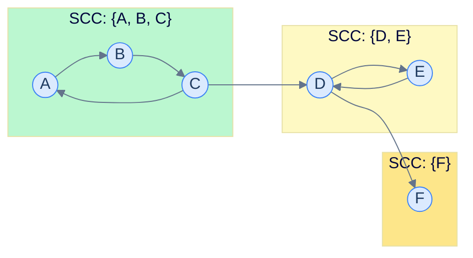

# 18. Strongly Connected Components

## The Hook

In a directed graph, a **strongly connected component (SCC)** is a maximal set of vertices where every vertex can reach every other (following edge directions). In an undirected graph, "reachable from" is symmetric — connected components and SCCs collapse to the same thing. In directed graphs, they don't: a graph can have lots of "components in spirit" without any of them being mutually reachable.

SCCs matter wherever the directionality of edges is real:

- **Software dependency analysis.** "Module A depends on B" is directional. SCCs identify *cycles* of mutual dependency that need to be broken or refactored.
- **Compiler analysis.** Definitions and uses of variables form a dependency graph; SCCs find variables that are mutually-defined (e.g., recursive function bindings).
- **Web crawl analysis.** Webpage links form a directed graph. The "core" of the web — the giant SCC where every page can reach every other — is a major structural feature.
- **2-SAT.** As we'll see in the next chapter, every 2-SAT problem reduces to an SCC computation on an implication graph.

Two classical `O(V + E)` algorithms find all SCCs. **Kosaraju**'s algorithm is two DFS passes — easy to remember, slightly slower in practice. **Tarjan**'s algorithm is one DFS pass with a stack and a "lowlink" trick — harder to grasp but slightly faster and the more common in production. This chapter covers both.

---

## Table of contents

1. [The strongly connected component](#the-strongly-connected-component)
2. [Kosaraju's algorithm](#kosarajus-algorithm)
3. [Tarjan's algorithm](#tarjans-algorithm)
4. [Implementation](#implementation)
5. [The condensation graph](#the-condensation-graph)
6. [Edge cases and pitfalls](#edge-cases-and-pitfalls)
7. [Production reality](#production-reality)
8. [Practice ladder](#practice-ladder)
9. [Cross-links](#cross-links)
10. [Final takeaway](#final-takeaway)

***

# The strongly connected component

Two vertices `u, v` are in the same SCC iff there is both a path from `u` to `v` *and* a path from `v` to `u`. The relation "is mutually reachable from" is an *equivalence relation* — reflexive, symmetric, transitive — so its equivalence classes partition the vertex set. Each equivalence class is an SCC.



<p align="center"><strong>Three SCCs in a small directed graph. Cross-component edges only go "downhill" — there are no back-edges from a later SCC to an earlier one (otherwise they'd merge).</strong></p>

The **condensation** of a graph collapses each SCC into a single super-vertex. The result is a *DAG* — there are no cycles between SCCs. This DAG is what dependency analysis tools draw when reporting "cycles found in modules X, Y, Z".

***

# Kosaraju's algorithm

Two DFS passes:

1. **Pass 1: order vertices by DFS finish time.** Run DFS on the original graph, pushing vertices onto a stack as they finish (post-order). The stack now has vertices in *reverse* finish order — the "latest to finish" is on top.
2. **Pass 2: DFS on the transpose.** Build the *transposed* graph (every edge reversed). Pop vertices from the stack; each unvisited pop starts a new DFS on the transpose. Each DFS tree is one SCC.

Why does this work? In the original graph, the latest-to-finish vertex of pass 1 is in the SCC that is "first" in the condensation DAG (no incoming SCC edges). In the transpose, that SCC has no outgoing inter-SCC edges, so DFS from any of its vertices can't escape it. The SCC is captured cleanly. Recurse with the next stack element.

`O(V + E)` — two linear-time DFS passes.

***

# Tarjan's algorithm

Single DFS pass. Maintains:

- `disc[v]` — discovery time of `v` (when DFS first visited).
- `low[v]` — the smallest discovery time reachable from `v` via tree edges followed by at most one back-edge.
- A **stack** of vertices currently in the recursion path (and not yet assigned to an SCC).
- A flag `on_stack[v]` to make stack membership `O(1)`.

The key insight: a vertex `u` is the **root of an SCC** iff `low[u] = disc[u]`. When DFS finishes such a `u`, every vertex still on the stack from `u` upward is in `u`'s SCC. Pop them all together.

`O(V + E)` — every vertex and edge is visited once.

The lowlink trick is the genius of the algorithm: `low[u]` tracks how far back up the DFS stack `u` (and its descendants) can reach. If `low[u] = disc[u]`, then `u` cannot reach any earlier-discovered vertex — `u` is an SCC root.

***

# Implementation

```python run
import sys
sys.setrecursionlimit(10**6)

def kosaraju(n, adj):
    visited = [False] * n
    stack = []

    def dfs1(u):
        visited[u] = True
        for v in adj[u]:
            if not visited[v]: dfs1(v)
        stack.append(u)

    for i in range(n):
        if not visited[i]: dfs1(i)

    # Transpose
    adj_t = [[] for _ in range(n)]
    for u in range(n):
        for v in adj[u]:
            adj_t[v].append(u)

    visited = [False] * n
    sccs = []
    while stack:
        u = stack.pop()
        if not visited[u]:
            scc = []
            stk = [u]
            visited[u] = True
            while stk:
                x = stk.pop()
                scc.append(x)
                for y in adj_t[x]:
                    if not visited[y]:
                        visited[y] = True
                        stk.append(y)
            sccs.append(scc)
    return sccs


def tarjan(n, adj):
    disc = [-1] * n
    low = [-1] * n
    on_stack = [False] * n
    stk = []
    sccs = []
    timer = [0]

    def dfs(u):
        disc[u] = low[u] = timer[0]
        timer[0] += 1
        stk.append(u); on_stack[u] = True
        for v in adj[u]:
            if disc[v] == -1:
                dfs(v)
                low[u] = min(low[u], low[v])
            elif on_stack[v]:
                low[u] = min(low[u], disc[v])
        if low[u] == disc[u]:
            scc = []
            while True:
                w = stk.pop(); on_stack[w] = False
                scc.append(w)
                if w == u: break
            sccs.append(scc)

    for v in range(n):
        if disc[v] == -1: dfs(v)
    return sccs


if __name__ == "__main__":
    # Graph from the diagram: A-F = 0-5
    n = 6
    edges = [(0,1), (1,2), (2,0), (2,3), (3,4), (4,3), (3,5)]
    adj = [[] for _ in range(n)]
    for u, v in edges:
        adj[u].append(v)

    print(f"Kosaraju: {[sorted(s) for s in kosaraju(n, adj)]}")
    print(f"Tarjan:   {[sorted(s) for s in tarjan(n, adj)]}")
```

```java run
import java.util.*;

public class Main {
    static class Solution {
        static int[] disc, low;
        static boolean[] onStack;
        static Deque<Integer> stk = new ArrayDeque<>();
        static List<List<Integer>> sccs = new ArrayList<>();
        static int timer = 0;

        static void tarjan(int u, List<List<Integer>> adj) {
            disc[u] = low[u] = timer++;
            stk.push(u);
            onStack[u] = true;
            for (int v : adj.get(u)) {
                if (disc[v] == -1) {
                    tarjan(v, adj);
                    low[u] = Math.min(low[u], low[v]);
                } else if (onStack[v]) {
                    low[u] = Math.min(low[u], disc[v]);
                }
            }
            if (low[u] == disc[u]) {
                List<Integer> scc = new ArrayList<>();
                while (true) {
                    int w = stk.pop();
                    onStack[w] = false;
                    scc.add(w);
                    if (w == u) break;
                }
                sccs.add(scc);
            }
        }
    }

    public static void main(String[] args) {
        int n = 6;
        int[][] edges = {{0,1}, {1,2}, {2,0}, {2,3}, {3,4}, {4,3}, {3,5}};
        List<List<Integer>> adj = new ArrayList<>();
        for (int i = 0; i < n; i++) adj.add(new ArrayList<>());
        for (int[] e : edges) adj.get(e[0]).add(e[1]);

        Solution.disc = new int[n]; Solution.low = new int[n]; Solution.onStack = new boolean[n];
        Arrays.fill(Solution.disc, -1);
        for (int i = 0; i < n; i++) if (Solution.disc[i] == -1) Solution.tarjan(i, adj);
        for (List<Integer> scc : Solution.sccs) Collections.sort(scc);
        System.out.println("Tarjan: " + Solution.sccs);
    }
}
```

***

# The condensation graph

Once you have SCCs, the **condensation graph** is the DAG you get by collapsing each SCC into a single super-vertex. Edges in the condensation: from SCC `X` to SCC `Y` iff some original edge `(u, v)` has `u ∈ X`, `v ∈ Y`, and `X ≠ Y`.

The condensation DAG is a powerful tool. Many problems on a directed graph are easier on its condensation:

- **2-SAT** reduces to checking whether every variable and its negation are in different SCCs of an implication graph.
- **Counting reachable pairs** is `O(V + E)` on the condensation.
- **Topological sort of SCCs** gives a meaningful "dependency order" even when the original graph has cycles.

***

# Edge cases and pitfalls

- **Recursion depth on huge graphs.** Both algorithms are recursive DFS. For graphs with paths of `10⁶+` vertices, the stack overflows. Iterative DFS using an explicit stack is the production-grade fix.
- **Self-loops.** A vertex with a self-loop is in its own SCC of size 1 (or larger if it's part of a cycle). The algorithms handle self-loops correctly without modification.
- **Disconnected graphs.** Both algorithms iterate over all vertices, starting a new DFS for each unvisited one. Handles disconnection automatically.
- **Tarjan's `disc[v]` vs `low[v]`.** Easy to confuse. `disc[v]` never changes after the first visit; `low[v]` updates as we discover that `v` can reach earlier vertices.
- **`on_stack` is critical in Tarjan.** Without it, the `else if` branch would update `low[u]` from cross-edges leading to *other* SCCs that have already been popped — wrong. The flag distinguishes "still in current SCC" from "already assigned to another".
- **Edge enumeration order.** Different DFS orders produce different SCC traversal orders, but the *set* of SCCs is invariant. Don't rely on a specific output order.

***

# Production reality

- **Compiler liveness analysis.** Variables and their definitions form an SCC structure: mutually-recursive functions become a single SCC, top-down dependencies form the rest of the DAG.
- **Software architecture tools.** Tools like `pylint`'s circular-dependency check, `madge` (JS dependency cycle detection), and Java's Sonar all run SCC algorithms on module-import graphs to flag cyclic dependencies.
- **Web-graph analysis.** Andrei Broder's seminal 2000 paper "Graph structure in the Web" identified the giant SCC of the web (~28% of pages at the time) using SCC computation on a 200M-page crawl.
- **Boost Graph Library** (`boost::strong_components`) — Tarjan-based.
- **NetworkX** (`nx.strongly_connected_components`, `nx.tarjan`) — Python.
- **2-SAT solvers.** Many SAT-solver back-ends include a 2-SAT specialisation that uses Tarjan's algorithm to handle the special case in linear time.
- **The Linux kernel's `lockdep` tool** does SCC-like cycle detection on a graph of locking dependencies to flag potential deadlock cycles. Different algorithm internally, same problem shape.

***

# Practice ladder

1. **Number of SCCs.** Implement Tarjan's; verify by checking that the sum of SCC sizes equals `V`.
   > *Hint:* literally the chapter's implementation. Test on a graph with multiple isolated SCCs to make sure the outer loop kicks off DFS for every connected component.

2. **Critical Connections in a Network** ([LeetCode 1192](https://leetcode.com/problems/critical-connections-in-a-network/)) — find all bridges in a graph. (This is *bridges*, not SCCs — covered in the next chapter — but the lowlink trick is the same.)
   > *Hint:* an undirected edge `(u, v)` is a bridge iff `low[v] > disc[u]`. Run a DFS computing `low` and `disc` similar to Tarjan's. The next chapter goes into detail.

3. **Cycle in directed graph using SCC.** Given a directed graph, return whether it has *any* cycle.
   > *Hint:* a graph has a cycle iff some SCC has size ≥ 2, OR some vertex has a self-loop.

4. **Strongly connected components count.** Given an `n × n` adjacency matrix of a directed graph, return the number of SCCs.
   > *Hint:* convert to adjacency list (faster for sparse graphs); run Tarjan's.

5. **Mother vertex of a graph.** A *mother vertex* is a vertex from which every other vertex is reachable. Find one in `O(V + E)`.
   > *Hint:* in Kosaraju's first DFS, the *last* vertex to finish is a candidate. Verify by running BFS/DFS from it; if it reaches every vertex, it's a mother. Otherwise no mother exists.

***

# Memorize

The high-leverage facts to commit to long-term memory — atomic enough for an Anki card, concrete enough to recall under pressure or during production debugging. SCCs unlock dependency cycles in code, the giant component of the web, 2-SAT, and many other problems — recognising the shape is half the battle.

## Quick recall

Click any question to reveal the answer.

<details>
<summary><strong>Q:</strong> Definition of an SCC?</summary>

**A:** A maximal set of vertices in a directed graph where every vertex can reach every other. The relation "mutually reachable" is an equivalence relation; SCCs partition the vertex set.

</details>
<details>
<summary><strong>Q:</strong> Time complexity of Kosaraju? Of Tarjan?</summary>

**A:** Both `O(V + E)`. Kosaraju does two DFS passes; Tarjan does one with the lowlink trick.

</details>
<details>
<summary><strong>Q:</strong> Two passes of Kosaraju?</summary>

**A:** **Pass 1** — DFS the original graph, push vertices onto a stack as they finish. **Pass 2** — DFS the *transpose* graph in stack-pop order; each DFS tree is one SCC.

</details>
<details>
<summary><strong>Q:</strong> What does <code>low[u]</code> mean in Tarjan's algorithm?</summary>

**A:** The smallest discovery time reachable from `u` via tree edges followed by *at most one* back-edge. If `low[u] == disc[u]`, `u` is the root of an SCC.

</details>
<details>
<summary><strong>Q:</strong> Why does Tarjan need the <code>on_stack</code> flag?</summary>

**A:** To distinguish "still in current SCC" from "already assigned to another SCC". Without it, you'd update `low[u]` from cross-edges into other SCCs and merge them incorrectly.

</details>
<details>
<summary><strong>Q:</strong> What's the condensation graph?</summary>

**A:** Collapse each SCC into a single super-vertex. The result is a *DAG*. Many problems on directed graphs reduce to "find SCCs, solve on the DAG".

</details>
<details>
<summary><strong>Q:</strong> When does Tarjan beat Kosaraju in production?</summary>

**A:** Almost always — single pass, smaller constant factor. Production code (Boost, NetworkX) uses Tarjan by default.

</details>
<details>
<summary><strong>Q:</strong> Does a directed graph have a cycle iff some SCC has size ≥ 2?</summary>

**A:** Almost. The exact rule: a cycle exists iff some SCC has size ≥ 2 OR some vertex has a self-loop.

</details>

## Code template

```python
def tarjan(n, adj):
    disc = [-1] * n
    low = [-1] * n
    on_stack = [False] * n
    stk, sccs = [], []
    timer = [0]

    def dfs(u):
        disc[u] = low[u] = timer[0]; timer[0] += 1
        stk.append(u); on_stack[u] = True
        for v in adj[u]:
            if disc[v] == -1:
                dfs(v)
                low[u] = min(low[u], low[v])
            elif on_stack[v]:
                low[u] = min(low[u], disc[v])
        if low[u] == disc[u]:
            scc = []
            while True:
                w = stk.pop(); on_stack[w] = False
                scc.append(w)
                if w == u: break
            sccs.append(scc)

    for v in range(n):
        if disc[v] == -1: dfs(v)
    return sccs
```

## Pattern triggers

- **"Find cycles in a directed graph"** → SCCs of size ≥ 2 (plus self-loops)
- **"Detect circular dependencies between modules"** → SCCs of the dependency graph
- **"Compress a directed graph to its DAG"** → condensation via SCC
- **"2-SAT solvability"** → no variable and its negation in the same SCC of the implication graph
- **"Mother vertex" / "vertex reaching all others"** → last vertex Kosaraju finishes
- **"Topological sort of a graph with cycles"** → topo-sort the condensation DAG
- **"Web graph / dependency graph at scale"** → Tarjan on the directed-edge representation
- **Recursion-stack overflow on big graphs** → iterative Tarjan with an explicit stack

***

# Cross-links

- **Prerequisites:** [Graph Traversal](/cortex/data-structures-and-algorithms/graphs-traversing-a-graph), [Cycle Detection](/cortex/data-structures-and-algorithms/graphs-cycle-detection).
- **Used by:** **2-SAT** (next chapter) — *stub*.
- **Related:** [Bridges and Articulation Points](/cortex/data-structures-and-algorithms/graphs-bridges-and-articulation-points) — same lowlink trick on undirected graphs.

***

# Final Takeaway

SCCs partition a directed graph into "everything mutually reachable". Three patterns to internalise:

1. **The relation is an equivalence relation.** Reflexive, symmetric, transitive. The equivalence classes — the SCCs — are unique and partition the vertex set.
2. **Two algorithms, one cost.** Both Kosaraju and Tarjan are `O(V + E)`. Kosaraju is two passes; Tarjan is one pass with the lowlink trick. Production code overwhelmingly uses Tarjan because of the constant-factor advantage and elegance.
3. **The condensation graph is a DAG.** That's why so many problems on directed graphs reduce to "compute SCCs, then solve on the DAG" — the DAG is easier in every algorithmic sense.
