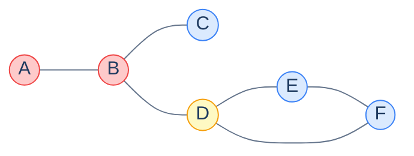

# 19. Bridges and Articulation Points

## The Hook

You're managing a power grid. Every connection between cities is a transmission line; remove a line, and either (a) the grid stays connected, or (b) some city loses power. The lines whose removal *would* disconnect part of the grid are **bridges** — single points of failure that need extra monitoring, redundancy, or hardening. The cities that play the same single-point-of-failure role for the grid are **articulation points** (or "cut vertices"): if that city's substation goes down, parts of the grid go dark.

The same problem shape shows up in: network reliability ("which links are critical?"), social network analysis ("who is the bridge between two communities?"), molecular biology ("which atom-bond removals would break the molecule?"), and software architecture ("which modules are critical that, if they go down, break the rest?").

Both problems — finding all bridges, finding all articulation points — are solved in `O(V + E)` using the same **lowlink trick** Tarjan invented for SCCs. This chapter covers both. They're often taught together because the algorithms differ by only a few lines.

---

## Table of contents

1. [Definitions](#definitions)
2. [The lowlink criterion](#the-lowlink-criterion)
3. [Bridge-finding algorithm](#bridge-finding-algorithm)
4. [Articulation-point algorithm](#articulation-point-algorithm)
5. [Implementation](#implementation)
6. [Edge cases and pitfalls](#edge-cases-and-pitfalls)
7. [Production reality](#production-reality)
8. [Practice ladder](#practice-ladder)
9. [Cross-links](#cross-links)
10. [Final takeaway](#final-takeaway)

***

# Definitions

In an undirected graph `G`:

- An **edge** `(u, v)` is a **bridge** iff removing it increases the number of connected components.
- A **vertex** `v` is an **articulation point** (or *cut vertex*) iff removing `v` (and its incident edges) increases the number of connected components.

In tree terms (every undirected graph DFS produces a tree + back-edges): a tree edge is a bridge iff there's no back-edge from the lower subtree to anywhere at or above the upper endpoint. A vertex is an articulation point iff some child subtree has no back-edge bypassing it.



<p align="center"><strong>Articulation points (yellow): <strong>B</strong> (removing B disconnects A from C-D-E-F) and <strong>D</strong> (removing D disconnects E-F from B-C). Bridges (red edges <strong>A-B</strong> and <strong>B-C</strong>): removing either disconnects a single vertex. Edge B-D is also a bridge. The cycle D-E-F means none of those edges is a bridge — they're all on a cycle.</strong></p>

***

# The lowlink criterion

Run a DFS. For each vertex `v`, compute:

- `disc[v]` — discovery time.
- `low[v]` — the smallest `disc` value reachable from `v` via tree edges followed by *at most one* back-edge.

> **Bridge criterion.** A tree edge `(u, v)` (with `v` discovered from `u`) is a bridge iff `low[v] > disc[u]`. (The subtree under `v` has no back-edge to `u` or earlier; cutting `(u, v)` disconnects `v`'s subtree.)
>
> **Articulation criterion.** A non-root vertex `u` is an articulation point iff some tree-child `v` of `u` has `low[v] ≥ disc[u]`. (`v`'s subtree can't bypass `u`.) The DFS root is an articulation point iff it has *two or more tree-children* (otherwise removing it doesn't disconnect anything).

The same `low[]` array, two different criteria. One DFS computes both at once.

***

# Bridge-finding algorithm

`O(V + E)`. The single tweak from SCC's algorithm: we ignore the parent edge when scanning neighbours (otherwise we'd "find a back-edge" along the tree edge itself, breaking the criterion).

**Multi-edge gotcha.** If two distinct edges go between the same pair of vertices, neither is a bridge (one is a backup for the other). Track edges by ID, not by endpoint pairs, when this matters.

***

# Articulation-point algorithm

The root special case: a DFS root is an articulation point iff it has ≥ 2 tree children, because removing it disconnects those children's subtrees.

***

# Implementation

```python run viz=graph viz-root=adj
import sys
sys.setrecursionlimit(10**6)

def find_bridges_and_articulations(n, adj):
    disc = [-1] * n
    low = [-1] * n
    is_art = [False] * n
    bridges = []
    timer = [0]

    def dfs(u, parent):
        disc[u] = low[u] = timer[0]; timer[0] += 1
        children = 0
        for v in adj[u]:
            if v == parent:
                continue
            if disc[v] == -1:
                children += 1
                dfs(v, u)
                low[u] = min(low[u], low[v])
                if low[v] > disc[u]:
                    bridges.append((u, v))
                if parent != -1 and low[v] >= disc[u]:
                    is_art[u] = True
            else:
                low[u] = min(low[u], disc[v])
        if parent == -1 and children >= 2:
            is_art[u] = True

    for v in range(n):
        if disc[v] == -1:
            dfs(v, -1)

    return bridges, [v for v in range(n) if is_art[v]]


if __name__ == "__main__":
    # Graph from the diagram: A=0, B=1, C=2, D=3, E=4, F=5
    n = 6
    edges = [(0,1), (1,2), (1,3), (3,4), (4,5), (5,3)]
    adj = [[] for _ in range(n)]
    for u, v in edges:
        adj[u].append(v); adj[v].append(u)

    bridges, articulations = find_bridges_and_articulations(n, adj)
    print(f"Bridges:        {bridges}")
    print(f"Articulations:  {articulations}     (expected [1, 3])")
```

```java run viz=graph viz-root=adj
import java.util.*;

public class Main {
    static class Solution {
        static int[] disc, low;
        static boolean[] isArt;
        static int timer = 0;
        static List<int[]> bridges = new ArrayList<>();

        static void dfs(int u, int parent, List<List<Integer>> adj) {
            disc[u] = low[u] = timer++;
            int children = 0;
            for (int v : adj.get(u)) {
                if (v == parent) continue;
                if (disc[v] == -1) {
                    children++;
                    dfs(v, u, adj);
                    low[u] = Math.min(low[u], low[v]);
                    if (low[v] > disc[u]) bridges.add(new int[]{u, v});
                    if (parent != -1 && low[v] >= disc[u]) isArt[u] = true;
                } else {
                    low[u] = Math.min(low[u], disc[v]);
                }
            }
            if (parent == -1 && children >= 2) isArt[u] = true;
        }
    }

    public static void main(String[] args) {
        int n = 6;
        int[][] edges = {{0,1}, {1,2}, {1,3}, {3,4}, {4,5}, {5,3}};
        List<List<Integer>> adj = new ArrayList<>();
        for (int i = 0; i < n; i++) adj.add(new ArrayList<>());
        for (int[] e : edges) { adj.get(e[0]).add(e[1]); adj.get(e[1]).add(e[0]); }

        Solution.disc = new int[n]; Solution.low = new int[n]; Solution.isArt = new boolean[n];
        Arrays.fill(Solution.disc, -1);
        for (int i = 0; i < n; i++) if (Solution.disc[i] == -1) Solution.dfs(i, -1, adj);
        for (int[] b : Solution.bridges) System.out.println("bridge: " + b[0] + "-" + b[1]);
        for (int i = 0; i < n; i++) if (Solution.isArt[i]) System.out.println("articulation: " + i);
    }
}
```

***

# Edge cases and pitfalls

- **Multi-edges (parallel edges).** Two distinct edges between the same vertex pair: neither is a bridge. The naive `if v == parent` check fails because both edges look like the parent edge. Fix: track *edge IDs*, not vertex pairs. Skip the specific parent *edge*, not all parent-vertex traversals.
- **Self-loops.** Self-loops don't affect connectivity. Filter them or check `if u == v`.
- **DFS root special case.** Root is an articulation point iff it has ≥ 2 tree children. Don't apply the `low[v] ≥ disc[u]` rule to the root — it would always count.
- **Disconnected graphs.** Both algorithms handle disconnection by iterating across all vertices and starting a new DFS for each unvisited one.
- **`>` vs `≥` in the criteria.** Bridge: `low[v] > disc[u]` (strict). Articulation: `low[v] ≥ disc[u]` (non-strict). The difference is "could v's subtree reach u's *level*" — if it can, removing the edge `(u,v)` is still safe (the subtree has another route through u), but removing the *vertex* u still disconnects.
- **Recursion depth.** Same caution as Tarjan's SCC: for paths of `10⁶` vertices, the stack overflows. Iterative DFS using an explicit stack is the production fix.

***

# Production reality

- **Network engineering.** Cisco, Juniper, and other network vendors run articulation-point analysis to identify "single points of failure" in their backbone topologies — to recommend redundancy upgrades.
- **The Linux kernel's network stack** uses related "biconnected component" analysis on the spanning-tree topology of bridged Ethernet networks (IEEE 802.1D STP).
- **Compilation and dependency analysis.** A "bridge module" in a software dependency graph is one whose removal disconnects portions of the system — a critical refactoring target.
- **Social-network analysis.** Bridges in friendship networks identify "weak ties" connecting otherwise separate communities — a well-known sociological concept (Granovetter's "Strength of Weak Ties").
- **Phylogenetic biology.** Identifying critical organisms or reactions in metabolic networks via articulation analysis.
- **Boost Graph Library** has both `boost::biconnected_components` (which gives articulations as a side effect) and a separate bridge-finder.
- **NetworkX** (`nx.bridges`, `nx.articulation_points`).

***

# Practice ladder

1. **Critical Connections in a Network** ([LeetCode 1192](https://leetcode.com/problems/critical-connections-in-a-network/)) — return all bridges.
   > *Hint:* the chapter's bridge algorithm. The LeetCode time limit is tight; iterative DFS may be required for the largest test cases.

2. **Find Articulation Points.** Given an undirected graph, return all articulation points.
   > *Hint:* same as above; use the articulation criterion.

3. **Min-Bridge-Spanning Layout.** Given a graph, find the minimum number of edges to add so that there are zero bridges (i.e., the graph becomes 2-edge-connected).
   > *Hint:* run bridge-finder; the answer is `⌈leaves of the bridge-tree / 2⌉`. The "bridge-tree" is the condensation of the graph by 2-edge-connected components.

4. **Identify all 2-edge-connected components.** Run bridge-finding; remove bridges; the connected components of the residual graph are the 2-edge-connected components.
   > *Hint:* trivial after running the bridge algorithm. Useful for follow-up problems.

5. **Largest 2-vertex-connected component.** Run articulation-point detection; partition the graph by removing articulation points; pick the biggest piece.
   > *Hint:* "biconnected components" is the technical name. Each component shares at most one articulation point with another.

***

# Memorize

The high-leverage facts to commit to long-term memory — atomic enough for an Anki card, concrete enough to recall under pressure or during production debugging. Bridges and articulation points share Tarjan's lowlink machinery; they differ by *one character* in the criterion.

## Quick recall

Click any question to reveal the answer.

<details>
<summary><strong>Q:</strong> Define a bridge.</summary>

**A:** An edge whose removal disconnects the graph (increases the number of connected components).

</details>
<details>
<summary><strong>Q:</strong> Define an articulation point.</summary>

**A:** A vertex whose removal (with all its incident edges) disconnects the graph.

</details>
<details>
<summary><strong>Q:</strong> Bridge criterion?</summary>

**A:** A tree edge `(u, v)` (with `v` discovered from `u`) is a bridge iff `low[v] > disc[u]`. The subtree under `v` has no back-edge to `u` or above.

</details>
<details>
<summary><strong>Q:</strong> Articulation criterion (non-root vertex)?</summary>

**A:** A non-root `u` is an articulation point iff some tree-child `v` has `low[v] ≥ disc[u]`. The subtree under `v` can't bypass `u`.

</details>
<details>
<summary><strong>Q:</strong> When is the DFS root an articulation point?</summary>

**A:** Iff it has ≥ 2 tree children. Removing it disconnects those children's subtrees.

</details>
<details>
<summary><strong>Q:</strong> Bridge vs articulation criterion — what's the one-character difference?</summary>

**A:** Bridge: `low[v] > disc[u]` (strict). Articulation: `low[v] ≥ disc[u]` (non-strict). That's the entire algorithmic difference.

</details>
<details>
<summary><strong>Q:</strong> Time complexity?</summary>

**A:** `O(V + E)`. Single DFS pass with `disc` and `low` arrays.

</details>
<details>
<summary><strong>Q:</strong> Multi-edge gotcha?</summary>

**A:** Two distinct edges between the same pair of vertices: neither is a bridge (one is a backup for the other). Track parent *edge* (by ID), not parent *vertex*, when traversing.

</details>

## Code template

```python
def find_bridges_and_articulations(n, adj):
    disc = [-1] * n
    low = [-1] * n
    is_art = [False] * n
    bridges = []
    timer = [0]

    def dfs(u, parent):
        disc[u] = low[u] = timer[0]; timer[0] += 1
        children = 0
        for v in adj[u]:
            if v == parent: continue
            if disc[v] == -1:
                children += 1
                dfs(v, u)
                low[u] = min(low[u], low[v])
                if low[v] > disc[u]:           bridges.append((u, v))
                if parent != -1 and low[v] >= disc[u]: is_art[u] = True
            else:
                low[u] = min(low[u], disc[v])
        if parent == -1 and children >= 2:
            is_art[u] = True

    for v in range(n):
        if disc[v] == -1: dfs(v, -1)
    return bridges, [v for v in range(n) if is_art[v]]
```

## Pattern triggers

- **"Single point of failure in a network"** → bridge or articulation point
- **"Critical infrastructure edges/nodes"** → same
- **"Strength of weak ties" (sociology)** → bridges in the friendship graph
- **"Modules whose removal breaks the system"** → articulation points in the dependency graph
- **"2-edge-connected components"** → run bridge-finding, remove bridges; residual components are 2-edge-connected
- **"Biconnected components"** → run articulation-point finding; pieces are biconnected components
- **"Network reliability after one failure"** → enumerate bridges; system is robust if there are none

***

# Cross-links

- **Prerequisites:** [Graph Traversal](/cortex/data-structures-and-algorithms/graphs-traversing-a-graph), [SCC](/cortex/data-structures-and-algorithms/graphs-strongly-connected-components) (the lowlink trick).
- **Sibling structure:** **Block-cut tree** — an auxiliary structure that compresses each biconnected component to a single node, with articulation points as the connectors. Used in advanced graph problems.
- **Production deep-dive:** [Network Data Plane](/cortex/data-structures-and-algorithms/dsa-in-real-systems-network-data-plane) — *stub* — articulation analysis on routing topology.

***

# Final Takeaway

Bridges and articulation points identify single points of failure. Three patterns to internalise:

1. **The lowlink trick is the same as Tarjan's SCC.** One DFS, two arrays (`disc` and `low`), `O(V + E)` total. Once you understand `low[v]` = "smallest reachable discovery time", every cut-vertex / cut-edge problem in undirected graphs reduces to comparing it against `disc[u]`.
2. **Bridge vs articulation: a single character of difference in the criterion.** `low[v] > disc[u]` for bridges; `low[v] ≥ disc[u]` for articulations. That's the entire algorithmic difference.
3. **Real-world reliability problems live here.** Whenever someone asks "what would break if we lost X?" — bridge or articulation analysis is the answer. Network engineering, software architecture, biology, sociology — same algorithm, different domain.

<!-- ============================================== -->
<!-- SWEEP 2 — missing sections (placeholders only) -->
<!-- ============================================== -->

<!-- TODO: Understanding the Problem — missing, needs to be written -->
<!--       Guidance: frame the gap the structure/algorithm fills -->

<!-- TODO: Supported Operations — missing, needs to be written -->
<!--       Guidance: table: operation / time / notes -->

<!-- TODO: Internal Mechanics — missing, needs to be written -->
<!--       Guidance: how it actually works under the hood -->

<!-- TODO: Working Example — missing, needs to be written -->
<!--       Guidance: one fully worked end-to-end example -->

<!-- TODO: Quiz — missing, needs to be written -->
<!--       Guidance: 3–5 questions, each labeled [Recall]/[Reasoning]/[Tradeoff] -->

<!-- TODO: Further Reading — missing, needs to be written -->
<!--       Guidance: annotated: ★ Essential / ◆ Advanced / → Reference -->
