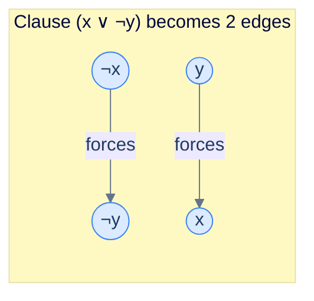

# 20. 2-SAT

## The Hook

The general boolean satisfiability problem (SAT) — given a formula like `(x ∨ y ∨ ¬z) ∧ (¬x ∨ z) ∧ …`, decide whether there's an assignment of `true`/`false` to each variable that makes the whole thing true — is the *original* NP-complete problem. There's no known polynomial-time algorithm; in the worst case, you have to try `2ⁿ` assignments.

Constrain it slightly: every clause has *exactly* two literals (a literal is a variable or its negation). This is **2-SAT**, and the constraint changes everything: the problem becomes solvable in **linear time**.

The trick: every 2-SAT clause `(a ∨ b)` is equivalent to two implications, `¬a ⇒ b` and `¬b ⇒ a`. Build a directed graph where each variable contributes two vertices (the variable and its negation), and each clause contributes two edges (the implications). Compute strongly connected components. If any variable and its negation share an SCC — meaning `x` implies `¬x` and `¬x` implies `x` simultaneously — there's no satisfying assignment. Otherwise, build the assignment from the topological order of SCCs.

This chapter walks through the construction, the algorithm, and where 2-SAT shows up in real systems (it's more common than you'd think — circuit verification, scheduling under conflicting constraints, even some compiler optimisations).

---

## Table of contents

1. [What 2-SAT looks like](#what-2-sat-looks-like)
2. [The implication graph](#the-implication-graph)
3. [SCC tells you everything](#scc-tells-you-everything)
4. [Constructing a satisfying assignment](#constructing-a-satisfying-assignment)
5. [Implementation](#implementation)
6. [Edge cases and pitfalls](#edge-cases-and-pitfalls)
7. [Production reality](#production-reality)
8. [Practice ladder](#practice-ladder)
9. [Cross-links](#cross-links)
10. [Final takeaway](#final-takeaway)

***

# What 2-SAT looks like

A **2-SAT instance** is a conjunction of clauses, each clause a disjunction of exactly two literals.

```
(x₁ ∨ ¬x₂) ∧ (¬x₁ ∨ x₃) ∧ (x₂ ∨ ¬x₃) ∧ (¬x₁ ∨ ¬x₃)
```

Find truth values `x₁, x₂, x₃ ∈ {true, false}` that make every clause true, or report that no such assignment exists.

By contrast, 3-SAT (clauses of 3 literals) is NP-complete. The jump from 2 to 3 makes the problem fundamentally harder. 2-SAT is the largest "tractable" boundary.

***

# The implication graph

Each clause `(a ∨ b)` is logically equivalent to the conjunction of two implications:

```
(a ∨ b)  ⟺  (¬a ⇒ b) ∧ (¬b ⇒ a)
```

(If `a` is false, then `b` must be true to satisfy the clause; symmetrically.)

So we build a directed graph:

- **2n vertices.** Two for each variable: `x` and `¬x`.
- **For each clause `(a ∨ b)`, add two edges:** `¬a → b` and `¬b → a`.

Call this the **implication graph**. Each path in it is a chain of forced implications.



<p align="center"><strong>Each clause becomes two edges in the implication graph. <code>¬x → ¬y</code> reads "if x is false, then y must be false" — the only way <code>(x ∨ ¬y)</code> can hold with <code>x</code> false.</strong></p>

***

# SCC tells you everything

> **Theorem.** A 2-SAT instance is satisfiable iff for every variable `x`, vertices `x` and `¬x` are in *different* SCCs.

Why? If `x` and `¬x` are in the same SCC, there are paths `x ⤳ ¬x` and `¬x ⤳ x`. The first says "x being true forces x to be false"; the second says "x being false forces x to be true". Contradiction. No valid assignment.

If they're in different SCCs, a satisfying assignment exists. The construction (next section) tells you how to find it.

**Algorithm: O(V + E)** — build the implication graph, run Tarjan's (or Kosaraju's) SCC, check that no variable and its negation are in the same SCC.

***

# Constructing a satisfying assignment

After running SCC, the SCCs form a DAG. Process this DAG in *reverse* topological order. For each variable `x`:

- Compare the SCC of `x` and the SCC of `¬x`.
- The variable's truth value is determined by which SCC is "later" in the topological order:
  - If `SCC(x)` comes *after* `SCC(¬x)` in topological order → set `x = true`.
  - Otherwise → set `x = false`.

(Tarjan's algorithm assigns SCCs in reverse topological order naturally — the first SCC popped is a sink. So you can compare SCC numbers directly.)

```pseudocode
function solve2SAT(n, clauses):
    # 2 vertices per variable: 2*i for x_i, 2*i + 1 for ¬x_i
    adj ← empty graph on 2n vertices
    for each clause (a, b) in clauses:
        adj.addEdge(neg(a), b)
        adj.addEdge(neg(b), a)

    sccId ← tarjanSCC(adj)                            # sccId[v] is its SCC's number; lower = later in topo order
    assignment ← array of n booleans
    for i from 0 to n-1:
        if sccId[2*i] = sccId[2*i + 1]: return UNSAT
        # pick the "later" SCC; here Tarjan numbers SCCs in reverse topo order
        assignment[i] ← (sccId[2*i] < sccId[2*i + 1])
    return assignment
```

***

# Implementation

```python run
import sys
sys.setrecursionlimit(10**6)

def solve_2sat(n, clauses):
    """
    n: number of variables
    clauses: list of (a, b) where each is a literal encoded as integer:
             positive int i (1-indexed) = x_i; negative int -i = ¬x_i.
    Returns: (True, assignment) or (False, None).
    """
    # Map literal i (signed 1-indexed) to vertex (2*var, 2*var + 1):
    #   positive  i:  2*(i-1)        = x_i
    #   negative -i:  2*(i-1) + 1    = ¬x_i
    def to_v(lit):
        return 2 * (abs(lit) - 1) + (1 if lit < 0 else 0)
    def neg(v):
        return v ^ 1

    V = 2 * n
    adj = [[] for _ in range(V)]
    for a, b in clauses:
        adj[neg(to_v(a))].append(to_v(b))
        adj[neg(to_v(b))].append(to_v(a))

    # Tarjan's SCC, iterative for safety on large inputs
    disc = [-1] * V
    low = [-1] * V
    on_stack = [False] * V
    stk = []
    scc_id = [0] * V
    timer = [0]; scc_count = [0]

    def tarjan(start):
        # Iterative DFS
        call_stack = [(start, 0)]
        while call_stack:
            u, i = call_stack[-1]
            if i == 0:
                disc[u] = low[u] = timer[0]; timer[0] += 1
                stk.append(u); on_stack[u] = True
            if i < len(adj[u]):
                call_stack[-1] = (u, i + 1)
                v = adj[u][i]
                if disc[v] == -1:
                    call_stack.append((v, 0))
                elif on_stack[v]:
                    low[u] = min(low[u], disc[v])
            else:
                if low[u] == disc[u]:
                    while True:
                        w = stk.pop(); on_stack[w] = False
                        scc_id[w] = scc_count[0]
                        if w == u: break
                    scc_count[0] += 1
                call_stack.pop()
                if call_stack:
                    p, _ = call_stack[-1]
                    low[p] = min(low[p], low[u])

    for v in range(V):
        if disc[v] == -1:
            tarjan(v)

    # Tarjan numbers SCCs in reverse topological order (lower id = later in topo order)
    assignment = [False] * n
    for i in range(n):
        if scc_id[2*i] == scc_id[2*i + 1]:
            return (False, None)
        # x_i is true iff its SCC is later (lower id)
        assignment[i] = scc_id[2*i] < scc_id[2*i + 1]
    return (True, assignment)


if __name__ == "__main__":
    # (x1 ∨ x2) ∧ (¬x1 ∨ x3) ∧ (x2 ∨ ¬x3) ∧ (¬x2 ∨ ¬x3)
    n = 3
    clauses = [(1, 2), (-1, 3), (2, -3), (-2, -3)]
    sat, assignment = solve_2sat(n, clauses)
    if sat:
        print(f"SAT: x1={assignment[0]}, x2={assignment[1]}, x3={assignment[2]}")
        # Verify
        def lit_val(lit, a):
            return a[abs(lit) - 1] if lit > 0 else not a[abs(lit) - 1]
        for ci, (a, b) in enumerate(clauses):
            assert lit_val(a, assignment) or lit_val(b, assignment), f"clause {ci} not satisfied"
        print("All clauses satisfied ✓")
    else:
        print("UNSAT")

    # An unsatisfiable instance: (x ∨ x) ∧ (¬x ∨ ¬x)  forces both x and ¬x simultaneously
    n2 = 1
    clauses2 = [(1, 1), (-1, -1)]
    sat2, _ = solve_2sat(n2, clauses2)
    print(f"\nSecond instance: {'SAT' if sat2 else 'UNSAT'}")
```

```java run
import java.util.*;

class Solution {
    static int n;
    static List<List<Integer>> adj;
    static int[] disc, low, sccId;
    static boolean[] onStack;
    static Deque<Integer> stk;
    static int timer = 0, sccCount = 0;

    static int toV(int lit) {
        return 2 * (Math.abs(lit) - 1) + (lit < 0 ? 1 : 0);
    }
    static int neg(int v) { return v ^ 1; }

    static void tarjan(int u) {
        disc[u] = low[u] = timer++;
        stk.push(u); onStack[u] = true;
        for (int v : adj.get(u)) {
            if (disc[v] == -1) { tarjan(v); low[u] = Math.min(low[u], low[v]); }
            else if (onStack[v]) low[u] = Math.min(low[u], disc[v]);
        }
        if (low[u] == disc[u]) {
            while (true) {
                int w = stk.pop(); onStack[w] = false;
                sccId[w] = sccCount;
                if (w == u) break;
            }
            sccCount++;
        }
    }

    public static void main(String[] args) {
        n = 3;
        int[][] clauses = {{1, 2}, {-1, 3}, {2, -3}, {-2, -3}};
        int V = 2 * n;
        adj = new ArrayList<>();
        for (int i = 0; i < V; i++) adj.add(new ArrayList<>());
        for (int[] c : clauses) {
            adj.get(neg(toV(c[0]))).add(toV(c[1]));
            adj.get(neg(toV(c[1]))).add(toV(c[0]));
        }
        disc = new int[V]; low = new int[V]; sccId = new int[V]; onStack = new boolean[V];
        Arrays.fill(disc, -1);
        stk = new ArrayDeque<>();
        for (int v = 0; v < V; v++) if (disc[v] == -1) tarjan(v);

        boolean sat = true;
        boolean[] assignment = new boolean[n];
        for (int i = 0; i < n; i++) {
            if (sccId[2*i] == sccId[2*i + 1]) { sat = false; break; }
            assignment[i] = sccId[2*i] < sccId[2*i + 1];
        }
        if (sat) for (int i = 0; i < n; i++) System.out.println("x" + (i+1) + " = " + assignment[i]);
        else System.out.println("UNSAT");
    }
}
```

```c run
#include <stdio.h>
#include <string.h>
#include <stdbool.h>

#define V 100
int adj[V][V], adjsz[V];
int disc[V], low[V], on_stack[V], stk[V], top = 0, scc_id[V], timer = 0, scc_count = 0;
int n_vars;

static int min(int a, int b) { return a < b ? a : b; }
static int to_v(int lit) { return 2 * (abs(lit) - 1) + (lit < 0 ? 1 : 0); }
static int neg(int v) { return v ^ 1; }

void tarjan(int u) {
    disc[u] = low[u] = timer++;
    stk[top++] = u; on_stack[u] = 1;
    for (int i = 0; i < adjsz[u]; i++) {
        int v = adj[u][i];
        if (disc[v] == -1) { tarjan(v); low[u] = min(low[u], low[v]); }
        else if (on_stack[v]) low[u] = min(low[u], disc[v]);
    }
    if (low[u] == disc[u]) {
        while (1) { int w = stk[--top]; on_stack[w] = 0; scc_id[w] = scc_count; if (w == u) break; }
        scc_count++;
    }
}

int main(void) {
    n_vars = 3;
    int clauses[][2] = {{1, 2}, {-1, 3}, {2, -3}, {-2, -3}};
    int M = 4;
    int VV = 2 * n_vars;
    memset(disc, -1, sizeof(int) * VV);
    for (int i = 0; i < M; i++) {
        int a = to_v(clauses[i][0]), b = to_v(clauses[i][1]);
        adj[neg(a)][adjsz[neg(a)]++] = b;
        adj[neg(b)][adjsz[neg(b)]++] = a;
    }
    for (int v = 0; v < VV; v++) if (disc[v] == -1) tarjan(v);

    int sat = 1;
    for (int i = 0; i < n_vars; i++) if (scc_id[2*i] == scc_id[2*i + 1]) { sat = 0; break; }
    if (sat) {
        for (int i = 0; i < n_vars; i++)
            printf("x%d = %s\n", i+1, scc_id[2*i] < scc_id[2*i + 1] ? "true" : "false");
    } else printf("UNSAT\n");
    return 0;
}
```

```scala run
import scala.collection.mutable

object Solution {
  def solve2sat(n: Int, clauses: List[(Int, Int)]): Option[Array[Boolean]] = {
    def toV(lit: Int): Int = 2 * (math.abs(lit) - 1) + (if (lit < 0) 1 else 0)
    def neg(v: Int): Int = v ^ 1
    val V = 2 * n
    val adj = Array.fill(V)(mutable.ArrayBuffer.empty[Int])
    for ((a, b) <- clauses) {
      adj(neg(toV(a))) += toV(b)
      adj(neg(toV(b))) += toV(a)
    }
    val disc = Array.fill(V)(-1)
    val low = Array.fill(V)(-1)
    val onStack = Array.fill(V)(false)
    val sccId = new Array[Int](V)
    val stk = mutable.Stack.empty[Int]
    var timer = 0; var sccCount = 0

    def tarjan(u: Int): Unit = {
      disc(u) = timer; low(u) = timer; timer += 1
      stk.push(u); onStack(u) = true
      for (v <- adj(u)) {
        if (disc(v) == -1) { tarjan(v); low(u) = math.min(low(u), low(v)) }
        else if (onStack(v)) low(u) = math.min(low(u), disc(v))
      }
      if (low(u) == disc(u)) {
        var w = -1
        do { w = stk.pop(); onStack(w) = false; sccId(w) = sccCount } while (w != u)
        sccCount += 1
      }
    }

    for (v <- 0 until V) if (disc(v) == -1) tarjan(v)
    val a = new Array[Boolean](n)
    for (i <- 0 until n) {
      if (sccId(2*i) == sccId(2*i + 1)) return None
      a(i) = sccId(2*i) < sccId(2*i + 1)
    }
    Some(a)
  }

  def main(args: Array[String]): Unit = {
    val n = 3
    val clauses = List((1, 2), (-1, 3), (2, -3), (-2, -3))
    solve2sat(n, clauses) match {
      case Some(a) => for (i <- 0 until n) println(s"x${i+1} = ${a(i)}")
      case None    => println("UNSAT")
    }
  }
}
```

***

# Edge cases and pitfalls

- **Single-literal clauses.** A clause `(x)` with one literal is equivalent to `(x ∨ x)` — duplicate the literal. The implication graph then has the single edge `¬x → x`, which forces `x = true` (any path from `¬x` reaches `x`, so `¬x`'s SCC is "later" in the topological order if and only if it's strictly different).
- **Tautological clauses.** `(x ∨ ¬x)` is always satisfiable; the implication edges become `¬x → ¬x` (self-loop) and `x → x` (self-loop), which trivially satisfy the SCC criterion.
- **Variable not appearing in any clause.** Free; assignment can be anything. The implication graph has isolated vertices.
- **Tarjan SCC numbering convention.** Tarjan's algorithm produces SCCs in *reverse* topological order — the first SCC popped is a sink. So lower SCC IDs correspond to *later* in topological order. The assignment rule `assignment[i] = sccId[2*i] < sccId[2*i + 1]` follows from this convention. Different SCC implementations may number the other way; double-check.
- **Recursion depth.** For implications graphs with `2n = 10⁶+` vertices, recursive Tarjan may overflow the stack. Iterative DFS (as in the Python implementation) is the production-grade approach.
- **Adversarial worst case.** A chain of implications `x₁ → x₂ → … → x_n` has `n` SCCs and `n - 1` edges, fitting easily in `O(V + E)`. The hard cases are long cycles, which collapse to single SCCs but still process in linear time.

***

# Production reality

- **Hardware verification.** Bounded model checking (BMC) of digital circuits often produces 2-SAT subproblems for specific properties.
- **Constraint solvers.** Many SAT solvers (MiniSat, Glucose, CryptoMiniSat) implement a "2-SAT pre-processor" that resolves all 2-clauses before tackling the harder clauses.
- **Schedule conflict resolution.** "Either employee A *or* B works the morning shift, not both" plus "if A works morning, B can't work evening" gives 2-clause constraints; large schedule problems with binary constraints reduce to 2-SAT.
- **Automated test generation.** Some symbolic-execution engines reduce path-condition feasibility to 2-SAT for common code shapes.
- **Map labelling.** "Each city's label goes either above or below the city, no two labels overlap" is a classical 2-SAT formulation in cartography.
- **Aspvall, Plass, Tarjan 1979.** The original paper that proved 2-SAT polynomial via the SCC reduction. Five pages, beautifully written, worth reading if you want to see the technique applied formally.
- **Boost Graph Library** doesn't include a dedicated 2-SAT solver, but the SCC primitive (`boost::strong_components`) is what you build it on. Same for NetworkX.

***

# Practice ladder

1. **Toggle Lights.** A row of `n` lights, each with two switches. Pressing either switch flips the light. You want all lights on. Each switch toggles one or two lights. Decide whether it's possible.
   > *Hint:* model each switch as a variable. The constraint "this light is on" is a 2-SAT clause "switch A is pressed XOR switch B is pressed" (which becomes two clauses).

2. **Painting a graph 2 colours.** Decide whether a graph can be 2-coloured given some "must be the same colour" and "must be different colour" pairs.
   > *Hint:* a different-colour constraint between `u` and `v` is `(c_u ∨ c_v) ∧ (¬c_u ∨ ¬c_v)`. A same-colour constraint is `(c_u ∨ ¬c_v) ∧ (¬c_u ∨ c_v)`. Both fit 2-SAT.

3. **Implement Aspvall's verification.** Given a candidate assignment for a 2-SAT instance, verify it satisfies every clause in `O(C)` time.
   > *Hint:* trivial — for each clause, check both literals; OR'd together must be true.

4. **Find any satisfying assignment.** Given a 2-SAT instance, return any assignment that satisfies it. (This is what the chapter's solver does.)
   > *Hint:* it's the chapter's algorithm.

5. **Counting models is hard.** While 2-SAT *decision* is in P, **counting the number of satisfying assignments** (#2-SAT) is `#P`-complete — as hard as counting NP solutions. Don't fall for "it's polynomial because the decision is".
   > *Hint:* this is informational, not implementation. Worth knowing: tractability depends on which question you're asking.

***

# Memorize

The high-leverage facts to commit to long-term memory — atomic enough for an Anki card, concrete enough to recall under pressure or during production debugging. 2-SAT is the rare NP problem with a polynomial special case; recognising the shape lets you reduce binary-constraint problems to linear-time SCC.

## Quick recall

Click any question to reveal the answer.

<details>
<summary><strong>Q:</strong> Time complexity of 2-SAT decision?</summary>

**A:** `O(V + E)` where `V = 2n` (a vertex per literal) and `E = 2C` (two edges per clause).

</details>

<details>
<summary><strong>Q:</strong> Implication graph construction — one rule?</summary>

**A:** Clause `(a ∨ b)` becomes two edges: `¬a → b` and `¬b → a`.

</details>

<details>
<summary><strong>Q:</strong> Satisfiability criterion?</summary>

**A:** Satisfiable iff for every variable `x`, vertices `x` and `¬x` are in *different* SCCs of the implication graph.

</details>

<details>
<summary><strong>Q:</strong> How do you extract a satisfying assignment?</summary>

**A:** Process SCCs in reverse topological order. For each `x`: set `x = true` if `SCC(x)` comes after `SCC(¬x)` in topo order.

</details>

<details>
<summary><strong>Q:</strong> Why is 3-SAT NP-complete but 2-SAT polynomial?</summary>

**A:** A 2-clause has only one implication direction per literal — leads to a clean implication graph. 3-clauses have multiple branchings; no equivalent reduction.

</details>

<details>
<summary><strong>Q:</strong> What does Tarjan's SCC convention give you "for free"?</summary>

**A:** Tarjan numbers SCCs in *reverse* topological order. So `sccId[x] < sccId[¬x]` directly means "x's SCC is later in topo order" → set `x = true`.

</details>

<details>
<summary><strong>Q:</strong> Counting satisfying assignments (#2-SAT) — same complexity?</summary>

**A:** No. #2-SAT is `#P`-complete, as hard as counting solutions to NP problems. Decision is polynomial; counting is not.

</details>

<details>
<summary><strong>Q:</strong> Other linear-time SAT subclasses?</summary>

**A:** **Horn-SAT** (every clause has ≤ 1 positive literal) and **XOR-SAT** (clauses are XORs, solvable via Gaussian elimination over GF(2)).

</details>

## Code template

```python
def solve_2sat(n, clauses):
    # Encode literal as vertex: 2*(|lit|-1) + (1 if lit < 0 else 0)
    def to_v(lit): return 2 * (abs(lit) - 1) + (1 if lit < 0 else 0)
    def neg(v): return v ^ 1

    V = 2 * n
    adj = [[] for _ in range(V)]
    for a, b in clauses:
        adj[neg(to_v(a))].append(to_v(b))
        adj[neg(to_v(b))].append(to_v(a))

    # Run Tarjan SCC; sccId[v] is its SCC's id (lower = later in topo order).
    sccId = tarjan(V, adj)

    assignment = [False] * n
    for i in range(n):
        if sccId[2 * i] == sccId[2 * i + 1]: return None       # unsatisfiable
        assignment[i] = sccId[2 * i] < sccId[2 * i + 1]
    return assignment
```

## Pattern triggers

- **"Either A or B (XOR-style)" + "if A then C"** → 2-SAT clauses
- **"Map labelling: each label above or below"** → 2-SAT
- **"Schedule: each task in shift X or Y, with conflicts"** → 2-SAT if conflicts are pairwise
- **"Pre-process binary constraints before a harder solver"** → 2-SAT pre-pass eliminates simple inconsistencies
- **"Two-colour a graph with same/different constraints"** → 2-SAT (or DSU for the simpler version)
- **"Implication closure of binary rules"** → 2-SAT-style SCC analysis
- **3+-clause SAT** → general SAT solver (MiniSat, Glucose); 2-SAT trick doesn't apply

***

# Cross-links

- **Prerequisites:** [Strongly Connected Components](/cortex/data-structures-and-algorithms/graphs-strongly-connected-components), [Graph Traversal](/cortex/data-structures-and-algorithms/graphs-traversing-a-graph).
- **General SAT:** the topic of countless papers and the entire CADE conference series. 2-SAT is one of the rare bright spots in an otherwise NP-hard landscape.
- **Related polynomial-time special cases:** Horn-SAT (every clause has at most one positive literal — also linear-time solvable), XOR-SAT (every clause is an XOR — solvable via Gaussian elimination over GF(2)).

***

# Final Takeaway

2-SAT is the largest tractable boundary of boolean satisfiability. Three patterns to internalise:

1. **Two clauses, two implications.** The reduction `(a ∨ b) ⟺ (¬a ⇒ b) ∧ (¬b ⇒ a)` is the entire creative move. The rest is mechanical.
2. **SCC equivalence is the criterion.** A variable and its negation in the same SCC means "x forces ¬x and vice versa" — contradiction. The criterion is purely graph-theoretic.
3. **Linear-time NP-relative.** 2-SAT is in P (linear, even). 3-SAT is NP-complete. The jump from 2 to 3 is the most dramatic complexity-theoretic boundary in this curriculum.

This concludes the Graphs module's fill-ins. Combined with the existing chapters, the module now covers representations, traversal, cycles, topological sort, shortest paths, max flow, MST, SCCs, bridges/articulations, and 2-SAT — a complete senior-engineer survey.
