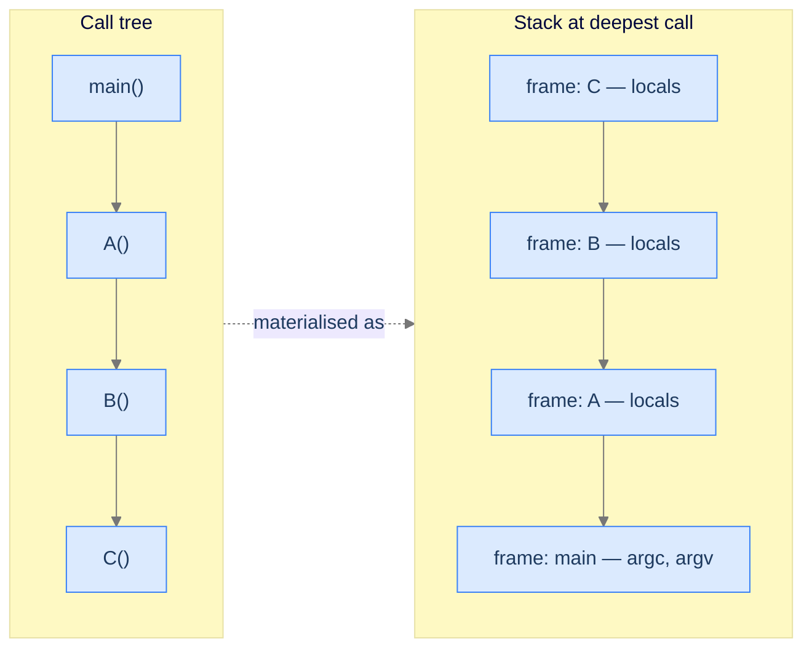

# 1. Introduction to the Memory Model

Recursive code looks innocent. A function that calls itself, a base case, three lines total. Then a million-row test case crashes the process and the stack trace is a wall of identical frames. **You didn't write a bad algorithm — you ran out of a region of memory most tutorials never show you.** Before recursion makes sense, you need to see the four invisible regions every running program already lives in. Get this right and recursion clicks. Skip it and stack overflows feel like dark magic for the rest of your career.

## Table of contents

1. [Why memory layout matters](#why-memory-layout-matters)
2. [A process is a building under construction](#a-process-is-a-building-under-construction)
3. [Heap — the lumber yard](#heap--the-lumber-yard)
4. [Stack — the scaffolding](#stack--the-scaffolding)
5. [Static — the foundation](#static--the-foundation)
6. [Code segment — the blueprint](#code-segment--the-blueprint)
7. [Putting it all together](#putting-it-all-together)

***

# Why Memory Layout Matters

You write a clean, three-line recursive function. It works on small inputs. You ship it. Six weeks later, a customer hits it with a list of a million items and the production process dies with `StackOverflowError`. You add a `try/catch`. The next customer hits it with two million items. The same crash. You add `sys.setrecursionlimit(10**6)`. The Python interpreter still segfaults — because the limit you raised wasn't the limit that mattered.

There is a region of memory called **the stack**, and recursion lives there. Every function call your program makes — recursive or not — is written into that region in a very specific way. When the region runs out of space, your program ends. Not your function. Your *process*.

If you've never been shown where the stack is, what shares space with it, and how it's reclaimed, recursion will feel like betrayal: the same code that worked on `n=10` crashes on `n=100000` and the error message is in C, not in your language. The fix isn't a try/catch. The fix is *knowing where your code is running*.

---

## The Question Most Tutorials Skip

When you type `int x = 5;`, where does the `5` go? When you write `new int[1000]`, what does "new" actually allocate, and from where? When you call `factorial(100)`, why does that work but `factorial(1_000_000)` crash with no `try/except` powerful enough to save it?

Answers to all three questions live in **the four memory regions every running process is partitioned into**. Once you can name those regions, you can predict where anything in your code lives, why it dies when it does, and which optimisations actually move the needle.

---

## What You'll Carry Out of This Lesson

By the time you finish this page, you'll be able to look at any line of code and answer:

- Which of the four regions does this value live in?
- How long is it going to live there?
- Who frees it — me, the runtime, or nobody?
- What happens if I run out of space in this region?

Recursion adds exactly one new behaviour on top of these answers: it pushes a new entry into one of the four regions every time the function calls itself. That's it. Recursion isn't magic — it's just *one specific region under stress*. We have to see the regions before we can see what stresses them.

---

## Key Takeaway

Stack overflow isn't a recursion bug, it's a *memory layout* bug — and you can't see the bug until you can see the layout. Next, we'll draw a picture of that layout you can carry around in your head, with one analogy that survives every weird case the next chapters will throw at it.

***

# A Process Is a Building Under Construction

Imagine the moment your program starts. The operating system gives it a chunk of address space — a tall, empty plot of land. Inside that plot, four crews show up and stake out their territories. They will not move for the entire run of your program. Every value you ever create, every function you ever call, ends up living with one of these four crews.

This is a building under construction. The plot is your process's address space. The four crews are the four memory regions. Each one has its own job, its own rules for handing out space, and its own way of failing when it runs out.

```d2
proc: Process address space {
  grid-rows: 6
  grid-columns: 1
  grid-gap: 0
  r0: "Code segment\n— machine code or bytecode\n— read-only, shared"
  r1: "Static / data\n— globals and statics\n— lifetime = whole program" {style.fill: "#ede9fe"; style.stroke: "#7c3aed"}
  r2: "Heap\n— grows up ↑\n— new / malloc / list()" {style.fill: "#fef9c3"; style.stroke: "#ca8a04"}
  r3: "↕ free space ↕"
  r4: "Stack\n— grows down ↓\n— frames push and pop" {style.fill: "#dbeafe"; style.stroke: "#3b82f6"}
  r5: "(High addresses)"
}
```

<p align="center"><strong>The four regions of a running process. The heap grows upward; the stack grows downward into the same free zone. Static and code sit in fixed positions and never move.</strong></p>

---

## The Four Crews

Each region has one job. Memorise these — every later concept in this course is just a consequence of these four roles.

| Region | The crew's job | Real-world stand-in |
|---|---|---|
| **Heap** | Hand out arbitrarily-sized chunks of space on demand. Cleanup is either manual (you call `free`) or automatic (a garbage collector). | The **lumber yard** — pile of materials; foreman walks over and grabs what's needed. Forget to return the scrap and the yard fills with junk. |
| **Stack** | Track who's calling whom. Each function call gets its own slip of paper (a *frame*) pushed onto the top. When the function returns, its slip is thrown away — last in, first out. | The **scaffolding** — last tier erected, first tier dismantled. Every call adds a new tier. |
| **Static** | Hold values that exist for the entire run of the program — globals, configuration, top-level constants. Allocated when the program starts, gone only when it exits. | The **poured foundation + utility hookups** — laid on day one, present until demolition. Every floor stands on it. |
| **Code segment** | Hold the actual instructions of the program — compiled machine code, JVM bytecode, or interpreter ops. Read-only, often shared between processes. | The **blueprint roll** — read-only, every crew works from the same copy, never altered mid-build. |

> *Before reading on — for each of the four regions, predict one situation that would make it fail. (Hint: each region fails differently. The heap fills up over time; the stack overflows; the static region is fixed at startup; the code segment can be corrupted but rarely runs out.) Don't peek; just predict.*

---

## Why This Mental Model Survives

A bad analogy collapses on the first edge case. A good one predicts the edge cases. The construction-site image earns its keep because it tells you the failure mode of each region without you having to memorise extra rules:

- *Forget to return scrap to the lumber yard?* Memory leak.
- *Stack the scaffolding too many tiers high?* It collapses under its own weight — that's stack overflow.
- *Try to add a new wing to the foundation after construction starts?* You can't — the foundation is fixed at the start (statically sized at compile time on most systems).
- *Try to scribble on the blueprint?* The contractor stops you — that's a segmentation fault when you write to a read-only page.

We'll come back to this analogy by name in every region below, in the Nested Functions lesson when we walk into stack overflow, and in the Recursion lesson when we trace the recursion stack. It's the single most important picture in this course.

---

## Key Takeaway

Four regions, one analogy. But "they exist" isn't enough — each region behaves differently, and the differences are the whole point. We'll start with the one most languages share and the one most likely to leak: the heap.

***

# Heap — The Lumber Yard

The heap is the most flexible region in the building site, and the most dangerous. Anything you can ask for — a one-byte integer, a million-element array, a graph of objects pointing at each other — comes out of the heap. The catch is that the heap doesn't track who owns what. If you forget to return what you took, the heap doesn't reclaim it; it just keeps shrinking until the process dies.

---

## What the Heap Is For

The heap is for **data whose size or lifetime isn't known when the function is written.** Read a file of unknown length? Heap. Build up a list whose size depends on user input? Heap. Construct an object that has to outlive the function that created it? Heap.

Every language has a way to say "give me a chunk of the heap right now":

- C and C++: `malloc` / `new`
- Java, Kotlin, Scala: `new` (and the JVM's primitive boxing)
- Python: every list, dict, object, even most numbers — implicitly heap-allocated
- JavaScript and TypeScript: arrays, objects — heap, every time
- Go: `make` for slices/maps/channels; the compiler decides whether structs go on stack or heap (escape analysis)
- Rust: `Box::new`, `Vec::new`, `String::new` — heap, but the compiler tracks ownership so cleanup is deterministic

What changes between languages is **who frees the memory** when you're done with it.

---

## How Low-Level Languages Use the Heap

In low-level languages — C, C++, and (with caveats) Rust — heap memory is managed by the programmer. You ask for it explicitly with `malloc` or `new`, and you must release it explicitly with `free` or `delete`. If you forget, the operating system thinks the memory is still in use, and your process slowly bloats until something kills it. That's a **memory leak**.

> *Before reading on — predict what happens after the C++ code below runs **a million times in a long-running web server**. The pointer `arr` goes out of scope at the end of `main()`. Is the heap memory it pointed to released? What's the long-run consequence?*


```pseudocode
# Both objects live on the heap. Cleanup is automatic in GC languages,
# manual (free / delete) in C/C++.
arr ← list of 5 zeros          # heap-allocated container
x ← 6                          # heap-allocated value
```

```python run
# Python doesn't have manual heap management — included here for parity.
# Every container, every object, every "primitive" is heap-allocated under
# the hood, and the garbage collector reclaims them when no live reference
# remains. We'll see Python's flavour properly in the next sub-section.
arr = [0] * 5    # The list itself is on the heap
x = 6            # Even the integer object is on the heap (CPython interns small ints)
```

```java run
// Java has automatic memory management on the JVM, included here for parity.
// new int[5] allocates on the heap; the GC will reclaim it when no live
// reference points at it. We see this fully in the next sub-section.
public class Main {
    public static void main(String[] args) {
        int[] arr = new int[5];          // Five-int array on the heap
        Integer x = Integer.valueOf(6);  // Boxed Integer on the heap
        // No free / delete needed — the GC handles it.
    }
}
```

```c run
#include <stdio.h>
#include <stdlib.h>

int main(void) {
    /* malloc returns a pointer to a heap-allocated block of `n * sizeof(int)`
     * bytes. The block is uninitialised — its contents are whatever was
     * sitting at that address before. */
    int *arr = (int *) malloc(5 * sizeof(int));
    int *x   = (int *) malloc(sizeof(int));

    *x = 6;                       /* Write through the pointer into the heap */

    /* WHY each free() is mandatory: when main() returns, the *pointers*
     * (arr, x) disappear, but the heap blocks they pointed at do NOT.
     * Without free(), those bytes stay marked "in use" until the process
     * exits — fine for a one-shot program, fatal for a long-running server. */
    free(arr);
    free(x);
    return 0;
}
```

```scala run
// Scala runs on the JVM. Object creation goes on the heap; GC reclaims.
// Included here for cross-language parity — Scala has no manual free.
object Main extends App {
  val arr: Array[Int] = new Array[Int](5)   // Five-int array on the JVM heap
  val x: java.lang.Integer = Integer.valueOf(6)  // Boxed Integer on the heap
  // The GC will reclaim both when nothing references them.
}
```


```d2
direction: right

src: Source code {
  l1: "int* arr = new int[5];"
  l2: "int* x   = new int();"
}

heap: Heap region {
  arr_label: "arr →"
  cells: array {
    grid-rows: 1
    grid-columns: 5
    grid-gap: 0
    c0: "?"
    c1: "?"
    c2: "?"
    c3: "?"
    c4: "?"
  }
  x_cell: "6" {style.fill: "#fde68a"; style.stroke: "#d97706"}
}

src.l1 -> heap.cells: allocates 5 cells
src.l2 -> heap.x_cell: allocates 1 cell
```

<p align="center"><strong><code>new</code> carves out cells in the heap. The pointer (<code>arr</code>, <code>x</code>) lives elsewhere — on the stack — but the actual data lives in the lumber yard until you call <code>delete</code>.</strong></p>

**The friction-prompt answer.** When `main()` returns in the C++ snippet above, the *pointer* `arr` (a stack variable) disappears. The five-int *block* in the heap that `arr` was pointing at does not. The operating system has no way to know nobody references it anymore — there's no garbage collector to scan. So those bytes stay marked "in use." Run that pattern in a long-running web server, a million times an hour, and the process bloats by gigabytes per day until the kernel kills it.

That's the heap's signature failure mode. We'll see the trap up close in `## The Memory-Leak Trap` below.

---

## How High-Level Languages Use the Heap

High-level languages — Python, Java, Kotlin, Scala, Go, JavaScript, TypeScript, Rust — handle the heap for you. The mechanism is different in each language, but the contract is the same: **you don't write `free`. The runtime figures it out.**

- **JVM languages (Java, Kotlin, Scala)** — a *garbage collector* runs periodically, finds objects nothing points to, and reclaims their bytes. Pause time depends on the GC.
- **Python** — *reference counting* + a cycle collector. When an object's reference count drops to zero, its memory is released immediately.
- **JavaScript and TypeScript** — engine-specific GC (V8, SpiderMonkey, JavaScriptCore). Mark-and-sweep with generational tuning.
- **Go** — concurrent GC tuned for low pause times. Often imperceptible.
- **Rust** — *no GC at all*. The compiler tracks ownership statically; when a value goes out of scope, its `Drop` impl runs and the memory is released. Deterministic, no pauses.

The point is the same across all of them: **the lumber yard cleans itself.** You take what you need; sweepers come through later.


```pseudocode
arr ← list of 5 zeros                          # heap container
obj ← empty Map: String → String               # heap container
populate obj with {"name" → "alice"}
n ← 10 ^ 100                                   # heap value (big integer)

destroy arr                                    # drop the binding; GC reclaims when unreferenced
```

```python run
# Python: every container is a heap object. The garbage collector
# (reference counting + cycle collector) reclaims when nothing references it.
arr = [0] * 5            # List object on the heap
obj = {"name": "alice"}  # Dict object on the heap
n = 10 ** 100            # Big int — also a heap object

# `del` drops a name binding; the object is freed once nothing else references it.
del arr  # The list is unreachable now and will be collected.
```

```java run
public class Main {
    public static void main(String[] args) {
        int[] arr = new int[5];               // Heap allocation
        Integer x = Integer.valueOf(6);       // Heap allocation (boxing)

        // No manual free — when nothing references arr or x anymore,
        // the GC will reclaim the bytes on its next sweep.
    }
}
```

```c run
/* C has no garbage collection. Included here for parity:
 * the "high-level" alternative is to use a library like Boehm GC,
 * or simply to follow strict ownership rules. The plain language
 * always requires manual free(). */
#include <stdlib.h>
int main(void) {
    int *arr = (int *) malloc(5 * sizeof(int));
    /* ... use arr ... */
    free(arr);   /* Still mandatory */
    return 0;
}
```

```scala run
// Scala on the JVM — same GC story as Java.
object Main extends App {
  val arr = new Array[Int](5)
  val x = Integer.valueOf(6)
  // GC handles cleanup automatically.
}
```


```d2
direction: right

before: "Heap before GC" {
  grid-rows: 1
  grid-columns: 6
  grid-gap: 0
  a: "obj1\n(reachable)"
  b: "obj2\n(reachable)"
  c: "obj3\n(orphan)" {style.fill: "#fecaca"; style.stroke: "#dc2626"}
  d: "obj4\n(orphan)" {style.fill: "#fecaca"; style.stroke: "#dc2626"}
  e: "obj5\n(reachable)"
  f: "obj6\n(reachable)"
}

after: "Heap after GC sweep" {
  grid-rows: 1
  grid-columns: 6
  grid-gap: 0
  a: "obj1"
  b: "obj2"
  c: "free" {style.fill: "#bbf7d0"; style.stroke: "#16a34a"}
  d: "free" {style.fill: "#bbf7d0"; style.stroke: "#16a34a"}
  e: "obj5"
  f: "obj6"
}

before -> after: GC sweep
```

<p align="center"><strong>High-level languages skip the <code>delete</code> step. The GC walks the heap on its own schedule, finds cells nothing points to, and marks them free.</strong></p>

---

## The Memory-Leak Trap

This is the heap's signature failure. In manually-managed languages, the trap appears every time a long-running program allocates without freeing — even if every individual allocation looks correct. The classic example:

```c run
#include <stdio.h>
#include <stdlib.h>

void process_one_request(void) {
    /* Each request allocates 1 KB on the heap... */
    char *buffer = (char *) malloc(1024);
    /* ...uses it briefly... */
    snprintf(buffer, 1024, "request handled");
    /* ...and forgets to free. The pointer dies; the bytes don't. */
}

int main(void) {
    /* Server-style loop. After 1 million requests we've leaked 1 GB. */
    for (long i = 0; i < 1000000; i++) {
        process_one_request();
    }
    return 0;
}
```

Each `process_one_request()` call leaks 1 KB. After a million calls — about a millisecond of real-world traffic for a busy service — the process has burned a gigabyte of RAM that no code can reach but no GC will reclaim. Eventually the kernel's OOM killer steps in.

GC'd languages avoid this *specific* failure but invent new ones (cycles holding each other alive, long-lived references in caches, growing-but-never-shrinking lookup tables). Rust catches both at compile time by enforcing a single owner per allocation. The lumber yard's rule is universal: **what you take, you eventually return — or someone returns it for you.**

---

## Key Takeaway

The heap is permissive — anything fits, but cleanup is on you (or a garbage collector). The next region is the opposite: rigid, automatic, and the single most important region to understand before recursion. It's where every function call you've ever written has lived.

***

# Stack — The Scaffolding

The stack is the region recursion lives in. Every function call you make — whether it calls itself or anything else — gets a slip of paper called a *stack frame* pushed onto the top of the stack. When the function returns, the slip is thrown away. The most recent frame is always the next one to leave. Last in, first out.

If you understand only one region in this lesson, make it this one.

---

## What the Stack Is For

The stack tracks **the call path your program is currently inside.** Right now, on a real computer running code, the topmost stack frame is whatever function is *executing this very instruction*. The frame below it is whoever called that function. The frame below that is whoever called *them*. All the way down to `main`.

Every frame holds:

- The function's **parameters** (the arguments it was called with)
- The function's **local variables**
- A **return address** — the line of caller code to jump back to when this function returns
- Some bookkeeping (saved registers, frame pointer, etc.)

When a function returns, all of that disappears in one operation. **No `free`. No GC.** The stack pointer just moves; the bytes are reusable immediately.

That's why the stack is fast — there's literally one CPU instruction to allocate a frame (subtract from the stack pointer) and one to deallocate it. It's also why the stack is small. A typical thread gets 1–8 MB of stack, total. That's not much room for a million recursive calls each carrying their own variables.

---

## Local Variables and Parameters Live Here

Stack-only code is the inverse of heap code: **no `new`, no `malloc`, no list creation.** Just parameters and locals.

> *Before reading on — sketch the stack at the moment `int total = x + n` runs inside `main → outer(3) → inner(10)`. How many frames are alive? In what order? Which frame disappears first when execution returns?*


```pseudocode
function total(a, b):
    result ← a + b               # parameters and locals all sit on the stack frame
    return result                # frame pops on return — a, b, result all vanish

print total(3, 4)
```

```python run
def total(a: int, b: int) -> int:
    # `a` and `b` are parameters — bound on the call stack frame for total().
    # `result` is a local — also frame-local.
    result = a + b
    return result
    # When this function returns, `a`, `b`, `result` all vanish.
    # CPython internally allocates the frame *object* on the heap, but the
    # call-stack semantics are identical: each call pushes a frame, returns
    # pop it. The LIFO model holds even when the implementation is heapy.

print(total(3, 4))
```

```java run
public class Main {
    static class Solution {
        static int total(int a, int b) {
            // a, b — parameters on the frame
            int result = a + b;          // Local on the frame
            return result;
            // Frame disappears when total() returns; a, b, result all gone.
        }
    }

    public static void main(String[] args) {
        System.out.println(Solution.total(3, 4));
    }
}
```

```c run
#include <stdio.h>

int total(int a, int b) {
    /* Parameters and locals live in this function's stack frame.
     * No malloc — nothing escapes to the heap. */
    int result = a + b;
    int buf[10];                  /* A fixed-size local array IS on the stack — */
    buf[0] = result;              /* this is the canonical "stack-allocated array". */
    return result;
    /* On return, the entire frame (a, b, result, buf[10]) is reclaimed
     * by moving the stack pointer. One instruction. Zero overhead. */
}

int main(void) {
    printf("%d\n", total(3, 4));
    return 0;
}
```

```scala run
// Scala/JVM: parameters + locals are conceptually frame-local.
// Primitive ints stay on the stack; reference types put the *reference*
// on the stack and the object on the heap.
object Main extends App {
  object Solution {
    def total(a: Int, b: Int): Int = {
      val result = a + b   // Local Int — stack
      result
    }
  }

  println(Solution.total(3, 4))
}
```


> **Note for dynamic languages.** In Python, JavaScript, and TypeScript the *frame objects themselves* are heap-allocated by the runtime — but the LIFO call-stack abstraction is identical. The runtime maintains a stack of frame pointers; every call pushes; every return pops. From the perspective of "what data is reachable right now?", the model is exactly the same as in C.

---

## How Low-Level Languages Use the Stack

In C, C++, and Rust, every local variable that doesn't escape its scope lives on the stack by default. That includes structs, fixed-size arrays, and any value whose lifetime is bounded by the function. The compiler computes the frame size at compile time and emits a single instruction to push and pop it.

The diagram below traces a small program through three frames as it pushes, runs, and unwinds.

<div class="d2-slides" data-caption="Each function call pushes a new stack frame. When the function returns, its frame is popped — automatically, no `free()` needed.">

```d2
proc: "Process address space" {
  grid-rows: 4
  grid-columns: 1
  grid-gap: 0
  code: "Code segment"
  static: "Static / data"
  free: "↕ free space ↕"
  stack: "Stack" {
    grid-rows: 1
    grid-columns: 1
    grid-gap: 0
    main: "main()\n— argc, argv" {style.fill: "#dbeafe"; style.stroke: "#3b82f6"}
  }
}
```

```d2
proc: "Process address space" {
  grid-rows: 4
  grid-columns: 1
  grid-gap: 0
  code: "Code segment"
  static: "Static / data"
  free: "↕ free space ↕"
  stack: "Stack" {
    grid-rows: 2
    grid-columns: 1
    grid-gap: 0
    f: "f(n=5)\n— local x" {style.fill: "#fde68a"; style.stroke: "#d97706"}
    main: "main()\n— argc, argv" {style.fill: "#dbeafe"; style.stroke: "#3b82f6"}
  }
}
```

```d2
proc: "Process address space" {
  grid-rows: 4
  grid-columns: 1
  grid-gap: 0
  code: "Code segment"
  static: "Static / data"
  free: "↕ free space ↕"
  stack: "Stack — f() returned" {
    grid-rows: 1
    grid-columns: 1
    grid-gap: 0
    main: "main()\n— argc, argv" {style.fill: "#dbeafe"; style.stroke: "#3b82f6"}
  }
}
```

</div>

The three frames above tell the whole story:

1. `main()` is the only frame on the stack at startup.
2. `main` calls `f(5)` — a new frame is pushed on top. Both frames are alive simultaneously. `main` is paused inside its call.
3. `f` returns — its frame is popped. `main` resumes from where it paused. The bytes that held `f`'s locals are immediately reusable for the next call.

Notice what *isn't* there: no `free`, no GC, no cleanup code. The stack pointer moves and that's it.

---

## How High-Level Languages Use the Stack

In Java, JavaScript, Kotlin, and the others, the stack is still doing exactly this work — but with a twist. Primitives (int, boolean, double) live in the frame just like in C. Objects don't — they live on the heap, and the frame holds only a *reference* (a pointer) to them.

The reason is lifetime: a local primitive's lifetime is tied to its frame, but an object created locally might escape (be returned, stored in a field, passed to another thread). The runtime puts every object on the heap so it can outlive whatever frame created it.

```d2
direction: right

stack: "Stack frame" {
  grid-rows: 3
  grid-columns: 1
  grid-gap: 0
  prim: "int x = 6\n← value lives here"
  ref:  "Object obj\n← reference lives here, →"
  note: "(Java / JS / Kotlin)"
}

heap: "Heap" {
  obj: "Object {\n  name: 'alice'\n  age: 30\n}" {style.fill: "#fde68a"; style.stroke: "#d97706"}
}

stack.ref -> heap.obj: "points to"
```

<p align="center"><strong>In Java and JavaScript primitives sit on the stack but objects live on the heap with the stack holding a reference. In Python <em>every</em> value is a heap object — the stack only ever holds references.</strong></p>

Python is the extreme case. Even integers like `x = 6` are heap objects in CPython; the stack frame holds a reference, the actual integer (with its reference count, type pointer, and value) sits on the heap. This is why CPython is slower than C for arithmetic — every `+` walks through a heap dereference.



<p align="center"><strong>The call tree on the left exists conceptually; the stack on the right exists physically in memory. Every nested call deepens the stack by one frame.</strong></p>

---

## Friction: Predict the Frame

Take the prediction we set up earlier — `main → outer(3) → inner(10)` running `int total = x + n`. The answer:

- **Three frames are alive simultaneously**: `main`, `outer`, `inner` — bottom to top.
- They disappear in **reverse order**: `inner` first (when `total` is computed and returned), then `outer` (when `outer` returns its result), then `main` (when the program exits).
- This LIFO ordering is **exactly what makes recursion work** — each recursive call gets its own frame holding its own copy of every local variable, and the frames unwind in the reverse of the order they were pushed.

That last sentence is the entire content of the Recursion lesson in one line. We'll see it from a different angle in the Nested Functions lesson first, then formally in the Recursion lesson.

---

## Key Takeaway

The stack is automatic — but automatic doesn't mean infinite. Each call adds a tier of scaffolding; deep recursion stacks tier on tier on tier. **What happens when the scaffolding can't go any higher?** That's the cliff edge the Nested Functions lesson walks you up to.

***

# Static — The Foundation

The static region is the simplest of the four — and the easiest to ignore until it bites you. It's the foundation of the building site: poured on day one, present until demolition, never moved. Anything here exists for the *entire run of the program*.

---

## What "Static" Memory Means

Static memory is for values whose lifetime equals the program's lifetime. Globals. Compile-time constants. String literals. Singleton instances. Configuration loaded at startup. The bytes are reserved when the process starts and stay reserved until it exits. There's no allocation cost, no deallocation, no garbage collector ever scanning them.

A typical static integer occupies 4 bytes on most systems, though this varies with type and architecture. The size of the static region is fixed at compile time — you can't grow it at runtime.

There are two flavours of "static" data:

1. **Globals** — variables declared outside any function, visible everywhere.
2. **Static locals** — variables declared `static` inside a function (in C, C++, Java) that survive across calls.

---

## Global Variables

A global lives in the static region for the entire run of the program. Every function in your program can see it; modifying it from one function makes the change visible to every other function. There's exactly one copy.

Globals are useful for genuinely global state — a process-wide counter, a logger handle, a cached configuration. They're also a notorious source of bugs: modifying a global from deep inside a function makes the program harder to reason about and harder to test.


```pseudocode
global counter ← 0               # static-region storage — lives for the whole program

function tick():
    counter ← counter + 1        # mutate the single shared cell
    return counter

print tick()                     # 1
print tick()                     # 2
print tick()                     # 3
```

```python run
# Python's "global" lives in the module namespace, conceptually static.
counter = 0

def tick() -> int:
    global counter        # Without `global`, Python would create a local
    counter += 1          # named `counter` instead of mutating the global.
    return counter

print(tick())  # 1
print(tick())  # 2
print(tick())  # 3
```

```java run
public class Main {
    // Class-level static fields live in the JVM's "method area" /
    // metaspace — Java's flavour of static memory.
    static class Solution {
        static int counter = 0;

        static int tick() {
            counter += 1;     // Writes the single shared cell
            return counter;
        }
    }

    public static void main(String[] args) {
        System.out.println(Solution.tick());  // 1
        System.out.println(Solution.tick());  // 2
        System.out.println(Solution.tick());  // 3
    }
}
```

```c run
#include <stdio.h>

/* `counter` is declared at file scope — it's a global,
 * stored in the BSS segment (initialised to 0 at program start). */
int counter = 0;

int tick(void) {
    counter += 1;         /* Mutates the single global cell */
    return counter;
}

int main(void) {
    printf("%d\n", tick());  /* 1 */
    printf("%d\n", tick());  /* 2 */
    printf("%d\n", tick());  /* 3 */
    return 0;
}
```

```scala run
// Scala uses `object` for singletons — every field of an object
// has static-storage semantics on the JVM.
object Main extends App {
  object Counter {
    var n: Int = 0

    def tick(): Int = {
      n += 1
      n
    }
  }

  println(Counter.tick())  // 1
  println(Counter.tick())  // 2
  println(Counter.tick())  // 3
}
```


```d2
direction: right

static: "Static region (lives forever)" {
  grid-rows: 1
  grid-columns: 2
  grid-gap: 0
  counter: "counter = 0\n→ 1 → 2 → 3" {style.fill: "#ede9fe"; style.stroke: "#7c3aed"}
  config:  "config = 'prod'"
}

timeline: "Function-call timeline" {
  grid-rows: 1
  grid-columns: 4
  grid-gap: 0
  t1: "t1: main()"
  t2: "t2: tick()"
  t3: "t3: tick()"
  t4: "t4: tick()"
}

timeline.t2 -> static.counter: "+= 1"
timeline.t3 -> static.counter: "+= 1"
timeline.t4 -> static.counter: "+= 1"
```

<p align="center"><strong>A global lives in static memory for the entire process lifetime. Every function — <code>main</code>, every call to <code>tick</code> — sees the same single cell.</strong></p>

---

## Static Variables Inside Functions

C, C++, Java, and a few others let you declare a variable `static` inside a function. The variable is **scoped to the function** (no other function can see it), but its **storage is in the static region** — so it survives across calls. The first time the function runs, the variable is initialised; every subsequent call sees the previous value.

This is the cleanest way to give a function its own private memory without using a global.


```pseudocode
# Persistent per-function counter — value lives in the static region across calls.
function counter():
    counter.n ← (counter.n if it exists, else 0) + 1
    return counter.n

print counter()                  # 1
print counter()                  # 2
print counter()                  # 3
```

```python run
# Python has no `static` keyword. The idiomatic substitutes are either
# a module-level global, or a function attribute (shown here).
def counter() -> int:
    # First call: getattr returns the default 0; we add 1 and store.
    # Subsequent calls: getattr finds the previous value.
    counter.n = getattr(counter, "n", 0) + 1
    return counter.n

print(counter())  # 1
print(counter())  # 2
print(counter())  # 3
```

```java run
public class Main {
    // Java has no per-function statics, but a class-level static field
    // accessed only from one method is the idiomatic equivalent.
    static class Solution {
        static int n = 0;

        static int counter() {
            n += 1;
            return n;
        }
    }

    public static void main(String[] args) {
        System.out.println(Solution.counter());  // 1
        System.out.println(Solution.counter());  // 2
        System.out.println(Solution.counter());  // 3
    }
}
```

```c run
#include <stdio.h>

int counter(void) {
    /* `static` here means: storage in the static region (survives across calls),
     * scope still local to this function (invisible to others). */
    static int n = 0;
    n += 1;
    return n;
}

int main(void) {
    printf("%d\n", counter());  /* 1 */
    printf("%d\n", counter());  /* 2 */
    printf("%d\n", counter());  /* 3 */
    return 0;
}
```

```scala run
// Scala: a method on an `object` (singleton) has access to that object's
// fields, which act like statics. There's no per-function static.
object Main extends App {
  object Counter {
    private var n: Int = 0
    def counter(): Int = {
      n += 1
      n
    }
  }

  println(Counter.counter())  // 1
  println(Counter.counter())  // 2
  println(Counter.counter())  // 3
}
```


<div class="d2-slides" data-caption="`static` inside a function is the trick: a cell that lives in the static region but is only visible to one function. Surviving across calls is the whole point.">

```d2
proc: "Process — first call to counter()" {
  grid-rows: 4
  grid-columns: 1
  grid-gap: 0
  code: "Code segment"
  static: "Static — n = 1" {style.fill: "#ede9fe"; style.stroke: "#7c3aed"}
  free: "↕ free ↕"
  stack: "Stack" {
    f: "counter() frame\n(executing now)" {style.fill: "#dbeafe"; style.stroke: "#3b82f6"}
  }
}
```

```d2
proc: "Process — between calls" {
  grid-rows: 4
  grid-columns: 1
  grid-gap: 0
  code: "Code segment"
  static: "Static — n = 1\n(persists)" {style.fill: "#ede9fe"; style.stroke: "#7c3aed"}
  free: "↕ free ↕"
  stack: "Stack — counter() frame is gone\n(only main remains)" {
    m: "main()" {style.fill: "#dbeafe"; style.stroke: "#3b82f6"}
  }
}
```

```d2
proc: "Process — second call to counter()" {
  grid-rows: 4
  grid-columns: 1
  grid-gap: 0
  code: "Code segment"
  static: "Static — n = 2" {style.fill: "#ede9fe"; style.stroke: "#7c3aed"}
  free: "↕ free ↕"
  stack: "Stack" {
    f: "counter() frame\n(new frame, but n is the same n)" {style.fill: "#dbeafe"; style.stroke: "#3b82f6"}
  }
}
```

</div>

The frame on the stack is brand new every call — but the cell holding `n` in the static region is the same cell every call. That's the exact mechanism behind `static int n = 0`.

---

## Languages Without `static`

Python, JavaScript, and Go don't have a per-function `static` keyword. The substitutes shown above are idiomatic but not identical:

- **Python** — function attributes (`counter.n`) or a module-level global. Function attributes work because functions in Python are themselves objects, and you can attach arbitrary state to them.
- **JavaScript / TypeScript** — IIFE-closures (an immediately-invoked function expression returning the inner function). The closure's local `n` is visible only to the inner function and survives every call.
- **Go** — a package-level variable, accessed only from one function. Convention, not enforcement.
- **Rust** — `static` exists but is far stricter than C's. Mutation requires either `unsafe` (rarely correct) or a synchronised type like `AtomicI32`, ensuring thread-safety at the type level.

Pick the substitute that best matches your language's conventions; the *behaviour* — survives across calls, scoped to one function — is what matters.

---

## Key Takeaway

Globals and statics are the bones of the building — but bones are not the part of the building that does any work. The last region holds the actual work itself: every line of compiled or interpreted code your program runs.

***

# Code Segment — The Blueprint

The code segment — also called the **text segment** or simply *text* — is the region that holds the executable instructions of your program. The four other regions hold *data*. This one holds *code*. It's the blueprint that the other crews work from.

---

## What Lives in the Code Segment

When the operating system loads your program, it maps the program's instructions into the code segment. From that point on, every CPU instruction your process executes is fetched from this region. The code segment is typically placed at a fixed location (often near the bottom of the address space, below the heap and stack) so that growing data regions can't accidentally overwrite it.

Two properties make the code segment unusual:

1. **It's read-only.** The OS marks the pages as non-writable. Trying to modify them raises a segmentation fault. This protects the program from corrupting its own instructions and shuts down a whole category of attacks.
2. **It's sharable between processes.** If you run the same program twice, the kernel can map the same physical code-segment pages into both processes. The instructions don't change, so there's no reason to duplicate them. This saves memory in systems running many copies of the same binary (think `bash`, `nginx`, `python3`).

What *exactly* sits in the code segment depends on the language family.

---

## Compiled vs Interpreted vs JVM

This is the contrast the lesson hinges on. There are three common execution models, and each one stores something different in the code segment.

| Language family | What lives in the code segment | Who executes it |
|---|---|---|
| **C, C++, Rust, Go** (compiled, native) | Native machine code (x86-64, ARM, etc.) emitted by the compiler at build time. | The CPU directly. |
| **Java, Kotlin, Scala** (JVM) | The JVM's own native machine code (HotSpot binary). The JVM then loads `.class` bytecode files into the heap and executes them. JIT-compiled methods may end up back in an executable code-segment region. | The JVM (and the CPU executes the JVM). |
| **Python** (CPython interpreter) | The CPython interpreter's native machine code. Python source is compiled to bytecode (`.pyc`), held in the heap, and the interpreter loop walks through it. | The CPython interpreter (and the CPU executes that). |
| **JavaScript** (V8 / browser) | V8's native machine code. Hot functions are JIT-compiled and the resulting native code lives in V8-managed executable pages; cold paths run as bytecode. | V8 (and the CPU executes that). |
| **TypeScript** | Compiles to JavaScript first, then same as JS. | V8 / Node / browser. |

```d2
direction: down

src: "Your source code\n(.c / .java / .py / .js / ...)"

compiled: "Compile to native\n(C, C++, Rust, Go)" {style.fill: "#dbeafe"; style.stroke: "#3b82f6"}
jvm:      "Compile to bytecode\n(Java, Kotlin, Scala)" {style.fill: "#fef9c3"; style.stroke: "#ca8a04"}
interp:   "Compile to bytecode at runtime\n(Python, JS / TS)" {style.fill: "#ede9fe"; style.stroke: "#7c3aed"}

cpu_native:  "Code segment holds:\n— native machine code\nExecuted by: CPU directly"
cpu_jvm:     "Code segment holds:\n— JVM's machine code\nExecuted by: JVM\n(JIT may write more native code)"
cpu_interp:  "Code segment holds:\n— interpreter's machine code\nExecuted by: interpreter\nbytecode lives on heap"

src -> compiled -> cpu_native
src -> jvm -> cpu_jvm
src -> interp -> cpu_interp
```

<p align="center"><strong>The code segment looks different per language family — native instructions, the JVM's binary, or the interpreter's binary — but the region's role is identical: hold the executable form, read-only, shared between processes.</strong></p>

---

## Inspecting the Code Segment

You can see the code segment in action with one tiny C program: a function pointer prints the *address* of a function, which is its location inside the code segment. This works because, to the CPU, a function name is just a label for an address inside the code region.

```c run
#include <stdio.h>

void hello(void) {
    puts("hi");
}

int main(void) {
    /* The function `hello` exists at some address inside the code segment.
     * `(void *)hello` casts the function pointer to a generic pointer so we
     * can print it with %p. The exact value depends on:
     *   — whether the binary is position-independent (PIE)
     *   — ASLR (address space layout randomization) randomising on each run
     * If you compile with -no-pie and disable ASLR you'll see the same
     * address every run; otherwise it'll differ each invocation. */
    printf("hello() lives at: %p\n", (void *) hello);
    printf("main()  lives at: %p\n", (void *) main);
    hello();
    return 0;
}
```

This is why every language can implement function pointers, callbacks, and dynamic dispatch — there's a real address in memory you can take and pass around. It's also why JIT compilers exist: at runtime, V8 and HotSpot generate fresh machine code into newly-mapped executable pages, effectively *adding* to the code-segment region of a running process.

---

## Why It's Read-Only and Shared

Read-only protection is enforced at the page-table level by the OS. When you map the code segment, the kernel marks those pages with the read + execute bits but no write bit. Try to write — `*(int *)main = 42;` in C — and you get `SIGSEGV` immediately. This is the "segmentation fault" that crashes a C program when it tries to scribble on its own instructions.

Sharing works through *demand paging* + *copy-on-write* in the kernel. Run `bash` twice; both processes share the same physical pages for `bash`'s code. Read everywhere, write nowhere — so there's never any reason to copy.

Both properties — read-only, shared — fall out of one underlying decision: code is a constant. Instruction bytes don't change between runs of the same binary, so there's no reason to give each process a writable, private copy.

---

## Key Takeaway

Four regions, four roles, one process. Time to see them all working together on a real program — and tighten the model into something you'll never lose.

***

# Putting It All Together

You now have the four regions. Let's run a small program through them to lock in the model.

---

## A Single Program, Four Regions Lit Up

Consider this C program:

```c run
#include <stdio.h>
#include <stdlib.h>

int request_count = 0;                  /* Global — static region */

int handle(int id) {
    static int retries = 0;             /* static local — static region */
    int local_id = id;                  /* parameter and local — stack frame */
    int *buffer = malloc(1024);         /* malloc'd buffer — heap */
    request_count += 1;
    retries += 1;
    free(buffer);                       /* return the heap chunk */
    return local_id + retries;
}

int main(void) {
    printf("%d\n", handle(7));
    return 0;
}
```

Where does each piece live?

| Item | Region | Why |
|---|---|---|
| `int request_count = 0;` | **Static** | Declared at file scope; lifetime = whole program. |
| `int retries = 0;` (static local) | **Static** | `static` keyword overrides the default stack storage; lives across calls. |
| `int id` (parameter) | **Stack** | Bound on the call frame for `handle`. Disappears when `handle` returns. |
| `int local_id` (local) | **Stack** | Same as above. |
| `int *buffer` (the pointer itself) | **Stack** | Local variable inside `handle`. |
| The 1024 bytes pointed to by `buffer` | **Heap** | Allocated via `malloc`; lives until `free` is called. |
| The compiled bytes of `handle()` and `main()` | **Code segment** | Loaded read-only at program startup. |
| The `printf` library code | **Code segment** | Lives in libc's mapped pages, shared with every other process using libc. |

Eight items, four regions. That's the entire model.

---

## The Recap Table

| Region | Lifetime | Allocation | Deallocation | Failure mode |
|---|---|---|---|---|
| **Heap** | Until freed (manually or by GC) | `malloc` / `new` / `make` / list-creation | `free` / `delete` / GC sweep / `Drop` | Memory leak / OOM |
| **Stack** | Until function returns | Stack-pointer subtraction (one CPU instr) | Stack-pointer addition (one CPU instr) | **Stack overflow** (too many frames) |
| **Static** | Whole program | Reserved at process startup | Released at process exit | Fixed at compile time — can't grow |
| **Code segment** | Whole program | Mapped at process load | Unmapped at process exit | Read-only — `SIGSEGV` if you write |

---

## Friction: Where Does It Live?

> *Final check before the recap. For each of the eight items below, write down the region of memory it lives in: heap, stack, static, or code. Don't peek.*
>
> 1. The literal string `"hello, world"` inside `printf("hello, world\n");`
> 2. A global counter declared `int requests = 0;`
> 3. A local int `int sum = 0;` inside `main()`
> 4. The bytes of the compiled `main()` function itself
> 5. A vector returned from `std::vector<int>{1,2,3}` and used inside `main()`
> 6. A `static int retries = 0;` inside a function
> 7. A `new MyClass()` whose pointer is held by a local variable
> 8. The function pointer `void (*fn)() = &main;` itself

<details>
<summary><strong>Answers — open after you've predicted</strong></summary>

| # | Item | Region | Reasoning |
|---|---|---|---|
| 1 | `"hello, world"` literal | **Static (.rodata)** | String literals are interned at compile time and placed in a read-only data section. |
| 2 | global `int requests = 0;` | **Static (.bss / .data)** | File-scope variable. Allocated at process load, persists until exit. |
| 3 | local `int sum = 0;` | **Stack** | Bound on the calling frame. Vanishes when the function returns. |
| 4 | bytes of `main()` | **Code segment (.text)** | The compiled instructions of every function live here, read-only. |
| 5 | the `std::vector<int>{1,2,3}` payload | **Heap** | The vector's *control* fields (size, capacity, pointer) are on the local frame, but the underlying array of ints is heap-allocated. |
| 6 | `static int retries = 0;` | **Static** | The `static` keyword forces static storage even though the variable is declared inside a function. |
| 7 | the `MyClass` object via `new` | **Heap** | `new` always allocates from the heap; the *pointer* is on the stack but the object is not. |
| 8 | the function pointer variable `fn` | **Stack** (the variable holds a code-segment address as its value) | The pointer-sized variable lives on the calling frame; the *address* it holds points into the code segment. |

If you got 6+ correct, the model has clicked.
</details>

---

## Final Takeaway

Every running program is a building under construction with four crews: the heap stockpiles materials, the stack erects scaffolding for the floor under work, the foundation and blueprint stay fixed for the entire build. Once you can name the region a piece of data lives in, you stop guessing about lifetimes, scope, and "where did my variable go?" — you can *see* it.

You came in thinking memory was a flat wall of bytes. You're leaving with four regions, four roles, and one analogy you'll keep for every recursion lesson after this.

**Transfer challenge — try before the Nested Functions lesson:** Sketch what the stack looks like for the function below at the moment the deepest call runs. How many frames? What does each one hold? What's the LIFO order they disappear in?

```c run
#include <stdio.h>
int factorial(int n) {
    if (n <= 1) return 1;
    return n * factorial(n - 1);   /* one nested call per level */
}
int main(void) {
    printf("%d\n", factorial(4));   /* try running before answering */
    return 0;
}
```

<details>
<summary><strong>Answer — open after you've sketched it</strong></summary>

Four frames live simultaneously at the deepest point: `factorial(4)`, `factorial(3)`, `factorial(2)`, `factorial(1)`. They unwind in reverse — `factorial(1)` returns first, `factorial(4)` last. Each frame holds its own local `n` and its own return address. **You just predicted the structure of the Nested Functions lesson.**

```
top of stack →   factorial(1)    n = 1   ← base case, returns first
                 factorial(2)    n = 2
                 factorial(3)    n = 3
                 factorial(4)    n = 4
                 main()                    ← bottom of stack
```

Each frame is independent — its own copy of `n`, its own return address. When `factorial(1)` returns `1`, its frame is popped and `factorial(2)` resumes with `n = 2`, computes `2 * 1 = 2`, returns. Then `factorial(3)` resumes, computes `3 * 2 = 6`, returns. Then `factorial(4)` returns `4 * 6 = 24` to `main`.

That's the entire mechanism. Recursion is *just* the stack, used self-similarly.

</details>

Next time someone tells you recursion "uses the stack," you won't nod — you'll see the scaffolding.
