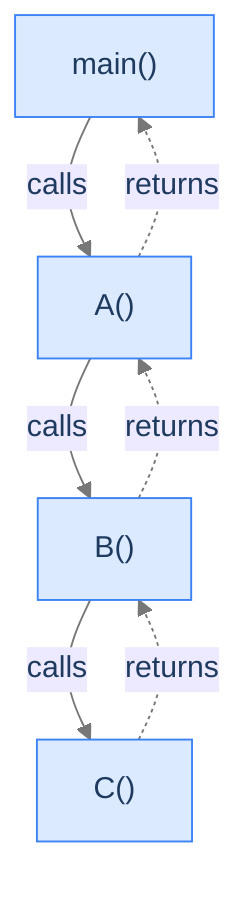
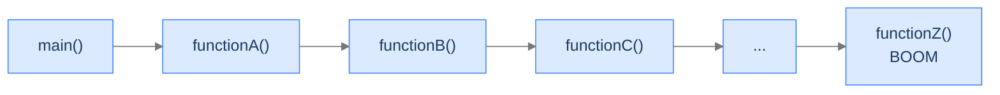
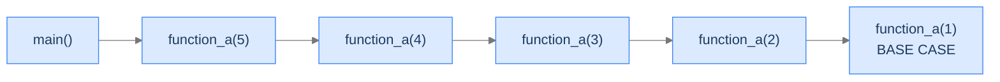

# 2. Nested Functions

You've written nested function calls a thousand times — `main` calls `parse`, `parse` calls `tokenize`, `tokenize` calls `peek`. The code is so ordinary you stopped noticing it. But what *exactly* happens at the moment of the call? Where do the arguments go? How does the program know where to come back to when the called function returns? And why is it that this same mechanism — the one that makes every program work — is the one that crashes the program when recursion goes too deep?

This lesson is the bridge between memory layout and recursion. By the end you'll be able to draw the stack at any moment of a running program and predict, before reading the code, exactly where it will fail.

## Table of contents

1. [When one function calls another](#when-one-function-calls-another)
2. [Anatomy of a stack frame](#anatomy-of-a-stack-frame)
3. [Tracing a real program](#tracing-a-real-program)
4. [Stack overflow — three ways to break the scaffold](#stack-overflow--three-ways-to-break-the-scaffold)
5. [What this means for recursion](#what-this-means-for-recursion)

***

# When One Function Calls Another

> **Course:** DSA › Algorithms › Recursion › Nested Functions

Pick any non-trivial program — a compiler, a web server, a game engine. None of them live in a single function. They live in dozens, hundreds, sometimes tens of thousands of small functions that call one another in a constant cascade. Modular. Testable. Reusable. The price for all that elegance is paid in one specific region of memory: the stack we set up in the Memory Model lesson.

Every nested call adds a fresh tier of scaffolding. The previous tier is still there, paused mid-construction, waiting for the new tier to finish so it can resume. Stack memory is the bookkeeping that makes that pausing-and-resuming work, and stack overflow is what happens when the pausing is too deep for the bookkeeping to hold.



<p align="center"><strong>Solid arrows are calls (going down). Dashed arrows are returns (coming back up). At the moment <code>C</code> is executing, every function above it on the chain is paused — its frame still alive on the stack.</strong></p>

That last sentence is the one that makes recursion possible. **Paused frames are real bytes in real memory.** They're not just a mental abstraction. Every paused call is paying for its frame in stack space, and the stack is finite.

---

## Stack Memory's One Job

A function's stack frame is the set of bytes the function uses while it's running and paused-but-alive. Every nested call creates one. Every return destroys one. The stack region is the single contiguous block that holds all of these frames at once, in call order.

That's the whole job: track who's calling whom, in what order, and what state each caller was in when it paused.

---

## Key Takeaway

Functions calling functions is the most ordinary thing programs do. The stack is what makes that ordinary thing work, and it's also what makes that ordinary thing dangerous when we ask it to go too deep. Next, the bookkeeping itself — what's actually inside one of these frames.

***

# Anatomy of a Stack Frame

> **Course:** DSA › Algorithms › Recursion › Nested Functions

A stack frame is not magic. It's a fixed-size block of bytes in the stack region with a fixed layout, decided by the compiler. Every frame in a program follows the same template — only the contents differ.

---

## What's Inside One Frame

```d2
frame: "Stack frame for foo(int x, int y)" {
  grid-rows: 5
  grid-columns: 1
  grid-gap: 0
  ret:    "Return address\n— where to jump back to in the caller"
  saved:  "Saved registers / frame pointer\n— restored on return"
  params: "Parameters\n— x, y"
  locals: "Local variables\n— all `int`/`double`/etc. declared inside"
  pad:    "(possible padding for alignment)"
}
```

<p align="center"><strong>One frame, top-to-bottom: return address, saved registers, parameters, locals. The exact layout varies by ABI, but every frame answers the same four questions.</strong></p>

Each entry in the frame answers one question:

- **Return address** — *where do I resume in the caller's code when this function returns?* This is the value of the program counter the moment the call instruction ran. Without it, the function would have no idea where to go when it returns.
- **Saved registers / frame pointer** — *what was the calling function in the middle of doing in CPU registers when it called me?* The function saves what it needs to clobber so it can restore the caller's state on return.
- **Parameters** — *what arguments was I called with?* On most ABIs the first few arguments come in via registers and the rest via the frame; the frame is the canonical fallback.
- **Locals** — *every variable declared inside this function.* Each gets its own slot, sized at compile time.

When the function returns, the CPU pops the frame in one operation: it reads the return address, jumps to it, restores the saved registers, and adjusts the stack pointer past the frame's bytes in a single move. The frame's contents are now garbage that the next call will happily overwrite.

---

## A Concrete Picture

Imagine `foo(int x, int y)` is called with `x = 3, y = 7`. While `foo` is executing, its frame on the stack contains:

| Slot | Value | Bytes | Comment |
|---|---|---|---|
| Return address | `0x401a4f` | 8 | The caller's next instruction. |
| Saved frame pointer | `0x7ffeefb...` | 8 | Caller's frame pointer. |
| `x` (param) | `3` | 4 | First argument. |
| `y` (param) | `7` | 4 | Second argument. |
| `result` (local) | initialised mid-function | 4 | A local variable declared inside `foo`. |

Total frame size: ~32 bytes. Multiply by the number of nested calls live at once and you have the program's *current* stack usage.

---

## Key Takeaway

A frame is not abstract — it's a fixed block of bytes with a fixed layout. Every call lays down exactly one such block. Now we'll watch them get laid down in real time.

***

# Tracing a Real Program

> **Course:** DSA › Algorithms › Recursion › Nested Functions

Let's run a four-function program through the stack and watch the frames grow and shrink. The program is deliberately trivial — one call per function, no logic — so we can focus on the *stack behaviour* without the algorithm getting in the way.


```pseudocode
function functionC():
    return                       # empty — we trace the stack, not the code

function functionB():
    functionC()                  # B's frame stays alive while C runs

function functionA():
    functionB()                  # A's frame stays alive while B + C run

function main():
    functionA()                  # main's frame stays alive while A + B + C run

main()
```

```python run
def function_c() -> None:
    pass                # Empty body — we care about the call stack, not the code

def function_b() -> None:
    function_c()        # Calls C; B's frame stays alive while C runs

def function_a() -> None:
    function_b()        # Calls B; A's frame stays alive while B and C run

def main() -> None:
    function_a()        # Calls A; main's frame stays alive while A, B, C run

main()
```

```java run
public class NestedCalls {
    static void functionC() {
        // Empty — we're tracing the call stack, not the logic
    }

    static void functionB() {
        functionC();
    }

    static void functionA() {
        functionB();
    }

    public static void main(String[] args) {
        functionA();
    }
}
```

```c run
#include <stdio.h>

void function_c(void) { /* empty */ }

void function_b(void) {
    function_c();
}

void function_a(void) {
    function_b();
}

int main(void) {
    function_a();
    return 0;
}
```

```scala run
object NestedCalls {
  def functionC(): Unit = ()        // Empty — focus on the stack

  def functionB(): Unit = functionC()
  def functionA(): Unit = functionB()

  def main(args: Array[String]): Unit = functionA()
}
```


> *Sketch the stack at the moment <code>function_c</code> is executing. Now sketch it at the moment <code>function_c</code> returns. Which frame disappears first?*

---

## The Stack as the Program Runs

The slideshow below shows the stack at four key moments: program start, mid-call, deepest call, and partial unwind.

<div class="d2-slides" data-caption="Each call pushes a fresh frame onto the top. Returns pop in reverse order — last in, first out.">

```d2
proc: "Stack — program just started\n(only main() is alive)" {
  grid-rows: 1
  grid-columns: 1
  grid-gap: 0
  m: "main()" {style.fill: "#dbeafe"; style.stroke: "#3b82f6"}
}
```

```d2
proc: "Stack — main has called function_a()\n(both alive)" {
  grid-rows: 2
  grid-columns: 1
  grid-gap: 0
  a: "function_a()" {style.fill: "#fde68a"; style.stroke: "#d97706"}
  m: "main()" {style.fill: "#dbeafe"; style.stroke: "#3b82f6"}
}
```

```d2
proc: "Stack — deepest moment: function_c() running\n(four frames alive)" {
  grid-rows: 4
  grid-columns: 1
  grid-gap: 0
  c: "function_c() — running NOW" {style.fill: "#fecaca"; style.stroke: "#dc2626"}
  b: "function_b() — paused" {style.fill: "#bbf7d0"; style.stroke: "#16a34a"}
  a: "function_a() — paused" {style.fill: "#fde68a"; style.stroke: "#d97706"}
  m: "main() — paused" {style.fill: "#dbeafe"; style.stroke: "#3b82f6"}
}
```

```d2
proc: "Stack — function_c has returned\n(b is now resuming)" {
  grid-rows: 3
  grid-columns: 1
  grid-gap: 0
  b: "function_b() — resuming" {style.fill: "#bbf7d0"; style.stroke: "#16a34a"}
  a: "function_a() — paused" {style.fill: "#fde68a"; style.stroke: "#d97706"}
  m: "main() — paused" {style.fill: "#dbeafe"; style.stroke: "#3b82f6"}
}
```

</div>

The "deepest moment" frame is the one to memorise. Four functions, four frames — all alive simultaneously. Three of them are *paused mid-call*, holding their place in the source code via the return-address slot. Only `function_c` is actively running. When `function_c` returns, its frame is popped, and `function_b` resumes from the line that called `function_c`. Then `function_b` returns, then `function_a`, then `main`. Last in, first out. The scaffolding analogy from the Memory Model lesson is doing real work here.

This is the same mechanism recursion uses, only the frames happen to all be of the same function calling itself. We'll see that in the Recursion lesson.

---

## Key Takeaway

Calls push, returns pop. The deepest moment is when the most frames are alive at once. So far our example has four frames — perfectly safe. But the stack region is small, and "deep" can mean very different things depending on what each frame holds. That's the next chapter.

***

# Stack Overflow — Three Ways to Break the Scaffold

> **Course:** DSA › Algorithms › Recursion › Nested Functions

The stack region is finite. On most systems each thread gets between **1 MB and 8 MB** of stack — total. That's not very much. A small frame holds maybe a hundred bytes; a frame with a big local array holds far more. When the running program tries to push one more frame and there isn't room for it, the OS terminates the process with a **stack overflow** error.

There are three ways to overflow the stack, and they fail very differently. Knowing all three is the difference between fixing real bugs and Googling stack-traces.

---

## Failure Mode 1 — Too Many Nested Calls

The classic stack overflow. Each call adds a frame; if the program goes too deep, the stack runs out of room. The frames don't have to be big — they just have to be many. Unbounded recursion is the canonical example.



<p align="center"><strong>Each frame is small, but a million of them adds up. The crash happens at the very next call after stack space runs out.</strong></p>


```pseudocode
function deep(n):
    if n = 0:
        return 0
    return deep(n − 1) + 1       # one new stack frame per call — overflows past ~10⁴–10⁵

deep(10000)                      # exhausts the call stack on every mainstream runtime
```

```python run
# Python: deep nesting hits the recursion limit (default ~1000) first,
# raising RecursionError. Beyond that limit you'd get a real C-level
# segfault from the CPython interpreter's stack.
import sys

def deep(n: int) -> int:
    if n == 0:
        return 0
    return deep(n - 1) + 1   # One frame per call

# Try this — uncomment to see the failure
# sys.setrecursionlimit(10_000)
# print(deep(10_000))         # Likely RecursionError or segfault
```

```java run
public class DeepNesting {
    static int deep(int n) {
        if (n == 0) return 0;
        return deep(n - 1) + 1;     // Each call adds one JVM stack frame
    }

    public static void main(String[] args) {
        // Default JVM stack ~512 KB; ~10K-30K calls before StackOverflowError.
        System.out.println(deep(10_000));
    }
}
```

```c run
#include <stdio.h>

int deep(int n) {
    if (n == 0) return 0;
    return deep(n - 1) + 1;        /* One frame per call, ~32-64 bytes each */
}

int main(void) {
    /* On Linux with default 8 MB stack, ~100K-300K calls before SIGSEGV.
     * Try increasing n until your program crashes. */
    printf("%d\n", deep(100000));
    return 0;
}
```

```scala run
// Scala on the JVM. WITHOUT @tailrec the JVM will not optimise this,
// so each call costs a real frame. Try `import scala.annotation.tailrec`
// and adding @tailrec — Scala will rewrite tail-recursive calls into a loop.
object DeepNesting {
  def deep(n: Int): Int = {
    if (n == 0) 0
    else deep(n - 1) + 1   // NOT tail-recursive (we add 1 *after* the call)
  }

  def main(args: Array[String]): Unit = {
    println(deep(10_000))
  }
}
```


The failure shows up differently in each language — `RecursionError` in Python, `StackOverflowError` on the JVM, segfault in C/C++/Rust, `RangeError` in V8. Same underlying mechanism: too many frames, no room for one more.

---

## Failure Mode 2 — One Frame, Too Big

A single function with a huge local can overflow the stack on the *first call*. No nesting required.

```d2
direction: down

stack: "Stack region (8 MB total)" {
  grid-rows: 1
  grid-columns: 1
  grid-gap: 0
  big: "function_x() frame\n— int arr[2_000_000_000] (~8 GB!)\n— BOOM" {style.fill: "#fecaca"; style.stroke: "#dc2626"}
}
```

<p align="center"><strong>One frame larger than the entire stack region overflows on entry. The crash isn't from accumulation — it's from a single hugely-sized frame.</strong></p>

The classic offender is a giant fixed-size local array. C, C++, and Rust will happily try to put a `int arr[1_000_000_000]` on the stack — and crash on the very first call, because no stack region is that big. Java, JavaScript, and Python sidestep this by routing arrays/lists through the heap, but they invent new failure modes (`OutOfMemoryError`, `MemoryError`).

> *Predict before reading on — which crashes faster: 1 million nested empty calls, or 1 call that declares <code>int arr[1_000_000_000]</code>? Why?*

The huge-frame case typically crashes immediately on the first call's entry; the deep-nesting case runs for milliseconds before tripping over its own pile of small frames. Both end with the same kernel signal, but the timing differs by orders of magnitude.


```pseudocode
function bigLocal():
    arr ← list of 1_000_000_000 zeros   # heap allocation — fails with MemoryError, not StackOverflow
    return length(arr)

bigLocal()
```

```python run
# Python lists are heap-allocated; you can't easily make a stack-sized
# local explode the stack. Instead you'd hit MemoryError on the heap.
def big_local() -> int:
    arr = [0] * 1_000_000_000   # Heap allocation — MemoryError if RAM runs out
    return len(arr)

# print(big_local())            # Probably crashes the kernel before stack
```

```java run
public class BigLocal {
    static void bigLocal() {
        // Java arrays are objects — they live on the heap.
        // A huge array hits OutOfMemoryError, not StackOverflow.
        int[] arr = new int[1_000_000_000];
        System.out.println(arr.length);
    }

    public static void main(String[] args) {
        bigLocal();
    }
}
```

```c run
#include <stdio.h>

void big_local(void) {
    /* C arrays declared inside a function go on the STACK by default.
     * 1 billion ints × 4 bytes = 4 GB — far larger than the 8 MB stack.
     * Crash is immediate on entry, before any code in the function runs. */
    int arr[1000000000];
    arr[0] = 42;
    printf("%d\n", arr[0]);
}

int main(void) {
    big_local();
    return 0;
}
```

```scala run
// Scala arrays are heap-allocated (JVM Array). OOM rather than stack overflow.
object BigLocal {
  def bigLocal(): Unit = {
    val arr = new Array[Int](1000000000)   // Heap; expect OOM
    println(arr.length)
  }

  def main(args: Array[String]): Unit = bigLocal()
}
```


The full per-language story:

| Language | What overflows | Typical error | Why |
|---|---|---|---|
| C / C++ | Fixed-size local arrays on the stack | Segmentation fault (SIGSEGV) | Stack arrays sized at compile time → crash on entry |
| Rust | Fixed-size stack arrays declared with literal sizes | Stack overflow / SIGSEGV | Same as C; `Vec` routes to heap so this rarely happens in idiomatic code |
| Java / Kotlin / Scala | n/a — arrays are heap objects | `OutOfMemoryError` | Heap exhausted before stack |
| Python | n/a — every container is a heap object | `MemoryError` | Heap exhausted |
| JavaScript / TypeScript | n/a — arrays are heap objects | `RangeError` / OOM | V8 limits per-array length |
| Go | n/a for slices; goroutine stacks grow on demand | `runtime: out of memory` | Slices on heap; stack auto-resizes |

---

## Failure Mode 3 — Both at Once

Real-world stack overflow rarely fits cleanly into Mode 1 or Mode 2. Most production crashes are *combined*: moderately deep nesting, moderately fat frames, hitting the stack limit together.

<div class="d2-slides" data-caption="Combined failure: each frame is bigger than the empty case, and there are more frames than the simple-array case. Together they exhaust the stack.">

```d2
proc: "Stack — moderate frames, moderate count" {
  grid-rows: 4
  grid-columns: 1
  grid-gap: 0
  c: "function_c() — int arr[10_000]" {style.fill: "#dbeafe"; style.stroke: "#3b82f6"}
  b: "function_b() — int arr[40_000]" {style.fill: "#fde68a"; style.stroke: "#d97706"}
  a: "function_a() — int arr[10_000]" {style.fill: "#bbf7d0"; style.stroke: "#16a34a"}
  m: "main()" {style.fill: "#ede9fe"; style.stroke: "#7c3aed"}
}
```

```d2
proc: "Stack — same call chain, 100x recursion depth" {
  grid-rows: 6
  grid-columns: 1
  grid-gap: 0
  many: "...100 more frames..." {style.fill: "#fecaca"; style.stroke: "#dc2626"}
  c: "function_c() — int arr[10_000]"
  b: "function_b() — int arr[40_000]"
  a: "function_a() — int arr[10_000]"
  m: "main()"
  doom: "BOOM — stack exhausted" {style.fill: "#fecaca"; style.stroke: "#dc2626"}
}
```

```d2
proc: "Reality — production crash" {
  grid-rows: 3
  grid-columns: 1
  grid-gap: 0
  cause: "Each frame: ~200 KB of locals\nDepth: ~50 recursive calls\nTotal: ~10 MB > 8 MB stack" {style.fill: "#fecaca"; style.stroke: "#dc2626"}
  why: "Neither alone would crash.\nCombined, they do."
  fix: "Fix: reduce frame size OR depth\n(or move data to heap)"
}
```

</div>

In well-tested code, this is the most common cause of real-world stack overflow. It often appears not as an immediate crash but only when edge-case inputs push the depth or local-size beyond a threshold. The crash is intermittent. The frames look "fine." The fix is to either move data off the stack (heap allocation) or to flatten the recursion (iteration with an explicit stack data structure).


```pseudocode
function chain(n):
    work ← list of 10000 zeros          # heap pressure
    if n = 0:
        return 0
    return chain(n − 1) + work[0]       # also stack-deep — both regions stressed at once

chain(10000)                            # in C this overflows the stack via giant locals
```

```python run
# Python: combined depth + heap allocation. Lists are heap, so big_local
# allocations don't grow Python frames much. The depth-limit error comes first.
def chain(n: int) -> int:
    work = [0] * 10_000   # Heap allocation — pressures GC, not stack
    if n == 0:
        return 0
    return chain(n - 1) + work[0]
```

```java run
public class Combined {
    static int chain(int n) {
        int[] work = new int[10_000];   // Heap (Java arrays are objects)
        if (n == 0) return 0;
        return chain(n - 1) + work[0];  // Frames stay small; heap pressure rises
    }

    public static void main(String[] args) {
        System.out.println(chain(10_000));
    }
}
```

```c run
#include <stdio.h>

/* C is the language where this combination bites hardest:
 * each frame really IS bigger because of the stack array. */
int chain(int n) {
    int work[10000];                   /* 40 KB per frame on the stack */
    work[0] = n;
    if (n == 0) return 0;
    return chain(n - 1) + work[0];
}

int main(void) {
    /* 8 MB / 40 KB ≈ 200 calls before crash — far less than empty recursion */
    printf("%d\n", chain(200));
    return 0;
}
```

```scala run
object Combined {
  def chain(n: Int): Int = {
    val work = new Array[Int](10000)   // Heap — JVM arrays
    if (n == 0) 0
    else chain(n - 1) + work(0)
  }

  def main(args: Array[String]): Unit = {
    println(chain(10_000))
  }
}
```


---

## Per-Language Stack-Overflow Behaviour

How a stack overflow surfaces depends on the runtime. This expanded table covers all 10 languages of this course.

| Language | Default stack size | Error / signal | Notes |
|---|---|---|---|
| **C** | ~8 MB (Linux), ~1 MB (Windows) | `SIGSEGV` (segfault) | No exception; the kernel kills the process. |
| **C++** | Same as C | `SIGSEGV` | Same. Some compilers can detect deep templates at compile time. |
| **Java** | ~512 KB (default) — `-Xss` to change | `StackOverflowError` | A real catchable Throwable, but rarely useful to catch. |
| **Kotlin** | Same as Java | `StackOverflowError` | Identical to Java. |
| **Scala** | Same as Java | `StackOverflowError` | `@tailrec` annotation rewrites tail calls into a loop, eliminating the risk. |
| **Python** | Soft limit `sys.getrecursionlimit()` ≈ 1000; hard limit OS stack | `RecursionError` (soft) → segfault (hard) | The interpreter's call stack and Python's own recursion limit are *separate* limits. |
| **JavaScript** | Engine-defined (~10K-15K frames in V8) | `RangeError: Maximum call stack size exceeded` | Catchable in JS. |
| **TypeScript** | Same as JS (compiles to JS) | `RangeError` | Same. |
| **Go** | Starts at ~8 KB per goroutine; **grows automatically** | `runtime: stack overflow` only on hard cap (~1 GB) | Stack auto-resizing makes deep recursion almost free. |
| **Rust** | ~8 MB main thread; 2 MB per spawned thread | `SIGABRT` / "thread '...' has overflowed its stack" | Configurable via `std::thread::Builder::stack_size`. |

---

## Key Takeaway

Stack overflow has three flavours: many small frames, one huge frame, or both at once. Each language reports it differently, but the underlying mechanic is the same — push one too many bytes onto the scaffolding and the whole structure folds. Now imagine you wrote a function that called *itself*. How many frames would that pile up?

***

# What This Means for Recursion

> **Course:** DSA › Algorithms › Recursion › Nested Functions

We've been pretending the four functions in our trace were unrelated. Watch what happens if `function_a` calls **`function_a`**.



<p align="center"><strong>Same shape as <code>main → A → B → C</code> — only here every frame is the same function with a different argument. That's all recursion is.</strong></p>

Each call gets its **own frame**, with its own copy of every local variable, just like before. The fact that all the frames belong to the same function changes nothing about how the stack works — each frame is independent. They unwind in reverse, each computing its result from the result of the call above it.

This is the moment the file-01 analogy and the file-02 mechanics fuse. **Recursion is not a new feature.** It's the same `main → A → B → C` mechanism, where `A`, `B`, and `C` happen to be the same function. Stack frames don't care.

But it also means recursion inherits *every* failure mode we just listed. Recurse too deep — Failure Mode 1. Recurse with a big local — Failure Mode 2. Recurse with both — Failure Mode 3. The number of recursive calls you can make is bounded by **stack size ÷ frame size**. Forget the base case and you crash; forget how big each frame is and you crash sooner than you think.

---

## What Changes Once We Have Recursion

The mechanics of nested functions stay identical. What changes is **how we think about the call tree**.

In ordinary code (`main → parse → tokenize → peek`), the call tree is something we wrote by hand. In recursion, the call tree is *generated* by the function calling itself with smaller inputs until it hits a base case. That generated tree is structurally identical to a hand-written one — same frames, same LIFO unwinding — but its *shape* is determined by the recursive relation, not by the programmer.

That shape is the subject of the Recursion lesson.

---

## Final Takeaway

Functions calling functions. Frames pushing on top of frames. The stack region holding all of them, dropping them in reverse order on return. That's the entire mechanism, and recursion adds no new mechanism on top — just a self-similar pattern of calls.

You came in with a hazy sense of "the stack is where calls live." You're leaving with three concrete failure modes, an exact picture of what's inside one frame, and the understanding that recursion is *just* the LIFO model applied self-similarly. Next: how to recognise problems that have this self-similar structure and turn them into clean recursive code.

**Transfer challenge — try before the Recursion lesson:** Trace the stack for the function below, called as `count_down(5)`, frame by frame. How many frames are alive at the deepest point? In what order do they return?

```c run
#include <stdio.h>
void count_down(int n) {
    if (n == 0) return;     /* Base case */
    printf("frame n=%d\n", n);
    count_down(n - 1);
}
int main(void) {
    count_down(5);
    return 0;
}
```

<details>
<summary><strong>Answer — open after you've sketched it</strong></summary>

Six frames are alive at the deepest moment: `main`, `count_down(5)`, `count_down(4)`, `count_down(3)`, `count_down(2)`, `count_down(1)`. (Note that `count_down(0)` is invoked, but its body returns immediately without recursing — it briefly exists as a seventh frame at the very bottom of the dive, then pops.)

```
top of stack →   count_down(0)   ← base case, returns first
                 count_down(1)
                 count_down(2)
                 count_down(3)
                 count_down(4)
                 count_down(5)
                 main()
```

They return in reverse order: `count_down(0)` → `count_down(1)` → ... → `count_down(5)` → `main`. Each frame holds its own `n`. The combined picture is just the four-function trace from earlier, with one function reused.

**You just predicted the Recursion lesson's diagram of the recursion stack.** The next lesson formalises the two-piece structure (base case + recursive relation) that makes any function's call tree shape predictable.

</details>
