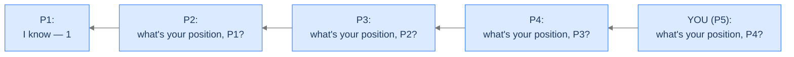
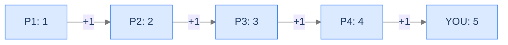
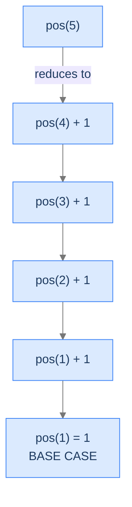
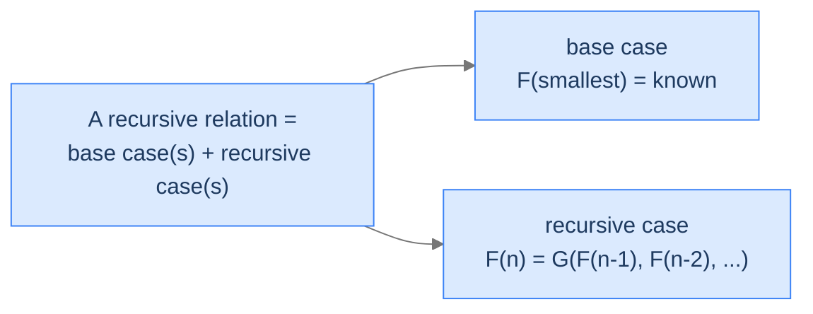
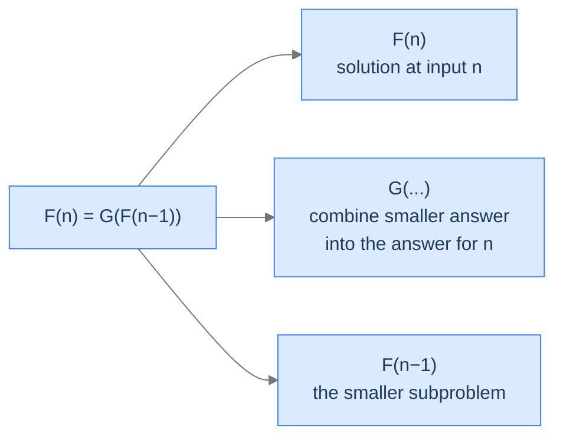
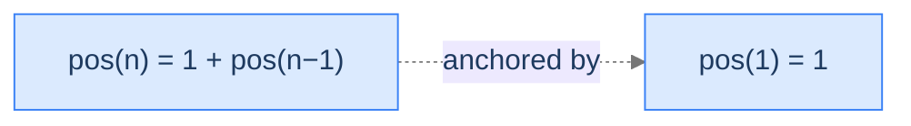
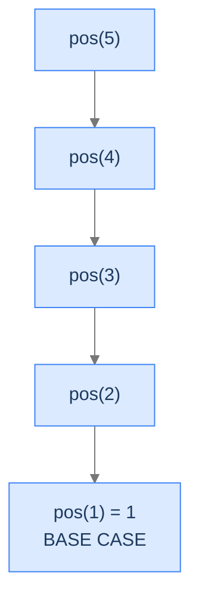
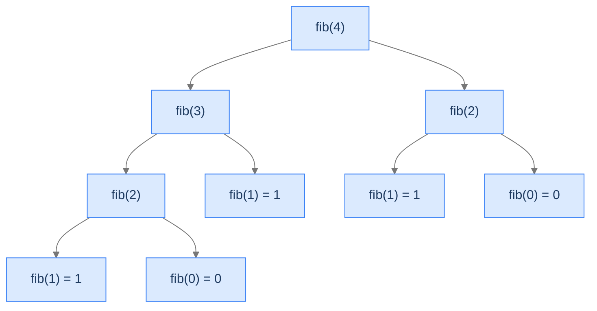

# 3. Recursion

You're stuck in a queue at an ATM. The line stretches around the block. You want to know your position — eleventh? thirty-seventh? — but you can't move out of line and you're too lazy to count. There's exactly one trick that gets you the answer without leaving your spot, without counting anything yourself, and without anybody in front of you counting either. It's the same trick that powers half the algorithms you'll ever write.

That trick is recursion. By the end of this lesson you'll know what shape a problem has to have for recursion to apply, what two pieces every recursive solution must contain, what the stack looks like as the function unwinds, and exactly why forgetting one of those two pieces leaves your process face-down on the floor.

## Table of contents

1. [A queue, a lazy person, and an algorithm](#a-queue-a-lazy-person-and-an-algorithm)
2. [The recursive insight — two observations](#the-recursive-insight--two-observations)
3. [The two pieces of every recursion](#the-two-pieces-of-every-recursion)
4. [Visualising the calls — the recursion tree](#visualising-the-calls--the-recursion-tree)
5. [Implementing it in code](#implementing-it-in-code)
6. [What recursion actually costs](#what-recursion-actually-costs)

***

# A Queue, a Lazy Person, and an Algorithm

Stand in line at any ATM and a small mystery stares back at you: the people around you don't know their position, and neither do you. Counting all the way to the front would mean stepping out of line. Asking everyone behind you what number you are is hopeless — they don't know either. But if you could ask *one* person — the one directly in front of you — and they could ask *one* person ahead of them, all the way down the line, the answer would come back to you in seconds.

```d2
queue: "Queue at the ATM" {
  grid-rows: 1
  grid-columns: 7
  grid-gap: 0
  atm:  "ATM" {style.fill: "#fde68a"; style.stroke: "#d97706"}
  p1:   "P1\n(front)"
  p2:   "P2"
  p3:   "P3"
  p4:   "P4"
  p5:   "YOU\n(P5)" {style.fill: "#dbeafe"; style.stroke: "#3b82f6"}
  p6:   "P6\n(behind)"
}
```

<p align="center"><strong>You're P5. The ATM is at the far left. The person in front of you is P4. P4 doesn't know their position any more than you do — but together you can figure it out.</strong></p>

---

## What Makes This Problem Recursive

Two facts about the queue tell us recursion will work:

1. **The first person in line knows their position for free.** They have no one in front; they're number one.
2. **Everyone else's position is exactly one more than the position of the person ahead of them.** Whatever P4's position turns out to be, you're P4 + 1.

Read those two sentences again. The first is a *known answer for the smallest version of the problem*. The second is a *rule for solving the larger version using the smaller version's answer*. Those are exactly the two pieces every recursive solution needs. Nothing else changes between this ATM problem and computing factorials, walking trees, or solving the kinds of dynamic programming problems we'll meet later in the course.

---

## Why Recursion Matters Beyond the Queue

The queue example is convenient because it's vivid, but the deeper reason to learn recursion is that it's the foundation of half the algorithms you'll see in this course:

- Tree and graph traversals (DFS is recursion + a visited set).
- Divide and conquer (merge sort, quicksort).
- Memoisation and dynamic programming (recursion + a cache).
- Backtracking (recursion + an undo step).

If you skim recursion, every one of those topics will feel like a wall. If you internalise it now, those topics feel like variations on a theme you already know.

---

## Key Takeaway

Two facts about the queue — first person's answer is free, everyone else is +1 from the next — are enough to solve the entire problem. That same two-piece pattern repeats in every recursive solution you'll ever write. Next, we make the pattern explicit.

***

# The Recursive Insight — Two Observations

The two observations from the queue are the recipe. Let's promote them to first-class concepts and watch them work.

> 1. The **first** person in the queue knows their position.
> 2. You can compute your position by **adding 1 to the position of the person ahead of you**.

These two observations are sufficient conditions for a recursive solution. They tell us:

- There's a smallest version of the problem we already know how to solve. (Observation 1.)
- Every larger version can be solved using the answer to a smaller version. (Observation 2.)

That second observation is doing real work. It's saying *the problem has a self-similar shape*. The position-of-P5 problem is structurally identical to the position-of-P4 problem; only the input is smaller. If you know how to solve "what's P4's position?" — even hypothetically — you can solve "what's P5's position?" by adding 1.

> *Before reading on — what's the smallest case where you don't need to ask anyone? That's the moment recursion has to stop. Predict it before you continue.*

The smallest case is P1 — the front of the line. They have no one to ask, and they need no one to ask, because the answer is `1`. This is the **base case**: the smallest instance of the problem whose answer is already known.

---

## Asking Down the Line

To compute your position, you ask the person in front of you. To answer, that person asks the person in front of *them*. That chain of questions continues until it reaches P1, who knows their answer without needing to ask anyone.



<p align="center"><strong>Each person delegates the same question to the person ahead. Questions flow toward the front of the line.</strong></p>

---

## Hitting the Front

The chain stops at P1. They have no one in front of them and no need to ask. They reply: "**I'm number 1.**"

```d2
queue: "Queue — base case reached" {
  grid-rows: 1
  grid-columns: 7
  grid-gap: 0
  atm:  "ATM"
  p1:   "P1\nI'm 1\n(BASE CASE)" {style.fill: "#fde68a"; style.stroke: "#d97706"}
  p2:   "P2"
  p3:   "P3"
  p4:   "P4"
  p5:   "YOU"
  p6:   "P6"
}
```

<p align="center"><strong>P1 is the base case. They answer without asking anyone — the recursion's terminating condition.</strong></p>

---

## Adding Answers Back Up

Once P1 answers, P2 hears `1`, adds 1, gets their own position (`2`), and tells P3. P3 adds 1, gets `3`, tells P4. P4 says `4`, you say `5`. The answers flow back up the line in the reverse direction the questions flowed down.



<p align="center"><strong>Answers flow back up the line. Each person adds 1 to whatever the person ahead reported.</strong></p>

This bidirectional flow — questions going down, answers coming up — is the mental picture to keep. It maps directly onto the stack of frames from the Nested Functions lesson: questions flowing forward = frames being pushed; answers flowing back = frames being popped while their values bubble up to the caller.

---

## Key Takeaway

Two facts (first-person knows; everyone else is +1) plus a chain of "ask the person ahead" plus an "add 1 on the way back" = recursion. Next, we lift this from a queue example to the formal mathematical structure that applies to every recursive problem.

***

# The Two Pieces of Every Recursion

Now let's stop talking about queues and start talking about *every* recursive problem. Two pieces. That's it.

---

## Recursive Structure

A problem has **recursive structure** if it can be broken down into smaller subproblems whose solutions can be used to solve the bigger problem. Crucially, these subproblems must be the *same* problem on a *smaller* input — not a different problem.

The position-in-queue problem has recursive structure because computing P5's position reduces to computing P4's position (and adding 1). P4's position reduces to P3's, and so on. Same problem, smaller input, every step.



<p align="center"><strong>Each <code>pos(n)</code> reduces to <code>pos(n-1) + 1</code>. The recursion bottoms out at <code>pos(1) = 1</code>.</strong></p>

---

## Base Case

The **base case** is the smallest instance of the problem whose answer is already known. It's where the recursion stops calling itself and starts returning concrete values.

For the queue: `pos(1) = 1`. The first person knows their answer; they don't recurse.

```d2
queue: "Queue — base case is the smallest known answer" {
  grid-rows: 1
  grid-columns: 7
  grid-gap: 0
  atm: "ATM"
  p1:  "P1\nBASE CASE\nanswer = 1" {style.fill: "#fde68a"; style.stroke: "#d97706"}
  p2:  "P2"
  p3:  "P3"
  p4:  "P4"
  p5:  "P5"
  p6:  "P6"
}
```

<p align="center"><strong>The base case is the front of the line — the smallest input whose answer needs no further reduction.</strong></p>

The base case has two jobs:
1. **Provide a known answer** for the smallest input.
2. **Stop the recursion** — without it, the function calls itself forever. Forever in stack terms means "until you crash with stack overflow" (the Nested Functions lesson). A recursive function without a base case is a recursive function that crashes.

---

## Recursive Relation

Recursion's mathematical form is the **recursive relation** (also called a *recurrence relation* or *recursive equation*). It's a formula that defines `F(n)` in terms of `F` evaluated at smaller inputs, with one or more base cases anchoring it.



<p align="center"><strong>Every recursive relation has two halves: the base case anchors it; the recursive case does the work.</strong></p>

The generic shape:



<p align="center"><strong><code>F(n)</code> is the answer at <code>n</code>. <code>F(n−1)</code> is the smaller subproblem. <code>G</code> is whatever combine step turns the smaller answer into the answer for <code>n</code>.</strong></p>

For our queue:



<p align="center"><strong>The recursive relation for finding your queue position. The base case anchors it; the recursive case adds 1.</strong></p>

Read this as: "*The position of person n* is *1 plus the position of person n−1*, *unless* `n = 1`, *in which case it's `1` directly.*" If you can write that line for your problem, you can write a recursive function for your problem. Finding the recursive relation is the entire battle in most recursion exercises.

---

## Key Takeaway

Two pieces: a **base case** (a known answer) and a **recursive relation** (a rule that reduces a bigger input to a smaller one). Find these two pieces and you've solved the problem — code is just the dictation. Next, we draw the *shape* of the calls those two pieces produce.

***

# Visualising the Calls — The Recursion Tree

The recursion tree is the most useful diagram in this course. It shows the call structure of a recursive function from the top-level call all the way down to the base cases — and once you can draw the tree, you can read off the algorithm's time complexity, the maximum stack depth, and the pattern type (which we'll meet in the four pattern lessons that follow: Head Recursion, Tail Recursion, Multiple Recursion, and Multidimensional Recursion).

---

## What a Recursion Tree Is

A recursion tree is a tree where each node is one call to the recursive function, labelled with its input. A node's children are the recursive calls *that node makes*. The leaves are calls to the base case.

For the queue problem, the tree is unusually thin — every call makes exactly one recursive call.



<p align="center"><strong>The recursion tree for <code>pos(5)</code>. Each call makes one recursive call. The tree is a straight line.</strong></p>

> *Pause. Trace what happens if you forget the base case. How does the program end?*

Forget the base case and `pos(1)` recurses to `pos(0)`, which recurses to `pos(-1)`, which recurses to `pos(-2)` ... forever. The stack fills with frames until it overflows — Failure Mode 1 from the Nested Functions lesson. The base case isn't decoration. It's the only reason the tree has leaves at all.

---

## Why Is It Called a Tree When It's a Line?

Fair question. The queue example has no branching — every call has exactly one child. Other recursive relations branch:



<p align="center"><strong>Fibonacci's tree branches: <code>fib(n) = fib(n−1) + fib(n−2)</code>. Each call spawns two children. We'll meet this in <em>multiple recursion</em> (the Multiple Recursion lesson).</strong></p>

The classification of recursion patterns we'll work through in the four pattern lessons (Head Recursion, Tail Recursion, Multiple Recursion, Multidimensional Recursion) is essentially a classification of *tree shapes*: head/tail recursion produce thin trees; multiple recursion produces wide branching trees; multidimensional recursion produces grid-shaped subproblem spaces. The tree is the lens.

---

## Reading Complexity Off the Tree

Once you can draw the tree, two complexities fall out almost for free:

- **Time complexity** ≈ *number of nodes in the tree* (each node does some constant work, plus the cost of combining children's answers).
- **Space complexity** (stack depth) ≈ *height of the tree* — the longest path from root to any leaf.

For the queue: tree has `n` nodes in a straight line, so time is `O(n)` and space is `O(n)` (stack depth). For Fibonacci's branching tree: `~2^n` nodes, height `n`, so naive recursion is `O(2^n)` time / `O(n)` space — a disaster we'll fix with memoisation later.

---

## Key Takeaway

Drawing the tree is the fastest way to *see* what a recursive function does. The tree's height tells you the stack depth; the tree's node count tells you the time complexity; the tree's shape tells you which of the four patterns (head, tail, multiple, multidimensional) you're working with. Now let's turn the tree into code.

***

# Implementing It in Code

A recursive implementation is just a function whose body contains a call to itself. It directly mirrors the recursive relation:

- The **base case** becomes an `if` that returns a known value.
- The **recursive case** becomes a return statement that calls the same function with a smaller input and combines the result.

That's it. There's no extra plumbing.


```python run
class Solution:
    def findPosition(self, n: int) -> int:
        # Base case
        if n == 1:
            return 1

        return 1 + self.findPosition(n - 1)

if __name__ == "__main__":
    sol = Solution()
    print(sol.findPosition(4))
```

```java run
class Solution {
    int findPosition(int n) {
        // Base case
        if (n == 1) {
            return 1;
        }

        return 1 + findPosition(n - 1);
    }

    public static void main(String[] args) {
        Solution sol = new Solution();
        System.out.println(sol.findPosition(4));
    }
}
```


> *Predict what <code>findPosition(0)</code> would return with the code as written. Does it crash? Loop forever? Give a wrong answer?*

Calling `findPosition(0)` skips the base case (`n == 1` is false) and recurses to `findPosition(-1)`, then `findPosition(-2)`, then `findPosition(-3)` ... forever. In Python you hit `RecursionError`. In Java/Kotlin/Scala you get `StackOverflowError`. In C/C++/Rust you get a segfault. The fix is to either tighten the base case (`if n <= 1`) or to validate the input before the call. This is the kind of off-by-one that recursive code makes painfully easy to miss — drawing the tree (the previous chapter) catches it instantly because you can see the recursion never reaches a leaf.

The runnable snippets above call `findPosition(4)`; the step-by-step trace below walks the slightly deeper `findPosition(5)` so every stage of the recursion is visible.

---

## How the Recursive Call Plays Out at Runtime

The recursive function call works in three discrete steps:

1. **Function calls grow the stack** — each call pushes a new frame.
2. **The base case is hit** — the deepest call returns a concrete value, no more recursion.
3. **Stack unwinds** — frames pop, each contributing its `+1` on the way out, until the original call's caller receives the final result.

We'll trace each step against `findPosition(5)`.

---

### Step 1 — Function Calls

Calling `findPosition(5)` from `main` pushes a frame for it. Inside the function, the recursive call to `findPosition(4)` pushes another frame on top. That call's body invokes `findPosition(3)`, pushing yet another frame. And so on, until `findPosition(1)`.

<div class="d2-slides" data-caption="Stack growing as findPosition(5) recurses to the base case. Each frame holds its own n.">

```d2
proc: "Step 1 — call findPosition(5)" {
  grid-rows: 2
  grid-columns: 1
  grid-gap: 0
  f5: "findPosition(5) — running" {style.fill: "#dbeafe"; style.stroke: "#3b82f6"}
  m: "main()"
}
```

```d2
proc: "Step 2 — call findPosition(4)" {
  grid-rows: 3
  grid-columns: 1
  grid-gap: 0
  f4: "findPosition(4) — running" {style.fill: "#fde68a"; style.stroke: "#d97706"}
  f5: "findPosition(5) — paused" {style.fill: "#dbeafe"; style.stroke: "#3b82f6"}
  m: "main()"
}
```

```d2
proc: "Step 3 — call findPosition(3)" {
  grid-rows: 4
  grid-columns: 1
  grid-gap: 0
  f3: "findPosition(3) — running" {style.fill: "#bbf7d0"; style.stroke: "#16a34a"}
  f4: "findPosition(4) — paused" {style.fill: "#fde68a"; style.stroke: "#d97706"}
  f5: "findPosition(5) — paused" {style.fill: "#dbeafe"; style.stroke: "#3b82f6"}
  m: "main()"
}
```

```d2
proc: "Step 4 — call findPosition(2)" {
  grid-rows: 5
  grid-columns: 1
  grid-gap: 0
  f2: "findPosition(2) — running" {style.fill: "#fecaca"; style.stroke: "#dc2626"}
  f3: "findPosition(3) — paused" {style.fill: "#bbf7d0"; style.stroke: "#16a34a"}
  f4: "findPosition(4) — paused" {style.fill: "#fde68a"; style.stroke: "#d97706"}
  f5: "findPosition(5) — paused" {style.fill: "#dbeafe"; style.stroke: "#3b82f6"}
  m: "main()"
}
```

```d2
proc: "Step 5 — call findPosition(1) — BASE CASE about to run" {
  grid-rows: 6
  grid-columns: 1
  grid-gap: 0
  f1: "findPosition(1) — running\n→ returns 1" {style.fill: "#ede9fe"; style.stroke: "#7c3aed"}
  f2: "findPosition(2) — paused" {style.fill: "#fecaca"; style.stroke: "#dc2626"}
  f3: "findPosition(3) — paused" {style.fill: "#bbf7d0"; style.stroke: "#16a34a"}
  f4: "findPosition(4) — paused" {style.fill: "#fde68a"; style.stroke: "#d97706"}
  f5: "findPosition(5) — paused" {style.fill: "#dbeafe"; style.stroke: "#3b82f6"}
  m: "main()"
}
```

</div>

Five frames live simultaneously at the deepest moment. Each holds its own `n` (5, 4, 3, 2, 1). Each is paused, waiting for the call above it to return. This is the same scaffolding picture from the Memory Model and Nested Functions lessons — the only thing new is that all the frames belong to the same function.

---

### Step 2 — Base Case

`findPosition(1)` evaluates `n == 1`, which is true, and returns `1`. **It does not recurse.** It returns to its caller — `findPosition(2)`. The frame for `findPosition(1)` is popped.

```d2
proc: "Base case fires — findPosition(1) returns 1, frame pops" {
  grid-rows: 5
  grid-columns: 1
  grid-gap: 0
  f2: "findPosition(2) — receives 1, computes 1+1=2" {style.fill: "#fecaca"; style.stroke: "#dc2626"}
  f3: "findPosition(3) — paused" {style.fill: "#bbf7d0"; style.stroke: "#16a34a"}
  f4: "findPosition(4) — paused" {style.fill: "#fde68a"; style.stroke: "#d97706"}
  f5: "findPosition(5) — paused" {style.fill: "#dbeafe"; style.stroke: "#3b82f6"}
  m: "main()"
}
```

<p align="center"><strong>The base case is the only frame that can return without recursing. It's the moment the unwinding starts.</strong></p>

If there were no base case, the recursion would never reach this moment and the stack would just keep growing. *That* is why a missing base case crashes a process.

---

### Step 3 — Stack Unwinding

Now the stack unwinds. Each paused frame receives the value from the call above it, adds 1, returns to *its* caller, and pops.

<div class="d2-slides" data-caption="Stack unwinding. Each frame's `+1` runs as it returns, building up the final answer.">

```d2
proc: "f1 returned 1 → f2 computes 1 + 1 = 2, returns" {
  grid-rows: 5
  grid-columns: 1
  grid-gap: 0
  f2: "findPosition(2) → returns 2" {style.fill: "#fecaca"; style.stroke: "#dc2626"}
  f3: "findPosition(3) — paused" {style.fill: "#bbf7d0"; style.stroke: "#16a34a"}
  f4: "findPosition(4) — paused" {style.fill: "#fde68a"; style.stroke: "#d97706"}
  f5: "findPosition(5) — paused" {style.fill: "#dbeafe"; style.stroke: "#3b82f6"}
  m: "main()"
}
```

```d2
proc: "f2 returned 2 → f3 computes 1 + 2 = 3, returns" {
  grid-rows: 4
  grid-columns: 1
  grid-gap: 0
  f3: "findPosition(3) → returns 3" {style.fill: "#bbf7d0"; style.stroke: "#16a34a"}
  f4: "findPosition(4) — paused" {style.fill: "#fde68a"; style.stroke: "#d97706"}
  f5: "findPosition(5) — paused" {style.fill: "#dbeafe"; style.stroke: "#3b82f6"}
  m: "main()"
}
```

```d2
proc: "f3 returned 3 → f4 computes 1 + 3 = 4, returns" {
  grid-rows: 3
  grid-columns: 1
  grid-gap: 0
  f4: "findPosition(4) → returns 4" {style.fill: "#fde68a"; style.stroke: "#d97706"}
  f5: "findPosition(5) — paused" {style.fill: "#dbeafe"; style.stroke: "#3b82f6"}
  m: "main()"
}
```

```d2
proc: "f4 returned 4 → f5 computes 1 + 4 = 5, returns to main" {
  grid-rows: 2
  grid-columns: 1
  grid-gap: 0
  f5: "findPosition(5) → returns 5" {style.fill: "#dbeafe"; style.stroke: "#3b82f6"}
  m: "main() — receives 5"
}
```

```d2
proc: "All recursive frames gone. main has the answer." {
  grid-rows: 1
  grid-columns: 1
  grid-gap: 0
  m: "main() — answer = 5" {style.fill: "#bbf7d0"; style.stroke: "#16a34a"}
}
```

</div>

The unwinding is the exact reverse of the call cascade. Every frame contributed its `+1` *on the way out*. The result, `5`, was assembled from the bottom up.

This bottom-up assembly is the hallmark of *head recursion* — a pattern we formalise in the Head Recursion lesson. Other patterns assemble the result during the descent (tail recursion, the Tail Recursion lesson) or branch out and combine subtrees (multiple, the Multiple Recursion lesson; multidimensional, the Multidimensional Recursion lesson). The mechanism is the same; the *timing* of the work changes.

---

## Key Takeaway

Three steps: descend until the base case, return the base value, unwind by combining each frame's contribution. That's the entire runtime story of recursion. Now let's account for what it costs.

***

# What Recursion Actually Costs

A recursive solution looks beautifully short. Three lines. But every line is hiding the work that comes from each frame on the stack — and that hidden work is what makes recursion different from a `for` loop.

---

## Time and Space

For `findPosition(n)`:

| Resource | Cost | Why |
|---|---|---|
| **Time** | `O(n)` | One frame per integer from `n` down to `1`; constant work per frame. |
| **Space** | `O(n)` | The deepest moment has `n` frames simultaneously alive on the stack. |

Compare this to the iterative version (`return n`): time `O(1)`, space `O(1)`. The recursive version is asymptotically *worse* on space, even though they compute the same thing. That's the recursion tax — every frame is real bytes.

For most problems the trade-off is worth it because the recursive solution is far cleaner and far closer to the underlying recursive relation. But you should always ask: **is the stack depth bounded?** If not, you're inviting Failure Mode 1 from the Nested Functions lesson.

---

## When Recursion Is the Right Tool

Recursion shines when the problem's recursive relation is much easier to write than its iterative version. Tree traversal, divide-and-conquer, dynamic programming, backtracking — all of these have recursive relations that are five lines and iterative versions that are fifty.

When the recursion is shallow (`O(log n)` for divide-and-conquer, bounded by tree height for traversals) the space cost is negligible. When the recursion is linear (`O(n)`) and `n` could exceed the stack capacity, you should rewrite to iteration with an explicit stack data structure — same algorithm, but the frames live in heap-allocated memory you can resize, not in the bounded stack region.

---

## The Four Patterns Coming Up

The next four files classify recursion by the *shape* of the recursion tree. Each pattern has its own rules for where to do the work (during descent vs during unwinding), how to pass data through the calls, and how to identify problems that fit:

| File | Pattern | Tree shape | Canonical example |
|---|---|---|---|
| 04 | **Head recursion** | Thin (one child per call); work happens *on the way back up* | Sum of digits |
| 05 | **Tail recursion** | Thin; work happens *on the way down* (with an accumulator) | Reverse a list |
| 06 | **Multiple recursion** | Branching (≥2 children); work combines subtree answers | Fibonacci |
| 07 | **Multidimensional recursion** | Multi-axis (state depends on >1 parameter); subproblem space is a grid | Lattice paths |

`findPosition` is your first head-recursion problem — the `+1` happens during unwinding. We'll formalise this in the Head Recursion lesson and meet three more head-recursion problems there. By the end of the Multidimensional Recursion lesson you'll be able to look at any new problem and classify it into one of these four shapes in seconds.

---

## Final Takeaway

Recursion is a function whose body calls itself, anchored by a base case, that materialises as a tree of frames on the stack. Two pieces — base case, recursive relation — and one tree shape are everything you need to design and analyse a recursive solution. The mechanism is the LIFO stack we set up in the Memory Model and Nested Functions lessons; recursion adds nothing structurally new to it. What recursion adds is *self-similar* call trees, and the next four lessons are about reading and using those trees.

You came in thinking recursion was a niche trick. You're leaving with the two pieces, the tree, the cost model, and the path through the next four pattern lessons.

**Transfer challenge — try before the Head Recursion lesson:** Write a recursive function in either language above that computes the sum of the first `n` natural numbers (`sum(n) = 1 + 2 + ... + n`). Use exactly two pieces: a base case and a recursive relation. Three lines, including the base case.

<details>
<summary><strong>Answer — open after you've written it</strong></summary>

The recursive relation: `sum(n) = n + sum(n - 1)`, base case `sum(0) = 0` (or equivalently `sum(1) = 1`).

```python run
def sum_to(n: int) -> int:
    if n == 0:
        return 0                  # Base case
    return n + sum_to(n - 1)      # Recursive relation

print(sum_to(5))   # 15
```

The recursion tree is a straight line of `n + 1` nodes; time and space both `O(n)`. The work — the `n +` — happens during *unwinding*, exactly like the queue example. **Congratulations: you just wrote your second head-recursion problem.** The Head Recursion lesson names the pattern and gives you four more like this — each subtly different in where it does the work and how it threads data through the stack.

</details>

<!-- ============================================== -->
<!-- SWEEP 2 — missing sections (placeholders only) -->
<!-- ============================================== -->

<!-- TODO: The Hook — missing, needs to be written -->
<!--       Guidance: real-world story opening before any definition -->

<!-- TODO: Understanding the Problem — missing, needs to be written -->
<!--       Guidance: frame the gap the structure/algorithm fills -->

<!-- TODO: Supported Operations — missing, needs to be written -->
<!--       Guidance: table: operation / time / notes -->

<!-- TODO: Internal Mechanics — missing, needs to be written -->
<!--       Guidance: how it actually works under the hood -->

<!-- TODO: Working Example — missing, needs to be written -->
<!--       Guidance: one fully worked end-to-end example -->

<!-- TODO: Edge Cases & Pitfalls — missing, needs to be written -->
<!--       Guidance: bulleted list of gotchas -->

<!-- TODO: Production Reality — missing, needs to be written -->
<!--       Guidance: 4–6 entries: System — uses X — because Y -->

<!-- TODO: Quiz — missing, needs to be written -->
<!--       Guidance: 3–5 questions, each labeled [Recall]/[Reasoning]/[Tradeoff] -->

<!-- TODO: Practice Ladder — missing, needs to be written -->
<!--       Guidance: table: 5 links into pattern problems + hints -->

<!-- TODO: Further Reading — missing, needs to be written -->
<!--       Guidance: annotated: ★ Essential / ◆ Advanced / → Reference -->

<!-- TODO: Cross-Links — missing, needs to be written -->
<!--       Guidance: Prerequisites | What comes next -->
