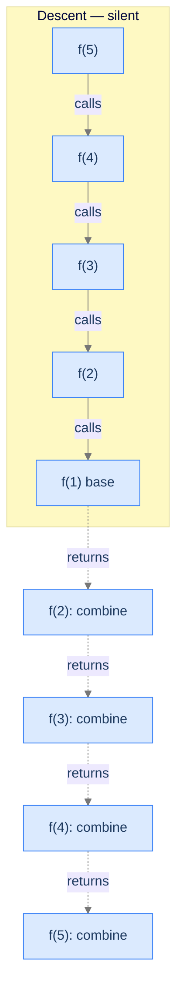
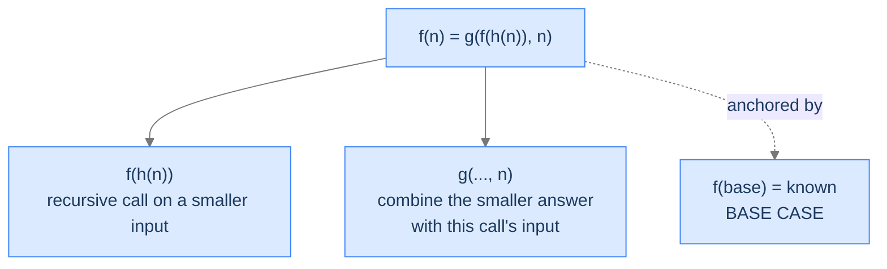
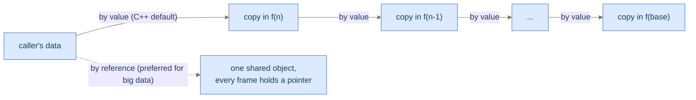
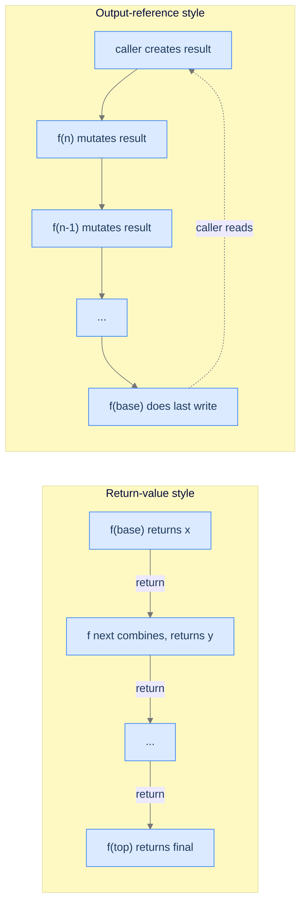

# Understanding Head Recursion

Head recursion means the recursive call sits at the *head* of the function body — right after the base-case check, before any other processing. By the time the body's "real work" starts, the recursive call has already returned with the answer to the smaller subproblem. Every step uses the smaller answer to compute its own.

This is the pattern of the queue from the Recursion lesson: the question goes all the way to the front of the line first, the answer comes back, each person adds 1 on the way out. **The descent is silent; the ascent is where the work happens.**

> 🖼 Diagram — Solid arrows are calls (descent). Dashed arrows are returns (ascent). In head recursion, every call's "real work" — the combine step — happens on the dashed arrow, after the recursive call has come back.


<p align="center"><strong>Solid arrows are calls (descent). Dashed arrows are returns (ascent). In head recursion, every call's "real work" — the combine step — happens on the dashed arrow, after the recursive call has come back.</strong></p>

---

## What Head Recursion Looks Like in Code

Strip away the problem-specific bits and every head-recursive function looks like this:

> 🖼 Diagram — The general recursive equation for head recursion: h reduces the input toward the base case; g combines the smaller answer with the current input. The base case anchors it.


<p align="center"><strong>The general recursive equation for head recursion: <code>h</code> reduces the input toward the base case; <code>g</code> combines the smaller answer with the current input. The base case anchors it.</strong></p>

In English: *the answer for `n` is some function `g` of the answer for a smaller input plus the current input itself.* The "smaller input" comes from `h(n)`, and the combining function `g` is whatever the problem demands — addition, multiplication, list-append, anything.

The pseudocode follows the equation line for line:

```
function head_recursion(n):
    if n is base case:
        return base case answer        ← step 0: stop the recursion

    smaller_input = h(n)               ← step 1: reduce toward the base case
    smaller_answer = head_recursion(smaller_input)   ← step 2: descend
    answer = g(smaller_answer, n)      ← step 3: combine on the way back up
    return answer
```

Notice the order: the **recursive call comes first**, *before* the combine step. The function is intentionally idle during the descent and does its work on the return.

> *Before reading on — predict where this function spends its time. Is the descent expensive, or the ascent? When could a 1000-deep recursion finish almost instantly?*

The descent is `n` calls of constant overhead (push a frame, check the base case, call again). The ascent is `n` evaluations of `g`. If `g` is `O(1)` — addition, comparison, append — both phases run in linear time. If `g` is expensive — concatenating arrays, deep-copying objects — the ascent dominates. *That's* the time-cost knob in head recursion. Knowing this saves you from "why is my recursive solution slower than the loop?" mysteries later.

> 🖼 Diagram — The result is built bottom-up during the unwinding. Every frame's contribution comes from g on the dashed return arrow.
```d2
direction: right

descent: "Descent (silent)" {
  d1: "f(5) called"
  d2: "f(4) called"
  d3: "f(3) called"
  d4: "f(2) called"
  d5: "f(1) — base case" {style.fill: "#fde68a"; style.stroke: "#d97706"}
}

ascent: "Ascent (the work)" {
  a1: "f(1) returns 1"
  a2: "f(2) combines: g(1, 2)" {style.fill: "#bbf7d0"; style.stroke: "#16a34a"}
  a3: "f(3) combines: g(prev, 3)" {style.fill: "#bbf7d0"; style.stroke: "#16a34a"}
  a4: "f(4) combines: g(prev, 4)" {style.fill: "#bbf7d0"; style.stroke: "#16a34a"}
  a5: "f(5) combines: g(prev, 5) — done" {style.fill: "#bbf7d0"; style.stroke: "#16a34a"}
}

descent.d5 -> ascent.a1: hand off
```

<p align="center"><strong>The result is built bottom-up during the unwinding. Every frame's contribution comes from <code>g</code> on the dashed return arrow.</strong></p>

---

## Passing Data Down

Since the recursive call is at the head of the function, **no work has been done yet** when the call is made. There are no intermediate results to forward. Whatever data the recursion needs is whatever was passed in as arguments.

In compiled languages with copy semantics (C, C++, Rust by default), passing a large container as an argument means copying it on every call — `n` calls × `m` elements = `O(n·m)` overhead before any real work happens. The fix is to pass containers **by reference** (`const std::vector<int>&` in C++, `&[i32]` in Rust, `*Slice` in Go) so the data is shared across all frames.

In high-level languages (Java, Kotlin, Scala, JavaScript, TypeScript, Python), object references are the default — every call already shares the same underlying object. There's nothing to optimise.

> 🖼 Diagram — Passing big containers by value copies the container at every call (top path). Passing by reference shares one object across all frames (bottom path).


<p align="center"><strong>Passing big containers by value copies the container at every call (top path). Passing by reference shares one object across all frames (bottom path).</strong></p>

---

## Passing Data Up

In head recursion the natural way to pass data up is the **return value**. Each frame returns its answer to its caller; the caller combines and returns onward. The chain bottoms out at the top-level call, which returns the final answer to whoever invoked it.

For low-level languages, returning a large container by copy has the same cost as passing it down by copy. Two ways to avoid it:

1. **Return by reference / move-semantics** — return a `std::vector<int>&&` or use Rust's ownership transfer so the underlying buffer isn't copied.
2. **Pass an output reference down** — the caller creates the result container, passes it as a reference argument, and the recursive function mutates it in place. Nothing is returned at all; the caller reads the final state from the container they own.

The second pattern (output-by-reference) is especially common when building lists or trees. We'll see it in the Forward Sequence problem below.

> 🖼 Diagram — Two ways to deliver the answer back. Return-value style is the default; output-reference style avoids copying large containers in low-level languages.


<p align="center"><strong>Two ways to deliver the answer back. Return-value style is the default; output-reference style avoids copying large containers in low-level languages.</strong></p>

For most introductory head-recursion problems, the data is small (a single integer, a small string), so the return-value style wins on clarity. The four worked problems below use it.

---

## Algorithm

Putting the pieces together, the generic head-recursion procedure is:

> **headRecursion(n)**
>
> 1. **Stop** — if `n` is the base case, return the known answer.
> 2. **Reduce** — compute the smaller input via `h(n)`.
> 3. **Recurse** — call `headRecursion(h(n))` and capture its result.
> 4. **Combine** — apply `g(result, n)` to fold this frame's contribution into the smaller answer.
> 5. **Return** the combined result to the caller.

Steps 1 and 5 bookend every call; steps 2-3 are the descent; step 4 is the ascent's work.

---

## Implementation

A clean, language-agnostic implementation of the generic template — `g` and `h` are placeholders the problem will fill in.


```python run
class Solution:
    def head_recursion(self, n: int) -> int:

        # Base case: If n is less than or equal to 0, we have reached
        # the end of recursion
        if n <= 0:
            return 0  # Solution for the base case

        # Use the function h to reduce the input
        # for the next step
        input_value: int = self.h(n)

        # Recursive call with the reduced input
        # at the beginning of the function
        result: int = self.head_recursion(input_value)

        # Use the function g to compute the solution
        # for this call using the result from the recursive call
        # and the input to this call
        solution: int = self.g(result, n)

        # Return the solution for the current input
        return solution

    def g(self, input_value: int, n: int) -> int:
        # Placeholder for g - use the result from recursive call
        # and the current input to compute the solution
        return input_value + n  # Example implementation

    def h(self, input_value: int) -> int:
        # Placeholder for h - get the input for the next step
        # from the current input
        return input_value - 1  # Example implementation
```

```java run
class Solution {

    public int headRecursion(int n) {

        // Base case: If n is less than or equal to 0, we have reached
        // the end of recursion
        if (n <= 0) {
            return 0; // Solution for the base case
        }

        // Use the function h to reduce the input
        // for the next step
        int input = h(n);

        // Recursive call with the reduced input
        // at the beginning of the function
        int result = headRecursion(input);

        // Use the function g to compute the solution
        // for this call using the result from the recursive call
        // and the input to this call
        int solution = g(result, n);

        // Return the solution for the current input
        return solution;
    }

    // Placeholder for g - use the result from recursive call
    // and the current input to compute the solution
    private int g(int input, int n) {
        // Implement your logic here
        return input + n; // Example implementation
    }

    // Placeholder for h - get the input for the next step
    // from the current input
    private int h(int input) {
        // Implement your logic here
        return input - 1; // Example implementation
    }
}
```


---

## Complexity Analysis

| Resource | Cost | Why |
|---|---|---|
| **Time** | `O(n)` if `g`, `h` are `O(1)` | One frame per integer down to the base case; each frame does constant work. |
| **Time (large containers)** | `O(n·m)` if data is copied per call | Each of the `n` calls copies a container of size `m`. Avoid by passing by reference. |
| **Space** | `O(n)` | The deepest moment has `n` frames simultaneously alive on the stack — see the slideshow in the Recursion lesson for the exact picture. |

The space cost is the **scaffolding tax** from the Memory Model lesson. Every frame is real bytes; recursion's clean code comes at the cost of holding every intermediate frame in memory until the unwinding starts. Linear-depth recursion on small inputs is fine; deep recursion (anywhere near the stack limit) is not. The escape valve is to convert to iteration when depth becomes a problem — same algorithm, frames moved off the stack.

> **Best Case** — Time `O(n)`, Space `O(n)`
>
> **Worst Case** — Time `O(n)`, Space `O(n)` (no input variation can change the depth)

Some head-recursive problems have non-linear (e.g. exponential) complexity even when the recursion is "single-call" — this happens when `g` itself calls the recursion or does heavy work. We'll meet that variant in the Multiple Recursion lesson (multiple recursion).

---

## Key Takeaway

Head recursion's mantra: **descend silently, ascend with work**. Recursive call first, combine after. The pattern matches any problem where you need the answer to a smaller subproblem *before* you can compute the answer for this step. Now we'll learn how to spot one of those problems on sight.

# Identifying Head Recursion

When you see a fresh problem, three diagnostic questions decide whether head recursion fits.

| # | Question | If "yes," head recursion fits because... |
|---|---|---|
| **Q1** | Does the answer for `n` depend on the answer for a *smaller* version of the same problem? | The recursive structure exists — we have something to reduce to. |
| **Q2** | Can the smaller-input answer be computed *before* this step's contribution? | The recursive call can come first; nothing in this frame needs to run before the descent. |
| **Q3** | Is there a smallest input whose answer is known directly? | The recursion has a base case — the descent terminates. |

If all three answer "yes," the problem fits head recursion's template. Each "yes" rules out a category of failure mode.

### Q1 — Why "smaller version"?

**Mental model.** Recursion only helps if the problem has *self-similar* structure: solving `n` reduces to solving something smaller. "Smaller" usually means fewer elements, a smaller integer, a substring, or a subtree. Without this property, recursing produces no progress — every call is the same problem at the same size, and the stack overflows.

**Concrete check.** For sum-of-digits: `digitSum(523)` reduces to `digitSum(52) + 3`. The sub-problem (digit-sum of 52) is structurally identical, just smaller. ✓

**What breaks otherwise.** Suppose you tried recursion for "find the maximum element in an unsorted array." If your reduction is "max(arr) = max(arr) excluding... what?" you have no way to make the input smaller without doing a linear scan first — and at that point you've already done the work. The problem doesn't reduce; recursion has no leverage.

### Q2 — Why "before this step's contribution"?

**Mental model.** Head recursion places the recursive call *first*. That requires the smaller answer to be computable before the current step does anything else. If the current step had to look at the smaller input, transform it, and only *then* recurse, head recursion wouldn't fit (you'd be in tail-recursion or accumulator territory — the Tail Recursion lesson).

**Concrete check.** For the queue-position problem: to know `pos(5)`, we need `pos(4)`. We don't need to inspect or process anything from `5` *before* the recursion; we just need the smaller answer. Once we have it, we add 1. ✓

**What breaks otherwise.** Imagine "find the running average of a stream." The current step needs the running sum so far *before* it can recurse forward. The work happens before the call — that's tail recursion (or iteration). Head recursion's `recursive call first; combine after` template doesn't fit.

### Q3 — Why "smallest input has a known answer"?

**Mental model.** Without a base case the descent never stops. The smallest input is whatever the recursive relation can't shrink further. For integers it's `0` or `1`; for strings it's the empty string; for a linked list it's `null` / the empty list.

**Concrete check.** For factorial: `fact(0) = 1` is the well-defined base case. ✓

**What breaks otherwise.** A recursive function with no base case (or with a base case unreachable for some inputs — see "predict `findPosition(0)`" in the Recursion lesson) recurses until the stack overflows. The crash is Failure Mode 1 from the Nested Functions lesson.

---

## A Worked Example — Sum of Digits

Before we tackle the four problems, a warm-up. **Given a non-negative integer, find the sum of its digits.**

> *Pause and predict the recursive relation. What's `f(n)` in terms of `f(something_smaller)`? What's the base case?*

The relation: `digitSum(n) = digitSum(n / 10) + (n % 10)`. The base case: `digitSum(0) = 0` (the empty number has no digits to sum).

Run the diagnostics:

| # | Check | Answer |
|---|---|---|
| Q1 | Smaller version? | ✓ `digitSum(n)` reduces to `digitSum(n / 10)` — one digit fewer. |
| Q2 | Smaller answer first, then combine? | ✓ We don't need to do anything with `n` until the smaller answer is in hand; then we add `n % 10`. |
| Q3 | Known answer at the smallest input? | ✓ `digitSum(0) = 0`. |

All three pass, so head recursion fits. The relation slides directly into the generic template:
- `h(n) = n / 10` (remove the last digit)
- `g(smaller, n) = smaller + (n % 10)` (add the last digit on the way back up)
- Base case: `n == 0 ⇒ 0`

We'll write the code in full as **Problem 3** below; treat it as a deliberate progression from this warm-up.

---

## Key Takeaway

Three checks — recursive structure, work-after-recursion, and a base case — gate every head-recursion problem. Pass all three and the template snaps into place. Four worked problems coming up. The first one is deliberately easy. The fourth is *not*.

<!-- ============================================== -->
<!-- SWEEP 2 — missing sections (placeholders only) -->
<!-- ============================================== -->

<!-- TODO: Understanding the Pattern — missing, needs to be written -->
<!--       Guidance: umbrella H2 with the subsections below -->

<!-- TODO: Why Naive Isn't Enough — missing, needs to be written -->
<!--       Guidance: motivation for why the obvious approach fails -->

<!-- TODO: The Core Idea — missing, needs to be written -->
<!--       Guidance: one paragraph: the central trick -->

<!-- TODO: How the Pointers/Window Move — missing, needs to be written -->
<!--       Guidance: mechanics of the moving parts -->

<!-- TODO: The Generic Algorithm — missing, needs to be written -->
<!--       Guidance: numbered steps, no code -->

<!-- TODO: Generic Implementation — missing, needs to be written -->
<!--       Guidance: Python block + Java block of the skeleton -->

<!-- TODO: Variants / Taxonomy — missing, needs to be written -->
<!--       Guidance: enumerate sub-shapes of this pattern -->

<!-- TODO: Recognition Checklist — missing, needs to be written -->
<!--       Guidance: 4-question diagnostic — the source of the Problem-section Diagnostic Questions -->

<!-- TODO: Canonical Example — missing, needs to be written -->
<!--       Guidance: fully worked example: brute force → optimised → template fit -->

<!-- TODO: Problems in This Category — missing, needs to be written -->
<!--       Guidance: table with links to the 02-problems/ files -->
