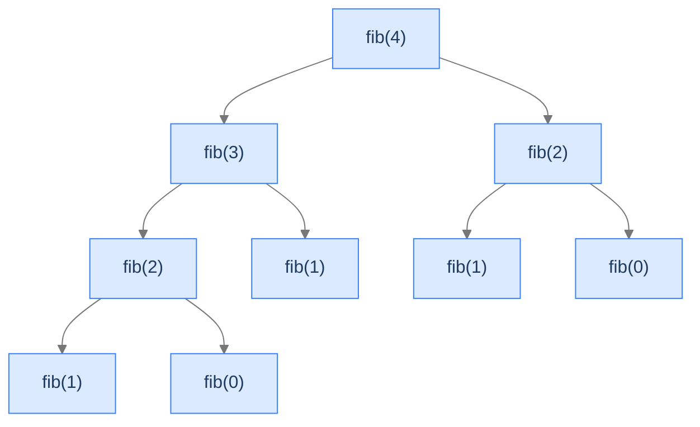
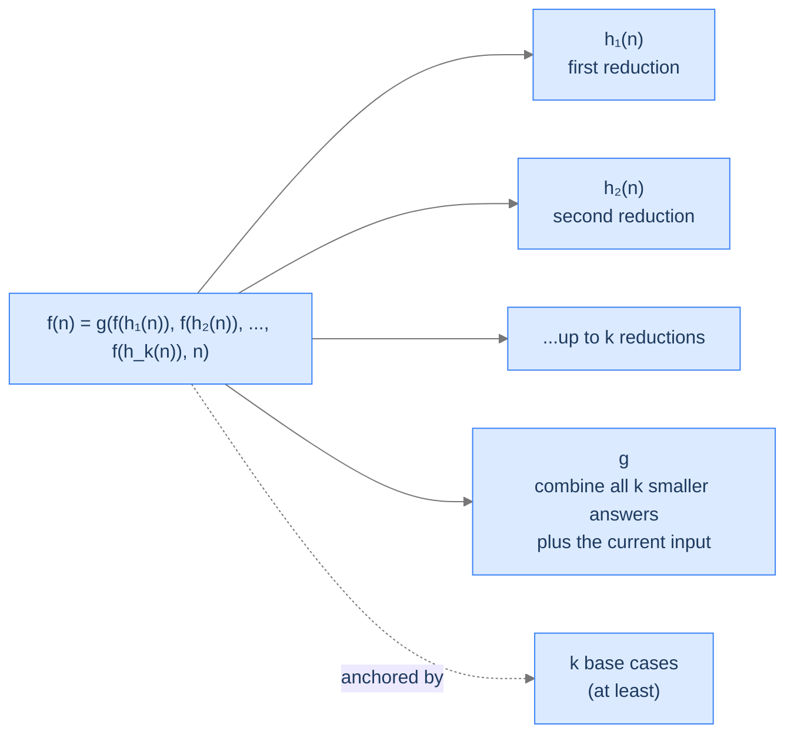
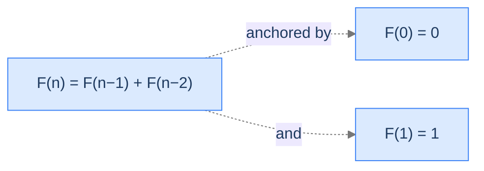
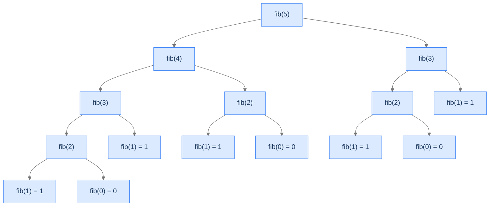
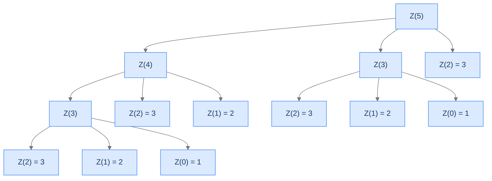
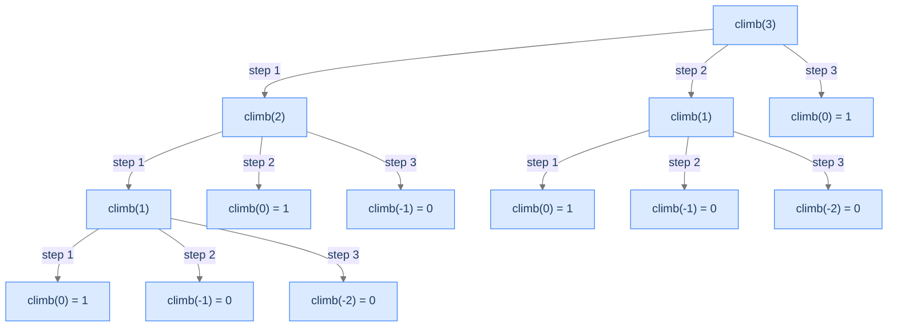
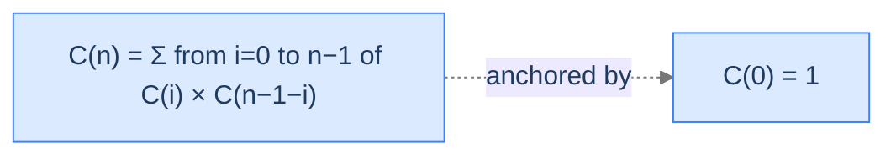
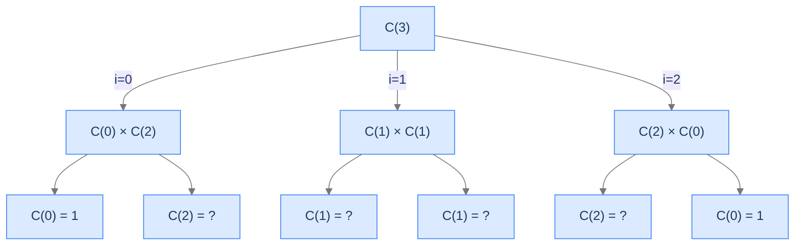

# 6. Pattern: Multiple Recursion

Until now every recursive function in this course has made *exactly one* recursive call per invocation. The call tree was a thin straight line. The depth determined the cost.

What happens if a function makes *two* recursive calls? Or three? Or `k`? The line becomes a tree. The tree branches at every level. The number of leaves explodes exponentially. And the same naive recursion that ran in `O(n)` time when it had one child suddenly runs in `O(2^n)` — exponential. **A function that fits in your head can crash on `n = 50`.**

This is multiple recursion. It's the pattern behind Fibonacci, behind branching combinatorial enumeration, behind divide-and-conquer (which we'll formalise much later in the course as a special, *bounded* version of multiple recursion). It's also the gateway drug to memoisation and dynamic programming — the next major topic in the algorithms section. By the end of this lesson you'll know how to recognise multiple recursion, why it explodes when written naively, and the four canonical worked problems that drill the pattern.

## Table of contents

1. [Understanding multiple recursion](#understanding-multiple-recursion)
2. [Identifying multiple recursion](#identifying-multiple-recursion)
3. [Fibonacci number](#fibonacci-number)
4. [Zigzag sequence](#zigzag-sequence)
5. [Climb stairs](#climb-stairs)
6. [Catalan number](#catalan-number)

***

# Understanding Multiple Recursion

A function exhibits **multiple recursion** when its body contains **two or more recursive calls**. The call tree branches at every node — instead of a thin line of frames, you get a fanned-out tree, often with a tree-shaped explosion of subproblems.

The simplest example is Fibonacci's classical recursive form:

```
fib(n) = fib(n-1) + fib(n-2)
```

That single line of arithmetic — the `+` between two recursive calls — is enough to turn linear recursion into exponential recursion. The reason: each call spawns *two* children, each of which spawns two more, and so on. After `n` levels you have `2^n` leaves.



<p align="center"><strong>Fibonacci's recursion tree for <code>fib(4)</code>. Each non-base node spawns two children. <code>fib(2)</code> appears twice — that duplication is the engine of the exponential blow-up.</strong></p>

> *Before reading on — count the function calls for `fib(6)`. Is it 6? 12? 24? More? Predict before you keep reading.*

`fib(6)` makes 25 function calls — far more than 6, and the count grows exponentially. The exact recurrence: `T(n) = T(n-1) + T(n-2) + 1`. For `n = 30`, you're at over 1.6 million calls. For `n = 50`, you're at over 20 *billion*. The same problem runs in `O(n)` if you write it iteratively or with memoisation. Multiple recursion is *correct* but *catastrophically slow* without help. We'll address the help later (memoisation in the dynamic-programming chapter); the goal here is to *see* the explosion clearly so you recognise it on sight.

---

## What Multiple Recursion Looks Like in Code

The general shape:



<p align="center"><strong>Multiple recursion: <code>k</code> recursive calls per frame. Each call has its own reduction <code>h_i</code>; the combine function <code>g</code> takes all <code>k</code> smaller answers and folds them into the answer for <code>n</code>.</strong></p>

The pseudocode follows the equation:

```
function multiple_recursion(n):
    if n is a base case:
        return base_case_answer(n)        ← potentially several base cases

    smaller_1 = multiple_recursion(h_1(n))   ← first recursive call
    smaller_2 = multiple_recursion(h_2(n))   ← second recursive call
    ...
    smaller_k = multiple_recursion(h_k(n))   ← k-th recursive call

    answer = g(smaller_1, smaller_2, ..., smaller_k, n)
    return answer
```

Notice the structural similarity to head recursion: all the recursive calls happen first, then the combine step folds them. **Multiple recursion is head recursion with `k > 1` calls.** The combine step `g` typically uses arithmetic (addition for Fibonacci, multiplication-and-sum for Catalan) or set operations (union for permutation generation).

---

## Why It Explodes — The Tree-of-Calls Lens

The key insight: every recursive call's *own* recursive calls are separate, independent subtrees. There's no caching by default. If `fib(2)` is needed twice, both subtrees compute it from scratch.

Look at the Fibonacci tree above. `fib(2)` appears in two different positions — both subtrees of `fib(3)` and `fib(4)` directly. Each of those `fib(2)` nodes does the same work (computing `fib(1) + fib(0)`). That's redundant.

In the full tree for `fib(n)`, the number of recomputed subproblems grows exponentially. By the time you're computing `fib(40)`, the tree has billions of redundant `fib(small)` evaluations.

```d2
direction: down

n: "Naive fib(n) — number of calls"

table: "Calls vs n" {
  grid-rows: 6
  grid-columns: 2
  grid-gap: 0
  h1: "n"           {style.fill: "#dbeafe"; style.stroke: "#3b82f6"}
  h2: "calls"       {style.fill: "#dbeafe"; style.stroke: "#3b82f6"}
  r1: "10"          ; v1: "177"
  r2: "20"          ; v2: "21,891"
  r3: "30"          ; v3: "2,692,537"
  r4: "40"          ; v4: "331,160,281" {style.fill: "#fde68a"; style.stroke: "#d97706"}
  r5: "50"          ; v5: "≈ 2 × 10¹⁰" {style.fill: "#fecaca"; style.stroke: "#dc2626"}
}

note: "Roughly multiplies by ~123× every +10 to n.\nMemoisation collapses this to O(n)."
```

<p align="center"><strong>Naive Fibonacci's call count for various <code>n</code>. The exponential growth is what makes <code>fib(50)</code> infeasible without memoisation.</strong></p>

The fix — caching previously computed answers (memoisation) — collapses the tree to `O(n)` unique subproblems. We don't fix it here; this lesson is about seeing the unfixed pattern. The fix is the bridge into dynamic programming.

---

## Passing Data Down

Multiple recursion typically passes the input by value (or by reference for shared containers, same as head recursion). There's no accumulator — the recursion is genuinely fanning out, and an accumulator can only carry one thread of progress at a time. Each recursive call gets the same kind of input the parent got, just smaller.

Some multiple-recursion problems do thread additional state down (e.g. when generating combinations: pass the current partial combination), but those are usually backtracking problems, which the next major topic (the Multidimensional Recursion lesson and beyond) addresses head-on.

---

## Passing Data Up

Each call returns its sub-answer to the caller. The combine step `g` reduces all `k` smaller answers into one value. For Fibonacci, `g(a, b) = a + b`. For Catalan, `g(...) = sum of products`. The combine is where the problem-specific arithmetic happens.

---

## Algorithm

> **multipleRecursion(n)**
>
> 1. **Stop** — if `n` is a base case, return its known answer.
> 2. **For each of the `k` recursive calls:**
>    - Compute the reduced input `n_i = h_i(n)`.
>    - Make the recursive call: `result_i = multipleRecursion(n_i)`.
> 3. **Combine** — apply `g(result_1, ..., result_k, n)` to fold into the answer for `n`.
> 4. **Return** the combined result.

Step 2 is what makes this multiple recursion: instead of one call, there are `k`.

---

## Implementation

A clean, language-agnostic implementation of the generic template with two recursive calls (`k = 2`).


```python run
from typing import List

class Solution:
    def multipleRecursion(self, N: int, aggregate: List[int]) -> int:

        # Base case: If N is less than or equal to 0, we have reached
        # the end of recursion
        if N <= 0:
            # Exit the function, as there are no more numbers to add
            return 0  # Solution for the base case

        # Number of recursive calls to make at each level
        # This is dependent on the problem
        k = 3

        solution = 0  # Initialize solution to a default value

        for i in range(k):
            # Compute new input based on i, N, and aggregate
            new_input = self.h(i, N, aggregate)

            # Add the current iteration's contribution to the aggregate
            self.g(i, N, aggregate)

            # Recursive call with new values
            result = self.multipleRecursion(new_input, aggregate)

            # Combine the result with the current solution
            solution = self.G(N, solution, result)

            # Restore aggregate if necessary
            self.gInverse(i, N, aggregate)

        return solution  # Return the final solution

    # Placeholder for h - use the iteration, input and aggregate
    # to compute the new input
    def h(self, iteration: int, input: int, aggregate: List[int]) -> int:
        # Implement your logic here
        return 0

    # Placeholder for g - use the iteration, input and aggregate
    # to update aggregate
    def g(self, iteration: int, input: int, aggregate: List[int]) -> None:
        # Implement your logic here
        pass

    # Placeholder for gInverse - use the iteration, input and aggregate
    # to revert the updates made by g
    def gInverse(self, iteration: int, input: int, aggregate: List[int]) -> None:
        # Implement your logic here
        pass

    # Placeholder for G - use the input, existing solution,
    # and result from the recursive call to compute the new solution
    def G(self, input: int, solution: int, result: int) -> int:
        # Implement your logic here
        return 0
```

```java run
import java.util.List;

class Solution {

    public int multipleRecursion(int N, List<Integer> aggregate) {

        // Base case: If N is less than or equal to 0, we have reached
        // the end of recursion
        if (N <= 0) {

            // Exit the function, as there are no more numbers to add
            return 0; // Solution for the base case
        }

        // Number of recursive calls to make at each level
        // This is dependent on the problem
        int k = 3;

        int solution = 0; // Initialize solution to a default value

        for (int i = 0; i < k; i++) {
            // Compute new input based on i, N, and aggregate
            int newInput = h(i, N, aggregate);

            // Add the current iteration's contribution to the aggregate
            g(i, N, aggregate);

            // Recursive call with new values
            int result = multipleRecursion(newInput, aggregate);

            // Combine the result with the current solution
            solution = G(N, solution, result);

            // Restore aggregate if necessary
            gInverse(i, N, aggregate);
        }
        return solution; // Return the final solution
    }

    // Placeholder for h - use the iteration, input and aggregate
    // to compute the new input
    private int h(int iteration, int input, List<Integer> aggregate) {
        // Implement your logic here
        return 0;
    }

    // Placeholder for g - use the iteration, input and aggregate
    // to update aggregate
    private void g(int iteration, int input, List<Integer> aggregate) {
        // Implement your logic here
    }

    // Placeholder for gInverse - use the iteration, input and aggregate
    // to revert the updates made by g
    private void gInverse(int iteration, int input, List<Integer> aggregate) {
        // Implement your logic here
    }

    // Placeholder for G - use the input, existing solution,
    // and result from the recursive call to compute the new solution
    private int G(int input, int solution, int result) {
        // Implement your logic here
        return 0;
    }
}
```


---

## Complexity Analysis

For a binary multiple recursion (`k = 2`) with `O(1)` combine and reduction:

| Resource | Cost | Why |
|---|---|---|
| **Time** | `O(2^n)` worst case (Fibonacci-shape) | Each frame spawns 2 children; tree has `≈ 2^n` leaves. |
| **Space (stack)** | `O(n)` | The deepest path is from root to leftmost leaf — depth `n`, not `2^n`. The sibling subtrees aren't in memory simultaneously. |

For a `k`-way multiple recursion (e.g. Catalan with sum over partitions, or climb-stairs with `k` step sizes):

| Resource | Cost | Why |
|---|---|---|
| **Time** | `O(k^n)` worst case | Each frame spawns `k` children. |
| **Space (stack)** | `O(n)` | Same — depth not breadth. |

The space cost is *linear* even though the time cost is exponential — this is the most counterintuitive thing about multiple recursion. The tree is huge in *width*, but at any moment only one root-to-leaf path is on the stack. Sibling subtrees are processed sequentially, not in parallel.

> **Best Case** — Time `O(2^n)`, Space `O(n)` (without memoisation)
>
> **Worst Case** — Same — input doesn't change the tree shape

With memoisation: time collapses to `O(n)` (each subproblem solved once). Space also `O(n)`. We'll see this in the dynamic programming section.

---

## Key Takeaway

Multiple recursion = head recursion with `k ≥ 2` recursive calls per frame. The call tree branches; the work explodes; the stack stays linear. Knowing this pattern is half the battle for problems like Fibonacci, partition counting, and tree-shaped enumeration. Now we'll learn how to spot one.

***

# Identifying Multiple Recursion

Three diagnostic questions decide whether a problem is a multiple-recursion candidate.

| # | Question | If "yes," multiple recursion fits because... |
|---|---|---|
| **Q1** | Does `f(n)` depend on **two or more** smaller subproblems? | The recursion tree must branch — that's the defining property. |
| **Q2** | Is the combine step `g` a fold over those smaller answers (sum, product, max, etc.)? | Multiple recursion's output is one value, not a structure. |
| **Q3** | Are there enough base cases to anchor every recursive path? | With `k > 1` recursive calls, missing a base case crashes the program in more ways. |

### Q1 — Why "two or more smaller subproblems"?

**Mental model.** Single-recursive problems (head/tail) have a thin call tree. Multiple-recursive problems are the ones whose mathematical definition genuinely *needs* multiple smaller answers to compute the larger one. Fibonacci's `F(n) = F(n-1) + F(n-2)` is the textbook two-call form. Catalan's `C(n) = sum_i C(i) * C(n-1-i)` is a `k`-call form where `k = n` (every call recurses up to `n` times).

**Concrete check.** Fibonacci needs both `F(n-1)` *and* `F(n-2)`. Knowing only one isn't enough. ✓

**What breaks otherwise.** If a problem only needs `f(n-1)`, it's head recursion (the Head Recursion lesson). Multiple recursion's machinery — `k` calls, exponential explosion, branching tree — is overkill for single-call problems.

### Q2 — Why "fold-style combine"?

**Mental model.** The combine step `g` reduces multiple sub-answers into one. Addition (Fibonacci), multiplication-and-sum (Catalan), max (game-theoretic problems), set-union (permutation-counting) — all folds. The output is *one* value per call.

**Concrete check.** Fibonacci's `g(a, b) = a + b` is the simplest fold imaginable. Climb-stairs's `g = sum over all step choices` is a `k`-ary fold. ✓

**What breaks otherwise.** If the problem requires building up a *structure* (a list of all permutations, a tree of all partitions), multiple recursion's "fold to one value" model doesn't fit cleanly. Those problems are usually backtracking — they branch like multiple recursion but build incremental partial solutions instead of folding values.

### Q3 — Why "enough base cases"?

**Mental model.** With `k > 1` recursive calls, the recursion tree has many root-to-leaf paths. Every path must terminate at a base case. Forgetting a base case for one of them is more dangerous than in head recursion because the symptoms hide in some subtrees but not others.

**Concrete check.** Fibonacci needs *two* base cases: `F(0) = 0` and `F(1) = 1`. With only `F(0)`, the call `fib(2) = fib(1) + fib(0)` would recurse on `fib(1) = fib(0) + fib(-1)` — and `fib(-1)` would never terminate. ✓

**What breaks otherwise.** Subtle bugs. Some inputs work because their tree happens to dodge the missing base case. Others crash. Drawing the recursion tree is the fastest way to verify all paths reach a base.

---

## A Worked Example — Climbing Stairs

> *Pause and predict — if you can climb 1 or 2 stairs at a time, how many distinct ways can you climb 4 stairs? List them.*

The four ways:
1. `1, 1, 1, 1`
2. `1, 1, 2`
3. `1, 2, 1`
4. `2, 1, 1`
5. `2, 2`

Five ways, not four. The recursive insight: from the bottom, your first step is either 1 or 2 stairs. After taking it, you face the same problem on a smaller staircase: `climb(n) = climb(n-1) + climb(n-2)`. The base cases: `climb(0) = 1` (one way to "stand at the top — do nothing") and `climb(n < 0) = 0` (overshot — no valid way).

That's *literally Fibonacci with shifted indices*. We'll generalise it to arbitrary step sets in **Problem 3** below.

---

## Key Takeaway

Three checks — multiple subproblems, fold-style combine, enough base cases — gate every multiple-recursion problem. Pass all three and the template snaps in (along with its exponential time blow-up). Four worked problems coming up. The first is the canonical exponential-recursion trap; the others generalise it in different directions.

***

# Fibonacci Number

The reference problem of multiple recursion. The recurrence is one line; the naive implementation crashes on `n = 50`.

---

## The Problem

Given a non-negative integer `n`, return the `n`-th Fibonacci number, where:

- `F(0) = 0`
- `F(1) = 1`
- `F(n) = F(n-1) + F(n-2)` for `n ≥ 2`

You **must** solve this recursively (we'll fix the exponential cost in the dynamic-programming chapter later).

```
Input:  n = 3
Output: 2
Explanation: F(3) = F(2) + F(1) = 1 + 1 = 2

Input:  n = 2
Output: 1

Input:  n = 0
Output: 0
```

---

<details>
<summary><h2>What Does the Fibonacci Recurrence Mean?</h2></summary>


The recurrence `F(n) = F(n-1) + F(n-2)` says: each Fibonacci number is the sum of the two preceding ones. The base cases anchor the recursion at `F(0) = 0` and `F(1) = 1` — without both, the recursion can't terminate.



<p align="center"><strong>The Fibonacci recurrence with its two base cases. Both bases are required — drop either one and the recursion runs forever for some inputs.</strong></p>

</details>
<details>
<summary><h2>Applying the Diagnostic Questions</h2></summary>


| # | Check | Answer |
|---|---|---|
| **Q1** | Multiple smaller subproblems? | **Yes** — `F(n-1)` *and* `F(n-2)`. |
| **Q2** | Fold-style combine? | **Yes** — addition. |
| **Q3** | Enough base cases? | **Yes** — `F(0) = 0` and `F(1) = 1` cover both reduction paths. |

### Q1 — Why "F(n-1) AND F(n-2)"?

The definition of Fibonacci is *literally* the sum of the two preceding terms. You can't compute `F(n)` from `F(n-1)` alone — you need both predecessors. That's the requirement that makes this multiple recursion. ✓

### Q2 — Why "addition is the combine"?

The combine `g(a, b) = a + b` is the canonical fold. Both sub-answers are integers; we add them; the result is the answer for `n`. ✓

### Q3 — Why two base cases are required?

`F(2)` calls `F(1)` and `F(0)`. If we only had `F(0) = 0`, then `F(1) = F(0) + F(-1)` and we'd recurse forever on negative inputs. **Both bases are non-negotiable.** This is why multiple recursion's diagnostic Q3 is stricter than head recursion's. ✓

</details>
<details>
<summary><h2>The Branching Tree (Visualised)</h2></summary>


The recursion tree for `fib(5)` shows the explosion in slow motion. Notice how `fib(2)` and `fib(3)` appear multiple times — that's the redundant work memoisation eliminates.



<p align="center"><strong>Recursion tree for <code>fib(5)</code>. <code>fib(3)</code> appears 2×, <code>fib(2)</code> appears 3×, <code>fib(1)</code> appears 5×, <code>fib(0)</code> appears 3×. Every duplicate is wasted work.</strong></p>

</details>
<details>
<summary><h2>Solution &amp; Analysis</h2></summary>

### The Solution

```python run
class Solution:
    def fibonacci(self, n: int) -> int:

        # Base case: If n is 0, return 0
        if n == 0:
            return 0

        # Base case: If n is 1, return 1
        if n == 1:
            return 1

        # To find the nth Fibonacci number, we recursively
        # sum the (n-1)th and (n-2)th Fibonacci numbers since Fibonacci
        # series is defined as F(n) = F(n-1) + F(n-2).
        return self.fibonacci(n - 1) + self.fibonacci(n - 2)


# Examples from the problem statement
print(Solution().fibonacci(3))   # 2
print(Solution().fibonacci(2))   # 1
print(Solution().fibonacci(0))   # 0

# Edge cases
print(Solution().fibonacci(1))   # 1
print(Solution().fibonacci(5))   # 5
print(Solution().fibonacci(7))   # 13
print(Solution().fibonacci(10))  # 55
```

```java run
public class Main {
    static class Solution {
        public int fibonacci(int N) {

            // Base case: If N is 0, return 0
            if (N == 0) {
                return 0;
            }

            // Base case: If N is 1, return 1
            if (N == 1) {
                return 1;
            }

            // To find the Nth Fibonacci number, we recursively
            // sum the (N-1)th and (N-2)th Fibonacci numbers since Fibonacci
            // series is defined as F(N) = F(N-1) + F(N-2).
            return (fibonacci(N - 1) + fibonacci(N - 2));
        }
    }

    public static void main(String[] args) {
        // Examples from the problem statement
        System.out.println(new Solution().fibonacci(3));   // 2
        System.out.println(new Solution().fibonacci(2));   // 1
        System.out.println(new Solution().fibonacci(0));   // 0

        // Edge cases
        System.out.println(new Solution().fibonacci(1));   // 1
        System.out.println(new Solution().fibonacci(5));   // 5
        System.out.println(new Solution().fibonacci(7));   // 13
        System.out.println(new Solution().fibonacci(10));  // 55
    }
}
```


<details>
<summary><strong>Trace — n = 5 (counting calls)</strong></summary>

```
fib(5) needs fib(4) and fib(3)
  fib(4) needs fib(3) and fib(2)
    fib(3) needs fib(2) and fib(1)
      fib(2) needs fib(1) and fib(0)        — first computation of fib(2)
        fib(1) = 1
        fib(0) = 0
        returns 1
      fib(1) = 1
      returns 2
    fib(2) needs fib(1) and fib(0)          — second computation of fib(2) ← redundant!
      fib(1) = 1
      fib(0) = 0
      returns 1
    returns 3
  fib(3) needs fib(2) and fib(1)            — third computation of fib(2) ← also redundant!
    fib(2) needs fib(1) and fib(0)
      ...
    fib(1) = 1
    returns 2
  returns 5

Total calls: 15 (counting fib(5), all sub-fib calls, and base case hits).
```

The phrase "redundant" is the engine of memoisation. Every duplicate sub-call is a candidate for caching.

</details>

### Complexity Analysis

| Resource | Cost | Why |
|---|---|---|
| **Time** | `O(φ^n)` ≈ `O(1.618^n)` | Each call spawns 2 children; the tree's leaf count grows by golden ratio. |
| **Space (stack)** | `O(n)` | Linear depth — the leftmost path is `n` deep. |

The exact count `T(n) = T(n-1) + T(n-2) + 1` grows at the same exponential rate as Fibonacci itself — it *is* Fibonacci, with an extra `+1`. The closed form is roughly `φ^n` where `φ = (1 + √5) / 2 ≈ 1.618`.

**With memoisation:** time collapses to `O(n)` because each `fib(k)` is computed once and reused. Space is `O(n)` for the cache plus `O(n)` for the stack.

### Edge Cases

| Case | Example | Expected | Reasoning |
|---|---|---|---|
| Zero | `n = 0` | `0` | Base case 1. |
| One | `n = 1` | `1` | Base case 2. |
| Small | `n = 5` | `5` | Tree is `fib(5)`-shaped — see trace. |
| Medium | `n = 30` | `832040` | Already millions of calls; runs in seconds. |
| Large | `n = 50` | `12586269025` | Effectively infeasible naively — billions of calls. |

</details>
<details>
<summary><h2>Final Takeaway</h2></summary>


Naive Fibonacci is the textbook trap of multiple recursion: a one-line definition that runs in exponential time. Memoisation collapses it to linear; you'll meet the technique formally in the dynamic-programming chapter. The next problem widens the recurrence — *three* recursive calls instead of two.

</details>

***

# Zigzag Sequence

A three-call recurrence with alternating signs. The combine step does subtraction *and* addition, in a fixed pattern.

---

## The Problem

Given a non-negative integer `n`, return the `n`-th number in the zigzag sequence defined by:

- `Z(0) = 1`
- `Z(1) = 2`
- `Z(2) = 3`
- `Z(n) = Z(n-1) - Z(n-2) + Z(n-3)` for `n ≥ 3`

You **must** solve this recursively.

```
Input:  n = 7
Output: 2
Explanation: Z(7) = Z(6) - Z(5) + Z(4) = 3 - 2 + 1 = 2

Input:  n = 5
Output: 2
Explanation: Z(5) = Z(4) - Z(3) + Z(2) = 1 - 2 + 3 = 2

Input:  n = 0
Output: 1
```

---

<details>
<summary><h2>What's Special About the Zigzag Recurrence?</h2></summary>


Two things:
1. The recurrence has **three** recursive calls, not two — making the call tree fan out wider than Fibonacci's.
2. The combine has alternating signs (`+`, `-`, `+`), not just additions.

The "zigzag" name comes from the sequence's alternating-direction pattern: each new term swings up and down relative to its neighbours. The recurrence's mixed signs are what produces the swings.

</details>
<details>
<summary><h2>Applying the Diagnostic Questions</h2></summary>


| # | Check | Answer |
|---|---|---|
| **Q1** | Multiple smaller subproblems? | **Yes** — three: `Z(n-1)`, `Z(n-2)`, `Z(n-3)`. |
| **Q2** | Fold-style combine? | **Yes** — `a - b + c`. |
| **Q3** | Enough base cases? | **Yes** — three bases (`Z(0), Z(1), Z(2)`) for three reduction paths. |

### Q1 — Why "three subproblems"?

The recurrence references `Z(n-1)`, `Z(n-2)`, and `Z(n-3)`. All three values are needed to compute `Z(n)`. ✓

### Q2 — Why "subtraction is still a fold"?

`a - b + c` is `(a + (-b)) + c` — a sum of three terms (some with negative sign). It's a fold over three values into one. The combine isn't purely additive but it still reduces three values to one. ✓

### Q3 — Why three base cases?

The recursion descends by 1, 2, or 3 each step. `Z(2)` calls `Z(1), Z(0), Z(-1)` if the base wasn't there for `n = 2`. We need bases for **every** recursion-depth that could be reached by the deepest call: `Z(0), Z(1), Z(2)`. Miss any one and some inputs recurse forever. ✓

</details>
<details>
<summary><h2>The Three-Branch Tree (Visualised)</h2></summary>




<p align="center"><strong>Recursion tree for <code>Z(5)</code>. Each call spawns three children. The tree fans out faster than Fibonacci's by a factor of ~1.5× per level.</strong></p>

</details>
<details>
<summary><h2>Solution &amp; Analysis</h2></summary>

### The Solution

```python run
class Solution:
    def zig_zag_sequence(self, n: int) -> int:

        # Base case: If n is 0, we return 1 as the first
        # number in the ZigZag sequence
        if n == 0:
            return 1

        # Base case: If n is 1, we return 2 as the second
        # number in the ZigZag sequence
        if n == 1:
            return 2

        # Base case: If n is 2, we return 3 as the third
        # number in the ZigZag sequence
        if n == 2:
            return 3

        # Recursive case: For n greater than 2, we calculate
        # the nth number in the ZigZag sequence using the
        # recurrence relation
        return (
            self.zig_zag_sequence(n - 1)
            - self.zig_zag_sequence(n - 2)
            + self.zig_zag_sequence(n - 3)
        )


# Examples from the problem statement
print(Solution().zig_zag_sequence(7))   # 2
print(Solution().zig_zag_sequence(5))   # 2
print(Solution().zig_zag_sequence(0))   # 1

# Edge cases
print(Solution().zig_zag_sequence(1))   # 2
print(Solution().zig_zag_sequence(2))   # 3
print(Solution().zig_zag_sequence(3))   # 2
print(Solution().zig_zag_sequence(4))   # 1
```

```java run
public class Main {
    static class Solution {
        public int zigZagSequence(int N) {

            // Base case: If N is 0, we return 1 as the first
            // number in the ZigZag sequence
            if (N == 0) {
                return 1;
            }

            // Base case: If N is 1, we return 2 as the second
            // number in the ZigZag sequence
            if (N == 1) {
                return 2;
            }

            // Base case: If N is 2, we return 3 as the third
            // number in the ZigZag sequence
            if (N == 2) {
                return 3;
            }

            // Recursive case: For N greater than 2, we calculate
            // the Nth number in the ZigZag sequence using the
            // recurrence relation
            return (
                zigZagSequence(N - 1) -
                zigZagSequence(N - 2) +
                zigZagSequence(N - 3)
            );
        }
    }

    public static void main(String[] args) {
        // Examples from the problem statement
        System.out.println(new Solution().zigZagSequence(7));   // 2
        System.out.println(new Solution().zigZagSequence(5));   // 2
        System.out.println(new Solution().zigZagSequence(0));   // 1

        // Edge cases
        System.out.println(new Solution().zigZagSequence(1));   // 2
        System.out.println(new Solution().zigZagSequence(2));   // 3
        System.out.println(new Solution().zigZagSequence(3));   // 2
        System.out.println(new Solution().zigZagSequence(4));   // 1
    }
}
```


<details>
<summary><strong>Trace — n = 5</strong></summary>

```
Z(5) = Z(4) - Z(3) + Z(2)
     = ?    -  ?   +  3

Z(4) = Z(3) - Z(2) + Z(1) = ? - 3 + 2
Z(3) = Z(2) - Z(1) + Z(0) = 3 - 2 + 1 = 2

Z(4) = 2 - 3 + 2 = 1
Z(5) = 1 - 2 + 3 = 2

Result: 2 ✓
```

</details>

### Complexity Analysis

| Resource | Cost | Why |
|---|---|---|
| **Time** | `O(3^n)` worst case | Each frame spawns 3 children. |
| **Space (stack)** | `O(n)` | Linear depth — leftmost path. |

Same exponential blow-up family as Fibonacci, just with `k = 3` instead of `k = 2`. Memoisation reduces both to `O(n)`.

### Edge Cases

| Case | Example | Expected | Reasoning |
|---|---|---|---|
| Base case 0 | `n = 0` | `1` | Direct return. |
| Base case 1 | `n = 1` | `2` | Direct return. |
| Base case 2 | `n = 2` | `3` | Direct return. |
| Negative input | `n = -1` | undefined | Should be guarded; recursion would crash if it reaches negative. |
| Mid-range | `n = 10` | computable | Tree is `3^10 = 59,049` calls — slow but tractable. |
| Large | `n = 30+` | infeasible naively | Use memoisation. |

</details>
<details>
<summary><h2>Final Takeaway</h2></summary>


Zigzag is multiple recursion with a wider branching factor than Fibonacci. The combine still folds `k` smaller answers into one, but the signs alternate. The next problem generalises this further — instead of fixed `k`, the number of recursive calls depends on the input.

</details>

***

# Climb Stairs

The branching factor varies. Each frame makes one recursive call per allowed step size — so a 5-element step set produces a 5-way recursion.

---

## The Problem

Given a non-negative integer `n` and an array `steps` (each entry less than `n`), return the number of distinct ways to climb `n` stairs using only the step sizes in `steps`. You **must** solve this recursively.

```
Input:  n = 3, steps = [1, 2, 3]
Output: 4
Explanation: ways = (1,1,1), (1,2), (2,1), (3) — four total

Input:  n = 2, steps = [2, 5, 6, 8]
Output: 1
Explanation: only (2)

Input:  n = 2, steps = [8, 3, 6, 5]
Output: 0
Explanation: no allowed step size ≤ 2
```

---

<details>
<summary><h2>Why Multiple Recursion?</h2></summary>


From the bottom of the staircase, your first move can be any of the allowed step sizes. After taking step `s`, you face the same problem on a staircase of `n - s` stairs. Sum across all choices:

```
climb(n) = climb(n - s₁) + climb(n - s₂) + ... + climb(n - s_k)
```

Each call's branching factor equals the size of `steps`. With Fibonacci-shaped `steps = [1, 2]`, the recurrence is `climb(n) = climb(n-1) + climb(n-2)` — *exactly Fibonacci*. With more steps, the tree branches wider.

</details>
<details>
<summary><h2>Applying the Diagnostic Questions</h2></summary>


| # | Check | Answer |
|---|---|---|
| **Q1** | Multiple smaller subproblems? | **Yes** — one per step size in `steps`. |
| **Q2** | Fold-style combine? | **Yes** — sum. |
| **Q3** | Enough base cases? | **Yes** — `n = 0` returns 1; `n < 0` returns 0. |

### Q1 — Why "one subproblem per step"?

Each step size produces an independent sub-staircase. To count *all* the ways, we must consider *every* step option from the current position. That's exactly what multiple recursion does. ✓

### Q2 — Why "sum"?

Different first-step choices produce disjoint sets of climbing sequences (they differ in their first step). Counting "all ways" means summing the count of each disjoint set — sum is the natural fold. ✓

### Q3 — Why two base cases (n = 0 and n < 0)?

`climb(0) = 1`: there's exactly one "way" to be at the top — do nothing. (This convention is what makes the sum work out.) `climb(n < 0) = 0`: overshot, this branch is invalid. Both are essential — without `n < 0` the recursion goes into negative numbers and never terminates.

</details>
<details>
<summary><h2>The Variable-Branching Tree (Visualised)</h2></summary>


For `n = 3, steps = [1, 2, 3]`, the recursion tree:



<p align="center"><strong>Tree for <code>climb(3, [1, 2, 3])</code>. Branching factor = 3 (one per step). Leaves are <code>climb(0) = 1</code> (valid path) or <code>climb(negative) = 0</code> (overshot path). Sum of leaves = 4 ✓.</strong></p>

</details>
<details>
<summary><h2>Solution &amp; Analysis</h2></summary>

### The Solution

```python run
from typing import List

class Solution:
    def climb_stairs(self, n: int, steps: List[int]) -> int:

        # Base case: If n is negative, there are no ways to
        # reach the ground
        if n < 0:
            return 0

        # Base case: If n is 0, there is one way to stay
        # at the ground
        if n == 0:
            return 1

        # Variable to store the total number of ways to reach
        # the ground
        total_ways = 0

        # Iterate through each possible step
        for step in steps:

            # Recursive call to climb_stairs with reduced n
            # Subtract the current step from n and add the
            # result to total_ways
            total_ways += self.climb_stairs(n - step, steps)

        # Return the total number of ways to reach the ground
        return total_ways


# Examples from the problem statement
print(Solution().climb_stairs(3, [1, 2, 3]))      # 4
print(Solution().climb_stairs(2, [2, 5, 6, 8]))   # 1
print(Solution().climb_stairs(2, [8, 3, 6, 5]))   # 0

# Edge cases
print(Solution().climb_stairs(0, [1, 2]))          # 1
print(Solution().climb_stairs(1, [1]))             # 1
print(Solution().climb_stairs(4, [1, 2]))          # 5
print(Solution().climb_stairs(5, [1, 2, 3]))       # 13
```

```java run
import java.util.*;

public class Main {
    static class Solution {
        public int climbStairs(int N, List<Integer> steps) {

            // Base case: If N is negative, there are no ways to
            // reach the ground
            if (N < 0) {
                return 0;
            }

            // Base case: If N is 0, there is one way to stay
            // at the ground
            if (N == 0) {
                return 1;
            }

            // Variable to store the total number of ways to reach
            // the ground
            int totalWays = 0;

            // Iterate through each possible step
            for (int step : steps) {

                // Recursive call to climbStairs with reduced N
                // Subtract the current step from N and add the
                // result to totalWays
                totalWays += climbStairs(N - step, steps);
            }

            // Return the total number of ways to reach the ground
            return totalWays;
        }
    }

    public static void main(String[] args) {
        // Examples from the problem statement
        System.out.println(new Solution().climbStairs(3, Arrays.asList(1, 2, 3)));      // 4
        System.out.println(new Solution().climbStairs(2, Arrays.asList(2, 5, 6, 8)));   // 1
        System.out.println(new Solution().climbStairs(2, Arrays.asList(8, 3, 6, 5)));   // 0

        // Edge cases
        System.out.println(new Solution().climbStairs(0, Arrays.asList(1, 2)));          // 1
        System.out.println(new Solution().climbStairs(1, Arrays.asList(1)));             // 1
        System.out.println(new Solution().climbStairs(4, Arrays.asList(1, 2)));          // 5
        System.out.println(new Solution().climbStairs(5, Arrays.asList(1, 2, 3)));       // 13
    }
}
```


<details>
<summary><strong>Trace — n = 3, steps = [1, 2, 3]</strong></summary>

```
climb(3) = climb(2) + climb(1) + climb(0)
  climb(2) = climb(1) + climb(0) + climb(-1)
    climb(1) = climb(0) + climb(-1) + climb(-2) = 1 + 0 + 0 = 1
    climb(0) = 1
    climb(-1) = 0
    sum = 1 + 1 + 0 = 2
  climb(1) = 1   (already shown)
  climb(0) = 1
  sum = 2 + 1 + 1 = 4

Result: 4 ✓
```

</details>

### Complexity Analysis

| Resource | Cost | Why |
|---|---|---|
| **Time** | `O(k^n)` worst case | `k = len(steps)`; each call spawns `k` children. |
| **Space (stack)** | `O(n)` | Linear depth. |

For `steps = [1, 2]` (the simplest case), this collapses to Fibonacci's `O(2^n)`.

### Edge Cases

| Case | Example | Expected | Reasoning |
|---|---|---|---|
| `n = 0` | `n = 0, steps = [...]` | `1` | One way: do nothing. |
| Empty steps | `n = 3, steps = []` | `0` | No moves; loop body never runs; total stays 0. |
| All steps too large | `n = 2, steps = [3, 4]` | `0` | All recursion arms hit `n < 0` and return 0. |
| Single step `[1]` | `n = 5, steps = [1]` | `1` | Only one way: (1,1,1,1,1). |
| Step ≥ n | `n = 3, steps = [1, 2, 3]` | `4` | Includes the (3) one-shot path. |

</details>
<details>
<summary><h2>Final Takeaway</h2></summary>


Climb-stairs is multiple recursion with input-dependent branching factor. The pattern naturally extends Fibonacci to arbitrary step sets. Memoisation makes it `O(n × k)` instead of `O(k^n)` — another preview of dynamic programming. The next problem widens the recurrence further: every call to `C(n)` spawns *n* recursive calls, and the combine multiplies pairs.

</details>

***

# Catalan Number

The hardest of the four. The branching factor is `n` itself — the recurrence sums over `i = 0..n-1` of `C(i) * C(n-1-i)`. The combine multiplies and sums.

---

## The Problem

Given a non-negative integer `n`, return the `n`-th Catalan number, where:

- `C(0) = 1`
- `C(n) = sum from i = 0 to n-1 of C(i) * C(n-1-i)` for `n ≥ 1`

You **must** solve this recursively.

```
Input:  n = 7
Output: 429
Explanation: C(7) = C(0)*C(6) + C(1)*C(5) + C(2)*C(4) + C(3)*C(3) + C(4)*C(2) + C(5)*C(1) + C(6)*C(0) = 429

Input:  n = 5
Output: 42

Input:  n = 0
Output: 1
```

---

<details>
<summary><h2>What Are Catalan Numbers?</h2></summary>


Catalan numbers count combinatorial structures: balanced parentheses, binary trees with `n` nodes, ways to triangulate a convex polygon, monotonic lattice paths. The recurrence reflects the structure of these objects: a binary tree with `n` nodes has a root, then partitions the remaining `n - 1` nodes between left and right subtrees in all possible ways. For each split `(i, n - 1 - i)`, multiply the counts and sum across all splits.



<p align="center"><strong>Catalan recurrence: each frame fans out to <code>n</code> recursive-call pairs, multiplied together and summed. Branching factor = <code>n</code> — the widest of the four problems.</strong></p>

</details>
<details>
<summary><h2>Applying the Diagnostic Questions</h2></summary>


| # | Check | Answer |
|---|---|---|
| **Q1** | Multiple smaller subproblems? | **Yes** — `2n` calls per frame: `C(0), C(n-1), C(1), C(n-2), ...`. |
| **Q2** | Fold-style combine? | **Yes** — multiply pairs, then sum the products. |
| **Q3** | Enough base cases? | **Yes** — `C(0) = 1` covers all reduction paths. |

### Q1 — Why "2n calls per frame"?

The recurrence sums `i = 0..n-1`, and each summand contains *two* recursive calls: `C(i)` and `C(n-1-i)`. So for `C(n)`, there are `n` summands × 2 calls each = `2n` recursive calls in this frame. The tree's branching factor grows linearly with `n` — vastly larger than Fibonacci's fixed branching factor of 2. ✓

### Q2 — Why "multiply-then-sum"?

Each summand is `C(i) * C(n-1-i)` — a product of two sub-answers. The full combine is sum-of-products. This double fold (multiply within a pair, sum across pairs) is the same shape as polynomial convolution, matrix multiplication, and many other structural recurrences. ✓

### Q3 — Why one base case is enough?

Every reduction in the loop produces `C(i)` for some `i` in `[0, n-1]`. By induction, every smaller subproblem eventually bottoms out at `C(0)`. The recurrence is "convolutional" — it doesn't need separate bases for `C(1), C(2), ...` because they're derived from `C(0)`. ✓

</details>
<details>
<summary><h2>The Quadratic-Branching Tree (Visualised)</h2></summary>


The tree fans out enormously. For `C(4)`, there are 4 splits, each with 2 calls = 8 children, and so on at every level.



<p align="center"><strong>Recursion tree for <code>C(3)</code>. Three splits, each with two calls. Lots of <code>C(2)</code> recomputation — the redundancy gets worse as <code>n</code> grows.</strong></p>

</details>
<details>
<summary><h2>Solution &amp; Analysis</h2></summary>

### The Solution

```python run
class Solution:
    def catalan(self, n: int) -> int:

        # Base case: The 0th Catalan number is 1
        if n == 0:
            return 1

        result = 0

        # Sum over all partitions
        for i in range(n):

            # Recursive call to calculate the Catalan numbers
            # for the left and right subtrees
            result += self.catalan(i) * self.catalan(n - 1 - i)

        # Return the Nth Catalan number
        return result


# Examples from the problem statement
print(Solution().catalan(7))   # 429
print(Solution().catalan(5))   # 42
print(Solution().catalan(0))   # 1

# Edge cases
print(Solution().catalan(1))   # 1
print(Solution().catalan(2))   # 2
print(Solution().catalan(3))   # 5
print(Solution().catalan(4))   # 14
```

```java run
public class Main {
    static class Solution {
        public int catalan(int N) {

            // Base case: The 0th Catalan number is 1
            if (N == 0) {
                return 1;
            }

            int result = 0;

            // Sum over all partitions
            for (int i = 0; i < N; i++) {

                // Recursive call to calculate the Catalan numbers
                // for the left and right subtrees
                result += catalan(i) * catalan(N - 1 - i);
            }

            // Return the Nth Catalan number
            return result;
        }
    }

    public static void main(String[] args) {
        // Examples from the problem statement
        System.out.println(new Solution().catalan(7));   // 429
        System.out.println(new Solution().catalan(5));   // 42
        System.out.println(new Solution().catalan(0));   // 1

        // Edge cases
        System.out.println(new Solution().catalan(1));   // 1
        System.out.println(new Solution().catalan(2));   // 2
        System.out.println(new Solution().catalan(3));   // 5
        System.out.println(new Solution().catalan(4));   // 14
    }
}
```


<details>
<summary><strong>Trace — n = 3</strong></summary>

```
C(3) = C(0)*C(2) + C(1)*C(1) + C(2)*C(0)
     = ?       + ?         + ?

C(0) = 1
C(1) = C(0)*C(0) = 1
C(2) = C(0)*C(1) + C(1)*C(0) = 1 + 1 = 2

C(3) = 1*2 + 1*1 + 2*1 = 2 + 1 + 2 = 5

Result: 5 ✓ (canonical Catalan value)
```

</details>

### Complexity Analysis

| Resource | Cost | Why |
|---|---|---|
| **Time** | `O(4^n / n^1.5)` (the closed form for Catalan call counts) | Effectively exponential; tree fanned out at branching factor that grows with `n`. |
| **Space (stack)** | `O(n)` | Linear depth — leftmost path. |

This is the most expensive of the four. Without memoisation, even moderate `n` (say 20) is painful. With memoisation, it collapses to `O(n²)` time and `O(n)` space.

### Edge Cases

| Case | Example | Expected | Reasoning |
|---|---|---|---|
| Base case | `n = 0` | `1` | Direct return. |
| Smallest computational | `n = 1` | `1` | One iteration: `C(0)*C(0) = 1`. |
| Mid-range | `n = 7` | `429` | Already millions of recursive calls without memoisation. |
| Large | `n = 30+` | infeasible naively | Use memoisation. |
| Overflow | `n = 33` | exceeds 64-bit | Catalan grows ~4^n; switch to big-int for large `n`. |

</details>
<details>
<summary><h2>Final Takeaway</h2></summary>


Catalan is multiple recursion at its widest: each frame spawns `2n` calls, the combine multiplies pairs and sums products, the call count grows roughly as `4^n`. It's the canonical "dynamic programming candidate" — the recurrence is mathematically elegant, the naive recursion is catastrophically slow, and memoisation collapses both observations into a textbook algorithm.

You came in with the suspicion that "two recursive calls is just twice the cost of one." You're leaving with the truth that two recursive calls is `2^n` times the cost of one — and that all four worked problems share that property. The fix (memoisation) is one of the most important ideas in algorithms and it owes its existence entirely to multiple recursion's exponential behaviour.

The next lesson lifts another constraint: what happens when the input has *more than one parameter*, and the recurrence reduces along multiple axes? Welcome to multidimensional recursion — the bridge into the 2D dynamic-programming problems that fill the rest of the algorithms section.

**Transfer challenge — try before the Multidimensional Recursion lesson:** Trace the recursion tree for `fib(8)` by hand. Count the number of times `fib(2)` is computed. Don't worry about the exact total call count; just count the duplicate `fib(2)` evaluations. The answer reveals exactly how much work memoisation would save.

<details>
<summary><strong>Answer — open after you've sketched it</strong></summary>

`fib(2)` is computed **13 times** in the call tree for `fib(8)`. The general fact: the number of times `fib(k)` is called inside `fib(n)`'s tree is `fib(n - k + 1)`. So:

- `fib(7)` called once
- `fib(6)` called 2 times
- `fib(5)` called 3 times
- `fib(4)` called 5 times
- `fib(3)` called 8 times
- `fib(2)` called 13 times
- `fib(1)` called 21 times
- `fib(0)` called 13 times

Each of those 13 evaluations of `fib(2)` does identical work — computing `fib(1) + fib(0) = 1`. **Memoisation eliminates 12 of those 13.** Multiply this saving across every duplicate sub-call and you have the algorithm we'll meet in the dynamic-programming section. **You just rediscovered why memoisation is the single most important idea for taming multiple recursion.**

</details>

</details>