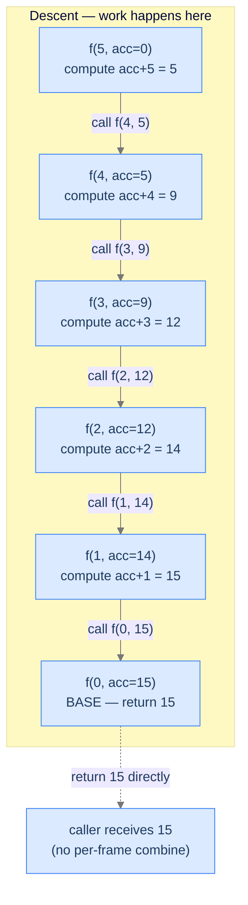
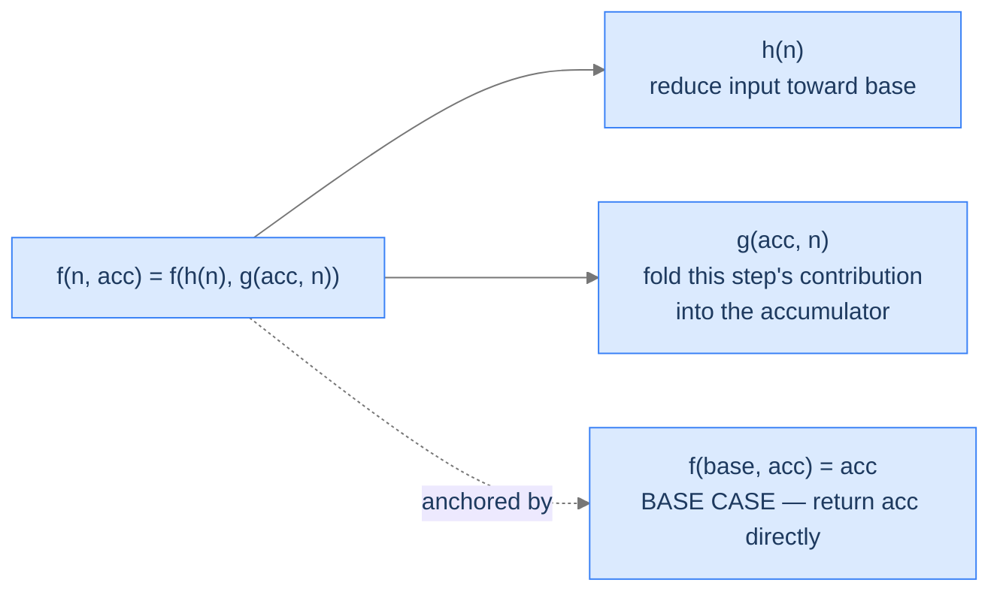

# Understanding Tail Recursion

A function call is a **tail call** if it's the *last* thing the calling function does — nothing remains to compute after it returns. A function is **tail-recursive** if its recursive call is a tail call: the function returns the result of the recursive call directly, doing no work afterwards.

Compare:

```
# Head recursion — work happens AFTER the recursive call (on ascent)
def head(n):
    if n == 0: return 0
    return n + head(n - 1)        # recursive call is INSIDE an expression;
                                  # the `n + _` runs after the call returns

# Tail recursion — work happens BEFORE the recursive call (on descent)
def tail(n, acc=0):
    if n == 0: return acc
    return tail(n - 1, acc + n)   # recursive call is the LAST action;
                                  # the `acc + n` is computed first and passed in
```

The difference looks small. The runtime impact is huge. In the head version, every frame must wait for its recursive call to return before it can run `n + _`. The frames pile up and unwind. In the tail version, the recursive call has nothing to return *to* — the current frame can be discarded the moment the call is made. With TCO, the frame is reused; without it, frames still pile up but the algorithm is *logically* a loop.

> 🖼 Diagram — Tail recursion: each frame does its work on the way down and stuffs the partial answer into the acc parameter. The base case returns the final answer; nothing happens during unwinding.


<p align="center"><strong>Tail recursion: each frame does its work on the way <em>down</em> and stuffs the partial answer into the <code>acc</code> parameter. The base case returns the final answer; nothing happens during unwinding.</strong></p>

This downward-flowing accumulator is the heart of tail recursion. The recursive call doesn't produce a value the current frame needs; the current frame produces a value the *next* recursive call needs.

---

## Tail Call Optimisation (TCO)

TCO is the compiler trick that turns tail-recursive functions into loops. Since the calling frame has nothing left to do once the tail call is made, the compiler can **reuse** the same stack frame for the recursive call instead of pushing a new one. The result: a tail-recursive function that would normally use `O(n)` stack space runs in `O(1)` stack space — same as a `while` loop.

> 🖼 Diagram — With TCO, the same frame is reused for every tail call — recursion becomes a loop without you writing one.
```d2
direction: right

without: "Without TCO" {
  grid-rows: 1
  grid-columns: 1
  grid-gap: 0
  s: "Stack: 5 frames pile up\n(O(n) space)" {style.fill: "#fecaca"; style.stroke: "#dc2626"}
}

with: "With TCO" {
  grid-rows: 1
  grid-columns: 1
  grid-gap: 0
  s: "Stack: 1 frame, reused\n(O(1) space)" {style.fill: "#bbf7d0"; style.stroke: "#16a34a"}
}

without -> with: compiler optimises tail calls
```

<p align="center"><strong>With TCO, the same frame is reused for every tail call — recursion becomes a loop without you writing one.</strong></p>

But not every language optimises tail calls. Here's the per-language reality across a range of mainstream languages:

| Language | TCO? | How |
|---|---|---|
| **Scala** | ✅ Yes | `@tailrec` annotation; the compiler verifies the call is in tail position and rewrites to a loop. |
| **Kotlin** | ✅ Yes | `tailrec` modifier on the function; same idea as Scala. |
| **C** | ⚠️ Sometimes | GCC/Clang at `-O2` or higher; not part of the language spec, so you can't rely on it. |
| **C++** | ⚠️ Sometimes | Same as C — depends on compiler and optimisation level. |
| **Rust** | ⚠️ Sometimes | LLVM may apply TCO at `--release`; no language guarantee. |
| **Go** | ❌ No | The Go authors explicitly chose not to do TCO; goroutine stacks grow on demand instead. |
| **Java** | ❌ No | The JVM has no TCO; deep tail recursion still overflows the stack. |
| **JavaScript** | ❌ No (in practice) | ES2015 specced TCO ("PTC") but only Safari implemented it; V8 explicitly rejected it. |
| **TypeScript** | ❌ No | Compiles to JS — same situation. |
| **Python** | ❌ No (and won't be) | Guido van Rossum explicitly rejected TCO; better stack traces matter more in Python's design. |

> **Practical takeaway.** In Scala and Kotlin, write tail-recursive code freely — the compiler will turn it into a loop. In C/C++/Rust, it's a nice-to-have at high optimisation levels. In **Java, Python, JavaScript, TypeScript, and Go**, tail recursion gives you the *style* of recursion-as-a-loop but **still uses linear stack space**. For very deep recursions in those languages, you should rewrite to iteration explicitly.

> *Predict before reading on — for a function that recurses 100,000 times, which languages in the table will crash with a stack overflow if you write the function tail-recursively? List them before reading the answer.*

In Java, Python, JavaScript, TypeScript, Java, and (for native compilers without explicit TCO flags) sometimes C/C++/Rust as well, you'll crash. Go's growable stacks save you. Scala (with `@tailrec`) and Kotlin (with `tailrec`) compile to loops and run in `O(1)` stack — perfectly safe. The lesson: tail recursion gives you *correctness* in any language, but *space efficiency* only in some.

---

## What Tail Recursion Looks Like in Code

The generic shape:

> 🖼 Diagram — Tail recursion's general equation: each call updates an accumulator with this step's work and recurses with a smaller input. The base case returns the accumulator unchanged.


<p align="center"><strong>Tail recursion's general equation: each call updates an accumulator with this step's work and recurses with a smaller input. The base case returns the accumulator unchanged.</strong></p>

The pseudocode:

```
function tail_recursion(n, acc):
    if n is base case:
        return acc                         ← step 0: stop and return accumulated answer

    new_acc = g(acc, n)                    ← step 1: fold this step's contribution
    next_n  = h(n)                         ← step 2: reduce the input
    return tail_recursion(next_n, new_acc) ← step 3: tail call (LAST action, nothing follows)
```

Notice the difference from head recursion:
- The combine step `g` runs **before** the recursive call (head recursion ran it after).
- The recursive call is the **last action** — no `+ result` or wrapping work follows.
- The base case returns `acc` itself — no further computation needed.

The result of the function is *complete* by the time the base case is reached. The base case just hands it back.

---

## Passing Data Down

In tail recursion, **the accumulator is the lifeblood of the algorithm.** It carries the answer-being-built down through every call. The accumulator is initialised at the top-level call (often to a sensible default like `0`, `""`, `[]`, or the input itself) and updated by `g` at every step.

A common pattern is to wrap the tail-recursive helper in a public method that hides the accumulator from the caller:

```python run
class Solution:
    def sum_to_n(self, n: int) -> int:
        return self._helper(n, 0)        # caller doesn't see the acc parameter

    def _helper(self, n: int, acc: int) -> int:
        if n == 0: return acc
        return self._helper(n - 1, acc + n)
```

The wrapper hides the accumulator's existence from the caller, who only knows about `sum_to_n(n)`. This is the canonical idiom — embrace it.

---

## Passing Data Up

Tail recursion barely passes anything *up*. Each frame returns whatever the next-deeper call returned, with no transformation. The base case's `return acc` is the only "real" return value; every other frame's `return helper(...)` is a pass-through.

That's the structural reason TCO works: there's literally nothing for the current frame to do after the recursive call returns. The frame's work is over. So why allocate the frame at all? TCO just doesn't.

---

## Algorithm

Putting it together:

> **tailRecursion(n, acc)**
>
> 1. **Stop** — if `n` is the base case, return `acc`.
> 2. **Fold** — compute `new_acc = g(acc, n)`.
> 3. **Reduce** — compute `next_n = h(n)`.
> 4. **Tail call** — return `tailRecursion(next_n, new_acc)` directly.

Steps 2 and 3 are this frame's work; step 4 is the tail call. The function never combines anything on the way back.

---

## Implementation

A clean, language-agnostic implementation of the generic template — `g` and `h` are placeholders the problem will fill in. **Pay attention to language-specific TCO annotations** where applicable.


```python run
from typing import List

class Solution:
    def tail_recursion(self, n: int, aggregate: List[int]) -> int:

        # Base case: If n is less than or equal to 0, we have reached
        # the end of recursion
        if n <= 0:
            return len(aggregate)  # Return the size of the aggregate as an example

        # Use the function h to reduce the input
        # for the next step
        input_value: int = self.h(n)

        # Use the function g to update aggregate
        # for the next step
        self.g(n, aggregate)

        # Recursive call with the reduced input
        # at the end of the function
        solution: int = self.tail_recursion(input_value, aggregate)

        # Return the solution for the current input
        return solution

    def g(self, n: int, aggregate: List[int]) -> None:
        # Placeholder for g - update the aggregate using the
        # current input on the previous aggregate
        # Implement your logic here
        if n % 2 == 0:
            aggregate.append(n)  # Example implementation

    def h(self, n: int) -> int:
        # Placeholder for h - get the input for the next step
        # from the current input
        return n - 1  # Example implementation
```

```java run
import java.util.ArrayList;

class Solution {

    public int tailRecursion(int n, ArrayList<Integer> aggregate) {

        // Base case: If n is less than or equal to 0, we have reached
        // the end of recursion
        if (n <= 0) {
            return aggregate.size(); // Return the size of the aggregate as an example
        }

        // Use the function h to reduce the input
        // for the next step
        int input = h(n);

        // Use the function g to update aggregate
        // for the next step
        g(n, aggregate);

        // Recursive call with the reduced input
        // at the end of the function
        int solution = tailRecursion(input, aggregate);

        // Return the solution for the current input
        return solution;
    }

    // Placeholder for g - update the aggregate using the
    // current input on the previous aggregate
    private void g(int n, ArrayList<Integer> aggregate) {
        // Implement your logic here
        if (n % 2 == 0) {
            aggregate.add(n); // Example implementation
        }
    }

    // Placeholder for h - get the input for the next step
    // from the current input
    private int h(int n) {
        // Implement your logic here
        return n - 1; // Example implementation
    }
}
```


---

## Complexity Analysis

| Resource | Cost (without TCO) | Cost (with TCO) | Why |
|---|---|---|---|
| **Time** | `O(n)` if `g`, `h` are `O(1)` | `O(n)` | Same total work either way. |
| **Space** | `O(n)` | `O(1)` | Without TCO, frames pile up; with TCO, one frame is reused. |

The space column tells the whole language-dependent story. Tail-recursive code in Scala or Kotlin (with the right annotation) is genuinely as efficient as a `while` loop. The same code in Java or Python uses linear stack and crashes on deep input. Identical algorithm, very different runtime profile.

> **Best Case** — Time `O(n)`, Space `O(1)` (with TCO) or `O(n)` (without)
>
> **Worst Case** — Same as best; no input variation changes the depth

---

## Key Takeaway

Tail recursion does its work on the descent and accumulates the answer in a parameter. The base case returns that accumulator unchanged. With TCO it's a loop in disguise; without TCO it's structurally a loop but pays for each iteration in stack space. Now we'll learn how to spot tail-recursion candidates without writing any code.

# Identifying Tail Recursion

Three diagnostic questions decide whether tail recursion fits.

| # | Question | If "yes," tail recursion fits because... |
|---|---|---|
| **Q1** | Can the answer be built up *as we descend*, with no need to look back? | The accumulator can carry the running answer down without revisiting frames. |
| **Q2** | Can each step's contribution be folded into a single value (the accumulator)? | We don't need to wait for the smaller answer; we update the accumulator and recurse. |
| **Q3** | Is the recursive call the *very last* thing the function does? | The call is in tail position — no work follows it, so TCO is even possible. |

If all three are "yes," the problem fits tail recursion's template.

### Q1 — Why "build down, no look-back"?

**Mental model.** Tail recursion never revisits a frame. Once we descend, we're committed — the frame is conceptually gone (with TCO, literally gone). The answer must be representable as a single value being mutated as we go.

**Concrete check.** For `sum(1..n)`: build down with `acc + n`, going `5 → 4 → 3 → 2 → 1 → 0` with running sums `5 → 9 → 12 → 14 → 15 → 15`. We never need to revisit any frame. ✓

**What breaks otherwise.** Consider Fibonacci's classical form `fib(n) = fib(n-1) + fib(n-2)`. The result for `n` requires *two* smaller answers, and the second `+` happens after both calls return. There's no single accumulator that can capture this on the descent — fib needs head/multiple recursion (the Multiple Recursion lesson), not tail.

### Q2 — Why "fold into a single accumulator"?

**Mental model.** The accumulator is the *only* state the recursion carries. If the answer needs two or more parameters that interact, you need that many accumulator parameters. If the answer is fundamentally a *tree* (like a sorted output of an unsorted set), an accumulator can't hold the structure cleanly.

**Concrete check.** For `is_palindrome(arr)` we don't even need an accumulator value — the answer is "as long as no mismatch found, keep going." That's a degenerate accumulator (the answer is implicit in the *absence* of an early return). Tail recursion still fits. ✓

**What breaks otherwise.** Building a sorted permutation of an array's elements? An accumulator would need to be a partial tree of decisions; we'd actually need branching recursion (the Multiple Recursion lesson) or backtracking. Tail recursion's single-thread-of-progress model can't handle branching.

### Q3 — Why "recursive call is the very last action"?

**Mental model.** The call is in tail position only if **the function returns the result of that call directly, without any wrapping work**. `return helper(...)` ✓. `return helper(...) + 1` ✗ (the `+ 1` is wrapping work). `return helper(...) * helper(...)` ✗ (the multiplication wraps two calls).

**Concrete check.** Linear search for an element: `if arr[i] == target return i; return search(arr, target, i+1)`. The recursive call is wrapped by nothing — pure tail call. ✓

**What breaks otherwise.** `return n * factorial(n-1)` — the multiplication runs *after* the recursive call returns. That's head recursion, not tail. The frame can't be discarded because it has work to do on the ascent. TCO won't apply.

---

## A Worked Example — Reverse a Sequence

> *Pause and predict — to print numbers from 5 down to 1, would you want head recursion or tail recursion? Why?*

Tail recursion fits naturally: each step prints `n` first, then recurses on `n-1`. The work (the print) happens on the descent, before the recursive call. Head recursion could also work, but it would print the values during *unwinding*, which means the printing order would be `1, 2, 3, 4, 5` — not `5, 4, 3, 2, 1`. Tail wins for descending order; head wins for ascending. **The order of operations is the order of the recursion's direction.**

We make this concrete in **Problem 1** below.

---

## Key Takeaway

Three checks — descent-only progress, single-accumulator answer, recursive call in tail position — gate every tail-recursion problem. Pass all three and the template snaps in. Four worked problems coming up. The first one mirrors Forward Sequence from the Head Recursion lesson but reverses the *direction* of work — same template, opposite ordering.

<!-- ============================================== -->
<!-- SWEEP 2 — missing sections (placeholders only) -->
<!-- ============================================== -->

<!-- TODO: Understanding the Pattern — missing, needs to be written -->
<!--       Guidance: umbrella H2 with the subsections below -->

<!-- TODO: Why Naive Isn't Enough — missing, needs to be written -->
<!--       Guidance: motivation for why the obvious approach fails -->

<!-- TODO: The Core Idea — missing, needs to be written -->
<!--       Guidance: one paragraph: the central trick -->

<!-- TODO: How the Pointers/Window Move — missing, needs to be written -->
<!--       Guidance: mechanics of the moving parts -->

<!-- TODO: The Generic Algorithm — missing, needs to be written -->
<!--       Guidance: numbered steps, no code -->

<!-- TODO: Generic Implementation — missing, needs to be written -->
<!--       Guidance: Python block + Java block of the skeleton -->

<!-- TODO: Variants / Taxonomy — missing, needs to be written -->
<!--       Guidance: enumerate sub-shapes of this pattern -->

<!-- TODO: Recognition Checklist — missing, needs to be written -->
<!--       Guidance: 4-question diagnostic — the source of the Problem-section Diagnostic Questions -->

<!-- TODO: Canonical Example — missing, needs to be written -->
<!--       Guidance: fully worked example: brute force → optimised → template fit -->

<!-- TODO: Problems in This Category — missing, needs to be written -->
<!--       Guidance: table with links to the 02-problems/ files -->
