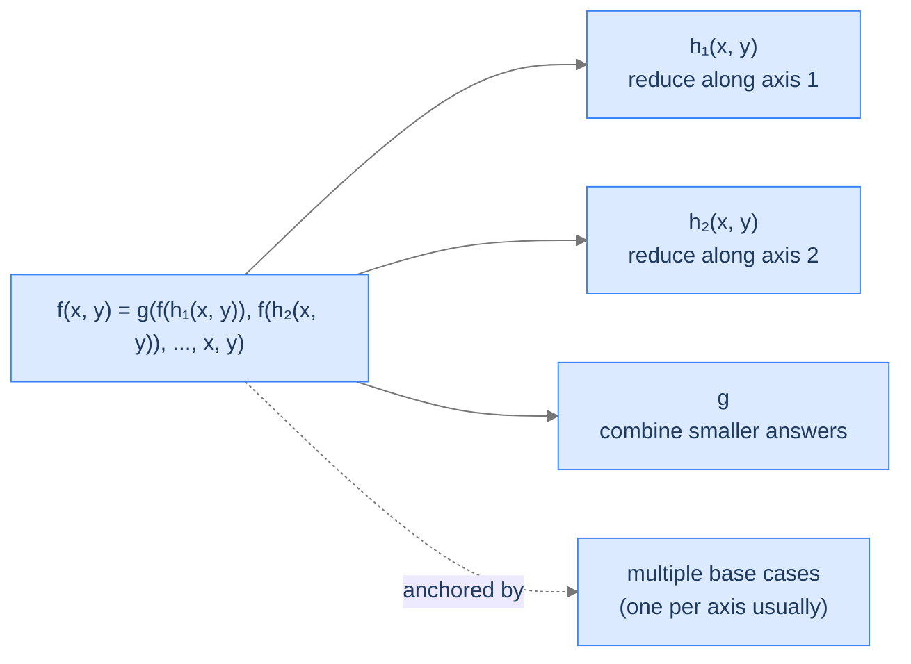
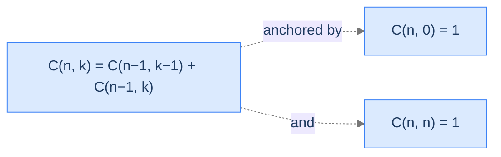
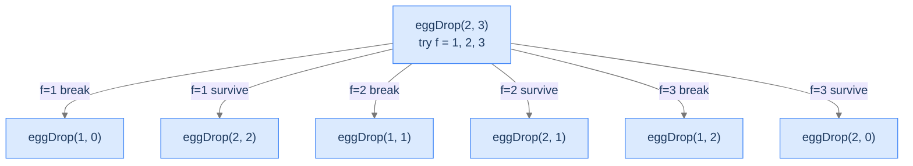

# 7. Pattern: Multidimensional Recursion

The recursion patterns so far have one input parameter — `n`, an integer or list-length that shrinks toward the base case along a single axis. Most real algorithmic problems aren't that tidy. They have *two or more* parameters, and the recurrence reduces along *multiple axes* at once.

Computing the binomial coefficient `C(n, k)`. Counting paths through a 2D grid. Comparing two strings. Editing one sequence into another. Dropping eggs from a building with `e` eggs and `f` floors. All of these have a recursive relation that reduces along *more than one* dimension. The subproblem space isn't a line; it's a grid.

This is multidimensional recursion. It's the bridge into 2D dynamic programming — the engine behind edit distance, longest common subsequence, knapsack, and the entire DP chapter that comes later in the algorithms section. By the end of this lesson you'll know how to recognise a multidimensional recurrence, how to identify all the base cases (more than one — and getting them wrong is the most common bug), and four worked problems that anchor the pattern.

## Table of contents

1. [Understanding multidimensional recursion](#understanding-multidimensional-recursion)
2. [Identifying multidimensional recursion](#identifying-multidimensional-recursion)
3. [Binomial coefficient](#binomial-coefficient)
4. [Lattice paths](#lattice-paths)
5. [Ackermann function](#ackermann-function)
6. [Egg dropping](#egg-dropping)

***

# Understanding Multidimensional Recursion

A recursion is **multidimensional** when its input is described by **two or more parameters**, each of which can be reduced independently. The recursive call doesn't just shrink one number — it might shrink one parameter, the other parameter, or both at once.

The simplest example is the binomial coefficient `C(n, k)`:

```
C(n, k) = C(n-1, k-1) + C(n-1, k)
```

Two recursive calls. Both reduce `n` by 1; one of them also reduces `k` by 1. The state being navigated is the pair `(n, k)` — a *2D state space*, not a 1D list of integers.

```d2
direction: down

table: "Subproblem space for C(n, k)" {
  grid-rows: 5
  grid-columns: 5
  grid-gap: 0
  h0:  ""        ; h1:  "k=0"  ; h2:  "k=1"  ; h3:  "k=2"  ; h4:  "k=3"
  r0n: "n=0"     ; c00: "1"    ; c01: "—"    ; c02: "—"    ; c03: "—"
  r1n: "n=1"     ; c10: "1"    ; c11: "1"    ; c12: "—"    ; c13: "—"
  r2n: "n=2"     ; c20: "1"    ; c21: "2"    ; c22: "1"    ; c23: "—"
  r3n: "n=3"     ; c30: "1"    ; c31: "3"    ; c32: "3"    ; c33: "1"
}
```

<p align="center"><strong>The 2D subproblem space for binomial coefficient. Each cell <code>C(n, k)</code> depends on two cells in the row above: <code>C(n-1, k-1)</code> and <code>C(n-1, k)</code>. The recursion navigates this grid, not a line.</strong></p>

The state is no longer "the integer `n`." It's the pair `(n, k)`. When we ask *how many distinct subproblems can the recursion visit?*, the answer is *the number of cells in the grid*, not *the depth of the recursion*. That distinction is what makes multidimensional recursion the natural launchpad for dynamic programming.

---

## What Multidimensional Recursion Looks Like in Code

The general shape:



<p align="center"><strong>Multidimensional recursion's general shape. <code>h_i</code> reduces along different axes; the combine <code>g</code> folds the smaller-state answers into the answer for <code>(x, y)</code>.</strong></p>

Pseudocode:

```
function multi_recursion(x, y):
    if (x, y) is a base case:
        return base_answer(x, y)        ← potentially several base cases
                                          covering different axis edges

    smaller_1 = multi_recursion(h_1(x, y))   ← reduce along axis 1 (or both)
    smaller_2 = multi_recursion(h_2(x, y))   ← reduce along axis 2 (or both)
    ...

    answer = g(smaller_1, smaller_2, ..., x, y)
    return answer
```

The structural similarity to multiple recursion (the Multiple Recursion lesson) is real — both make multiple recursive calls and combine. The crucial difference: in multiple recursion, the calls all navigate a 1D state space. In multidimensional recursion, the calls navigate a 2D (or higher) grid. **Same fan-out, different geometry.**

---

## Identifying Base Cases

This is the trickiest part of multidimensional recursion. The base cases live on the *boundaries* of the state space. For a 2D grid, that's typically:

- The "left edge" (one axis at its smallest value)
- The "top edge" (the other axis at its smallest value)
- Possibly the diagonal or other geometric features

Miss any one boundary and some recursion paths will run forever.

```d2
direction: down

table: "Base cases live on the grid's boundary" {
  grid-rows: 5
  grid-columns: 5
  grid-gap: 0
  h0:  ""        ; h1:  "k=0"  ; h2:  "k=1"  ; h3:  "k=2"  ; h4:  "k=3"
  r0n: "n=0"     ; c00: "BASE" {style.fill: "#fde68a"; style.stroke: "#d97706"} ; c01: "•"  ; c02: "•"  ; c03: "•"
  r1n: "n=1"     ; c10: "BASE" {style.fill: "#fde68a"; style.stroke: "#d97706"} ; c11: "BASE" {style.fill: "#fde68a"; style.stroke: "#d97706"} ; c12: "•"  ; c13: "•"
  r2n: "n=2"     ; c20: "BASE" {style.fill: "#fde68a"; style.stroke: "#d97706"} ; c21: "•"  ; c22: "BASE" {style.fill: "#fde68a"; style.stroke: "#d97706"} ; c23: "•"
  r3n: "n=3"     ; c30: "BASE" {style.fill: "#fde68a"; style.stroke: "#d97706"} ; c31: "•"  ; c32: "•"  ; c33: "BASE" {style.fill: "#fde68a"; style.stroke: "#d97706"}
}
```

<p align="center"><strong>For binomial coefficient, base cases live on two boundaries: the left edge (<code>k = 0</code>) and the diagonal (<code>k = n</code>). Together they catch every reduction path.</strong></p>

> *Before reading on — for `C(5, 2)`, draw the grid above and trace which cells the recursion visits. Which base case does each leaf hit?*

`C(5, 2)` recurses into `C(4, 1)` and `C(4, 2)`. `C(4, 1)` recurses into `C(3, 0)` (left-edge base, returns 1) and `C(3, 1)`. The recursion fans out, every leaf landing on either the left edge (`k = 0`) or the diagonal (`k = n`). Without **both** boundary cases, some leaves wouldn't terminate. The most common bug in multidimensional recursion is forgetting one boundary — the program runs fine for some inputs and crashes on others.

---

## Passing Data Down

Both axes of state must be passed in every recursive call. The data flow is otherwise the same as multiple recursion: by-value (or by-reference for shared containers) for the input parameters, return value for the answer.

The state often grows as the input grows. For binomial coefficient, both `n` and `k` are scalar integers — passing by value is trivial. For lattice paths, `(rows, cols)` is also a pair of integers. For edit distance (later in the DP chapter), the state is `(i, j)` with two strings — and passing the strings by value would be wasteful, so we pass them by reference and move the pair of indices instead.

---

## Passing Data Up

Each recursive call returns its answer; the combine step folds them. Same as multiple recursion. Multidimensional recursion's *output* is one value; only its *input* is multidimensional.

---

## Algorithm

> **multidimensionalRecursion(x, y)**
>
> 1. **Stop** — if `(x, y)` is on a base-case boundary, return the known answer for that boundary.
> 2. **For each axis-reduction:**
>    - Compute the reduced state `(x_i, y_i) = h_i(x, y)`.
>    - Make the recursive call `result_i = multi_recursion(x_i, y_i)`.
> 3. **Combine** — `g(result_1, result_2, ..., x, y)`.
> 4. **Return** the combined result.

The crucial difference from multiple recursion is step 1's *boundary* check (multiple base cases on different axis edges) and step 2's *axis-aware* reductions.

---

## Implementation

A clean, language-agnostic implementation of the generic 2D template.


```pseudocode
function multiRecursion(x, y):
    if x = 0: return 1                     # left-edge base
    if y = 0: return 1                     # top-edge base
    smaller1 ← multiRecursion(x − 1, y)    # reduce along x-axis
    smaller2 ← multiRecursion(x, y − 1)    # reduce along y-axis
    return smaller1 + smaller2             # combine
```

```python run
class Solution:
    def multi_recursion(self, x: int, y: int) -> int:
        # Multiple base cases on different boundaries
        if x == 0:
            return 1                       # Left-edge base
        if y == 0:
            return 1                       # Top-edge base

        # Two recursive calls reducing along different axes
        smaller_1 = self.multi_recursion(x - 1, y)        # Reduce x
        smaller_2 = self.multi_recursion(x, y - 1)        # Reduce y

        # Combine — example: addition
        return smaller_1 + smaller_2


if __name__ == "__main__":
    print(Solution().multi_recursion(3, 3))   # Lattice-paths shape → 20
```

```java run
public class Solution {
    public int multiRecursion(int x, int y) {
        if (x == 0) return 1;          // Left-edge base
        if (y == 0) return 1;          // Top-edge base
        return multiRecursion(x - 1, y) + multiRecursion(x, y - 1);
    }

    public static void main(String[] args) {
        System.out.println(new Solution().multiRecursion(3, 3));   // 20
    }
}
```

```c run
#include <stdio.h>

int multi_recursion(int x, int y) {
    if (x == 0) return 1;
    if (y == 0) return 1;
    return multi_recursion(x - 1, y) + multi_recursion(x, y - 1);
}

int main(void) {
    printf("%d\n", multi_recursion(3, 3));   /* 20 */
    return 0;
}
```

```scala run
class Solution {
  def multiRecursion(x: Int, y: Int): Int = {
    if (x == 0) return 1
    if (y == 0) return 1
    multiRecursion(x - 1, y) + multiRecursion(x, y - 1)
  }
}

object Main {
  def main(args: Array[String]): Unit = {
    println(new Solution().multiRecursion(3, 3))   // 20
  }
}
```


---

## Complexity Analysis

For a 2D recursion with two recursive calls per frame:

| Resource | Cost (without memoisation) | Cost (with memoisation) | Why |
|---|---|---|---|
| **Time** | `O(2^(x + y))` | `O(x · y)` | Without memo, each frame branches twice; tree has `~2^(x+y)` leaves. With memo, each `(x, y)` cell is computed once. |
| **Space (stack)** | `O(x + y)` | `O(x + y)` | Deepest path reduces `x` and `y` to 0, total depth `x + y`. |
| **Space (memo)** | n/a | `O(x · y)` | Cache holds one entry per cell. |

Memoisation collapses time from exponential to polynomial — a massive win. This is exactly the leverage that makes 2D dynamic programming powerful: the state space is `O(x · y)` cells, and each cell is computed in `O(1)` work, giving `O(x · y)` total. Without the cache, you re-derive the same cell exponentially many times.

> **Best Case (without memo)** — Time `O(2^(x+y))`, Space `O(x + y)`
>
> **Worst Case (without memo)** — Same — input doesn't change tree shape

---

## Key Takeaway

Multidimensional recursion = multiple recursion with a multi-axis state space. Each axis can be reduced independently; base cases live on the grid's boundaries; the subproblem space is a grid, not a line. This is the structural setup that makes 2D dynamic programming work. Now we'll learn how to spot a multidimensional candidate.

***

# Identifying Multidimensional Recursion

Three diagnostic questions:

| # | Question | If "yes," multidimensional recursion fits because... |
|---|---|---|
| **Q1** | Does the input have **two or more parameters** that can each shrink? | The state is genuinely multidimensional, not a 1D parameter pair. |
| **Q2** | Does the recurrence reduce along **different axes** in different recursive calls? | The recursion is navigating a grid, not just a line. |
| **Q3** | Are there base cases on **multiple boundaries** of the state space? | Single-edge base cases miss reduction paths. |

### Q1 — Why "two or more shrinkable parameters"?

**Mental model.** "Shrinkable" means the recurrence reduces the parameter toward a base case. If the second parameter is a constant or a passed-through reference (like an unchanging array), the recursion is still effectively 1D — only one parameter is doing real work.

**Concrete check.** Binomial coefficient: both `n` and `k` reduce. `C(5, 3)` calls `C(4, 2)` (reducing both) and `C(4, 3)` (reducing only `n`). Both parameters genuinely shrink at some point. ✓

**What breaks otherwise.** A function `walk_array(arr, i)` that walks an array recursively isn't multidimensional — only `i` shrinks; `arr` is a passed-through reference. That's still 1D recursion (head-recursive in this case).

### Q2 — Why "different reductions in different calls"?

**Mental model.** If every recursive call reduces `(x, y)` to `(x-1, y-1)` — both axes always reduced together — the effective state is one-dimensional (`x = y` at every step, so just one parameter is doing work). For genuinely multidimensional recursion, at least *some* of the calls must reduce only one axis at a time, exploring different paths through the grid.

**Concrete check.** Lattice paths: `paths(r, c) = paths(r-1, c) + paths(r, c-1)`. The first call reduces only `r`; the second reduces only `c`. The grid is genuinely explored two-dimensionally. ✓

**What breaks otherwise.** A function `f(a, b)` that always recurses to `f(a-1, b-1)` is just `f(min(a, b))` in disguise — collapsible to 1D. The multidimensional structure is illusory.

### Q3 — Why "base cases on multiple boundaries"?

**Mental model.** Each axis can independently reach its smallest value. Each "edge" of the grid is a separate base-case boundary. Forget any one and recursion paths that travel along that edge will run forever.

**Concrete check.** Lattice paths: `paths(0, c) = 1` (one row, one path: all-right) and `paths(r, 0) = 1` (one column, one path: all-down). Both boundaries are essential — drop the `r = 0` base and `paths(0, 5)` recurses to `paths(-1, 5)` and never terminates. ✓

**What breaks otherwise.** Subtle bugs that depend on input. Some reduction paths catch the surviving base; others don't.

---

## A Worked Example — Lattice Paths

> *Pause and predict — for a 2×2 grid, how many distinct paths from top-left to bottom-right exist if you can only move right or down? List them.*

The 6 paths in a 2×2 grid (with corners labelled):
1. RRDD (right, right, down, down)
2. RDRD
3. RDDR
4. DRRD
5. DRDR
6. DDRR

Six paths, not four. The recursive insight: the first move is either *right* (subproblem: paths through a (rows, cols-1) grid) or *down* (subproblem: paths through a (rows-1, cols) grid). Sum the two.

`paths(rows, cols) = paths(rows-1, cols) + paths(rows, cols-1)`. Bases: `paths(0, c) = 1` and `paths(r, 0) = 1` (a row or column of cells has exactly one all-rightward or all-downward path).

We make this concrete in **Problem 2** below.

---

## Key Takeaway

Three checks — multiple shrinkable parameters, axis-aware reductions, and base cases on every boundary — gate every multidimensional-recursion problem. Pass all three and you're navigating a grid. Four worked problems coming up. The first sets up Pascal's triangle; the last is the famous "this is why DP exists" problem.

***

# Binomial Coefficient

Pascal's triangle, recursion-style. The recurrence `C(n, k) = C(n-1, k-1) + C(n-1, k)` is one of the cleanest 2D recurrences in mathematics.

---

## The Problem

Given non-negative integers `n` and `k` with `0 ≤ k ≤ n`, return the binomial coefficient `C(n, k)` — the number of ways to choose `k` elements from a set of `n`.

```
Input:  n = 5, k = 3
Output: 10
Explanation: C(5, 3) = 5! / (3! × 2!) = 10

Input:  n = 10, k = 4
Output: 210

Input:  n = 0, k = 0
Output: 1
```

---

## What Does the Recurrence Mean?

Pick any one element of the set of `n`. Either you include it in your subset of `k`, or you don't:
- **Include it.** You now need `k - 1` more elements from the remaining `n - 1`. That's `C(n-1, k-1)`.
- **Exclude it.** You still need `k` elements from the remaining `n - 1`. That's `C(n-1, k)`.

These two cases are disjoint and cover every subset, so:

```
C(n, k) = C(n-1, k-1) + C(n-1, k)
```

The base cases:
- `C(n, 0) = 1` — exactly one way to choose 0 elements (the empty subset).
- `C(n, n) = 1` — exactly one way to choose all `n` elements.



<p align="center"><strong>Pascal's triangle's recurrence with both boundary base cases. Drop either boundary and some inputs run forever.</strong></p>

---

## Applying the Diagnostic Questions

| # | Check | Answer |
|---|---|---|
| **Q1** | Two shrinkable parameters? | **Yes** — `n` and `k` both shrink. |
| **Q2** | Axis-aware reductions? | **Yes** — first call reduces both, second reduces only `n`. |
| **Q3** | Base cases on multiple boundaries? | **Yes** — left edge `k = 0` and diagonal `k = n`. |

### Q1 — Why "n and k both shrink"?

The recurrence `C(n, k) = C(n-1, k-1) + C(n-1, k)` reduces `n` by 1 in both calls and reduces `k` by 1 in the first call. Both parameters move toward their respective boundaries. ✓

### Q2 — Why "axis-aware"?

The first recursive call reduces both `n` and `k` (descending the diagonal). The second reduces only `n` (descending vertically). The recursion explores the grid two-dimensionally. ✓

### Q3 — Why two boundary base cases?

`C(n, 0) = 1` catches the left edge. `C(n, n) = 1` catches the diagonal. Together they cover every reduction path: any descent eventually hits either the left edge (when `k` reaches 0) or the diagonal (when `k = n`). Drop either and some calls recurse into negative `k` and never terminate. ✓

---

## The 2D State Space (Visualised)

The recursion descends the grid one row at a time, reducing `n` per call. The two children of `C(n, k)` are the cell directly above (`C(n-1, k)`) and the cell diagonally above-left (`C(n-1, k-1)`).

```d2
direction: down

table: "C(n, k) recursion grid (Pascal's triangle)" {
  grid-rows: 5
  grid-columns: 5
  grid-gap: 0
  h0:  ""        ; h1:  "k=0"  ; h2:  "k=1"  ; h3:  "k=2"  ; h4:  "k=3"
  r0n: "n=0"     ; c00: "1" {style.fill: "#fde68a"; style.stroke: "#d97706"}; c01: "—"; c02: "—"; c03: "—"
  r1n: "n=1"     ; c10: "1" {style.fill: "#fde68a"; style.stroke: "#d97706"}; c11: "1" {style.fill: "#fde68a"; style.stroke: "#d97706"}; c12: "—"; c13: "—"
  r2n: "n=2"     ; c20: "1" {style.fill: "#fde68a"; style.stroke: "#d97706"}; c21: "2"; c22: "1" {style.fill: "#fde68a"; style.stroke: "#d97706"}; c23: "—"
  r3n: "n=3"     ; c30: "1" {style.fill: "#fde68a"; style.stroke: "#d97706"}; c31: "3"; c32: "3"; c33: "1" {style.fill: "#fde68a"; style.stroke: "#d97706"}
}
```

<p align="center"><strong>The 2D state space for binomial coefficient. Yellow = base cases on the boundaries. Each interior cell is the sum of the cell directly above and diagonally above-left.</strong></p>

---

## The Solution


```pseudocode
function binomialCoefficient(n, k):
    if n = k OR k = 0:                                            # boundary bases
        return 1
    return binomialCoefficient(n − 1, k − 1) + binomialCoefficient(n − 1, k)   # Pascal's identity
```

```python run
class Solution:
    def binomial_coefficient(self, n: int, k: int) -> int:
        # Boundary base cases — both required
        if n == k or k == 0:
            return 1
        # Two recursive calls reducing along different axes
        return (self.binomial_coefficient(n - 1, k - 1)
                + self.binomial_coefficient(n - 1, k))


if __name__ == "__main__":
    print(Solution().binomial_coefficient(5, 3))   # 10
    print(Solution().binomial_coefficient(10, 4))  # 210
```

```java run
public class Solution {
    public int binomialCoefficient(int n, int k) {
        if (n == k || k == 0) return 1;
        return binomialCoefficient(n - 1, k - 1) + binomialCoefficient(n - 1, k);
    }

    public static void main(String[] args) {
        System.out.println(new Solution().binomialCoefficient(5, 3));   // 10
    }
}
```

```c run
#include <stdio.h>

int binomial_coefficient(int n, int k) {
    if (n == k || k == 0) return 1;
    return binomial_coefficient(n - 1, k - 1) + binomial_coefficient(n - 1, k);
}

int main(void) {
    printf("%d\n", binomial_coefficient(5, 3));   /* 10 */
    return 0;
}
```

```scala run
class Solution {
  def binomialCoefficient(n: Int, k: Int): Int = {
    if (n == k || k == 0) 1
    else binomialCoefficient(n - 1, k - 1) + binomialCoefficient(n - 1, k)
  }
}

object Main {
  def main(args: Array[String]): Unit = {
    println(new Solution().binomialCoefficient(5, 3))   // 10
  }
}
```


<details>
<summary><strong>Trace — n = 4, k = 2</strong></summary>

```
C(4, 2) = C(3, 1) + C(3, 2)

C(3, 1) = C(2, 0) + C(2, 1)
        = 1 + (C(1, 0) + C(1, 1))
        = 1 + (1 + 1)
        = 3

C(3, 2) = C(2, 1) + C(2, 2)
        = (C(1, 0) + C(1, 1)) + 1
        = (1 + 1) + 1
        = 3

C(4, 2) = 3 + 3 = 6 ✓
```

</details>

---

## Complexity Analysis

| Resource | Cost | Why |
|---|---|---|
| **Time** | `O(2^n)` worst case | Without memoisation, each cell is recomputed many times. |
| **Space (stack)** | `O(n)` | Deepest descent reduces `n` to 0. |
| **Space (with memo)** | `O(n · k)` | Cache one entry per `(n, k)` cell. |
| **Time (with memo)** | `O(n · k)` | Each cell computed once. |

---

## Edge Cases

| Case | Example | Expected | Reasoning |
|---|---|---|---|
| `k = 0` | `C(n, 0)` | `1` | Boundary base — empty subset. |
| `k = n` | `C(n, n)` | `1` | Diagonal base — full subset. |
| `n = 0, k = 0` | `C(0, 0)` | `1` | Both bases trigger; identical answer. |
| `k > n` | `C(3, 5)` | undefined | Caller should guard; recursion would overshoot. |
| Symmetry | `C(10, 4)` vs `C(10, 6)` | both `210` | `C(n, k) = C(n, n-k)` (mathematical property). |
| Large | `C(50, 25)` | `1.26 × 10¹⁴` | Naive recursion infeasible without memoisation. |

---

## Final Takeaway

Binomial coefficient is the canonical 2D recurrence — clean, symmetric, with two boundary base cases. The recursion navigates Pascal's triangle one cell at a time, branching into two cells per level. Memoisation collapses the exponential blow-up; the next problem has the same shape but a different physical interpretation.

***

# Lattice Paths

The same recurrence as binomial coefficient, dressed up as grid navigation. Useful for both intuition (it's the same math) and contrast (the *interpretation* matters).

---

## The Problem

Given two positive integers `rows` and `cols` (the dimensions of a grid), return the number of distinct paths from the top-left corner to the bottom-right corner if you can only move **right** or **down** at any step. You **must** solve this recursively.

```
Input:  rows = 2, cols = 2
Output: 6
Explanation: 6 distinct paths through a 2×2 grid

Input:  rows = 3, cols = 3
Output: 20

Input:  rows = 0, cols = 0
Output: 1
Explanation: already at the bottom-right corner — exactly one "do-nothing" path
```

---

## What Does "Only Right or Down" Mean Recursively?

The first move from the top-left corner is either **right** or **down**:
- **Right.** You're now in a `(rows, cols-1)` subgrid; count its paths.
- **Down.** You're now in a `(rows-1, cols)` subgrid; count its paths.

These two cases are disjoint, so:

```
paths(rows, cols) = paths(rows-1, cols) + paths(rows, cols-1)
```

Base cases:
- `paths(0, c) = 1` for any `c` (a row of cells has only the all-right path).
- `paths(r, 0) = 1` for any `r` (a column has only the all-down path).

This is *the same recurrence* as binomial coefficient. In fact `paths(r, c) = C(r + c, r)` — one of the most elegant identities in combinatorics. Use it to sanity-check answers.

---

## Applying the Diagnostic Questions

| # | Check | Answer |
|---|---|---|
| **Q1** | Two shrinkable parameters? | **Yes** — `rows` and `cols`. |
| **Q2** | Axis-aware reductions? | **Yes** — one call reduces `rows`, the other reduces `cols`. |
| **Q3** | Base cases on boundaries? | **Yes** — top edge and left edge. |

### Q1 — Why "rows and cols both shrink"?

Each call moves one step right or one step down, shrinking the corresponding dimension. The 2D state space is genuinely 2D — both axes participate. ✓

### Q2 — Why "axis-aware"?

The two recursive calls reduce different axes. `paths(r, c-1)` reduces only `cols`. `paths(r-1, c)` reduces only `rows`. Together they explore the grid two-dimensionally. ✓

### Q3 — Why both boundaries?

A path that goes all-right hits the right edge of the grid and must then go all-down, ending in `(rows, 0)`. A path that goes all-down does the opposite. Both edges must be base cases or those paths never terminate. ✓

---

## The Grid Navigation Strategy (Visualised)

```d2
direction: down

table: "Cells of paths(r, c) — number of paths from (0,0) to (r,c)" {
  grid-rows: 4
  grid-columns: 4
  grid-gap: 0
  h0:  ""        ; h1:  "c=0"  ; h2:  "c=1"  ; h3:  "c=2"
  r0n: "r=0"     ; c00: "1" {style.fill: "#fde68a"; style.stroke: "#d97706"}; c01: "1" {style.fill: "#fde68a"; style.stroke: "#d97706"}; c02: "1" {style.fill: "#fde68a"; style.stroke: "#d97706"}
  r1n: "r=1"     ; c10: "1" {style.fill: "#fde68a"; style.stroke: "#d97706"}; c11: "2"; c12: "3"
  r2n: "r=2"     ; c20: "1" {style.fill: "#fde68a"; style.stroke: "#d97706"}; c21: "3"; c22: "6"
}
```

<p align="center"><strong>Path counts for the bottom-right corner of a 2×2 grid: <code>paths(2, 2) = 6</code>. Yellow cells are the boundary base cases; interior cells = sum of cell above + cell to the left.</strong></p>

---

## The Solution


```pseudocode
function latticePaths(rows, cols):
    if rows = 0 OR cols = 0:                                  # boundary — only one path along an edge
        return 1
    return latticePaths(rows − 1, cols) + latticePaths(rows, cols − 1)
```

```python run
class Solution:
    def lattice_paths(self, rows: int, cols: int) -> int:
        # Boundary bases — top row or leftmost column
        if rows == 0 or cols == 0:
            return 1
        # Two recursive calls
        return (self.lattice_paths(rows - 1, cols)
                + self.lattice_paths(rows, cols - 1))


if __name__ == "__main__":
    print(Solution().lattice_paths(2, 2))   # 6
    print(Solution().lattice_paths(3, 3))   # 20
```

```java run
public class Solution {
    public int latticePaths(int rows, int cols) {
        if (rows == 0 || cols == 0) return 1;
        return latticePaths(rows - 1, cols) + latticePaths(rows, cols - 1);
    }

    public static void main(String[] args) {
        System.out.println(new Solution().latticePaths(2, 2));   // 6
    }
}
```

```c run
#include <stdio.h>

int lattice_paths(int rows, int cols) {
    if (rows == 0 || cols == 0) return 1;
    return lattice_paths(rows - 1, cols) + lattice_paths(rows, cols - 1);
}

int main(void) {
    printf("%d\n", lattice_paths(2, 2));   /* 6 */
    return 0;
}
```

```scala run
class Solution {
  def latticePaths(rows: Int, cols: Int): Int = {
    if (rows == 0 || cols == 0) 1
    else latticePaths(rows - 1, cols) + latticePaths(rows, cols - 1)
  }
}

object Main {
  def main(args: Array[String]): Unit = {
    println(new Solution().latticePaths(2, 2))   // 6
  }
}
```


<details>
<summary><strong>Trace — rows = 2, cols = 2</strong></summary>

```
paths(2, 2) = paths(1, 2) + paths(2, 1)

paths(1, 2) = paths(0, 2) + paths(1, 1)
            = 1 + (paths(0, 1) + paths(1, 0))
            = 1 + (1 + 1)
            = 3

paths(2, 1) = paths(1, 1) + paths(2, 0)
            = (paths(0, 1) + paths(1, 0)) + 1
            = (1 + 1) + 1
            = 3

paths(2, 2) = 3 + 3 = 6 ✓
```

Same shape as binomial coefficient — different surface meaning, identical math.

</details>

---

## Complexity Analysis

| Resource | Cost | Why |
|---|---|---|
| **Time (no memo)** | `O(2^(r+c))` | Each frame branches twice; depth is `r + c`. |
| **Time (with memo)** | `O(r · c)` | Each cell computed once. |
| **Space (stack)** | `O(r + c)` | Deepest path reduces both axes to 0. |
| **Space (memo)** | `O(r · c)` | One cache entry per cell. |

---

## Edge Cases

| Case | Example | Expected | Reasoning |
|---|---|---|---|
| Both zero | `rows = 0, cols = 0` | `1` | Both boundaries trigger; the "do-nothing" path. |
| One row | `rows = 0, cols = 5` | `1` | Only one path: all right. |
| One column | `rows = 5, cols = 0` | `1` | Only one path: all down. |
| Symmetric | `rows = 3, cols = 3` | `20` | `C(6, 3) = 20`. |
| Asymmetric | `rows = 2, cols = 4` | `15` | `C(6, 2) = 15`. |
| Large | `rows = 20, cols = 20` | `137846528820` | Memo essential. |

---

## Final Takeaway

Lattice paths is binomial coefficient with a geometric interpretation: every path through the grid corresponds to a way of choosing which moves go right (and the rest go down). The same recurrence appears in dozens of grid-based problems — minimum-cost path, count of obstacle-free paths, etc. The next problem is the most extreme multidimensional recursion in this lesson — a function with such a wild branching structure it isn't even primitive recursive.

***

# Ackermann Function

The Ackermann function is famous in computability theory as an example of a function that *is* computable but *isn't* primitive recursive — meaning it can't be implemented with bounded `for` loops. Its recursion is so wild that even small inputs produce astronomical numbers.

---

## The Problem

Compute `A(m, n)` defined as:

- `A(0, n) = n + 1`
- `A(m, 0) = A(m - 1, 1)` for `m > 0`
- `A(m, n) = A(m - 1, A(m, n - 1))` for `m > 0, n > 0`

You **must** solve this recursively.

```
Input:  m = 2, n = 2
Output: 7

Input:  m = 1, n = 1
Output: 3

Input:  m = 0, n = 0
Output: 1
```

> **Warning:** `A(4, 2)` already has more digits than there are atoms in the observable universe. Don't try `m ≥ 4`. Even `A(3, 10)` will hang.

---

## What Makes Ackermann Wild

Look at the recurrence's third case: `A(m, n) = A(m - 1, A(m, n - 1))`. The inner `A(m, n - 1)` is itself a recursive call whose result is the *second argument* of the outer call. The function recurses twice — but the second recursion's input depends on the first recursion's output. The state space isn't a tidy 2D grid; it's a wild spiral of dependencies.

Despite the chaos, the recurrence is genuinely multidimensional — it has two parameters that both shrink, just in unusual ways.

---

## Applying the Diagnostic Questions

| # | Check | Answer |
|---|---|---|
| **Q1** | Two shrinkable parameters? | **Yes** — `m` and `n` both reduce. |
| **Q2** | Axis-aware reductions? | **Yes** — different cases reduce `m` only, or both, or `n` only. |
| **Q3** | Base cases on multiple boundaries? | **Yes** — `m = 0` is the primary base case. |

### Q1 — Why "both parameters shrink"?

Case 1 reduces `n` (when `m = 0`, return `n + 1` — base case). Case 2 reduces `m` (when `n = 0`, recurse on `(m-1, 1)`). Case 3 reduces both, with the inner recursion reducing `n`. The total state shrinks toward `(0, _)` over time. ✓

### Q2 — Why "axis-aware"?

The three cases handle different parts of the state space:
- `m = 0`: pure base, no recursion.
- `m > 0, n = 0`: recurse on `(m-1, 1)` — pure `m`-axis reduction.
- `m > 0, n > 0`: complex two-call structure that ultimately reduces both axes.

Each case targets a different region of the grid. ✓

### Q3 — Why "m = 0 is the primary boundary"?

Eventually every recursion path reaches a frame with `m = 0`, where the base case fires and returns `n + 1`. The other case (`n = 0` with `m > 0`) is a *recursive* case that bridges to the `m = 0` base. So strictly there's one base case, but the `n = 0` case is special enough to merit a separate code branch. ✓

---

## The Spiral State Space (Visualised)

There's no clean 2D grid for Ackermann — the state explodes nonlinearly. But we can visualise the small values:

```d2
direction: down

table: "Ackermann's small values — A(m, n)" {
  grid-rows: 5
  grid-columns: 5
  grid-gap: 0
  h0:  ""        ; h1:  "n=0"  ; h2:  "n=1"  ; h3:  "n=2"  ; h4:  "n=3"
  r0n: "m=0"     ; c00: "1" {style.fill: "#fde68a"; style.stroke: "#d97706"}; c01: "2" {style.fill: "#fde68a"; style.stroke: "#d97706"}; c02: "3" {style.fill: "#fde68a"; style.stroke: "#d97706"}; c03: "4" {style.fill: "#fde68a"; style.stroke: "#d97706"}
  r1n: "m=1"     ; c10: "2"; c11: "3"; c12: "4"; c13: "5"
  r2n: "m=2"     ; c20: "3"; c21: "5"; c22: "7"; c23: "9"
  r3n: "m=3"     ; c30: "5"; c31: "13"; c32: "29"; c33: "61"
}
```

<p align="center"><strong>Small Ackermann values. Yellow row = base cases (<code>m = 0</code> ⇒ <code>n + 1</code>). Notice how <code>m = 3</code> already grows non-trivially. <code>m = 4</code>'s first value is <code>2^65536 − 3</code>.</strong></p>

---

## The Solution


```pseudocode
function ackermann(m, n):
    if m = 0:                                                 # base case
        return n + 1
    if n = 0:
        return ackermann(m − 1, 1)
    return ackermann(m − 1, ackermann(m, n − 1))              # nested recursive calls
```

```python run
class Solution:
    def ackermann(self, m: int, n: int) -> int:
        # Base case: m == 0
        if m == 0:
            return n + 1
        # Recursive case: m > 0, n == 0
        if n == 0:
            return self.ackermann(m - 1, 1)
        # Recursive case: m > 0, n > 0 — TWO nested recursive calls
        return self.ackermann(m - 1, self.ackermann(m, n - 1))


if __name__ == "__main__":
    print(Solution().ackermann(2, 2))   # 7
    print(Solution().ackermann(1, 1))   # 3
    # Don't try (3, 5+) or (4, _) — too slow
```

```java run
public class Solution {
    public int ackerman(int m, int n) {
        if (m == 0) return n + 1;
        if (n == 0) return ackerman(m - 1, 1);
        return ackerman(m - 1, ackerman(m, n - 1));
    }

    public static void main(String[] args) {
        System.out.println(new Solution().ackerman(2, 2));   // 7
    }
}
```

```c run
#include <stdio.h>

int ackermann(int m, int n) {
    if (m == 0) return n + 1;
    if (n == 0) return ackermann(m - 1, 1);
    return ackermann(m - 1, ackermann(m, n - 1));
}

int main(void) {
    printf("%d\n", ackermann(2, 2));   /* 7 */
    return 0;
}
```

```scala run
class Solution {
  def ackermann(m: Int, n: Int): Int = {
    if (m == 0) n + 1
    else if (n == 0) ackermann(m - 1, 1)
    else ackermann(m - 1, ackermann(m, n - 1))
  }
}

object Main {
  def main(args: Array[String]): Unit = {
    println(new Solution().ackermann(2, 2))   // 7
  }
}
```


<details>
<summary><strong>Trace — A(2, 2)</strong></summary>

```
A(2, 2)
  = A(1, A(2, 1))
  A(2, 1) = A(1, A(2, 0))
    A(2, 0) = A(1, 1)
      A(1, 1) = A(0, A(1, 0))
        A(1, 0) = A(0, 1) = 2
        A(0, 2) = 3
      A(1, 1) = 3
    A(2, 0) = 3
    A(1, 3) = A(0, A(1, 2))
      A(1, 2) = A(0, A(1, 1)) = A(0, 3) = 4
      A(0, 4) = 5
    A(1, 3) = 5
  A(2, 1) = 5
  A(1, 5) = A(0, A(1, 4))
    A(1, 4) = A(0, A(1, 3)) = A(0, 5) = 6
    A(0, 6) = 7
  A(1, 5) = 7
A(2, 2) = 7 ✓
```

The trace shows how nested calls compose — each `A(m, n - 1)`'s result becomes the *second* argument of the outer call. This is what makes Ackermann special and exhausting.

</details>

---

## Complexity Analysis

| Resource | Cost | Why |
|---|---|---|
| **Time** | beyond exponential — *non-elementary* | Cannot be bounded by any tower of exponentials in `(m, n)`. |
| **Space (stack)** | beyond linear | The call stack grows at the same wild rate as the result. |

Memoisation helps only modestly here — the values themselves grow so fast that storing them isn't enough to make `m ≥ 4` tractable. Ackermann is a counterexample to "you can always speed up a recursion with memoisation."

---

## Edge Cases

| Case | Example | Expected | Reasoning |
|---|---|---|---|
| `m = 0` | `A(0, n)` | `n + 1` | Pure base case. |
| `n = 0` | `A(m, 0)` | `A(m - 1, 1)` | Bridges to base. |
| Small | `A(2, 3)` | `9` | Tractable. |
| Edge | `A(3, 5)` | `253` | Slow but possible. |
| Pathological | `A(4, 1)` | `65533` | Calls explode; will likely overflow stack on most systems. |
| Insane | `A(4, 2)` | `2^65536 − 3` | Larger than any number ever counted. |

---

## Final Takeaway

Ackermann is multidimensional recursion's wildest example. Its existence proves that not every recursion can be tamed into a `for` loop or made tractable by memoisation. It's also a nice contrast to the previous three problems, which *can* be tamed by 2D dynamic programming. The next problem brings us back to a memoisable, optimisation-flavoured 2D recursion — and is the canonical "this is why DP exists" lesson.

***

# Egg Dropping

The classic interview problem. Two parameters (eggs, floors), a recursive optimisation, multiple base cases, and a recursion structure that screams "memoise me."

---

## The Problem

You have `eggs` identical eggs and a building with `floors` floors. You want to find the **highest floor from which an egg can be dropped without breaking** (the "threshold floor"). An egg either breaks on impact or survives unscathed (and can be reused).

You want a strategy that minimises the **worst-case number of drops** across all possible threshold floors. Return the minimum number of drops needed in the worst case.

```
Input:  eggs = 4, floors = 2
Output: 2

Input:  eggs = 2, floors = 1
Output: 1

Input:  eggs = 1, floors = 1
Output: 1
```

---

## What Does the Recurrence Mean?

Imagine you have `eggs` eggs and `floors` floors. You decide to drop an egg from some floor `f`. Two things can happen:

1. **The egg breaks.** You now have `eggs - 1` eggs and need to test the `f - 1` floors *below* `f` (the threshold is somewhere in `[1, f - 1]`).
2. **The egg survives.** You still have `eggs` eggs and need to test the `floors - f` floors *above* `f` (the threshold is somewhere in `[f + 1, floors]`).

In the worst case, you take whichever branch is more expensive. To find the optimal strategy, **try every floor `f` from 1 to `floors`** and pick the one that minimises the worst-case cost:

```
eggDrop(eggs, floors) = 1 + min over f in [1, floors] of
                            max(eggDrop(eggs - 1, f - 1),
                                eggDrop(eggs,     floors - f))
```

The `+1` counts the current drop; the `max` is the worst case for this drop choice; the `min` over `f` picks the best drop choice.

Base cases:
- `eggDrop(_, 0) = 0` — no floors, no drops.
- `eggDrop(_, 1) = 1` — one floor, one drop tells you everything.
- `eggDrop(1, floors) = floors` — with one egg, you must scan linearly from floor 1 (any other strategy risks breaking your only egg too high).

---

## Applying the Diagnostic Questions

| # | Check | Answer |
|---|---|---|
| **Q1** | Two shrinkable parameters? | **Yes** — `eggs` and `floors`. |
| **Q2** | Axis-aware reductions? | **Yes** — break-case reduces both; survive-case reduces only `floors`. |
| **Q3** | Base cases on multiple boundaries? | **Yes** — three: `floors = 0`, `floors = 1`, `eggs = 1`. |

### Q1 — Why "two shrinkable parameters"?

`eggs` shrinks when the egg breaks. `floors` shrinks always (we test fewer floors after each drop). Both axes participate. ✓

### Q2 — Why "axis-aware"?

The break-case `eggDrop(eggs - 1, f - 1)` reduces both axes. The survive-case `eggDrop(eggs, floors - f)` reduces only `floors`. The recursion explores the grid two-dimensionally with branching choices. ✓

### Q3 — Why three base cases?

- `floors = 0`: trivial — no floors to test.
- `floors = 1`: trivial — one drop decides.
- `eggs = 1`: forced linear scan — special case to avoid wasting your only egg.

Drop any one and the recursion either runs forever or gives wrong answers for some inputs. ✓

---

## The Optimisation Tree (Visualised)

For each cell `(e, f)`, the recursion tries every floor `1..f` and picks the minimum worst-case. That's an `O(f)` inner loop, plus two recursive calls per inner-loop iteration. Without memoisation, the work is enormous.



<p align="center"><strong>For <code>eggDrop(2, 3)</code> the recursion tries each of three floors. Each floor yields two sub-calls (break, survive). The minimum-of-maxima search is what makes this an *optimisation* recursion, not just a counting one.</strong></p>

---

## The Solution


```pseudocode
function eggDrop(eggs, floors):
    if floors = 0: return 0
    if floors = 1: return 1
    if eggs = 1:                                              # one egg → linear scan is forced
        return floors

    minDrops ← +∞
    for floor from 1 to floors:                               # try every drop floor
        broke    ← eggDrop(eggs − 1, floor − 1)               # if egg breaks, search below
        survived ← eggDrop(eggs,     floors − floor)          # if egg survives, search above
        worst    ← max(broke, survived)                       # adversary picks the worse outcome
        minDrops ← min(minDrops, worst + 1)                   # +1 for this drop
    return minDrops
```

```python run
class Solution:
    def egg_drop(self, eggs: int, floors: int) -> int:
        # Base cases
        if floors == 0:
            return 0
        if floors == 1:
            return 1
        if eggs == 1:
            return floors        # Linear scan is forced

        # Try every floor; pick the strategy minimising the worst case
        min_drops = float('inf')
        for floor in range(1, floors + 1):
            broke    = self.egg_drop(eggs - 1, floor - 1)        # Egg breaks
            survived = self.egg_drop(eggs,     floors - floor)   # Egg survives
            worst    = max(broke, survived)                       # Worst of the two
            min_drops = min(min_drops, worst + 1)                 # Plus this drop

        return int(min_drops)


if __name__ == "__main__":
    print(Solution().egg_drop(4, 2))   # 2
    print(Solution().egg_drop(2, 10))  # 4 — classic answer
```

```java run
public class Solution {
    public int eggDrop(int eggs, int floors) {
        if (floors == 0) return 0;
        if (floors == 1) return 1;
        if (eggs == 1) return floors;

        int minDrops = Integer.MAX_VALUE;
        for (int f = 1; f <= floors; f++) {
            int broke = eggDrop(eggs - 1, f - 1);
            int survived = eggDrop(eggs, floors - f);
            int worst = Math.max(broke, survived);
            minDrops = Math.min(minDrops, worst + 1);
        }
        return minDrops;
    }

    public static void main(String[] args) {
        System.out.println(new Solution().eggDrop(2, 10));   // 4
    }
}
```

```c run
#include <stdio.h>
#include <limits.h>

int max(int a, int b) { return a > b ? a : b; }
int min(int a, int b) { return a < b ? a : b; }

int egg_drop(int eggs, int floors) {
    if (floors == 0) return 0;
    if (floors == 1) return 1;
    if (eggs == 1) return floors;

    int min_drops = INT_MAX;
    for (int f = 1; f <= floors; f++) {
        int broke = egg_drop(eggs - 1, f - 1);
        int survived = egg_drop(eggs, floors - f);
        int worst = max(broke, survived);
        min_drops = min(min_drops, worst + 1);
    }
    return min_drops;
}

int main(void) {
    printf("%d\n", egg_drop(2, 10));   /* 4 */
    return 0;
}
```

```scala run
class Solution {
  def eggDrop(eggs: Int, floors: Int): Int = {
    if (floors == 0) return 0
    if (floors == 1) return 1
    if (eggs == 1) return floors

    var minDrops = Int.MaxValue
    for (f <- 1 to floors) {
      val broke = eggDrop(eggs - 1, f - 1)
      val survived = eggDrop(eggs, floors - f)
      val worst = math.max(broke, survived)
      minDrops = math.min(minDrops, worst + 1)
    }
    minDrops
  }
}

object Main {
  def main(args: Array[String]): Unit = {
    println(new Solution().eggDrop(2, 10))   // 4
  }
}
```


<details>
<summary><strong>Trace — eggs = 2, floors = 3</strong></summary>

```
eggDrop(2, 3) tries f = 1, 2, 3:

f = 1:
  broke    = eggDrop(1, 0) = 0
  survived = eggDrop(2, 2) = ?
    eggDrop(2, 2) tries f = 1, 2:
      f=1: max(eggDrop(1, 0), eggDrop(2, 1)) + 1 = max(0, 1) + 1 = 2
      f=2: max(eggDrop(1, 1), eggDrop(2, 0)) + 1 = max(1, 0) + 1 = 2
      eggDrop(2, 2) = min(2, 2) = 2
  worst = max(0, 2) = 2
  drops = 2 + 1 = 3

f = 2:
  broke    = eggDrop(1, 1) = 1
  survived = eggDrop(2, 1) = 1
  worst = max(1, 1) = 1
  drops = 1 + 1 = 2

f = 3:
  broke    = eggDrop(1, 2) = 2
  survived = eggDrop(2, 0) = 0
  worst = max(2, 0) = 2
  drops = 2 + 1 = 3

eggDrop(2, 3) = min(3, 2, 3) = 2 ✓
```

The optimal strategy is to drop from floor 2 first.

</details>

---

## Complexity Analysis

| Resource | Cost (no memo) | Cost (with memo) | Why |
|---|---|---|---|
| **Time** | exponential, at least `O(2^floors)` | `O(eggs · floors²)` | Naive recursion is catastrophic; memoising over `(eggs, floors)` is `O(eggs · floors)` cells × `O(floors)` inner loop. |
| **Space (stack)** | `O(floors)` | `O(floors)` | Linear depth. |
| **Space (memo)** | n/a | `O(eggs · floors)` | Cache one entry per `(e, f)`. |

**With binary-search optimisation on the `f` loop**, time drops further to `O(eggs · floors · log floors)`. Both improvements are part of the dynamic programming chapter.

---

## Edge Cases

| Case | Example | Expected | Reasoning |
|---|---|---|---|
| `floors = 0` | `eggDrop(_, 0)` | `0` | Trivial. |
| `floors = 1` | `eggDrop(_, 1)` | `1` | One drop suffices. |
| `eggs = 1` | `eggDrop(1, n)` | `n` | Forced linear scan. |
| Two eggs, 100 floors | `eggDrop(2, 100)` | `14` | Famous classroom answer. |
| Many eggs | `eggDrop(100, 100)` | `7` | With ≥ `log₂(floors)` eggs, you can effectively binary-search. |

---

## Final Takeaway

Egg dropping is multidimensional recursion's textbook optimisation problem. Two axes (`eggs`, `floors`), three base cases, an inner loop choosing the optimal floor, and an exponential blow-up that screams for memoisation. **This is the canonical "this is why DP exists" lesson** — a problem where the recurrence is intuitive and correct, but only memoisation makes it tractable.

You came in with the suspicion that "more parameters means more recursion." You're leaving with a feel for *2D state space* navigation, the discipline of finding all the boundary base cases, and a recurrence (egg drop) that perfectly sets up the dynamic-programming chapter. Every problem in that chapter — knapsack, edit distance, longest common subsequence, matrix chain multiplication — is multidimensional recursion plus memoisation. You've now seen the recursion half. The memoisation half is just one step away.

**Transfer challenge — close out the recursion section:** You have **3 eggs and 100 floors**. Without solving the full optimisation, just *sketch* the 2D recurrence on paper. What are the parameters? What are the base cases? Which axes do the recursive calls reduce? Don't compute — just identify the structure.

<details>
<summary><strong>Answer — open after you've sketched it</strong></summary>

- **Parameters:** `eggs` (3 → 0), `floors` (100 → 0). Two-dimensional state space.
- **Base cases:** `floors = 0` → 0 drops. `floors = 1` → 1 drop. `eggs = 1` → linear scan, returns `floors`.
- **Recursion:** for each candidate first-drop floor `f`:
  - Break case: `eggDrop(eggs - 1, f - 1)` — both axes reduced.
  - Survive case: `eggDrop(eggs, floors - f)` — only `floors` reduced.
  - Worst case = `max` of the two.
- **Combine:** `min over f of max(...)` plus 1 for the current drop.

The exact answer for `(eggs=3, floors=100)` is **9 drops** in the worst case. With memoisation, the algorithm computes this in milliseconds. Without it, you're waiting for hours. **You've now seen all the components of dynamic programming except the cache itself.**

That cache is the entire content of the dynamic-programming chapter coming up next. Every DP problem you'll meet — knapsack, edit distance, palindrome partitioning, matrix chain multiplication — is a multidimensional recursion you've already learned to recognise, with a memo table added.

You came into this section thinking recursion was a niche trick. You're leaving with a complete map of the four patterns (head, tail, multiple, multidimensional), seven lessons of internalised material, four files of worked problems, the diagnostic questions to recognise each pattern on sight, and the keys to the dynamic programming chapter that comes next. **Recursion is no longer dark magic. It's a tool you reach for.**

</details>
