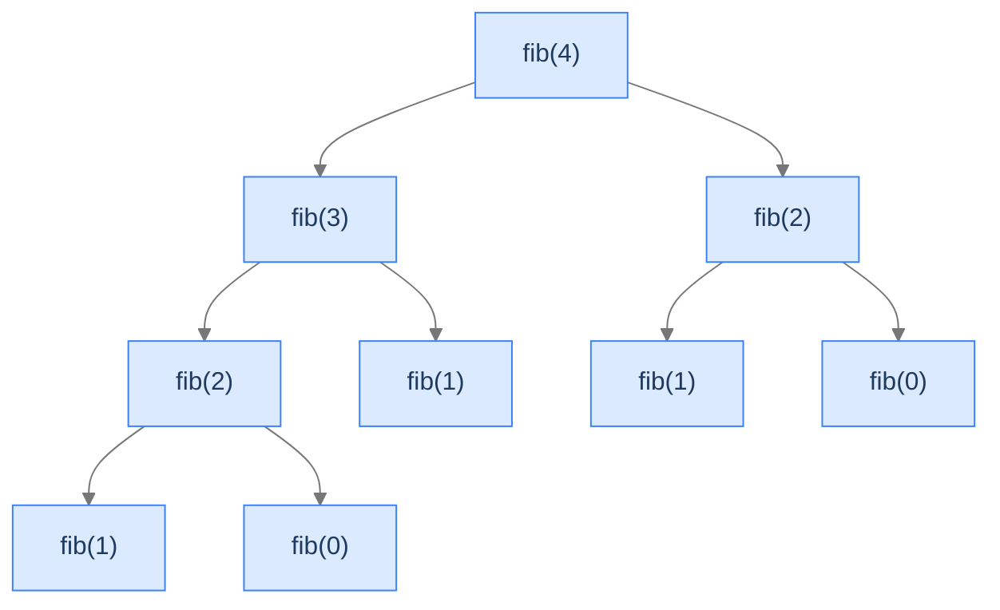
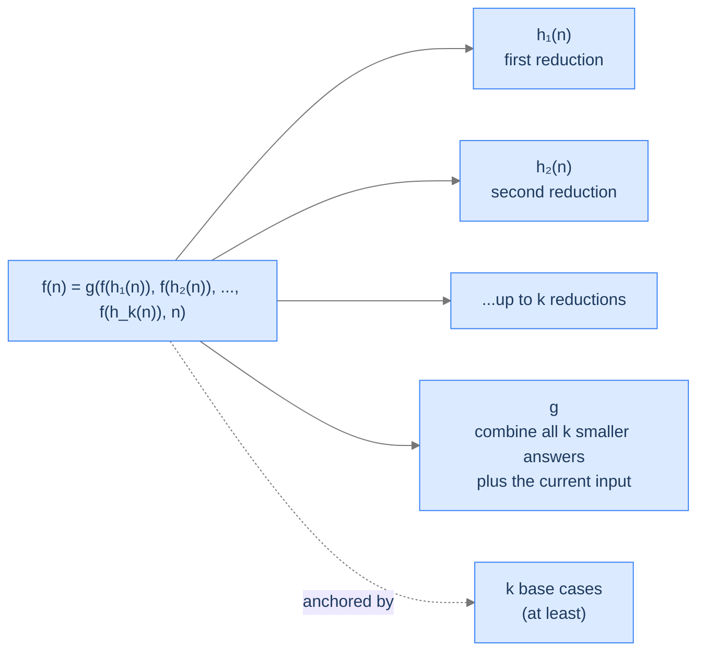

# Understanding Multiple Recursion

A function exhibits **multiple recursion** when its body contains **two or more recursive calls**. The call tree branches at every node — instead of a thin line of frames, you get a fanned-out tree, often with a tree-shaped explosion of subproblems.

The simplest example is Fibonacci's classical recursive form:

```
fib(n) = fib(n-1) + fib(n-2)
```

That single line of arithmetic — the `+` between two recursive calls — is enough to turn linear recursion into exponential recursion. The reason: each call spawns *two* children, each of which spawns two more, and so on. After `n` levels you have `2^n` leaves.

> 🖼 Diagram — Fibonacci's recursion tree for fib(4). Each non-base node spawns two children. fib(2) appears twice — that duplication is the engine of the exponential blow-up.


<p align="center"><strong>Fibonacci's recursion tree for <code>fib(4)</code>. Each non-base node spawns two children. <code>fib(2)</code> appears twice — that duplication is the engine of the exponential blow-up.</strong></p>

> *Before reading on — count the function calls for `fib(6)`. Is it 6? 12? 24? More? Predict before you keep reading.*

`fib(6)` makes 25 function calls — far more than 6, and the count grows exponentially. The exact recurrence: `T(n) = T(n-1) + T(n-2) + 1`. For `n = 30`, you're at over 1.6 million calls. For `n = 50`, you're at over 20 *billion*. The same problem runs in `O(n)` if you write it iteratively or with memoisation. Multiple recursion is *correct* but *catastrophically slow* without help. We'll address the help later (memoisation in the dynamic-programming chapter); the goal here is to *see* the explosion clearly so you recognise it on sight.

---

## What Multiple Recursion Looks Like in Code

The general shape:

> 🖼 Diagram — Multiple recursion: k recursive calls per frame. Each call has its own reduction h_i; the combine function g takes all k smaller answers and folds them into the answer for n.


<p align="center"><strong>Multiple recursion: <code>k</code> recursive calls per frame. Each call has its own reduction <code>h_i</code>; the combine function <code>g</code> takes all <code>k</code> smaller answers and folds them into the answer for <code>n</code>.</strong></p>

The pseudocode follows the equation:

```
function multiple_recursion(n):
    if n is a base case:
        return base_case_answer(n)        ← potentially several base cases

    smaller_1 = multiple_recursion(h_1(n))   ← first recursive call
    smaller_2 = multiple_recursion(h_2(n))   ← second recursive call
    ...
    smaller_k = multiple_recursion(h_k(n))   ← k-th recursive call

    answer = g(smaller_1, smaller_2, ..., smaller_k, n)
    return answer
```

Notice the structural similarity to head recursion: all the recursive calls happen first, then the combine step folds them. **Multiple recursion is head recursion with `k > 1` calls.** The combine step `g` typically uses arithmetic (addition for Fibonacci, multiplication-and-sum for Catalan) or set operations (union for permutation generation).

---

## Why It Explodes — The Tree-of-Calls Lens

The key insight: every recursive call's *own* recursive calls are separate, independent subtrees. There's no caching by default. If `fib(2)` is needed twice, both subtrees compute it from scratch.

Look at the Fibonacci tree above. `fib(2)` appears in two different positions — both subtrees of `fib(3)` and `fib(4)` directly. Each of those `fib(2)` nodes does the same work (computing `fib(1) + fib(0)`). That's redundant.

In the full tree for `fib(n)`, the number of recomputed subproblems grows exponentially. By the time you're computing `fib(40)`, the tree has billions of redundant `fib(small)` evaluations.

> 🖼 Diagram — Naive Fibonacci's call count for various n. The exponential growth is what makes fib(50) infeasible without memoisation.
```d2
direction: down

n: "Naive fib(n) — number of calls"

table: "Calls vs n" {
  grid-rows: 6
  grid-columns: 2
  grid-gap: 0
  h1: "n"           {style.fill: "#dbeafe"; style.stroke: "#3b82f6"}
  h2: "calls"       {style.fill: "#dbeafe"; style.stroke: "#3b82f6"}
  r1: "10"          ; v1: "177"
  r2: "20"          ; v2: "21,891"
  r3: "30"          ; v3: "2,692,537"
  r4: "40"          ; v4: "331,160,281" {style.fill: "#fde68a"; style.stroke: "#d97706"}
  r5: "50"          ; v5: "≈ 2 × 10¹⁰" {style.fill: "#fecaca"; style.stroke: "#dc2626"}
}

note: "Roughly multiplies by ~123× every +10 to n.\nMemoisation collapses this to O(n)."
```

<p align="center"><strong>Naive Fibonacci's call count for various <code>n</code>. The exponential growth is what makes <code>fib(50)</code> infeasible without memoisation.</strong></p>

The fix — caching previously computed answers (memoisation) — collapses the tree to `O(n)` unique subproblems. We don't fix it here; this lesson is about seeing the unfixed pattern. The fix is the bridge into dynamic programming.

---

## Passing Data Down

Multiple recursion typically passes the input by value (or by reference for shared containers, same as head recursion). There's no accumulator — the recursion is genuinely fanning out, and an accumulator can only carry one thread of progress at a time. Each recursive call gets the same kind of input the parent got, just smaller.

Some multiple-recursion problems do thread additional state down (e.g. when generating combinations: pass the current partial combination), but those are usually backtracking problems, which the next major topic (the Multidimensional Recursion lesson and beyond) addresses head-on.

---

## Passing Data Up

Each call returns its sub-answer to the caller. The combine step `g` reduces all `k` smaller answers into one value. For Fibonacci, `g(a, b) = a + b`. For Catalan, `g(...) = sum of products`. The combine is where the problem-specific arithmetic happens.

---

## Algorithm

> **multipleRecursion(n)**
>
> 1. **Stop** — if `n` is a base case, return its known answer.
> 2. **For each of the `k` recursive calls:**
>    - Compute the reduced input `n_i = h_i(n)`.
>    - Make the recursive call: `result_i = multipleRecursion(n_i)`.
> 3. **Combine** — apply `g(result_1, ..., result_k, n)` to fold into the answer for `n`.
> 4. **Return** the combined result.

Step 2 is what makes this multiple recursion: instead of one call, there are `k`.

---

## Implementation

A clean, language-agnostic implementation of the generic template with two recursive calls (`k = 2`).


```python run
from typing import List

class Solution:
    def multipleRecursion(self, N: int, aggregate: List[int]) -> int:

        # Base case: If N is less than or equal to 0, we have reached
        # the end of recursion
        if N <= 0:
            # Exit the function, as there are no more numbers to add
            return 0  # Solution for the base case

        # Number of recursive calls to make at each level
        # This is dependent on the problem
        k = 3

        solution = 0  # Initialize solution to a default value

        for i in range(k):
            # Compute new input based on i, N, and aggregate
            new_input = self.h(i, N, aggregate)

            # Add the current iteration's contribution to the aggregate
            self.g(i, N, aggregate)

            # Recursive call with new values
            result = self.multipleRecursion(new_input, aggregate)

            # Combine the result with the current solution
            solution = self.G(N, solution, result)

            # Restore aggregate if necessary
            self.gInverse(i, N, aggregate)

        return solution  # Return the final solution

    # Placeholder for h - use the iteration, input and aggregate
    # to compute the new input
    def h(self, iteration: int, input: int, aggregate: List[int]) -> int:
        # Implement your logic here
        return 0

    # Placeholder for g - use the iteration, input and aggregate
    # to update aggregate
    def g(self, iteration: int, input: int, aggregate: List[int]) -> None:
        # Implement your logic here
        pass

    # Placeholder for gInverse - use the iteration, input and aggregate
    # to revert the updates made by g
    def gInverse(self, iteration: int, input: int, aggregate: List[int]) -> None:
        # Implement your logic here
        pass

    # Placeholder for G - use the input, existing solution,
    # and result from the recursive call to compute the new solution
    def G(self, input: int, solution: int, result: int) -> int:
        # Implement your logic here
        return 0
```

```java run
import java.util.List;

class Solution {

    public int multipleRecursion(int N, List<Integer> aggregate) {

        // Base case: If N is less than or equal to 0, we have reached
        // the end of recursion
        if (N <= 0) {

            // Exit the function, as there are no more numbers to add
            return 0; // Solution for the base case
        }

        // Number of recursive calls to make at each level
        // This is dependent on the problem
        int k = 3;

        int solution = 0; // Initialize solution to a default value

        for (int i = 0; i < k; i++) {
            // Compute new input based on i, N, and aggregate
            int newInput = h(i, N, aggregate);

            // Add the current iteration's contribution to the aggregate
            g(i, N, aggregate);

            // Recursive call with new values
            int result = multipleRecursion(newInput, aggregate);

            // Combine the result with the current solution
            solution = G(N, solution, result);

            // Restore aggregate if necessary
            gInverse(i, N, aggregate);
        }
        return solution; // Return the final solution
    }

    // Placeholder for h - use the iteration, input and aggregate
    // to compute the new input
    private int h(int iteration, int input, List<Integer> aggregate) {
        // Implement your logic here
        return 0;
    }

    // Placeholder for g - use the iteration, input and aggregate
    // to update aggregate
    private void g(int iteration, int input, List<Integer> aggregate) {
        // Implement your logic here
    }

    // Placeholder for gInverse - use the iteration, input and aggregate
    // to revert the updates made by g
    private void gInverse(int iteration, int input, List<Integer> aggregate) {
        // Implement your logic here
    }

    // Placeholder for G - use the input, existing solution,
    // and result from the recursive call to compute the new solution
    private int G(int input, int solution, int result) {
        // Implement your logic here
        return 0;
    }
}
```


---

## Complexity Analysis

For a binary multiple recursion (`k = 2`) with `O(1)` combine and reduction:

| Resource | Cost | Why |
|---|---|---|
| **Time** | `O(2^n)` worst case (Fibonacci-shape) | Each frame spawns 2 children; tree has `≈ 2^n` leaves. |
| **Space (stack)** | `O(n)` | The deepest path is from root to leftmost leaf — depth `n`, not `2^n`. The sibling subtrees aren't in memory simultaneously. |

For a `k`-way multiple recursion (e.g. Catalan with sum over partitions, or climb-stairs with `k` step sizes):

| Resource | Cost | Why |
|---|---|---|
| **Time** | `O(k^n)` worst case | Each frame spawns `k` children. |
| **Space (stack)** | `O(n)` | Same — depth not breadth. |

The space cost is *linear* even though the time cost is exponential — this is the most counterintuitive thing about multiple recursion. The tree is huge in *width*, but at any moment only one root-to-leaf path is on the stack. Sibling subtrees are processed sequentially, not in parallel.

> **Best Case** — Time `O(2^n)`, Space `O(n)` (without memoisation)
>
> **Worst Case** — Same — input doesn't change the tree shape

With memoisation: time collapses to `O(n)` (each subproblem solved once). Space also `O(n)`. We'll see this in the dynamic programming section.

---

## Key Takeaway

Multiple recursion = head recursion with `k ≥ 2` recursive calls per frame. The call tree branches; the work explodes; the stack stays linear. Knowing this pattern is half the battle for problems like Fibonacci, partition counting, and tree-shaped enumeration. Now we'll learn how to spot one.

# Identifying Multiple Recursion

Three diagnostic questions decide whether a problem is a multiple-recursion candidate.

| # | Question | If "yes," multiple recursion fits because... |
|---|---|---|
| **Q1** | Does `f(n)` depend on **two or more** smaller subproblems? | The recursion tree must branch — that's the defining property. |
| **Q2** | Is the combine step `g` a fold over those smaller answers (sum, product, max, etc.)? | Multiple recursion's output is one value, not a structure. |
| **Q3** | Are there enough base cases to anchor every recursive path? | With `k > 1` recursive calls, missing a base case crashes the program in more ways. |

### Q1 — Why "two or more smaller subproblems"?

**Mental model.** Single-recursive problems (head/tail) have a thin call tree. Multiple-recursive problems are the ones whose mathematical definition genuinely *needs* multiple smaller answers to compute the larger one. Fibonacci's `F(n) = F(n-1) + F(n-2)` is the textbook two-call form. Catalan's `C(n) = sum_i C(i) * C(n-1-i)` is a `k`-call form where `k = n` (every call recurses up to `n` times).

**Concrete check.** Fibonacci needs both `F(n-1)` *and* `F(n-2)`. Knowing only one isn't enough. ✓

**What breaks otherwise.** If a problem only needs `f(n-1)`, it's head recursion (the Head Recursion lesson). Multiple recursion's machinery — `k` calls, exponential explosion, branching tree — is overkill for single-call problems.

### Q2 — Why "fold-style combine"?

**Mental model.** The combine step `g` reduces multiple sub-answers into one. Addition (Fibonacci), multiplication-and-sum (Catalan), max (game-theoretic problems), set-union (permutation-counting) — all folds. The output is *one* value per call.

**Concrete check.** Fibonacci's `g(a, b) = a + b` is the simplest fold imaginable. Climb-stairs's `g = sum over all step choices` is a `k`-ary fold. ✓

**What breaks otherwise.** If the problem requires building up a *structure* (a list of all permutations, a tree of all partitions), multiple recursion's "fold to one value" model doesn't fit cleanly. Those problems are usually backtracking — they branch like multiple recursion but build incremental partial solutions instead of folding values.

### Q3 — Why "enough base cases"?

**Mental model.** With `k > 1` recursive calls, the recursion tree has many root-to-leaf paths. Every path must terminate at a base case. Forgetting a base case for one of them is more dangerous than in head recursion because the symptoms hide in some subtrees but not others.

**Concrete check.** Fibonacci needs *two* base cases: `F(0) = 0` and `F(1) = 1`. With only `F(0)`, the call `fib(2) = fib(1) + fib(0)` would recurse on `fib(1) = fib(0) + fib(-1)` — and `fib(-1)` would never terminate. ✓

**What breaks otherwise.** Subtle bugs. Some inputs work because their tree happens to dodge the missing base case. Others crash. Drawing the recursion tree is the fastest way to verify all paths reach a base.

---

## A Worked Example — Climbing Stairs

> *Pause and predict — if you can climb 1 or 2 stairs at a time, how many distinct ways can you climb 4 stairs? List them.*

The four ways:
1. `1, 1, 1, 1`
2. `1, 1, 2`
3. `1, 2, 1`
4. `2, 1, 1`
5. `2, 2`

Five ways, not four. The recursive insight: from the bottom, your first step is either 1 or 2 stairs. After taking it, you face the same problem on a smaller staircase: `climb(n) = climb(n-1) + climb(n-2)`. The base cases: `climb(0) = 1` (one way to "stand at the top — do nothing") and `climb(n < 0) = 0` (overshot — no valid way).

That's *literally Fibonacci with shifted indices*. We'll generalise it to arbitrary step sets in **Problem 3** below.

---

## Key Takeaway

Three checks — multiple subproblems, fold-style combine, enough base cases — gate every multiple-recursion problem. Pass all three and the template snaps in (along with its exponential time blow-up). Four worked problems coming up. The first is the canonical exponential-recursion trap; the others generalise it in different directions.

<!-- ============================================== -->
<!-- SWEEP 2 — missing sections (placeholders only) -->
<!-- ============================================== -->

<!-- TODO: Understanding the Pattern — missing, needs to be written -->
<!--       Guidance: umbrella H2 with the subsections below -->

<!-- TODO: Why Naive Isn't Enough — missing, needs to be written -->
<!--       Guidance: motivation for why the obvious approach fails -->

<!-- TODO: The Core Idea — missing, needs to be written -->
<!--       Guidance: one paragraph: the central trick -->

<!-- TODO: How the Pointers/Window Move — missing, needs to be written -->
<!--       Guidance: mechanics of the moving parts -->

<!-- TODO: The Generic Algorithm — missing, needs to be written -->
<!--       Guidance: numbered steps, no code -->

<!-- TODO: Generic Implementation — missing, needs to be written -->
<!--       Guidance: Python block + Java block of the skeleton -->

<!-- TODO: Variants / Taxonomy — missing, needs to be written -->
<!--       Guidance: enumerate sub-shapes of this pattern -->

<!-- TODO: Recognition Checklist — missing, needs to be written -->
<!--       Guidance: 4-question diagnostic — the source of the Problem-section Diagnostic Questions -->

<!-- TODO: Canonical Example — missing, needs to be written -->
<!--       Guidance: fully worked example: brute force → optimised → template fit -->

<!-- TODO: Problems in This Category — missing, needs to be written -->
<!--       Guidance: table with links to the 02-problems/ files -->
