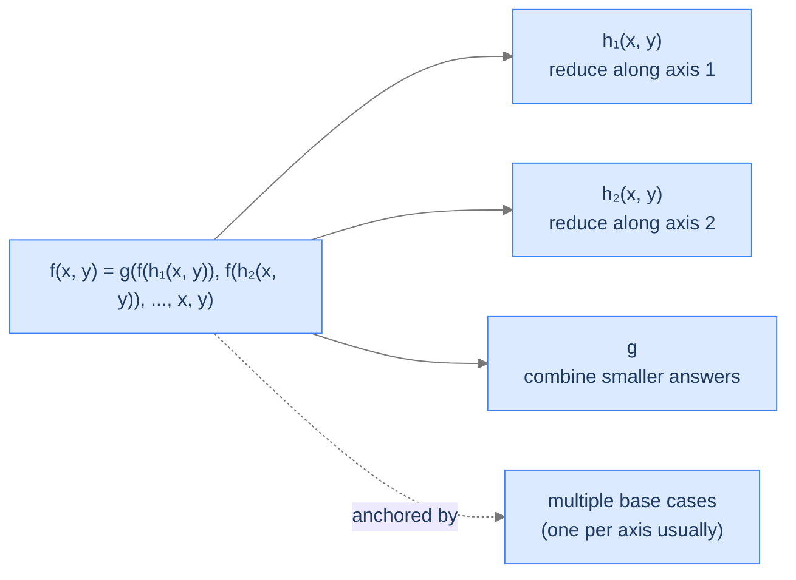

# Understanding Multidimensional Recursion

A recursion is **multidimensional** when its input is described by **two or more parameters**, each of which can be reduced independently. The recursive call doesn't just shrink one number — it might shrink one parameter, the other parameter, or both at once.

The simplest example is the binomial coefficient `C(n, k)`:

```
C(n, k) = C(n-1, k-1) + C(n-1, k)
```

Two recursive calls. Both reduce `n` by 1; one of them also reduces `k` by 1. The state being navigated is the pair `(n, k)` — a *2D state space*, not a 1D list of integers.

> 🖼 Diagram — The 2D subproblem space for binomial coefficient. Each cell C(n, k) depends on two cells in the row above: C(n-1, k-1) and C(n-1, k). The recursion navigates this grid, not a line.
```d2
direction: down

table: "Subproblem space for C(n, k)" {
  grid-rows: 5
  grid-columns: 5
  grid-gap: 0
  h0:  ""        ; h1:  "k=0"  ; h2:  "k=1"  ; h3:  "k=2"  ; h4:  "k=3"
  r0n: "n=0"     ; c00: "1"    ; c01: "—"    ; c02: "—"    ; c03: "—"
  r1n: "n=1"     ; c10: "1"    ; c11: "1"    ; c12: "—"    ; c13: "—"
  r2n: "n=2"     ; c20: "1"    ; c21: "2"    ; c22: "1"    ; c23: "—"
  r3n: "n=3"     ; c30: "1"    ; c31: "3"    ; c32: "3"    ; c33: "1"
}
```

<p align="center"><strong>The 2D subproblem space for binomial coefficient. Each cell <code>C(n, k)</code> depends on two cells in the row above: <code>C(n-1, k-1)</code> and <code>C(n-1, k)</code>. The recursion navigates this grid, not a line.</strong></p>

The state is no longer "the integer `n`." It's the pair `(n, k)`. When we ask *how many distinct subproblems can the recursion visit?*, the answer is *the number of cells in the grid*, not *the depth of the recursion*. That distinction is what makes multidimensional recursion the natural launchpad for dynamic programming.

---

## What Multidimensional Recursion Looks Like in Code

The general shape:

> 🖼 Diagram — Multidimensional recursion's general shape. h_i reduces along different axes; the combine g folds the smaller-state answers into the answer for (x, y).


<p align="center"><strong>Multidimensional recursion's general shape. <code>h_i</code> reduces along different axes; the combine <code>g</code> folds the smaller-state answers into the answer for <code>(x, y)</code>.</strong></p>

Pseudocode:

```
function multi_recursion(x, y):
    if (x, y) is a base case:
        return base_answer(x, y)        ← potentially several base cases
                                          covering different axis edges

    smaller_1 = multi_recursion(h_1(x, y))   ← reduce along axis 1 (or both)
    smaller_2 = multi_recursion(h_2(x, y))   ← reduce along axis 2 (or both)
    ...

    answer = g(smaller_1, smaller_2, ..., x, y)
    return answer
```

The structural similarity to multiple recursion (the Multiple Recursion lesson) is real — both make multiple recursive calls and combine. The crucial difference: in multiple recursion, the calls all navigate a 1D state space. In multidimensional recursion, the calls navigate a 2D (or higher) grid. **Same fan-out, different geometry.**

---

## Identifying Base Cases

This is the trickiest part of multidimensional recursion. The base cases live on the *boundaries* of the state space. For a 2D grid, that's typically:

- The "left edge" (one axis at its smallest value)
- The "top edge" (the other axis at its smallest value)
- Possibly the diagonal or other geometric features

Miss any one boundary and some recursion paths will run forever.

> 🖼 Diagram — For binomial coefficient, base cases live on two boundaries: the left edge (k = 0) and the diagonal (k = n). Together they catch every reduction path.
```d2
direction: down

table: "Base cases live on the grid's boundary" {
  grid-rows: 5
  grid-columns: 5
  grid-gap: 0
  h0:  ""        ; h1:  "k=0"  ; h2:  "k=1"  ; h3:  "k=2"  ; h4:  "k=3"
  r0n: "n=0"     ; c00: "BASE" {style.fill: "#fde68a"; style.stroke: "#d97706"} ; c01: "•"  ; c02: "•"  ; c03: "•"
  r1n: "n=1"     ; c10: "BASE" {style.fill: "#fde68a"; style.stroke: "#d97706"} ; c11: "BASE" {style.fill: "#fde68a"; style.stroke: "#d97706"} ; c12: "•"  ; c13: "•"
  r2n: "n=2"     ; c20: "BASE" {style.fill: "#fde68a"; style.stroke: "#d97706"} ; c21: "•"  ; c22: "BASE" {style.fill: "#fde68a"; style.stroke: "#d97706"} ; c23: "•"
  r3n: "n=3"     ; c30: "BASE" {style.fill: "#fde68a"; style.stroke: "#d97706"} ; c31: "•"  ; c32: "•"  ; c33: "BASE" {style.fill: "#fde68a"; style.stroke: "#d97706"}
}
```

<p align="center"><strong>For binomial coefficient, base cases live on two boundaries: the left edge (<code>k = 0</code>) and the diagonal (<code>k = n</code>). Together they catch every reduction path.</strong></p>

> *Before reading on — for `C(5, 2)`, draw the grid above and trace which cells the recursion visits. Which base case does each leaf hit?*

`C(5, 2)` recurses into `C(4, 1)` and `C(4, 2)`. `C(4, 1)` recurses into `C(3, 0)` (left-edge base, returns 1) and `C(3, 1)`. The recursion fans out, every leaf landing on either the left edge (`k = 0`) or the diagonal (`k = n`). Without **both** boundary cases, some leaves wouldn't terminate. The most common bug in multidimensional recursion is forgetting one boundary — the program runs fine for some inputs and crashes on others.

---

## Passing Data Down

Both axes of state must be passed in every recursive call. The data flow is otherwise the same as multiple recursion: by-value (or by-reference for shared containers) for the input parameters, return value for the answer.

The state often grows as the input grows. For binomial coefficient, both `n` and `k` are scalar integers — passing by value is trivial. For lattice paths, `(rows, cols)` is also a pair of integers. For edit distance (later in the DP chapter), the state is `(i, j)` with two strings — and passing the strings by value would be wasteful, so we pass them by reference and move the pair of indices instead.

---

## Passing Data Up

Each recursive call returns its answer; the combine step folds them. Same as multiple recursion. Multidimensional recursion's *output* is one value; only its *input* is multidimensional.

---

## Algorithm

> **multidimensionalRecursion(x, y)**
>
> 1. **Stop** — if `(x, y)` is on a base-case boundary, return the known answer for that boundary.
> 2. **For each axis-reduction:**
>    - Compute the reduced state `(x_i, y_i) = h_i(x, y)`.
>    - Make the recursive call `result_i = multi_recursion(x_i, y_i)`.
> 3. **Combine** — `g(result_1, result_2, ..., x, y)`.
> 4. **Return** the combined result.

The crucial difference from multiple recursion is step 1's *boundary* check (multiple base cases on different axis edges) and step 2's *axis-aware* reductions.

---

## Implementation

A clean, language-agnostic implementation of the generic 2D template.


```python run
from typing import List

class Solution:
    def multidimensionalRecursion(self, d1: int, d2: int, d3: int) -> int:
        # If any of the inputs are less than or equal to 0,
        # we have reached the base case
        if d1 <= 0 or d2 <= 0 or d3 <= 0:
            # Return the base case solution for these values
            return self.B(d1, d2, d3)

        solution = 0  # Initialize solution to a default value

        # Get the list of shift values for the current inputs
        shifts: List[List[int]] = self.S(d1, d2, d3)

        for shift in shifts:
            # Compute new inputs by applying the shift and
            # recursively call the function with new inputs
            result = self.multidimensionalRecursion(
                d1 + shift[0],
                d2 + shift[1],
                d3 + shift[2]
            )

            # Combine the result with the current solution
            solution = self.G(d1, d2, d3, solution, result)

        return solution  # Return the final solution

    # Placeholder for B - to return the base case solution
    # for the given inputs
    def B(self, d1: int, d2: int, d3: int) -> int:
        # Implement your logic here
        return 0

    # Placeholder for S - to return the list of shift values
    # for every dimension given the input
    def S(self, d1: int, d2: int, d3: int) -> List[List[int]]:
        # Implement your logic here
        return [[1, 0, 1], [-1, 0, 1]]

    # Placeholder for G - use the inputs, existing solution,
    # and result from the recursive call to compute the new solution
    def G(self, d1: int, d2: int, d3: int, solution: int, result: int) -> int:
        # Implement your logic here
        return 0
```

```java run
import java.util.ArrayList;
import java.util.Arrays;
import java.util.List;

class Solution {

    public int multidimensionalRecursion(int d1, int d2, int d3) {
        // If any of the inputs are less than or equal to 0,
        // we have reached the base case
        if (d1 <= 0 || d2 <= 0 || d3 <= 0) {
            // Return the base case solution for these values
            return B(d1, d2, d3);
        }

        int solution = 0; // Initialize solution to a default value

        // Get the list of shift values for the current inputs
        List<List<Integer>> shifts = S(d1, d2, d3);

        for (List<Integer> shift : shifts) {
            // Compute new inputs by applying the shift and
            // recursively call the function with new inputs
            int result = multidimensionalRecursion(
                d1 + shift.get(0),
                d2 + shift.get(1),
                d3 + shift.get(2)
            );

            // Combine the result with the current solution
            solution = G(d1, d2, d3, solution, result);
        }

        return solution; // Return the final solution
    }

    // Placeholder for B - to return the base case solution
    // for the given inputs
    private int B(int d1, int d2, int d3) {
        // Implement your logic here
        return 0;
    }

    // Placeholder for S - to return the list of shift values
    // for every dimension given the input
    private List<List<Integer>> S(int d1, int d2, int d3) {
        // Example implementation
        return Arrays.asList(
            Arrays.asList(1, 0, 1),
            Arrays.asList(-1, 0, 1)
        );
    }

    // Placeholder for G - use the inputs, existing solution,
    // and result from the recursive call to compute the new solution
    private int G(int d1, int d2, int d3, int solution, int result) {
        // Implement your logic here
        return 0;
    }
}
```


---

## Complexity Analysis

For a 2D recursion with two recursive calls per frame:

| Resource | Cost (without memoisation) | Cost (with memoisation) | Why |
|---|---|---|---|
| **Time** | `O(2^(x + y))` | `O(x · y)` | Without memo, each frame branches twice; tree has `~2^(x+y)` leaves. With memo, each `(x, y)` cell is computed once. |
| **Space (stack)** | `O(x + y)` | `O(x + y)` | Deepest path reduces `x` and `y` to 0, total depth `x + y`. |
| **Space (memo)** | n/a | `O(x · y)` | Cache holds one entry per cell. |

Memoisation collapses time from exponential to polynomial — a massive win. This is exactly the leverage that makes 2D dynamic programming powerful: the state space is `O(x · y)` cells, and each cell is computed in `O(1)` work, giving `O(x · y)` total. Without the cache, you re-derive the same cell exponentially many times.

> **Best Case (without memo)** — Time `O(2^(x+y))`, Space `O(x + y)`
>
> **Worst Case (without memo)** — Same — input doesn't change tree shape

---

## Key Takeaway

Multidimensional recursion = multiple recursion with a multi-axis state space. Each axis can be reduced independently; base cases live on the grid's boundaries; the subproblem space is a grid, not a line. This is the structural setup that makes 2D dynamic programming work. Now we'll learn how to spot a multidimensional candidate.

# Identifying Multidimensional Recursion

Three diagnostic questions:

| # | Question | If "yes," multidimensional recursion fits because... |
|---|---|---|
| **Q1** | Does the input have **two or more parameters** that can each shrink? | The state is genuinely multidimensional, not a 1D parameter pair. |
| **Q2** | Does the recurrence reduce along **different axes** in different recursive calls? | The recursion is navigating a grid, not just a line. |
| **Q3** | Are there base cases on **multiple boundaries** of the state space? | Single-edge base cases miss reduction paths. |

### Q1 — Why "two or more shrinkable parameters"?

**Mental model.** "Shrinkable" means the recurrence reduces the parameter toward a base case. If the second parameter is a constant or a passed-through reference (like an unchanging array), the recursion is still effectively 1D — only one parameter is doing real work.

**Concrete check.** Binomial coefficient: both `n` and `k` reduce. `C(5, 3)` calls `C(4, 2)` (reducing both) and `C(4, 3)` (reducing only `n`). Both parameters genuinely shrink at some point. ✓

**What breaks otherwise.** A function `walk_array(arr, i)` that walks an array recursively isn't multidimensional — only `i` shrinks; `arr` is a passed-through reference. That's still 1D recursion (head-recursive in this case).

### Q2 — Why "different reductions in different calls"?

**Mental model.** If every recursive call reduces `(x, y)` to `(x-1, y-1)` — both axes always reduced together — the effective state is one-dimensional (`x = y` at every step, so just one parameter is doing work). For genuinely multidimensional recursion, at least *some* of the calls must reduce only one axis at a time, exploring different paths through the grid.

**Concrete check.** Lattice paths: `paths(r, c) = paths(r-1, c) + paths(r, c-1)`. The first call reduces only `r`; the second reduces only `c`. The grid is genuinely explored two-dimensionally. ✓

**What breaks otherwise.** A function `f(a, b)` that always recurses to `f(a-1, b-1)` is just `f(min(a, b))` in disguise — collapsible to 1D. The multidimensional structure is illusory.

### Q3 — Why "base cases on multiple boundaries"?

**Mental model.** Each axis can independently reach its smallest value. Each "edge" of the grid is a separate base-case boundary. Forget any one and recursion paths that travel along that edge will run forever.

**Concrete check.** Lattice paths: `paths(0, c) = 1` (one row, one path: all-right) and `paths(r, 0) = 1` (one column, one path: all-down). Both boundaries are essential — drop the `r = 0` base and `paths(0, 5)` recurses to `paths(-1, 5)` and never terminates. ✓

**What breaks otherwise.** Subtle bugs that depend on input. Some reduction paths catch the surviving base; others don't.

---

## A Worked Example — Lattice Paths

> *Pause and predict — for a 2×2 grid, how many distinct paths from top-left to bottom-right exist if you can only move right or down? List them.*

The 6 paths in a 2×2 grid (with corners labelled):
1. RRDD (right, right, down, down)
2. RDRD
3. RDDR
4. DRRD
5. DRDR
6. DDRR

Six paths, not four. The recursive insight: the first move is either *right* (subproblem: paths through a (rows, cols-1) grid) or *down* (subproblem: paths through a (rows-1, cols) grid). Sum the two.

`paths(rows, cols) = paths(rows-1, cols) + paths(rows, cols-1)`. Bases: `paths(0, c) = 1` and `paths(r, 0) = 1` (a row or column of cells has exactly one all-rightward or all-downward path).

We make this concrete in **Problem 2** below.

---

## Key Takeaway

Three checks — multiple shrinkable parameters, axis-aware reductions, and base cases on every boundary — gate every multidimensional-recursion problem. Pass all three and you're navigating a grid. Four worked problems coming up. The first sets up Pascal's triangle; the last is the famous "this is why DP exists" problem.

<!-- ============================================== -->
<!-- SWEEP 2 — missing sections (placeholders only) -->
<!-- ============================================== -->

<!-- TODO: Understanding the Pattern — missing, needs to be written -->
<!--       Guidance: umbrella H2 with the subsections below -->

<!-- TODO: Why Naive Isn't Enough — missing, needs to be written -->
<!--       Guidance: motivation for why the obvious approach fails -->

<!-- TODO: The Core Idea — missing, needs to be written -->
<!--       Guidance: one paragraph: the central trick -->

<!-- TODO: How the Pointers/Window Move — missing, needs to be written -->
<!--       Guidance: mechanics of the moving parts -->

<!-- TODO: The Generic Algorithm — missing, needs to be written -->
<!--       Guidance: numbered steps, no code -->

<!-- TODO: Generic Implementation — missing, needs to be written -->
<!--       Guidance: Python block + Java block of the skeleton -->

<!-- TODO: Variants / Taxonomy — missing, needs to be written -->
<!--       Guidance: enumerate sub-shapes of this pattern -->

<!-- TODO: Recognition Checklist — missing, needs to be written -->
<!--       Guidance: 4-question diagnostic — the source of the Problem-section Diagnostic Questions -->

<!-- TODO: Canonical Example — missing, needs to be written -->
<!--       Guidance: fully worked example: brute force → optimised → template fit -->

<!-- TODO: Problems in This Category — missing, needs to be written -->
<!--       Guidance: table with links to the 02-problems/ files -->
