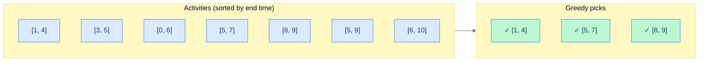

# 1. Introduction to Greedy Algorithms

## The Hook

You're making change for $1.83 from US coins (quarter, dime, nickel, penny). Without thinking, you reach for two quarters first — that's $0.50, leaving $1.33. Then a quarter — $0.75, $1.08 left. Then four quarters — $1.75, $0.08 left. Then a nickel — $1.80, $0.03 left. Then three pennies. Eight coins total.

That algorithm — *always grab the largest coin that doesn't exceed what's left* — is **greedy**. It's the simplest strategy possible: ignore the future, make the locally-best choice, repeat. For US coins, it gives the *globally-optimal* (fewest-coin) answer. For arbitrary coin systems, it doesn't — try the same algorithm with denominations `{1, 7, 10}` for amount 14: greedy gives `10 + 1 + 1 + 1 + 1 = 5 coins`, but optimal is `7 + 7 = 2 coins`. The greedy choice locks you out of better futures.

This pattern is the joy and danger of greedy algorithms. When greedy works, the algorithm is *embarrassingly simple* — usually a sort plus a linear scan. When it doesn't, you can spend hours convinced it does, only to find a counterexample. This chapter teaches you the canonical examples that *do* work, the proof technique (exchange argument) that establishes correctness, and the warning signs that suggest greedy is the wrong tool.

---

## Table of contents

1. [What "greedy" means](#what-greedy-means)
2. [Activity selection: the canonical example](#activity-selection-the-canonical-example)
3. [The exchange argument](#the-exchange-argument)
4. [Huffman coding](#huffman-coding)
5. [Implementation](#implementation)
6. [When greedy fails](#when-greedy-fails)
7. [Edge cases and pitfalls](#edge-cases-and-pitfalls)
8. [Production reality](#production-reality)
9. [Practice ladder](#practice-ladder)
10. [Cross-links](#cross-links)
11. [Final takeaway](#final-takeaway)

***

# What "greedy" means

A **greedy algorithm** is one that, at each step, makes the choice that looks best *now* — without considering whether that choice constrains future choices badly.

Greedy works iff the problem has the **greedy-choice property**: a global optimum can always be reached by making a locally-optimal first choice. Equivalently: the locally-best choice is never wrong. Some problems have this property; many don't. Identifying which is which is the core skill.

Two clues that suggest a problem is greedy-amenable:

1. **There's a natural sort key** that orders the choices. (Activity end times, edge weights, item profits.)
2. **The problem reduces to "pick a subset" or "schedule" or "match"** — broad shapes where local information is enough.

Two clues that suggest *not*:

1. **The optimal answer requires balancing competing goals.** (Maximum-flow, optimal BST.)
2. **A wrong early choice can't be recovered.** (Coin change with weird denominations, longest path in a general graph.)

***

# Activity selection: the canonical example

You have `n` activities, each with a start time `s_i` and end time `e_i`. Pick the *maximum number* of activities that don't overlap.

**Greedy strategy: sort by end time; greedily pick the next activity that starts after the last one ended.**

**Cost.** `O(n log n)` for the sort.



<p align="center"><strong>Activity selection: pick the activity ending soonest, skip everything that overlaps with it, repeat. The locally-best (earliest-ending) choice is never wrong.</strong></p>

***

# The exchange argument

How do we *prove* the greedy strategy gives the globally optimal answer? The standard tool is an **exchange argument**:

> Suppose `OPT` is an optimal solution and `GREEDY` is the greedy solution. They might differ. Show that we can *exchange* a choice in `OPT` for the corresponding greedy choice without making the solution worse. Repeat until `GREEDY = OPT`. Therefore `GREEDY` was already optimal.

For activity selection: let `OPT` be any optimal selection, and let `g` be the greedy first pick (the activity ending soonest). If `g` is in `OPT`, we're done — recurse on the remaining activities. If `g` is *not* in `OPT`, take the activity in `OPT` that ends soonest, call it `o`. By definition of greedy, `g.end ≤ o.end`. Swap `o` for `g` in `OPT`: the new schedule has the same size and is still valid (any future activity in `OPT` started after `o.end ≥ g.end`, so it's compatible with `g`). The new `OPT` includes `g`. Recurse.

Two patterns of exchange argument:

- **"Greedy stays ahead"** — show that after each greedy step, the partial greedy solution is at least as good as the corresponding partial of any other solution.
- **"Exchange without loss"** — show that any optimal solution can be transformed into the greedy one by exchanges that don't reduce its quality.

Both patterns are valid; pick whichever fits the problem.

***

# Huffman coding

Given a set of symbols with frequencies, build a prefix-free binary code (no codeword is a prefix of another) that minimises the total encoded length.

**Greedy strategy: repeatedly combine the two least-frequent symbols into a new internal node** (whose frequency is the sum). Continue until one tree remains; the tree's leaves are the symbols, the path from root to leaf is the codeword.

The frequencies form a heap; each combine pops the two minimums and pushes their sum. `O(n log n)` total.

The proof of optimality is a beautiful exchange argument: in any optimal tree, the two least-frequent symbols *can* be made siblings at the deepest level — and once they're siblings, the problem reduces to building an optimal tree for `n - 1` symbols (with the combined node). Greedy correctly picks the two least-frequent at every level.

Used in production for: data compression (DEFLATE/gzip uses static Huffman tables), JPEG image encoding, MP3 audio encoding. Modern codecs use arithmetic coding (which beats Huffman by a small constant), but Huffman is still the textbook example because the math is exact and the algorithm is short.

***

# Implementation

```python run
def activity_selection(activities):
    activities = sorted(activities, key=lambda a: a[1])
    selected = []
    last_end = float('-inf')
    for s, e in activities:
        if s >= last_end:
            selected.append((s, e))
            last_end = e
    return selected

import heapq

class HuffNode:
    def __init__(self, ch=None, freq=0, left=None, right=None):
        self.ch, self.freq, self.left, self.right = ch, freq, left, right
    def __lt__(self, other): return self.freq < other.freq

def huffman(frequencies):
    heap = [HuffNode(ch=c, freq=f) for c, f in frequencies.items()]
    heapq.heapify(heap)
    while len(heap) > 1:
        a = heapq.heappop(heap)
        b = heapq.heappop(heap)
        heapq.heappush(heap, HuffNode(freq=a.freq + b.freq, left=a, right=b))
    return heap[0]

def huffman_codes(root, prefix="", out=None):
    if out is None: out = {}
    if root.ch is not None:
        out[root.ch] = prefix or "0"                                       # single-symbol edge case
        return out
    huffman_codes(root.left, prefix + "0", out)
    huffman_codes(root.right, prefix + "1", out)
    return out


if __name__ == "__main__":
    activities = [(1, 4), (3, 5), (0, 6), (5, 7), (8, 9), (5, 9), (6, 10)]
    print(f"Activity selection: {activity_selection(activities)}")

    freq = {'a': 5, 'b': 9, 'c': 12, 'd': 13, 'e': 16, 'f': 45}
    root = huffman(freq)
    codes = huffman_codes(root)
    print(f"Huffman codes: {codes}")
    total = sum(freq[c] * len(code) for c, code in codes.items())
    naive = sum(freq.values()) * 3                                          # 3 bits per char if uniform 6-symbol code
    print(f"Total bits Huffman: {total}; naive (3 bits each): {naive}; savings: {(1 - total / naive) * 100:.1f}%")
```

```java run
import java.util.*;

public class Main {
    static int[][] activitySelection(int[][] activities) {
        Arrays.sort(activities, (a, b) -> a[1] - b[1]);
        List<int[]> selected = new ArrayList<>();
        int lastEnd = Integer.MIN_VALUE;
        for (int[] a : activities) {
            if (a[0] >= lastEnd) { selected.add(a); lastEnd = a[1]; }
        }
        return selected.toArray(new int[0][]);
    }

    static class HuffNode implements Comparable<HuffNode> {
        Character ch; int freq; HuffNode left, right;
        HuffNode(Character c, int f) { ch = c; freq = f; }
        public int compareTo(HuffNode o) { return Integer.compare(freq, o.freq); }
    }

    static HuffNode huffman(Map<Character, Integer> freq) {
        PriorityQueue<HuffNode> heap = new PriorityQueue<>();
        for (var e : freq.entrySet()) heap.offer(new HuffNode(e.getKey(), e.getValue()));
        while (heap.size() > 1) {
            HuffNode a = heap.poll(), b = heap.poll();
            HuffNode m = new HuffNode(null, a.freq + b.freq);
            m.left = a; m.right = b;
            heap.offer(m);
        }
        return heap.poll();
    }

    public static void main(String[] args) {
        int[][] acts = {{1,4}, {3,5}, {0,6}, {5,7}, {8,9}, {5,9}, {6,10}};
        for (int[] s : activitySelection(acts)) System.out.println("[" + s[0] + ", " + s[1] + "]");
    }
}
```

***

# When greedy fails

The classic counterexample is **0/1 knapsack** with item-by-item greed.

```
items: { (weight, value) } = { (1, 6), (2, 10), (3, 12) }
capacity: 5
```

Greedy by value: pick item 3 (value 12, weight 3). Remaining capacity: 2. Pick item 2 (value 10, weight 2). Total: 22.

But: pick items 1 and 2: total weight 3, total value 16. Remaining capacity 2. Pick … no item fits. Total: 16.

Or: pick items 1 and 3: total weight 4, total value 18. Remaining capacity 1. No fit. Total: 18.

Or: items 2 and 3: total 5, total value 22. **Same as greedy.**

Hmm — for *this* example, greedy worked. Let me adjust:

```
items: { (1, 60), (2, 100), (3, 120) }
capacity: 5
```

Greedy by value-per-weight: item 1 (60), item 2 (50), item 3 (40). Pick item 1, item 2: total weight 3, total value 160. Pick item 3: weight 6, no fit. Total: 160.

But: items 1 + 3 = weight 4, value 180. Or items 2 + 3 = weight 5, value 220. Greedy by ratio gives 160; optimal is 220.

The fix: dynamic programming, not greedy. (See [knapsack DP](/cortex/data-structures-and-algorithms/algorithms-by-strategy-dynamic-programming-knapsack).) The fractional knapsack (where you can take fractions of items) *is* greedy-amenable; the 0/1 version isn't.

The lesson: greedy is fragile. *Always* construct the proof of correctness (or cite a published exchange argument); don't assume greedy works just because it looks plausible.

***

# Edge cases and pitfalls

- **Choosing the wrong sort key.** Activity selection sorts by *end* time, not start time. Sorting by start time gives wrong answers. Test the choice on small examples.
- **Greedy on a problem with overlapping subproblems.** Problems like "longest increasing subsequence" have greedy-looking solutions (always take the smallest next element) that are wrong. The right strategy is DP.
- **Local optimum vs global optimum.** Greedy hill-climbing on multi-modal optimisation surfaces gets stuck in local optima. Greedy doesn't fix that — only randomisation, simulated annealing, or full search does.
- **Mixed selection criteria.** "Pick activities to maximise total *value*" is *not* the same as "pick the most activities". The first is weighted; greedy by end-time doesn't work; use DP.
- **Tie-breaking.** Ties in the sort key can change behaviour subtly. Document your tie-breaking rule and test it.
- **The exchange-argument proof is missing.** In code review, a greedy algorithm without a stated proof is a code smell. Either reference a published proof (Huffman, MST, activity selection) or write one out.

***

# Production reality

- **Data compression (gzip / DEFLATE).** Static Huffman tables and dynamic Huffman are textbook greedy. Modern compressors use arithmetic coding for slightly better ratios, but Huffman is everywhere as a "good enough" baseline.
- **MP3 and JPEG.** Both use Huffman coding for the entropy-coding stage after lossy quantisation.
- **Network routing protocols.** Dijkstra's shortest path (covered in [Single-Source Shortest Path](/cortex/data-structures-and-algorithms/graphs-single-source-shortest-path)) is greedy — always pick the closest unvisited vertex. Used in OSPF, BGP, and basically every routing protocol.
- **Caching: LRU and LFU.** When a cache evicts, it greedily evicts the "least useful" entry by some metric (least-recently-used, least-frequently-used). Approximations of an optimal eviction strategy.
- **Scheduling.** EDF (Earliest Deadline First) and SJF (Shortest Job First) are greedy schedulers used in real-time systems and batch processing. Optimal under specific assumptions; failure modes well-known.
- **Compiler register allocation (graph colouring).** Approximation algorithms for register allocation are greedy heuristics — colour the graph node-by-node, picking the smallest available colour.
- **Approximation algorithms.** When a problem is NP-hard but you need an answer fast, greedy is often the first attempt at an approximation. Set cover's greedy algorithm gives an `O(log n)` approximation, the best polynomial-time bound.

***

# Practice ladder

1. **Activity selection** — implement and verify on multiple test cases.
   > *Hint:* the chapter's algorithm. Use stress testing — generate random activities, compare against an exponential brute force on small inputs.

2. **Jump Game II** ([LeetCode 45](https://leetcode.com/problems/jump-game-ii/)) — given an array where `A[i]` is the maximum jump length from `i`, find the minimum number of jumps to reach the end.
   > *Hint:* greedy: at each "frontier" (range of reachable positions in `j` jumps), find the *farthest* you can reach in one more jump. That extends the frontier. Continue until you reach the end.

3. **Gas Station** ([LeetCode 134](https://leetcode.com/problems/gas-station/)) — you're driving a circular route; at each station, you can fill up (`gas[i]`) and pay travel cost (`cost[i]`). Find a starting station that lets you complete the loop.
   > *Hint:* if total gas < total cost, impossible. Otherwise, greedily start at the station after the last "deficit drop" — the running balance always recovers from there.

4. **Minimum Number of Arrows to Burst Balloons** ([LeetCode 452](https://leetcode.com/problems/minimum-number-of-arrows-to-burst-balloons/)) — given balloon intervals, find the minimum arrows that hit them all.
   > *Hint:* sort by end coordinate. Greedily fire an arrow at the end of the first balloon. Skip every balloon containing that point. Repeat.

5. **Task Scheduler** ([LeetCode 621](https://leetcode.com/problems/task-scheduler/)) — given tasks and a cooldown `n`, find the minimum total time.
   > *Hint:* greedy by frequency. The most-frequent task fills slots; cooldown means you fill in other tasks. Compute the "skeleton" first, then fill in.

***

# Memorize

The high-leverage facts to commit to long-term memory — atomic enough for an Anki card, concrete enough to recall under pressure or during production debugging. Greedy is the most beautiful and most fragile strategy: when it works, it's a 10-line solution; when it doesn't, you have a confidently-wrong answer. Internalising the trigger patterns is the difference.

## Quick recall

Click any question to reveal the answer.

<details>
<summary><strong>Q:</strong> Definition of a greedy algorithm?</summary>

**A:** At each step, make the choice that looks best *now* — without looking ahead to whether that choice constrains future choices badly.

</details>
<details>
<summary><strong>Q:</strong> What property must a problem have for greedy to be correct?</summary>

**A:** The *greedy-choice property*: a globally-optimal solution can always be reached by making a locally-best first choice. (Plus optimal substructure.)

</details>
<details>
<summary><strong>Q:</strong> Standard sort key for activity selection?</summary>

**A:** End time. Earliest-ending compatible activity is always in some optimal solution. Sorting by start time is a common wrong answer.

</details>
<details>
<summary><strong>Q:</strong> What is the exchange argument?</summary>

**A:** Take any optimum; swap one of its choices for the corresponding greedy choice; show the result is still optimal. Repeat until you've transformed the optimum into the greedy solution.

</details>
<details>
<summary><strong>Q:</strong> Famous greedy failure?</summary>

**A:** **0/1 knapsack.** Greedy by value-per-weight gives wrong answers when items can't be split. Use DP. (Fractional knapsack *is* greedy-amenable.)

</details>
<details>
<summary><strong>Q:</strong> Famous greedy success — and the proof technique?</summary>

**A:** **Huffman coding.** Repeatedly combine two least-frequent symbols. Exchange argument: in any optimal tree, the two least-frequent symbols can be made deepest siblings, reducing to the next level.

</details>
<details>
<summary><strong>Q:</strong> Three classical greedy graph algorithms?</summary>

**A:** **Kruskal MST**, **Prim MST**, **Dijkstra shortest path**. All proved correct by exchange-argument variants.

</details>
<details>
<summary><strong>Q:</strong> When is the coin-change greedy correct?</summary>

**A:** Only for "canonical" coin systems (like US coins). For arbitrary denominations (e.g., {1, 7, 10}), greedy fails — use DP.

</details>

## Code template

```python
# Activity selection — the canonical greedy.
def activity_selection(activities):
    activities = sorted(activities, key=lambda a: a[1])    # sort by END time
    selected = []
    last_end = float('-inf')
    for s, e in activities:
        if s >= last_end:
            selected.append((s, e))
            last_end = e
    return selected

# Generic greedy skeleton:
#
# 1. Identify the local-best choice (sort by some key).
# 2. Walk through choices in order; accept each iff it doesn't violate
#    a constraint with previous accepted choices.
# 3. Prove correctness by exchange argument before trusting the answer.
```

## Pattern triggers

- **"Pick the most non-overlapping intervals"** → activity selection (sort by end time)
- **"Build a prefix code minimising bit-length"** → Huffman (min-heap of frequencies)
- **"Connect all of X with min total weight"** → MST (Kruskal or Prim)
- **"Shortest path with non-negative weights"** → Dijkstra
- **"Schedule with deadlines, maximise on-time tasks"** → sort by deadline; greedy with priority queue
- **"Assign tasks to workers with capacity"** → often greedy by load (with proofs)
- **"Coin change with arbitrary denominations"** → DP, *not* greedy
- **"0/1 knapsack"** → DP, *not* greedy (fractional knapsack is greedy)
- **No exchange-argument proof in sight** → suspect greedy is wrong; reach for DP

***

# Cross-links

- **Foundations:** [Proof Techniques](/cortex/data-structures-and-algorithms/foundations-proof-techniques) — the exchange argument is a specialised proof pattern for greedy correctness.
- **Sibling strategies:** [Dynamic Programming](/cortex/data-structures-and-algorithms/algorithms-by-strategy-dynamic-programming-index) (when greedy fails because of overlapping subproblems), [Divide and Conquer](/cortex/data-structures-and-algorithms/algorithms-by-strategy-divide-and-conquer-introduction-to-divide-and-conquer).
- **Used by:** [MST](/cortex/data-structures-and-algorithms/graphs-minimum-spanning-trees) (Kruskal, Prim), [Single-Source Shortest Path](/cortex/data-structures-and-algorithms/graphs-single-source-shortest-path) (Dijkstra), [Sorting](/cortex/data-structures-and-algorithms/sorting-and-searching-sorting-index) (selection sort is greedy).

***

# Final Takeaway

Greedy: locally-optimal choice, every step. Three patterns to internalise:

1. **The greedy-choice property is rare.** Most optimisation problems *don't* have it; greedy gives a wrong answer. Always look for the property explicitly — and if you can't find it, switch to DP.
2. **The exchange argument is the proof.** Either show "greedy stays ahead" or "any optimum can be transformed into greedy". Without this, your algorithm is unproven.
3. **Greedy code is short.** When greedy works, the implementation is usually `O(n log n)` (one sort + one scan) or simpler. The complexity of greedy lives in the *proof*, not the code.
