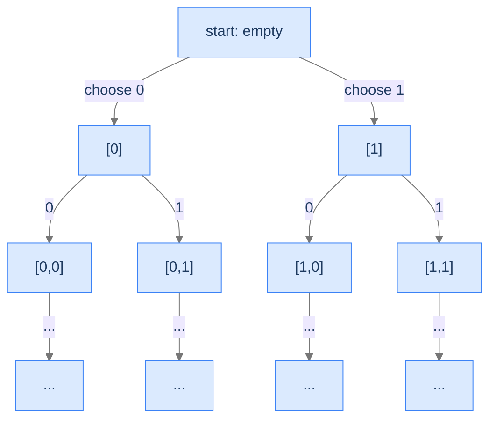
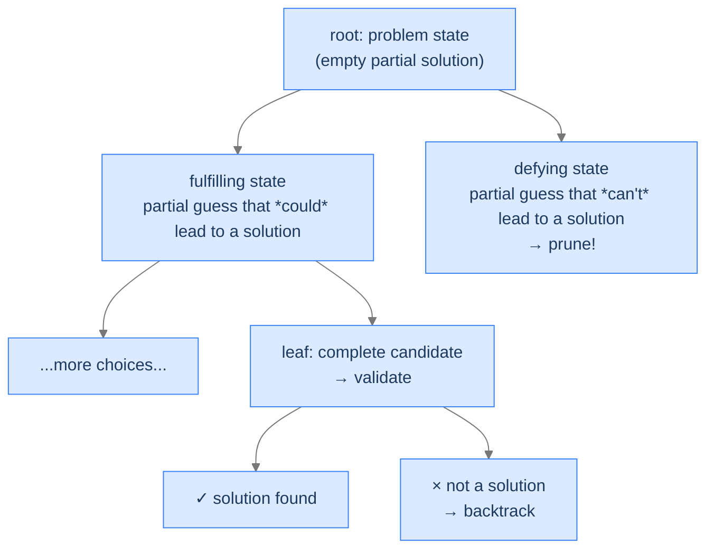
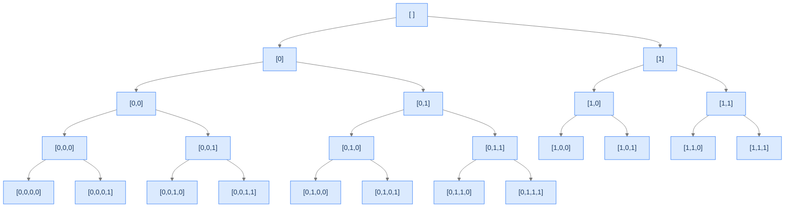
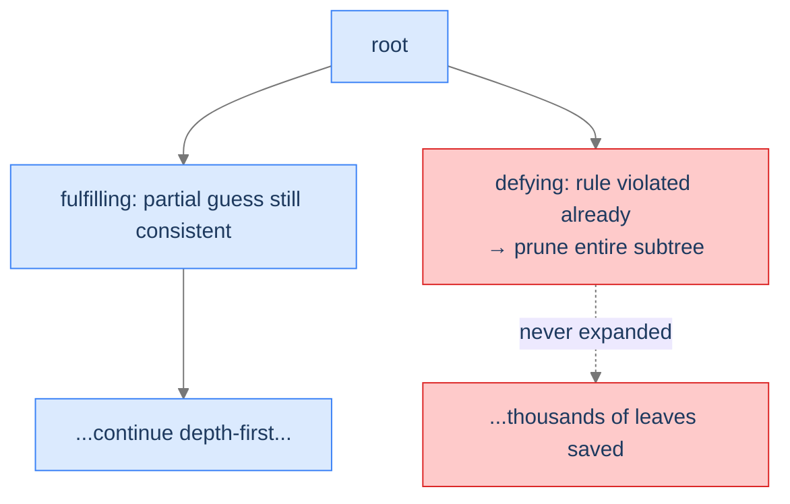

# 1. Introduction to Backtracking

You're locked out of your phone. The 4-digit PIN you set yesterday is gone. There's no password reset, no biometric, no helpdesk to call. You have one option: try every possible PIN until one works. With 10 digits per slot, that's 10,000 combinations — tedious, but tractable. Now make it 8 digits. Now 16. Now imagine the slots aren't digits but the 64 squares of an 8×8 chessboard, and the "PIN" is "place 8 queens so no two attack each other." You can't hold all 281 trillion possible placements in your head. But there's an algorithm that searches them — *systematically, never twice, abandoning whole branches the moment they're proven dead* — and that algorithm has fewer moving parts than the iterative loops you wrote last week.

That algorithm is backtracking. By the end of this lesson you'll know what shape a problem has to have for backtracking to apply, the three components every backtracking solution carries, the **state space tree** that every backtracking algorithm secretly walks, and the recursion-stack mechanic that makes "step back and try again" a single line of code instead of a tangle of pointers and undo-buffers.

## Table of contents

1. [Why brute force needs a smarter form](#why-brute-force-needs-a-smarter-form)
2. [The phone-password problem](#the-phone-password-problem)
3. [The three components of every backtracking solution](#the-three-components-of-every-backtracking-solution)
4. [The state space tree](#the-state-space-tree)
5. [Implementing it in code](#implementing-it-in-code)
6. [What backtracking actually costs](#what-backtracking-actually-costs)

***

# Why Brute Force Needs a Smarter Form

A naive brute-force algorithm enumerates *every* possible answer and tests each one. For a 4-digit binary PIN, that's 2⁴ = 16 candidates — a list you could write by hand. For an 8-queens placement, it's about 4 × 10⁹ if you ignore the rules. For sudoku, it's 6 × 10²¹. *Listing them all* isn't an option even on the fastest hardware.

The trick is to enumerate **without listing**. Imagine the candidates aren't a flat list but a tree: each level is "the next decision," each path from root to leaf is a complete candidate, each branch you don't take is a whole subtree of candidates you skip. If you can recognise a partial decision as *already-doomed* — say, two queens on the same row — you can chop off the entire subtree without ever visiting its leaves.

That's backtracking. It's brute force, but with the discipline to walk a tree instead of a list, and the smarts to abandon doomed branches the moment their futility becomes obvious.



<p align="center"><strong>The state space tree for binary PINs. Each node is a partial guess; each leaf is a complete candidate. Backtracking walks this tree depth-first, never visiting a node twice and pruning whole subtrees when the partial guess is already invalid.</strong></p>

The state space tree is the *single most important picture* in this entire lesson. Every backtracking problem has one, drawing it makes the algorithm fall out for free, and the runtime is exactly the size of the tree's *visited* portion.

---

## What Makes a Problem Backtrackable

Three things, all of which we'll formalise below:

1. **Finite outcomes.** The set of possible answers is bounded — even if astronomically large, it's not infinite.
2. **Validatable outcomes.** You can check whether any specific candidate is a valid solution.
3. **Incremental construction.** Candidates can be built one decision at a time, and each partial guess can either be extended further or abandoned.

A problem that fails any one of these isn't backtrackable. (Optimisation problems with continuous-valued decisions, undecidable problems, problems with no validation function — all out.)

> *Pause and predict — for each of the four problems below, decide whether backtracking applies, and why or why not. Don't peek; just decide.*
>
> 1. Find the integer roots of `x² + 5x + 6 = 0`.
> 2. Place 8 non-attacking queens on a chessboard.
> 3. Sort an array.
> 4. Find the maximum value in a list of unknown length.

(1) **No** — there's a closed-form quadratic formula; brute-force enumeration is overkill. (2) **Yes** — finite (4 billion placements), validatable (check rows/cols/diagonals), incremental (place one queen at a time). (3) **No** — sorting algorithms exist that don't backtrack; brute-force enumeration of permutations would be `O(n!)` and pointless. (4) **No** — single-pass linear scan; no decisions to undo.

The first hint that a problem is backtrackable is usually "I'd have to *try every possibility*." If that hint is true, backtracking is the disciplined form of "try every possibility."

---

## Key Takeaway

Backtracking is brute force in tree form: walk every candidate, prune the dead ones, never revisit the same partial decision twice. Next, the simplest possible example — cracking a 4-digit phone PIN — to make every part of that abstract description concrete.

***

# The Phone-Password Problem

You forgot the 4-digit PIN you set on your phone. To keep the example simple, suppose the PIN is made of only 0s and 1s — a 4-digit binary number. There are 2⁴ = 16 possible PINs. The phone tells you yes/no on each guess. How do you find the right one without brute-trying randomly?

```d2
direction: right

problem: "Problem state" {
  shape: oval
  label: "PIN: ? ? ? ?\n(each ? is 0 or 1)"
  style.fill: "#dbeafe"
  style.stroke: "#3b82f6"
}

phone: "Phone\n(validates PIN)" {
  shape: oval
  style.fill: "#fde68a"
  style.stroke: "#d97706"
}

problem -> phone: "try a guess"
phone -> problem: "yes / no"
```

<p align="center"><strong>The setup. Each guess is a complete 4-digit string; the phone is the validator. The question is: in what order should you try the 16 candidates?</strong></p>

---

## Two Observations

> The first person who looks at this problem and sees backtracking is the person who notices these two things at the same time:

> - It's just a **4-digit number**; every digit can only be **0 or 1**. There are *finitely many* candidates.
> - You can **validate** any guess by entering it into the phone.

These are the necessary and complete conditions for a backtracking solution. From here, the algorithm is simply: list every candidate, try each, stop on the first match.

But "list every candidate" is where backtracking earns its keep. We don't *literally* list 16 strings in a flat array; we *generate* them lazily, one digit at a time, walking down a tree.

---

## The Four Steps

Every backtracking solution does the same four things — **make a choice, validate, backtrack, repeat**.

### Make a Choice

Start with an empty PIN. The first decision is the value of digit 1 — it's either 0 or 1. Make a choice; append it; you're now at length 1.

```d2
direction: right

empty: "[ ]" {style.fill: "#dbeafe"; style.stroke: "#3b82f6"}
choose0: "Append 0"
choose1: "Append 1"
afterC0: "[0]"
afterC1: "[1]"

empty -> choose0 -> afterC0
empty -> choose1 -> afterC1
```

<p align="center"><strong>From the empty state, two choices. Each one moves us one step deeper into the state space tree.</strong></p>

Repeat until you have a 4-digit string. That's a complete candidate.

### Check for Validity

Once the partial PIN reaches length 4, enter it into the phone. If the phone unlocks, we have our answer.

```d2
candidate: "[0, 1, 0, 1]" {style.fill: "#fde68a"; style.stroke: "#d97706"}
test: "Try as PIN"
result: "✓ unlocked\n(or × wrong, try next)"

candidate -> test -> result
```

<p align="center"><strong>Validation happens at the leaves of the tree — the moment a candidate is fully built.</strong></p>

### Backtrack and Try Alternatives

If the candidate didn't unlock the phone, **step back one position** and try the *other* choice for that digit. If we'd just tried `[0, 1, 0, 1]`, the immediate alternative is `[0, 1, 0, 0]` — change the last digit and re-test. (More precisely: undo the most recent decision and re-explore.)

```d2
direction: right

failed: "[0, 1, 0, 1]\n× wrong" {style.fill: "#fecaca"; style.stroke: "#dc2626"}
backstep: "step back\n(undo last digit)"
parent: "[0, 1, 0]"
altchoice: "[0, 1, 0, 0]\n← try alternative" {style.fill: "#fde68a"; style.stroke: "#d97706"}

failed -> backstep -> parent -> altchoice
```

<p align="center"><strong>Backtracking is "undo + try the next alternative." The undo is structural — handled automatically by the recursion's call stack.</strong></p>

### Repeat Until Solved

Keep stepping back and choosing alternatives until either (a) you find the right PIN or (b) you've tried every leaf. With 16 candidates, the worst case is 16 attempts; the best case is 1.

```d2
direction: right

state1: "[ ]" {style.fill: "#dbeafe"; style.stroke: "#3b82f6"}
state2: "[0]"
state3: "[0, 0]"
state4: "[0, 0, 0]"
state5: "[0, 0, 0, 0]\n× wrong"
state6: "...try next leaf..."
final: "[0, 1, 0, 1]\n✓ correct" {style.fill: "#bbf7d0"; style.stroke: "#16a34a"}

state1 -> state2 -> state3 -> state4 -> state5 -> state6 -> final
```

<p align="center"><strong>The full process: a depth-first walk down the state space tree. Each leaf is one candidate; the algorithm walks them in a fixed order, stops on the first match.</strong></p>

---

## Key Takeaway

Four steps: make a choice, validate, backtrack on failure, repeat. The phone-password problem makes every step physical — the partial PIN is a string we're appending to, validation is asking the phone, the backtrack is undoing the last digit. Next, we name the structural ingredients every backtracking solution contains.

***

# The Three Components of Every Backtracking Solution

Now we promote the phone-password observations to the three formal components of any backtracking solution. Knowing these by name lets you recognise backtracking in a fresh problem within seconds.

---

## Component 1 — A Finite Set of Outcomes

A backtracking problem must have a **finite** set of candidate outcomes. The number can be astronomical (`n!` permutations, `2^n` subsets), but it can't be infinite. If candidates form an unbounded continuous space (`x ∈ ℝ`), backtracking doesn't apply — you'd never stop generating.

```d2
direction: right

valid: "Finite candidate space" {
  shape: oval
  style.fill: "#bbf7d0"
  style.stroke: "#16a34a"
  label: "✓ 16 binary PINs\n✓ 281 trillion 8-queens placements\n✓ n! permutations of n items"
}

invalid: "Infinite candidate space" {
  shape: oval
  style.fill: "#fecaca"
  style.stroke: "#dc2626"
  label: "× All real numbers\n× All non-empty strings\n× Backtracking doesn't apply"
}
```

<p align="center"><strong>Backtracking lives in the green box: large but finite candidate spaces. The red box requires different techniques (continuous optimisation, infinite search).</strong></p>

For the phone problem, the candidate space is exactly 16 strings. For 8-queens, it's the set of placements of 8 queens on 64 squares. For sudoku, it's the set of fillings of the 81 cells. Always finite, always enumerable.

---

## Component 2 — A Validation Function

You need a way to check whether a complete candidate is a valid solution. For phone passwords, validation is "does the phone unlock?" For 8-queens, it's "do any two queens attack each other?" For sudoku, it's "does every row, column, and 3×3 box contain each digit 1–9 exactly once?"

```d2
direction: right

candidate: "Complete candidate"
fn: "validate(candidate)" {style.fill: "#fde68a"; style.stroke: "#d97706"}
yes: "valid → record / return" {style.fill: "#bbf7d0"; style.stroke: "#16a34a"}
no: "invalid → discard, backtrack" {style.fill: "#fecaca"; style.stroke: "#dc2626"}

candidate -> fn
fn -> yes
fn -> no
```

<p align="center"><strong>The validation function is what separates backtracking from random brute force. It tells the algorithm when to stop on a leaf and when to abandon a doomed branch.</strong></p>

A subtle point: validation can happen at the leaves *and* on partial guesses. If you're filling a sudoku grid one cell at a time, you can check after each cell whether the partial fill is still valid — and abandon the entire subtree if not. **This is the core optimisation that turns brute-force backtracking into something practical.** We'll formalise it in the Conditional Enumeration lesson.

---

## Component 3 — A Recursive Structure

The algorithm needs to be able to (a) **make** a choice that extends the current partial solution, (b) **remember** every choice it has made so far so it can undo them, and (c) **step back** to the previous state when the current path is exhausted.

A `for` loop can do (a). Recursion does all three for free.

> - Each function call **makes** a choice.
> - The **call stack** remembers every choice between the entry point and the current frame.
> - **Returning** from a function takes us back to the caller's state, where we can make a *different* choice on the next iteration of the calling loop.

That last bullet is the magic. The "step back" is structural — it's literally what happens when a function returns. You don't need an explicit "undo" data structure; the call stack is the undo buffer, automatically.

This is why backtracking is built on recursion. Implementing it with explicit loops and stacks is possible (and we'll show how when we discuss iterative variants later), but the recursive form is the canonical one because the language's call stack does the bookkeeping for free.

---

## The State Space Tree, Now Named

Putting the three components together:

- The **finite set** of outcomes is the set of *leaves* of the state space tree.
- The **validation function** is what we evaluate at each leaf (and optionally at internal nodes).
- The **recursive structure** is what walks the tree depth-first.



<p align="center"><strong>A generic state space tree. Internal nodes are partial guesses; leaves are complete candidates. Backtracking walks the tree depth-first, prunes defying internal nodes, validates leaves.</strong></p>

For the phone-password problem, the state space tree is the binary tree we drew earlier — height 4, with 16 leaves. There are no defying internal nodes (every partial guess can still lead to *some* leaf, and we don't validate partial guesses).

For more complex problems (sudoku, 8-queens), most internal nodes *are* defying — and the algorithm's whole speedup comes from pruning them.

---

## Key Takeaway

Three components: finite outcomes, validation function, recursive structure. Together they produce a state space tree that the algorithm walks. Every backtracking problem in this section is a different way of laying out this tree — different choices, different validation, different pruning. Next, we walk the phone-password tree in code.

***

# The State Space Tree

The state space tree is the algorithm's "soul." Drawing it makes the algorithm fall out for free; failing to draw it leads to bugs.

---

## The Phone-Password Tree

For our binary 4-digit PIN, the state space tree has:

- **Root**: the empty PIN `[ ]`.
- **Internal nodes**: partial PINs of length 1, 2, or 3. From each, two children: `+0` and `+1`.
- **Leaves**: complete 4-digit PINs. There are 16 of them.



<p align="center"><strong>State space tree for the phone-password problem. 16 leaves; the algorithm walks them depth-first, left to right. The first matching leaf is the answer.</strong></p>

The tree's properties are exactly the algorithm's properties:

| Tree property | Algorithm property |
|---|---|
| Tree height = 4 | Recursion depth = 4 |
| Number of leaves = 2⁴ = 16 | Worst-case candidate count = 16 |
| Total nodes = 31 | Total recursive calls = 31 |
| No defying internal nodes | No pruning possible (must check every leaf) |

---

## When the Tree Has Defying Nodes

The phone-password tree has no pruning because every partial guess is potentially a prefix of the right PIN. Most realistic backtracking problems aren't like that. In sudoku, a partial fill is invalid the moment two cells in the same row contain the same digit — and *all* extensions of that partial fill remain invalid. You can prune the entire subtree without ever expanding it.



<p align="center"><strong>Pruning. A defying internal node lets the algorithm skip its entire subtree. The savings are usually exponential.</strong></p>

We'll use exactly this pruning in the Conditional Enumeration lesson, which is the pattern most realistic backtracking problems fit. The Unconditional Enumeration lesson is the pattern with no pruning — closer to the phone-password example.

---

## Key Takeaway

The state space tree is the picture of every backtracking algorithm. Tree size = total work done. Pruned subtrees = work avoided. Drawing the tree first is always faster than debugging code. Now we'll write the phone-password code and watch the tree get walked frame by frame.

***

# Implementing It in Code

The four steps — make a choice, validate, backtrack, repeat — translate cleanly into a recursive function with a `for` loop inside.

```
function crack(state):
    if state is complete:
        if state is the password:
            print "found!"
        return                  ← either way, done with this leaf

    for each next choice:
        new_state = state + choice
        crack(new_state)        ← recurse with the extended state
        # On return, we're back at `state` — the next iteration tries the next choice
```

The "backtrack" step is invisible — it's the implicit return from the recursive call. When `crack(new_state)` returns, the *current* function's local variable `state` is still the partial guess from before the call. The `for` loop's next iteration tries a different choice automatically.

Here's the full implementation in Python and Java.


```python run
PASSWORD = "0101"

def crack_password(state):
    if len(state) == 4 and state == PASSWORD:
        print("Password cracked")

    if len(state) == 4:
        return

    for i in range(2):
        new_state = state + chr(ord('0') + i)
        crack_password(new_state)

crack_password("")
```

```java run
public class CrackPassword {
    private static final String PASSWORD = "0101";

    public static void crackPassword(String state) {
        if (state.length() == 4 && state.equals(PASSWORD)) {
            System.out.println("Password cracked");
        }

        if (state.length() == 4) {
            return;
        }

        for (int i = 0; i <= 1; i++) {
            String newState = state + (char)('0' + i);
            crackPassword(newState);
        }
    }

    public static void main(String[] args) {
        crackPassword("");
    }
}
```


> *Predict before reading on — at the moment the function is recursing into its 8th candidate, how many frames are alive on the stack? Which partial states do they hold?*

When the algorithm is testing the 8th candidate (`[0,1,1,1]`), there are **5 frames alive**: `crack_password("")`, `crack_password("0")`, `crack_password("01")`, `crack_password("011")`, `crack_password("0111")`. The first four are *paused* on their `for` loops, mid-iteration. When the deepest call returns, the call above resumes its `for` loop, increments `digit`, and tries the next branch. That's the entire backtracking mechanism.

---

## A Frame-by-Frame Trace

The slideshow below walks the first few candidates of the search.

<div class="d2-slides" data-caption="Each frame holds a partial guess. The recursion descends to a leaf, validates, returns to the parent, and the parent's loop tries the next branch.">

```d2
proc: "Stack — initial call" {
  grid-rows: 1
  grid-columns: 1
  grid-gap: 0
  c1: "crack('') — running" {style.fill: "#dbeafe"; style.stroke: "#3b82f6"}
}
```

```d2
proc: "Stack — descending into [0]" {
  grid-rows: 2
  grid-columns: 1
  grid-gap: 0
  c2: "crack('0') — running" {style.fill: "#fde68a"; style.stroke: "#d97706"}
  c1: "crack('') — paused at digit=0" {style.fill: "#dbeafe"; style.stroke: "#3b82f6"}
}
```

```d2
proc: "Stack — at leaf [0,0,0,0]" {
  grid-rows: 4
  grid-columns: 1
  grid-gap: 0
  c4: "crack('0000') — leaf, validate" {style.fill: "#fecaca"; style.stroke: "#dc2626"}
  c3: "crack('000') — paused at digit=0"
  c2: "crack('00') — paused at digit=0"
  c1: "crack('0') — paused at digit=0"
}
```

```d2
proc: "Stack — leaf failed, returned to parent" {
  grid-rows: 3
  grid-columns: 1
  grid-gap: 0
  c3: "crack('000') — resumed, tries digit=1 next" {style.fill: "#bbf7d0"; style.stroke: "#16a34a"}
  c2: "crack('00') — paused"
  c1: "crack('0') — paused"
}
```

```d2
proc: "Stack — descending into [0,0,0,1]" {
  grid-rows: 4
  grid-columns: 1
  grid-gap: 0
  c4: "crack('0001') — running" {style.fill: "#fde68a"; style.stroke: "#d97706"}
  c3: "crack('000') — paused"
  c2: "crack('00') — paused"
  c1: "crack('0') — paused"
}
```

```d2
proc: "...eventually..." {
  grid-rows: 4
  grid-columns: 1
  grid-gap: 0
  c4: "crack('0101') — leaf, MATCH!" {style.fill: "#bbf7d0"; style.stroke: "#16a34a"}
  c3: "crack('010') — paused"
  c2: "crack('01') — paused"
  c1: "crack('0') — paused"
}
```

</div>

The "implicit backtrack" is now visible: when a leaf returns, the parent's `for` loop simply moves on. No undo code, no manual stack management. The recursion's own machinery is the bookkeeping.

---

## Key Takeaway

Backtracking code is a recursive function with a `for` loop, a base case for leaves, and validation inside the base case. The hard work — remembering choices, stepping back, trying alternatives — is automatic, supplied by the call stack. Now let's account for what this elegance costs.

***

# What Backtracking Actually Costs

A clean recursive structure is beautiful, but it doesn't escape the underlying brute-force cost. Backtracking's runtime is bounded by the size of the state space tree — and that's usually exponential.

---

## Time and Space

For the phone-password problem with `n` digits and `k` choices per slot:

| Resource | Cost | Why |
|---|---|---|
| **Time** | `O(k^n)` worst case | The state space tree has `k^n` leaves; each is validated. |
| **Space (stack)** | `O(n)` | Tree height = recursion depth = `n`. |

For our `n = 4, k = 2` example, that's `2⁴ = 16` worst-case validations and a stack 4 deep. Trivial. For `n = 16, k = 10` (a 16-digit decimal PIN), that's `10¹⁶` validations — a thousand years on a modern CPU at one validation per nanosecond. **Backtracking doesn't make the search fast; it makes it disciplined.**

The way backtracking *becomes* practical is through pruning. If the validation function can flag "this partial guess can't possibly extend to a solution" early, entire subtrees vanish. We'll see this in the Conditional Enumeration lesson and the Backtracking Search lesson. For now, the Unconditional Enumeration lesson drills the no-pruning case — the same pattern as the phone-password problem.

---

## When Backtracking Is the Right Tool

Backtracking shines when:
- The problem genuinely requires trying multiple paths (no closed-form solution).
- The search space is finite (often combinatorial: subsets, permutations, placements).
- Validation is cheap relative to the cost of generating each candidate.
- Pruning is possible (saves exponential time on each abandoned subtree).

It's the wrong tool when:
- A polynomial-time algorithm exists (sorting, shortest path, etc.).
- The search space is continuous (use numerical methods).
- Validation is so expensive that even a small tree is too slow.

When in doubt, draw the state space tree and estimate its size. If it's manageable, backtracking is fine. If it's astronomical, you'll need pruning, memoisation (sometimes), or a different algorithmic family.

---

## The Three Patterns Coming Up

The next three files classify backtracking problems by the *role of validation in the tree*:

| File | Pattern | Validation timing | Canonical example |
|---|---|---|---|
| 02 | **Unconditional enumeration** | Validate at leaves only; no pruning | Subsets, permutations |
| 03 | **Conditional enumeration** | Validate at internal nodes; prune defying subtrees | Generate parentheses, IP addresses |
| 04 | **Backtracking search** | Validate during descent; backtrack and undo on failure | N-Queens, sudoku, maze solving |

Each is a different point on the "how aggressively do we prune?" spectrum. The Unconditional Enumeration lesson doesn't prune. The Conditional Enumeration lesson prunes by simple rules. The Backtracking Search lesson builds an entire mutable state during descent and undoes it on failure. By the end of the Backtracking Search lesson you'll have seen every common backtracking shape and the canonical examples that anchor each one.

---

## Final Takeaway

Backtracking is a recursive depth-first walk over a state space tree, with validation at the leaves and (optionally) pruning at internal nodes. It's brute force with the discipline to never revisit a node and the smarts to abandon doomed branches. Three components — finite outcomes, validation, recursive structure — gate every problem. The state space tree is the algorithm's picture; the recursion's call stack is its bookkeeping; the `for` loop is the choice-maker.

You came in suspecting backtracking was a niche trick for "those weird interview problems." You're leaving with a complete map of what backtracking is, when it applies, and how its three components pin every backtracking problem to a single skeleton. The next lesson drills the simplest pattern: enumeration without pruning. Most subset and permutation generators fit there.

**Transfer challenge — try before the Unconditional Enumeration lesson:** Sketch the state space tree for *all subsets of `[1, 2, 3]`*. How many leaves? What does each leaf represent? What's the height of the tree?

<details>
<summary><strong>Answer — open after you've sketched it</strong></summary>

The state space tree has `2³ = 8` leaves — one per subset (including the empty set and the full set). Each level corresponds to a decision about one element: *include it* or *exclude it*. The height is 3 (one level per element). The 8 leaves are: `{}`, `{3}`, `{2}`, `{2,3}`, `{1}`, `{1,3}`, `{1,2}`, `{1,2,3}`.

```
                                      [ ]                            (root)
                            /                       \
                       skip 1                       take 1
                          |                            |
                  skip 2     take 2          skip 2     take 2
                    |          |                |          |
              skip 3 take 3 skip 3 take 3   skip 3 take 3 skip 3 take 3
                |     |      |      |        |      |      |      |
                {}    {3}   {2}    {2,3}    {1}    {1,3}  {1,2}  {1,2,3}
```

This is the canonical "subsets" state space tree. **You just sketched the first problem of the Unconditional Enumeration lesson.** The next lesson's first worked example formalises this, including the code.

</details>

<!-- ============================================== -->
<!-- SWEEP 2 — missing sections (placeholders only) -->
<!-- ============================================== -->

<!-- TODO: The Hook — missing, needs to be written -->
<!--       Guidance: real-world story opening before any definition -->

<!-- TODO: Understanding the Problem — missing, needs to be written -->
<!--       Guidance: frame the gap the structure/algorithm fills -->

<!-- TODO: Supported Operations — missing, needs to be written -->
<!--       Guidance: table: operation / time / notes -->

<!-- TODO: Internal Mechanics — missing, needs to be written -->
<!--       Guidance: how it actually works under the hood -->

<!-- TODO: Working Example — missing, needs to be written -->
<!--       Guidance: one fully worked end-to-end example -->

<!-- TODO: Edge Cases & Pitfalls — missing, needs to be written -->
<!--       Guidance: bulleted list of gotchas -->

<!-- TODO: Production Reality — missing, needs to be written -->
<!--       Guidance: 4–6 entries: System — uses X — because Y -->

<!-- TODO: Quiz — missing, needs to be written -->
<!--       Guidance: 3–5 questions, each labeled [Recall]/[Reasoning]/[Tradeoff] -->

<!-- TODO: Practice Ladder — missing, needs to be written -->
<!--       Guidance: table: 5 links into pattern problems + hints -->

<!-- TODO: Further Reading — missing, needs to be written -->
<!--       Guidance: annotated: ★ Essential / ◆ Advanced / → Reference -->

<!-- TODO: Cross-Links — missing, needs to be written -->
<!--       Guidance: Prerequisites | What comes next -->
