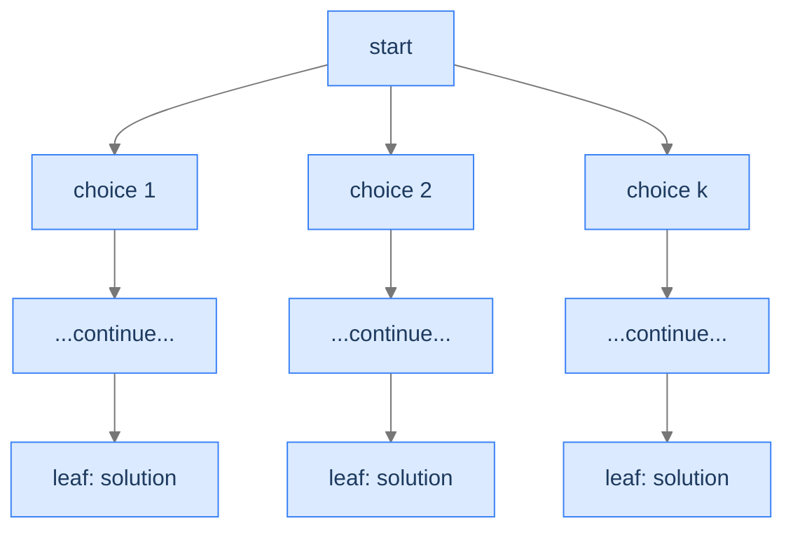
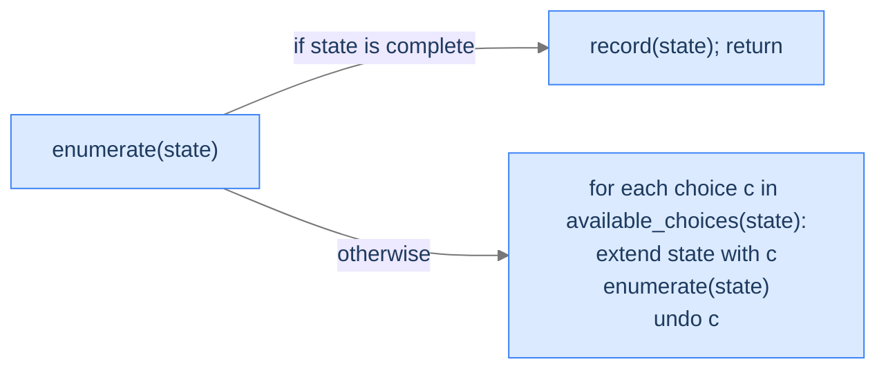
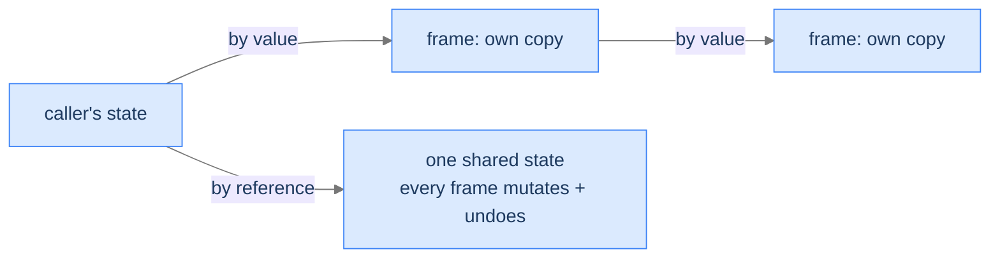
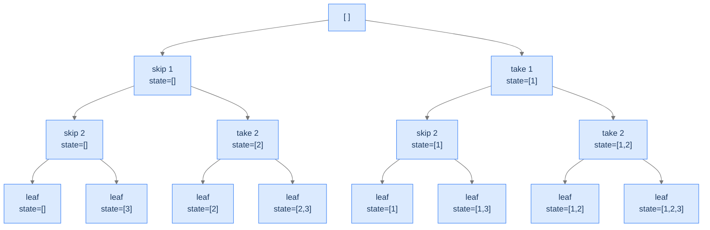
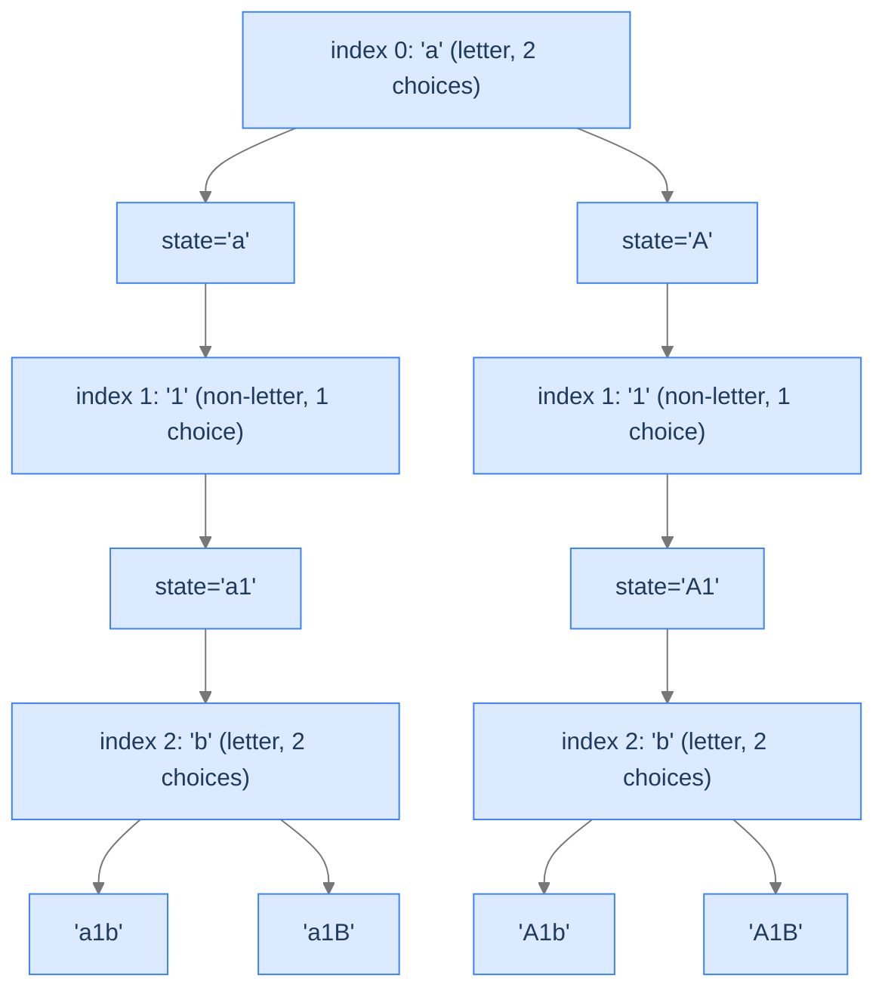
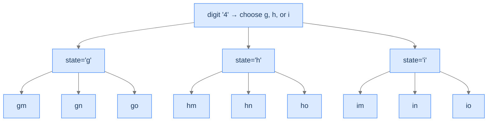

# 2. Pattern: Unconditional Enumeration

You're staring at a problem where the question is *list all the X*. All subsets of an array. All sequences of length `n` from a digit set. All case-toggle variations of a string. Every "all the X" problem has the same structure: there's a *finite* set of candidates; the algorithm has to *visit every one*; nothing about a partial guess can be ruled out before it's complete.

This is **unconditional enumeration** — the simplest of the three backtracking patterns. Every leaf of the state space tree is a valid solution. There's no pruning. No bounding function. The algorithm walks the tree, collects every leaf, returns the lot. The only design decisions you make are *what's a "choice" at each level* and *how do you assemble a leaf into the output*.

By the end of this lesson you'll know the diagnostic checks for unconditional enumeration, the three-line recipe that produces it, and four worked problems that drill the pattern.

## Table of contents

1. [Understanding unconditional enumeration](#understanding-unconditional-enumeration)
2. [Identifying unconditional enumeration](#identifying-unconditional-enumeration)
3. [Unique subsets](#unique-subsets)
4. [Case transformations](#case-transformations)
5. [Number sequence](#number-sequence)
6. [Phone combinations](#phone-combinations)

***

# Understanding Unconditional Enumeration

A backtracking solution exhibits **unconditional enumeration** when **every leaf of the state space tree is a valid solution**. There's no validation function that filters leaves; there's no bounding rule that prunes internal nodes. The algorithm enumerates every candidate the tree can produce, and *all of them count*.

This is exactly the pattern from the introductory phone-password problem. Every 4-digit binary string is a candidate; every leaf gets recorded; the algorithm doesn't say "no" to any leaf. The only difference between problems in this category is the structure of the *choices*: subsets choose include-or-exclude per element, sequences choose a value in `1..k` per slot, phone combinations choose a letter per digit.



<p align="center"><strong>Unconditional enumeration's tree shape: every leaf is recorded; every internal node fans out into <em>all</em> its children. No pruning, no rejection.</strong></p>

The runtime is therefore the *full* tree size. There's no "average case faster than worst case" — every problem in this category does exactly the same work: visit every leaf, record it. The complexity comes entirely from *how many leaves there are* and *how expensive each candidate is to assemble*.

---

## What Unconditional Enumeration Looks Like in Code

The general shape:



<p align="center"><strong>The unconditional-enumeration recipe: when a leaf is reached, record. Otherwise, iterate over choices, extend, recurse, undo.</strong></p>

The pseudocode:

```
function enumerate(state):
    if state is complete:
        record(state)             ← every leaf is a solution
        return

    for choice in available_choices(state):
        extend(state, choice)     ← make a choice
        enumerate(state)          ← recurse
        undo(state)               ← backtrack
```

That `undo(state)` line is the structural backtrack — it puts the state back the way it was before this iteration's `extend()`, so the next iteration's choice starts from the same baseline. In some languages (Python's strings, immutable values) the "undo" is automatic because each recursion level holds its own copy. In others (C++, Rust mutating a vector) you must explicitly `pop_back()` what you just pushed.

> *Predict before reading on — for a problem with `n` slots and `k` choices per slot, how many leaves does the state space tree have? How deep is the recursion?*

`k^n` leaves; recursion depth `n`. The depth grows linearly with `n`; the leaf count grows *exponentially* with `n`. This means: deepening the recursion by 1 doubles (or more) the work — a fact you'll feel viscerally as `n` grows.

---

## Passing Data Down

Two flavours, depending on the language and the size of the partial state:

**By value (immutable per frame):** copy the partial state into the recursive call. Simple, no `undo` step needed — when the function returns, the caller's state is unchanged automatically. The cost is the per-call copy: `O(n)` per call × `O(k^n)` calls = `O(n · k^n)` total work just on copying. For small `n` this is fine.

**By reference (mutated in place):** pass a pointer/reference to a shared partial state. Each frame appends its choice; on return, the next iteration of the for-loop pops it before extending with the next choice. This avoids the `O(n · k^n)` copy overhead but requires explicit `undo`.



<p align="center"><strong>By-value: cleaner, no undo, but O(n) copy per call. By-reference: faster, but requires explicit undo to keep the shared state correct.</strong></p>

Most production backtracking code uses the by-reference style for performance. Most teaching code uses by-value (or per-frame slices) for clarity. We'll use the by-reference style in the four worked problems below, since it makes the explicit `undo` visible.

---

## Passing Data Up

The collected solutions are typically built into a single output container (the **subsets** vector, the **transformations** list, the **sequences** array). Both styles work:

- **Output container shared via reference:** every frame appends complete leaves directly to the same container. Memory-efficient.
- **Output as return value:** each call returns its leaves, parent merges. Cleaner but allocates lots of intermediate lists.

For the same reason as data-down, we use the shared-output-by-reference style throughout.

---

## Algorithm

> **enumerate(state, output)**
>
> 1. **Leaf check** — if `state` is a complete candidate, append a *copy* of it to `output` and return. (Copy because the caller may continue mutating `state` for sibling branches.)
> 2. **Branch** — for each choice in the next-level options:
>    - **Extend** `state` with the choice.
>    - **Recurse** on the extended `state`.
>    - **Undo** the extension (restore `state` to its pre-extension value).

That's the entire recipe. Every problem in this section is a different way of filling in *complete*, *available choices*, *extend*, and *undo*.

---

## Implementation

A clean, language-agnostic implementation of the generic enumeration template — generates all length-`n` sequences over alphabet of size `k`.


```python run
from typing import List

class Solution:
    def enumerate_all(self, n: int, k: int) -> List[List[int]]:
        results: List[List[int]] = []
        state: List[int] = []
        self._helper(n, k, state, results)
        return results

    def _helper(self, n: int, k: int, state: List[int], results: List[List[int]]) -> None:
        # Leaf check — every complete state is a solution
        if len(state) == n:
            results.append(state.copy())   # copy: caller will keep mutating `state`
            return

        # Branch over every available choice for this slot
        for choice in range(1, k + 1):
            state.append(choice)            # extend
            self._helper(n, k, state, results)   # recurse
            state.pop()                     # undo


if __name__ == "__main__":
    print(Solution().enumerate_all(2, 2))   # [[1,1], [1,2], [2,1], [2,2]]
```

```java run
import java.util.ArrayList;
import java.util.List;

public class Main {
    static class Solution {
        public List<List<Integer>> enumerateAll(int n, int k) {
            List<List<Integer>> results = new ArrayList<>();
            List<Integer> state = new ArrayList<>();
            helper(n, k, state, results);
            return results;
        }

        private void helper(int n, int k, List<Integer> state, List<List<Integer>> results) {
            if (state.size() == n) {
                results.add(new ArrayList<>(state));   // copy
                return;
            }
            for (int choice = 1; choice <= k; choice++) {
                state.add(choice);                     // extend
                helper(n, k, state, results);          // recurse
                state.remove(state.size() - 1);        // undo
            }
        }
    }

    public static void main(String[] args) {
        System.out.println(new Solution().enumerateAll(2, 2));   // [[1,1],[1,2],[2,1],[2,2]]
    }
}
```


---

## Complexity Analysis

| Resource | Cost | Why |
|---|---|---|
| **Time** | `O(n · k^n)` | `k^n` leaves × `O(n)` to copy each leaf into the output. |
| **Space (output)** | `O(n · k^n)` | The same `k^n` results, each of size `n`. |
| **Space (stack)** | `O(n)` | Recursion depth = number of slots. |

The output dominates. Your algorithm can never be faster than the size of the output it produces — and unconditional enumeration always produces the full tree's leaves. **The pattern is "as fast as it can possibly be" for the problem of "list every X."**

> **Best Case** — Time `O(n · k^n)`, Space `O(n)` (stack)
>
> **Worst Case** — Same as best — input doesn't change tree size

---

## Key Takeaway

Unconditional enumeration is the simplest backtracking pattern: walk the full state space tree, record every leaf, no pruning. The only knobs you turn are *what's a choice at each level* and *how do you copy a leaf into the output*. Now we'll learn how to spot one.

***

# Identifying Unconditional Enumeration

Three diagnostic questions decide whether unconditional enumeration fits.

| # | Question | If "yes," unconditional enumeration fits because... |
|---|---|---|
| **Q1** | Is **every** complete candidate a valid solution? | No filter at the leaf — record everything. |
| **Q2** | Is the candidate built by making **one decision per slot**? | Each level of the tree is one slot's decision. |
| **Q3** | Is there a **fixed number of choices per slot** (or one bounded by the input)? | The branching factor of the tree is well-defined. |

If all three are "yes," you can write the algorithm in three lines: leaf-check, for-loop over choices, recurse with undo.

### Q1 — Why "every leaf is a solution"?

**Mental model.** If *some* leaves are valid and others aren't, you'd need a validation function to filter — that's conditional enumeration (the Conditional Enumeration lesson), not unconditional. Unconditional means "every leaf the tree can produce is correct by construction."

**Concrete check.** Subsets of `[1, 2, 3]`: every subset is a valid output. ✓

**What breaks otherwise.** "Generate balanced parentheses of length 6" — many leaves of the naive tree (like `)))(((`) aren't balanced. You'd need to filter at the leaf or prune internally. That's conditional enumeration, not unconditional.

### Q2 — Why "one decision per slot"?

**Mental model.** The state space tree's depth equals the number of slots. Each level is one slot, each child is one choice. If a single slot involved multiple decisions glued together, the tree wouldn't be uniform and the recipe would need to bend.

**Concrete check.** Phone combinations: each digit is one slot, each letter for that digit is one choice. ✓

**What breaks otherwise.** Problems where the *number* of slots itself depends on a path-specific decision require more elaborate recursion (often the search pattern, the Backtracking Search lesson).

### Q3 — Why "fixed branching factor"?

**Mental model.** If every slot has `k` choices, the tree is `k`-ary and uniform. If different slots have wildly different choice counts (sometimes 2, sometimes 26), the tree is irregular but still tractable — the algorithm doesn't change. The bound is what matters: a finite, computable number of choices per slot.

**Concrete check.** Case transformations: each character has 1 choice (non-alphabetic) or 2 choices (alphabetic). The branching factor varies but is bounded. ✓

**What breaks otherwise.** Problems where the choice space at a slot is "all subsets of unconsumed inputs" or similar combinatorial explosion typically don't fit unconditional enumeration cleanly — you'd want a permutation-aware structure.

---

## A Worked Example — Length-2 Binary Sequences

> *Pause and predict — list all length-2 sequences of 0s and 1s. How many? What does the state space tree look like?*

Four sequences: `[0,0]`, `[0,1]`, `[1,0]`, `[1,1]`. The tree:

```
                 [ ]                  (root)
              /        \
           append 0   append 1
              |          |
            [0]         [1]
           /   \        /  \
         [0,0] [0,1] [1,0] [1,1]      (leaves)
```

Depth 2, 4 leaves, 7 nodes total. The algorithm walks this depth-first. We'll generalise to length `n` with `k` choices per slot in **Problem 3** below.

---

## Key Takeaway

Three checks — every leaf is a solution, one decision per slot, fixed branching factor — gate every unconditional-enumeration problem. Pass all three and the algorithm slides into the three-line template. Four worked problems coming up. The first is the canonical subsets problem; the second introduces a "skip or transform" choice per slot; the third generalises the slot count and branching factor; the fourth maps each slot to a different choice set.

***

# Unique Subsets

The textbook subsets problem. Each element of the input array becomes one slot in the state space tree; each slot has exactly two choices: include or exclude.

---

## The Problem

Given an integer array `arr` containing **unique** elements, return all possible subsets (the power set). The result must not contain duplicates. Subsets can be returned in any order.

```
Input:  arr = [1, 2, 3]
Output: [[], [1], [2], [1,2], [3], [1,3], [2,3], [1,2,3]]

Input:  arr = [1]
Output: [[], [1]]

Input:  arr = []
Output: [[]]
```

---

<details>
<summary><h2>What Does "Power Set" Mean Recursively?</h2></summary>


For each element of `arr`, you have two choices: **include it in the current subset, or exclude it.** Make this decision once per element, and you've fully specified one subset. There are `n` decisions and `2^n` outcomes — the power set.



<p align="center"><strong>State space tree for subsets of <code>[1, 2, 3]</code>. Depth = 3, leaves = 8 = 2³, every leaf is a valid subset.</strong></p>

</details>
<details>
<summary><h2>Applying the Diagnostic Questions</h2></summary>


| # | Check | Answer |
|---|---|---|
| **Q1** | Every leaf a solution? | **Yes** — every subset (including empty) is a valid output. |
| **Q2** | One decision per slot? | **Yes** — one decision per element: include or exclude. |
| **Q3** | Fixed branching factor? | **Yes** — `k = 2` per slot. |

### Q1 — Why "every subset is valid"?

The power set is *defined* as the set of all subsets, including `{}` and the full input. There's no rule that disqualifies any one of them. ✓

### Q2 — Why "one decision per element"?

The recipe for a subset is a sequence of `n` independent yes/no decisions, one per element. The state space tree's depth equals `n`. ✓

### Q3 — Why "branching factor 2"?

Every element has exactly two choices: include or exclude. The tree is binary. ✓

</details>
<details>
<summary><h2>The Include-or-Exclude Strategy (Visualised)</h2></summary>


We process elements left-to-right. At each element, the state space splits into two branches. The current "partial subset" lives in a shared mutable list; we push when including, pop when undoing.

<div class="d2-slides" data-caption="Each frame either includes the current element (extend, recurse, then pop to undo) or skips it (just recurse).">

```d2
state: "Start at index 0, current = []" {
  arr: "arr = [1, 2, 3]"
  cur: "current = []" {style.fill: "#dbeafe"; style.stroke: "#3b82f6"}
}
```

```d2
state: "Include 1 — current = [1], recurse on index 1" {
  cur: "current = [1]" {style.fill: "#fde68a"; style.stroke: "#d97706"}
}
```

```d2
state: "Include 2 — current = [1, 2], recurse on index 2" {
  cur: "current = [1, 2]" {style.fill: "#bbf7d0"; style.stroke: "#16a34a"}
}
```

```d2
state: "Include 3 — current = [1, 2, 3] = LEAF, record and return" {
  cur: "current = [1, 2, 3]" {style.fill: "#ede9fe"; style.stroke: "#7c3aed"}
}
```

```d2
state: "Backtrack: pop 3 → current = [1, 2], skip 3, leaf [1, 2]" {
  cur: "current = [1, 2]" {style.fill: "#bbf7d0"; style.stroke: "#16a34a"}
}
```

```d2
state: "...backtrack further, eventually visit all 8 leaves" {
  result: "subsets = [[], [3], [2], [2,3], [1], [1,3], [1,2], [1,2,3]]" {style.fill: "#fde68a"; style.stroke: "#d97706"}
}
```

</div>

</details>
<details>
<summary><h2>Solution &amp; Analysis</h2></summary>

### The Solution

```python run
from typing import List

class Solution:
    def generate_subsets(
        self,
        arr: List[int],
        index: int,
        current_subset: List[int],
        subsets: List[List[int]],
    ) -> None:

        # If all elements have been considered (solution state)
        if index == len(arr):

            # Every state is a valid subset -> add directly
            subsets.append(current_subset.copy())

            # Return to explore other possibilities
            return

        # Choices for each element:
        # 1. true -> Include the current element in subset
        # 2. false -> Do not include the current element in subset
        for include_current in (True, False):

            # Include the current element in the subset
            if include_current:

                # Include the current element in the subset (make a
                # choice)
                current_subset.append(arr[index])

                # Recur for the next index in the array including the current
                # element
                self.generate_subsets(
                    arr, index + 1, current_subset, subsets
                )

                # Backtrack by removing the last element (revert the
                # choice)
                current_subset.pop()

            # Do not include the current element in the subset
            else:

                # Recur for the next index in the array without including
                # the current element
                self.generate_subsets(
                    arr, index + 1, current_subset, subsets
                )

    def unique_subsets(self, arr: List[int]) -> List[List[int]]:

        # List to store the subsets
        subsets: List[List[int]] = []

        # Temporary list to store the current subset
        current_subset: List[int] = []

        # Start backtracking from index 0
        self.generate_subsets(arr, 0, current_subset, subsets)

        # Return the list containing all subsets
        return subsets


# Examples from the problem statement
print(sorted(Solution().unique_subsets([1, 2, 3])))  # [[], [1], [1, 2], [1, 2, 3], [1, 3], [2], [2, 3], [3]]
print(sorted(Solution().unique_subsets([1])))        # [[], [1]]
print(sorted(Solution().unique_subsets([])))         # [[]]

# Edge cases
print(sorted(Solution().unique_subsets([5, 10])))    # [[], [5], [5, 10], [10]]
print(len(Solution().unique_subsets([1, 2, 3, 4]))) # 16
```

```java run
import java.util.*;

public class Main {
    static class Solution {
        public void generateSubsets(
            int[] arr,
            int index,
            List<Integer> currentSubset,
            List<List<Integer>> subsets
        ) {

            // If all elements have been considered (solution state)
            if (index == arr.length) {

                // Every state is a valid subset -> add directly
                subsets.add(new ArrayList<>(currentSubset));

                // Return to explore other possibilities
                return;
            }

            // Choices for each element:
            // 1. true -> Include the current element in subset
            // 2. false -> Do not include the current element in subset
            for (boolean includeCurrent : new boolean[] { true, false }) {

                // Include the current element in the subset
                if (includeCurrent) {

                    // Include the current element in the subset (make a
                    // choice)
                    currentSubset.add(arr[index]);

                    // Recur for the next index in the array including the
                    // current element
                    generateSubsets(arr, index + 1, currentSubset, subsets);

                    // Backtrack by removing the last element (revert the
                    // choice)
                    currentSubset.remove(currentSubset.size() - 1);
                }

                // Do not include the current element in the subset
                else {

                    // Recur for the next index in the array without
                    // including the current element
                    generateSubsets(arr, index + 1, currentSubset, subsets);
                }
            }
        }

        public List<List<Integer>> uniqueSubsets(int[] arr) {

            // List to store the subsets
            List<List<Integer>> subsets = new ArrayList<>();

            // Temporary list to store the current subset
            List<Integer> currentSubset = new ArrayList<>();

            // Start backtracking from index 0
            generateSubsets(arr, 0, currentSubset, subsets);

            // Return the list containing all subsets
            return subsets;
        }
    }

    public static void main(String[] args) {
        // Examples from the problem statement
        List<List<Integer>> r1 = new Solution().uniqueSubsets(new int[]{1, 2, 3});
        r1.forEach(Collections::sort); Collections.sort(r1, (a, b) -> a.toString().compareTo(b.toString()));
        System.out.println(r1);  // [[], [1], [1, 2], [1, 2, 3], [1, 3], [2], [2, 3], [3]]

        List<List<Integer>> r2 = new Solution().uniqueSubsets(new int[]{1});
        r2.forEach(Collections::sort); Collections.sort(r2, (a, b) -> a.toString().compareTo(b.toString()));
        System.out.println(r2);  // [[], [1]]

        List<List<Integer>> r3 = new Solution().uniqueSubsets(new int[]{});
        System.out.println(r3);  // [[]]

        // Edge cases
        List<List<Integer>> r4 = new Solution().uniqueSubsets(new int[]{5, 10});
        r4.forEach(Collections::sort); Collections.sort(r4, (a, b) -> a.toString().compareTo(b.toString()));
        System.out.println(r4);  // [[], [10], [5], [5, 10]]

        System.out.println(new Solution().uniqueSubsets(new int[]{1, 2, 3, 4}).size());  // 16
    }
}
```


<details>
<summary><strong>Trace — arr = [1, 2, 3]</strong></summary>

```
helper(0, [])
├─ include 1 → helper(1, [1])
│  ├─ include 2 → helper(2, [1,2])
│  │  ├─ include 3 → helper(3, [1,2,3]) → leaf → results = [[1,2,3]]
│  │  ├─ undo (pop 3)
│  │  └─ skip 3 → helper(3, [1,2]) → leaf → results = [[1,2,3], [1,2]]
│  ├─ undo (pop 2)
│  └─ skip 2 → helper(2, [1])
│     ├─ include 3 → helper(3, [1,3]) → leaf → results = [..., [1,3]]
│     ├─ undo (pop 3)
│     └─ skip 3 → helper(3, [1]) → leaf → results = [..., [1]]
├─ undo (pop 1)
└─ skip 1 → helper(1, [])
   ├─ include 2 → ... (mirror of above without the 1)
   └─ ...

Final results: [[1,2,3], [1,2], [1,3], [1], [2,3], [2], [3], []]
(8 leaves, in DFS order)
```

</details>

### Complexity Analysis

| Resource | Cost | Why |
|---|---|---|
| **Time** | `O(n · 2^n)` | `2^n` subsets × `O(n)` to copy each into the output. |
| **Space (output)** | `O(n · 2^n)` | Total size of all subsets summed. |
| **Space (stack)** | `O(n)` | Recursion depth equals input length. |

The output dominates; you can never be faster than this.

### Edge Cases

| Case | Example | Expected | Reasoning |
|---|---|---|---|
| Empty input | `arr = []` | `[[]]` | Only the empty subset; tree has just the root. |
| Single element | `arr = [5]` | `[[], [5]]` | Two leaves. |
| Duplicates in input | `arr = [1, 1]` (problem says unique, but…) | algorithm produces `[[], [1], [1], [1,1]]` — has dupes | The problem statement guarantees unique elements; if not, we'd need to dedupe (a different problem variant). |
| Larger input | `arr = [1..20]` | 2²⁰ ≈ 1M subsets | Output size is the bottleneck. |

</details>
<details>
<summary><h2>Final Takeaway</h2></summary>


Unique Subsets is the canonical 2-choice unconditional enumeration: include-or-exclude, depth equals input length, every leaf valid. The next problem applies the same shape but with a *conditional* choice: only some slots have two choices; others are forced.

</details>

***

# Case Transformations

The branching factor varies per slot. Letters have 2 choices (toggle or keep); non-letters have 1 choice (keep). Same recipe; different choice generation.

---

## The Problem

Given a string `s`, return every possible string formed by transforming each *letter* (alphabetic character) to either lowercase or uppercase. Non-letters stay as-is. Output may be in any order.

```
Input:  s = "a1b2"
Output: ["a1b2", "a1B2", "A1b2", "A1B2"]

Input:  s = "3z4"
Output: ["3Z4", "3z4"]

Input:  s = "a"
Output: ["a", "A"]
```

---

<details>
<summary><h2>What's Different About This Problem?</h2></summary>


The branching factor depends on the slot. For a letter, you have two choices: leave it as-is or toggle the case. For a non-letter (digit, symbol), you have one choice: leave it as-is. The state space tree is *non-uniform* but the recipe is identical:



<p align="center"><strong>Tree for <code>s = "a1b2"</code> (showing only first 3 chars). Letter slots branch 2-way; digit slots branch 1-way. The non-uniform tree still produces a clean enumeration.</strong></p>

</details>
<details>
<summary><h2>Applying the Diagnostic Questions</h2></summary>


| # | Check | Answer |
|---|---|---|
| **Q1** | Every leaf a solution? | **Yes** — every case-toggle combination is a valid output. |
| **Q2** | One decision per slot? | **Yes** — one decision per character. |
| **Q3** | Fixed (or bounded) branching factor? | **Yes** — 1 for non-letters, 2 for letters; bounded. |

### Q1 — Why "every leaf valid"?

The output is defined as "every possible case combination" — none are excluded. ✓

### Q2 — Why "one decision per character"?

Each character is processed independently. ✓

### Q3 — Why "branching bounded"?

Per-slot branching is either 1 or 2 — bounded by 2. The tree is finite and walkable. ✓

</details>
<details>
<summary><h2>Solution &amp; Analysis</h2></summary>

### The Solution

```python run
from typing import List

class Solution:
    def toggle_case(self, c: str) -> str:

        # If the character is in lowercase, return the uppercase version
        if c.islower():
            return c.upper()

        # Otherwise, if the character is in uppercase, return the
        # lowercase version
        else:
            return c.lower()

    def generate_transformations(
        self,
        s: str,
        index: int,
        current_transformation: List[str],
        transformations: List[str],
    ) -> None:

        # If index reaches the end of the string, store the current
        # transformation (solution state)
        if index == len(s):

            # Add the current transformation to the result
            transformations.append("".join(current_transformation))

            # Return to continue exploring other possibilities
            return

        # Choices for each element:
        # 1. true -> Toggle the case of the current character
        # 2. false -> Do not toggle the case of the current character
        for toggle_current in (True, False):

            # Toggle the case of the current character if it is an
            # alphabet
            if toggle_current and s[index].isalpha():

                # Make choice: toggle the case and append to
                # currentTransformation
                current_transformation.append(self.toggle_case(s[index]))

                # Recur with next index
                self.generate_transformations(
                    s, index + 1, current_transformation, transformations
                )

                # Unmake choice: remove the last character
                current_transformation.pop()

            elif not toggle_current:

                # Make choice: keep original character
                current_transformation.append(s[index])

                # Recur with next index
                self.generate_transformations(
                    s, index + 1, current_transformation, transformations
                )

                # Unmake choice: remove the last character
                current_transformation.pop()

    def case_transformations(self, s: str) -> List[str]:

        # List to store the transformations
        transformations: List[str] = []

        # Working string for backtracking
        current_transformation: List[str] = []

        # Start the unconditional enumeration process from index 0
        self.generate_transformations(
            s, 0, current_transformation, transformations
        )

        # Return the list containing all transformations
        return transformations


# Examples from the problem statement
print(sorted(Solution().case_transformations("a1b2")))   # ['A1B2', 'A1b2', 'a1B2', 'a1b2']
print(sorted(Solution().case_transformations("3z4")))    # ['3Z4', '3z4']
print(sorted(Solution().case_transformations("a")))      # ['A', 'a']

# Edge cases
print(sorted(Solution().case_transformations("1")))      # ['1']
print(sorted(Solution().case_transformations("ab")))     # ['AB', 'Ab', 'aB', 'ab']
print(len(Solution().case_transformations("abc")))       # 8
```

```java run
import java.util.*;

public class Main {
    static class Solution {
        private char toggleCase(char c) {

            // If the character is in lowercase, return the uppercase version
            if (Character.isLowerCase(c)) {
                return Character.toUpperCase(c);
            }

            // Otherwise, if the character is in uppercase, return the
            // lowercase version
            else {
                return Character.toLowerCase(c);
            }
        }

        private void generateTransformations(
            String s,
            int index,
            StringBuilder currentTransformation,
            List<String> transformations
        ) {

            // If index reaches the end of the string, store the current
            // transformation (solution state)
            if (index == s.length()) {

                // Add the current transformation to the result
                transformations.add(currentTransformation.toString());

                // Return to continue exploring other possibilities
                return;
            }

            // Choices for each element:
            // 1. true -> Toggle the case of the current character
            // 2. false -> Do not toggle the case of the current character
            for (boolean toggleCurrent : new boolean[] { true, false }) {

                // Toggle the case of the current character if it is an
                // alphabet
                if (toggleCurrent && Character.isLetter(s.charAt(index))) {

                    // Make choice: toggle the case and append to
                    // currentTransformation
                    currentTransformation.append(
                        toggleCase(s.charAt(index))
                    );

                    // Recur with next index
                    generateTransformations(
                        s,
                        index + 1,
                        currentTransformation,
                        transformations
                    );

                    // Unmake choice: remove the last character
                    currentTransformation.deleteCharAt(
                        currentTransformation.length() - 1
                    );
                } else if (!toggleCurrent) {

                    // Make choice: keep original character
                    currentTransformation.append(s.charAt(index));

                    // Recur with next index
                    generateTransformations(
                        s,
                        index + 1,
                        currentTransformation,
                        transformations
                    );

                    // Unmake choice: remove the last character
                    currentTransformation.deleteCharAt(
                        currentTransformation.length() - 1
                    );
                }
            }
        }

        public List<String> caseTransformations(String s) {

            // List to store the transformations
            List<String> transformations = new ArrayList<>();

            // Working string for backtracking
            StringBuilder currentTransformation = new StringBuilder();

            // Start the unconditional enumeration process from index 0
            generateTransformations(
                s,
                0,
                currentTransformation,
                transformations
            );

            // Return the list containing all transformations
            return transformations;
        }
    }

    public static void main(String[] args) {
        // Examples from the problem statement
        List<String> r1 = new Solution().caseTransformations("a1b2");
        Collections.sort(r1); System.out.println(r1);   // [A1B2, A1b2, a1B2, a1b2]

        List<String> r2 = new Solution().caseTransformations("3z4");
        Collections.sort(r2); System.out.println(r2);   // [3Z4, 3z4]

        List<String> r3 = new Solution().caseTransformations("a");
        Collections.sort(r3); System.out.println(r3);   // [A, a]

        // Edge cases
        List<String> r4 = new Solution().caseTransformations("1");
        Collections.sort(r4); System.out.println(r4);   // [1]

        List<String> r5 = new Solution().caseTransformations("ab");
        Collections.sort(r5); System.out.println(r5);   // [AB, Ab, aB, ab]

        System.out.println(new Solution().caseTransformations("abc").size());  // 8
    }
}
```


<details>
<summary><strong>Trace — s = "a1b"</strong></summary>

```
helper(0, [])
├─ append 'a' → helper(1, ['a'])
│  ├─ append '1' → helper(2, ['a','1'])
│  │  ├─ append 'b' → helper(3, [...,'b']) → leaf → "a1b"
│  │  ├─ pop, append 'B' → helper(3, [...,'B']) → leaf → "a1B"
│  │  └─ pop
│  └─ pop '1'  (only one choice for digit, no second branch)
├─ pop 'a', append 'A' → helper(1, ['A'])
│  └─ ... (mirror)

Final: ['a1b', 'a1B', 'A1b', 'A1B']
```

</details>

### Complexity Analysis

| Resource | Cost | Why |
|---|---|---|
| **Time** | `O(n · 2^L)` where `L` = number of letters | `2^L` results × `O(n)` per copy. |
| **Space (output)** | `O(n · 2^L)` | Same reasoning. |
| **Space (stack)** | `O(n)` | Depth = input length. |

Notice: the exponent is the *letter count*, not the string length. Strings with no letters have a single output (`"123" → ["123"]`).

### Edge Cases

| Case | Example | Expected |
|---|---|---|
| All letters | `"abc"` | 8 outputs (`2³`). |
| No letters | `"123"` | 1 output (`["123"]`). |
| Empty | `""` | `[""]` — single empty result. |
| Mixed | `"a1b"` | 4 outputs. |
| Already mixed-case | `"aA"` | 4 outputs (each letter toggled independently). |

</details>
<details>
<summary><h2>Final Takeaway</h2></summary>


Case Transformations shows unconditional enumeration with a *variable* branching factor per slot. The recipe doesn't change; only the inner `for` loop's range adapts to the current slot. Next, we generalise the slot count and choice set with a numerical sequence problem.

</details>

***

# Number Sequence

Both slot count and branching factor become parameters. This is the most general unconditional-enumeration shape in this section.

---

## The Problem

Given non-negative integers `n` and `k`, return all sequences of length `n` whose elements are integers in `[1, k]`. Sequences may repeat values; order may be any.

```
Input:  n = 2, k = 2
Output: [[1,1], [1,2], [2,1], [2,2]]

Input:  n = 3, k = 1
Output: [[1,1,1]]

Input:  n = 1, k = 4
Output: [[1], [2], [3], [4]]
```

---

<details>
<summary><h2>What Does the State Space Tree Look Like?</h2></summary>


Depth `n`, branching factor `k`, every leaf valid. `k^n` total leaves — exactly the generic enumeration template.

</details>
<details>
<summary><h2>Solution &amp; Analysis</h2></summary>

### The Solution

```python run
from typing import List

class Solution:
    def generate_sequence(
        self,
        n: int,
        k: int,
        index: int,
        current_sequence: List[int],
        sequences: List[List[int]],
    ) -> None:

        # If the current sequence has reached length n (solution state)
        if index == n:

            # Add the complete sequence to the result
            sequences.append(current_sequence.copy())

            # Return to continue exploring other possibilities
            return

        # Get all possible choices for the current position
        # (numbers 1..k)
        for choice in range(1, k + 1):

            # Add current number to the current sequence (make choice)
            current_sequence.append(choice)

            # Recurse to fill the next position in the sequence
            self.generate_sequence(
                n, k, index + 1, current_sequence, sequences
            )

            # Backtrack by removing the last added number (revert
            # choice)
            current_sequence.pop()

    def number_sequence(self, n: int, k: int) -> List[List[int]]:

        # Stores all generated sequences (solution states)
        sequences: List[List[int]] = []

        # Stores the current sequence being built (state)
        current_sequence: List[int] = []

        # Generate all sequences using backtracking
        self.generate_sequence(n, k, 0, current_sequence, sequences)

        # Return the list containing all sequences
        return sequences


# Examples from the problem statement
print(Solution().number_sequence(2, 2))   # [[1, 1], [1, 2], [2, 1], [2, 2]]
print(Solution().number_sequence(3, 1))   # [[1, 1, 1]]
print(Solution().number_sequence(1, 4))   # [[1], [2], [3], [4]]

# Edge cases
print(Solution().number_sequence(0, 3))   # [[]]
print(Solution().number_sequence(1, 1))   # [[1]]
print(len(Solution().number_sequence(3, 3)))  # 27
```

```java run
import java.util.*;

public class Main {
    static class Solution {
        private void generateSequence(
            int n,
            int k,
            int index,
            List<Integer> currentSequence,
            List<List<Integer>> sequences
        ) {

            // If the current sequence has reached length n (solution state)
            if (index == n) {

                // Add the complete sequence to the result
                sequences.add(new ArrayList<>(currentSequence));

                // Return to continue exploring other possibilities
                return;
            }

            // Get all possible choices for the current position
            // (numbers 1..k)
            for (int choice = 1; choice <= k; choice++) {

                // Add current number to the current sequence (make choice)
                currentSequence.add(choice);

                // Recurse to fill the next position in the sequence
                generateSequence(
                    n,
                    k,
                    index + 1,
                    currentSequence,
                    sequences
                );

                // Backtrack by removing the last added number (revert
                // choice)
                currentSequence.remove(currentSequence.size() - 1);
            }
        }

        public List<List<Integer>> numberSequence(int n, int k) {

            // Stores all generated sequences (solution states)
            List<List<Integer>> sequences = new ArrayList<>();

            // Stores the current sequence being built (state)
            List<Integer> currentSequence = new ArrayList<>();

            // Generate all sequences using backtracking
            generateSequence(n, k, 0, currentSequence, sequences);

            // Return the list containing all sequences
            return sequences;
        }
    }

    public static void main(String[] args) {
        // Examples from the problem statement
        System.out.println(new Solution().numberSequence(2, 2));   // [[1, 1], [1, 2], [2, 1], [2, 2]]
        System.out.println(new Solution().numberSequence(3, 1));   // [[1, 1, 1]]
        System.out.println(new Solution().numberSequence(1, 4));   // [[1], [2], [3], [4]]

        // Edge cases
        System.out.println(new Solution().numberSequence(0, 3));   // [[]]
        System.out.println(new Solution().numberSequence(1, 1));   // [[1]]
        System.out.println(new Solution().numberSequence(3, 3).size());  // 27
    }
}
```

### Complexity Analysis

| Resource | Cost |
|---|---|
| **Time** | `O(n · k^n)` |
| **Space (output)** | `O(n · k^n)` |
| **Space (stack)** | `O(n)` |

### Edge Cases

| Case | Example | Expected |
|---|---|---|
| `n = 0` | `n = 0, k = 5` | `[[]]` |
| `k = 0` | `n = 2, k = 0` | `[]` (no choices, no leaves) |
| `n = 1` | `n = 1, k = 4` | `[[1], [2], [3], [4]]` |
| Largish | `n = 6, k = 4` | 4096 sequences |

</details>
<details>
<summary><h2>Final Takeaway</h2></summary>


Number Sequence is the cleanest demonstration of unconditional enumeration's general shape: depth-`n`, `k`-ary tree, every leaf valid. The next problem maps each slot to a *different* choice set instead of a uniform `[1, k]`.

</details>

***

# Phone Combinations

The classic phone-keypad problem. Each digit's set of letters is different — branching factor varies per slot — but every leaf is still a valid output.

---

## The Problem

Given a string `digits` consisting of digits `2`–`9`, return all letter combinations the digits could represent on a phone keypad. Mapping:

| Digit | Letters |
|---|---|
| 2 | abc |
| 3 | def |
| 4 | ghi |
| 5 | jkl |
| 6 | mno |
| 7 | pqrs |
| 8 | tuv |
| 9 | wxyz |

```
Input:  digits = "46"
Output: ["gm", "gn", "go", "hm", "hn", "ho", "im", "in", "io"]

Input:  digits = "28"
Output: ["at", "au", "av", "bt", "bu", "bv", "ct", "cu", "cv"]

Input:  digits = "2"
Output: ["a", "b", "c"]
```

---

<details>
<summary><h2>State Space Tree</h2></summary>


For `digits = "46"`:



<p align="center"><strong>Tree for <code>digits = "46"</code>. Digit 4's branching factor is 3 (g/h/i); digit 6's branching factor is 3 (m/n/o). Total leaves = 9 = 3 × 3.</strong></p>

</details>
<details>
<summary><h2>Solution &amp; Analysis</h2></summary>

### The Solution

```python run
from typing import List

class Solution:

    # Mapping of digits to their corresponding letters (telephone button
    # mapping)
    phone_mapping: List[str] = [
        "",
        "",
        "abc",
        "def",
        "ghi",
        "jkl",
        "mno",
        "pqrs",
        "tuv",
        "wxyz",
    ]

    def generate_combinations(
        self,
        digits: str,
        index: int,
        current_combination: List[str],
        combinations: List[str],
    ) -> None:

        # If the current combination has reached the length of digits,
        # add it to combinations (solution state)
        if index == len(digits):

            # Add the complete combination to the result
            combinations.append("".join(current_combination))

            # Return to continue exploring other possibilities
            return

        # Get the current digit
        digit = digits[index]

        # Get the corresponding string of letters for the current digit
        letters = self.phone_mapping[int(digit)]

        # Try every letter corresponding to the current digit (all
        # choices)
        for letter in letters:

            # Add the letter to the current combination (make choice)
            current_combination.append(letter)

            # Recur with the next digit (reduced input -> index + 1)
            self.generate_combinations(
                digits, index + 1, current_combination, combinations
            )

            # No need to explicitly backtrack in strings
            current_combination.pop()

    def phone_combinations(self, digits: str) -> List[str]:

        # If the input digits are empty, return an empty result
        if not digits:
            return []

        # List to store the combinations
        combinations: List[str] = []

        # Temporary string to store the current combination (state)
        current_combination: List[str] = []

        # Start the unconditional enumeration process from index 0
        self.generate_combinations(
            digits, 0, current_combination, combinations
        )

        # Return the list containing all combinations
        return combinations


# Examples from the problem statement
print(Solution().phone_combinations("46"))   # ['gm', 'gn', 'go', 'hm', 'hn', 'ho', 'im', 'in', 'io']
print(Solution().phone_combinations("28"))   # ['at', 'au', 'av', 'bt', 'bu', 'bv', 'ct', 'cu', 'cv']
print(Solution().phone_combinations("2"))    # ['a', 'b', 'c']

# Edge cases
print(Solution().phone_combinations(""))     # []
print(Solution().phone_combinations("9"))    # ['w', 'x', 'y', 'z']
print(len(Solution().phone_combinations("23")))  # 9
```

```java run
import java.util.*;

public class Main {
    static class Solution {

        // Mapping of digits to their corresponding letters (telephone button
        // mapping)
        private final String[] phoneMapping = {
            "",
            "",
            "abc",
            "def",
            "ghi",
            "jkl",
            "mno",
            "pqrs",
            "tuv",
            "wxyz"
        };

        private void generateCombinations(
            String digits,
            int index,
            StringBuilder currentCombination,
            List<String> combinations
        ) {

            // If the current combination has reached the length of digits,
            // add it to combinations (solution state)
            if (index == digits.length()) {

                // Add the current combination to the result
                combinations.add(currentCombination.toString());

                // Return to continue exploring other possibilities
                return;
            }

            // Get the current digit
            char digit = digits.charAt(index);

            // Get the corresponding string of letters for the current digit
            String letters = phoneMapping[digit - '0'];

            // Try every letter corresponding to the current digit (all
            // choices)
            for (char letter : letters.toCharArray()) {

                // Add the letter to the current combination (make choice)
                currentCombination.append(letter);

                // Recur with the next digit (reduced input -> index + 1)
                generateCombinations(
                    digits,
                    index + 1,
                    currentCombination,
                    combinations
                );

                // Remove the last letter to backtrack (revert choice)
                currentCombination.deleteCharAt(
                    currentCombination.length() - 1
                );
            }
        }

        public List<String> phoneCombinations(String digits) {

            // If the input digits are empty, return an empty result
            if (digits.isEmpty()) {
                return new ArrayList<>();
            }

            // List to store the combinations
            List<String> combinations = new ArrayList<>();

            // Temporary string to store the current combination (state)
            StringBuilder currentCombination = new StringBuilder();

            // Start the unconditional enumeration process from index 0
            generateCombinations(
                digits,
                0,
                currentCombination,
                combinations
            );

            // Return the list containing all combinations
            return combinations;
        }
    }

    public static void main(String[] args) {
        // Examples from the problem statement
        System.out.println(new Solution().phoneCombinations("46"));   // [gm, gn, go, hm, hn, ho, im, in, io]
        System.out.println(new Solution().phoneCombinations("28"));   // [at, au, av, bt, bu, bv, ct, cu, cv]
        System.out.println(new Solution().phoneCombinations("2"));    // [a, b, c]

        // Edge cases
        System.out.println(new Solution().phoneCombinations(""));     // []
        System.out.println(new Solution().phoneCombinations("9"));    // [w, x, y, z]
        System.out.println(new Solution().phoneCombinations("23").size());  // 9
    }
}
```

### Complexity Analysis

| Resource | Cost |
|---|---|
| **Time** | `O(n · 4^n)` worst case (digits 7 and 9 have 4 letters) |
| **Space (output)** | `O(n · 4^n)` |
| **Space (stack)** | `O(n)` |

### Edge Cases

| Case | Example | Expected |
|---|---|---|
| Empty | `""` | `[]` |
| Single digit | `"3"` | `["d", "e", "f"]` |
| All max-branch | `"77"` | 16 outputs (`4²`). |
| Mixed branching | `"23"` | 9 outputs (`3 × 3`). |

</details>
<details>
<summary><h2>Final Takeaway</h2></summary>


Phone Combinations is unconditional enumeration with a *slot-specific* choice set. The recipe still applies — only the inner loop reads its choices from a per-slot table. With these four problems, you've now seen unconditional enumeration's full vocabulary: fixed branching, variable branching, parameterised branching, and table-driven branching. The next lesson lifts the central restriction: not every leaf is a solution any more, and we have to *check* on the way.

You came in suspecting backtracking was a single algorithm. You're leaving with the simplest of three patterns named, plus four worked examples that fit the same three-line template. Next we add validation — and with it, the pruning that makes backtracking practical for real-world problems.

**Transfer challenge — try before the Conditional Enumeration lesson:** Generate all permutations of `[1, 2, 3]`. Sketch the state space tree. **Hint:** unlike subsets, each level's choice set is "the elements not yet used." Is this still unconditional enumeration?

<details>
<summary><strong>Answer — open after you've sketched it</strong></summary>

The state space tree for permutations of `[1, 2, 3]` has `3! = 6` leaves. Each level represents a position in the permutation; each child is a choice of "which unused element goes here":

```
                        []                        (root)
              /          |          \
            [1]         [2]         [3]           (level 1)
           /   \       /   \       /   \
        [1,2] [1,3] [2,1] [2,3] [3,1] [3,2]       (level 2)
          |     |     |     |     |     |
       [1,2,3][1,3,2][2,1,3][2,3,1][3,1,2][3,2,1] (level 3 = leaves)
```

This *is* still unconditional enumeration — every leaf is a valid permutation. But notice the **branching factor shrinks** with depth: 3 → 2 → 1, because each used element is removed from the choice pool. The tree is non-uniform but every leaf is valid; the recipe is the same.

**You just sketched a problem that bridges into the Conditional Enumeration lesson.** Permutation-with-constraints (e.g., "permutations whose first element isn't `1`") would be conditional enumeration; constraint-free permutations are unconditional. The structural form of "remove from choice pool, recurse, restore" generalises everywhere.

</details>

</details>