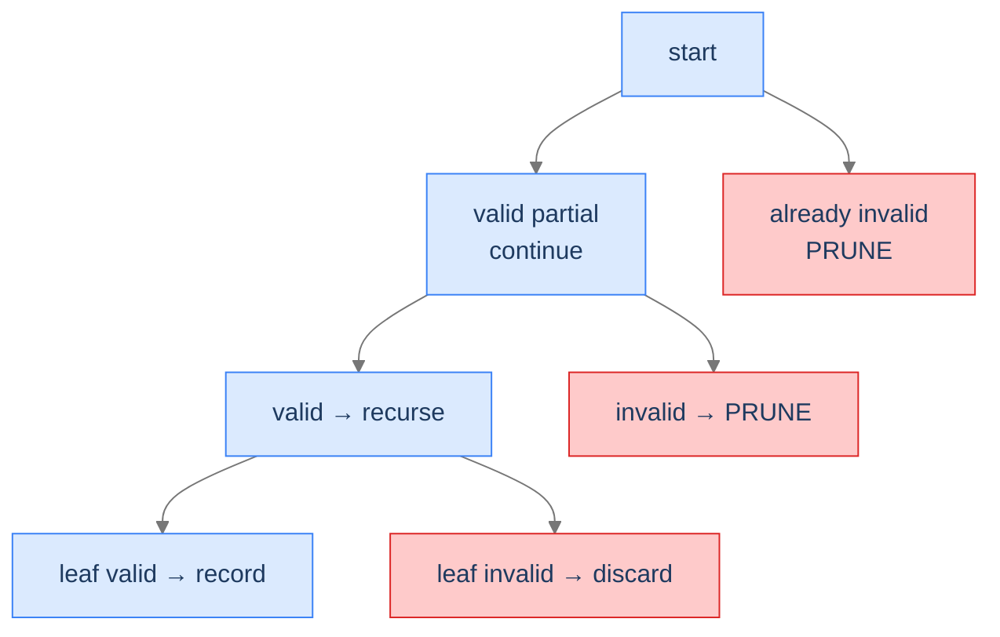
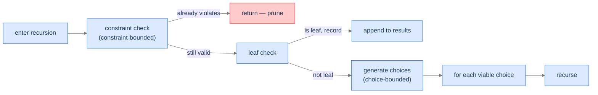
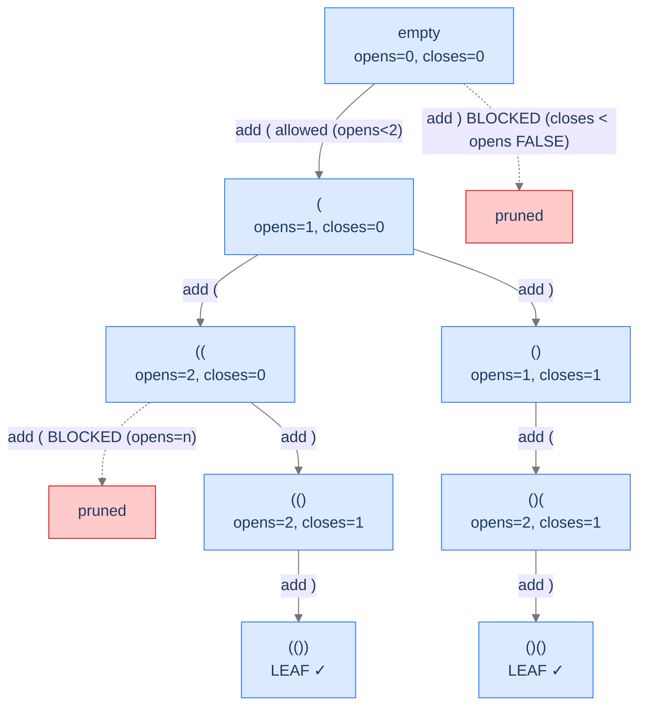
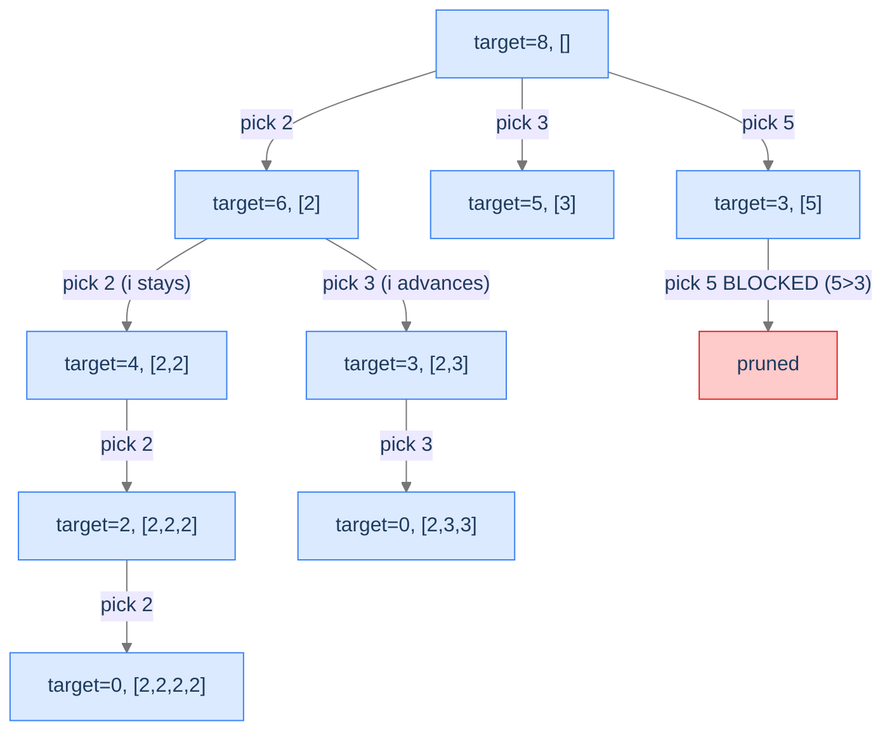
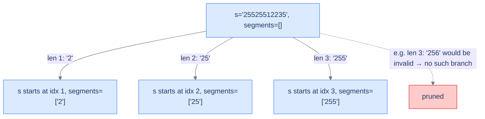
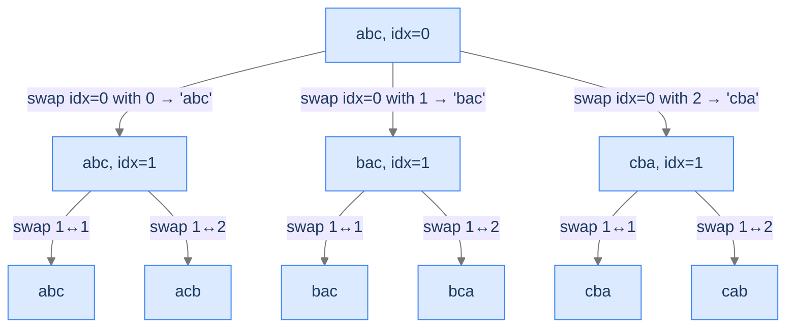

# 3. Pattern: Conditional Enumeration

Unconditional enumeration walks the full state space tree and records every leaf. **Conditional enumeration** does something smarter: at each step, it filters which branches it bothers to explore. Some leaves are valid solutions; others aren't. Some partial guesses can't possibly extend to a valid solution; the algorithm prunes them before walking their subtrees.

The leverage from pruning is exponential. A 2-way decision pruned at depth `d` skips a subtree of `2^(n-d)` leaves. For a tree of depth 30, pruning at depth 10 saves 2²⁰ ≈ 1 million leaves per pruned branch. Multiply by the number of branches you prune and you've turned an intractable brute-force search into something a laptop solves in milliseconds.

By the end of this lesson you'll know what makes a problem "conditional" rather than unconditional, two flavours of pruning (constraint-bounded and choice-bounded), the diagnostic checks for spotting it, and four worked problems that anchor the pattern.

## Table of contents

1. [Understanding conditional enumeration](#understanding-conditional-enumeration)
2. [Identifying conditional enumeration](#identifying-conditional-enumeration)
3. [Generate parentheses](#generate-parentheses)
4. [Target sum combinations](#target-sum-combinations)
5. [Generate IP addresses](#generate-ip-addresses)
6. [String permutations](#string-permutations)

***

# Understanding Conditional Enumeration

A backtracking solution exhibits **conditional enumeration** when **some leaves of the state space tree aren't valid solutions** *or* **some internal nodes can be pruned because no descendant of theirs could possibly be valid**. The algorithm validates as it goes, abandons doomed paths early, and only records leaves that survive every check.

The cleanest way to see this is to compare with the unconditional template from the previous lesson. There, *every* leaf was recorded. Here, leaves are recorded only if they pass a validation check, and **internal nodes are pruned** the moment we know they can't extend to a solution.



<p align="center"><strong>Conditional enumeration's tree shape: red nodes are pruned without exploration; green leaves are recorded only if they pass validation. The pruning is the speedup.</strong></p>

The runtime is *no longer* the full tree size. It's the size of the **explored** portion — the portion the pruning didn't cut off. For well-pruned problems, this can be exponentially smaller than the full tree. The pruning function is therefore the heart of every conditional-enumeration solution.

---

## Two Flavours of Pruning

Pruning happens in one of two places, and most problems use both:

**1. Choice-bounded pruning.** When generating choices for the next slot, *don't generate* the ones that would lead to invalid states. The `for` loop only iterates over choices that are still viable.

**2. Constraint-bounded pruning.** Inside the recursion, check the current partial state. If it already violates a constraint, return immediately without recursing further.



<p align="center"><strong>Both kinds of pruning. Choice-bounded never even creates a doomed branch; constraint-bounded checks at the top of the recursion and returns early.</strong></p>

Generate Parentheses below uses choice-bounded pruning (the `getChoices` function only returns characters that won't break balance). Target Sum uses constraint-bounded (skips array entries larger than the remaining target). Most real problems combine both.

---

## What Conditional Enumeration Looks Like in Code

The general shape:

```
function enumerate(state):
    if state already violates a constraint:
        return                              ← constraint-bounded prune

    if state is a complete candidate:
        if state is a valid solution:
            record(state)
        return

    for choice in viable_choices(state):    ← choice-bounded prune happens here
        extend(state, choice)
        enumerate(state)
        undo(state)
```

The two prunes appear in the two highlighted lines. Either one alone is sufficient for some problems; both together is the most powerful form.

> *Predict before reading on — for "all balanced parentheses of length 6" with no pruning at all, how many leaves does the tree have? With perfect pruning, how many leaves are valid?*

Without pruning, length-6 strings of `(` and `)` total `2⁶ = 64` candidates. With pruning, only 5 are balanced (`(((()))`, `(()(())`, `(()()()`, `(())()`, `()()()`). The pruning saves us from generating 59 doomed candidates out of 64 — about 92% of the work.

---

## Passing Data Down

Same options as unconditional: by-value (immutable) or by-reference (mutated, with explicit undo). The conditional case adds **state for constraint checking** — typically a few additional integers (counts, running sum, etc.) that ride along with the partial state.

For Generate Parentheses, the additional state is `(open_count, close_count)`. For Target Sum, it's `remaining_target`. For Generate IPs, it's the position in the string and the count of segments built so far. The auxiliary state is what makes choice-bounded pruning possible — without knowing how many `(` we've placed, we can't decide whether to allow another one.

---

## Algorithm

> **enumerate(state, aux)**
>
> 1. **Constraint check** — if `state` already violates a constraint, return.
> 2. **Leaf check** — if `state` is a complete candidate, validate; if valid, record.
> 3. **Generate viable choices** — compute the set of choices that don't immediately violate any constraint.
> 4. **Branch** — for each viable choice:
>    - Extend `state` and update `aux`.
>    - Recurse.
>    - Undo the extension.

Step 1 is constraint-bounded pruning; step 3 is choice-bounded pruning; step 4 is the same as unconditional. Together they enumerate only the viable portion of the tree.

---

## Implementation

A clean, language-agnostic implementation showing both pruning styles. We'll use Generate Parentheses as the canonical example since it has both flavours visible.


```python run
from typing import List

class Solution:
    def generate_balanced(self, n: int) -> List[str]:
        results: List[str] = []
        current: List[str] = []
        self._helper(n, 0, 0, current, results)
        return results

    def _helper(self, n: int, opens: int, closes: int, current: List[str], results: List[str]) -> None:
        # Leaf check: 2n characters means we have a complete candidate.
        # Because of pruning, every leaf reached here is guaranteed balanced.
        if len(current) == 2 * n:
            results.append("".join(current))
            return

        # Choice-bounded pruning: only emit choices that don't immediately
        # violate the balance constraint.
        if opens < n:                         # we can still open
            current.append("(")
            self._helper(n, opens + 1, closes, current, results)
            current.pop()
        if closes < opens:                    # we can close only if there's an open to match
            current.append(")")
            self._helper(n, opens, closes + 1, current, results)
            current.pop()


if __name__ == "__main__":
    print(Solution().generate_balanced(3))
```

```java run
import java.util.ArrayList;
import java.util.List;

public class Main {
    static class Solution {
        public List<String> generateBalanced(int n) {
            List<String> results = new ArrayList<>();
            StringBuilder current = new StringBuilder();
            helper(n, 0, 0, current, results);
            return results;
        }

        private void helper(int n, int opens, int closes, StringBuilder current, List<String> results) {
            if (current.length() == 2 * n) {
                results.add(current.toString());
                return;
            }
            if (opens < n) {
                current.append('(');
                helper(n, opens + 1, closes, current, results);
                current.deleteCharAt(current.length() - 1);
            }
            if (closes < opens) {
                current.append(')');
                helper(n, opens, closes + 1, current, results);
                current.deleteCharAt(current.length() - 1);
            }
        }
    }

    public static void main(String[] args) {
        System.out.println(new Solution().generateBalanced(3));
    }
}
```


---

## Complexity Analysis

| Resource | Cost | Why |
|---|---|---|
| **Time** | `O(n · C(n))` where `C(n)` is the n-th Catalan number | The `n`-th Catalan number counts well-formed parentheses of `n` pairs. Each leaf takes `O(n)` to copy. |
| **Space (output)** | `O(n · C(n))` | Same argument. |
| **Space (stack)** | `O(n)` | Recursion depth equals number of pairs. |

The Catalan number `C(n) ≈ 4^n / n^1.5` — vastly smaller than the unpruned `2^(2n)` tree. The pruning saves us roughly a factor of `n^1.5`.

> **Best Case** — Time `O(n · C(n))`, Space `O(n · C(n))`
>
> **Worst Case** — Same — pruning is deterministic; no input variation changes the tree size

---

## Key Takeaway

Conditional enumeration adds *pruning* to the unconditional template. Two flavours: choice-bounded (don't even generate doomed choices) and constraint-bounded (return early when state is already invalid). The pruning is exponential leverage. Now we'll learn how to spot conditional enumeration on sight.

***

# Identifying Conditional Enumeration

Three diagnostic questions decide whether conditional enumeration fits.

| # | Question | If "yes," conditional enumeration fits because... |
|---|---|---|
| **Q1** | Are some complete candidates *invalid*? | We need a validation step at the leaf — that's what makes it conditional. |
| **Q2** | Can a *partial* candidate be detected as already-doomed before completion? | Internal-node pruning is possible — the speedup. |
| **Q3** | Is the candidate built by **incremental decisions** like in unconditional? | The same recipe applies, just with extra checks. |

If all three are "yes," you're in conditional enumeration's sweet spot — same template as unconditional, plus pruning.

### Q1 — Why "some leaves are invalid"?

**Mental model.** If every leaf is automatically valid, you don't need a validation function and conditional enumeration's machinery is overkill — go back to unconditional. Conditional enumeration's value comes from the leaf-validation check that filters bad outcomes.

**Concrete check.** Generate Parentheses: many length-`2n` strings of `(` and `)` aren't balanced. ✓

**What breaks otherwise.** If every leaf is valid, the validation step at the leaf is wasted code. Just use unconditional.

### Q2 — Why "doomed-partial detection"?

**Mental model.** Pruning is possible only if a partial state can be classified as "no descendant of this state can possibly be valid." If you can't classify partial states, you have to walk the whole tree and check at the leaves only — which is still correct but loses the pruning speedup.

**Concrete check.** Generate Parentheses: a partial string with more `)` than `(` (e.g., `())`) can never extend to a balanced one. Detect this early; prune. ✓

**What breaks otherwise.** Without partial-state pruning, you're paying full unconditional cost for the search even though some leaves get rejected. Inefficient but still correct.

### Q3 — Why "incremental decisions"?

**Mental model.** The state space tree must still be built one decision at a time, just like unconditional. The pruning happens *between* decisions, not as a replacement for the decision-making structure.

**Concrete check.** Target Sum Combinations: pick a number, recurse with reduced target; pick the next number; recurse with further-reduced target. Same incremental shape as unconditional. ✓

**What breaks otherwise.** If the candidate isn't built incrementally (e.g., a single closed-form computation), backtracking isn't the right pattern at all.

---

## A Worked Example — Generate Strings With Property X

> *Pause and predict — for the problem "generate all length-6 strings of `(` and `)` that are balanced," sketch the state space tree without pruning. How many leaves? How many of those are balanced?*

Without pruning, `2⁶ = 64` candidate strings. With balance-checking only at the leaf, we'd generate all 64 and reject 59. That's the unconditional approach with leaf validation.

With pruning, we keep two counters during the descent: `opens` (number of `(`) and `closes` (number of `)`). At any step, if `closes > opens`, the partial string is already unbalanced — prune the subtree without exploring.

```
At the partial string '()(',  opens=2, closes=1:
  - We can add '(' if opens < 3.  ✓ (2 < 3)
  - We can add ')' if closes < opens. ✓ (1 < 2)

At the partial string '()))', opens=1, closes=3:
  - opens < closes — IMPOSSIBLE state. PRUNE. (we never reach this node in the pruned tree.)
```

Result: only the 5 balanced strings are walked to leaves; the other 59 are pruned at various depths. We make this concrete in **Problem 1** below.

---

## Key Takeaway

Three checks — invalid-leaf possibility, partial-state pruning possibility, incremental decisions — gate every conditional-enumeration problem. Pass all three and the algorithm slides in. Four worked problems coming up. The first introduces partial-state pruning via counters; the second adds constraint-bounded pruning; the third combines both with multi-segment validation; the fourth uses a permutation-flavoured swap-and-undo recipe.

***

# Generate Parentheses

The canonical conditional-enumeration problem. Both flavours of pruning visible side-by-side: choice-bounded (only emit `(` if there's room; only emit `)` if there's an open to match) and the implicit constraint-bounded (no separate check needed, because the choice-bounded prune handles it).

---

## The Problem

Given a positive integer `n`, return all combinations of well-formed parentheses with exactly `n` pairs. Output may be in any order.

```
Input:  n = 2
Output: ["(())", "()()"]

Input:  n = 1
Output: ["()"]

Input:  n = 0
Output: []
```

---

<details>
<summary><h2>What Does "Well-Formed" Mean Recursively?</h2></summary>


A balanced sequence of parentheses obeys two invariants at every prefix:
1. **`opens ≥ closes`** at every position. (You can't have more `)` than `(` so far — that would mean an unmatched `)`.)
2. **`opens == closes` and `opens == n` at the end.** (Equal counts and `n` pairs total.)

Pruning happens by enforcing invariant 1 *during* construction. Whenever we'd add a `)` that violates `closes < opens`, we don't even try.



<p align="center"><strong>State space tree for <code>n = 2</code> with pruning. Red branches are never explored. Out of <code>2⁴ = 16</code> possible length-4 strings, only 2 are balanced — and we generate exactly those 2.</strong></p>

</details>
<details>
<summary><h2>Applying the Diagnostic Questions</h2></summary>


| # | Check | Answer |
|---|---|---|
| **Q1** | Some leaves invalid? | **Yes** — most random `(`/`)` strings aren't balanced. |
| **Q2** | Doomed-partial detectable? | **Yes** — `closes > opens` partway through is already invalid. |
| **Q3** | Incremental decisions? | **Yes** — one character per decision. |

### Q1 — Why "many leaves invalid"?

For length `2n`, there are `2^(2n)` total candidates. The number of balanced ones is the `n`-th Catalan number, roughly `4^n / n^1.5` — much smaller. The vast majority are invalid. ✓

### Q2 — Why "early-detect doomed partials"?

The invariant `closes ≤ opens` must hold at *every* prefix of a balanced string. Violating it once means *no* extension can recover; every descendant of that partial state is doomed. Perfect pruning candidate. ✓

### Q3 — Why "incremental"?

We build the string one character at a time. The state at depth `d` is the prefix of length `d`. Same shape as unconditional enumeration. ✓

</details>
<details>
<summary><h2>The Pruned-DFS Strategy (Visualised)</h2></summary>


We maintain two counters — `opens` and `closes` — and decide at each step which next characters are viable:

- Adding `(` is viable iff `opens < n`.
- Adding `)` is viable iff `closes < opens`.

If neither is viable (which never happens during a properly running search but is the boundary condition), we'd return without recursing. With `n` pairs, the leaves are exactly the `2n`-length strings the search reaches; every one is balanced because we prevented imbalance at every step.

</details>
<details>
<summary><h2>Solution &amp; Analysis</h2></summary>

### The Solution

The implementation was already shown in the [Implementation](#implementation) section above (where we used Generate Parentheses as the canonical example for the conditional-enumeration template). We restate the Python here to keep this section self-contained, then provide the trace.

```python run
from typing import List

class Solution:
    def get_choices(self, n: int, open: int, close: int) -> List[str]:
        choices: List[str] = []

        # Can add an open parenthesis if we haven't used all n
        if open < n:
            choices.append("(")

        # Can add a close parenthesis if we have more opens than closes
        if close < open:
            choices.append(")")

        return choices

    def generate_combinations(
        self,
        n: int,
        open: int,
        close: int,
        current_combination: List[str],
        combinations: List[str],
    ) -> None:

        # If the current combination has used all n pairs of parentheses
        # (solution state)
        if len(current_combination) == 2 * n:

            # Store the valid combination
            combinations.append("".join(current_combination))

            # Return to continue exploring other possibilities
            return

        # Get all valid choices for the current position
        choices = self.get_choices(n, open, close)

        # Loop through all valid choices
        for choice in choices:

            # Add the chosen bracket to the current combination (make
            # choice)
            current_combination.append(choice)

            # If the choice is an opening bracket, recur by increasing
            # open count
            if choice == "(":
                self.generate_combinations(
                    n, open + 1, close, current_combination, combinations
                )

            # Else if the choice is a closing bracket, recur by
            # increasing close count
            else:
                self.generate_combinations(
                    n, open, close + 1, current_combination, combinations
                )

            # Backtrack by removing the last added bracket (revert
            # choice)
            current_combination.pop()

    def generate_parentheses(self, n: int) -> List[str]:

        # List to store all valid combinations
        combinations: List[str] = []

        # String to build the current combination of parentheses (state)
        current_combination: List[str] = []

        # Start the unconditional enumeration process with 0 open and 0
        # close
        self.generate_combinations(
            n, 0, 0, current_combination, combinations
        )

        # Return the list of all valid parentheses combinations
        return combinations


# Examples from the problem statement
print(Solution().generate_parentheses(2))   # ['(())', '()()']
print(Solution().generate_parentheses(1))   # ['()']
print(Solution().generate_parentheses(0))   # []

# Edge cases
print(len(Solution().generate_parentheses(3)))   # 5
print(len(Solution().generate_parentheses(4)))   # 14
```

```java run
import java.util.*;

public class Main {
    static class Solution {
        private char[] getChoices(int n, int open, int close) {
            String choices = "";

            // Can add an open parenthesis if we haven't used all n
            if (open < n) {
                choices += '(';
            }

            // Can add a close parenthesis if we have more opens than closes
            if (close < open) {
                choices += ')';
            }

            return choices.toCharArray();
        }

        private void generateCombinations(
            int n,
            int open,
            int close,
            StringBuilder currentCombination,
            List<String> combinations
        ) {

            // If the current combination has used all n pairs of parentheses
            // (solution state)
            if (currentCombination.length() == 2 * n) {

                // Store the valid combination
                combinations.add(currentCombination.toString());

                // Return to continue exploring other possibilities
                return;
            }

            // Get all valid choices for the current position
            char[] choices = getChoices(n, open, close);

            // Loop through all valid choices
            for (char choice : choices) {

                // Add the chosen bracket to the current combination (make
                // choice)
                currentCombination.append(choice);

                // If the choice is an opening bracket, recur by increasing
                // open count
                if (choice == '(') {
                    generateCombinations(
                        n,
                        open + 1,
                        close,
                        currentCombination,
                        combinations
                    );
                }

                // Else if the choice is a closing bracket, recur by
                // increasing close count
                else {
                    generateCombinations(
                        n,
                        open,
                        close + 1,
                        currentCombination,
                        combinations
                    );
                }

                // Backtrack by removing the last added bracket (revert
                // choice)
                currentCombination.deleteCharAt(
                    currentCombination.length() - 1
                );
            }
        }

        public List<String> generateParentheses(int n) {

            // List to store all valid combinations
            List<String> combinations = new ArrayList<>();

            // String to build the current combination of parentheses (state)
            StringBuilder currentCombination = new StringBuilder();

            // Start the unconditional enumeration process with 0 open and 0
            // close
            generateCombinations(n, 0, 0, currentCombination, combinations);

            // Return the list of all valid parentheses combinations
            return combinations;
        }
    }

    public static void main(String[] args) {
        // Examples from the problem statement
        System.out.println(new Solution().generateParentheses(2));   // [(()), ()()]
        System.out.println(new Solution().generateParentheses(1));   // [()]
        System.out.println(new Solution().generateParentheses(0));   // []

        // Edge cases
        System.out.println(new Solution().generateParentheses(3).size());   // 5
        System.out.println(new Solution().generateParentheses(4).size());   // 14
    }
}
```

For the implementations in the other 9 languages, see the [Implementation](#implementation) section at the top of this lesson (the function name there is `generateBalanced` — same logic).

<details>
<summary><strong>Trace — n = 2</strong></summary>

```
helper("", opens=0, closes=0)
├─ '(' allowed (0 < 2)
│  helper("(", opens=1, closes=0)
│  ├─ '(' allowed (1 < 2)
│  │  helper("((", opens=2, closes=0)
│  │  ├─ '(' BLOCKED (opens not < 2)
│  │  └─ ')' allowed (0 < 2)
│  │     helper("(()", opens=2, closes=1)
│  │     ├─ '(' BLOCKED
│  │     └─ ')' allowed (1 < 2)
│  │        helper("(())", opens=2, closes=2)  → leaf, record "(())"
│  └─ ')' allowed (0 < 1)
│     helper("()", opens=1, closes=1)
│     ├─ '(' allowed (1 < 2)
│     │  helper("()(", opens=2, closes=1)
│     │  ├─ '(' BLOCKED
│     │  └─ ')' allowed
│     │     helper("()()", opens=2, closes=2) → leaf, record "()()"
│     └─ ')' BLOCKED (closes not < opens; 1 not < 1)

Result: ["(())", "()()"]  (only 2 leaves ever reached, vs 16 unpruned)
```

</details>

### Complexity Analysis

| Resource | Cost |
|---|---|
| **Time** | `O(n · C(n))` where `C(n)` is the n-th Catalan number |
| **Space (output)** | `O(n · C(n))` |
| **Space (stack)** | `O(n)` |

Catalan numbers: `C(0)=1, C(1)=1, C(2)=2, C(3)=5, C(4)=14, C(5)=42, C(6)=132, ..., C(n) ≈ 4^n / (n^1.5 √π)`.

### Edge Cases

| Case | Example | Expected |
|---|---|---|
| `n = 0` | `[]` | No pairs, no balanced strings (or `[""]` depending on convention; we return `[]`). |
| `n = 1` | `["()"]` | Only one balanced sequence. |
| `n = 3` | `["((()))", "(()())", "(())()", "()(())", "()()()"]` | 5 sequences = `C(3)`. |

</details>
<details>
<summary><h2>Final Takeaway</h2></summary>


Generate Parentheses is the textbook example of choice-bounded pruning. Two counters in the recursion's parameters; two prune-checks before each recursive call. The next problem flips to constraint-bounded pruning: instead of checking what's *allowable* before generating, we check what's *over-budget* on entry.

</details>

***

# Target Sum Combinations

Find all combinations of array elements (with repetition) that sum to a target. Constraint-bounded pruning: stop the recursion the moment the partial sum *exceeds* the target.

---

## The Problem

Given an array `arr` of distinct positive integers and a positive integer `target`, return all unique combinations whose elements sum to `target`. The same number from `arr` may be reused. Two combinations are *unique* if they differ in the multiplicities of the chosen numbers.

```
Input:  arr = [2, 3, 5], target = 8
Output: [[2,2,2,2], [2,3,3], [3,5]]

Input:  arr = [2, 3, 6, 7], target = 7
Output: [[2,2,3], [7]]

Input:  arr = [1, 2, 3], target = 4
Output: [[1,1,1,1], [1,1,2], [1,3], [2,2]]
```

---

<details>
<summary><h2>What Pruning Helps Here?</h2></summary>


Two prunes:
1. **Skip overshoots.** If `arr[i] > remaining_target`, choosing `arr[i]` would push the partial sum past the target. Skip.
2. **Early termination.** If `remaining_target == 0`, the partial sum exactly hits the target. Record the combination and return — no further children to explore.

A third structural trick avoids generating duplicate combinations: **only consider candidates from the current index onward.** This forces a canonical order on the chosen numbers (non-decreasing in input order) so that `[2, 3, 3]` is generated but `[3, 2, 3]` and `[3, 3, 2]` aren't.



<p align="center"><strong>Tree (partial) for <code>arr = [2, 3, 5], target = 8</code>. The "pick 5 with 3 remaining" branch is pruned — 5 overshoots. The recursion uses <code>i</code> to enforce non-decreasing order.</strong></p>

</details>
<details>
<summary><h2>Applying the Diagnostic Questions</h2></summary>


| # | Check | Answer |
|---|---|---|
| **Q1** | Some leaves invalid? | **Yes** — overshooting partial sums and the wrong target totals. |
| **Q2** | Doomed-partial detectable? | **Yes** — partial sum exceeding target is unrecoverable (positive numbers only). |
| **Q3** | Incremental decisions? | **Yes** — one element added per call. |

### Q1 — Why "many partials invalid"?

Most ways of summing array elements don't hit the target exactly. We must filter. ✓

### Q2 — Why "overshoot is doom"?

Since `arr` contains only positive integers, adding any element strictly increases the partial sum. Once the sum exceeds the target, no future addition can decrease it back. The branch is dead. ✓

### Q3 — Why "incremental"?

Each recursive call picks one element to add. ✓

</details>
<details>
<summary><h2>The Constrained-Sum Strategy (Visualised)</h2></summary>


The state at each call is `(remaining_target, current_combination, start_index)`. The `start_index` enforces non-decreasing order; the `remaining_target` shrinks per addition; the `current_combination` accumulates the picks.

The recursion's three branches:
1. `remaining_target == 0` → record `current_combination`, return.
2. `remaining_target < 0` → prune (won't happen because we skip overshooting elements before recursing).
3. Otherwise → for each `i` from `start_index` to `len(arr) - 1`, if `arr[i] ≤ remaining_target`, append `arr[i]`, recurse with `remaining_target - arr[i]` and `start_index = i` (allowing reuse), undo.

</details>
<details>
<summary><h2>Solution &amp; Analysis</h2></summary>

### The Solution

```python run
from typing import List

class Solution:
    def generate_combinations(
        self,
        arr: List[int],
        target: int,
        index: int,
        current_combination: List[int],
        combinations: List[List[int]],
    ) -> None:

        # If the current combination adds up to the target, store it
        # (solution state)
        if target == 0:

            # Store the current combination
            combinations.append(current_combination.copy())

            # Return to continue exploring other possibilities
            return

        # Loop through all possible choices starting from 'index' index
        for i in range(index, len(arr)):

            # Skip numbers greater than the remaining target
            if arr[i] > target:
                continue

            # Include the current number in the combination (make
            # choice)
            current_combination.append(arr[i])

            # Recurse with updated target
            # Note: 'i' is passed to allow reuse of the same number
            self.generate_combinations(
                arr,
                target - arr[i],
                i,
                current_combination,
                combinations,
            )

            # Backtrack by removing the last added number (revert
            # choice)
            current_combination.pop()

    def target_sum_combinations(
        self, arr: List[int], target: int
    ) -> List[List[int]]:

        # Sort the array to ensure combinations are generated in
        # ascending order
        arr.sort()

        # List to store all valid combinations (solution states)
        combinations: List[List[int]] = []

        # Temporary list to store the current combination (state)
        current_combination: List[int] = []

        # Start the conditional enumeration (backtracking) process from
        # index 0
        self.generate_combinations(
            arr, target, 0, current_combination, combinations
        )

        # Return the list of all valid target sum combinations
        return combinations


# Examples from the problem statement
print(Solution().target_sum_combinations([2, 3, 5], 8))     # [[2, 2, 2, 2], [2, 3, 3], [3, 5]]
print(Solution().target_sum_combinations([2, 3, 6, 7], 7))  # [[2, 2, 3], [7]]
print(Solution().target_sum_combinations([1, 2, 3], 4))     # [[1, 1, 1, 1], [1, 1, 2], [1, 3], [2, 2]]

# Edge cases
print(Solution().target_sum_combinations([2], 3))            # []
print(Solution().target_sum_combinations([5], 5))            # [[5]]
print(Solution().target_sum_combinations([1], 3))            # [[1, 1, 1]]
```

```java run
import java.util.*;

public class Main {
    static class Solution {
        private void generateCombinations(
            int[] arr,
            int target,
            int index,
            List<Integer> currentCombination,
            List<List<Integer>> combinations
        ) {

            // If the current combination adds up to the target, store it
            // (solution state)
            if (target == 0) {

                // Store the current combination
                combinations.add(new ArrayList<>(currentCombination));

                // Return to continue exploring other possibilities
                return;
            }

            // Loop through all possible choices starting from 'index' index
            for (int i = index; i < arr.length; i++) {

                // Skip numbers greater than the remaining target
                if (arr[i] > target) {
                    continue;
                }

                // Include the current number in the combination (make
                // choice)
                currentCombination.add(arr[i]);

                // Recurse with updated target
                // Note: 'i' is passed to allow reuse of the same number
                generateCombinations(
                    arr,
                    target - arr[i],
                    i,
                    currentCombination,
                    combinations
                );

                // Backtrack by removing the last added number (revert
                // choice)
                currentCombination.remove(currentCombination.size() - 1);
            }
        }

        public List<List<Integer>> targetSumCombinations(
            int[] arr,
            int target
        ) {

            // Sort the array to ensure combinations are generated in
            // ascending order
            Arrays.sort(arr);

            // List to store all valid combinations (solution states)
            List<List<Integer>> combinations = new ArrayList<>();

            // Temporary list to store the current combination (state)
            List<Integer> currentCombination = new ArrayList<>();

            // Start the conditional enumeration (backtracking) process from
            // index 0
            generateCombinations(
                arr,
                target,
                0,
                currentCombination,
                combinations
            );

            // Return the list of all valid target sum combinations
            return combinations;
        }
    }

    public static void main(String[] args) {
        // Examples from the problem statement
        System.out.println(new Solution().targetSumCombinations(new int[]{2, 3, 5}, 8));     // [[2, 2, 2, 2], [2, 3, 3], [3, 5]]
        System.out.println(new Solution().targetSumCombinations(new int[]{2, 3, 6, 7}, 7));  // [[2, 2, 3], [7]]
        System.out.println(new Solution().targetSumCombinations(new int[]{1, 2, 3}, 4));     // [[1, 1, 1, 1], [1, 1, 2], [1, 3], [2, 2]]

        // Edge cases
        System.out.println(new Solution().targetSumCombinations(new int[]{2}, 3));            // []
        System.out.println(new Solution().targetSumCombinations(new int[]{5}, 5));            // [[5]]
        System.out.println(new Solution().targetSumCombinations(new int[]{1}, 3));            // [[1, 1, 1]]
    }
}
```


<details>
<summary><strong>Trace — arr = [2, 3, 5], target = 8</strong></summary>

```
helper(rem=8, start=0, current=[])
├─ i=0, pick 2 → helper(rem=6, start=0, current=[2])
│  ├─ pick 2 → helper(rem=4, start=0, current=[2,2])
│  │  ├─ pick 2 → helper(rem=2, start=0, current=[2,2,2])
│  │  │  ├─ pick 2 → helper(rem=0, ..., [2,2,2,2]) → record [2,2,2,2]
│  │  │  ├─ pick 3 → 3 > 2 → SKIP
│  │  │  ├─ pick 5 → 5 > 2 → SKIP
│  │  ├─ pick 3 → helper(rem=1, start=1, current=[2,2,3])
│  │  │  ├─ pick 3 → 3 > 1 → SKIP
│  │  │  ├─ pick 5 → 5 > 1 → SKIP
│  │  ├─ pick 5 → 5 > 4 → SKIP
│  ├─ pick 3 → helper(rem=3, start=1, current=[2,3])
│  │  ├─ pick 3 → helper(rem=0, ..., [2,3,3]) → record [2,3,3]
│  │  ├─ pick 5 → 5 > 3 → SKIP
│  ├─ pick 5 → 5 > 4 → SKIP
├─ i=1, pick 3 → helper(rem=5, start=1, current=[3])
│  ├─ pick 3 → helper(rem=2, start=1, current=[3,3])
│  │  ├─ pick 3 → 3 > 2 → SKIP
│  │  ├─ pick 5 → 5 > 2 → SKIP
│  ├─ pick 5 → helper(rem=0, ..., [3,5]) → record [3,5]
├─ i=2, pick 5 → helper(rem=3, start=2, current=[5])
│  ├─ pick 5 → 5 > 3 → SKIP

Result: [[2,2,2,2], [2,3,3], [3,5]] ✓
```

</details>

### Complexity Analysis

| Resource | Cost | Why |
|---|---|---|
| **Time** | `O(arr.length^(target/min(arr)))` worst case | Hard to bound tightly; depends on how aggressively pruning fires. |
| **Space (output)** | `O(combinations × avg_combination_length)` | Total size of all valid combos. |
| **Space (stack)** | `O(target / min(arr))` | Deepest recursion = longest combination = target divided by smallest element. |

The two-pronged pruning (sort + `continue` on overshoot) typically reduces the search by orders of magnitude vs unpruned brute force. Sorting first means once an element overshoots, every remaining element will too — even with `continue` rather than `break`, the wasted comparisons are cheap.

### Edge Cases

| Case | Example | Expected |
|---|---|---|
| `target = 0` | any input | `[[]]` (one empty combination). |
| All elements > target | `[5, 6], target = 3` | `[]`. |
| One-element solution | `[7, 2], target = 7` | `[[7], [2,2,2]]` (after sorting). |
| Large target | `[1], target = 100` | `[[1] * 100]`. |

</details>
<details>
<summary><h2>Final Takeaway</h2></summary>


Target Sum Combinations introduces constraint-bounded pruning at its cleanest: a `break` in the loop the moment future iterations would also overshoot. Combined with the index-based de-duplication trick, this is the canonical "find all sums" pattern. The next problem combines several constraints — leading-zero rejection, value-range checks, segment count — for a multi-pronged validation.

</details>

***

# Generate IP Addresses

A digit string can split into an IPv4 address in many ways, but most splits produce invalid octets. Validation per segment + segment-count constraint = several pruning rules combined.

---

## The Problem

Given a digit string `s`, return all valid IPv4 addresses formed by inserting three dots. An address has exactly 4 segments, each in `[0, 255]`, with no leading zeros (so `0.0.0.0` is fine but `01.0.0.0` is not).

```
Input:  s = "25525512235"
Output: ["255.255.12.235", "255.255.122.35"]

Input:  s = "025511135"
Output: ["0.255.11.135", "0.255.111.35"]

Input:  s = "789"
Output: []
```

---

<details>
<summary><h2>What's the Recursion Doing?</h2></summary>


We're choosing where to place the three dots inside the string. Equivalently, we're picking the *length* of each segment (1, 2, or 3 characters), one at a time, until we've consumed all 4 segments.

Three pruning rules:
1. **Segment length bounded.** Segment length must be 1, 2, or 3.
2. **Leading zeros forbidden** (except a literal `"0"`).
3. **Numeric value bounded.** Segment value must be in `[0, 255]`.

Plus the structural constraint: **exactly 4 segments must consume exactly all of `s`** — neither too few nor too many.



<p align="center"><strong>At each level, three potential segment lengths (1, 2, or 3 chars). Each is validated before recursing — invalid segments produce no branch.</strong></p>

</details>
<details>
<summary><h2>Applying the Diagnostic Questions</h2></summary>


| # | Check | Answer |
|---|---|---|
| **Q1** | Some leaves invalid? | **Yes** — most splits don't produce valid IPv4 addresses. |
| **Q2** | Doomed-partial detectable? | **Yes** — invalid segment, leading-zero, or wrong segment count caught early. |
| **Q3** | Incremental decisions? | **Yes** — one segment per recursion level. |

### Q1 — Why "many leaves invalid"?

Most random splits produce segments outside `[0, 255]` or with leading zeros. ✓

### Q2 — Why "early detection"?

We can validate each segment as we extract it. Invalid → don't recurse. The other prune is segment-count: if we've placed 4 segments but haven't consumed all of `s`, that path is dead — return without recording. ✓

### Q3 — Why "incremental"?

Each recursion picks one more segment. ✓

</details>
<details>
<summary><h2>Solution &amp; Analysis</h2></summary>

### The Solution

```python run
from typing import List

class Solution:

    # Check if a part of the IP address is valid
    def is_valid_part(self, part: str) -> bool:

        # Leading zeros are invalid unless the part is exactly "0"
        if len(part) > 1 and part[0] == "0":
            return False

        # Convert part to integer and check range
        value = int(part)

        # Valid if in the range 0-255
        return 0 <= value <= 255

    # Get all valid segments starting from index
    def get_segments(self, s: str, index: int) -> List[str]:
        segments: List[str] = []

        # Loop through possible substring lengths (1 to 3)
        for length in range(1, 4):

            # Ensure we do not exceed the bounds of the string
            if index + length > len(s):
                break

            # Extract the substring for the current segment
            part = s[index: index + length]

            # Only include valid segments
            if self.is_valid_part(part):
                segments.append(part)

        return segments

    def generate_combinations(
        self,
        s: str,
        index: int,
        current_segments: List[str],
        ip_addresses: List[str],
    ):

        # If the current state has 4 segments, check for solution
        if len(current_segments) == 4:

            # If all characters in the string are used, store the
            # solution
            if index == len(s):
                ip_addresses.append(".".join(current_segments))

            # Return to continue exploring other possibilities
            return

        # Get all valid segments (choices) starting at this index
        segments = self.get_segments(s, index)

        # Loop through all valid choices
        for segment in segments:

            # Include the current part in the state (make choice)
            current_segments.append(segment)

            # Recurse with updated control (next starting index)
            self.generate_combinations(
                s, index + len(segment), current_segments, ip_addresses
            )

            # Backtrack by removing the last added part (revert choice)
            current_segments.pop()

    def generate_ip_addresses(self, s: str) -> List[str]:

        # List to store all valid IP addresses (solution states)
        ip_addresses: List[str] = []

        # Temporary list to store the current IP segments (state)
        current_segments: List[str] = []

        # Start the unconditional enumeration (backtracking) process from
        # index 0
        self.generate_combinations(s, 0, current_segments, ip_addresses)

        # Return the list of all valid IP addresses
        return ip_addresses


# Examples from the problem statement
print(Solution().generate_ip_addresses("25525512235"))  # ['255.255.12.235', '255.255.122.35']
print(Solution().generate_ip_addresses("025511135"))    # ['0.255.11.135', '0.255.111.35']
print(Solution().generate_ip_addresses("789"))          # []

# Edge cases
print(Solution().generate_ip_addresses("0000"))         # ['0.0.0.0']
print(Solution().generate_ip_addresses("1111"))         # ['1.1.1.1']
print(Solution().generate_ip_addresses("255255255255")) # ['255.255.255.255']
```

```java run
import java.util.*;

public class Main {
    static class Solution {

        // Check if a part of the IP address is valid
        private boolean isValidPart(String part) {

            // Leading zeros are invalid unless the part is exactly "0"
            if (part.length() > 1 && part.charAt(0) == '0') {
                return false;
            }

            // Convert part to integer and check range
            int value = Integer.parseInt(part);

            // Valid if in the range 0-255
            return value >= 0 && value <= 255;
        }

        // Get all valid segments starting from index
        private List<String> getSegments(String s, int index) {
            List<String> segments = new ArrayList<>();

            // Loop through possible substring lengths (1 to 3)
            for (int len = 1; len <= 3; ++len) {

                // Ensure we do not exceed the bounds of the string
                if (index + len > s.length()) {
                    break;
                }

                // Extract the substring for the current segment
                String part = s.substring(index, index + len);

                // Only include valid segments
                if (isValidPart(part)) {
                    segments.add(part);
                }
            }

            return segments;
        }

        public void generateCombinations(
            String s,
            int index,
            List<String> currentSegments,
            List<String> ipAddresses
        ) {

            // If the current state has 4 segments, check for solution
            if (currentSegments.size() == 4) {

                // If all characters in the string are used, store the
                // solution
                if (index == s.length()) {
                    ipAddresses.add(String.join(".", currentSegments));
                }

                // Return to continue exploring other possibilities
                return;
            }

            // Get all valid segments (choices) starting at this index
            List<String> segments = getSegments(s, index);

            // Loop through all valid choices
            for (String segment : segments) {

                // Include the current part in the state (make choice)
                currentSegments.add(segment);

                // Recurse with updated control (next starting index)
                generateCombinations(
                    s,
                    index + segment.length(),
                    currentSegments,
                    ipAddresses
                );

                // Backtrack by removing the last added part (revert choice)
                currentSegments.remove(currentSegments.size() - 1);
            }
        }

        public List<String> generateIPAddresses(String s) {

            // List to store all valid IP addresses (solution states)
            List<String> ipAddresses = new ArrayList<>();

            // Temporary list to store the current IP segments (state)
            List<String> currentSegments = new ArrayList<>();

            // Start the unconditional enumeration (backtracking) process
            // from index 0
            generateCombinations(s, 0, currentSegments, ipAddresses);

            // Return the list of all valid IP addresses
            return ipAddresses;
        }
    }

    public static void main(String[] args) {
        // Examples from the problem statement
        System.out.println(new Solution().generateIPAddresses("25525512235"));  // [255.255.12.235, 255.255.122.35]
        System.out.println(new Solution().generateIPAddresses("025511135"));    // [0.255.11.135, 0.255.111.35]
        System.out.println(new Solution().generateIPAddresses("789"));          // []

        // Edge cases
        System.out.println(new Solution().generateIPAddresses("0000"));         // [0.0.0.0]
        System.out.println(new Solution().generateIPAddresses("1111"));         // [1.1.1.1]
        System.out.println(new Solution().generateIPAddresses("255255255255")); // [255.255.255.255]
    }
}
```


<details>
<summary><strong>Trace — s = "25525512235"</strong></summary>

```
helper(idx=0, segs=[])
├─ try '2'   → valid → recurse(idx=1, ['2'])      ... eventually fails (too many chars left)
├─ try '25'  → valid → recurse(idx=2, ['25'])     ... eventually fails
├─ try '255' → valid → recurse(idx=3, ['255'])
│  ├─ try '2'   → valid → recurse(idx=4, ['255','2'])     ... eventually fails
│  ├─ try '25'  → valid → recurse(idx=5, ['255','25'])    ... eventually fails
│  ├─ try '255' → valid → recurse(idx=6, ['255','255'])
│  │  ├─ try '1'   → valid → recurse(idx=7, ['255','255','1'])
│  │  │  ├─ try '2'    → recurse(8, [...,'2'])      ... fails (too many chars)
│  │  │  ├─ try '22'   → recurse(9, [...,'22'])     ... fails (too many)
│  │  │  ├─ try '223'  → recurse(10, [...,'223'])   ... fails (too many)
│  │  ├─ try '12'  → valid → recurse(idx=8, ['255','255','12'])
│  │  │  ├─ try '2'    → recurse(9, [...,'2'])     leaf, idx=9 ≠ 11 → discard
│  │  │  ├─ try '23'   → recurse(10, [...,'23'])   leaf, idx=10 ≠ 11 → discard
│  │  │  ├─ try '235'  → recurse(11, [...,'235'])  leaf, idx=11=11 → RECORD "255.255.12.235"
│  │  ├─ try '122' → valid → recurse(idx=9, ['255','255','122'])
│  │  │  ├─ try '3'    → recurse(10, [...,'3'])    leaf, idx=10 ≠ 11 → discard
│  │  │  ├─ try '35'   → recurse(11, [...,'35'])   leaf, idx=11=11 → RECORD "255.255.122.35"

Result: ["255.255.12.235", "255.255.122.35"]
```

</details>

### Complexity Analysis

| Resource | Cost | Why |
|---|---|---|
| **Time** | `O(81 · n)` = `O(n)` | At most `3⁴ = 81` ways to split into 4 segments; each takes `O(n)` to validate and join. |
| **Space (output)** | `O(n × num_results)` | Up to 81 results × ~16 chars each. |
| **Space (stack)** | `O(1)` (depth ≤ 4) | Constant — IP addresses always have 4 segments. |

The constant depth is unusual; most backtracking has linear depth. The bound here is the *fixed* number of segments.

### Edge Cases

| Case | Example | Expected |
|---|---|---|
| Too short | `"12"` | `[]` (can't split into 4 segments). |
| Too long | `"123456789012345"` | `[]` (every split has at least one over-3-char segment). |
| All zeros | `"0000"` | `["0.0.0.0"]`. |
| Leading zeros | `"010010"` | `["0.10.0.10"]` (others have leading zeros). |
| Boundary 255 | `"255255255255"` | `["255.255.255.255"]`. |

</details>
<details>
<summary><h2>Final Takeaway</h2></summary>


Generate IPs combines several pruning rules: per-segment validation, segment-count constraint, total-length constraint. The recipe still fits the conditional-enumeration template — only the validation function gets richer. The next problem swaps the *style* of recursion: instead of "build an output one piece at a time," we *swap* characters in place to generate permutations.

</details>

***

# String Permutations

The swap-and-undo recipe. Different shape from the previous three problems — we mutate the input string directly to produce each permutation, then swap back to undo.

---

## The Problem

Given a string `s`, return all permutations. Order doesn't matter. The input length is bounded (e.g., ≤ 5 characters).

```
Input:  s = "abc"
Output: ["abc", "acb", "bac", "bca", "cab", "cba"]
```

---

<details>
<summary><h2>What's the Recursion Doing?</h2></summary>


We process positions left-to-right. At position `index`, we try each "remaining unused character" by swapping it into position `index`. After recursing, we swap it back. The implicit choice-pool is "everything not yet placed in positions `0..index-1`."



<p align="center"><strong>Permutation tree via swap-and-undo. At each level, we swap the current position with each remaining position. The leaves are all <code>n!</code> permutations.</strong></p>

This is technically *unconditional* — every leaf is a valid permutation. We include it in the conditional-enumeration chapter because the *style* (swap during descent, swap-back to undo) is a different recipe from the earlier append/pop pattern, and you'll see it in many real conditional-enumeration problems where permutation-generation is a sub-step.

</details>
<details>
<summary><h2>Solution &amp; Analysis</h2></summary>

### The Solution

```python run
from typing import List

class Solution:
    def generate_permutations(
        self, state: List[str], index: int, result: List[str]
    ) -> None:

        # If index reaches the end of the string, we have found a
        # permutation (solution state)
        if index == len(state):

            # Add the current permutation (string) to the result list
            result.append("".join(state))

            # Return to continue exploring other possibilities
            return

        # Loop through the characters starting from the current index
        # to generate permutations (dynamic choices)
        for i in range(index, len(state)):

            # Swap the characters at the current index and i to create a new
            # permutation (make choice)
            state[index], state[i] = state[i], state[index]

            # Recursively call generate for the remaining characters
            # (reduced input -> index + 1)
            self.generate_permutations(state, index + 1, result)

            # Swap back the characters to revert to the original string
            # (revert choice)
            state[index], state[i] = state[i], state[index]

    def string_permutations(self, s: str) -> List[str]:

        # List to store the permutations
        result: List[str] = []

        # Convert string to list of characters
        state = list(s)

        # Start the conditional enumeration process from index 0
        self.generate_permutations(state, 0, result)

        # Return the list containing all permutations
        return result


# Example from the problem statement
print(sorted(Solution().string_permutations("abc")))  # ['abc', 'acb', 'bac', 'bca', 'cab', 'cba']

# Edge cases
print(sorted(Solution().string_permutations("a")))    # ['a']
print(sorted(Solution().string_permutations("ab")))   # ['ab', 'ba']
print(sorted(Solution().string_permutations("aa")))   # ['aa', 'aa']
print(len(Solution().string_permutations("abcd")))    # 24
print(sorted(Solution().string_permutations("ba")))   # ['ab', 'ba']
print(sorted(Solution().string_permutations("xyz")))  # ['xyz', 'xzy', 'yxz', 'yzx', 'zxy', 'zyx']
```

```java run
import java.util.*;

public class Main {
    static class Solution {
        private void swap(StringBuilder str, int left, int right) {

            // Storing the left and right character of string
            char leftChar = str.charAt(left), rightChar = str.charAt(right);
            str.setCharAt(left, rightChar);
            str.setCharAt(right, leftChar);
        }

        private void generatePermutations(
            StringBuilder state,
            int index,
            List<String> result
        ) {

            // If index reaches the end of the string, we have found a
            // permutation (solution state)
            if (index == state.length()) {

                // Add the current permutation (string) to the result list
                result.add(state.toString());

                // Return to continue exploring other possibilities
                return;
            }

            // Loop through the characters starting from the current index
            // to generate permutations (dynamic choices)
            for (int i = index; i < state.length(); i++) {

                // Swap the characters at the current index and i to create a
                // new permutation (make choice)
                swap(state, index, i);

                // Recursively call generate for the remaining characters
                // (reduced input -> index + 1)
                generatePermutations(state, index + 1, result);

                // Swap back the characters to revert to the original string
                // (revert choice)
                swap(state, index, i);
            }
        }

        public List<String> stringPermutations(String s) {

            // List to store the permutations
            List<String> result = new ArrayList<>();

            // Convert string to StringBuilder for easy swapping
            StringBuilder state = new StringBuilder(s);

            // Start the conditional enumeration process from index 0
            generatePermutations(state, 0, result);

            // Return the list containing all permutations
            return result;
        }
    }

    public static void main(String[] args) {
        // Example from the problem statement
        List<String> r1 = new Solution().stringPermutations("abc");
        Collections.sort(r1);
        System.out.println(r1);                           // [abc, acb, bac, bca, cab, cba]

        // Edge cases
        List<String> r2 = new Solution().stringPermutations("a");
        Collections.sort(r2);
        System.out.println(r2);                           // [a]

        List<String> r3 = new Solution().stringPermutations("ab");
        Collections.sort(r3);
        System.out.println(r3);                           // [ab, ba]

        List<String> r4 = new Solution().stringPermutations("aa");
        Collections.sort(r4);
        System.out.println(r4);                           // [aa, aa]

        List<String> r5 = new Solution().stringPermutations("abcd");
        System.out.println(r5.size());                    // 24

        List<String> r6 = new Solution().stringPermutations("ba");
        Collections.sort(r6);
        System.out.println(r6);                           // [ab, ba]

        List<String> r7 = new Solution().stringPermutations("xyz");
        Collections.sort(r7);
        System.out.println(r7);                           // [xyz, xzy, yxz, yzx, zxy, zyx]
    }
}
```


<details>
<summary><strong>Trace — s = "abc"</strong></summary>

```
helper("abc", index=0)
├─ swap 0,0 → "abc" → helper("abc", index=1)
│  ├─ swap 1,1 → "abc" → helper("abc", index=2) → leaf "abc" → swap back
│  ├─ swap 1,2 → "acb" → helper("acb", index=2) → leaf "acb" → swap back → "abc"
│  swap back
├─ swap 0,1 → "bac" → helper("bac", index=1)
│  ├─ swap 1,1 → "bac" → leaf
│  ├─ swap 1,2 → "bca" → leaf → swap back → "bac"
│  swap back → "abc"
├─ swap 0,2 → "cba" → helper("cba", index=1)
│  ├─ swap 1,1 → "cba" → leaf
│  ├─ swap 1,2 → "cab" → leaf → swap back → "cba"
│  swap back → "abc"

Result: ["abc","acb","bac","bca","cba","cab"]
```

</details>

### Complexity Analysis

| Resource | Cost |
|---|---|
| **Time** | `O(n · n!)` |
| **Space (output)** | `O(n · n!)` |
| **Space (stack)** | `O(n)` |

`n!` permutations × `O(n)` to copy each into the result.

### Edge Cases

| Case | Example | Expected |
|---|---|---|
| Empty | `""` | `[""]` (one empty permutation). |
| Single | `"a"` | `["a"]`. |
| Duplicates | `"aa"` | swap-style produces `["aa", "aa"]` — two identical entries. (To dedupe: skip i if chars[i] equals chars[index], a separate variant.) |
| Five chars | `"abcde"` | 120 permutations. |

</details>
<details>
<summary><h2>Final Takeaway</h2></summary>


String Permutations is the swap-and-undo recipe. The state mutation is happening *inside* the input itself, and the undo restores it for the parent. This shape is also used in N-Queens (the Backtracking Search lesson) where we mutate a board representation directly. With these four problems, you've now covered conditional enumeration's full vocabulary: choice-bounded pruning (parentheses), constraint-bounded pruning (target sum), multi-pronged validation (IP addresses), and swap-and-undo state mutation (permutations).

You came in with the discipline of unconditional enumeration. You're leaving with two new tools — pruning rules and constraint checking — that turn brute-force backtracking into something practical for problems with billions of candidates. The next lesson lifts the focus from *enumeration* to *search*: instead of finding *all* solutions, we want *one* — and the algorithm can stop as soon as it succeeds.

**Transfer challenge — try before the Backtracking Search lesson:** Modify the Generate Parentheses solution to count the number of valid combinations *without storing them all*. What changes? What's the time complexity? (Hint: the recursion's structure stays the same; only the leaf action changes.)

<details>
<summary><strong>Answer — open after you've thought about it</strong></summary>

```python run
class Solution:
    def count_balanced(self, n: int) -> int:
        return self._helper(n, 0, 0, 0)

    def _helper(self, n: int, length: int, opens: int, closes: int) -> int:
        if length == 2 * n:
            return 1                         # one valid leaf
        count = 0
        if opens < n:
            count += self._helper(n, length + 1, opens + 1, closes)
        if closes < opens:
            count += self._helper(n, length + 1, opens, closes + 1)
        return count


print(Solution().count_balanced(3))   # 5 (the 3rd Catalan number)
```

The change: instead of recording leaves into a list, return `1` from each leaf and *sum* the returns. The recursion shape and pruning are identical; the leaf action is different. Time and space stay `O(n · C(n))` and `O(n)` respectively — same tree, less output.

This pattern (count instead of enumerate) is a tiny step toward dynamic programming. Memoising the call by `(opens, closes, length)` would collapse the repeated subtrees and turn this into `O(n²)` time. **You're one cache away from the next major topic.**

</details>

</details>