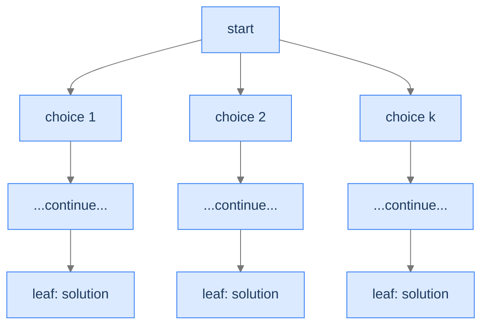
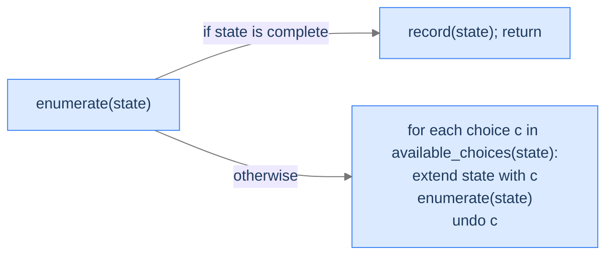
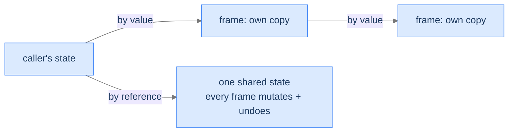

# Understanding Unconditional Enumeration

A backtracking solution exhibits **unconditional enumeration** when **every leaf of the state space tree is a valid solution**. There's no validation function that filters leaves; there's no bounding rule that prunes internal nodes. The algorithm enumerates every candidate the tree can produce, and *all of them count*.

This is exactly the pattern from the introductory phone-password problem. Every 4-digit binary string is a candidate; every leaf gets recorded; the algorithm doesn't say "no" to any leaf. The only difference between problems in this category is the structure of the *choices*: subsets choose include-or-exclude per element, sequences choose a value in `1..k` per slot, phone combinations choose a letter per digit.

> 🖼 Diagram — Unconditional enumeration's tree shape: every leaf is recorded; every internal node fans out into all its children. No pruning, no rejection.


<p align="center"><strong>Unconditional enumeration's tree shape: every leaf is recorded; every internal node fans out into <em>all</em> its children. No pruning, no rejection.</strong></p>

The runtime is therefore the *full* tree size. There's no "average case faster than worst case" — every problem in this category does exactly the same work: visit every leaf, record it. The complexity comes entirely from *how many leaves there are* and *how expensive each candidate is to assemble*.

---

## What Unconditional Enumeration Looks Like in Code

The general shape:

> 🖼 Diagram — The unconditional-enumeration recipe: when a leaf is reached, record. Otherwise, iterate over choices, extend, recurse, undo.


<p align="center"><strong>The unconditional-enumeration recipe: when a leaf is reached, record. Otherwise, iterate over choices, extend, recurse, undo.</strong></p>

The pseudocode:

```
function enumerate(state):
    if state is complete:
        record(state)             ← every leaf is a solution
        return

    for choice in available_choices(state):
        extend(state, choice)     ← make a choice
        enumerate(state)          ← recurse
        undo(state)               ← backtrack
```

That `undo(state)` line is the structural backtrack — it puts the state back the way it was before this iteration's `extend()`, so the next iteration's choice starts from the same baseline. In some languages (Python's strings, immutable values) the "undo" is automatic because each recursion level holds its own copy. In others (C++, Rust mutating a vector) you must explicitly `pop_back()` what you just pushed.

> *Predict before reading on — for a problem with `n` slots and `k` choices per slot, how many leaves does the state space tree have? How deep is the recursion?*

`k^n` leaves; recursion depth `n`. The depth grows linearly with `n`; the leaf count grows *exponentially* with `n`. This means: deepening the recursion by 1 doubles (or more) the work — a fact you'll feel viscerally as `n` grows.

---

## Passing Data Down

Two flavours, depending on the language and the size of the partial state:

**By value (immutable per frame):** copy the partial state into the recursive call. Simple, no `undo` step needed — when the function returns, the caller's state is unchanged automatically. The cost is the per-call copy: `O(n)` per call × `O(k^n)` calls = `O(n · k^n)` total work just on copying. For small `n` this is fine.

**By reference (mutated in place):** pass a pointer/reference to a shared partial state. Each frame appends its choice; on return, the next iteration of the for-loop pops it before extending with the next choice. This avoids the `O(n · k^n)` copy overhead but requires explicit `undo`.

> 🖼 Diagram — By-value: cleaner, no undo, but O(n) copy per call. By-reference: faster, but requires explicit undo to keep the shared state correct.


<p align="center"><strong>By-value: cleaner, no undo, but O(n) copy per call. By-reference: faster, but requires explicit undo to keep the shared state correct.</strong></p>

Most production backtracking code uses the by-reference style for performance. Most teaching code uses by-value (or per-frame slices) for clarity. We'll use the by-reference style in the four worked problems below, since it makes the explicit `undo` visible.

---

## Passing Data Up

The collected solutions are typically built into a single output container (the **subsets** vector, the **transformations** list, the **sequences** array). Both styles work:

- **Output container shared via reference:** every frame appends complete leaves directly to the same container. Memory-efficient.
- **Output as return value:** each call returns its leaves, parent merges. Cleaner but allocates lots of intermediate lists.

For the same reason as data-down, we use the shared-output-by-reference style throughout.

---

## Algorithm

> **enumerate(state, output)**
>
> 1. **Leaf check** — if `state` is a complete candidate, append a *copy* of it to `output` and return. (Copy because the caller may continue mutating `state` for sibling branches.)
> 2. **Branch** — for each choice in the next-level options:
>    - **Extend** `state` with the choice.
>    - **Recurse** on the extended `state`.
>    - **Undo** the extension (restore `state` to its pre-extension value).

That's the entire recipe. Every problem in this section is a different way of filling in *complete*, *available choices*, *extend*, and *undo*.

---

## Implementation

A clean, language-agnostic implementation of the generic enumeration template — generates all length-`n` sequences over alphabet of size `k`.


```python run viz=graph viz-root=state
from typing import List

class Solution:
    def enumerate_all(self, n: int, k: int) -> List[List[int]]:
        results: List[List[int]] = []
        state: List[int] = []
        self._helper(n, k, state, results)
        return results

    def _helper(self, n: int, k: int, state: List[int], results: List[List[int]]) -> None:
        # Leaf check — every complete state is a solution
        if len(state) == n:
            results.append(state.copy())   # copy: caller will keep mutating `state`
            return

        # Branch over every available choice for this slot
        for choice in range(1, k + 1):
            state.append(choice)            # extend
            self._helper(n, k, state, results)   # recurse
            state.pop()                     # undo


if __name__ == "__main__":
    print(Solution().enumerate_all(2, 2))   # [[1,1], [1,2], [2,1], [2,2]]
```

```java run viz=graph viz-root=state
import java.util.ArrayList;
import java.util.List;

public class Main {
    static class Solution {
        public List<List<Integer>> enumerateAll(int n, int k) {
            List<List<Integer>> results = new ArrayList<>();
            List<Integer> state = new ArrayList<>();
            helper(n, k, state, results);
            return results;
        }

        private void helper(int n, int k, List<Integer> state, List<List<Integer>> results) {
            if (state.size() == n) {
                results.add(new ArrayList<>(state));   // copy
                return;
            }
            for (int choice = 1; choice <= k; choice++) {
                state.add(choice);                     // extend
                helper(n, k, state, results);          // recurse
                state.remove(state.size() - 1);        // undo
            }
        }
    }

    public static void main(String[] args) {
        System.out.println(new Solution().enumerateAll(2, 2));   // [[1,1],[1,2],[2,1],[2,2]]
    }
}
```


---

## Complexity Analysis

| Resource | Cost | Why |
|---|---|---|
| **Time** | `O(n · k^n)` | `k^n` leaves × `O(n)` to copy each leaf into the output. |
| **Space (output)** | `O(n · k^n)` | The same `k^n` results, each of size `n`. |
| **Space (stack)** | `O(n)` | Recursion depth = number of slots. |

The output dominates. Your algorithm can never be faster than the size of the output it produces — and unconditional enumeration always produces the full tree's leaves. **The pattern is "as fast as it can possibly be" for the problem of "list every X."**

> **Best Case** — Time `O(n · k^n)`, Space `O(n)` (stack)
>
> **Worst Case** — Same as best — input doesn't change tree size

---

## Key Takeaway

Unconditional enumeration is the simplest backtracking pattern: walk the full state space tree, record every leaf, no pruning. The only knobs you turn are *what's a choice at each level* and *how do you copy a leaf into the output*. Now we'll learn how to spot one.

# Identifying Unconditional Enumeration

Three diagnostic questions decide whether unconditional enumeration fits.

| # | Question | If "yes," unconditional enumeration fits because... |
|---|---|---|
| **Q1** | Is **every** complete candidate a valid solution? | No filter at the leaf — record everything. |
| **Q2** | Is the candidate built by making **one decision per slot**? | Each level of the tree is one slot's decision. |
| **Q3** | Is there a **fixed number of choices per slot** (or one bounded by the input)? | The branching factor of the tree is well-defined. |

If all three are "yes," you can write the algorithm in three lines: leaf-check, for-loop over choices, recurse with undo.

### Q1 — Why "every leaf is a solution"?

**Mental model.** If *some* leaves are valid and others aren't, you'd need a validation function to filter — that's conditional enumeration (the Conditional Enumeration lesson), not unconditional. Unconditional means "every leaf the tree can produce is correct by construction."

**Concrete check.** Subsets of `[1, 2, 3]`: every subset is a valid output. ✓

**What breaks otherwise.** "Generate balanced parentheses of length 6" — many leaves of the naive tree (like `)))(((`) aren't balanced. You'd need to filter at the leaf or prune internally. That's conditional enumeration, not unconditional.

### Q2 — Why "one decision per slot"?

**Mental model.** The state space tree's depth equals the number of slots. Each level is one slot, each child is one choice. If a single slot involved multiple decisions glued together, the tree wouldn't be uniform and the recipe would need to bend.

**Concrete check.** Phone combinations: each digit is one slot, each letter for that digit is one choice. ✓

**What breaks otherwise.** Problems where the *number* of slots itself depends on a path-specific decision require more elaborate recursion (often the search pattern, the Backtracking Search lesson).

### Q3 — Why "fixed branching factor"?

**Mental model.** If every slot has `k` choices, the tree is `k`-ary and uniform. If different slots have wildly different choice counts (sometimes 2, sometimes 26), the tree is irregular but still tractable — the algorithm doesn't change. The bound is what matters: a finite, computable number of choices per slot.

**Concrete check.** Case transformations: each character has 1 choice (non-alphabetic) or 2 choices (alphabetic). The branching factor varies but is bounded. ✓

**What breaks otherwise.** Problems where the choice space at a slot is "all subsets of unconsumed inputs" or similar combinatorial explosion typically don't fit unconditional enumeration cleanly — you'd want a permutation-aware structure.

---

## A Worked Example — Length-2 Binary Sequences

> *Pause and predict — list all length-2 sequences of 0s and 1s. How many? What does the state space tree look like?*

Four sequences: `[0,0]`, `[0,1]`, `[1,0]`, `[1,1]`. The tree:

```
                 [ ]                  (root)
              /        \
           append 0   append 1
              |          |
            [0]         [1]
           /   \        /  \
         [0,0] [0,1] [1,0] [1,1]      (leaves)
```

Depth 2, 4 leaves, 7 nodes total. The algorithm walks this depth-first. We'll generalise to length `n` with `k` choices per slot in **Problem 3** below.

---

## Key Takeaway

Three checks — every leaf is a solution, one decision per slot, fixed branching factor — gate every unconditional-enumeration problem. Pass all three and the algorithm slides into the three-line template. Four worked problems coming up. The first is the canonical subsets problem; the second introduces a "skip or transform" choice per slot; the third generalises the slot count and branching factor; the fourth maps each slot to a different choice set.

<!-- ============================================== -->
<!-- SWEEP 2 — missing sections (placeholders only) -->
<!-- ============================================== -->

<!-- TODO: Understanding the Pattern — missing, needs to be written -->
<!--       Guidance: umbrella H2 with the subsections below -->

<!-- TODO: Why Naive Isn't Enough — missing, needs to be written -->
<!--       Guidance: motivation for why the obvious approach fails -->

<!-- TODO: The Core Idea — missing, needs to be written -->
<!--       Guidance: one paragraph: the central trick -->

<!-- TODO: How the Pointers/Window Move — missing, needs to be written -->
<!--       Guidance: mechanics of the moving parts -->

<!-- TODO: The Generic Algorithm — missing, needs to be written -->
<!--       Guidance: numbered steps, no code -->

<!-- TODO: Generic Implementation — missing, needs to be written -->
<!--       Guidance: Python block + Java block of the skeleton -->

<!-- TODO: Variants / Taxonomy — missing, needs to be written -->
<!--       Guidance: enumerate sub-shapes of this pattern -->

<!-- TODO: Recognition Checklist — missing, needs to be written -->
<!--       Guidance: 4-question diagnostic — the source of the Problem-section Diagnostic Questions -->

<!-- TODO: Canonical Example — missing, needs to be written -->
<!--       Guidance: fully worked example: brute force → optimised → template fit -->

<!-- TODO: Problems in This Category — missing, needs to be written -->
<!--       Guidance: table with links to the 02-problems/ files -->
