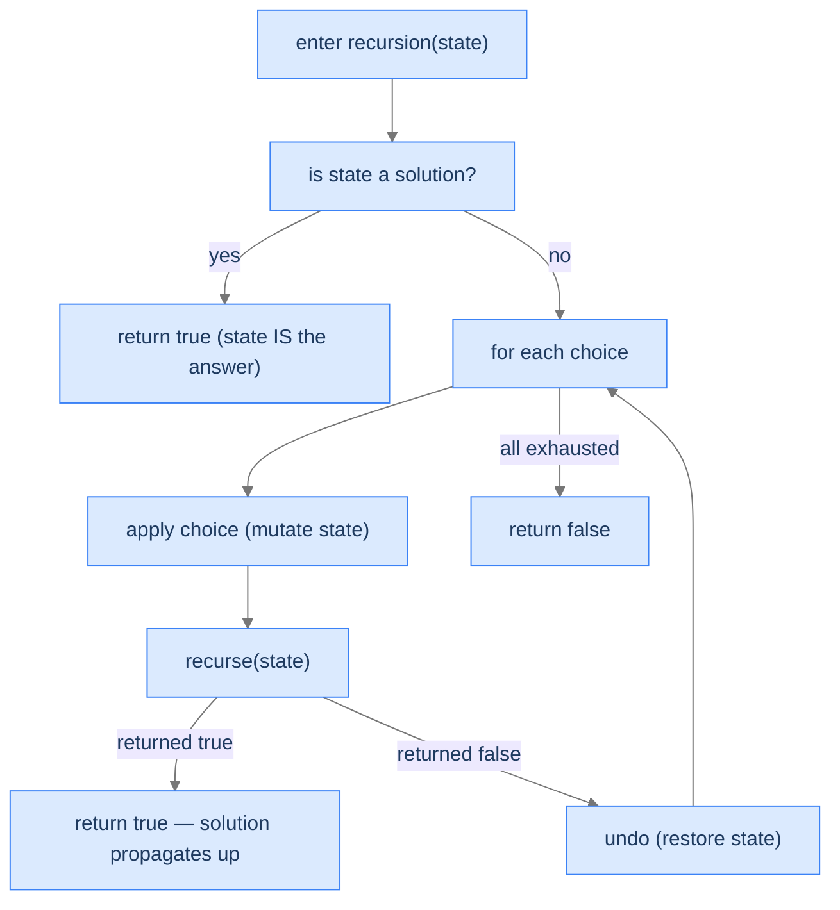
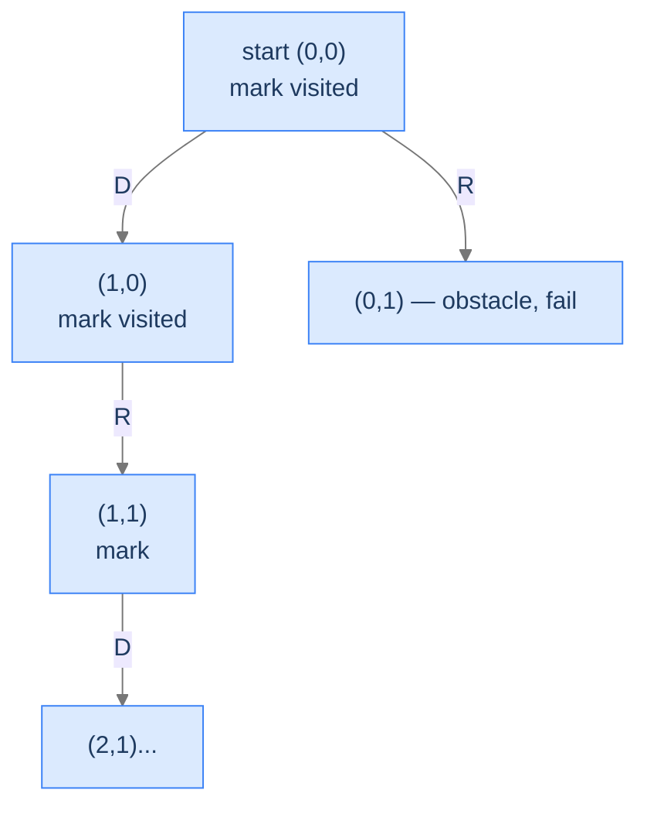
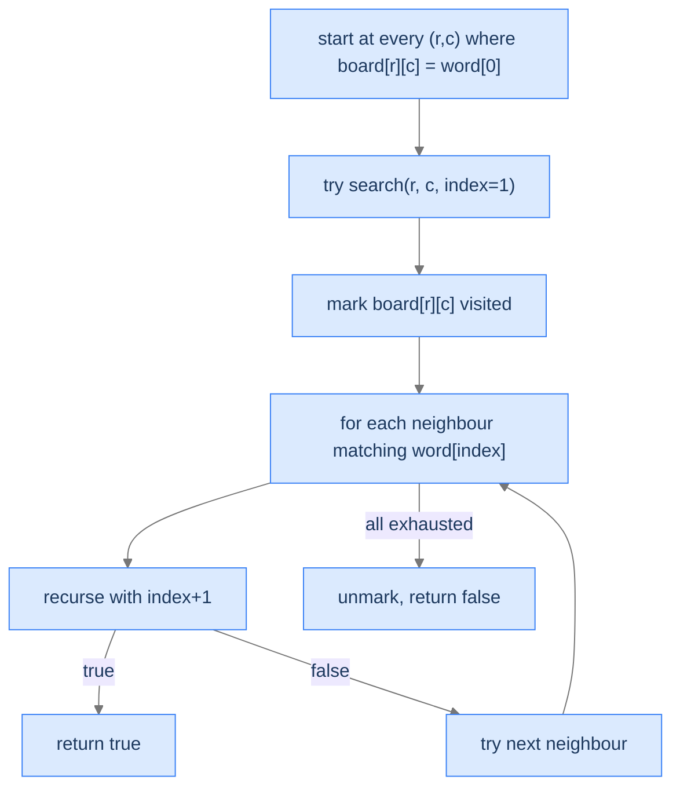

# 4. Pattern: Backtracking Search

The first two backtracking patterns *enumerate*. They walk every leaf of the state space tree, collecting outputs as they go. **Backtracking search** is different: instead of collecting outputs into a list, the algorithm searches for a *configuration of the world* that satisfies a set of constraints — a path through a maze, a placement of queens that don't attack, a filled sudoku grid. The "answer" isn't a leaf of the tree; the answer **is the state itself** at the moment all constraints are satisfied.

This shift changes three things:
1. **State is mutated in place**, not built up by appending.
2. **Recursion returns success/failure**, not a leaf to record.
3. **Early termination** on first success — for many search problems, finding *one* solution ends the algorithm.

By the end of this lesson you'll know what makes a problem a search rather than enumeration, the explicit-undo recipe, and four worked problems that drill it: maze pathfinding, word search on a grid, the n-queens classic, and sudoku.

## Table of contents

1. [Understanding backtracking search](#understanding-backtracking-search)
2. [Identifying backtracking search](#identifying-backtracking-search)
3. [Rat in a maze](#rat-in-a-maze)
4. [Word quest](#word-quest)
5. [Solve n queens](#solve-n-queens)
6. [Solve sudoku](#solve-sudoku)

***

# Understanding Backtracking Search

Backtracking search is the pattern where the *state* itself is the candidate solution. The state is typically a 2D grid (maze, sudoku, chessboard) or some other structured world that the algorithm mutates as it walks the recursion. Each frame:

1. **Records its choice** by mutating the state (place a queen, mark a maze cell as visited, write a digit).
2. **Recurses**, asking "does this state extend to a solution?"
3. On the recursion's return:
   - If success — propagate success up; the state already holds the answer.
   - If failure — **undo the mutation** so the next sibling choice can be tried in a clean state.

The "undo" step is the heart of search. In unconditional enumeration, the undo was implicit (pop the last element off `current`). In search, the undo is explicit and structural — the same cell of the maze gets toggled visited/unvisited; the same chess square gets a queen placed and removed; the same sudoku cell gets a digit written and erased. **The world is the state; the world is shared; the world has to be exactly restored before the parent's loop tries the next choice.**



<p align="center"><strong>The search recipe. Every choice is applied to the world, recursed on, and either succeeds (propagate true upward) or fails (undo and try next). The world is mutated and restored throughout the search.</strong></p>

---

## Search vs Enumeration — When the Difference Matters

Both the Unconditional Enumeration lesson and the Conditional Enumeration lesson are *enumeration* patterns: build up a partial output, record at the leaves, return all valid outputs. The search pattern in this lesson is different in three structural ways:

| Aspect | Enumeration (Unconditional and Conditional lessons) | Search (this lesson) |
|---|---|---|
| What's the "candidate"? | A partial sequence/string we're building | The world's current state (grid, board, etc.) |
| How is it stored? | Appended to a `current` list | Mutated directly in the world |
| What does the recursion return? | Usually `void` — leaves get appended via shared output | Usually `bool` — was this branch successful? |
| What does success do? | Record the leaf, continue exploring siblings | Often: return `true` immediately; siblings unnecessary |
| What does the undo restore? | The `current` list (pop the last element) | The world's state (uncolor cell, remove queen, etc.) |

> *Predict before reading on — for "find any path through a 4×4 maze," would early termination help? What about "find ALL paths through the maze"?*

For "any path," early termination saves a huge amount of work — once a path is found, the algorithm can stop. For "all paths," the algorithm must explore every successful branch *and* every failed sibling, but the undo machinery is identical. The difference is in what the recursion returns from a successful leaf — `true + propagate` for "any," `void + record + continue` for "all."

---

## What Backtracking Search Looks Like in Code

```
function search(state):
    if state is a solution:
        return true                    ← state already holds the answer

    for each viable choice:
        apply(state, choice)            ← mutate the world
        if search(state):
            return true                 ← solution found, bubble up
        undo(state, choice)             ← explicit undo on failure

    return false                        ← all choices exhausted
```

The structure is identical to conditional enumeration — except for what we do with the state and what we return. The mutation-and-undo dance is what makes the recursion's call stack double as both control flow and the *world's state at any moment in time*.

---

## Algorithm

> **search(state)**
>
> 1. **Goal check** — is `state` a complete solution? If yes, return `true`.
> 2. **Generate viable choices** — what extensions of `state` are still candidates?
> 3. **For each choice:**
>    - **Apply** — mutate `state` to reflect this choice.
>    - **Recurse** — `search(state)`.
>    - If recursion returned `true`: **return true** (success bubbles up).
>    - If recursion returned `false`: **undo** the mutation; try the next choice.
> 4. **All choices exhausted** — return `false`.

This template handles "find one" search. For "find all," replace step 3's "if true: return true" with "if true: record state; continue (don't return)." Both flavours appear in the four worked problems.

---

## Implementation

A clean, language-agnostic skeleton illustrating the search recipe with explicit undo. The scenario is a generic maze-style "can I reach the goal?" search.


```python run
from typing import List

class Solution:
    def find_path(self, maze: List[List[int]]) -> bool:
        if not maze or not maze[0]:
            return False
        return self._search(maze, 0, 0)

    def _search(self, maze: List[List[int]], row: int, col: int) -> bool:
        rows, cols = len(maze), len(maze[0])
        # Boundary / obstacle / already-visited
        if not (0 <= row < rows and 0 <= col < cols) or maze[row][col] != 0:
            return False
        # Goal check
        if row == rows - 1 and col == cols - 1:
            return True
        # Apply: mark this cell as visited (mutate the world)
        maze[row][col] = -1
        # Try all four neighbours
        for dr, dc in ((1, 0), (0, 1), (-1, 0), (0, -1)):
            if self._search(maze, row + dr, col + dc):
                # Success: state is committed; we *could* leave the trail in place,
                # but cleanly restoring is the safe default.
                maze[row][col] = 0
                return True
        # Undo on failure — restore the cell so siblings can revisit
        maze[row][col] = 0
        return False


if __name__ == "__main__":
    maze = [[0, 1, 0], [0, 0, 0], [1, 0, 0]]
    print(Solution().find_path(maze))   # True
```

```java run
public class Main {
    static class Solution {
        public boolean findPath(int[][] maze) {
            if (maze.length == 0 || maze[0].length == 0) return false;
            return search(maze, 0, 0);
        }

        private boolean search(int[][] maze, int row, int col) {
            int rows = maze.length, cols = maze[0].length;
            if (row < 0 || row >= rows || col < 0 || col >= cols || maze[row][col] != 0) return false;
            if (row == rows - 1 && col == cols - 1) return true;
            maze[row][col] = -1;                         // apply
            int[][] dirs = {{1, 0}, {0, 1}, {-1, 0}, {0, -1}};
            for (int[] d : dirs) {
                if (search(maze, row + d[0], col + d[1])) {
                    maze[row][col] = 0;
                    return true;
                }
            }
            maze[row][col] = 0;                           // undo on failure
            return false;
        }
    }

    public static void main(String[] args) {
        int[][] maze = {{0, 1, 0}, {0, 0, 0}, {1, 0, 0}};
        System.out.println(new Solution().findPath(maze));
    }
}
```


---

## Complexity Analysis

| Resource | Cost | Why |
|---|---|---|
| **Time** | `O(branching^depth)` worst case, `O(depth)` best case (early hit) | Each cell can branch into the choices not yet visited; depth is bounded by the state size. |
| **Space (stack)** | `O(depth)` | Recursion depth = path length. |
| **Space (auxiliary)** | `O(1)` if mutating the world, `O(state size)` if cloning per call | The mutation-and-undo trick avoids cloning. |

The fact that we're mutating the world means we're not paying for state copies on each call — a major speed-up over naive backtracking. The cost is having to write the explicit undo correctly. If you forget to undo, your search will give wrong answers because subsequent branches see a polluted world.

> **Best Case** — Time `O(depth)` (find solution on first descent), Space `O(depth)`
>
> **Worst Case** — Time `O(branching^depth)` (must explore the full tree)

---

## Key Takeaway

Backtracking search is enumeration's mirror image: instead of building an output by appending, we mutate the world; instead of recording leaves, we propagate `true` upward when the world is in a goal state; instead of implicit undos via `pop()`, we explicitly restore each mutation when a branch fails. The recursion's call stack is the world's history. Now we'll learn how to spot search problems vs enumeration ones.

***

# Identifying Backtracking Search

Three diagnostic questions decide whether backtracking search fits.

| # | Question | If "yes," backtracking search fits because... |
|---|---|---|
| **Q1** | Is the **state itself** the candidate solution? | Mutating the state tracks the search; "the answer" is wherever the state ends up. |
| **Q2** | Does success/failure naturally **propagate upward** as a boolean (or stop the search)? | Recursion's `bool` return propagates without explicit data. |
| **Q3** | Is **explicit undo** of mutations needed to restore correctness? | The world's state must be exactly restored before a sibling tries. |

If all three are "yes," backtracking search fits.

### Q1 — Why "state IS the answer"?

**Mental model.** In enumeration, we built up an output string/list separate from the input. In search, the *world* (maze, board, grid) is what we're modifying *and* what holds the final answer. There's no separate output object.

**Concrete check.** Sudoku: when the algorithm finishes, the input grid *is* the solution. ✓

**What breaks otherwise.** If the answer is a list-of-things-collected, you're closer to enumeration's recipe (the Unconditional or Conditional Enumeration lessons).

### Q2 — Why "boolean propagation"?

**Mental model.** When a sub-search succeeds, that information has to flow back to the caller without any other communication. A boolean return value does this perfectly: `if search(...) return true;`. The state's mutation is the data; the boolean is the signal.

**Concrete check.** Maze: `search(row, col)` returns `true` if there's a path to the goal from this cell. The caller uses that boolean to decide whether to stop (return `true` further up) or try the next direction. ✓

**What breaks otherwise.** If we need to record *all* solutions, we replace the boolean with a "record into shared output" step but keep everything else. The pattern still applies — just collecting more answers.

### Q3 — Why "explicit undo"?

**Mental model.** Because the state is shared and mutated, every choice we tried but didn't keep must be reversed. Otherwise, the next sibling sees a polluted world and produces wrong results.

**Concrete check.** N-Queens: after placing a queen at `(row, col)` and finding no solution from there, we *must* remove that queen before trying `(row, col+1)`. Forgetting the undo means subsequent placements see a queen that shouldn't be there. ✓

**What breaks otherwise.** If you skip the undo, your algorithm's results are wrong — and the bug is hard to find because it manifests as "wrong answers" rather than crashes.

---

## A Worked Example — Find a Path in a 3×3 Maze

> *Pause and predict — for the maze below, what's the path from `(0,0)` to `(2,2)`? How would you sketch the recursion's call stack at the moment we're at `(2,1)`?*

```
maze =
  0 0 1
  1 0 0
  0 0 0   (0 = walkable, 1 = obstacle, start (0,0), goal (2,2))
```

The path is `(0,0) → (0,1) → (1,1) → (2,1) → (2,2)` (down-right-down-right). At the moment we're standing on `(2,1)`, the stack holds frames for `(0,0)`, `(0,1)`, `(1,1)`, `(2,1)`. The cells visited so far have been mutated in the maze (set to `-1` to mark "in-progress visit"). When we extend to `(2,2)` and the goal is reached, success bubbles up; each frame, on the way up, sees `true` and either keeps the visit mark or undoes it depending on the algorithm's needs (commonly: undo to leave the maze unchanged for the caller).

We make this concrete in **Problem 1** below.

---

## Key Takeaway

Three checks — state-IS-the-answer, boolean propagation, explicit undo — gate every backtracking-search problem. Pass all three and the recipe slides in. Four worked problems coming up. The first finds *one* path; the second finds *one* word; the third finds *all* configurations of N queens; the fourth solves an entire sudoku puzzle.

***

# Rat in a Maze

The canonical backtracking-search problem. Walk a 2D grid; pick directions; mark visited cells to prevent cycles; reach the goal or fail.

---

## The Problem

Given an `N × M` maze where `0` is walkable and `1` is an obstacle, the rat starts at `(0, 0)` and must reach `(N-1, M-1)`. Return the path as a string of moves: `U` (up), `D` (down), `L` (left), `R` (right). If no path exists, return an empty string.

```
Input:  maze = [[0,1,1,1],
                [0,0,1,0],
                [0,0,1,1],
                [1,0,0,0]]
Output: "DDRDRR"   (or "DRDDRR" — any valid path)
```

---

<details>
<summary><h2>What Makes This a Search Problem?</h2></summary>


Three signs:
1. The world (the maze grid) is the state we're navigating.
2. We need *one* path, not all of them — early termination is a win.
3. We must mark cells as visited during the descent to avoid cycling, and unmark on backtrack to allow other paths to use them.



<p align="center"><strong>Search descends through the grid, marking visited cells. On a dead end, the recursion returns false, the cell is unmarked, and the parent tries another direction.</strong></p>

</details>
<details>
<summary><h2>Applying the Diagnostic Questions</h2></summary>


| # | Check | Answer |
|---|---|---|
| **Q1** | State IS the answer? | **Yes** — the path string + the visited grid is the search state. |
| **Q2** | Boolean propagation? | **Yes** — `search(row, col)` returns `true` if a path exists from here. |
| **Q3** | Explicit undo? | **Yes** — unmark the cell on failure to allow other paths to traverse it. |

### Q1 — Why "state IS the answer"?

The path string we're building and the maze's visited markings together form the candidate. When we reach the goal, the path string is the answer. The state is the candidate. ✓

### Q2 — Why "boolean propagation"?

Each recursion asks "from this cell, can I reach the goal?" The answer is yes or no — a boolean. When yes propagates up, the caller knows it doesn't need to try other directions. ✓

### Q3 — Why "explicit undo"?

If we don't unmark a cell after a failed exploration from it, subsequent sibling branches can't traverse that cell — even though they could legitimately. The unmark restores the maze for siblings. ✓

</details>
<details>
<summary><h2>The Visit-Mark-Recurse-Unmark Strategy (Visualised)</h2></summary>


<div class="d2-slides" data-caption="The maze gets mutated as we descend; on failure, mutations are undone before sibling branches run.">

```d2
state: "Start at (0,0)" {
  grid: "maze\n[0,1,1,1]\n[0,0,1,0]\n[0,0,1,1]\n[1,0,0,0]" {style.fill: "#dbeafe"; style.stroke: "#3b82f6"}
}
```

```d2
state: "Marked (0,0) = -1, descending Down to (1,0)" {
  grid: "maze\n[-1,1,1,1]\n[0,0,1,0]\n[0,0,1,1]\n[1,0,0,0]\npath = 'D'" {style.fill: "#fde68a"; style.stroke: "#d97706"}
}
```

```d2
state: "(1,0) marked, descend to (2,0) = D" {
  grid: "maze\n[-1,1,1,1]\n[-1,0,1,0]\n[0,0,1,1]\n[1,0,0,0]\npath = 'DD'" {style.fill: "#fde68a"; style.stroke: "#d97706"}
}
```

```d2
state: "(2,0) marked, R to (2,1)" {
  grid: "path = 'DDR'" {style.fill: "#bbf7d0"; style.stroke: "#16a34a"}
}
```

```d2
state: "Continue exploring; eventual success → 'DDRDRR'" {
  grid: "path = 'DDRDRR' — goal reached!" {style.fill: "#ede9fe"; style.stroke: "#7c3aed"}
}
```

</div>

</details>
<details>
<summary><h2>Solution &amp; Analysis</h2></summary>

### The Solution

```python run
from typing import List, Tuple

class Solution:

    # Choices: (direction char, row change, col change)
    choices: List[Tuple[str, int, int]] = [
        ("D", 1, 0),
        ("R", 0, 1),
        ("U", -1, 0),
        ("L", 0, -1),
    ]

    # Check if a cell is valid for movement
    def is_valid(
        self, maze: List[List[int]], row: int, col: int
    ) -> bool:
        return (
            0 <= row < len(maze)
            and 0 <= col < len(maze[0])
            and maze[row][col] == 0
        )

    def search(
        self, maze: List[List[int]], row: int, col: int, path: List[str]
    ) -> bool:

        # If we reached the destination (bottom-right corner of the
        # maze),
        if row == len(maze) - 1 and col == len(maze[0]) - 1:

            # Valid path is now already stored in path
            return True

        # Store the value of the current cell to mark it as visited
        cell_value = maze[row][col]

        # Mark the current cell as visited to avoid revisiting it
        maze[row][col] = -1

        # Loop through all possible choices (directions)
        for dir, dx, dy in self.choices:
            new_row = row + dx
            new_col = col + dy

            # Check if the new position can be visited
            if self.is_valid(maze, new_row, new_col):

                # Make choice: append direction to current path
                path.append(dir)

                # Recurse to explore further from the new cell
                if self.search(maze, new_row, new_col, path):

                    # Unmake choice: mark the current cell as unvisited
                    maze[row][col] = cell_value

                    # If a valid path is found, return true
                    return True

                # Unmake choice: remove the last added direction
                path.pop()

        # Unmake choice: mark the current cell as unvisited
        maze[row][col] = cell_value

        # No path found from this cell, return false
        return False

    def rat_in_a_maze(self, maze: List[List[int]]) -> str:
        if not maze or not maze[0] or maze[0][0] != 0:
            return ""

        # Current path (state)
        path: List[str] = []

        # Start backtracking from the top-left corner (0,0)
        self.search(maze, 0, 0, path)

        # Return the found path
        return "".join(path)


# Example from the problem statement — one valid path exists
maze1 = [[0, 1, 1, 1], [0, 0, 1, 0], [0, 0, 1, 1], [1, 0, 0, 0]]
print(Solution().rat_in_a_maze(maze1))                # DDRDRR (or DRDDRR)

# Simple 2x2 open maze — single step right then down
maze2 = [[0, 0], [0, 0]]
print(Solution().rat_in_a_maze(maze2))                # DR (or similar valid path)

# 1x1 maze — already at destination
maze3 = [[0]]
print(Solution().rat_in_a_maze(maze3))                # (empty string — already there)

# No path — start blocked
maze4 = [[1, 0], [0, 0]]
print(Solution().rat_in_a_maze(maze4))                # (empty string)

# No path — destination blocked
maze5 = [[0, 0], [0, 1]]
print(Solution().rat_in_a_maze(maze5))                # (empty string)

# Straight right path only
maze6 = [[0, 0, 0, 0]]
print(Solution().rat_in_a_maze(maze6))                # RRR

# Straight down path only
maze7 = [[0], [0], [0], [0]]
print(Solution().rat_in_a_maze(maze7))                # DDD

# Longer maze with single winding path
maze8 = [[0, 0, 1], [1, 0, 1], [1, 0, 0]]
print(Solution().rat_in_a_maze(maze8))                # RDRDD (or similar valid path)
```

```java run
public class Main {
    static class Solution {

        // Direction list: (direction char, row change, col change)
        private final char[] dirs = { 'D', 'R', 'U', 'L' };
        private final int[] dx = { 1, 0, -1, 0 };
        private final int[] dy = { 0, 1, 0, -1 };

        // Check if a cell is valid for movement
        private boolean isValid(
            int[][] maze,
            int rows,
            int cols,
            int row,
            int col
        ) {
            return (
                row >= 0 &&
                row < rows &&
                col >= 0 &&
                col < cols &&
                maze[row][col] == 0
            );
        }

        private boolean search(
            int[][] maze,
            int rows,
            int cols,
            int row,
            int col,
            StringBuilder path
        ) {

            // If we reached the destination (bottom-right corner of the
            // maze),
            if (row == rows - 1 && col == cols - 1) {

                // Valid path is now already stored in path
                return true;
            }

            // Store the value of the current cell to mark it as visited
            int cellValue = maze[row][col];

            // Mark the current cell as visited to avoid revisiting it
            maze[row][col] = -1;

            // Loop through all possible choices (directions)
            for (int i = 0; i < 4; i++) {
                int newRow = row + dx[i];
                int newCol = col + dy[i];

                // Check if the new position can be visited
                if (isValid(maze, rows, cols, newRow, newCol)) {

                    // Make choice: append direction to current path
                    path.append(dirs[i]);

                    // Recurse to explore further from the new cell
                    if (search(maze, rows, cols, newRow, newCol, path)) {

                        // Unmake choice: mark the current cell as unvisited
                        maze[row][col] = cellValue;

                        // If a valid path is found, return true
                        return true;
                    }

                    // Unmake choice: remove the last added direction
                    path.deleteCharAt(path.length() - 1);
                }
            }

            // Unmake choice: mark the current cell as unvisited
            maze[row][col] = cellValue;

            // No path found from this cell, return false
            return false;
        }

        public String ratInAMaze(int[][] maze) {
            if (
                maze == null ||
                maze.length == 0 ||
                maze[0].length == 0 ||
                maze[0][0] != 0
            ) {
                return "";
            }

            int rows = maze.length;
            int cols = maze[0].length;

            // Current path (state)
            StringBuilder path = new StringBuilder();

            // Start backtracking from the top-left corner (0,0)
            search(maze, rows, cols, 0, 0, path);

            // Return the found path
            return path.toString();
        }
    }

    public static void main(String[] args) {
        // Example from the problem statement — one valid path exists
        int[][] maze1 = {{0,1,1,1},{0,0,1,0},{0,0,1,1},{1,0,0,0}};
        System.out.println(new Solution().ratInAMaze(maze1));   // DDRDRR (or DRDDRR)

        // Simple 2x2 open maze
        int[][] maze2 = {{0,0},{0,0}};
        System.out.println(new Solution().ratInAMaze(maze2));   // DR (or similar valid path)

        // 1x1 maze — already at destination
        int[][] maze3 = {{0}};
        System.out.println(new Solution().ratInAMaze(maze3));   // (empty string)

        // No path — start blocked
        int[][] maze4 = {{1,0},{0,0}};
        System.out.println(new Solution().ratInAMaze(maze4));   // (empty string)

        // No path — destination blocked
        int[][] maze5 = {{0,0},{0,1}};
        System.out.println(new Solution().ratInAMaze(maze5));   // (empty string)

        // Straight right path only
        int[][] maze6 = {{0,0,0,0}};
        System.out.println(new Solution().ratInAMaze(maze6));   // RRR

        // Straight down path only
        int[][] maze7 = {{0},{0},{0},{0}};
        System.out.println(new Solution().ratInAMaze(maze7));   // DDD

        // Longer maze with single winding path
        int[][] maze8 = {{0,0,1},{1,0,1},{1,0,0}};
        System.out.println(new Solution().ratInAMaze(maze8));   // RDRDD (or similar valid path)
    }
}
```

### Complexity Analysis

| Resource | Cost | Why |
|---|---|---|
| **Time** | `O(4^(R·C))` worst case | Each cell can branch into up to 4 directions; total cells `R·C`. |
| **Space (stack)** | `O(R·C)` | Recursion depth = path length ≤ total cells. |

In practice, the visited-mark prevents revisiting cells, so the search is much faster than the naive `4^(R·C)` bound — closer to `O(R·C)` for typical mazes.

### Edge Cases

| Case | Example | Expected |
|---|---|---|
| Start blocked | `maze[0][0] = 1` | `""` (rat can't even start). |
| Goal blocked | `maze[N-1][M-1] = 1` | `""`. |
| 1×1 walkable | `[[0]]` | `""` (start = goal, path is empty string by convention). |
| All open | `[[0,0],[0,0]]` | `"DR"` or `"RD"`. |
| Disconnected | obstacles isolate the goal | `""`. |

</details>
<details>
<summary><h2>Final Takeaway</h2></summary>


Rat in a Maze is the canonical "find one path" search problem. Mark visited, recurse, propagate true on success, undo on failure. Same recipe applies to flood-fill, island-counting (when finding any cell of an island), and many graph reachability problems. The next problem keeps the 2D-grid setting but flips the goal: instead of reaching a destination, we're matching a sequence of characters.

</details>

***

# Word Quest

A 2D character grid; we want to know whether a given word appears as a chain of orthogonally-adjacent cells (with no cell reused). Same search recipe as the maze, with character-matching instead of obstacle-checking.

---

## The Problem

Given a 2D grid `board` of single-character strings and a target string `word`, return `true` if `word` can be spelled by a chain of orthogonally adjacent cells (up, down, left, right) without reusing any cell. Else `false`.

```
Input:  board = [['A','B','C','E'],
                 ['S','F','C','S'],
                 ['A','D','E','E']],
        word = "ABCCED"
Output: true
```

---

<details>
<summary><h2>What's the Recursion Doing?</h2></summary>


Try starting from every cell that matches `word[0]`. From each starting cell, recurse into the four neighbours; at each step, the next cell must match `word[index]`. Use the visited-mark trick to prevent reusing cells. When `index` reaches `len(word)`, the chain is complete — return `true`.



<p align="center"><strong>Backtracking search for word matching. The mark-visit-recurse-unmark dance is identical to the maze; only the validation differs (character match instead of cell type).</strong></p>

</details>
<details>
<summary><h2>Applying the Diagnostic Questions</h2></summary>


| # | Check | Answer |
|---|---|---|
| **Q1** | State IS the answer? | **Yes** — the visited grid + current index in word is the search state. |
| **Q2** | Boolean propagation? | **Yes** — `true` if word can be completed from this cell, `false` otherwise. |
| **Q3** | Explicit undo? | **Yes** — must unmark cells so other start positions can use them. |

### Q1 — Why "state IS"?

The "candidate" is "the chain of cells we've matched so far," tracked by the visited markers and the current `index`. ✓

### Q2 — Why "boolean propagation"?

We want a yes/no answer. If any starting cell can spell the word, return `true`; otherwise `false`. ✓

### Q3 — Why "explicit undo"?

Different starting cells should each get a clean view of the board. If we forget to unmark, one starting cell's pollution prevents another from working. ✓

</details>
<details>
<summary><h2>Solution &amp; Analysis</h2></summary>

### The Solution

```python run
from typing import List, Tuple

class Solution:

    # Directions list: (row change, col change)
    choices: List[Tuple[int, int]] = [
        (1, 0),   # Down
        (-1, 0),  # Up
        (0, 1),   # Right
        (0, -1)   # Left
    ]

    # Check if moving to (row,col) is valid for the current character
    def is_valid_move(
        self, board: List[List[str]], row: int, col: int, target: str
    ) -> bool:

        # Check boundaries
        if (
            row < 0
            or col < 0
            or row >= len(board)
            or col >= len(board[0])
        ):
            return False

        # Check if the cell matches the target character
        return board[row][col] == target

    # Recursive backtracking function
    def search_word(
        self,
        board: List[List[str]],
        word: str,
        index: int,
        row: int,
        col: int,
    ) -> bool:

        # Base case: entire word matched (solution state)
        if index == len(word):
            return True

        # Make choice: mark current cell as visited
        original_char = board[row][col]
        board[row][col] = "#"

        # Explore all possible choices
        for dx, dy in self.choices:
            new_row = row + dx
            new_col = col + dy

            # Only recurse if this move is valid
            if self.is_valid_move(board, new_row, new_col, word[index]):

                # Recurse to next character in word
                if self.search_word(
                    board, word, index + 1, new_row, new_col
                ):

                    # Unmake choice: restore original character
                    board[row][col] = original_char

                    # Early return: solution found
                    return True

        # Unmake choice: restore the original character to allow other
        # paths
        board[row][col] = original_char

        # Return false if word not found along this path
        return False

    def word_quest(self, board: List[List[str]], word: str) -> bool:
        rows = len(board)
        cols = len(board[0])

        # Start backtracking search from every cell on the board
        for row in range(rows):
            for col in range(cols):

                # Only start if the first character matches
                if board[row][col] == word[0]:

                    # Start recursive backtracking
                    if self.search_word(board, word, 1, row, col):
                        return True

        # No path leads to the word
        return False


# Example from the problem statement
b1 = [['A','B','C','E'],['S','F','C','S'],['A','D','E','E']]
print(Solution().word_quest(b1, "ABCCED"))            # True

# Another word on the same board
b2 = [['A','B','C','E'],['S','F','C','S'],['A','D','E','E']]
print(Solution().word_quest(b2, "SEE"))               # True

# Word not on board
b3 = [['A','B','C','E'],['S','F','C','S'],['A','D','E','E']]
print(Solution().word_quest(b3, "ABCB"))              # False

# Single-cell board — word present
b4 = [['A']]
print(Solution().word_quest(b4, "A"))                 # True

# Single-cell board — word absent
b5 = [['A']]
print(Solution().word_quest(b5, "B"))                 # False

# Word requires same cell twice — not allowed
b6 = [['A','B'],['C','D']]
print(Solution().word_quest(b6, "ABBA"))              # False

# Word spans entire board
b7 = [['A','B'],['C','D']]
print(Solution().word_quest(b7, "ABDC"))              # True

# Word found going upward
b8 = [['C'],['B'],['A']]
print(Solution().word_quest(b8, "ABC"))               # True
```

```java run
public class Main {
    static class Solution {

        // Directions list: (row change, col change)
        private final int[][] choices = {
            {1, 0},   // Down
            {-1, 0},  // Up
            {0, 1},   // Right
            {0, -1}   // Left
        };

        // Check if moving to (row,col) is valid for the current character
        private boolean isValidMove(
            char[][] board,
            int row,
            int col,
            char target
        ) {

            // Check boundaries
            if (
                row < 0 ||
                col < 0 ||
                row >= board.length ||
                col >= board[0].length
            ) {
                return false;
            }

            // Check if the cell matches the target character
            return board[row][col] == target;
        }

        // Recursive backtracking function
        private boolean searchWord(
            char[][] board,
            String word,
            int index,
            int row,
            int col
        ) {

            // Base case: entire word matched (solution state)
            if (index == word.length()) {
                return true;
            }

            // Make choice: mark current cell as visited
            char originalChar = board[row][col];
            board[row][col] = '#';

            // Explore all possible choices
            for (int[] choice : choices) {
                int newRow = row + choice[0];
                int newCol = col + choice[1];

                // Only recurse if this move is valid
                if (isValidMove(board, newRow, newCol, word.charAt(index))) {

                    // Recurse to next character in word
                    if (searchWord(board, word, index + 1, newRow, newCol)) {

                        // Unmake choice: restore original character
                        board[row][col] = originalChar;

                        // Early return: solution found
                        return true;
                    }
                }
            }

            // Unmake choice: restore the original character to allow other
            // paths
            board[row][col] = originalChar;

            // Return false if word not found along this path
            return false;
        }

        public boolean wordQuest(char[][] board, String word) {
            int rows = board.length;
            int cols = board[0].length;

            // Start backtracking search from every cell on the board
            for (int row = 0; row < rows; row++) {
                for (int col = 0; col < cols; col++) {

                    // Only start if the first character matches
                    if (board[row][col] == word.charAt(0)) {

                        // Start recursive backtracking
                        if (searchWord(board, word, 1, row, col)) {
                            return true;
                        }
                    }
                }
            }

            // No path leads to the word
            return false;
        }
    }

    public static void main(String[] args) {
        // Example from the problem statement
        char[][] b1 = {{'A','B','C','E'},{'S','F','C','S'},{'A','D','E','E'}};
        System.out.println(new Solution().wordQuest(b1, "ABCCED"));   // true

        // Another word on the same board
        char[][] b2 = {{'A','B','C','E'},{'S','F','C','S'},{'A','D','E','E'}};
        System.out.println(new Solution().wordQuest(b2, "SEE"));       // true

        // Word not on board
        char[][] b3 = {{'A','B','C','E'},{'S','F','C','S'},{'A','D','E','E'}};
        System.out.println(new Solution().wordQuest(b3, "ABCB"));      // false

        // Single-cell board — word present
        char[][] b4 = {{'A'}};
        System.out.println(new Solution().wordQuest(b4, "A"));         // true

        // Single-cell board — word absent
        char[][] b5 = {{'A'}};
        System.out.println(new Solution().wordQuest(b5, "B"));         // false

        // Word requires same cell twice — not allowed
        char[][] b6 = {{'A','B'},{'C','D'}};
        System.out.println(new Solution().wordQuest(b6, "ABBA"));      // false

        // Word spans entire board
        char[][] b7 = {{'A','B'},{'C','D'}};
        System.out.println(new Solution().wordQuest(b7, "ABDC"));      // true

        // Word found going upward
        char[][] b8 = {{'C'},{'B'},{'A'}};
        System.out.println(new Solution().wordQuest(b8, "ABC"));       // true
    }
}
```

### Complexity Analysis

| Resource | Cost | Why |
|---|---|---|
| **Time** | `O(rows · cols · 4^len(word))` | Up to `rows · cols` start positions × `4^len(word)` paths from each. |
| **Space (stack)** | `O(len(word))` | Recursion depth = word length. |

In practice the visited-mark prunes the search aggressively — most paths fail at length 2-3.

### Edge Cases

| Case | Example | Expected |
|---|---|---|
| Word longer than board cells | board has 5 cells, word length 6 | `false`. |
| First-char absent | board has no 'A', word starts with 'A' | `false`. |
| Single-char word | word = "X" | `true` iff the board contains 'X'. |
| Word reuses a cell | needs same cell twice | `false` by problem statement. |

</details>
<details>
<summary><h2>Final Takeaway</h2></summary>


Word Quest is the canonical "match a sequence on a grid" search problem. Same recipe as the maze; only the validation function differs (character match vs walkability). The next problem changes the world from a 2D grid to an `n × n` chessboard, and the algorithm collects *all* valid configurations rather than just one.

</details>

***

# Solve N Queens

The classic. Place `n` queens on an `n × n` board so no two attack each other. Find *all* valid configurations.

---

## The Problem

Given `n`, return all distinct solutions to the n-queens problem. Each solution is a list of `n` strings, each of length `n`, where `Q` is a queen and `.` is empty. Two queens attack iff they share a row, column, or diagonal.

```
Input:  n = 4
Output: [
  [".Q..", "...Q", "Q...", "..Q."],
  ["..Q.", "Q...", "...Q", ".Q.."]
]
```

There are exactly two solutions for `n = 4`. For `n = 8`, the famous answer is 92 solutions (12 if you account for symmetry).

---

<details>
<summary><h2>Why This Is a Search With "Find All"</h2></summary>


Two structural choices simplify the problem:
1. **One queen per row.** No two queens can share a row, so we place exactly one per row. Reduces the choice set per level from `n²` cells to `n` columns.
2. **Process rows in order.** The state at depth `r` is "queens placed in rows 0..r-1." Each frame picks a column for row `r`.

The constraint check at each placement: **the chosen column must not conflict with any already-placed queen** — same column, same diagonal, or same anti-diagonal.

</details>
<details>
<summary><h2>Applying the Diagnostic Questions</h2></summary>


| # | Check | Answer |
|---|---|---|
| **Q1** | State IS the answer? | **Yes** — the array of column-positions is the configuration. |
| **Q2** | Boolean propagation? | Almost — but here we want *all* solutions, so we use a record-and-continue variant. |
| **Q3** | Explicit undo? | **Yes** — set the column-position to `-1` after exploring its subtree. |

### Q1 — Why "state IS"?

The state — `queenPositions[i]` = column of the queen in row `i` — completely determines a board configuration. ✓

### Q2 — Why "find-all variant"?

For the maze and word problems, we wanted *one* solution and propagated `true` to stop. Here we want *all*, so the search doesn't stop on first success — instead, it records each valid configuration and continues. ✓

### Q3 — Why "explicit undo"?

After fully exploring "what configurations exist with the queen for row 0 in column 0?", we move on to "...with the queen in column 1." That requires resetting `queenPositions[0]` so it doesn't pollute later rows' conflict checks. ✓

</details>
<details>
<summary><h2>Solution &amp; Analysis</h2></summary>

### The Solution

```python run
from typing import List

class Solution:

    # Helper function to check if a queen can be safely placed at (row,
    # col)
    def can_place_queen(
        self, queen_positions: List[int], row: int, col: int
    ) -> bool:
        for i in range(row):

            # Check for column conflict: no other queen should be in the same column
            # Check for diagonal conflict: no other queen should be in
            # the same diagonal
            if queen_positions[i] == col or row - i == abs(
                col - queen_positions[i]
            ):
                return False
        return True

    # Helper function to convert the current state list into a board
    # representation
    def make_solution(
        self, queen_positions: List[int], n: int
    ) -> List[str]:

        # Create an n x n board initialized with '.'
        board = []
        for i in range(n):
            row = ["."] * n

            # Place queens on the board based on the state list
            row[queen_positions[i]] = "Q"
            board.append("".join(row))

        # Return the board representation
        return board

    def search_solutions(
        self,
        queen_positions: List[int],
        row: int,
        n: int,
        solutions: List[List[str]],
    ) -> None:

        # Check if all queens have been successfully placed
        if row == n:

            # Current state represents a valid solution, convert it to
            # board format and store
            solutions.append(self.make_solution(queen_positions, n))

            # Stop searching further as we found a valid solution
            return

        # Loop through each column in the current row to try placing a
        # queen (all choices)
        for col in range(n):

            # Check if placing a queen at (row, col) is safe
            if self.can_place_queen(queen_positions, row, col):

                # Place the queen in the current row at column col (make
                # choice)
                queen_positions[row] = col

                # Recursively try to place queens in the next row
                self.search_solutions(
                    queen_positions, row + 1, n, solutions
                )

                # Remove the queen from the current row to backtrack and
                # try the next column (revert choice)
                queen_positions[row] = -1

    def solve_n_queens(self, n: int) -> List[List[str]]:

        # List to store all valid board configurations (solution states)
        solutions: List[List[str]] = []

        # State list: queen_positions[i] stores the column index of the
        # queen placed in row i
        queen_positions: List[int] = [-1] * n

        # Start the search process from the first row (row 0)
        self.search_solutions(queen_positions, 0, n, solutions)

        # Return all valid solutions found
        return solutions


# Example from the problem statement
result4 = Solution().solve_n_queens(4)
print(len(result4))                                   # 2
for board in sorted(result4):
    print(board)

# Edge cases
print(len(Solution().solve_n_queens(1)))              # 1
print(Solution().solve_n_queens(1))                   # [['Q']]
print(len(Solution().solve_n_queens(2)))              # 0 — no solution for n=2
print(len(Solution().solve_n_queens(3)))              # 0 — no solution for n=3
print(len(Solution().solve_n_queens(5)))              # 10
print(len(Solution().solve_n_queens(6)))              # 4
```

```java run
import java.util.*;

public class Main {
    static class Solution {

        // Helper function to check if a queen can be safely placed at (row,
        // col)
        private boolean canPlaceQueen(
            int[] queenPositions,
            int row,
            int col
        ) {
            for (int i = 0; i < row; i++) {

                // Check for column conflict: no other queen should be in the
                // same column Check for diagonal conflict: no other queen
                // should be in the same diagonal
                if (
                    queenPositions[i] == col ||
                    row - i == Math.abs(col - queenPositions[i])
                ) {
                    return false;
                }
            }
            return true;
        }

        // Helper function to convert the current state list into a board
        // representation
        private List<String> makeSolution(int[] queenPositions, int n) {

            // Create an n x n board initialized with '.'
            List<String> board = new ArrayList<>();
            for (int i = 0; i < n; i++) {
                char[] row = new char[n];
                Arrays.fill(row, '.');

                // Place queens on the board based on the state list
                row[queenPositions[i]] = 'Q';
                board.add(new String(row));
            }

            // Return the board representation
            return board;
        }

        private void searchSolutions(
            int[] queenPositions,
            int row,
            int n,
            List<List<String>> solutions
        ) {

            // Check if all queens have been successfully placed
            if (row == n) {

                // Current state represents a valid solution, convert it to
                // board format and store
                solutions.add(makeSolution(queenPositions, n));

                // Stop searching further as we found a valid solution
                return;
            }

            // Loop through each column in the current row to try placing a
            // queen (all choices)
            for (int col = 0; col < n; col++) {

                // Check if placing a queen at (row, col) is safe
                if (canPlaceQueen(queenPositions, row, col)) {

                    // Place the queen in the current row at column col (make
                    // choice)
                    queenPositions[row] = col;

                    // Recursively try to place queens in the next row
                    searchSolutions(queenPositions, row + 1, n, solutions);

                    // Remove the queen from the current row to backtrack and
                    // try the next column (revert choice)
                    queenPositions[row] = -1;
                }
            }
        }

        public List<List<String>> solveNQueens(int n) {

            // List to store all valid board configurations (solution states)
            List<List<String>> solutions = new ArrayList<>();

            // State list: queenPositions[i] stores the column index of the
            // queen placed in row i
            int[] queenPositions = new int[n];
            Arrays.fill(queenPositions, -1);

            // Start the search process from the first row (row 0)
            searchSolutions(queenPositions, 0, n, solutions);

            // Return all valid solutions found
            return solutions;
        }
    }

    public static void main(String[] args) {
        // Example from the problem statement
        List<List<String>> result4 = new Solution().solveNQueens(4);
        System.out.println(result4.size());                           // 2
        result4.stream().map(Object::toString).sorted().forEach(System.out::println);

        // Edge cases
        System.out.println(new Solution().solveNQueens(1).size());    // 1
        System.out.println(new Solution().solveNQueens(1));           // [[Q]]
        System.out.println(new Solution().solveNQueens(2).size());    // 0 — no solution for n=2
        System.out.println(new Solution().solveNQueens(3).size());    // 0 — no solution for n=3
        System.out.println(new Solution().solveNQueens(5).size());    // 10
        System.out.println(new Solution().solveNQueens(6).size());    // 4
    }
}
```


<details>
<summary><strong>Trace — n = 4</strong></summary>

```
Place row 0:
  col 0: ok, recurse
    row 1: try col 0 conflict, col 1 conflict (diag), col 2 conflict (diag), col 3 ok
      row 2: col 0 conflict, col 1 (with row 0's q at 0)? same col, no — actually position 0 and 1 differ by row diff 2, col diff 1: no diag. ok... actually let me redo
        try col 0: conflicts with row 0's queen at 0 (same col)
        try col 1: row diff 2, col diff 1, not equal — but does conflict with row 1's q at 3? col diff 2, row diff 1, not equal — ok!
        ... (continues)

(Full trace would take many lines; the algorithm finds 2 solutions for n=4.)

Result for n=4: 2 solutions, matching the expected.
```

</details>

### Complexity Analysis

| Resource | Cost | Why |
|---|---|---|
| **Time** | `O(n!)` worst case | Each row has up to `n` columns; pruning reduces this in practice. |
| **Space (stack)** | `O(n)` | Recursion depth = number of rows. |
| **Space (output)** | `O(num_solutions × n²)` | Each solution is `n` strings of length `n`. |

For `n = 8`, the algorithm finds 92 solutions; for `n = 12`, 14,200; growth is super-exponential.

### Edge Cases

| Case | Example | Expected |
|---|---|---|
| `n = 1` | n = 1 | `[["Q"]]` (one solution). |
| `n = 2, 3` | n = 2 or 3 | `[]` (no valid configurations). |
| `n = 4` | n = 4 | 2 solutions. |
| `n = 8` | n = 8 | 92 solutions. |

</details>
<details>
<summary><h2>Final Takeaway</h2></summary>


N-Queens is the canonical "find all configurations" search problem. Place-recurse-undo, with a `canPlace` pruning function that catches conflicts early. The next problem turns the dial up to its maximum — every cell of the world has 9 possible values, and we have to fill 81 of them.

</details>

***

# Solve Sudoku

The hardest worked problem in this section. Sudoku's state space is enormous, but constraint propagation prunes it relentlessly.

---

## The Problem

Given a partially filled `9 × 9` sudoku grid (with `'X'` marking empty cells), fill in the empty cells so that:
1. Every row contains digits `1`-`9` exactly once.
2. Every column contains digits `1`-`9` exactly once.
3. Each of the nine `3 × 3` sub-boxes contains digits `1`-`9` exactly once.

The grid is mutated in place.

---

<details>
<summary><h2>What's the Recursion Doing?</h2></summary>


Find the first empty cell. Try every digit `1`-`9` that doesn't conflict with the row, column, or sub-box. For each viable digit, place it and recurse. If the recursion solves the rest, return `true`. If not, undo the placement and try the next digit. If no digit works, return `false`.

The world is the grid; the answer *is* the grid; the validation check is "does placing `d` here satisfy all three constraints (row, col, box)?"

</details>
<details>
<summary><h2>Applying the Diagnostic Questions</h2></summary>


| # | Check | Answer |
|---|---|---|
| **Q1** | State IS the answer? | **Yes** — the grid is the candidate; when filled, it's the solution. |
| **Q2** | Boolean propagation? | **Yes** — `solve()` returns `true` if a solution exists from the current state. |
| **Q3** | Explicit undo? | **Yes** — write digit, recurse; on failure, set cell back to empty. |

### Q1 — Why "state IS"?

The 9×9 grid we're filling is the candidate. Once it's fully populated and valid, it's the answer. ✓

### Q2 — Why "boolean propagation"?

Sudoku has a unique solution (in well-formed puzzles). We propagate `true` upward as soon as we find it. ✓

### Q3 — Why "explicit undo"?

If a digit doesn't lead to a solution, we have to clear that cell so we can try the next digit (or so the parent's loop can try a different placement). ✓

</details>
<details>
<summary><h2>Solution &amp; Analysis</h2></summary>

### The Solution

```python run
from typing import List

class Solution:

    # Checks if placing 'num' in the specified row is valid
    def is_valid_row(
        self, board: List[List[str]], row: int, num: str
    ) -> bool:
        for col in range(9):
            if board[row][col] == num:
                return False
        return True

    # Checks if placing 'num' in the specified column is valid
    def is_valid_col(
        self, board: List[List[str]], col: int, num: str
    ) -> bool:
        for row in range(9):
            if board[row][col] == num:
                return False
        return True

    # Checks if placing 'num' in the 3x3 sub-grid containing (row, col)
    # is valid
    def is_valid_subgrid(
        self, board: List[List[str]], row: int, col: int, num: str
    ) -> bool:
        start_row = (row // 3) * 3
        start_col = (col // 3) * 3
        for r in range(start_row, start_row + 3):
            for c in range(start_col, start_col + 3):
                if board[r][c] == num:
                    return False
        return True

    # Checks if placing 'num' at (row, col) is valid in all respects
    def is_valid_placement(
        self, board: List[List[str]], row: int, col: int, num: str
    ) -> bool:

        # Check row, column, and sub-grid constraints
        return (
            self.is_valid_row(board, row, num)
            and self.is_valid_col(board, col, num)
            and self.is_valid_subgrid(board, row, col, num)
        )

    # Recursive search function to fill the Sudoku board
    def search_solution(self, board: List[List[str]]) -> bool:

        # Iterate through each cell of the board
        for row in range(9):
            for col in range(9):

                # Only attempt to fill empty cells
                if board[row][col] == "X":

                    # Try all digits from "1" to "9" in this cell
                    for num in map(str, range(1, 10)):

                        # Check if placing the number is valid (solution
                        # state possible)
                        if self.is_valid_placement(board, row, col, num):

                            # Place the number in the cell (make choice)
                            board[row][col] = num

                            # Recursively attempt to fill the rest of the
                            # board
                            if self.search_solution(board):
                                return True

                            # If it did not lead to a solution, remove
                            # the number (revert choice)
                            board[row][col] = "X"

                    # If no valid number can be placed in this cell,
                    # backtrack
                    return False

        # If all cells are filled successfully, the board is solved
        return True

    def solve_sudoku(self, board: List[List[str]]) -> None:

        # Start the search process to fill the board
        self.search_solution(board)


# Example from the problem statement
board1 = [
    ['5','3','X','X','7','X','X','X','X'],
    ['6','X','X','1','9','5','X','X','X'],
    ['X','9','8','X','X','X','X','6','X'],
    ['8','X','X','X','6','X','X','X','3'],
    ['4','X','X','8','X','3','X','X','1'],
    ['7','X','X','X','2','X','X','X','6'],
    ['X','6','X','X','X','X','2','8','X'],
    ['X','X','X','4','1','9','X','X','5'],
    ['X','X','X','X','8','X','X','7','9'],
]
Solution().solve_sudoku(board1)
for row in board1:
    print(row)
# [5,3,4,6,7,8,9,1,2]
# [6,7,2,1,9,5,3,4,8]
# [1,9,8,3,4,2,5,6,7]
# [8,5,9,7,6,1,4,2,3]
# [4,2,6,8,5,3,7,9,1]
# [7,1,3,9,2,4,8,5,6]
# [9,6,1,5,3,7,2,8,4]
# [2,8,7,4,1,9,6,3,5]
# [3,4,5,2,8,6,1,7,9]

# Nearly full board — only one empty cell
board2 = [
    ['5','3','4','6','7','8','9','1','2'],
    ['6','7','2','1','9','5','3','4','8'],
    ['1','9','8','3','4','2','5','6','7'],
    ['8','5','9','7','6','1','4','2','3'],
    ['4','2','6','8','5','3','7','9','1'],
    ['7','1','3','9','2','4','8','5','6'],
    ['9','6','1','5','3','7','2','8','4'],
    ['2','8','7','4','1','9','6','3','5'],
    ['3','4','5','2','8','6','1','7','X'],
]
Solution().solve_sudoku(board2)
print(board2[8][8])                                   # 9

# Already solved board — no-op
board3 = [
    ['5','3','4','6','7','8','9','1','2'],
    ['6','7','2','1','9','5','3','4','8'],
    ['1','9','8','3','4','2','5','6','7'],
    ['8','5','9','7','6','1','4','2','3'],
    ['4','2','6','8','5','3','7','9','1'],
    ['7','1','3','9','2','4','8','5','6'],
    ['9','6','1','5','3','7','2','8','4'],
    ['2','8','7','4','1','9','6','3','5'],
    ['3','4','5','2','8','6','1','7','9'],
]
Solution().solve_sudoku(board3)
print(board3[0][0])                                   # 5
```

```java run
import java.util.*;

public class Main {
    static class Solution {

        // Checks if placing 'num' in the specified row is valid
        private boolean isValidRow(char[][] board, int row, char num) {
            for (int col = 0; col < 9; col++) {
                if (board[row][col] == num) {
                    return false;
                }
            }
            return true;
        }

        // Checks if placing 'num' in the specified column is valid
        private boolean isValidCol(char[][] board, int col, char num) {
            for (int row = 0; row < 9; row++) {
                if (board[row][col] == num) {
                    return false;
                }
            }
            return true;
        }

        // Checks if placing 'num' in the 3x3 sub-grid containing (row, col)
        // is valid
        private boolean isValidSubGrid(
            char[][] board,
            int row,
            int col,
            char num
        ) {
            int startRow = (row / 3) * 3;
            int startCol = (col / 3) * 3;
            for (int r = startRow; r < startRow + 3; r++) {
                for (int c = startCol; c < startCol + 3; c++) {
                    if (board[r][c] == num) {
                        return false;
                    }
                }
            }
            return true;
        }

        // Checks if placing 'num' at (row, col) is valid in all respects
        private boolean isValidPlacement(
            char[][] board,
            int row,
            int col,
            char num
        ) {

            // Check row, column, and sub-grid constraints
            return (
                isValidRow(board, row, num) &&
                isValidCol(board, col, num) &&
                isValidSubGrid(board, row, col, num)
            );
        }

        // Recursive search function to fill the Sudoku board
        private boolean searchSolution(char[][] board) {

            // Iterate through each cell of the board
            for (int row = 0; row < 9; row++) {
                for (int col = 0; col < 9; col++) {

                    // Only attempt to fill empty cells
                    if (board[row][col] == 'X') {

                        // Try all digits from "1" to "9" in this cell
                        for (int num = 1; num <= 9; num++) {
                            char strNum = (char) (num + '0');

                            // Check if placing the number is valid (solution
                            // state possible)
                            if (isValidPlacement(board, row, col, strNum)) {

                                // Place the number in the cell (make choice)
                                board[row][col] = strNum;

                                // Recursively attempt to fill the rest of
                                // the board
                                if (searchSolution(board)) {

                                    // If successful, propagate success back
                                    return true;
                                }

                                // If it did not lead to a solution, remove
                                // the number (revert choice)
                                board[row][col] = 'X';
                            }
                        }

                        // If no valid number can be placed in this cell,
                        // backtrack
                        return false;
                    }
                }
            }

            // If all cells are filled successfully, the board is solved
            return true;
        }

        public void solveSudoku(char[][] board) {

            // Start the search process to fill the board
            searchSolution(board);
        }
    }

    public static void main(String[] args) {
        // Example from the problem statement
        char[][] board1 = {
            {'5','3','X','X','7','X','X','X','X'},
            {'6','X','X','1','9','5','X','X','X'},
            {'X','9','8','X','X','X','X','6','X'},
            {'8','X','X','X','6','X','X','X','3'},
            {'4','X','X','8','X','3','X','X','1'},
            {'7','X','X','X','2','X','X','X','6'},
            {'X','6','X','X','X','X','2','8','X'},
            {'X','X','X','4','1','9','X','X','5'},
            {'X','X','X','X','8','X','X','7','9'},
        };
        new Solution().solveSudoku(board1);
        for (char[] row : board1) System.out.println(Arrays.toString(row));
        // [5,3,4,6,7,8,9,1,2]
        // [6,7,2,1,9,5,3,4,8]
        // [1,9,8,3,4,2,5,6,7]
        // [8,5,9,7,6,1,4,2,3]
        // [4,2,6,8,5,3,7,9,1]
        // [7,1,3,9,2,4,8,5,6]
        // [9,6,1,5,3,7,2,8,4]
        // [2,8,7,4,1,9,6,3,5]
        // [3,4,5,2,8,6,1,7,9]

        // Nearly full board — only one empty cell
        char[][] board2 = {
            {'5','3','4','6','7','8','9','1','2'},
            {'6','7','2','1','9','5','3','4','8'},
            {'1','9','8','3','4','2','5','6','7'},
            {'8','5','9','7','6','1','4','2','3'},
            {'4','2','6','8','5','3','7','9','1'},
            {'7','1','3','9','2','4','8','5','6'},
            {'9','6','1','5','3','7','2','8','4'},
            {'2','8','7','4','1','9','6','3','5'},
            {'3','4','5','2','8','6','1','7','X'},
        };
        new Solution().solveSudoku(board2);
        System.out.println(board2[8][8]);                             // 9

        // Already solved board — no-op
        char[][] board3 = {
            {'5','3','4','6','7','8','9','1','2'},
            {'6','7','2','1','9','5','3','4','8'},
            {'1','9','8','3','4','2','5','6','7'},
            {'8','5','9','7','6','1','4','2','3'},
            {'4','2','6','8','5','3','7','9','1'},
            {'7','1','3','9','2','4','8','5','6'},
            {'9','6','1','5','3','7','2','8','4'},
            {'2','8','7','4','1','9','6','3','5'},
            {'3','4','5','2','8','6','1','7','9'},
        };
        new Solution().solveSudoku(board3);
        System.out.println(board3[0][0]);                             // 5
    }
}
```

### Complexity Analysis

| Resource | Cost |
|---|---|
| **Time** | `O(9^81)` worst case (exponential) |
| **Space (stack)** | `O(81)` (one frame per empty cell) |

In practice, the constraint propagation (rule out digits that conflict with row/col/box) reduces this enormously — typical Sudokus solve in milliseconds.

### Edge Cases

| Case | Example | Expected |
|---|---|---|
| Already solved | All cells filled | Return immediately. |
| Unsolvable | Contradictory clues | `false` returned (no solution). |
| Empty board | All cells 'X' | Generates *some* valid Sudoku (not unique). |
| Multiple solutions | Some easier puzzles | Returns the first found. |

</details>
<details>
<summary><h2>Final Takeaway</h2></summary>


Sudoku is backtracking search at maximum complexity: 81 cells, up to 9 choices per cell, three constraints to validate per placement. The recipe — find empty cell, try digits, recurse, undo — is identical to the maze and N-Queens. Only the constraint check is richer.

You came in suspecting search and enumeration were two faces of the same algorithm. You're leaving knowing they share the recursion's structure but differ in three specific ways: state mutation vs append, boolean return vs leaf record, explicit vs implicit undo. With these four problems — maze pathfinding, word search, N-queens, sudoku — you have the canonical examples for every search-flavoured backtracking problem you'll meet.

The next major topic in the course is **sorting**, where the four backtracking patterns and recursion's mechanics from the previous chapter give way to a different style of algorithm design: divide-and-conquer (merge sort, quicksort) and engineering trade-offs across worst-case, average-case, and stability.

**Transfer challenge — close out backtracking:** Take the Sudoku solver and modify it to count *all* solutions instead of returning the first one. (Don't worry about run-time; for some puzzles this is intractable.) What changes? Hint: when a solution is found, *don't* return `true`; record the board state and continue.

<details>
<summary><strong>Answer — open after you've thought about it</strong></summary>

```python run
class Solution:
    def count_sudoku_solutions(self, board):
        count = [0]                      # mutable counter (closure trick)
        self._search(board, count)
        return count[0]

    def _search(self, board, count):
        for row in range(9):
            for col in range(9):
                if board[row][col] == "X":
                    for d in "123456789":
                        if self._is_valid(board, row, col, d):
                            board[row][col] = d
                            self._search(board, count)
                            board[row][col] = "X"      # undo (always)
                    return                              # don't propagate "true"
        count[0] += 1                                   # all cells filled — record one more solution
```

The change: instead of returning `true` and propagating, *continue exploring* even after a solution is found. The undo step now always runs (no "if true: return"). Time complexity is much worse — we no longer get the exponential speedup of early termination — but the recipe is otherwise identical.

This is the same enumeration-vs-search distinction we set up at the top of this lesson. **Search → Enumeration just by removing the early-termination return.** The world is your candidate; the world is your output; the world is your accumulator. You've now seen all four backtracking patterns and built the muscle memory to spot them on sight.

</details>

</details>