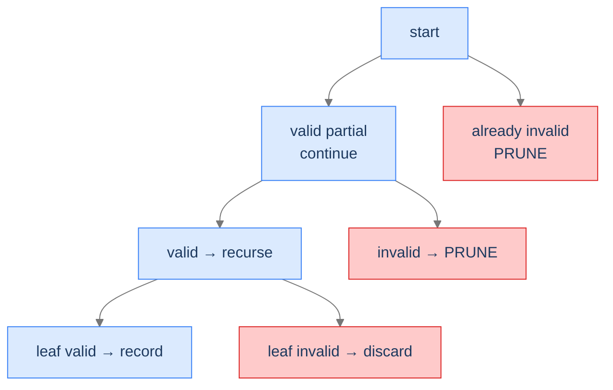
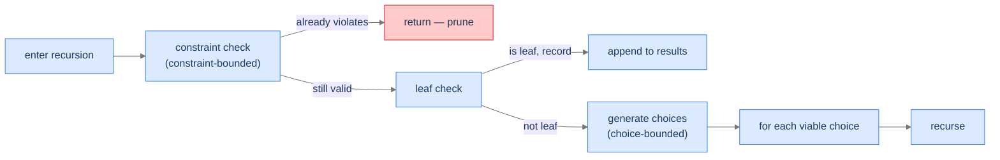

# Understanding Conditional Enumeration

A backtracking solution exhibits **conditional enumeration** when **some leaves of the state space tree aren't valid solutions** *or* **some internal nodes can be pruned because no descendant of theirs could possibly be valid**. The algorithm validates as it goes, abandons doomed paths early, and only records leaves that survive every check.

The cleanest way to see this is to compare with the unconditional template from the previous lesson. There, *every* leaf was recorded. Here, leaves are recorded only if they pass a validation check, and **internal nodes are pruned** the moment we know they can't extend to a solution.

> 🖼 Diagram — Conditional enumeration's tree shape: red nodes are pruned without exploration; green leaves are recorded only if they pass validation. The pruning is the speedup.


<p align="center"><strong>Conditional enumeration's tree shape: red nodes are pruned without exploration; green leaves are recorded only if they pass validation. The pruning is the speedup.</strong></p>

The runtime is *no longer* the full tree size. It's the size of the **explored** portion — the portion the pruning didn't cut off. For well-pruned problems, this can be exponentially smaller than the full tree. The pruning function is therefore the heart of every conditional-enumeration solution.

---

## Two Flavours of Pruning

Pruning happens in one of two places, and most problems use both:

**1. Choice-bounded pruning.** When generating choices for the next slot, *don't generate* the ones that would lead to invalid states. The `for` loop only iterates over choices that are still viable.

**2. Constraint-bounded pruning.** Inside the recursion, check the current partial state. If it already violates a constraint, return immediately without recursing further.

> 🖼 Diagram — Both kinds of pruning. Choice-bounded never even creates a doomed branch; constraint-bounded checks at the top of the recursion and returns early.


<p align="center"><strong>Both kinds of pruning. Choice-bounded never even creates a doomed branch; constraint-bounded checks at the top of the recursion and returns early.</strong></p>

Generate Parentheses below uses choice-bounded pruning (the `getChoices` function only returns characters that won't break balance). Target Sum uses constraint-bounded (skips array entries larger than the remaining target). Most real problems combine both.

---

## What Conditional Enumeration Looks Like in Code

The general shape:

```
function enumerate(state):
    if state already violates a constraint:
        return                              ← constraint-bounded prune

    if state is a complete candidate:
        if state is a valid solution:
            record(state)
        return

    for choice in viable_choices(state):    ← choice-bounded prune happens here
        extend(state, choice)
        enumerate(state)
        undo(state)
```

The two prunes appear in the two highlighted lines. Either one alone is sufficient for some problems; both together is the most powerful form.

> *Predict before reading on — for "all balanced parentheses of length 6" with no pruning at all, how many leaves does the tree have? With perfect pruning, how many leaves are valid?*

Without pruning, length-6 strings of `(` and `)` total `2⁶ = 64` candidates. With pruning, only 5 are balanced (`(((()))`, `(()(())`, `(()()()`, `(())()`, `()()()`). The pruning saves us from generating 59 doomed candidates out of 64 — about 92% of the work.

---

## Passing Data Down

Same options as unconditional: by-value (immutable) or by-reference (mutated, with explicit undo). The conditional case adds **state for constraint checking** — typically a few additional integers (counts, running sum, etc.) that ride along with the partial state.

For Generate Parentheses, the additional state is `(open_count, close_count)`. For Target Sum, it's `remaining_target`. For Generate IPs, it's the position in the string and the count of segments built so far. The auxiliary state is what makes choice-bounded pruning possible — without knowing how many `(` we've placed, we can't decide whether to allow another one.

---

## Algorithm

> **enumerate(state, aux)**
>
> 1. **Constraint check** — if `state` already violates a constraint, return.
> 2. **Leaf check** — if `state` is a complete candidate, validate; if valid, record.
> 3. **Generate viable choices** — compute the set of choices that don't immediately violate any constraint.
> 4. **Branch** — for each viable choice:
>    - Extend `state` and update `aux`.
>    - Recurse.
>    - Undo the extension.

Step 1 is constraint-bounded pruning; step 3 is choice-bounded pruning; step 4 is the same as unconditional. Together they enumerate only the viable portion of the tree.

---

## Implementation

A clean, language-agnostic implementation showing both pruning styles. We'll use Generate Parentheses as the canonical example since it has both flavours visible.


```python run viz=array viz-root=results
from typing import List

class Solution:
    def generate_balanced(self, n: int) -> List[str]:
        results: List[str] = []
        current: List[str] = []
        self._helper(n, 0, 0, current, results)
        return results

    def _helper(self, n: int, opens: int, closes: int, current: List[str], results: List[str]) -> None:
        # Leaf check: 2n characters means we have a complete candidate.
        # Because of pruning, every leaf reached here is guaranteed balanced.
        if len(current) == 2 * n:
            results.append("".join(current))
            return

        # Choice-bounded pruning: only emit choices that don't immediately
        # violate the balance constraint.
        if opens < n:                         # we can still open
            current.append("(")
            self._helper(n, opens + 1, closes, current, results)
            current.pop()
        if closes < opens:                    # we can close only if there's an open to match
            current.append(")")
            self._helper(n, opens, closes + 1, current, results)
            current.pop()


if __name__ == "__main__":
    print(Solution().generate_balanced(3))
```

```java run viz=array viz-root=results
import java.util.ArrayList;
import java.util.List;

public class Main {
    static class Solution {
        public List<String> generateBalanced(int n) {
            List<String> results = new ArrayList<>();
            StringBuilder current = new StringBuilder();
            helper(n, 0, 0, current, results);
            return results;
        }

        private void helper(int n, int opens, int closes, StringBuilder current, List<String> results) {
            if (current.length() == 2 * n) {
                results.add(current.toString());
                return;
            }
            if (opens < n) {
                current.append('(');
                helper(n, opens + 1, closes, current, results);
                current.deleteCharAt(current.length() - 1);
            }
            if (closes < opens) {
                current.append(')');
                helper(n, opens, closes + 1, current, results);
                current.deleteCharAt(current.length() - 1);
            }
        }
    }

    public static void main(String[] args) {
        System.out.println(new Solution().generateBalanced(3));
    }
}
```


---

## Complexity Analysis

| Resource | Cost | Why |
|---|---|---|
| **Time** | `O(n · C(n))` where `C(n)` is the n-th Catalan number | The `n`-th Catalan number counts well-formed parentheses of `n` pairs. Each leaf takes `O(n)` to copy. |
| **Space (output)** | `O(n · C(n))` | Same argument. |
| **Space (stack)** | `O(n)` | Recursion depth equals number of pairs. |

The Catalan number `C(n) ≈ 4^n / n^1.5` — vastly smaller than the unpruned `2^(2n)` tree. The pruning saves us roughly a factor of `n^1.5`.

> **Best Case** — Time `O(n · C(n))`, Space `O(n · C(n))`
>
> **Worst Case** — Same — pruning is deterministic; no input variation changes the tree size

---

## Key Takeaway

Conditional enumeration adds *pruning* to the unconditional template. Two flavours: choice-bounded (don't even generate doomed choices) and constraint-bounded (return early when state is already invalid). The pruning is exponential leverage. Now we'll learn how to spot conditional enumeration on sight.

# Identifying Conditional Enumeration

Three diagnostic questions decide whether conditional enumeration fits.

| # | Question | If "yes," conditional enumeration fits because... |
|---|---|---|
| **Q1** | Are some complete candidates *invalid*? | We need a validation step at the leaf — that's what makes it conditional. |
| **Q2** | Can a *partial* candidate be detected as already-doomed before completion? | Internal-node pruning is possible — the speedup. |
| **Q3** | Is the candidate built by **incremental decisions** like in unconditional? | The same recipe applies, just with extra checks. |

If all three are "yes," you're in conditional enumeration's sweet spot — same template as unconditional, plus pruning.

### Q1 — Why "some leaves are invalid"?

**Mental model.** If every leaf is automatically valid, you don't need a validation function and conditional enumeration's machinery is overkill — go back to unconditional. Conditional enumeration's value comes from the leaf-validation check that filters bad outcomes.

**Concrete check.** Generate Parentheses: many length-`2n` strings of `(` and `)` aren't balanced. ✓

**What breaks otherwise.** If every leaf is valid, the validation step at the leaf is wasted code. Just use unconditional.

### Q2 — Why "doomed-partial detection"?

**Mental model.** Pruning is possible only if a partial state can be classified as "no descendant of this state can possibly be valid." If you can't classify partial states, you have to walk the whole tree and check at the leaves only — which is still correct but loses the pruning speedup.

**Concrete check.** Generate Parentheses: a partial string with more `)` than `(` (e.g., `())`) can never extend to a balanced one. Detect this early; prune. ✓

**What breaks otherwise.** Without partial-state pruning, you're paying full unconditional cost for the search even though some leaves get rejected. Inefficient but still correct.

### Q3 — Why "incremental decisions"?

**Mental model.** The state space tree must still be built one decision at a time, just like unconditional. The pruning happens *between* decisions, not as a replacement for the decision-making structure.

**Concrete check.** Target Sum Combinations: pick a number, recurse with reduced target; pick the next number; recurse with further-reduced target. Same incremental shape as unconditional. ✓

**What breaks otherwise.** If the candidate isn't built incrementally (e.g., a single closed-form computation), backtracking isn't the right pattern at all.

---

## A Worked Example — Generate Strings With Property X

> *Pause and predict — for the problem "generate all length-6 strings of `(` and `)` that are balanced," sketch the state space tree without pruning. How many leaves? How many of those are balanced?*

Without pruning, `2⁶ = 64` candidate strings. With balance-checking only at the leaf, we'd generate all 64 and reject 59. That's the unconditional approach with leaf validation.

With pruning, we keep two counters during the descent: `opens` (number of `(`) and `closes` (number of `)`). At any step, if `closes > opens`, the partial string is already unbalanced — prune the subtree without exploring.

```
At the partial string '()(',  opens=2, closes=1:
  - We can add '(' if opens < 3.  ✓ (2 < 3)
  - We can add ')' if closes < opens. ✓ (1 < 2)

At the partial string '()))', opens=1, closes=3:
  - opens < closes — IMPOSSIBLE state. PRUNE. (we never reach this node in the pruned tree.)
```

Result: only the 5 balanced strings are walked to leaves; the other 59 are pruned at various depths. We make this concrete in **Problem 1** below.

---

## Key Takeaway

Three checks — invalid-leaf possibility, partial-state pruning possibility, incremental decisions — gate every conditional-enumeration problem. Pass all three and the algorithm slides in. Four worked problems coming up. The first introduces partial-state pruning via counters; the second adds constraint-bounded pruning; the third combines both with multi-segment validation; the fourth uses a permutation-flavoured swap-and-undo recipe.

<!-- ============================================== -->
<!-- SWEEP 2 — missing sections (placeholders only) -->
<!-- ============================================== -->

<!-- TODO: Understanding the Pattern — missing, needs to be written -->
<!--       Guidance: umbrella H2 with the subsections below -->

<!-- TODO: Why Naive Isn't Enough — missing, needs to be written -->
<!--       Guidance: motivation for why the obvious approach fails -->

<!-- TODO: The Core Idea — missing, needs to be written -->
<!--       Guidance: one paragraph: the central trick -->

<!-- TODO: How the Pointers/Window Move — missing, needs to be written -->
<!--       Guidance: mechanics of the moving parts -->

<!-- TODO: The Generic Algorithm — missing, needs to be written -->
<!--       Guidance: numbered steps, no code -->

<!-- TODO: Generic Implementation — missing, needs to be written -->
<!--       Guidance: Python block + Java block of the skeleton -->

<!-- TODO: Variants / Taxonomy — missing, needs to be written -->
<!--       Guidance: enumerate sub-shapes of this pattern -->

<!-- TODO: Recognition Checklist — missing, needs to be written -->
<!--       Guidance: 4-question diagnostic — the source of the Problem-section Diagnostic Questions -->

<!-- TODO: Canonical Example — missing, needs to be written -->
<!--       Guidance: fully worked example: brute force → optimised → template fit -->

<!-- TODO: Problems in This Category — missing, needs to be written -->
<!--       Guidance: table with links to the 02-problems/ files -->
