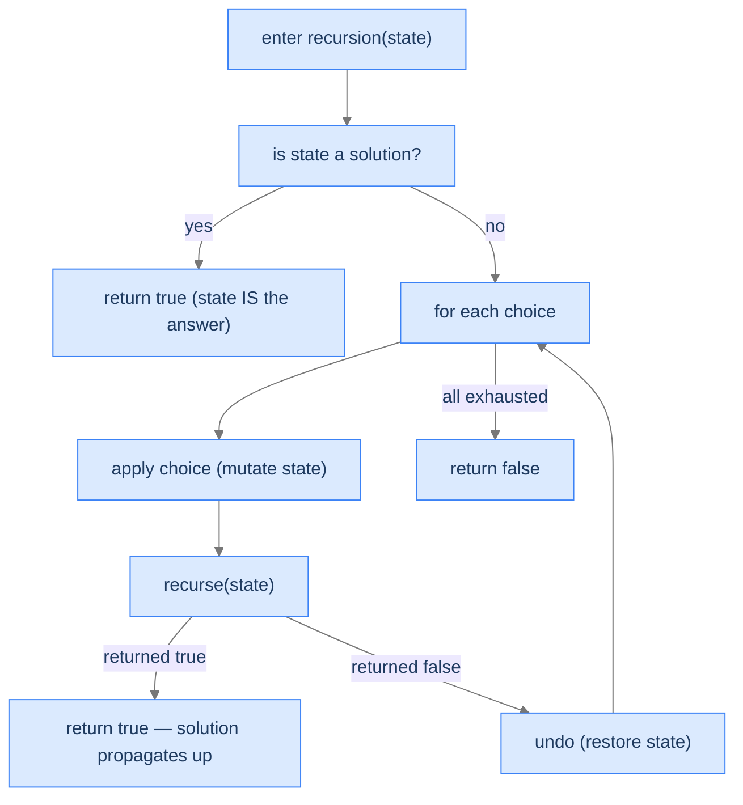

# Understanding Backtracking Search

Backtracking search is the pattern where the *state* itself is the candidate solution. The state is typically a 2D grid (maze, sudoku, chessboard) or some other structured world that the algorithm mutates as it walks the recursion. Each frame:

1. **Records its choice** by mutating the state (place a queen, mark a maze cell as visited, write a digit).
2. **Recurses**, asking "does this state extend to a solution?"
3. On the recursion's return:
   - If success — propagate success up; the state already holds the answer.
   - If failure — **undo the mutation** so the next sibling choice can be tried in a clean state.

The "undo" step is the heart of search. In unconditional enumeration, the undo was implicit (pop the last element off `current`). In search, the undo is explicit and structural — the same cell of the maze gets toggled visited/unvisited; the same chess square gets a queen placed and removed; the same sudoku cell gets a digit written and erased. **The world is the state; the world is shared; the world has to be exactly restored before the parent's loop tries the next choice.**

> 🖼 Diagram — The search recipe. Every choice is applied to the world, recursed on, and either succeeds (propagate true upward) or fails (undo and try next). The world is mutated and restored throughout the search.


<p align="center"><strong>The search recipe. Every choice is applied to the world, recursed on, and either succeeds (propagate true upward) or fails (undo and try next). The world is mutated and restored throughout the search.</strong></p>

---

## Search vs Enumeration — When the Difference Matters

Both the Unconditional Enumeration lesson and the Conditional Enumeration lesson are *enumeration* patterns: build up a partial output, record at the leaves, return all valid outputs. The search pattern in this lesson is different in three structural ways:

| Aspect | Enumeration (Unconditional and Conditional lessons) | Search (this lesson) |
|---|---|---|
| What's the "candidate"? | A partial sequence/string we're building | The world's current state (grid, board, etc.) |
| How is it stored? | Appended to a `current` list | Mutated directly in the world |
| What does the recursion return? | Usually `void` — leaves get appended via shared output | Usually `bool` — was this branch successful? |
| What does success do? | Record the leaf, continue exploring siblings | Often: return `true` immediately; siblings unnecessary |
| What does the undo restore? | The `current` list (pop the last element) | The world's state (uncolor cell, remove queen, etc.) |

> *Predict before reading on — for "find any path through a 4×4 maze," would early termination help? What about "find ALL paths through the maze"?*

For "any path," early termination saves a huge amount of work — once a path is found, the algorithm can stop. For "all paths," the algorithm must explore every successful branch *and* every failed sibling, but the undo machinery is identical. The difference is in what the recursion returns from a successful leaf — `true + propagate` for "any," `void + record + continue` for "all."

---

## What Backtracking Search Looks Like in Code

```
function search(state):
    if state is a solution:
        return true                    ← state already holds the answer

    for each viable choice:
        apply(state, choice)            ← mutate the world
        if search(state):
            return true                 ← solution found, bubble up
        undo(state, choice)             ← explicit undo on failure

    return false                        ← all choices exhausted
```

The structure is identical to conditional enumeration — except for what we do with the state and what we return. The mutation-and-undo dance is what makes the recursion's call stack double as both control flow and the *world's state at any moment in time*.

---

## Algorithm

> **search(state)**
>
> 1. **Goal check** — is `state` a complete solution? If yes, return `true`.
> 2. **Generate viable choices** — what extensions of `state` are still candidates?
> 3. **For each choice:**
>    - **Apply** — mutate `state` to reflect this choice.
>    - **Recurse** — `search(state)`.
>    - If recursion returned `true`: **return true** (success bubbles up).
>    - If recursion returned `false`: **undo** the mutation; try the next choice.
> 4. **All choices exhausted** — return `false`.

This template handles "find one" search. For "find all," replace step 3's "if true: return true" with "if true: record state; continue (don't return)." Both flavours appear in the four worked problems.

---

## Implementation

A clean, language-agnostic skeleton illustrating the search recipe with explicit undo. The scenario is a generic maze-style "can I reach the goal?" search.


```python run viz=grid viz-root=maze
from typing import List

class Solution:
    def find_path(self, maze: List[List[int]]) -> bool:
        if not maze or not maze[0]:
            return False
        return self._search(maze, 0, 0)

    def _search(self, maze: List[List[int]], row: int, col: int) -> bool:
        rows, cols = len(maze), len(maze[0])
        # Boundary / obstacle / already-visited
        if not (0 <= row < rows and 0 <= col < cols) or maze[row][col] != 0:
            return False
        # Goal check
        if row == rows - 1 and col == cols - 1:
            return True
        # Apply: mark this cell as visited (mutate the world)
        maze[row][col] = -1
        # Try all four neighbours
        for dr, dc in ((1, 0), (0, 1), (-1, 0), (0, -1)):
            if self._search(maze, row + dr, col + dc):
                # Success: state is committed; we *could* leave the trail in place,
                # but cleanly restoring is the safe default.
                maze[row][col] = 0
                return True
        # Undo on failure — restore the cell so siblings can revisit
        maze[row][col] = 0
        return False


if __name__ == "__main__":
    maze = [[0, 1, 0], [0, 0, 0], [1, 0, 0]]
    print(Solution().find_path(maze))   # True
```

```java run viz=grid viz-root=maze
public class Main {
    static class Solution {
        public boolean findPath(int[][] maze) {
            if (maze.length == 0 || maze[0].length == 0) return false;
            return search(maze, 0, 0);
        }

        private boolean search(int[][] maze, int row, int col) {
            int rows = maze.length, cols = maze[0].length;
            if (row < 0 || row >= rows || col < 0 || col >= cols || maze[row][col] != 0) return false;
            if (row == rows - 1 && col == cols - 1) return true;
            maze[row][col] = -1;                         // apply
            int[][] dirs = {{1, 0}, {0, 1}, {-1, 0}, {0, -1}};
            for (int[] d : dirs) {
                if (search(maze, row + d[0], col + d[1])) {
                    maze[row][col] = 0;
                    return true;
                }
            }
            maze[row][col] = 0;                           // undo on failure
            return false;
        }
    }

    public static void main(String[] args) {
        int[][] maze = {{0, 1, 0}, {0, 0, 0}, {1, 0, 0}};
        System.out.println(new Solution().findPath(maze));
    }
}
```


---

## Complexity Analysis

| Resource | Cost | Why |
|---|---|---|
| **Time** | `O(branching^depth)` worst case, `O(depth)` best case (early hit) | Each cell can branch into the choices not yet visited; depth is bounded by the state size. |
| **Space (stack)** | `O(depth)` | Recursion depth = path length. |
| **Space (auxiliary)** | `O(1)` if mutating the world, `O(state size)` if cloning per call | The mutation-and-undo trick avoids cloning. |

The fact that we're mutating the world means we're not paying for state copies on each call — a major speed-up over naive backtracking. The cost is having to write the explicit undo correctly. If you forget to undo, your search will give wrong answers because subsequent branches see a polluted world.

> **Best Case** — Time `O(depth)` (find solution on first descent), Space `O(depth)`
>
> **Worst Case** — Time `O(branching^depth)` (must explore the full tree)

---

## Key Takeaway

Backtracking search is enumeration's mirror image: instead of building an output by appending, we mutate the world; instead of recording leaves, we propagate `true` upward when the world is in a goal state; instead of implicit undos via `pop()`, we explicitly restore each mutation when a branch fails. The recursion's call stack is the world's history. Now we'll learn how to spot search problems vs enumeration ones.

# Identifying Backtracking Search

Three diagnostic questions decide whether backtracking search fits.

| # | Question | If "yes," backtracking search fits because... |
|---|---|---|
| **Q1** | Is the **state itself** the candidate solution? | Mutating the state tracks the search; "the answer" is wherever the state ends up. |
| **Q2** | Does success/failure naturally **propagate upward** as a boolean (or stop the search)? | Recursion's `bool` return propagates without explicit data. |
| **Q3** | Is **explicit undo** of mutations needed to restore correctness? | The world's state must be exactly restored before a sibling tries. |

If all three are "yes," backtracking search fits.

### Q1 — Why "state IS the answer"?

**Mental model.** In enumeration, we built up an output string/list separate from the input. In search, the *world* (maze, board, grid) is what we're modifying *and* what holds the final answer. There's no separate output object.

**Concrete check.** Sudoku: when the algorithm finishes, the input grid *is* the solution. ✓

**What breaks otherwise.** If the answer is a list-of-things-collected, you're closer to enumeration's recipe (the Unconditional or Conditional Enumeration lessons).

### Q2 — Why "boolean propagation"?

**Mental model.** When a sub-search succeeds, that information has to flow back to the caller without any other communication. A boolean return value does this perfectly: `if search(...) return true;`. The state's mutation is the data; the boolean is the signal.

**Concrete check.** Maze: `search(row, col)` returns `true` if there's a path to the goal from this cell. The caller uses that boolean to decide whether to stop (return `true` further up) or try the next direction. ✓

**What breaks otherwise.** If we need to record *all* solutions, we replace the boolean with a "record into shared output" step but keep everything else. The pattern still applies — just collecting more answers.

### Q3 — Why "explicit undo"?

**Mental model.** Because the state is shared and mutated, every choice we tried but didn't keep must be reversed. Otherwise, the next sibling sees a polluted world and produces wrong results.

**Concrete check.** N-Queens: after placing a queen at `(row, col)` and finding no solution from there, we *must* remove that queen before trying `(row, col+1)`. Forgetting the undo means subsequent placements see a queen that shouldn't be there. ✓

**What breaks otherwise.** If you skip the undo, your algorithm's results are wrong — and the bug is hard to find because it manifests as "wrong answers" rather than crashes.

---

## A Worked Example — Find a Path in a 3×3 Maze

> *Pause and predict — for the maze below, what's the path from `(0,0)` to `(2,2)`? How would you sketch the recursion's call stack at the moment we're at `(2,1)`?*

```
maze =
  0 0 1
  1 0 0
  0 0 0   (0 = walkable, 1 = obstacle, start (0,0), goal (2,2))
```

The path is `(0,0) → (0,1) → (1,1) → (2,1) → (2,2)` (down-right-down-right). At the moment we're standing on `(2,1)`, the stack holds frames for `(0,0)`, `(0,1)`, `(1,1)`, `(2,1)`. The cells visited so far have been mutated in the maze (set to `-1` to mark "in-progress visit"). When we extend to `(2,2)` and the goal is reached, success bubbles up; each frame, on the way up, sees `true` and either keeps the visit mark or undoes it depending on the algorithm's needs (commonly: undo to leave the maze unchanged for the caller).

We make this concrete in **Problem 1** below.

---

## Key Takeaway

Three checks — state-IS-the-answer, boolean propagation, explicit undo — gate every backtracking-search problem. Pass all three and the recipe slides in. Four worked problems coming up. The first finds *one* path; the second finds *one* word; the third finds *all* configurations of N queens; the fourth solves an entire sudoku puzzle.

<!-- ============================================== -->
<!-- SWEEP 2 — missing sections (placeholders only) -->
<!-- ============================================== -->

<!-- TODO: Understanding the Pattern — missing, needs to be written -->
<!--       Guidance: umbrella H2 with the subsections below -->

<!-- TODO: Why Naive Isn't Enough — missing, needs to be written -->
<!--       Guidance: motivation for why the obvious approach fails -->

<!-- TODO: The Core Idea — missing, needs to be written -->
<!--       Guidance: one paragraph: the central trick -->

<!-- TODO: How the Pointers/Window Move — missing, needs to be written -->
<!--       Guidance: mechanics of the moving parts -->

<!-- TODO: The Generic Algorithm — missing, needs to be written -->
<!--       Guidance: numbered steps, no code -->

<!-- TODO: Generic Implementation — missing, needs to be written -->
<!--       Guidance: Python block + Java block of the skeleton -->

<!-- TODO: Variants / Taxonomy — missing, needs to be written -->
<!--       Guidance: enumerate sub-shapes of this pattern -->

<!-- TODO: Recognition Checklist — missing, needs to be written -->
<!--       Guidance: 4-question diagnostic — the source of the Problem-section Diagnostic Questions -->

<!-- TODO: Canonical Example — missing, needs to be written -->
<!--       Guidance: fully worked example: brute force → optimised → template fit -->

<!-- TODO: Problems in This Category — missing, needs to be written -->
<!--       Guidance: table with links to the 02-problems/ files -->
