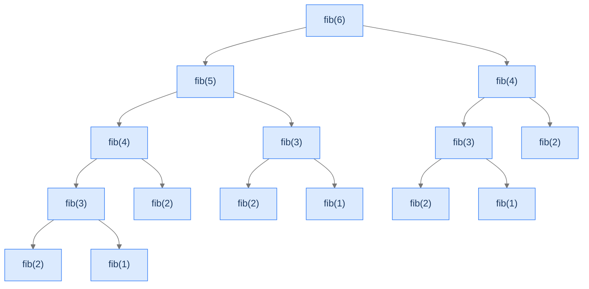
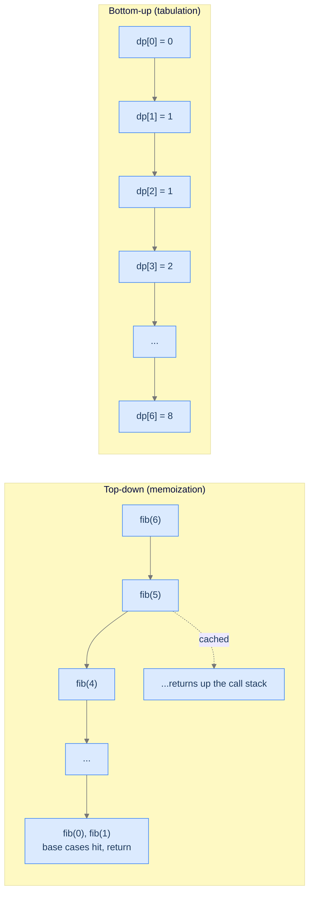

# 1. Linear DP

You wrote a recursive Fibonacci function in the recursion chapter. It worked. `fib(10)` returned in microseconds. `fib(30)` paused for a fraction of a second. `fib(40)` took seconds. `fib(50)` would take *minutes* on the same machine that loads a webpage in 100ms. Something is catastrophically wrong with how the machine is spending its time — and the diagnosis is the first lesson of dynamic programming.

This lesson opens the dynamic-programming section with the simplest DP shape — **linear DP**. The "linear" refers to the recurrence depending on a single index `i`, with each entry computed from a constant number of previous entries (`dp[i-1]`, `dp[i-2]`, etc.). Once you can write the bottom-up factorial loop and the bottom-up Fibonacci loop, you have the template that every later DP lesson extends. The scaffolding from the Recursion section is still here — just used more carefully.

## Table of contents

1. [The Recursion Disaster That Forces Memoization](#the-recursion-disaster-that-forces-memoization)
2. [What "Dynamic Programming" Actually Means](#what-dynamic-programming-actually-means)
3. [Linear DP — The Simplest Shape](#linear-dp--the-simplest-shape)
4. [Calculate Factorial](#calculate-factorial)
5. [Nth Fibonacci Number](#nth-fibonacci-number)
6. [Top-Down vs Bottom-Up — The Two Faces of Every DP Solution](#top-down-vs-bottom-up--the-two-faces-of-every-dp-solution)
7. [Space Optimisation — Throwing the Table Away](#space-optimisation--throwing-the-table-away)

***

# The Recursion Disaster That Forces Memoization

In the Multiple Recursion lesson you wrote this:

```python
def fib(n):
    if n < 2: return n
    return fib(n - 1) + fib(n - 2)
```

Three lines. Mathematically perfect. Computationally radioactive. To see why, count how many times `fib(2)` gets computed when you ask for `fib(6)`:



<p align="center"><strong>The recursion tree for <code>fib(6)</code>. Every <code>fib(2)</code> node represents the *same computation* — done from scratch. Five copies. <code>fib(3)</code> appears three times. <code>fib(4)</code> twice. The work doubles roughly every level we go up.</strong></p>

For `fib(n)`, the call count is roughly `2^n / √5` — exponential. `fib(50)` makes about a *trillion* calls. Each call is a few nanoseconds; a trillion of them is hours.

The pathology is duplicate work. The same subproblem is solved over and over. **Dynamic programming exists to fix exactly this disease.** The cure is one short sentence: *solve every subproblem once, store the answer, look it up next time*.

> *Predict before reading on — what's the smallest change you could make to the recursive `fib` to remove all duplicate work? Don't write it; just describe the idea.*

The answer most people land on: a dictionary that maps `n → fib(n)`. Before computing `fib(n)`, check if it's in the dictionary. If yes, return the cached value. If no, compute it, store it, then return. The dictionary collapses the exponential tree into a linear chain — every subproblem solved exactly once.

That dictionary is the entire idea of DP. Everything else in this section is technique for choosing *what* the subproblems are, *how* they relate, and *which order* to compute them in.

---

## Key Takeaway

The recursive Fibonacci is exponential because identical subproblems get solved repeatedly. DP's core move is to solve each subproblem once and reuse the answer — turning the exponential tree into linear work.

***

# What "Dynamic Programming" Actually Means

The phrase is misleading. Richard Bellman coined it in the 1950s — and admitted later that he chose "dynamic" to sound impressive to a budget-conscious congress, and "programming" because that meant "scheduling" at the time. Neither word means what they sound like. **Dynamic programming has nothing to do with dynamic types or computer programming languages.** It's a problem-solving technique with two requirements:

1. **Optimal substructure** — the problem's answer can be built from answers to smaller versions of itself.
2. **Overlapping subproblems** — those smaller versions repeat across the recursion tree.

When both hold, you can solve the problem by:

1. Identifying the subproblems (usually indexed by integers).
2. Writing the **recurrence relation** that ties a subproblem to smaller ones.
3. Computing every subproblem exactly once and storing the answer.
4. Reading the final answer out of the table.

That's it. The four pieces are the entire DP recipe.

```d2
recipe: "The DP Recipe" {
  grid-rows: 4
  grid-columns: 1
  grid-gap: 0
  s1: |md
    **1. Define the subproblem.** What does dp[i] *mean*? — usually "the answer to a smaller version of the original problem".
  |
  s2: |md
    **2. Write the recurrence.** How does dp[i] depend on dp[i−1], dp[i−2], etc.? — this is the relationship you'd write recursively.
  |
  s3: |md
    **3. Initialise the base cases.** What are dp[0], dp[1]? — the smallest instances whose answers are known directly.
  |
  s4: |md
    **4. Fill the table in dependency order.** From smallest to largest, computing each dp[i] from already-computed predecessors.
  |
}
```

<p align="center"><strong>Every DP solution in this section follows the same four steps. The lesson lies in identifying the subproblem and the recurrence — once those are right, the code writes itself.</strong></p>

---

## Optimal Substructure — A Concrete Check

A problem has **optimal substructure** if the optimal answer to size `n` can be expressed in terms of optimal answers to smaller sizes.

- Factorial: `fact(n) = n × fact(n-1)`. ✓ Optimal substructure — the answer at `n` is fully determined by the answer at `n-1`.
- Fibonacci: `fib(n) = fib(n-1) + fib(n-2)`. ✓ Optimal substructure — answer at `n` depends on answers at `n-1` and `n-2`.
- "Find any path through a graph": ✗ No optimal substructure in general — the optimal sub-path of an optimal path isn't always itself optimal (e.g. longest simple path).

Most counting, optimization, and feasibility problems on sequences and grids have optimal substructure. Spotting it is the first step of every DP solution.

---

## Overlapping Subproblems — A Concrete Check

A problem has **overlapping subproblems** if the recursive solution would solve the same subproblem multiple times.

- Factorial recursion: `fact(5) → fact(4) → fact(3) → fact(2) → fact(1)`. **No overlap** — each subproblem is hit once. DP is *not necessary* (but it's still convenient and has the same complexity as the recursive version, just with explicit storage).
- Fibonacci recursion: `fib(6) → fib(5) → … fib(2) called 5 times`. **Heavy overlap.** DP gives massive speedup (`O(2^n)` → `O(n)`).

When subproblems overlap, DP gives an exponential speedup. When they don't, DP is just a clean reformulation of the recursion. **Spotting overlap is what tells you DP will be a win.**

> *Pause. Does longest-common-subsequence have overlapping subproblems? Does the knapsack problem? Don't compute — just predict yes/no for each.*

Both **yes** — you'll see why in the upcoming lessons. Both turn into DP solutions that run in a fraction of the time the brute-force recursion would take.

---

## Key Takeaway

DP needs two things: *optimal substructure* (answers compose from smaller answers) and *overlapping subproblems* (smaller answers get reused). When both hold, store-and-reuse turns exponential recursion into linear (or polynomial) iteration.

***

# Linear DP — The Simplest Shape

**Linear DP** is the shape where:

- The state is a single integer `i` (`dp[i]`).
- The recurrence depends on a constant number of earlier entries (`dp[i-1]`, `dp[i-2]`, etc.).
- The table is filled left-to-right.

This is the simplest DP shape — and the one we use to introduce the discipline. Factorial and Fibonacci both fit. So do "climbing stairs," "house robber," "minimum cost of climbing," and dozens of similar warm-up problems.

The tabular shape:

```d2
grid: "Linear DP table" {
  grid-rows: 2
  grid-columns: 7
  grid-gap: 0
  v0: "dp[0]" {style.fill: "#fde68a"; style.stroke: "#d97706"}
  v1: "dp[1]"
  v2: "dp[2]"
  v3: "dp[3]"
  v4: "dp[4]"
  v5: "..."
  v6: "dp[n]"
  l0: "base"
  l1: "base"
  l2: "f(dp[1],dp[0])"
  l3: "f(dp[2],dp[1])"
  l4: "f(dp[3],dp[2])"
  l5: ""
  l6: "answer"
}
```

<p align="center"><strong>One row, n+1 cells, filled left-to-right. Each cell after the base cases depends on a constant number of earlier cells via the recurrence <code>f</code>. The final answer is in <code>dp[n]</code>.</strong></p>

The "linear" refers to the *shape of the dependency*, not the running time (although for our examples both are linear). In later lessons (LCS, edit distance) we'll lift to 2D tables; in still later ones (knapsack, MCM) we'll lift to richer states. But the scaffolding stays the same.

---

## Key Takeaway

Linear DP is one row of cells, filled left-to-right. Each cell after the base cases is computed from a constant number of earlier cells. Master this shape and the rest of the section is incremental.

***

# Calculate Factorial

The factorial of a positive integer `n` is `n! = n × (n-1) × (n-2) × … × 1`, with `0! = 1` by convention. It's the classic linear-DP warm-up: there's no overlap, so DP isn't strictly *necessary*, but it lets us walk through the four-step recipe on a problem with no surprises.

## The Problem

Given a non-negative integer `n`, return `n!`. Aim for `O(n)` time.

```
Input:  n = 7
Output: 5040
        Because 7 × 6 × 5 × 4 × 3 × 2 × 1 = 5040.

Input:  n = 5
Output: 120

Input:  n = 0
Output: 1   (0! is 1 by convention)
```

---

## Step 1 — Define the Subproblem

`dp[i]` = factorial of `i`. That's it. The subproblem at index `i` is "what's `i!`?".

## Step 2 — Write the Recurrence

`i! = i × (i-1)!` for `i ≥ 1`. In DP terms: `dp[i] = i × dp[i-1]`.

## Step 3 — Initialise the Base Cases

`0! = 1`, so `dp[0] = 1`. That's the only base case we need; from there every `dp[i]` follows from the recurrence.

## Step 4 — Fill the Table

```d2
direction: right
grid: "Filling dp for n = 5" {
  grid-rows: 2
  grid-columns: 6
  grid-gap: 0
  v0: "1" {style.fill: "#fde68a"; style.stroke: "#d97706"}
  v1: "1"
  v2: "2"
  v3: "6"
  v4: "24"
  v5: "120"
  l0: "dp[0]<br/>(base)"
  l1: "dp[1]<br/>1×1"
  l2: "dp[2]<br/>2×1"
  l3: "dp[3]<br/>3×2"
  l4: "dp[4]<br/>4×6"
  l5: "dp[5]<br/>5×24"
}
```

<p align="center"><strong>The dp array for <code>n = 5</code>, filled left to right. <code>dp[0]</code> is the base. Each later cell is <code>i × dp[i-1]</code>.</strong></p>

## The Solution


```pseudocode
function calculateFactorial(n):
    dp ← list of (n + 1) zeros          # dp[i] = i!
    dp[0] ← 1                            # base case: 0! = 1
    for i from 1 to n:
        dp[i] ← i × dp[i − 1]            # recurrence: i! = i · (i−1)!
    return dp[n]
```

```python run
from typing import List

class Solution:
    def calculate_factorial(self, n: int) -> int:
        # dp[i] = i!. We need indices 0..n, so allocate n+1 cells.
        dp: List[int] = [0] * (n + 1)
        dp[0] = 1                                # Base case: 0! = 1
        for i in range(1, n + 1):
            dp[i] = i * dp[i - 1]                # Recurrence: i! = i × (i-1)!
        return dp[n]                             # Answer lives at dp[n]


if __name__ == "__main__":
    print(Solution().calculate_factorial(7))     # 5040
```

```java run
public class Solution {
    public long calculateFactorial(int n) {
        long[] dp = new long[n + 1];             // dp[i] = i!
        dp[0] = 1;                               // Base case
        for (int i = 1; i <= n; i++) {
            dp[i] = i * dp[i - 1];               // Recurrence
        }
        return dp[n];
    }

    public static void main(String[] args) {
        System.out.println(new Solution().calculateFactorial(7));   // 5040
    }
}
```

```c run
#include <stdio.h>

long long calculate_factorial(int n) {
    long long dp[64];                            // n! grows fast; 64 cells is more than enough for any int n
    dp[0] = 1;
    for (int i = 1; i <= n; i++) {
        dp[i] = (long long) i * dp[i - 1];
    }
    return dp[n];
}

int main(void) {
    printf("%lld\n", calculate_factorial(7));    // 5040
    return 0;
}
```

```scala run
class Solution {
  def calculateFactorial(n: Int): Long = {
    val dp = Array.fill(n + 1)(0L)
    dp(0) = 1
    for (i <- 1 to n) dp(i) = i.toLong * dp(i - 1)
    dp(n)
  }
}

object Main extends App {
  println(new Solution().calculateFactorial(7))  // 5040
}
```


<details>
<summary><strong>Trace — n = 5</strong></summary>

```
dp[0] = 1                       (base case)
dp[1] = 1 × dp[0] = 1 × 1 = 1
dp[2] = 2 × dp[1] = 2 × 1 = 2
dp[3] = 3 × dp[2] = 3 × 2 = 6
dp[4] = 4 × dp[3] = 4 × 6 = 24
dp[5] = 5 × dp[4] = 5 × 24 = 120
Return dp[5] = 120  ✓
```

The trace shows each cell computed once, in left-to-right order, depending only on the cell directly to its left. That single-cell dependency is what makes this *linear* DP.

</details>

---

## Complexity Analysis

| Aspect | Cost | Why |
|---|---|---|
| Time | `O(n)` | One pass; each cell is one multiplication. |
| Space | `O(n)` | The `dp` array. (Reducible to `O(1)` since each cell only needs the previous one — see Space Optimisation below.) |

---

## Edge Cases

| Case | Example | Expected | Reasoning |
|---|---|---|---|
| `n = 0` | — | `1` | `0! = 1` by convention. The base case directly returns this. |
| `n = 1` | — | `1` | The loop runs once: `dp[1] = 1 × dp[0] = 1`. |
| Large `n` | `n = 20` | `2_432_902_008_176_640_000` | Exceeds 32-bit signed range; need 64-bit (or BigInt in JS/TS) to avoid overflow. |
| Very large `n` | `n = 100` | A 158-digit number | Even 64-bit overflows. The Python and JS/TS implementations handle this with arbitrary precision; the others would need an explicit big-integer library. |

The overflow story is the most interesting edge case. Factorial grows faster than exponential; `21!` already overflows 64-bit signed integers. **Production code that computes factorial usually returns the result modulo a large prime** (often `10^9 + 7`) — exactly the convention the next problem uses.

---

## Final Takeaway

Factorial is the simplest possible DP: 1D table, each cell from one previous cell, no overlap to even motivate caching — but the *shape* of the solution is the same shape every later DP lesson uses. **You're not learning factorial; you're learning the recipe.**

> *Transfer challenge:* Modify the code to compute the factorial *modulo* `10^9 + 7`. (Hint: change the multiplication to `dp[i] = (i * dp[i-1]) % MOD`.) Why does this matter for the next problem?

<details>
<summary><strong>Answer</strong></summary>

```python run
class Solution:
    def calculate_factorial_mod(self, n: int) -> int:
        MOD = 1_000_000_007
        dp = [0] * (n + 1)
        dp[0] = 1
        for i in range(1, n + 1):
            dp[i] = (i * dp[i - 1]) % MOD
        return dp[n]
```

The modulo lets us return a meaningful answer even when the true factorial is astronomical. Without it, `n = 100` overflows every fixed-width integer; with it, every `dp[i]` stays in `[0, 10^9 + 6]`. **The Fibonacci problem next uses exactly this convention** — and so does most competitive-programming code.

</details>

***

# Nth Fibonacci Number

This is the canonical "this is why DP exists" problem. The recursive form is exponential; the DP form is linear. The transformation is a single ten-line loop.

## The Problem

The Fibonacci sequence is defined by `F(0) = 0`, `F(1) = 1`, and `F(n) = F(n-1) + F(n-2)` for `n ≥ 2`. Given `n`, return `F(n) mod (10^9 + 7)` to keep the result inside 32-bit. Aim for `O(n)` time.

```
Input:  n = 3
Output: 2     F(3) = F(2) + F(1) = 1 + 1 = 2

Input:  n = 6
Output: 8     0, 1, 1, 2, 3, 5, 8

Input:  n = 0
Output: 0
```

---

## Step 1 — Define the Subproblem

`dp[i]` = the i-th Fibonacci number, mod `10^9 + 7`.

## Step 2 — Write the Recurrence

`dp[i] = (dp[i-1] + dp[i-2]) mod (10^9 + 7)` for `i ≥ 2`.

## Step 3 — Initialise the Base Cases

`dp[0] = 0`, `dp[1] = 1`. **Two** base cases this time, because the recurrence reaches back two steps.

## Step 4 — Fill the Table

```d2
direction: right
grid: "Filling dp for n = 6" {
  grid-rows: 2
  grid-columns: 7
  grid-gap: 0
  v0: "0" {style.fill: "#fde68a"; style.stroke: "#d97706"}
  v1: "1" {style.fill: "#fde68a"; style.stroke: "#d97706"}
  v2: "1"
  v3: "2"
  v4: "3"
  v5: "5"
  v6: "8"
  l0: "dp[0]<br/>(base)"
  l1: "dp[1]<br/>(base)"
  l2: "dp[2]<br/>0+1"
  l3: "dp[3]<br/>1+1"
  l4: "dp[4]<br/>2+1"
  l5: "dp[5]<br/>3+2"
  l6: "dp[6]<br/>5+3"
}
```

<p align="center"><strong>The dp array for <code>n = 6</code>. <code>dp[0]</code> and <code>dp[1]</code> are the bases. Every later cell is the sum of the two previous cells.</strong></p>

## The Solution


```pseudocode
# Bottom-up tabulation. O(n) time, O(n) space.
function nthFibonacci(n):
    if n < 2: return n
    MOD ← 10⁹ + 7
    dp ← list of (n + 1) zeros
    dp[0] ← 0; dp[1] ← 1                 # two base cases
    for i from 2 to n:
        dp[i] ← (dp[i − 1] + dp[i − 2]) mod MOD
    return dp[n]
```

```python run
from typing import List

class Solution:
    def nth_fibonacci(self, n: int) -> int:
        if n < 2:                                # Handle the two base cases up front
            return n
        MOD = 1_000_000_007
        dp: List[int] = [0] * (n + 1)
        dp[0], dp[1] = 0, 1                      # Two base cases
        for i in range(2, n + 1):
            dp[i] = (dp[i - 1] + dp[i - 2]) % MOD
        return dp[n]


if __name__ == "__main__":
    print(Solution().nth_fibonacci(6))           # 8
    print(Solution().nth_fibonacci(50))          # 12586269025 % MOD = 586268941
```

```java run
public class Solution {
    public int nthFibonacci(int n) {
        if (n < 2) return n;
        final int MOD = 1_000_000_007;
        long[] dp = new long[n + 1];
        dp[0] = 0; dp[1] = 1;
        for (int i = 2; i <= n; i++) {
            dp[i] = (dp[i - 1] + dp[i - 2]) % MOD;
        }
        return (int) dp[n];
    }

    public static void main(String[] args) {
        System.out.println(new Solution().nthFibonacci(6));    // 8
    }
}
```

```c run
#include <stdio.h>

#define MOD 1000000007

long long nth_fibonacci(int n) {
    if (n < 2) return n;
    long long dp[100001];                        // Large enough for typical contest constraints
    dp[0] = 0; dp[1] = 1;
    for (int i = 2; i <= n; i++) {
        dp[i] = (dp[i - 1] + dp[i - 2]) % MOD;
    }
    return dp[n];
}

int main(void) {
    printf("%lld\n", nth_fibonacci(6));          // 8
    return 0;
}
```

```scala run
class Solution {
  def nthFibonacci(n: Int): Int = {
    if (n < 2) return n
    val MOD = 1000000007L
    val dp = Array.fill(n + 1)(0L)
    dp(0) = 0; dp(1) = 1
    for (i <- 2 to n) dp(i) = (dp(i - 1) + dp(i - 2)) % MOD
    dp(n).toInt
  }
}

object Main extends App {
  println(new Solution().nthFibonacci(6))   // 8
}
```


<details>
<summary><strong>Trace — n = 6</strong></summary>

```
dp[0] = 0                            (base)
dp[1] = 1                            (base)
dp[2] = (dp[1] + dp[0]) = 1 + 0 = 1
dp[3] = (dp[2] + dp[1]) = 1 + 1 = 2
dp[4] = (dp[3] + dp[2]) = 2 + 1 = 3
dp[5] = (dp[4] + dp[3]) = 3 + 2 = 5
dp[6] = (dp[5] + dp[4]) = 5 + 3 = 8
Return dp[6] = 8  ✓
```

Each cell is the sum of the two cells immediately before it. The mod doesn't kick in until later (around `n = 80`), but the operation is the same regardless.

</details>

---

## Complexity Analysis

| Aspect | Cost | Why |
|---|---|---|
| Time | `O(n)` | One pass; each cell is one addition + one modulo. |
| Space | `O(n)` | The `dp` array. Reducible to `O(1)` — see below. |

Compare to the recursive version's `O(2^n)` time. For `n = 50`: recursive ≈ 1.1 trillion calls; DP = 50 iterations. **A 22 billion times speedup, with the same correctness, from one observation: solve each subproblem once.**

---

## Edge Cases

| Case | Example | Expected | Reasoning |
|---|---|---|---|
| `n = 0` | — | `0` | Base case — handled by the early `if n < 2: return n`. |
| `n = 1` | — | `1` | Base case — handled by the same early return. |
| `n = 2` | — | `1` | Smallest case where the loop executes; `dp[2] = dp[1] + dp[0] = 1`. |
| Large `n` | `n = 1000000` | Some value mod `10^9+7` | The mod keeps every cell in 32-bit range; the loop runs in milliseconds. |
| `n < 0` | `n = -1` | Undefined | The problem statement says non-negative; defensive code might `assert n >= 0` or throw. |

---

## Final Takeaway

Recursive Fibonacci was exponential because of duplicate subproblems. DP Fibonacci is linear because we solve every subproblem once. The transformation is mechanical — and it's the *same* transformation we'll apply to every problem in this section. **You just learned the technique that powers every later DP lesson.**

> *Transfer challenge:* The Fibonacci recurrence depends on only the *two* most recent entries. Do we actually need to store the entire `dp` array? What's the smallest amount of state we can get away with? Sketch the algorithm before reading on.

***

# Top-Down vs Bottom-Up — The Two Faces of Every DP Solution

Every DP problem has two equivalent implementations. They produce the same answer, have the same Big-O time, and differ only in *direction* of computation.

**Top-down (memoization)** writes the recurrence as a recursive function and caches results in a dictionary or array. It computes only the subproblems actually needed.

**Bottom-up (tabulation)** allocates a table up front and fills it iteratively from the smallest subproblem to the largest. It computes every cell whether or not it's strictly needed.



<p align="center"><strong>Top-down recurses from the answer down to the bases, caching as it returns. Bottom-up builds from the bases up to the answer, no recursion. Same complexity; different control flow.</strong></p>

## Top-Down Fibonacci


```pseudocode
# Top-down: recursion + memoization. Each subproblem solved once.
function fibTopDown(n):
    memo ← empty Map: Integer → Integer
    return fib(n, memo)

function fib(n, memo):
    if n < 2: return n
    if n is in memo:                     # cache hit — already solved
        return memo[n]
    memo[n] ← (fib(n − 1, memo) + fib(n − 2, memo)) mod (10⁹ + 7)
    return memo[n]
```

```python run
from typing import Dict

class Solution:
    def fib_top_down(self, n: int) -> int:
        memo: Dict[int, int] = {}
        return self._fib(n, memo)

    def _fib(self, n: int, memo: Dict[int, int]) -> int:
        if n < 2:
            return n
        if n in memo:                            # Cache hit — return the answer we already computed
            return memo[n]
        memo[n] = (self._fib(n - 1, memo) + self._fib(n - 2, memo)) % 1_000_000_007
        return memo[n]


if __name__ == "__main__":
    print(Solution().fib_top_down(6))            # 8
```

```java run
import java.util.HashMap;
import java.util.Map;

public class Solution {
    private static final int MOD = 1_000_000_007;
    private final Map<Integer, Integer> memo = new HashMap<>();

    public int fibTopDown(int n) {
        if (n < 2) return n;
        if (memo.containsKey(n)) return memo.get(n);
        int res = (fibTopDown(n - 1) + fibTopDown(n - 2)) % MOD;
        memo.put(n, res);
        return res;
    }

    public static void main(String[] args) {
        System.out.println(new Solution().fibTopDown(6));   // 8
    }
}
```

```c run
#include <stdio.h>
#include <string.h>

#define MOD 1000000007
#define MAX_N 100001

long long memo[MAX_N];

long long fib_top_down(int n) {
    if (n < 2) return n;
    if (memo[n] != -1) return memo[n];
    memo[n] = (fib_top_down(n - 1) + fib_top_down(n - 2)) % MOD;
    return memo[n];
}

int main(void) {
    memset(memo, -1, sizeof(memo));              // Sentinel: -1 means "not yet computed"
    printf("%lld\n", fib_top_down(6));           // 8
    return 0;
}
```

```scala run
import scala.collection.mutable

class Solution {
  private val memo = mutable.Map[Int, Long]()
  private val MOD = 1000000007L

  def fibTopDown(n: Int): Int = {
    if (n < 2) return n
    memo.getOrElseUpdate(n, (fibTopDown(n - 1) + fibTopDown(n - 2)) % MOD).toInt
  }
}

object Main extends App {
  println(new Solution().fibTopDown(6))    // 8
}
```


## When to Pick Which

| Choose | When |
|---|---|
| **Bottom-up** | Default for clean, simple problems. No recursion overhead, no stack overflow risk, and often the most cache-friendly. |
| **Top-down** | When the natural way to write the problem is recursive, or when you only need a *small fraction* of subproblems (sparse DP). |

For the rest of this section, every solution is presented bottom-up unless the recurrence makes top-down genuinely cleaner. The conventions are not load-bearing — pick the one you find easier to read.

---

## Key Takeaway

Top-down memoizes a recursive function; bottom-up fills a table iteratively. They're mathematically equivalent. Bottom-up is the default in this section because it's simpler, safer (no stack overflow), and matches the table-driven mental model.

***

# Space Optimisation — Throwing the Table Away

The Fibonacci recurrence depends on `dp[i-1]` and `dp[i-2]`. The other `n - 1` cells of the array are never referenced again after they're computed. **We don't need to store them.** Two scalar variables are enough.

```d2
direction: right
optim: "Space-optimised Fibonacci" {
  grid-rows: 2
  grid-columns: 4
  grid-gap: 0
  v0: "prev2 = 0"
  v1: "prev1 = 1"
  v2: "curr = prev1 + prev2"
  v3: "shift: prev2 ← prev1, prev1 ← curr"
  l0: "i-2 cell"
  l1: "i-1 cell"
  l2: "compute new cell"
  l3: "advance window"
}
```

<p align="center"><strong>The two-variable trick. <code>prev1</code> and <code>prev2</code> are a sliding window of size 2 over the dp array. Each iteration computes the next value and advances the window forward.</strong></p>

## The Optimised Solution


```pseudocode
# Space-optimized: keep only the last two values. O(n) time, O(1) space.
function fibOptimised(n):
    if n < 2: return n
    MOD ← 10⁹ + 7
    prev2 ← 0; prev1 ← 1
    for i from 2 to n:
        curr ← (prev1 + prev2) mod MOD
        prev2 ← prev1
        prev1 ← curr                     # slide the window forward by one
    return prev1
```

```python run
class Solution:
    def fib_optimised(self, n: int) -> int:
        if n < 2:
            return n
        MOD = 1_000_000_007
        prev2, prev1 = 0, 1
        for _ in range(2, n + 1):
            curr = (prev1 + prev2) % MOD         # Compute the new term
            prev2, prev1 = prev1, curr           # Slide the window forward by one
        return prev1


if __name__ == "__main__":
    print(Solution().fib_optimised(6))           # 8
    print(Solution().fib_optimised(50))          # 12586269025 % MOD
```

```java run
public class Solution {
    public int fibOptimised(int n) {
        if (n < 2) return n;
        final int MOD = 1_000_000_007;
        long prev2 = 0, prev1 = 1, curr = 0;
        for (int i = 2; i <= n; i++) {
            curr = (prev1 + prev2) % MOD;
            prev2 = prev1;
            prev1 = curr;
        }
        return (int) prev1;
    }
}
```

```c run
#include <stdio.h>

#define MOD 1000000007

long long fib_optimised(int n) {
    if (n < 2) return n;
    long long prev2 = 0, prev1 = 1, curr = 0;
    for (int i = 2; i <= n; i++) {
        curr = (prev1 + prev2) % MOD;
        prev2 = prev1;
        prev1 = curr;
    }
    return prev1;
}

int main(void) {
    printf("%lld\n", fib_optimised(50));         // Some value mod 1e9+7
    return 0;
}
```

```scala run
class Solution {
  def fibOptimised(n: Int): Int = {
    if (n < 2) return n
    val MOD = 1000000007L
    var prev2 = 0L; var prev1 = 1L
    for (_ <- 2 to n) {
      val curr = (prev1 + prev2) % MOD
      prev2 = prev1; prev1 = curr
    }
    prev1.toInt
  }
}
```


## When Space Optimisation Applies

Space-optimisation works whenever the recurrence references only the last `k` cells for some constant `k`. The pattern is:

| `dp[i]` depends on... | Storage needed |
|---|---|
| `dp[i-1]` only | One scalar |
| `dp[i-1]` and `dp[i-2]` | Two scalars (the Fibonacci case) |
| `dp[i-1]` through `dp[i-k]` for fixed `k` | A length-`k` rolling buffer |

When the recurrence references arbitrarily-old entries (e.g. `dp[i] = max(dp[j] + ...) for all j < i`), full storage is required.

---

## Key Takeaway

If the recurrence's window is bounded, the DP table can be reduced to a rolling buffer of just the cells the window covers. Same answer, same time complexity, `O(1)` space instead of `O(n)`. We'll use this trick repeatedly through the section.

> *Transfer challenge for the next lesson:* The next problem — Longest Increasing Subsequence — has a recurrence like `dp[i] = 1 + max(dp[j] for j < i if arr[j] < arr[i])`. Can you space-optimise it? Why or why not? Don't solve LIS yet; just predict whether the rolling-buffer trick will work.

<details>
<summary><strong>Answer</strong></summary>

**No.** The recurrence references *every* earlier entry where `arr[j] < arr[i]`, not just the last few. The window is unbounded — any of `dp[0]`, `dp[1]`, …, `dp[i-1]` could be the one that gives the maximum. Without bounded look-back, you have to keep them all. The next lesson is `O(n)` space at minimum (with the simple solution; there's a clever `O(n log n)` solution too — but it uses a different data structure entirely).

</details>
