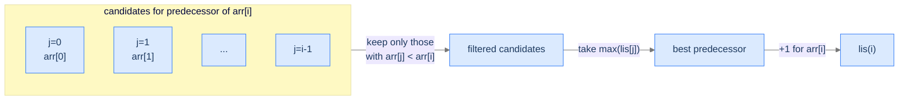
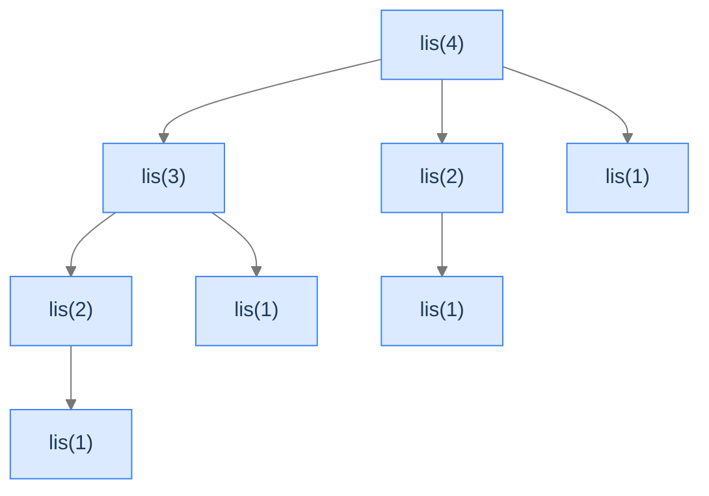

# 2. Longest Increasing Subsequence

A monitoring graph crosses your screen and you ask one simple question: *what's the longest run where the metric kept improving?* Not consecutive — improvements are allowed to be interrupted by dips, as long as you skip the dips. The graph might be 10,000 points; the answer might be 47. On the surface this is a "look at the picture" question. Underneath it's one of the foundational problems of dynamic programming, and the algorithm that solves it shows up in version-control diff tools, financial trend detection, and the analysis of any sequence where you want to find the longest "improving" sub-trace.

By the end of this lesson you'll know the **Longest Increasing Subsequence** (LIS) recurrence — `lis(i) = 1 + max(lis(j))` over earlier `j` with `arr[j] < arr[i]` — the `O(n²)` DP that follows from it, the trick to recover the actual subsequence from the table, and the related "largest sum ascending subsequence" variant that's structurally identical with one operator changed.

## Table of contents

1. [The Increasing-Subsequence Problem](#the-increasing-subsequence-problem)
2. [Optimal Substructure — Why DP Applies](#optimal-substructure--why-dp-applies)
3. [Overlapping Subproblems — Why DP Wins](#overlapping-subproblems--why-dp-wins)
4. [Longest Increasing Subsequence](#longest-increasing-subsequence)
5. [Largest Sum Ascending Subsequence](#largest-sum-ascending-subsequence)

***

# The Increasing-Subsequence Problem

Given an array `arr` of length `n`, a **subsequence** is any selection of elements from `arr` that preserves their original order. Elements don't have to be adjacent — you can skip any number of them — but you can't reorder.

```d2
direction: right
arr: "Array — pick a subsequence by selecting any subset, preserving order" {
  grid-rows: 2
  grid-columns: 6
  grid-gap: 0
  v0: "9"
  v1: "5" {style.fill: "#fde68a"; style.stroke: "#d97706"}
  v2: "10"
  v3: "6" {style.fill: "#fde68a"; style.stroke: "#d97706"}
  v4: "9"
  v5: "7" {style.fill: "#fde68a"; style.stroke: "#d97706"}
  l0: "[0]"
  l1: "[1]"
  l2: "[2]"
  l3: "[3]"
  l4: "[4]"
  l5: "[5]"
}
```

<p align="center"><strong>From <code>[9, 5, 10, 6, 9, 7]</code>, the highlighted indices [1, 3, 5] form the subsequence <code>[5, 6, 7]</code>. Order preserved; skipping allowed; not necessarily contiguous.</strong></p>

The **longest increasing subsequence** is the longest such selection where every element is strictly greater than the one before it in the subsequence. For `[9, 5, 10, 6, 9, 7, 8]` the LIS is `[5, 6, 7, 8]` with length 4. (`[5, 9]` is also increasing but shorter; `[5, 6, 7, 8]` is the longest.)

The brute force is to enumerate all `2^n` subsequences and check each. That's hopeless for `n > 30` or so. DP brings it to `O(n²)`. (A clever variant gets to `O(n log n)`, which we'll mention but not implement here.)

> *Predict before reading on — for the array <code>[5, 6, 1, 4, 3, 8, 2]</code>, what's the LIS? Sketch it before reading on.*

The LIS is `[5, 6, 8]` (length 3) or equivalently `[1, 4, 8]` or `[1, 3, 8]`. All three are length 3; the algorithm only needs to return the *length*, but each could be reconstructed if needed.

---

## Key Takeaway

A subsequence preserves order but allows skipping. The LIS is the longest such selection that's strictly increasing. Brute force is exponential; DP makes it polynomial.

***

# Optimal Substructure — Why DP Applies

Define `lis(i)` = the length of the longest increasing subsequence **ending exactly at index `i`**. Two facts make DP work:

**Fact 1 — Any LIS ending at `i` extends a shorter LIS ending at some earlier `j`.** If the LIS ending at `i` is `[..., arr[j], arr[i]]`, then dropping the last element yields an increasing subsequence ending at `j` — which must have been the longest such (otherwise we could swap it for an even longer one and get a longer LIS at `i`, a contradiction).

**Fact 2 — The element preceding `arr[i]` in the LIS must be less than `arr[i]`.** That's the definition of "increasing." So the predecessor `j` is constrained: `j < i` and `arr[j] < arr[i]`.

Combining both:

```
lis(i) = 1 + max( lis(j) for all j where 0 ≤ j < i and arr[j] < arr[i] )
       = 1                                    if no such j exists
```

The base case is `lis(0) = 1` — the single element `arr[0]` on its own. For any later `i` with no earlier `arr[j]` smaller than `arr[i]`, we still get `lis(i) = 1` (the element by itself).



<p align="center"><strong>The recurrence: scan all earlier indices; keep those whose value is less than <code>arr[i]</code>; take the longest LIS among them; add 1 for <code>arr[i]</code> itself.</strong></p>

**Why is the answer not simply `lis(n-1)`?** Because the LIS could end *anywhere*, not necessarily at the last index. The final answer is `max(lis(i))` over all `i ∈ [0, n-1]`.

---

## Key Takeaway

`lis(i)` is the LIS ending at `i`. Each is built by extending an earlier `lis(j)` where `arr[j] < arr[i]`. The answer is `max(lis(i))` over all `i` because the LIS doesn't have to end at the last index.

***

# Overlapping Subproblems — Why DP Wins

If we compute `lis(i)` recursively without caching, the same `lis(j)` gets computed many times — once for every later index `i'` where `arr[j] < arr[i']`. The recursion's call graph is dense: subproblems repeat heavily.



<p align="center"><strong>Recursive call tree for <code>lis(4)</code> on a typical input. <code>lis(2)</code> appears twice, <code>lis(1)</code> appears four times. Without caching this duplication blows up exponentially.</strong></p>

DP collapses this into one computation per `i`. The bottom-up table has `n` cells; filling each cell requires scanning `i` earlier cells; total `O(n²)`.

---

## Key Takeaway

The recursion's call graph contains the same subproblems many times over. Caching turns the duplicate work into a single pass, taking us from exponential to `O(n²)`.

***

# Longest Increasing Subsequence

## The Problem

Given an array `arr`, return the length of the longest strictly increasing subsequence.

```
Input:  arr = [9, 5, 10, 6, 9, 7, 8]
Output: 4               LIS: [5, 6, 7, 8]

Input:  arr = [5, 6, 1, 4, 3, 8, 2]
Output: 3               LIS: [5, 6, 8] or [1, 4, 8] or [1, 3, 8]

Input:  arr = [9, 5, 4, 3]
Output: 1               No element is greater than any earlier one
```

---

## Applying the Diagnostic Questions

| # | Question | Answer |
|---|---|---|
| **Q1** | Is there optimal substructure? | **Yes** — the LIS at `i` extends an LIS at some earlier `j`. |
| **Q2** | Are there overlapping subproblems? | **Yes** — `lis(j)` is used by every `lis(i')` for `i' > j` where `arr[j] < arr[i']`. |
| **Q3** | Is the state 1D? | **Yes** — indexed by a single integer `i`, so `dp` is a 1D array. |

### Q1 — Why "Yes"?

**Mental model.** Picture the LIS as a chain of stepping stones. Each new step can only land on a higher stone than the one before it. To extend the chain to a new stone, you start from the *longest* chain that ends below the new stone's height — extending a shorter chain would give a shorter total.

**Concrete numbers.** For `arr = [9, 5, 10, 6, 9, 7, 8]`:
- `lis(0) = 1` (just `[9]`)
- `lis(1) = 1` (just `[5]`)
- `lis(2) = 2` (extends `lis(0)`: `[9, 10]`, or `lis(1)`: `[5, 10]`)
- `lis(3) = 2` (extends `lis(1)`: `[5, 6]`)
- `lis(4) = 3` (extends `lis(3)`: `[5, 6, 9]`, or `lis(1)`+something else)
- `lis(5) = 3` (extends `lis(3)`: `[5, 6, 7]`)
- `lis(6) = 4` (extends `lis(5)`: `[5, 6, 7, 8]`)

**What breaks otherwise.** If we ever extended a *non-longest* `lis(j)`, the resulting chain would be shorter than the alternative — contradicting "longest."

### Q2 — Why "Yes"?

**Mental model.** When computing `lis(i)`, we look at *all* earlier `j` with `arr[j] < arr[i]`. But each of those `j` is a candidate predecessor for many later `i' > i` too. Without caching, the same `lis(j)` value is recomputed for each.

**Concrete numbers.** For `arr = [1, 3, 2, 4]`, computing `lis(3)` looks at `lis(0)`, `lis(1)`, `lis(2)`. Computing `lis(2)` looks at `lis(0)`, `lis(1)`. So `lis(0)` and `lis(1)` are each requested twice (once from `lis(3)`, once from `lis(2)`). For larger arrays the duplication grows quadratically.

**What breaks otherwise.** Without caching, the recursion is `O(2^n)`. With caching it's `O(n²)`.

### Q3 — Why "Yes"?

**Mental model.** The state of any subproblem is fully captured by one integer: which index `i` does the subsequence end at? No second dimension needed.

**Concrete numbers.** `dp` is just `int[n]`. For `n = 7`, that's 7 cells.

**What breaks otherwise.** If the state needed two indices (e.g., end-index *and* a constraint on the previous element's value), we'd need `dp[i][j]` — a 2D array. We see exactly that in LCS (the next lesson).

---

## The DP Strategy (Visualised)

```d2
direction: right
grid: "dp for arr = [9, 5, 10, 6, 9, 7, 8]" {
  grid-rows: 3
  grid-columns: 7
  grid-gap: 0
  a0: "9"
  a1: "5"
  a2: "10"
  a3: "6"
  a4: "9"
  a5: "7"
  a6: "8"
  d0: "1"
  d1: "1"
  d2: "2"
  d3: "2"
  d4: "3"
  d5: "3"
  d6: "4" {style.fill: "#fde68a"; style.stroke: "#d97706"}
  i0: "[0]"
  i1: "[1]"
  i2: "[2]"
  i3: "[3]"
  i4: "[4]"
  i5: "[5]"
  i6: "[6]"
}
```

<p align="center"><strong>Top row: the array. Middle row: <code>dp[i]</code> = LIS ending at index <code>i</code>. Bottom row: indices. The maximum entry in the middle row (<code>dp[6] = 4</code>) is the answer.</strong></p>

## The Solution


```pseudocode
# dp[i] = length of LIS ending at index i. Answer = max(dp).
function longestIncreasingSubsequence(arr):
    n ← length(arr)
    if n = 0: return 0
    dp ← list of n ones                          # every element alone is a length-1 LIS
    for i from 1 to n − 1:
        for j from 0 to i − 1:
            if arr[j] < arr[i]:                  # arr[j] is a valid predecessor
                dp[i] ← max(dp[i], dp[j] + 1)
    return max(dp)                                # LIS may end anywhere
```

```python run
from typing import List

class Solution:
    def longest_increasing_subsequence(self, arr: List[int]) -> int:
        n = len(arr)
        if n == 0:
            return 0
        dp = [1] * n                             # dp[i] = LIS ending at i; minimum is 1 (the element alone)
        for i in range(1, n):
            for j in range(i):
                if arr[j] < arr[i]:              # arr[j] is a valid predecessor for arr[i]
                    dp[i] = max(dp[i], dp[j] + 1)
        return max(dp)                           # LIS could end anywhere — take the max


if __name__ == "__main__":
    print(Solution().longest_increasing_subsequence([9, 5, 10, 6, 9, 7, 8]))   # 4
```

```java run
public class Main {
    static class Solution {
        public int longestIncreasingSubsequence(int[] arr) {
            int n = arr.length;
            if (n == 0) return 0;
            int[] dp = new int[n];
            java.util.Arrays.fill(dp, 1);
            int best = 1;
            for (int i = 1; i < n; i++) {
                for (int j = 0; j < i; j++) {
                    if (arr[j] < arr[i]) dp[i] = Math.max(dp[i], dp[j] + 1);
                }
                best = Math.max(best, dp[i]);
            }
            return best;
        }
    }

    public static void main(String[] args) {
        System.out.println(new Solution().longestIncreasingSubsequence(new int[]{9, 5, 10, 6, 9, 7, 8}));
    }
}
```

```c run
#include <stdio.h>

int longest_increasing_subsequence(int *arr, int n) {
    if (n == 0) return 0;
    int dp[1000];
    for (int i = 0; i < n; i++) dp[i] = 1;
    int best = 1;
    for (int i = 1; i < n; i++) {
        for (int j = 0; j < i; j++) {
            if (arr[j] < arr[i] && dp[j] + 1 > dp[i]) dp[i] = dp[j] + 1;
        }
        if (dp[i] > best) best = dp[i];
    }
    return best;
}

int main(void) {
    int arr[] = {9, 5, 10, 6, 9, 7, 8};
    printf("%d\n", longest_increasing_subsequence(arr, 7));   // 4
    return 0;
}
```

```scala run
object Main extends App {
  class Solution {
    def longestIncreasingSubsequence(arr: Array[Int]): Int = {
      val n = arr.length
      if (n == 0) return 0
      val dp = Array.fill(n)(1)
      var best = 1
      for (i <- 1 until n) {
        for (j <- 0 until i) {
          if (arr(j) < arr(i)) dp(i) = math.max(dp(i), dp(j) + 1)
        }
        best = math.max(best, dp(i))
      }
      best
    }
  }

  println(new Solution().longestIncreasingSubsequence(Array(9, 5, 10, 6, 9, 7, 8)))   // 4
}
```


<details>
<summary><strong>Trace — arr = [9, 5, 10, 6, 9, 7, 8]</strong></summary>

```
Initial: dp = [1, 1, 1, 1, 1, 1, 1]

i=1 (arr[1]=5):
  j=0: arr[0]=9 ≥ 5 — skip
  dp[1] = 1

i=2 (arr[2]=10):
  j=0: arr[0]=9 < 10 → dp[2] = max(1, dp[0]+1) = 2
  j=1: arr[1]=5 < 10 → dp[2] = max(2, dp[1]+1) = 2
  dp[2] = 2

i=3 (arr[3]=6):
  j=0: 9 ≥ 6 — skip
  j=1: 5 < 6 → dp[3] = max(1, dp[1]+1) = 2
  j=2: 10 ≥ 6 — skip
  dp[3] = 2

i=4 (arr[4]=9):
  j=0: 9 ≥ 9 — skip (strict inequality)
  j=1: 5 < 9 → dp[4] = max(1, dp[1]+1) = 2
  j=2: 10 ≥ 9 — skip
  j=3: 6 < 9 → dp[4] = max(2, dp[3]+1) = 3
  dp[4] = 3

i=5 (arr[5]=7):
  j=0: 9 ≥ 7 — skip
  j=1: 5 < 7 → dp[5] = 2
  j=2: 10 ≥ 7 — skip
  j=3: 6 < 7 → dp[5] = 3
  j=4: 9 ≥ 7 — skip
  dp[5] = 3

i=6 (arr[6]=8):
  j=0: 9 ≥ 8 — skip
  j=1: 5 < 8 → dp[6] = 2
  j=2: 10 ≥ 8 — skip
  j=3: 6 < 8 → dp[6] = 3
  j=4: 9 ≥ 8 — skip
  j=5: 7 < 8 → dp[6] = 4
  dp[6] = 4

Final: dp = [1, 1, 2, 2, 3, 3, 4]
max(dp) = 4 ✓
```

</details>

---

## Complexity Analysis

| Aspect | Cost | Why |
|---|---|---|
| Time | `O(n²)` | Outer loop over `i`, inner loop over `j < i`. |
| Space | `O(n)` | The `dp` array. The recurrence references *every* earlier cell, so we can't space-optimise to `O(1)`. |

**A faster `O(n log n)` algorithm exists** using patience sorting (or a binary-search trick on a "tails" array), but it's a different algorithm — not a DP optimisation. The `O(n²)` DP is what generalises to the problem variants in the rest of this section.

---

## Edge Cases

| Case | Example | Expected | Reasoning |
|---|---|---|---|
| Empty array | `[]` | `0` | Guarded explicitly; no LIS exists. |
| Single element | `[5]` | `1` | The element alone is an LIS of length 1. |
| Strictly decreasing | `[9, 5, 4, 3]` | `1` | No element is greater than any earlier — every `lis(i) = 1`. |
| Strictly increasing | `[1, 2, 3, 4]` | `4` | Each `lis(i) = i + 1`; best = `n`. |
| All equal | `[5, 5, 5]` | `1` | Strict `<` means no element is a valid predecessor of a duplicate. |
| Negative numbers | `[-3, -1, -2, 0]` | `3` | LIS: `[-3, -1, 0]`. The recurrence works on any totally ordered values. |

---

## Final Takeaway

LIS is the canonical 1D-state DP with a "look at all earlier indices" recurrence. Define `dp[i]` as the LIS ending at `i`, scan all earlier `j` with `arr[j] < arr[i]`, take the max + 1. Total `O(n²)`.

> *Transfer challenge:* Modify the algorithm to return the actual LIS array, not just its length. (Hint: store a `prev[i]` array tracking which `j` gave the max; reconstruct by walking backward.)

<details>
<summary><strong>Answer</strong></summary>

Track `prev[i]` = the index `j` that produced `dp[i]`'s maximum (or `-1` if `arr[i]` started a new LIS). When the loop ends, find the index with the maximum `dp` value, then walk backward through `prev` to reconstruct. The next problem (Largest Sum Ascending Subsequence) does exactly this.

</details>

***

# Largest Sum Ascending Subsequence

A natural variant: instead of the longest *length*, find the *largest sum* — and return the subsequence itself, not just a number. Same recurrence shape, swap "+1" for "+arr[i]", and add path reconstruction.

## The Problem

Given an array `arr`, return the strictly-ascending subsequence whose sum is largest.

```
Input:  arr = [1, 7, 3, 5, 9, 8, 6]
Output: [1, 3, 5, 9]
        Sum 18 — largest of any ascending subsequence.

Input:  arr = [9, 8, 7, 6]
Output: [9]
        No ascending subsequence of length > 1; pick the max single element.

Input:  arr = [9, 1, 2, 3]
Output: [9]
        [1, 2, 3] sums to 6; [9] sums to 9.
```

---

## What Changes from LIS

Two changes:

1. **The recurrence's "+1" becomes "+arr[i]".** Instead of "longest count," we want "largest sum." The DP cell holds the *sum* of the best subsequence ending at `i`, not its length.
2. **We reconstruct the subsequence.** A `prev[i]` array tracks which earlier `j` produced `dp[i]`'s maximum. Walking backward from the final answer's end-index gives the actual subsequence.

The recurrence:

```
dp[i] = arr[i]                                  if no valid j
dp[i] = max( dp[j] + arr[i] )                   for j where 0 ≤ j < i and arr[j] < arr[i]
prev[i] = j*                                    where j* is the j that achieved the max (or -1)
```

The final answer ends at the index where `dp` is maximal — call it `endIndex`. Walk backward through `prev` to materialise the subsequence.

```d2
direction: right
grid: "Reconstruction via prev[]" {
  grid-rows: 3
  grid-columns: 7
  grid-gap: 0
  a0: "1"
  a1: "7"
  a2: "3"
  a3: "5"
  a4: "9" {style.fill: "#fde68a"; style.stroke: "#d97706"}
  a5: "8"
  a6: "6"
  d0: "1"
  d1: "8"
  d2: "4"
  d3: "9"
  d4: "18" {style.fill: "#fde68a"; style.stroke: "#d97706"}
  d5: "17"
  d6: "15"
  p0: "-1"
  p1: "0"
  p2: "0"
  p3: "2"
  p4: "3"
  p5: "3"
  p6: "3"
}
```

<p align="center"><strong>Top: array. Middle: <code>dp[i]</code> = max sum ending at <code>i</code>. Bottom: <code>prev[i]</code> = predecessor index. Best ends at <code>i = 4</code> (sum 18). Walk back: 4 → 3 → 2 → 0. Reverse to get <code>[1, 3, 5, 9]</code>.</strong></p>

## The Solution


```pseudocode
# Same shape as LIS, but dp[i] is the maximum *sum* of an ascending subsequence ending at i.
# `prev` records the predecessor so we can reconstruct the subsequence at the end.
function largestSumAscending(arr):
    n ← length(arr)
    if n = 0: return empty list
    dp ← copy of arr                              # dp[i] starts as arr[i] (element alone)
    prev ← list of n entries, each set to −1
    endIndex ← 0
    for i from 0 to n − 1:
        for j from 0 to i − 1:
            if arr[j] < arr[i] AND dp[j] + arr[i] > dp[i]:
                dp[i] ← dp[j] + arr[i]
                prev[i] ← j
        if dp[i] > dp[endIndex]:
            endIndex ← i                          # track the index of the global max sum

    # Reconstruct the subsequence by walking prev backwards.
    result ← empty list
    while endIndex ≠ −1:
        prepend arr[endIndex] to result
        endIndex ← prev[endIndex]
    return result
```

```python run
from typing import List

class Solution:
    def largest_sum_ascending(self, arr: List[int]) -> List[int]:
        n = len(arr)
        if n == 0:
            return []
        dp = list(arr)                           # dp[i] starts as arr[i] — the element alone
        prev = [-1] * n                          # prev[i] = j that produced dp[i]'s max, or -1
        end_index = 0
        for i in range(n):
            for j in range(i):
                if arr[j] < arr[i] and dp[j] + arr[i] > dp[i]:
                    dp[i] = dp[j] + arr[i]
                    prev[i] = j                  # Record the predecessor for path reconstruction
            if dp[i] > dp[end_index]:
                end_index = i                    # Track which index holds the global max
        result: List[int] = []
        while end_index != -1:
            result.append(arr[end_index])
            end_index = prev[end_index]
        result.reverse()
        return result


if __name__ == "__main__":
    print(Solution().largest_sum_ascending([1, 7, 3, 5, 9, 8, 6]))   # [1, 3, 5, 9]
```

```java run
import java.util.ArrayList;
import java.util.Collections;
import java.util.List;

public class Main {
    static class Solution {
        public List<Integer> largestSumAscending(int[] arr) {
            int n = arr.length;
            List<Integer> result = new ArrayList<>();
            if (n == 0) return result;
            int[] dp = arr.clone();
            int[] prev = new int[n];
            java.util.Arrays.fill(prev, -1);
            int endIndex = 0;
            for (int i = 0; i < n; i++) {
                for (int j = 0; j < i; j++) {
                    if (arr[j] < arr[i] && dp[j] + arr[i] > dp[i]) {
                        dp[i] = dp[j] + arr[i];
                        prev[i] = j;
                    }
                }
                if (dp[i] > dp[endIndex]) endIndex = i;
            }
            while (endIndex != -1) {
                result.add(arr[endIndex]);
                endIndex = prev[endIndex];
            }
            Collections.reverse(result);
            return result;
        }
    }

    public static void main(String[] args) {
        System.out.println(new Solution().largestSumAscending(new int[]{1, 7, 3, 5, 9, 8, 6}));
    }
}
```

```c run
#include <stdio.h>

int dp[1000], prev_idx[1000], result[1000];

int largest_sum_ascending(int *arr, int n, int *out) {
    for (int i = 0; i < n; i++) { dp[i] = arr[i]; prev_idx[i] = -1; }
    int end_index = 0;
    for (int i = 0; i < n; i++) {
        for (int j = 0; j < i; j++) {
            if (arr[j] < arr[i] && dp[j] + arr[i] > dp[i]) {
                dp[i] = dp[j] + arr[i];
                prev_idx[i] = j;
            }
        }
        if (dp[i] > dp[end_index]) end_index = i;
    }
    int len = 0;
    while (end_index != -1) { out[len++] = arr[end_index]; end_index = prev_idx[end_index]; }
    for (int i = 0; i < len / 2; i++) { int t = out[i]; out[i] = out[len-1-i]; out[len-1-i] = t; }
    return len;
}

int main(void) {
    int arr[] = {1, 7, 3, 5, 9, 8, 6};
    int len = largest_sum_ascending(arr, 7, result);
    for (int i = 0; i < len; i++) printf("%d ", result[i]);
    printf("\n");
    return 0;
}
```

```scala run
object Main extends App {
  class Solution {
    def largestSumAscending(arr: Array[Int]): List[Int] = {
      val n = arr.length
      if (n == 0) return Nil
      val dp = arr.clone()
      val prev = Array.fill(n)(-1)
      var endIndex = 0
      for (i <- 0 until n) {
        for (j <- 0 until i) {
          if (arr(j) < arr(i) && dp(j) + arr(i) > dp(i)) {
            dp(i) = dp(j) + arr(i); prev(i) = j
          }
        }
        if (dp(i) > dp(endIndex)) endIndex = i
      }
      val buf = scala.collection.mutable.ListBuffer[Int]()
      var k = endIndex
      while (k != -1) { buf.prepend(arr(k)); k = prev(k) }
      buf.toList
    }
  }

  println(new Solution().largestSumAscending(Array(1, 7, 3, 5, 9, 8, 6)))   // List(1, 3, 5, 9)
}
```


<details>
<summary><strong>Trace — arr = [1, 7, 3, 5, 9, 8, 6]</strong></summary>

```
Init: dp = [1, 7, 3, 5, 9, 8, 6], prev = [-1, -1, -1, -1, -1, -1, -1]

i=0: nothing to do. dp[0]=1.
i=1: j=0, arr[0]=1 < 7, dp[0]+7=8 > 7 → dp[1]=8, prev[1]=0
i=2: j=0, 1<3, dp[0]+3=4 > 3 → dp[2]=4, prev[2]=0
     j=1, 7≥3 — skip
i=3: j=0, 1<5, dp[0]+5=6 > 5 → dp[3]=6, prev[3]=0
     j=1, 7≥5 — skip
     j=2, 3<5, dp[2]+5=9 > 6 → dp[3]=9, prev[3]=2
i=4: j=0, 1<9, dp[0]+9=10 > 9 → dp[4]=10, prev[4]=0
     j=1, 7<9, dp[1]+9=17 > 10 → dp[4]=17, prev[4]=1
     j=2, 3<9, dp[2]+9=13 < 17 — skip
     j=3, 5<9, dp[3]+9=18 > 17 → dp[4]=18, prev[4]=3
i=5: j=3, 5<8, dp[3]+8=17 > 8 → dp[5]=17, prev[5]=3
     ...
i=6: similar; dp[6]=15, prev[6]=3

dp = [1, 8, 4, 9, 18, 17, 15]
endIndex = 4 (dp[4] = 18 is max)

Reconstruct: 4 → prev[4]=3 → prev[3]=2 → prev[2]=0 → prev[0]=-1
Reverse: [arr[0], arr[2], arr[3], arr[4]] = [1, 3, 5, 9]  ✓
```

</details>

---

## Complexity Analysis

| Aspect | Cost | Why |
|---|---|---|
| Time | `O(n²)` | Same nested loops as LIS. |
| Space | `O(n)` | `dp` + `prev`. The reconstruction adds `O(n)` for the result. |

---

## Edge Cases

| Case | Example | Expected | Reasoning |
|---|---|---|---|
| Strictly decreasing | `[9, 8, 7, 6]` | `[9]` | Each `dp[i] = arr[i]`; max is `dp[0] = 9`. |
| Single element | `[5]` | `[5]` | `endIndex = 0`, walk back yields `[5]`. |
| All equal | `[3, 3, 3]` | `[3]` | Strict `<` blocks all extensions; max `dp` is the element value. |
| Negatives + positives | `[-1, 2, -3, 4]` | `[-1, 2, 4]` | Sum 5; `[2, 4]` has sum 6 — actually, that's the right answer if we're maximising sum, but `-1` is `< 2 < 4` so the chain `-1, 2, 4` sums to 5. The right answer is `[2, 4]` with sum 6. The algorithm finds it: `dp[1]=2, dp[3]=max(4, dp[1]+4=6)=6`. |

---

## Final Takeaway

Largest-sum-ascending is LIS with the count-1 swapped for the value, plus a `prev` array for reconstruction. The pattern — predecessor chains stored alongside the DP — recurs throughout this section whenever you need the *path*, not just the *length*.

> *Transfer challenge for the next lesson:* Both LIS and Largest-Sum-Ascending compare elements *within the same array*. What changes if we compare across *two* arrays — finding the longest sequence of elements appearing in both, in order? Sketch what `dp` should be indexed by before reading on.

<details>
<summary><strong>Answer</strong></summary>

The natural state is `dp[i][j]` = LCS of `arr1[0..i]` and `arr2[0..j]`. We've moved from a 1D state to a 2D one. The next lesson formalises this as **Longest Common Subsequence**.

</details>
