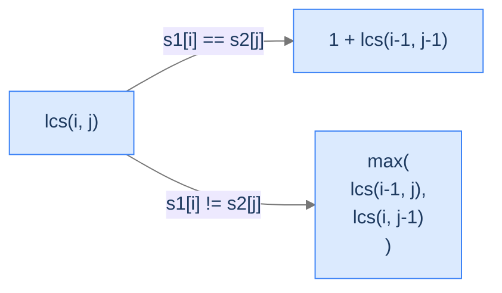
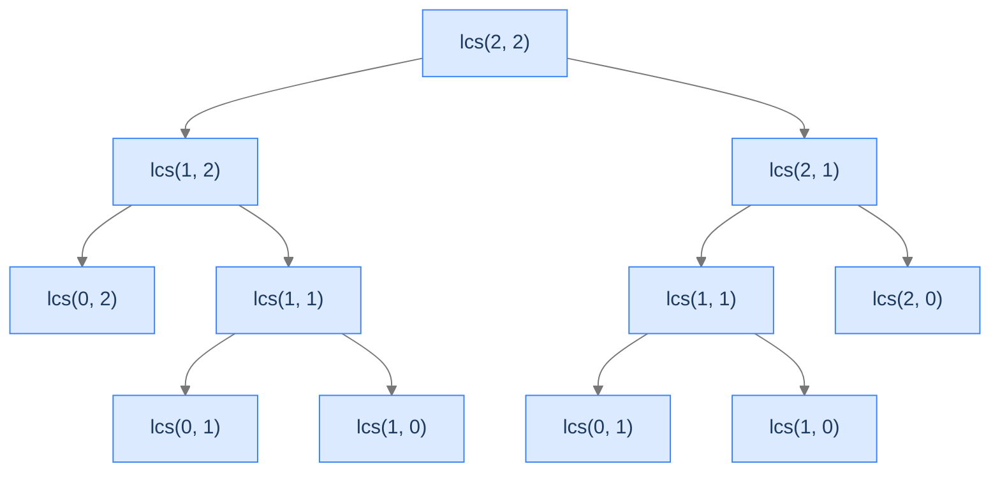
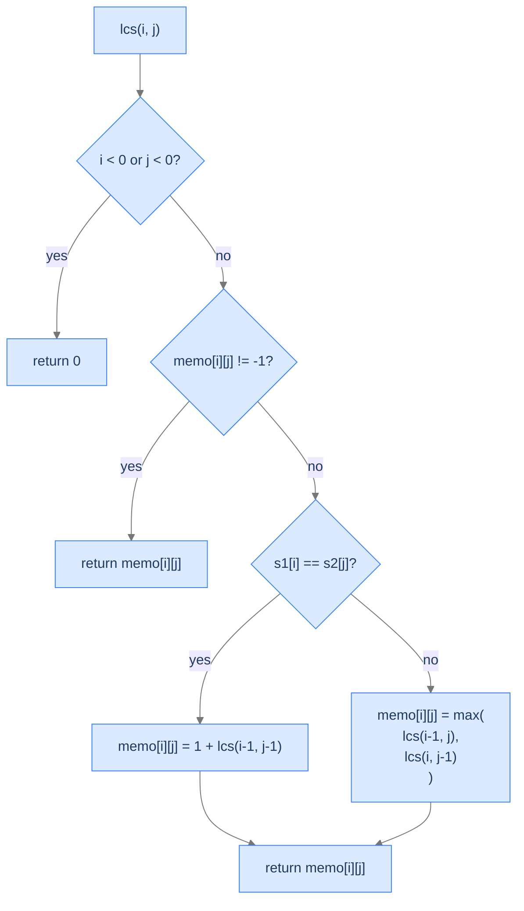
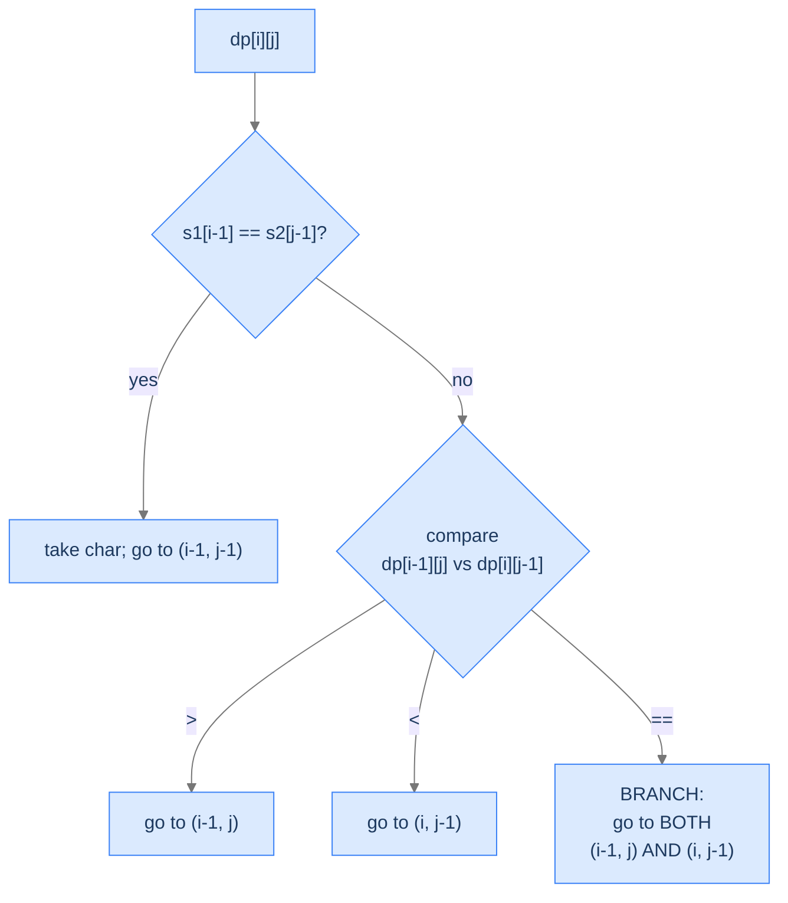

# 3. Longest Common Subsequence

You're using a diff tool. Two versions of a file slide side by side; lines that match are highlighted, lines that changed are flagged. The tool isn't comparing lines verbatim — it's finding the longest *sequence* of identical lines, in the same order, with arbitrary insertions and deletions allowed in between. That sequence is a longest common subsequence. The same algorithm finds the closest match for a misspelt word in a spell checker, aligns DNA strands in a genomics pipeline, and detects plagiarised paragraphs in essays.

By the end of this lesson you'll know the **Longest Common Subsequence** (LCS) problem, the 2D recurrence that solves it (`dp[i][j] = dp[i-1][j-1] + 1` if last characters match, else `max(dp[i-1][j], dp[i][j-1])`), both top-down and bottom-up implementations, the path-reconstruction trick that returns the actual subsequence, and the variant that finds *all* longest common subsequences when there are ties.

## Table of contents

1. [The Common-Subsequence Problem](#the-common-subsequence-problem)
2. [Optimal Substructure — The Two-Case Recurrence](#optimal-substructure--the-two-case-recurrence)
3. [Overlapping Subproblems — Why DP Wins](#overlapping-subproblems--why-dp-wins)
4. [Top-Down Solution (Memoization)](#top-down-solution-memoization)
5. [Bottom-Up Solution (Tabulation)](#bottom-up-solution-tabulation)
6. [Longest Common Subsequence](#longest-common-subsequence)
7. [Longest Common Subsequence II — All LCSs](#longest-common-subsequence-ii--all-lcss)

***

# The Common-Subsequence Problem

> **Course:** DSA › Algorithms › Dynamic Programming › LCS

Given two strings `s1` (length `m`) and `s2` (length `n`), a **subsequence** of a string is a sequence of characters obtained by deleting zero or more characters without changing the relative order of the rest. The characters do **not** have to be adjacent. (A *substring* requires adjacency; a *subsequence* doesn't.)

```d2
direction: right
s1: "s1 = a b c d e f g h" {
  grid-rows: 1
  grid-columns: 8
  grid-gap: 0
  c0: "a"
  c1: "b" {style.fill: "#fde68a"; style.stroke: "#d97706"}
  c2: "c" {style.fill: "#fde68a"; style.stroke: "#d97706"}
  c3: "d"
  c4: "e"
  c5: "f" {style.fill: "#fde68a"; style.stroke: "#d97706"}
  c6: "g"
  c7: "h"
}
s2: "s2 = b x c l f" {
  grid-rows: 1
  grid-columns: 5
  grid-gap: 0
  c0: "b" {style.fill: "#fde68a"; style.stroke: "#d97706"}
  c1: "x"
  c2: "c" {style.fill: "#fde68a"; style.stroke: "#d97706"}
  c3: "l"
  c4: "f" {style.fill: "#fde68a"; style.stroke: "#d97706"}
}
```

<p align="center"><strong>The longest common subsequence of <code>"abcdefgh"</code> and <code>"bxclf"</code> is <code>"bcf"</code>. Each highlighted character appears in both strings *in the same relative order*. The skipped characters are different in each string.</strong></p>

The brute force is to enumerate every subsequence of `s1` (`2^m` of them) and check which appear in `s2`. That's hopeless for `m > 30`. DP brings it to `O(m × n)`.

> *Predict before reading on — for <code>s1 = "abc"</code>, <code>s2 = "def"</code>, what's the LCS?*

The empty string. No character appears in both. The algorithm correctly returns 0 (or `""`).

---

## Key Takeaway

A subsequence preserves order but allows arbitrary skipping. The LCS is the longest such sequence shared by two strings. Brute force is `O(2^m)`; DP makes it `O(m × n)`.

***

# Optimal Substructure — The Two-Case Recurrence

> **Course:** DSA › Algorithms › Dynamic Programming › LCS

Define `lcs(i, j)` as the length of the LCS of the prefixes `s1[0..i]` and `s2[0..j]`. Look at the *last* characters of both prefixes — `s1[i]` and `s2[j]` — and ask: *what's the relationship between `lcs(i, j)` and `lcs` of smaller prefixes?*

**Case 1 — `s1[i] == s2[j]`.** This shared character can be the last character of an LCS. The LCS is built by taking the LCS of the prefixes one shorter on each side, then appending this character:

```
lcs(i, j) = 1 + lcs(i - 1, j - 1)
```

**Case 2 — `s1[i] != s2[j]`.** At least one of these characters cannot be in the final LCS. We don't know which, so we try both:

```
lcs(i, j) = max( lcs(i - 1, j),                 — drop s1[i]
                 lcs(i, j - 1) )                — drop s2[j]
```

There's a third option in principle — drop both `s1[i]` and `s2[j]`, recursing into `lcs(i-1, j-1)` — but it's redundant. The LCS over `(i-1, j-1)` is already a candidate inside both `lcs(i-1, j)` (which considers the same `j-1` and earlier) and `lcs(i, j-1)`. So `max(lcs(i-1, j), lcs(i, j-1)) ≥ lcs(i-1, j-1)` always.



<p align="center"><strong>The two-case recurrence for LCS. Match → extend the diagonal predecessor. Mismatch → take the better of dropping one side.</strong></p>

**Base case.** When *either* prefix is empty (`i < 0` or `j < 0`), there's no character to compare and the LCS is empty: `lcs(i, j) = 0`.

The state is uniquely `(i, j)` — two indices, so the DP table is 2D.

---

## Why `i < 0` and Not `i == 0`?

When `i = 0`, the prefix `s1[0..0]` still has one character — `s1[0]`. We're not done yet. Only when `i` drops *below* 0 has every character been used up. (Bottom-up tabulation will use a clever shift to avoid negative indices — we'll see how.)

---

## Key Takeaway

`lcs(i, j) = 1 + lcs(i-1, j-1)` if last characters match; otherwise `max(lcs(i-1, j), lcs(i, j-1))`. Two indices → 2D DP. Base case: empty prefix → 0.

***

# Overlapping Subproblems — Why DP Wins

> **Course:** DSA › Algorithms › Dynamic Programming › LCS

A naive recursion on the recurrence calls `lcs(i, j)` from three different parents (`lcs(i+1, j+1)`, `lcs(i+1, j)`, `lcs(i, j+1)`) — each of which has its own three parents — and so on. The same `(i, j)` pair gets recomputed exponentially many times.



<p align="center"><strong>The brute-force call tree explodes. <code>lcs(1,1)</code>, <code>lcs(0,1)</code>, <code>lcs(1,0)</code> all get computed twice in this small example. For larger inputs, the duplication is exponential.</strong></p>

There are only `m × n` distinct `(i, j)` pairs. With memoization or tabulation, each is computed exactly once — total work is `O(m × n)`.

---

## Key Takeaway

The recursion's call graph has only `m × n` distinct nodes, but visits them exponentially many times without caching. Memoization or tabulation collapses this to `O(m × n)`.

***

# Top-Down Solution (Memoization)

> **Course:** DSA › Algorithms › Dynamic Programming › LCS

The top-down implementation translates the recurrence directly into a recursive function with a memo table. The function `lcs(i, j)` checks the memo first; if the answer is already there, return it. Otherwise compute and store.



<p align="center"><strong>The top-down recursion. Three short-circuits (boundary, cache, match) before the recursive case. Each <code>(i, j)</code> pair fills exactly one memo slot.</strong></p>

## Algorithm

> **lcs(i, j, s1, s2, memo):**
>
> 1. If `i < 0` or `j < 0`, return 0.
> 2. If `memo[i][j] != -1`, return the cached value.
> 3. If `s1[i] == s2[j]`, set `memo[i][j] = 1 + lcs(i-1, j-1, ...)`.
> 4. Else set `memo[i][j] = max(lcs(i-1, j, ...), lcs(i, j-1, ...))`.
> 5. Return `memo[i][j]`.

## The Solution


```pseudocode
# Top-down memoized.
function longestCommonSubsequence(s1, s2):
    m ← length(s1); n ← length(s2)
    if m = 0 OR n = 0: return 0
    memo ← m × n grid filled with −1
    return lcs(m − 1, n − 1, s1, s2, memo)

function lcs(i, j, s1, s2, memo):
    if i < 0 OR j < 0:                              # one prefix exhausted
        return 0
    if memo[i][j] ≠ −1:
        return memo[i][j]
    if s1[i] = s2[j]:                               # match — extend the diagonal
        memo[i][j] ← 1 + lcs(i − 1, j − 1, s1, s2, memo)
    else:                                           # mismatch — drop one side, take the better
        memo[i][j] ← max(lcs(i − 1, j, s1, s2, memo), lcs(i, j − 1, s1, s2, memo))
    return memo[i][j]
```

```python run
from typing import List

class Solution:
    def longest_common_subsequence(self, s1: str, s2: str) -> int:
        m, n = len(s1), len(s2)
        if m == 0 or n == 0:
            return 0
        memo: List[List[int]] = [[-1] * n for _ in range(m)]
        return self._lcs(m - 1, n - 1, s1, s2, memo)

    def _lcs(self, i: int, j: int, s1: str, s2: str, memo: List[List[int]]) -> int:
        if i < 0 or j < 0:                       # Either prefix is empty
            return 0
        if memo[i][j] != -1:                     # Already computed
            return memo[i][j]
        if s1[i] == s2[j]:                       # Match — extend the diagonal
            memo[i][j] = 1 + self._lcs(i - 1, j - 1, s1, s2, memo)
        else:                                    # Mismatch — take the best of dropping each side
            memo[i][j] = max(
                self._lcs(i - 1, j, s1, s2, memo),
                self._lcs(i, j - 1, s1, s2, memo)
            )
        return memo[i][j]


if __name__ == "__main__":
    print(Solution().longest_common_subsequence("abcdefgh", "bxclf"))   # 3
```

```java run
import java.util.Arrays;

public class Solution {
    public int longestCommonSubsequence(String s1, String s2) {
        int m = s1.length(), n = s2.length();
        if (m == 0 || n == 0) return 0;
        int[][] memo = new int[m][n];
        for (int[] row : memo) Arrays.fill(row, -1);
        return lcs(m - 1, n - 1, s1, s2, memo);
    }

    private int lcs(int i, int j, String s1, String s2, int[][] memo) {
        if (i < 0 || j < 0) return 0;
        if (memo[i][j] != -1) return memo[i][j];
        if (s1.charAt(i) == s2.charAt(j)) {
            memo[i][j] = 1 + lcs(i - 1, j - 1, s1, s2, memo);
        } else {
            memo[i][j] = Math.max(lcs(i - 1, j, s1, s2, memo), lcs(i, j - 1, s1, s2, memo));
        }
        return memo[i][j];
    }

    public static void main(String[] args) {
        System.out.println(new Solution().longestCommonSubsequence("abcdefgh", "bxclf"));
    }
}
```

```c run
#include <stdio.h>
#include <string.h>

int memo[1000][1000];

int lcs(int i, int j, const char *s1, const char *s2) {
    if (i < 0 || j < 0) return 0;
    if (memo[i][j] != -1) return memo[i][j];
    if (s1[i] == s2[j]) {
        memo[i][j] = 1 + lcs(i - 1, j - 1, s1, s2);
    } else {
        int a = lcs(i - 1, j, s1, s2);
        int b = lcs(i, j - 1, s1, s2);
        memo[i][j] = a > b ? a : b;
    }
    return memo[i][j];
}

int longest_common_subsequence(const char *s1, const char *s2) {
    int m = (int) strlen(s1), n = (int) strlen(s2);
    if (m == 0 || n == 0) return 0;
    for (int i = 0; i < m; i++) for (int j = 0; j < n; j++) memo[i][j] = -1;
    return lcs(m - 1, n - 1, s1, s2);
}

int main(void) {
    printf("%d\n", longest_common_subsequence("abcdefgh", "bxclf"));   // 3
    return 0;
}
```

```scala run
class Solution {
  def longestCommonSubsequence(s1: String, s2: String): Int = {
    val (m, n) = (s1.length, s2.length)
    if (m == 0 || n == 0) return 0
    val memo = Array.fill(m, n)(-1)
    lcs(m - 1, n - 1, s1, s2, memo)
  }

  private def lcs(i: Int, j: Int, s1: String, s2: String, memo: Array[Array[Int]]): Int = {
    if (i < 0 || j < 0) return 0
    if (memo(i)(j) != -1) return memo(i)(j)
    memo(i)(j) =
      if (s1(i) == s2(j)) 1 + lcs(i - 1, j - 1, s1, s2, memo)
      else math.max(lcs(i - 1, j, s1, s2, memo), lcs(i, j - 1, s1, s2, memo))
    memo(i)(j)
  }
}

object Main extends App {
  println(new Solution().longestCommonSubsequence("abcdefgh", "bxclf"))   // 3
}
```


---

## Complexity Analysis

| Aspect | Cost | Why |
|---|---|---|
| Time | `O(m × n)` worst case, `O(min(m, n))` best | Worst: every `(i, j)` cell gets computed when no characters match. Best: every character matches and the recursion walks the diagonal. The memo *allocation* alone is `O(m × n)`, so that's the floor. |
| Space | `O(m × n)` | Memo table + recursion stack (up to `m + n` frames). |

***

# Bottom-Up Solution (Tabulation)

> **Course:** DSA › Algorithms › Dynamic Programming › LCS

Bottom-up fills a 2D table iteratively from the smallest subproblem (empty prefixes) outward. **The table is `(m+1) × (n+1)`, not `m × n`** — this is the trick that lets us avoid negative indices.

The shift: in the table, index `i` represents *the number of characters considered* from `s1`, not the index of the last character. So `i` ranges from `0` (empty prefix) to `m` (full string), giving `m + 1` rows. Same for `j` and `n + 1` columns. The base case "empty prefix" lives in row 0 and column 0, all zeros. The character at "position `i`" of the prefix is at string index `i - 1`.

```d2
direction: right
table: "dp table for s1 = 'ab', s2 = 'acb' — shape (m+1) × (n+1) = 3 × 4" {
  grid-rows: 4
  grid-columns: 5
  grid-gap: 0
  h0:  ""
  h1:  "j=0<br/>(empty)"
  h2:  "j=1<br/>'a'"
  h3:  "j=2<br/>'ac'"
  h4:  "j=3<br/>'acb'"
  r0:  "i=0 (empty)"
  v00: "0"
  v01: "0"
  v02: "0"
  v03: "0"
  r1:  "i=1 'a'"
  v10: "0"
  v11: "1"
  v12: "1"
  v13: "1"
  r2:  "i=2 'ab'"
  v20: "0"
  v21: "1"
  v22: "1"
  v23: "2" {style.fill: "#fde68a"; style.stroke: "#d97706"}
}
```

<p align="center"><strong>The DP table for <code>s1 = "ab"</code>, <code>s2 = "acb"</code>. The empty-prefix base cases are row 0 and column 0 (all zeros). The answer is in <code>dp[m][n]</code> = <code>dp[2][3]</code> = 2 (the LCS is "ab").</strong></p>

## Why `(m+1) × (n+1)` — and Why Compare `s1[i-1]` with `s2[j-1]`?

Because `i` now means "how many characters" not "which character." So the *last* character of the considered prefix is at string index `i - 1`. The recurrence is the same as before, just shifted by one in the indexing:

- If `s1[i-1] == s2[j-1]` → `dp[i][j] = dp[i-1][j-1] + 1`.
- Else → `dp[i][j] = max(dp[i-1][j], dp[i][j-1])`.

The traversal order — row by row, left to right — guarantees that when we compute `dp[i][j]`, all three predecessors (`dp[i-1][j-1]`, `dp[i-1][j]`, `dp[i][j-1]`) are already filled.

## Algorithm

> 1. If `m == 0` or `n == 0`, return 0.
> 2. Allocate `dp` of size `(m+1) × (n+1)`, initialised to 0 — base cases.
> 3. For `i` from 1 to `m`:
>    - For `j` from 1 to `n`:
>      - If `s1[i-1] == s2[j-1]`: `dp[i][j] = dp[i-1][j-1] + 1`.
>      - Else: `dp[i][j] = max(dp[i-1][j], dp[i][j-1])`.
> 4. Return `dp[m][n]`.

***

# Longest Common Subsequence

> **Course:** DSA › Algorithms › Dynamic Programming › LCS

## The Problem

Given two strings `s1` and `s2`, return the length of their longest common subsequence.

```
Input:  s1 = "abcdefgh", s2 = "bxclf"
Output: 3                LCS: "bcf"

Input:  s1 = "xyzabc", s2 = "xzlfcb"
Output: 3                LCS: "xzc" or "xzb"

Input:  s1 = "abc", s2 = "def"
Output: 0                No characters in common
```

---

## Applying the Diagnostic Questions

| # | Question | Answer |
|---|---|---|
| **Q1** | Does the optimal solution decompose by considering the last characters? | **Yes** — match → extend a smaller LCS; mismatch → drop one character. |
| **Q2** | Are there overlapping subproblems? | **Yes** — three parents converge on every `(i, j)`. |
| **Q3** | Is the state 2D? | **Yes** — `dp[i][j]` indexed by *both* prefix lengths. |

### Q1 — Why "Yes"?

**Mental model.** Imagine reading both strings *backward*, character by character. At each step you ask: "is the current character of one string the same as the current character of the other?" If yes, this character belongs in the LCS; both strings advance. If no, you have to skip — but which side? You don't know, so try both.

**Concrete numbers.** For `s1 = "ab"`, `s2 = "ab"`: last characters match (`b == b`). LCS is `1 + lcs("a", "a")` = `1 + 1 + lcs("", "")` = `1 + 1 + 0` = 2. ✓

**What breaks otherwise.** If we tried to match characters by index (`s1[k]` vs `s2[k]`), we'd return 1 for `("ab", "ba")` even though the LCS is also 1 ("a" or "b"). But for `("abc", "cab")` index-matching would give 0 (no character at the same position) — yet the LCS is 2 ("ab"). Subsequences allow arbitrary index alignment, so the recurrence has to consider all pairings.

### Q2 — Why "Yes"?

**Mental model.** The state `(i, j)` is reachable from `(i+1, j+1)`, `(i+1, j)`, and `(i, j+1)` — three parents. Run the recursion all the way back and the same `(i, j)` shows up exponentially many times.

**Concrete numbers.** For `s1 = "abc"`, `s2 = "abc"`: brute recursion makes ~ `Catalan(n) × constant` calls — exponential. With memoization: at most 9 cells, 9 calls.

**What breaks otherwise.** Without caching, the recursion is `O(2^{m+n})`. For 20-character strings that's billions of calls; for 50-character strings the universe ends first.

### Q3 — Why "Yes"?

**Mental model.** Every subproblem is fully described by *two* numbers — how much of each string have we considered. There's no way to collapse it to one. If we tried, we'd forget which string we're at on each axis.

**Concrete numbers.** Memo size is `m × n`. For two 1000-character strings, that's 1 million cells — entirely feasible.

**What breaks otherwise.** Two different `(i, j)` pairs are genuinely different subproblems (even if `i + j` is the same), so collapsing to a single index would conflate them.

---

## The Solution (Bottom-Up)


```pseudocode
# Bottom-up tabulation. dp[i][j] = LCS length of s1[0..i−1] and s2[0..j−1].
# Row 0 and column 0 are zero (empty prefix on one side).
function longestCommonSubsequence(s1, s2):
    m ← length(s1); n ← length(s2)
    if m = 0 OR n = 0: return 0
    dp ← (m + 1) × (n + 1) grid of zeros
    for i from 1 to m:
        for j from 1 to n:
            if s1[i − 1] = s2[j − 1]:
                dp[i][j] ← dp[i − 1][j − 1] + 1
            else:
                dp[i][j] ← max(dp[i − 1][j], dp[i][j − 1])
    return dp[m][n]
```

```python run
from typing import List

class Solution:
    def longest_common_subsequence(self, s1: str, s2: str) -> int:
        m, n = len(s1), len(s2)
        if m == 0 or n == 0:
            return 0
        # dp[i][j] = LCS length of s1[0..i-1] and s2[0..j-1].
        # Row 0 and column 0 are zero (empty prefix on one side).
        dp: List[List[int]] = [[0] * (n + 1) for _ in range(m + 1)]
        for i in range(1, m + 1):
            for j in range(1, n + 1):
                if s1[i - 1] == s2[j - 1]:           # Last chars of considered prefixes match
                    dp[i][j] = dp[i - 1][j - 1] + 1
                else:
                    dp[i][j] = max(dp[i - 1][j], dp[i][j - 1])
        return dp[m][n]


if __name__ == "__main__":
    print(Solution().longest_common_subsequence("abcdefgh", "bxclf"))   # 3
```

```java run
public class Solution {
    public int longestCommonSubsequence(String s1, String s2) {
        int m = s1.length(), n = s2.length();
        if (m == 0 || n == 0) return 0;
        int[][] dp = new int[m + 1][n + 1];
        for (int i = 1; i <= m; i++) {
            for (int j = 1; j <= n; j++) {
                if (s1.charAt(i - 1) == s2.charAt(j - 1)) dp[i][j] = dp[i - 1][j - 1] + 1;
                else dp[i][j] = Math.max(dp[i - 1][j], dp[i][j - 1]);
            }
        }
        return dp[m][n];
    }

    public static void main(String[] args) {
        System.out.println(new Solution().longestCommonSubsequence("abcdefgh", "bxclf"));
    }
}
```

```c run
#include <stdio.h>
#include <string.h>

int dp[1001][1001];

int longest_common_subsequence(const char *s1, const char *s2) {
    int m = (int) strlen(s1), n = (int) strlen(s2);
    if (m == 0 || n == 0) return 0;
    for (int i = 0; i <= m; i++) for (int j = 0; j <= n; j++) dp[i][j] = 0;
    for (int i = 1; i <= m; i++) {
        for (int j = 1; j <= n; j++) {
            if (s1[i - 1] == s2[j - 1]) dp[i][j] = dp[i - 1][j - 1] + 1;
            else { int a = dp[i - 1][j], b = dp[i][j - 1]; dp[i][j] = a > b ? a : b; }
        }
    }
    return dp[m][n];
}

int main(void) {
    printf("%d\n", longest_common_subsequence("abcdefgh", "bxclf"));   // 3
    return 0;
}
```

```scala run
class Solution {
  def longestCommonSubsequence(s1: String, s2: String): Int = {
    val (m, n) = (s1.length, s2.length)
    if (m == 0 || n == 0) return 0
    val dp = Array.fill(m + 1, n + 1)(0)
    for (i <- 1 to m; j <- 1 to n) {
      if (s1(i - 1) == s2(j - 1)) dp(i)(j) = dp(i - 1)(j - 1) + 1
      else dp(i)(j) = math.max(dp(i - 1)(j), dp(i)(j - 1))
    }
    dp(m)(n)
  }
}

object Main extends App {
  println(new Solution().longestCommonSubsequence("abcdefgh", "bxclf"))   // 3
}
```


<details>
<summary><strong>Trace — s1 = "ab", s2 = "acb"</strong></summary>

```
Initial dp (3 × 4):
        ""  'a'  'ac'  'acb'
   ""    0    0     0     0
  'a'    0    ?     ?     ?
  'ab'   0    ?     ?     ?

i=1 (s1='a'):
  j=1 ('a'): 'a' == 'a' → dp[1][1] = dp[0][0] + 1 = 1
  j=2 ('c'): 'a' != 'c' → dp[1][2] = max(dp[0][2], dp[1][1]) = max(0, 1) = 1
  j=3 ('b'): 'a' != 'b' → dp[1][3] = max(dp[0][3], dp[1][2]) = max(0, 1) = 1

i=2 (s1='b'):
  j=1 ('a'): 'b' != 'a' → dp[2][1] = max(dp[1][1], dp[2][0]) = max(1, 0) = 1
  j=2 ('c'): 'b' != 'c' → dp[2][2] = max(dp[1][2], dp[2][1]) = max(1, 1) = 1
  j=3 ('b'): 'b' == 'b' → dp[2][3] = dp[1][2] + 1 = 1 + 1 = 2

Final dp:
        ""  'a'  'ac'  'acb'
   ""    0    0     0     0
  'a'    0    1     1     1
  'ab'   0    1     1     2  ←

dp[2][3] = 2 ✓ (LCS = "ab")
```

</details>

---

## Complexity Analysis

| Aspect | Cost | Why |
|---|---|---|
| Time | `O(m × n)` | One pass through the table; constant work per cell. |
| Space | `O(m × n)` | The DP table. Reducible to `O(min(m, n))` by keeping only the previous row. |

---

## Edge Cases

| Case | Example | Expected | Reasoning |
|---|---|---|---|
| Either string empty | `s1 = ""`, `s2 = "abc"` | `0` | Guard returns 0. The table's row 0 and column 0 are all zero anyway. |
| Identical strings | `s1 = "abc"`, `s2 = "abc"` | `3` | Diagonal matches every step. |
| Disjoint alphabets | `s1 = "abc"`, `s2 = "def"` | `0` | No `==` ever fires; every cell takes the `max` branch and stays 0. |
| One string is a subsequence of the other | `s1 = "abc"`, `s2 = "axbycz"` | `3` | LCS is `s1` itself. |
| Repeated characters | `s1 = "aaa"`, `s2 = "aa"` | `2` | The shorter string aligns entirely. |

---

## Final Takeaway

LCS is the canonical 2D-state DP: prefix length on one axis, prefix length on the other. The recurrence has two branches — match (extend the diagonal predecessor) or mismatch (take the better of the two predecessors). The pattern recurs for every "compare two sequences" DP problem in the rest of this section.

***

# Longest Common Subsequence II — All LCSs

> **Course:** DSA › Algorithms › Dynamic Programming › LCS

The standard LCS returns one number — the length. **LCS II** returns *all* longest common subsequences, in case there are ties (e.g. `s1 = "xyzabc", s2 = "xzlfcb"` has both `"xzc"` and `"xzb"` of length 3).

The trick: build the DP table the same way, then **backtrack from `dp[m][n]`** following the choices that led to the maximum. Every fork in the backtrack produces another candidate; we collect them all in a set to deduplicate.

## The Problem

Given two strings `s1` and `s2`, return all longest common subsequences (in any order).

```
Input:  s1 = "abcdefgh", s2 = "bxclf"
Output: ["bcf"]

Input:  s1 = "xyzabc", s2 = "xzlfcb"
Output: ["xzc", "xzb"]

Input:  s1 = "abc", s2 = "def"
Output: []
```

---

## Backtracking Through the DP Table

After the DP table is built, walk from `dp[m][n]` toward `dp[0][0]`, making decisions based on the cell values:

- **`s1[i-1] == s2[j-1]`** → this character is in *every* LCS that passes through this cell. Prepend it; recurse to `(i-1, j-1)`.
- **`s1[i-1] != s2[j-1]`** → walk in the direction of the larger predecessor (or both, if equal — that's where ties branch).



<p align="center"><strong>Backtracking decisions. Match → take char; mismatch → walk toward larger predecessor; tie → branch into both.</strong></p>

## The Solution


```pseudocode
# Build the dp table, then backtrack from dp[m][n] collecting every distinct LCS string.
function allLongestCommonSubsequences(s1, s2):
    m ← length(s1); n ← length(s2)
    if m = 0 OR n = 0: return empty list

    dp ← (m + 1) × (n + 1) grid of zeros
    for i from 1 to m:
        for j from 1 to n:
            if s1[i − 1] = s2[j − 1]:
                dp[i][j] ← dp[i − 1][j − 1] + 1
            else:
                dp[i][j] ← max(dp[i − 1][j], dp[i][j − 1])

    results ← empty Set
    backtrack(dp, s1, s2, m, n, empty list, results)
    return list of results

function backtrack(dp, s1, s2, i, j, current, results):
    if i = 0 OR j = 0:                              # boundary — flush the path as one LCS
        add reverse(current) joined to a string into results
        return
    if s1[i − 1] = s2[j − 1]:                       # match — take the char, go diagonally
        append s1[i − 1] to current
        backtrack(dp, s1, s2, i − 1, j − 1, current, results)
        remove last element of current
    else:                                           # mismatch — recurse toward each predecessor that ties the maximum
        if dp[i − 1][j] ≥ dp[i][j − 1]:
            backtrack(dp, s1, s2, i − 1, j, current, results)
        if dp[i][j − 1] ≥ dp[i − 1][j]:
            backtrack(dp, s1, s2, i, j − 1, current, results)
```

```python run
from typing import List, Set

class Solution:
    def all_longest_common_subsequences(self, s1: str, s2: str) -> List[str]:
        m, n = len(s1), len(s2)
        if m == 0 or n == 0:
            return []
        # Build the DP table.
        dp: List[List[int]] = [[0] * (n + 1) for _ in range(m + 1)]
        for i in range(1, m + 1):
            for j in range(1, n + 1):
                if s1[i - 1] == s2[j - 1]:
                    dp[i][j] = dp[i - 1][j - 1] + 1
                else:
                    dp[i][j] = max(dp[i - 1][j], dp[i][j - 1])
        # Backtrack to collect all LCS strings.
        results: Set[str] = set()
        self._backtrack(dp, s1, s2, m, n, [], results)
        return list(results)

    def _backtrack(
        self, dp: List[List[int]], s1: str, s2: str,
        i: int, j: int, current: List[str], results: Set[str]
    ) -> None:
        if i == 0 or j == 0:                         # Reached the boundary
            results.add("".join(reversed(current)))
            return
        if s1[i - 1] == s2[j - 1]:                   # Match: take this char, go diagonally
            current.append(s1[i - 1])
            self._backtrack(dp, s1, s2, i - 1, j - 1, current, results)
            current.pop()
        else:                                        # Mismatch: walk toward the bigger predecessor(s)
            if dp[i - 1][j] >= dp[i][j - 1]:
                self._backtrack(dp, s1, s2, i - 1, j, current, results)
            if dp[i][j - 1] >= dp[i - 1][j]:
                self._backtrack(dp, s1, s2, i, j - 1, current, results)


if __name__ == "__main__":
    print(sorted(Solution().all_longest_common_subsequences("xyzabc", "xzlfcb")))   # ['xzb', 'xzc']
```

```java run
import java.util.*;

public class Solution {
    public List<String> allLongestCommonSubsequences(String s1, String s2) {
        int m = s1.length(), n = s2.length();
        if (m == 0 || n == 0) return new ArrayList<>();
        int[][] dp = new int[m + 1][n + 1];
        for (int i = 1; i <= m; i++) {
            for (int j = 1; j <= n; j++) {
                if (s1.charAt(i - 1) == s2.charAt(j - 1)) dp[i][j] = dp[i - 1][j - 1] + 1;
                else dp[i][j] = Math.max(dp[i - 1][j], dp[i][j - 1]);
            }
        }
        Set<String> results = new HashSet<>();
        StringBuilder current = new StringBuilder();
        backtrack(dp, s1, s2, m, n, current, results);
        return new ArrayList<>(results);
    }

    private void backtrack(int[][] dp, String s1, String s2, int i, int j, StringBuilder cur, Set<String> res) {
        if (i == 0 || j == 0) { res.add(cur.reverse().toString()); cur.reverse(); return; }
        if (s1.charAt(i - 1) == s2.charAt(j - 1)) {
            cur.append(s1.charAt(i - 1));
            backtrack(dp, s1, s2, i - 1, j - 1, cur, res);
            cur.deleteCharAt(cur.length() - 1);
        } else {
            if (dp[i - 1][j] >= dp[i][j - 1]) backtrack(dp, s1, s2, i - 1, j, cur, res);
            if (dp[i][j - 1] >= dp[i - 1][j]) backtrack(dp, s1, s2, i, j - 1, cur, res);
        }
    }
}
```

```c run
#include <stdio.h>
#include <string.h>

int dp[51][51];
char results[1024][51];
int result_count = 0;

void add_result(const char *s, int len) {
    char buf[51];
    for (int k = 0; k < len; k++) buf[k] = s[len - 1 - k];
    buf[len] = 0;
    for (int k = 0; k < result_count; k++) if (strcmp(results[k], buf) == 0) return;
    strcpy(results[result_count++], buf);
}

void backtrack(const char *s1, const char *s2, int i, int j, char *cur, int len) {
    if (i == 0 || j == 0) { add_result(cur, len); return; }
    if (s1[i - 1] == s2[j - 1]) {
        cur[len] = s1[i - 1];
        backtrack(s1, s2, i - 1, j - 1, cur, len + 1);
    } else {
        if (dp[i - 1][j] >= dp[i][j - 1]) backtrack(s1, s2, i - 1, j, cur, len);
        if (dp[i][j - 1] >= dp[i - 1][j]) backtrack(s1, s2, i, j - 1, cur, len);
    }
}
```

```scala run
class Solution {
  def allLongestCommonSubsequences(s1: String, s2: String): List[String] = {
    val (m, n) = (s1.length, s2.length)
    if (m == 0 || n == 0) return Nil
    val dp = Array.fill(m + 1, n + 1)(0)
    for (i <- 1 to m; j <- 1 to n) {
      dp(i)(j) = if (s1(i - 1) == s2(j - 1)) dp(i - 1)(j - 1) + 1
                 else math.max(dp(i - 1)(j), dp(i)(j - 1))
    }
    val results = scala.collection.mutable.HashSet[String]()
    def backtrack(i: Int, j: Int, cur: String): Unit = {
      if (i == 0 || j == 0) { results += cur.reverse; return }
      if (s1(i - 1) == s2(j - 1)) backtrack(i - 1, j - 1, cur + s1(i - 1))
      else {
        if (dp(i - 1)(j) >= dp(i)(j - 1)) backtrack(i - 1, j, cur)
        if (dp(i)(j - 1) >= dp(i - 1)(j)) backtrack(i, j - 1, cur)
      }
    }
    backtrack(m, n, "")
    results.toList
  }
}
```


---

## Complexity Analysis

| Aspect | Cost | Why |
|---|---|---|
| Time | `O(m × n + k × L)` | DP build: `O(m × n)`. Backtrack visits at most `k` distinct LCSs of length `L` each. In the worst case (highly ambiguous matches) `k` can be exponential, but for typical inputs it's small. |
| Space | `O(m × n + k × L)` | DP table + storage for the LCS set. |

---

## Final Takeaway

When the DP gives a *count* but you want the *witness*, backtrack through the table following the choices that produced each cell's value. Ties become branches; matched cells force a step; the set of reached endpoints is the answer set. This pattern recurs throughout the section — **the table itself encodes the structure of every optimal solution; reading it backward materialises them.**

> *Transfer challenge for the next lesson:* LCS allows skipping characters arbitrarily — the matched characters needn't be adjacent in either string. What changes if we *require* adjacency on both sides (a *common substring*)? Predict whether the recurrence stays the same or breaks.

<details>
<summary><strong>Answer</strong></summary>

It breaks. With adjacency required, a mismatch *immediately* breaks the running match — the cell becomes 0, not the max of two predecessors. The next lesson, **Longest Common Substring**, has a different recurrence that captures exactly this behaviour: `dp[i][j] = dp[i-1][j-1] + 1` if match, else **0** (not max).

</details>
